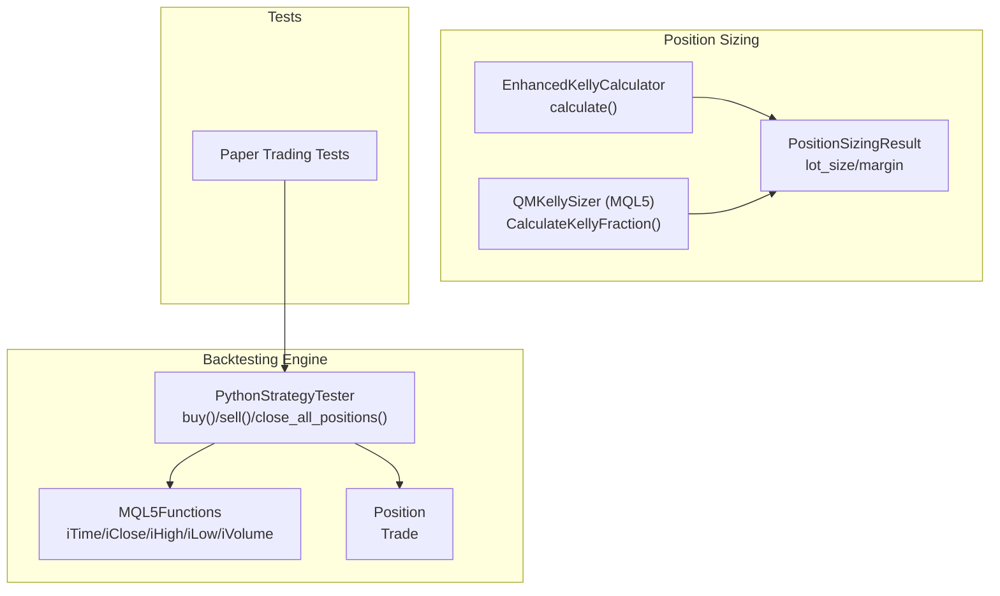
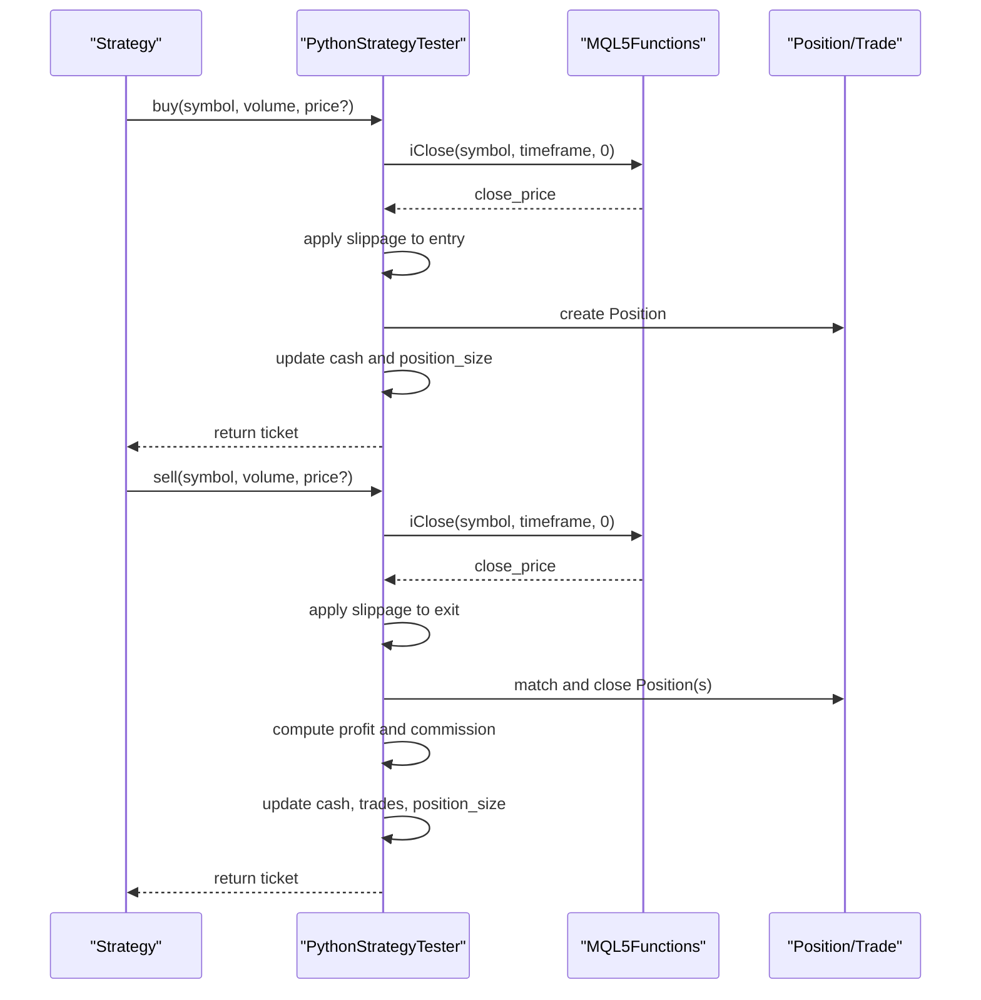
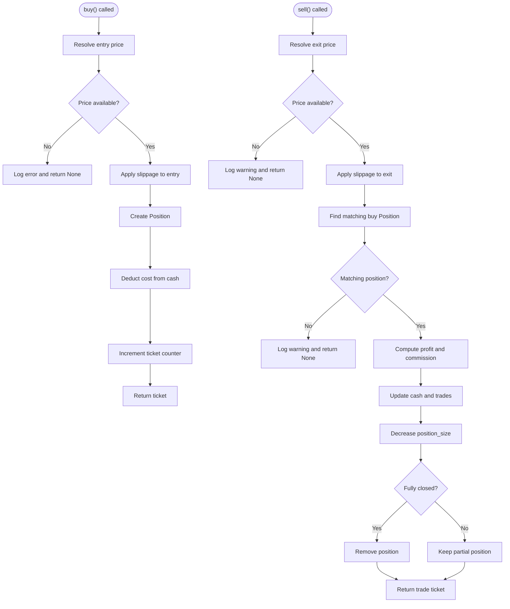
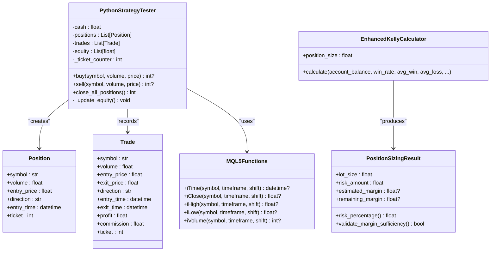

# Trading Operations and Position Management

<cite>
**Referenced Files in This Document**
- [mt5_engine.py](file://src/backtesting/mt5_engine.py)
- [position_sizing_result.py](file://src/risk/models/position_sizing_result.py)
- [enhanced_kelly.py](file://src/position_sizing/enhanced_kelly.py)
- [KellySizer.mqh](file://src/mql5/Include/QuantMind/Risk/KellySizer.mqh)
- [test_paper_trading.py](file://mcp-metatrader5-server/tests/test_paper_trading.py)
- [test_paper_trading_e2e.py](file://tests/e2e/test_paper_trading_e2e.py)
</cite>

## Table of Contents
1. [Introduction](#introduction)
2. [Project Structure](#project-structure)
3. [Core Components](#core-components)
4. [Architecture Overview](#architecture-overview)
5. [Detailed Component Analysis](#detailed-component-analysis)
6. [Dependency Analysis](#dependency-analysis)
7. [Performance Considerations](#performance-considerations)
8. [Troubleshooting Guide](#troubleshooting-guide)
9. [Conclusion](#conclusion)
10. [Appendices](#appendices)

## Introduction
This document explains the trading operations subsystem focused on position management and order execution. It covers the buy() and sell() methods, parameter handling, slippage simulation, margin/cost accounting, position tracking via Position and Trade dataclasses, ticket numbering, equity curve updates, and close_all_positions(). Practical examples demonstrate order placement, position sizing calculations, commission handling, and profit/loss computation. Edge cases, error conditions, and best practices for realistic trading simulation are also addressed.

## Project Structure
The trading operations subsystem spans several modules:
- Backtesting engine with MQL5-style function overloading and position tracking
- Position sizing models and calculators for realistic risk management
- MQL5-based position sizing utilities for EA integration
- Tests validating paper trading behavior and position lifecycle

**Diagram sources**
- [mt5_engine.py](file://src/backtesting/mt5_engine.py#L320-L991)
- [position_sizing_result.py](file://src/risk/models/position_sizing_result.py#L16-L246)
- [enhanced_kelly.py](file://src/position_sizing/enhanced_kelly.py#L128-L377)
- [KellySizer.mqh](file://src/mql5/Include/QuantMind/Risk/KellySizer.mqh#L50-L349)
- [test_paper_trading.py](file://mcp-metatrader5-server/tests/test_paper_trading.py#L1-L200)
- [test_paper_trading_e2e.py](file://tests/e2e/test_paper_trading_e2e.py#L1-L200)

**Section sources**
- [mt5_engine.py](file://src/backtesting/mt5_engine.py#L320-L991)
- [position_sizing_result.py](file://src/risk/models/position_sizing_result.py#L16-L246)
- [enhanced_kelly.py](file://src/position_sizing/enhanced_kelly.py#L128-L377)
- [KellySizer.mqh](file://src/mql5/Include/QuantMind/Risk/KellySizer.mqh#L50-L349)
- [test_paper_trading.py](file://mcp-metatrader5-server/tests/test_paper_trading.py#L1-L200)
- [test_paper_trading_e2e.py](file://tests/e2e/test_paper_trading_e2e.py#L1-L200)

## Core Components
- PythonStrategyTester: Central orchestrator for strategy execution, market data access, order lifecycle, and performance metrics.
- Position and Trade dataclasses: Immutable records for open positions and executed trades.
- MQL5Functions: MQL5-compatible wrappers for time and price access.
- Position sizing models: Enhanced Kelly calculator and MQL5 Kelly sizer for scientific, safe position sizing.

Key responsibilities:
- Parameter handling for buy/sell (symbol, volume, optional price)
- Slippage simulation applied to entry/exit prices
- Cost and margin accounting (standard lot multiplier)
- Ticket numbering and position tracking
- Equity curve updates using unrealized P/L
- Close-all logic and partial-close matching

**Section sources**
- [mt5_engine.py](file://src/backtesting/mt5_engine.py#L124-L148)
- [mt5_engine.py](file://src/backtesting/mt5_engine.py#L569-L690)
- [mt5_engine.py](file://src/backtesting/mt5_engine.py#L822-L833)

## Architecture Overview
The subsystem integrates strategy execution with a simulated broker environment. Orders trigger position creation or closure, updating cash, positions, trades, and the equity curve. Position sizing feeds into order sizing decisions.

**Diagram sources**
- [mt5_engine.py](file://src/backtesting/mt5_engine.py#L569-L690)
- [mt5_engine.py](file://src/backtesting/mt5_engine.py#L154-L313)

## Detailed Component Analysis

### Buy/Sell Order Lifecycle
- buy():
  - Resolves entry price from current bar close if not provided
  - Applies slippage to simulate realistic fill
  - Creates a Position with symbol, volume, entry_price, direction, timestamps, and ticket
  - Deducts cost from cash (standard lot multiplier)
  - Increments ticket counter and returns ticket
- sell():
  - Resolves exit price from current bar close if not provided
  - Applies slippage to simulate realistic fill
  - Matches existing buy Position by symbol
  - Computes realized profit and commission
  - Updates cash, trades, and position_size
  - Removes fully closed positions
  - Returns ticket of the closed trade

**Diagram sources**
- [mt5_engine.py](file://src/backtesting/mt5_engine.py#L569-L690)

**Section sources**
- [mt5_engine.py](file://src/backtesting/mt5_engine.py#L569-L690)

### Position and Trade Dataclasses
- Position: Tracks open positions with symbol, volume, entry_price, direction, entry_time, and ticket.
- Trade: Records completed executions with symbol, volume, entry/exit prices, direction, entry/exit times, profit, commission, and ticket.

These structures enable deterministic state tracking and auditability.

**Section sources**
- [mt5_engine.py](file://src/backtesting/mt5_engine.py#L124-L148)

### Ticket Numbering System
- A monotonically increasing ticket counter starts at 1 and increments after each order/trade submission.
- Tickets uniquely identify positions and trades for logging and reconciliation.

**Section sources**
- [mt5_engine.py](file://src/backtesting/mt5_engine.py#L394-L394)
- [mt5_engine.py](file://src/backtesting/mt5_engine.py#L589-L596)
- [mt5_engine.py](file://src/backtesting/mt5_engine.py#L640-L651)

### Equity Curve Updates
- The equity curve is updated each bar by summing cash plus unrealized P/L for open buy positions.
- Unrealized P/L computed using current close price minus entry price, scaled by standard lot multiplier.

**Section sources**
- [mt5_engine.py](file://src/backtesting/mt5_engine.py#L822-L833)

### close_all_positions() Logic
- Iterates through open positions and attempts to close each via sell() using current close price.
- Returns the number of positions successfully closed.

**Section sources**
- [mt5_engine.py](file://src/backtesting/mt5_engine.py#L675-L689)

### Position Matching and Partial Closures
- sell() matches only buy Positions by symbol.
- Closes up to the requested volume, computing proportional profit and commission.
- Fully closed positions are removed; partial closures reduce volume.

**Section sources**
- [mt5_engine.py](file://src/backtesting/mt5_engine.py#L630-L670)

### Parameter Handling and Validation
- buy()/sell() accept symbol, volume, and optional price.
- If price is omitted, the current bar close is used.
- Errors are logged and None returned when price retrieval fails.

**Section sources**
- [mt5_engine.py](file://src/backtesting/mt5_engine.py#L580-L584)
- [mt5_engine.py](file://src/backtesting/mt5_engine.py#L621-L625)

### Slippage Simulation
- buy(): adds slippage to the resolved close price (simulating worse-than-expected fills).
- sell(): subtracts slippage from the resolved close price (simulating worse-than-expected exits).
- Slippage is a configurable scalar affecting entry/exit prices.

**Section sources**
- [mt5_engine.py](file://src/backtesting/mt5_engine.py#L586-L587)
- [mt5_engine.py](file://src/backtesting/mt5_engine.py#L627-L628)

### Margin and Cost Accounting
- Cost deducted on buy: volume × 100000 × entry_price (standard lot multiplier).
- Proceeds on sell: volume × 100000 × exit_price.
- Commission: commission rate × volume × 100000 × exit_price.
- Cash updated accordingly; position_size tracks total open lots.

**Section sources**
- [mt5_engine.py](file://src/backtesting/mt5_engine.py#L602-L603)
- [mt5_engine.py](file://src/backtesting/mt5_engine.py#L637-L638)
- [mt5_engine.py](file://src/backtesting/mt5_engine.py#L661-L662)

### Position Sizing Integration
- Enhanced Kelly calculator computes position size using win rate, payoff ratio, ATR, and volatility adjustments.
- PositionSizingResult encapsulates recommended lot size, risk amount, and margin estimates with validation helpers.
- MQL5 KellySizer provides equivalent calculations for EA-based strategies.

Practical example references:
- Using Enhanced Kelly calculator to derive lot size from risk parameters and market regime quality.
- Using PositionSizingResult to validate margin sufficiency and produce a calculation summary.

**Section sources**
- [enhanced_kelly.py](file://src/position_sizing/enhanced_kelly.py#L190-L377)
- [position_sizing_result.py](file://src/risk/models/position_sizing_result.py#L16-L246)
- [KellySizer.mqh](file://src/mql5/Include/QuantMind/Risk/KellySizer.mqh#L50-L349)

### Paper Trading Tests
- Tests validate paper trading behavior, including order placement, position tracking, and equity progression.
- End-to-end tests ensure close_all_positions() closes remaining positions and final metrics are computed.

**Section sources**
- [test_paper_trading.py](file://mcp-metatrader5-server/tests/test_paper_trading.py#L1-L200)
- [test_paper_trading_e2e.py](file://tests/e2e/test_paper_trading_e2e.py#L1-L200)

## Dependency Analysis

**Diagram sources**
- [mt5_engine.py](file://src/backtesting/mt5_engine.py#L320-L991)
- [position_sizing_result.py](file://src/risk/models/position_sizing_result.py#L16-L246)
- [enhanced_kelly.py](file://src/position_sizing/enhanced_kelly.py#L128-L377)

**Section sources**
- [mt5_engine.py](file://src/backtesting/mt5_engine.py#L320-L991)
- [position_sizing_result.py](file://src/risk/models/position_sizing_result.py#L16-L246)
- [enhanced_kelly.py](file://src/position_sizing/enhanced_kelly.py#L128-L377)

## Performance Considerations
- Slippage and commission are computed per order/trade; keep rates realistic to avoid overfitting simulations.
- Equity updates occur per bar; ensure data alignment to prevent stale price usage.
- Standard lot multiplier is fixed; confirm broker contract sizes align with your backtest assumptions.
- Ticket counter is integer-based; ensure sufficient range for long-running simulations.

[No sources needed since this section provides general guidance]

## Troubleshooting Guide
Common issues and resolutions:
- Price retrieval failure during buy/sell:
  - Symptom: Operation logs an error and returns None.
  - Cause: Missing or invalid price from data source.
  - Resolution: Verify data preparation and ensure non-empty DataFrame with required columns.
- No matching position to close:
  - Symptom: Warning logged; sell returns None.
  - Cause: Attempting to close without an open position of the same symbol.
  - Resolution: Ensure buy() precedes sell() for the same symbol.
- Partial position closure:
  - Behavior: Only up to available volume is closed; remainder persists.
  - Resolution: Plan for partial closes when reducing exposure incrementally.
- Equity curve anomalies:
  - Symptom: Unexpected spikes or drops.
  - Cause: Incorrect slippage sign or mismatched price source.
  - Resolution: Confirm slippage application and price resolution logic.

**Section sources**
- [mt5_engine.py](file://src/backtesting/mt5_engine.py#L580-L584)
- [mt5_engine.py](file://src/backtesting/mt5_engine.py#L621-L625)
- [mt5_engine.py](file://src/backtesting/mt5_engine.py#L630-L670)
- [mt5_engine.py](file://src/backtesting/mt5_engine.py#L822-L833)

## Conclusion
The trading operations subsystem provides a robust, realistic simulation of order execution, position management, and performance tracking. By combining slippage modeling, strict margin/cost accounting, deterministic ticketing, and equity curve updates, it supports accurate backtesting and position sizing workflows. Integrating Enhanced Kelly-based sizing further ensures scientifically grounded, risk-managed position sizes aligned with market regimes.

[No sources needed since this section summarizes without analyzing specific files]

## Appendices

### Practical Examples Index
- Order placement:
  - buy(symbol, volume, price?): resolves price from current bar close if omitted, applies slippage, deducts cost, and returns ticket.
  - sell(symbol, volume, price?): resolves exit price, applies slippage, matches buy position, computes profit/commission, updates cash/trades, and returns ticket.
- Position sizing:
  - Enhanced Kelly calculator: inputs include account balance, win rate, average win/loss, ATR metrics, stop-loss in pips, pip value, and regime quality; outputs recommended lot size and risk amount.
  - PositionSizingResult: validates inputs, computes risk percentage, and provides margin sufficiency checks.
- Profit/loss computation:
  - Realized P/L = (exit_price − entry_price) × volume × 100000
  - Commission = commission_rate × volume × 100000 × exit_price
- Equity curve:
  - Sum of cash plus unrealized P/L for open buy positions using current close price.

**Section sources**
- [mt5_engine.py](file://src/backtesting/mt5_engine.py#L569-L690)
- [mt5_engine.py](file://src/backtesting/mt5_engine.py#L822-L833)
- [enhanced_kelly.py](file://src/position_sizing/enhanced_kelly.py#L190-L377)
- [position_sizing_result.py](file://src/risk/models/position_sizing_result.py#L126-L236)