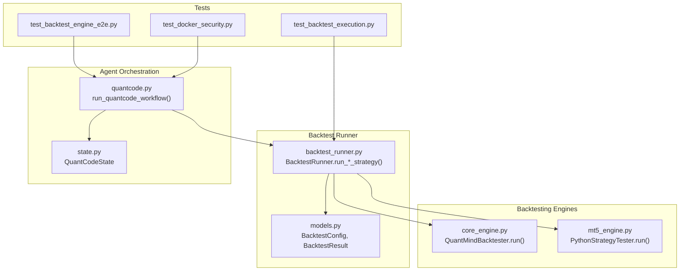
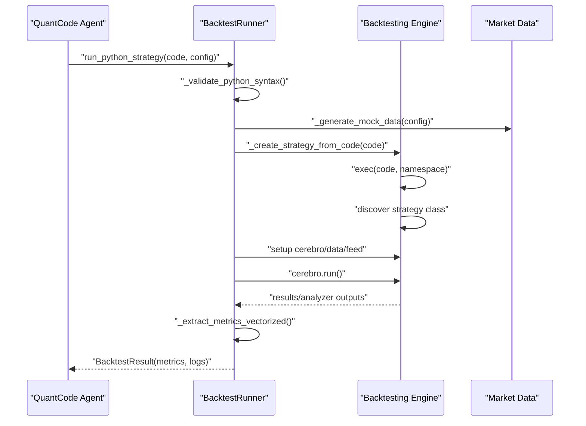
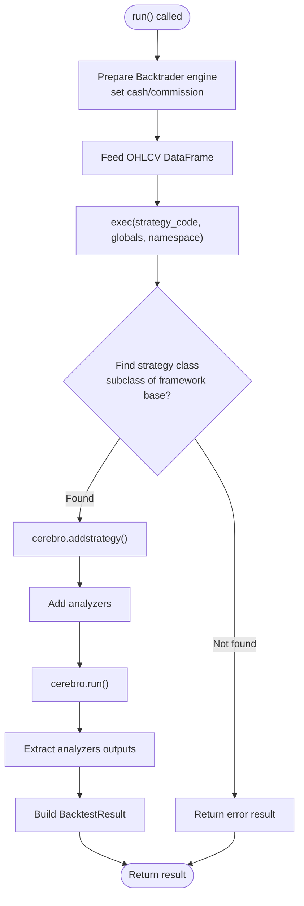
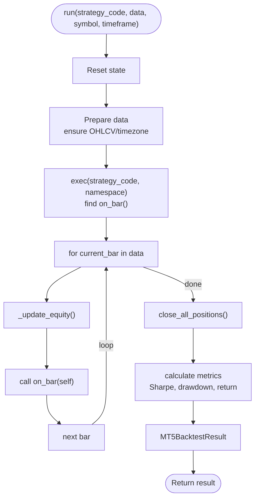
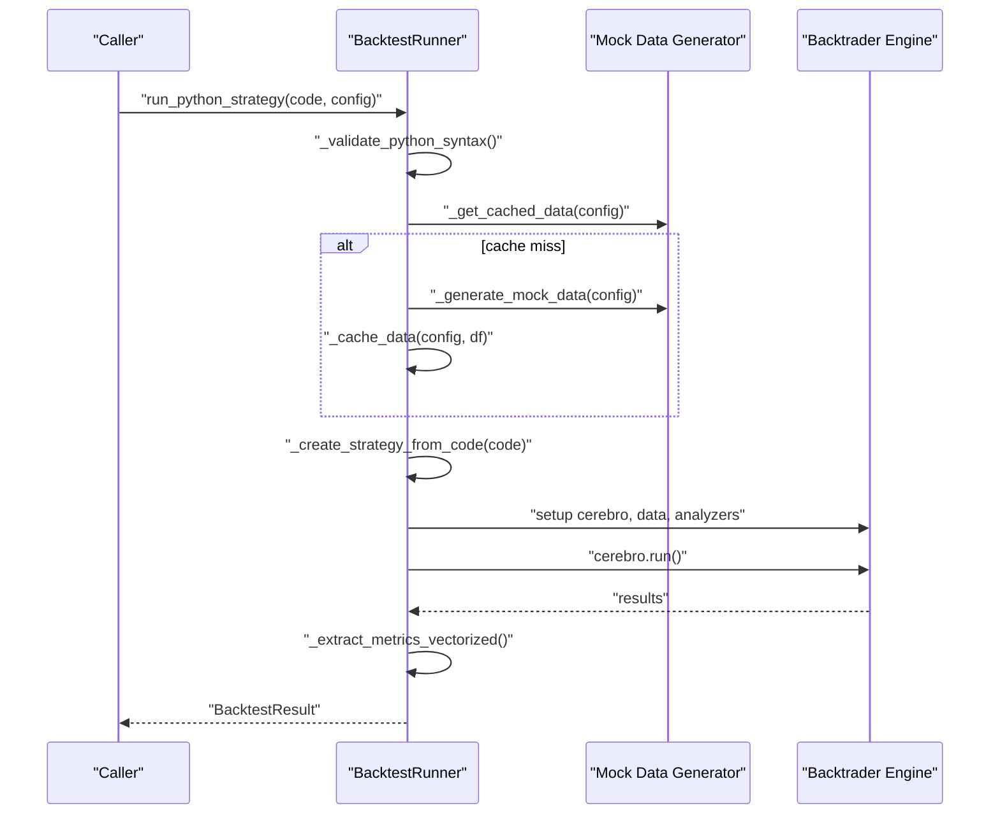
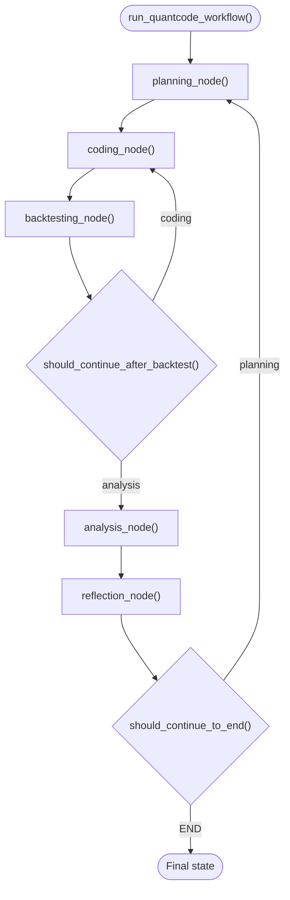
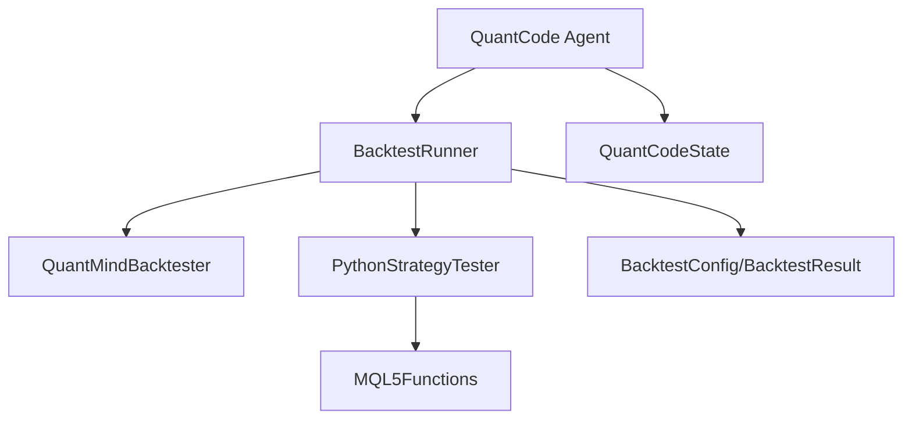

# Strategy Execution Workflow

<cite>
**Referenced Files in This Document**
- [core_engine.py](file://src/backtesting/core_engine.py)
- [mt5_engine.py](file://src/backtesting/mt5_engine.py)
- [backtest_runner.py](file://mcp-servers/backtest-mcp-server/backtest_runner.py)
- [models.py](file://mcp-servers/backtest-mcp-server/models.py)
- [quantcode.py](file://src/agents/quantcode.py)
- [state.py](file://src/agents/state.py)
- [test_backtest_execution.py](file://mcp-servers/backtest-mcp-server/tests/test_backtest_execution.py)
- [test_backtest_engine_e2e.py](file://tests/e2e/test_backtest_engine_e2e.py)
- [test_docker_security.py](file://docker/strategy-agent/tests/test_docker_security.py)
</cite>

## Table of Contents
1. [Introduction](#introduction)
2. [Project Structure](#project-structure)
3. [Core Components](#core-components)
4. [Architecture Overview](#architecture-overview)
5. [Detailed Component Analysis](#detailed-component-analysis)
6. [Dependency Analysis](#dependency-analysis)
7. [Performance Considerations](#performance-considerations)
8. [Troubleshooting Guide](#troubleshooting-guide)
9. [Conclusion](#conclusion)
10. [Appendices](#appendices)

## Introduction
This document explains the Strategy Execution Workflow that orchestrates complete backtest execution across Python and MQL5 environments. It covers how strategies are compiled, validated, and executed; how data is prepared and consumed; how the execution loop processes bars and updates state; and how results are aggregated and surfaced. It also documents the execution environment, namespace management, function discovery, error handling, security considerations, performance optimizations, and best practices for strategy development and validation.

## Project Structure
The Strategy Execution Workflow spans multiple modules:
- Backtesting engines for Python and MQL5
- Backtest runner with configuration and result models
- Agent orchestration for strategy development and backtesting
- Tests validating execution and error handling

**Diagram sources**
- [core_engine.py](file://src/backtesting/core_engine.py#L18-L83)
- [mt5_engine.py](file://src/backtesting/mt5_engine.py#L695-L782)
- [backtest_runner.py](file://mcp-servers/backtest-mcp-server/backtest_runner.py#L84-L223)
- [models.py](file://mcp-servers/backtest-mcp-server/models.py#L16-L127)
- [quantcode.py](file://src/agents/quantcode.py#L250-L276)
- [state.py](file://src/agents/state.py#L42-L53)
- [test_backtest_execution.py](file://mcp-servers/backtest-mcp-server/tests/test_backtest_execution.py#L54-L86)
- [test_backtest_engine_e2e.py](file://tests/e2e/test_backtest_engine_e2e.py#L227-L275)
- [test_docker_security.py](file://docker/strategy-agent/tests/test_docker_security.py#L207-L294)

**Section sources**
- [core_engine.py](file://src/backtesting/core_engine.py#L1-L83)
- [mt5_engine.py](file://src/backtesting/mt5_engine.py#L1-L991)
- [backtest_runner.py](file://mcp-servers/backtest-mcp-server/backtest_runner.py#L1-L603)
- [models.py](file://mcp-servers/backtest-mcp-server/models.py#L1-L273)
- [quantcode.py](file://src/agents/quantcode.py#L1-L276)
- [state.py](file://src/agents/state.py#L1-L76)

## Core Components
- Python backtesting engine: Compiles and runs strategies dynamically, discovers strategy classes, and computes metrics.
- MT5 backtesting engine: Provides MQL5-style functions, simulates bar-by-bar execution, tracks state, and calculates metrics.
- Backtest runner: Validates syntax, prepares data, orchestrates execution, extracts metrics, and aggregates results.
- Agent workflow: Coordinates planning, coding, backtesting, analysis, and reflection for strategy development.
- Models: Define configuration, results, and error types for backtests.

**Section sources**
- [core_engine.py](file://src/backtesting/core_engine.py#L18-L83)
- [mt5_engine.py](file://src/backtesting/mt5_engine.py#L320-L782)
- [backtest_runner.py](file://mcp-servers/backtest-mcp-server/backtest_runner.py#L84-L223)
- [models.py](file://mcp-servers/backtest-mcp-server/models.py#L16-L127)
- [quantcode.py](file://src/agents/quantcode.py#L24-L188)

## Architecture Overview
The workflow integrates agent orchestration with backtesting engines and a runner that validates inputs, manages data, and produces structured results.

**Diagram sources**
- [quantcode.py](file://src/agents/quantcode.py#L250-L276)
- [backtest_runner.py](file://mcp-servers/backtest-mcp-server/backtest_runner.py#L84-L223)
- [core_engine.py](file://src/backtesting/core_engine.py#L18-L83)
- [models.py](file://mcp-servers/backtest-mcp-server/models.py#L102-L127)

## Detailed Component Analysis

### Python Backtesting Engine: QuantMindBacktester.run()
- Strategy compilation: Executes strategy code in an isolated namespace and discovers the strategy class extending the backtesting framework.
- Data ingestion: Accepts OHLCV data as a DataFrame and feeds it into the engine.
- Metrics extraction: Uses analyzers to compute Sharpe ratio, drawdown, returns, and trade counts.
- Logging: Captures stdout during execution for diagnostics.

**Diagram sources**
- [core_engine.py](file://src/backtesting/core_engine.py#L18-L83)

**Section sources**
- [core_engine.py](file://src/backtesting/core_engine.py#L18-L83)

### MT5 Backtesting Engine: PythonStrategyTester.run()
- Execution environment: Provides MQL5-style functions (iTime, iClose, iHigh, iLow, iVolume) and trading operations (buy, sell, close_all_positions).
- State management: Tracks cash, positions, trades, and equity curve; resets state between runs.
- Data preparation: Normalizes DataFrame to expected structure and timezones.
- Execution loop: Iterates bars, updates equity, invokes user-defined function, and closes positions at the end.
- Metrics calculation: Computes Sharpe, drawdown, total return, and builds trade history.

**Diagram sources**
- [mt5_engine.py](file://src/backtesting/mt5_engine.py#L695-L782)
- [mt5_engine.py](file://src/backtesting/mt5_engine.py#L822-L834)
- [mt5_engine.py](file://src/backtesting/mt5_engine.py#L865-L905)

**Section sources**
- [mt5_engine.py](file://src/backtesting/mt5_engine.py#L320-L782)
- [mt5_engine.py](file://src/backtesting/mt5_engine.py#L822-L905)

### Backtest Runner: Orchestrating Python Strategies
- Validation: Performs syntax validation before execution.
- Data caching: Reuses previously generated synthetic data to speed up repeated runs.
- Strategy creation: Compiles code into a namespace and discovers a strategy class; falls back to a default strategy if none is found.
- Execution: Sets up the engine, runs the backtest, and captures logs.
- Metrics extraction: Uses vectorized NumPy operations for performance.
- Result assembly: Builds a structured result with metrics, logs, and timing.

**Diagram sources**
- [backtest_runner.py](file://mcp-servers/backtest-mcp-server/backtest_runner.py#L84-L223)
- [models.py](file://mcp-servers/backtest-mcp-server/models.py#L16-L127)

**Section sources**
- [backtest_runner.py](file://mcp-servers/backtest-mcp-server/backtest_runner.py#L84-L223)
- [models.py](file://mcp-servers/backtest-mcp-server/models.py#L16-L127)

### Agent Workflow: Strategy Development and Backtesting
- Planning, coding, backtesting, analysis, and reflection nodes form a LangGraph workflow.
- The workflow updates state with results and decides whether to iterate or finish based on thresholds.
- The execution interface initializes state and compiles the graph for invocation.

**Diagram sources**
- [quantcode.py](file://src/agents/quantcode.py#L24-L188)
- [quantcode.py](file://src/agents/quantcode.py#L250-L276)
- [state.py](file://src/agents/state.py#L42-L53)

**Section sources**
- [quantcode.py](file://src/agents/quantcode.py#L24-L188)
- [quantcode.py](file://src/agents/quantcode.py#L250-L276)
- [state.py](file://src/agents/state.py#L42-L53)

## Dependency Analysis
- The Python engine depends on the backtesting framework for strategy execution and analyzers.
- The MT5 engine encapsulates MQL5 function overloads and trading operations, with a clear separation between data preparation and execution.
- The runner coordinates engines and models, ensuring consistent configuration and result schemas.
- The agent workflow depends on state definitions and LangGraph for orchestration.

**Diagram sources**
- [backtest_runner.py](file://mcp-servers/backtest-mcp-server/backtest_runner.py#L47-L57)
- [core_engine.py](file://src/backtesting/core_engine.py#L13-L18)
- [mt5_engine.py](file://src/backtesting/mt5_engine.py#L320-L350)
- [models.py](file://mcp-servers/backtest-mcp-server/models.py#L16-L127)
- [quantcode.py](file://src/agents/quantcode.py#L194-L244)
- [state.py](file://src/agents/state.py#L42-L53)

**Section sources**
- [backtest_runner.py](file://mcp-servers/backtest-mcp-server/backtest_runner.py#L47-L57)
- [core_engine.py](file://src/backtesting/core_engine.py#L13-L18)
- [mt5_engine.py](file://src/backtesting/mt5_engine.py#L320-L350)
- [models.py](file://mcp-servers/backtest-mcp-server/models.py#L16-L127)
- [quantcode.py](file://src/agents/quantcode.py#L194-L244)
- [state.py](file://src/agents/state.py#L42-L53)

## Performance Considerations
- Vectorized metrics: The runner uses NumPy arrays for Sharpe, drawdown, and return calculations to reduce overhead.
- Data caching: Reuse of generated synthetic data avoids redundant computations.
- Execution environment isolation: The engines capture stdout to minimize I/O overhead while preserving logs.
- MT5 engine equity updates: Efficient per-bar equity updates avoid recomputation.

Practical tips:
- Prefer vectorized operations for metric extraction.
- Cache frequently used datasets to reduce latency.
- Keep strategy logic concise to minimize runtime overhead.

**Section sources**
- [backtest_runner.py](file://mcp-servers/backtest-mcp-server/backtest_runner.py#L449-L560)
- [mt5_engine.py](file://src/backtesting/mt5_engine.py#L822-L834)

## Troubleshooting Guide
Common issues and resolutions:
- Syntax errors: Detected before execution; review error messages and line numbers.
- Insufficient data: Minimum threshold enforced; extend date ranges or adjust timeframe.
- Runtime errors: Caught and reported with logs; inspect captured output for stack traces.
- Timeout handling: Runner enforces a timeout; reduce strategy complexity or increase limits.
- Docker sandboxing: Container configuration restricts filesystem and capabilities to mitigate risks.

Validation references:
- Syntax and data checks in the runner.
- End-to-end error propagation in the agent workflow.
- Security constraints in the strategy agent container.

**Section sources**
- [backtest_runner.py](file://mcp-servers/backtest-mcp-server/backtest_runner.py#L123-L127)
- [backtest_runner.py](file://mcp-servers/backtest-mcp-server/backtest_runner.py#L193-L222)
- [test_backtest_execution.py](file://mcp-servers/backtest-mcp-server/tests/test_backtest_execution.py#L54-L86)
- [test_backtest_engine_e2e.py](file://tests/e2e/test_backtest_engine_e2e.py#L227-L275)
- [test_docker_security.py](file://docker/strategy-agent/tests/test_docker_security.py#L207-L294)

## Conclusion
The Strategy Execution Workflow integrates robust backtesting engines, a validated runner, and an agent-driven development cycle. It supports dynamic strategy compilation, comprehensive data preparation, bar-by-bar execution, and precise result aggregation. With strong error handling, performance optimizations, and security hardening, it enables reliable strategy testing and validation.

## Appendices

### Strategy Development Patterns
- Use modular logic: Separate indicator calculations, entry/exit rules, and position sizing.
- Validate assumptions: Confirm data availability and symbol correctness before execution.
- Incremental testing: Start with short date ranges and simple strategies.

### Execution Timing and State Management
- Python engine: Strategy class discovered automatically; engine runs to completion.
- MT5 engine: Bar-by-bar loop updates equity and state; positions closed at the end.

### Debugging Techniques
- Capture logs: Utilize captured stdout for runtime diagnostics.
- Analyze metrics: Sharpe, drawdown, and return help identify performance issues.
- Container sandbox: Ensure execution safety and reproducibility.

### Security Considerations
- Execute in restricted containers with read-only filesystems and limited capabilities.
- Enforce memory and CPU quotas to prevent resource exhaustion.
- Drop unnecessary capabilities and limit process creation.

### Best Practices for Strategy Testing and Validation
- Validate configuration: Symbols, timeframes, and date ranges must meet constraints.
- Use representative datasets: Synthetic data suitable for unit tests; real data for integration tests.
- Monitor timeouts: Tune strategy complexity and runner limits accordingly.

**Section sources**
- [models.py](file://mcp-servers/backtest-mcp-server/models.py#L16-L127)
- [mt5_engine.py](file://src/backtesting/mt5_engine.py#L846-L856)
- [test_docker_security.py](file://docker/strategy-agent/tests/test_docker_security.py#L207-L294)