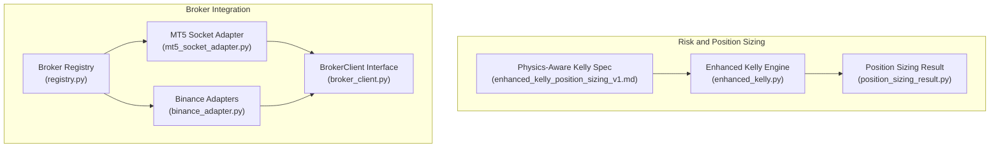
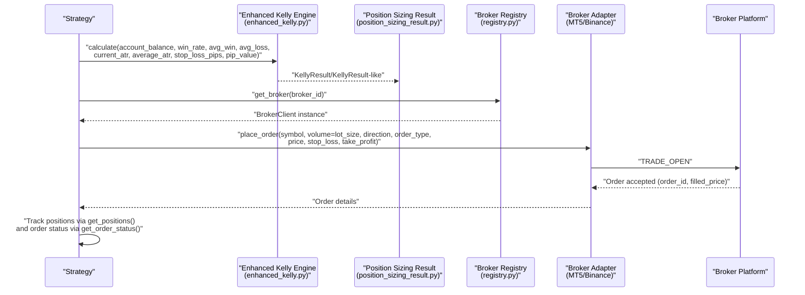
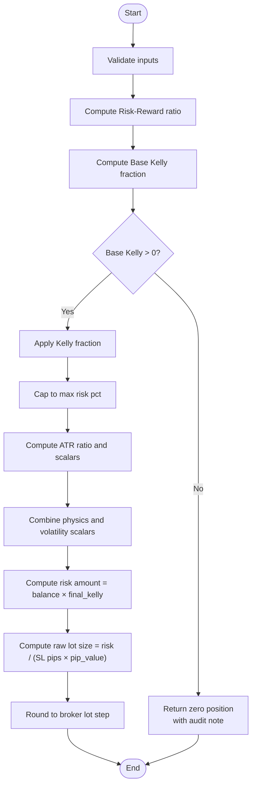
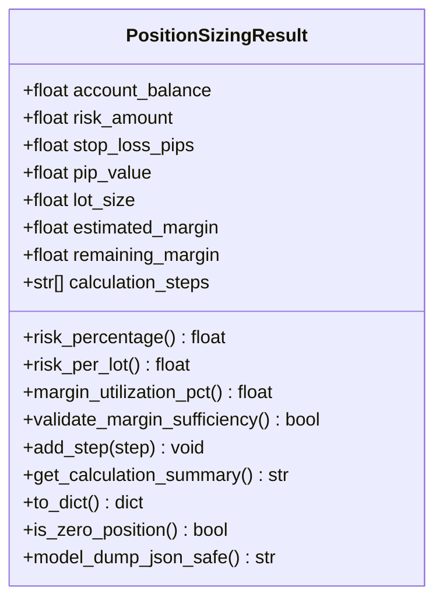
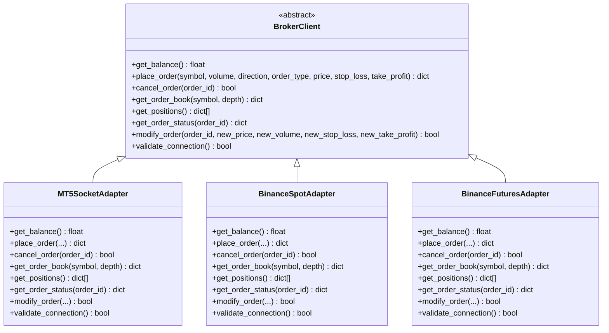
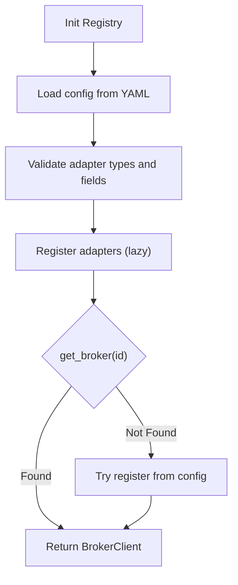
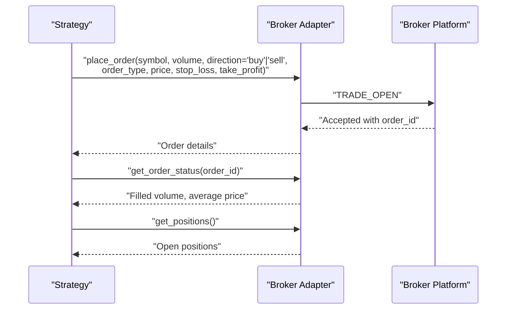
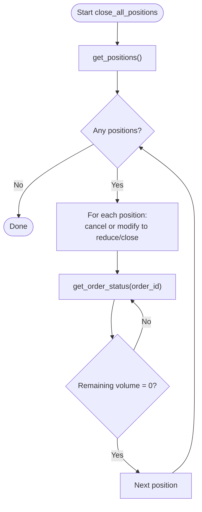
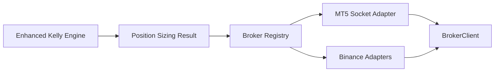

# Trading Operations

<cite>
**Referenced Files in This Document**
- [enhanced_kelly.py](file://src/position_sizing/enhanced_kelly.py)
- [position_sizing_result.py](file://src/risk/models/position_sizing_result.py)
- [broker_client.py](file://src/integrations/crypto/broker_client.py)
- [registry.py](file://src/data/brokers/registry.py)
- [mt5_socket_adapter.py](file://src/data/brokers/mt5_socket_adapter.py)
- [binance_adapter.py](file://src/data/brokers/binance_adapter.py)
- [enhanced_kelly_position_sizing_v1.md](file://docs/trds/enhanced_kelly_position_sizing_v1.md)
</cite>

## Table of Contents
1. [Introduction](#introduction)
2. [Project Structure](#project-structure)
3. [Core Components](#core-components)
4. [Architecture Overview](#architecture-overview)
5. [Detailed Component Analysis](#detailed-component-analysis)
6. [Dependency Analysis](#dependency-analysis)
7. [Performance Considerations](#performance-considerations)
8. [Troubleshooting Guide](#troubleshooting-guide)
9. [Conclusion](#conclusion)
10. [Appendices](#appendices)

## Introduction
This document describes the Trading Operations system with a focus on position management, order execution, slippage handling, commission calculation, and position tracking. It explains how buy() and sell() operations are modeled conceptually, how close_all_positions() enables portfolio liquidation, and how position matching, profit/loss calculations, and equity curve integration work. It also documents standard lot size assumptions, margin requirements, cash flow management, ticket numbering, lifecycle management, error handling, and best practices for slippage modeling and commission impact analysis.

## Project Structure
The Trading Operations system spans several modules:
- Position sizing and risk governance: Enhanced Kelly engine and result model
- Broker abstraction and adapters: Unified client interface and concrete adapters for MT5 and Binance
- Registry: Central factory for broker discovery, configuration, and connection management
- Documentation: Physics-aware Kelly specification and rationale

**Diagram sources**
- [enhanced_kelly.py](file://src/position_sizing/enhanced_kelly.py#L128-L377)
- [position_sizing_result.py](file://src/risk/models/position_sizing_result.py#L16-L246)
- [broker_client.py](file://src/integrations/crypto/broker_client.py#L14-L206)
- [registry.py](file://src/data/brokers/registry.py#L22-L356)
- [mt5_socket_adapter.py](file://src/data/brokers/mt5_socket_adapter.py#L29-L397)
- [binance_adapter.py](file://src/data/brokers/binance_adapter.py#L20-L236)
- [enhanced_kelly_position_sizing_v1.md](file://docs/trds/enhanced_kelly_position_sizing_v1.md#L1-L234)

**Section sources**
- [enhanced_kelly.py](file://src/position_sizing/enhanced_kelly.py#L1-L418)
- [position_sizing_result.py](file://src/risk/models/position_sizing_result.py#L1-L246)
- [broker_client.py](file://src/integrations/crypto/broker_client.py#L1-L248)
- [registry.py](file://src/data/brokers/registry.py#L1-L356)
- [mt5_socket_adapter.py](file://src/data/brokers/mt5_socket_adapter.py#L1-L397)
- [binance_adapter.py](file://src/data/brokers/binance_adapter.py#L1-L236)
- [enhanced_kelly_position_sizing_v1.md](file://docs/trds/enhanced_kelly_position_sizing_v1.md#L1-L234)

## Core Components
- Enhanced Kelly Position Sizing Engine: Computes position size using a three-layer protection system (Kelly fraction, hard risk cap, dynamic volatility adjustment) and rounds to broker lot step.
- Position Sizing Result Model: Encapsulates the final recommendation with risk amount, lot size, optional margin, and an audit trail.
- BrokerClient Interface: Defines the unified contract for balances, order placement/cancellation, order book retrieval, positions, order status, and modifications.
- Broker Adapters: Concrete implementations for MT5 (via socket bridge) and Binance (spot and futures), validating connections and delegating to underlying connectors.
- Broker Registry: Loads configuration, validates adapters, caches connection status, and provides lazy registration and lookup.

Key responsibilities:
- buy() and sell(): Conceptualized as market/limit order placement with direction and optional stop-loss/take-profit parameters.
- close_all_positions(): Conceptualized as retrieving open positions and issuing cancel/modification requests to reduce or close positions.
- Slippage handling: Modeled via order book retrieval and price checks; execution price may differ from requested price.
- Commission calculation: Not explicitly implemented in the referenced modules; recommended to apply a fixed cost per trade or basis points to PnL.
- Position tracking: Managed via broker adapters’ position retrieval and order status queries.
- Cash flow management: Account balance retrieved via BrokerClient; risk amount derived from position sizing; equity curve updates via realized PnL.

**Section sources**
- [enhanced_kelly.py](file://src/position_sizing/enhanced_kelly.py#L81-L126)
- [position_sizing_result.py](file://src/risk/models/position_sizing_result.py#L16-L246)
- [broker_client.py](file://src/integrations/crypto/broker_client.py#L14-L206)
- [registry.py](file://src/data/brokers/registry.py#L22-L356)
- [mt5_socket_adapter.py](file://src/data/brokers/mt5_socket_adapter.py#L167-L222)
- [binance_adapter.py](file://src/data/brokers/binance_adapter.py#L63-L115)

## Architecture Overview
The system integrates position sizing with broker execution through a unified interface. The Enhanced Kelly engine produces a risk amount and lot size, which are translated into order parameters and executed via the selected broker adapter. The registry manages broker configuration and connection health.

**Diagram sources**
- [enhanced_kelly.py](file://src/position_sizing/enhanced_kelly.py#L190-L377)
- [position_sizing_result.py](file://src/risk/models/position_sizing_result.py#L16-L246)
- [registry.py](file://src/data/brokers/registry.py#L222-L252)
- [mt5_socket_adapter.py](file://src/data/brokers/mt5_socket_adapter.py#L167-L222)
- [binance_adapter.py](file://src/data/brokers/binance_adapter.py#L63-L115)

## Detailed Component Analysis

### Enhanced Kelly Position Sizing Engine
- Purpose: Compute safe position size using a layered risk control approach.
- Layers:
  - Kelly Fraction: Reduces full Kelly by a safety factor (default 50%).
  - Hard Risk Cap: Caps risk at a maximum percentage (default 2%).
  - Dynamic Volatility Adjustment: Scales by regime quality and ATR ratio.
- Outputs: Final position size rounded to broker lot step; risk amount equals balance × final Kelly fraction; audit trail of adjustments.

**Diagram sources**
- [enhanced_kelly.py](file://src/position_sizing/enhanced_kelly.py#L190-L377)

**Section sources**
- [enhanced_kelly.py](file://src/position_sizing/enhanced_kelly.py#L128-L377)
- [enhanced_kelly_position_sizing_v1.md](file://docs/trds/enhanced_kelly_position_sizing_v1.md#L19-L87)

### Position Sizing Result Model
- Purpose: Provide a structured, validated result for execution with risk percentage, risk per lot, optional margin fields, and a calculation audit trail.
- Utilities: Risk percentage, risk per lot, margin utilization, sufficiency checks, and JSON-safe serialization.

**Diagram sources**
- [position_sizing_result.py](file://src/risk/models/position_sizing_result.py#L16-L246)

**Section sources**
- [position_sizing_result.py](file://src/risk/models/position_sizing_result.py#L16-L246)

### BrokerClient Interface and Adapters
- BrokerClient defines the unified contract for:
  - get_balance(), place_order(), cancel_order(), get_order_book(), get_positions(), get_order_status(), modify_order(), validate_connection().
- MT5 Socket Adapter:
  - Connects to a remote MT5 via ZMQ socket bridge, sends typed requests, and returns standardized responses with order_id, filled_price, and timestamps.
- Binance Adapters (Spot/Futures):
  - Wrap a connector to provide the same interface for spot and futures markets.

**Diagram sources**
- [broker_client.py](file://src/integrations/crypto/broker_client.py#L14-L206)
- [mt5_socket_adapter.py](file://src/data/brokers/mt5_socket_adapter.py#L29-L397)
- [binance_adapter.py](file://src/data/brokers/binance_adapter.py#L20-L236)

**Section sources**
- [broker_client.py](file://src/integrations/crypto/broker_client.py#L14-L206)
- [mt5_socket_adapter.py](file://src/data/brokers/mt5_socket_adapter.py#L29-L397)
- [binance_adapter.py](file://src/data/brokers/binance_adapter.py#L20-L236)

### Broker Registry
- Loads YAML configuration, substitutes environment variables, validates adapter types, and lazily registers broker instances.
- Maintains connection status cache and supports bulk validation and runtime config reload.

**Diagram sources**
- [registry.py](file://src/data/brokers/registry.py#L92-L252)

**Section sources**
- [registry.py](file://src/data/brokers/registry.py#L22-L356)

### Buy/Sell Execution Workflow (Conceptual)
- buy():
  - Determine symbol, lot size from position sizing, direction "buy".
  - Optionally set stop_loss and take_profit prices.
  - Call place_order(symbol, volume=lot_size, direction="buy", order_type, price, stop_loss, take_profit).
  - Record order_id and track via get_order_status() and get_positions().
- sell():
  - Same as buy() but direction "sell".

**Diagram sources**
- [mt5_socket_adapter.py](file://src/data/brokers/mt5_socket_adapter.py#L167-L222)
- [binance_adapter.py](file://src/data/brokers/binance_adapter.py#L63-L115)

**Section sources**
- [broker_client.py](file://src/integrations/crypto/broker_client.py#L46-L84)
- [mt5_socket_adapter.py](file://src/data/brokers/mt5_socket_adapter.py#L167-L222)
- [binance_adapter.py](file://src/data/brokers/binance_adapter.py#L63-L115)

### close_all_positions() Workflow (Conceptual)
- Retrieve open positions via get_positions().
- For each position, issue a cancel or modify request to reduce/close the position (adapter-dependent).
- Track completion via get_order_status() until remaining volume is zero.

**Diagram sources**
- [broker_client.py](file://src/integrations/crypto/broker_client.py#L125-L145)
- [mt5_socket_adapter.py](file://src/data/brokers/mt5_socket_adapter.py#L278-L320)
- [binance_adapter.py](file://src/data/brokers/binance_adapter.py#L192-L224)

**Section sources**
- [broker_client.py](file://src/integrations/crypto/broker_client.py#L125-L196)
- [mt5_socket_adapter.py](file://src/data/brokers/mt5_socket_adapter.py#L278-L356)
- [binance_adapter.py](file://src/data/brokers/binance_adapter.py#L192-L224)

### Position Matching, PnL, and Equity Curve Integration
- Position matching: Use order_id returned by place_order() to correlate with get_order_status() and get_positions().
- Profit/Loss: Realized PnL can be computed from filled price, direction, and lot size; equity curve updates occur post-execution.
- Equity curve: Aggregate realized PnL across closed positions; incorporate slippage and commissions to reflect true performance.

[No sources needed since this section synthesizes behavior from referenced modules without quoting specific code]

### Standard Lot Size Assumptions, Margin, and Cash Flow
- Standard lot size: The Enhanced Kelly engine uses a default pip value appropriate for standard lot (e.g., $10 per pip per lot for major FX pairs).
- Margin: The Position Sizing Result model optionally includes estimated margin and remaining margin; validate sufficiency before placing orders.
- Cash flow: Account balance retrieved via BrokerClient; risk amount equals balance × final Kelly fraction; ensure sufficient funds for estimated margin plus risk exposure.

**Section sources**
- [enhanced_kelly.py](file://src/position_sizing/enhanced_kelly.py#L89-L104)
- [position_sizing_result.py](file://src/risk/models/position_sizing_result.py#L70-L83)

### Practical Examples and Workflows
- Order placement:
  - Compute lot size using Enhanced Kelly engine.
  - Call place_order() with direction "buy" or "sell", optional stop_loss and take_profit.
  - Monitor via get_order_status() and get_positions().
- Position sizing strategies:
  - Use Half-Kelly (default 50%) for reduced drawdown.
  - Cap risk at 2% per trade (hard risk cap).
  - Adjust for volatility using ATR ratio and regime quality.
- Trade execution:
  - Confirm order acceptance and monitor fill price against order book quotes.
  - Update equity curve with realized PnL minus modeled slippage and commission costs.

**Section sources**
- [enhanced_kelly.py](file://src/position_sizing/enhanced_kelly.py#L190-L377)
- [mt5_socket_adapter.py](file://src/data/brokers/mt5_socket_adapter.py#L167-L222)
- [binance_adapter.py](file://src/data/brokers/binance_adapter.py#L63-L115)

### Ticket Numbering, Lifecycle, and Error Handling
- Ticket numbering: The MT5 adapter assigns a string order_id from the platform; Binance adapters return order identifiers from their connectors.
- Lifecycle:
  - Pending → Filled (partial or full) → Closed (post-close).
  - Use get_order_status() to track filled volume and average price.
- Error handling:
  - ConnectionError, AuthenticationError, OrderError, InsufficientFundsError, OrderNotFoundError, SymbolNotFoundError, ModificationError are raised by BrokerClient implementations.
  - Registry caches connection status and supports bulk validation.

**Section sources**
- [mt5_socket_adapter.py](file://src/data/brokers/mt5_socket_adapter.py#L103-L147)
- [binance_adapter.py](file://src/data/brokers/binance_adapter.py#L117-L126)
- [broker_client.py](file://src/integrations/crypto/broker_client.py#L209-L247)
- [registry.py](file://src/data/brokers/registry.py#L274-L298)

### Slippage Modeling and Commission Impact
- Slippage modeling:
  - Use get_order_book() to compare limit price with bid/ask and assess slippage potential.
  - For market orders, execution price may deviate from mid-price; consider worst-case slippage scenarios.
- Commission impact:
  - Not implemented in the referenced modules; recommended to subtract fixed cost per trade or apply basis points to realized PnL for accurate equity curve reflection.

**Section sources**
- [mt5_socket_adapter.py](file://src/data/brokers/mt5_socket_adapter.py#L245-L276)
- [binance_adapter.py](file://src/data/brokers/binance_adapter.py#L88-L90)

## Dependency Analysis
The system exhibits clear separation of concerns:
- Position sizing depends on strategy performance and market physics inputs.
- Execution depends on the BrokerClient interface and concrete adapters.
- Registry decouples strategy logic from broker configuration and connection management.

**Diagram sources**
- [enhanced_kelly.py](file://src/position_sizing/enhanced_kelly.py#L128-L377)
- [position_sizing_result.py](file://src/risk/models/position_sizing_result.py#L16-L246)
- [registry.py](file://src/data/brokers/registry.py#L22-L356)
- [mt5_socket_adapter.py](file://src/data/brokers/mt5_socket_adapter.py#L29-L397)
- [binance_adapter.py](file://src/data/brokers/binance_adapter.py#L20-L236)
- [broker_client.py](file://src/integrations/crypto/broker_client.py#L14-L206)

**Section sources**
- [enhanced_kelly.py](file://src/position_sizing/enhanced_kelly.py#L128-L377)
- [registry.py](file://src/data/brokers/registry.py#L22-L356)

## Performance Considerations
- Latency: MT5 socket adapter targets sub-5ms communication; ensure VPS connectivity and timeouts are tuned.
- Throughput: Registry caches connection status to minimize repeated validations.
- Risk computation: Enhanced Kelly adds minimal overhead; keep inputs precomputed (win rate, payoff, ATR) to reduce latency.

[No sources needed since this section provides general guidance]

## Troubleshooting Guide
Common issues and resolutions:
- Connection failures to MT5 VPS: Validate VPS host/port, credentials, and firewall; use validate_connection() and bulk validation.
- Order placement errors: Check insufficient funds, invalid symbol, or broker-side restrictions; inspect OrderError and InsufficientFundsError.
- Order not found: Use OrderNotFoundError to detect invalid order_id; re-fetch order status or re-register broker.
- Registry misconfiguration: Verify YAML fields (type, enabled), adapter availability, and environment variable substitution.

**Section sources**
- [mt5_socket_adapter.py](file://src/data/brokers/mt5_socket_adapter.py#L358-L397)
- [broker_client.py](file://src/integrations/crypto/broker_client.py#L214-L247)
- [registry.py](file://src/data/brokers/registry.py#L144-L171)

## Conclusion
The Trading Operations system combines a physics-aware position sizing engine with a unified broker abstraction to deliver robust, scalable trading execution. Enhanced Kelly’s layered controls ensure prudent risk, while the BrokerClient interface and adapters enable multi-broker support. Proper slippage modeling and commission accounting, along with disciplined lifecycle management and error handling, are essential for reliable performance and accurate equity curve tracking.

## Appendices
- Best practices:
  - Always compute position size before placing orders.
  - Model slippage and commission impacts explicitly in PnL calculations.
  - Use get_order_book() to assess liquidity and potential slippage.
  - Maintain strict risk caps and validate margin sufficiency.
  - Keep registry configuration updated and monitor connection status regularly.

[No sources needed since this section provides general guidance]