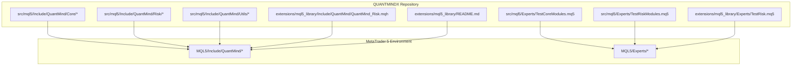
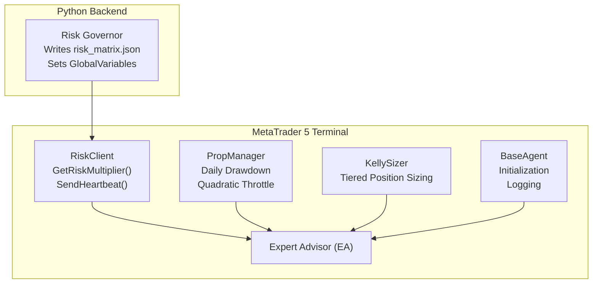
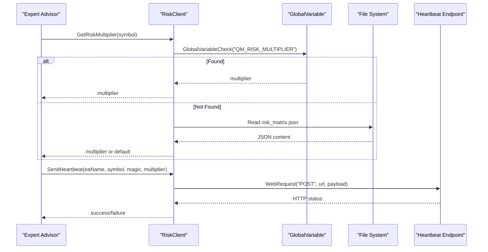
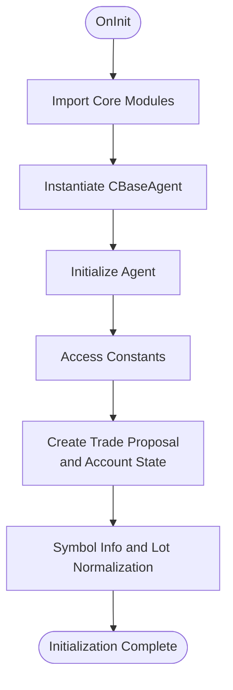
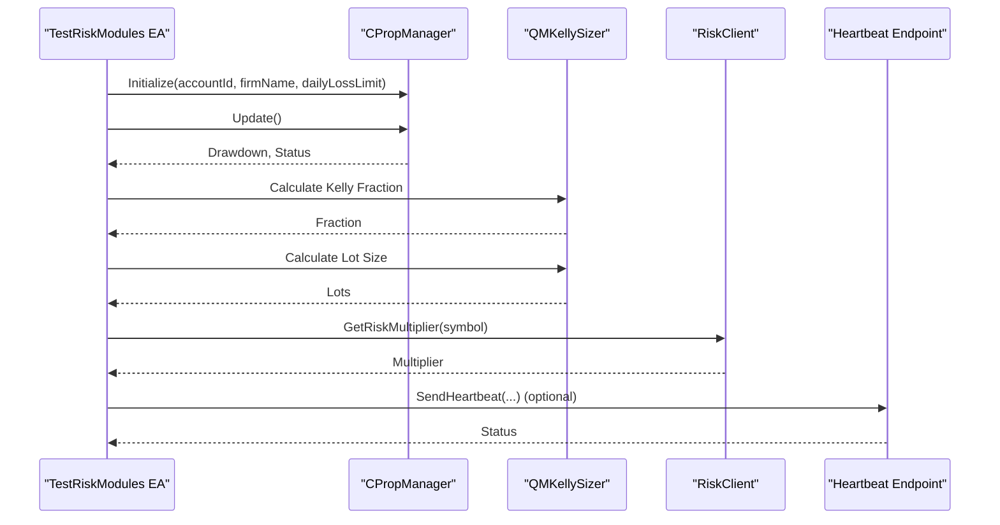
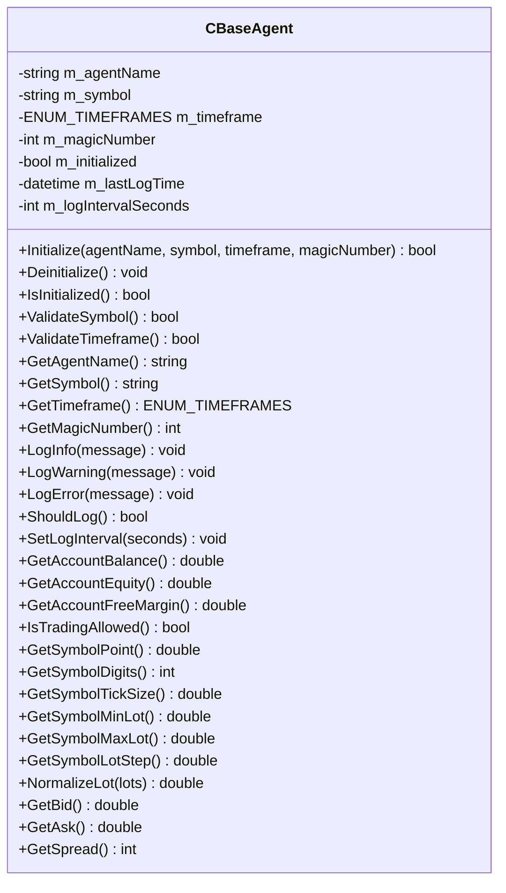
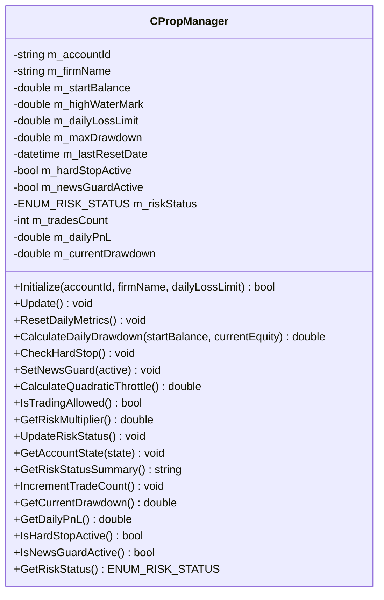
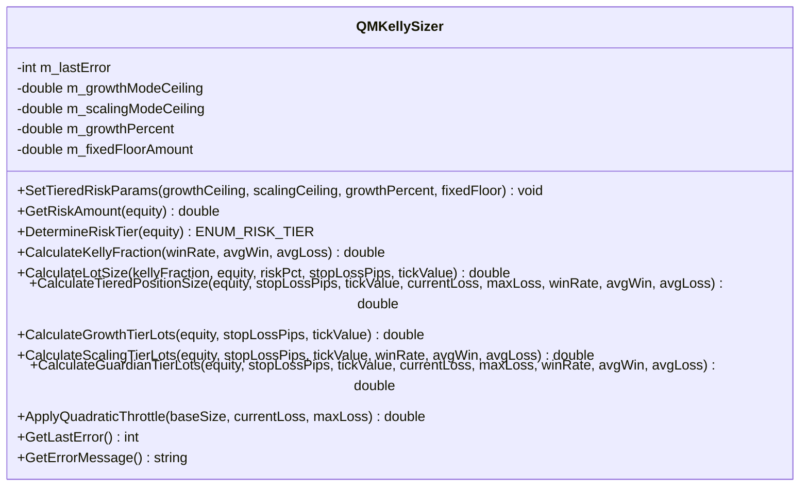
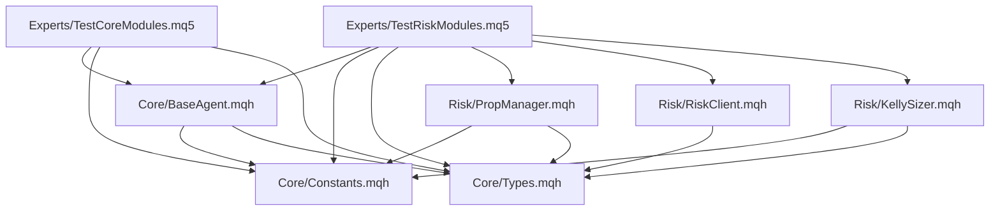

# MQL5 Library Integration

<cite>
**Referenced Files in This Document**
- [extensions/mql5_library/README.md](file://extensions/mql5_library/README.md)
- [extensions/mql5_library/Include/QuantMind/QuantMind_Risk.mqh](file://extensions/mql5_library/Include/QuantMind/QuantMind_Risk.mqh)
- [extensions/mql5_library/Experts/TestRisk.mq5](file://extensions/mql5_library/Experts/TestRisk.mq5)
- [src/mql5/Include/QuantMind/Core/BaseAgent.mqh](file://src/mql5/Include/QuantMind/Core/BaseAgent.mqh)
- [src/mql5/Include/QuantMind/Core/Constants.mqh](file://src/mql5/Include/QuantMind/Core/Constants.mqh)
- [src/mql5/Include/QuantMind/Core/Types.mqh](file://src/mql5/Include/QuantMind/Core/Types.mqh)
- [src/mql5/Include/QuantMind/Risk/PropManager.mqh](file://src/mql5/Include/QuantMind/Risk/PropManager.mqh)
- [src/mql5/Include/QuantMind/Risk/RiskClient.mqh](file://src/mql5/Include/QuantMind/Risk/RiskClient.mqh)
- [src/mql5/Include/QuantMind/Risk/KellySizer.mqh](file://src/mql5/Include/QuantMind/Risk/KellySizer.mqh)
- [src/mql5/Experts/TestCoreModules.mq5](file://src/mql5/Experts/TestCoreModules.mq5)
- [src/mql5/Experts/TestRiskModules.mq5](file://src/mql5/Experts/TestRiskModules.mq5)
</cite>

## Table of Contents
1. [Introduction](#introduction)
2. [Project Structure](#project-structure)
3. [Core Components](#core-components)
4. [Architecture Overview](#architecture-overview)
5. [Detailed Component Analysis](#detailed-component-analysis)
6. [Dependency Analysis](#dependency-analysis)
7. [Performance Considerations](#performance-considerations)
8. [Troubleshooting Guide](#troubleshooting-guide)
9. [Conclusion](#conclusion)
10. [Appendices](#appendices)

## Introduction
This document explains the MQL5 Library Integration within the QUANTMINDX Strategy Repository. It covers the expert advisor (EA) development workflow, the QuantMind namespace organization, reusable component architecture, Include directory structure, and integration with the broader QUANTMINDX ecosystem. It also documents library usage, component instantiation, deployment practices, versioning, dependency management, and compatibility considerations across MetaTrader 5 environments.

## Project Structure
The MQL5 integration is organized around two primary locations:
- extensions/mql5_library: A portable library distribution intended for copying into MetaTrader 5’s MQL5 Include path and Experts directory for immediate use.
- src/mql5: The canonical source of the QuantMind Standard Library (QSL), including reusable components under the QuantMind namespace, and dedicated test EAs for validating compilation and runtime behavior.

Key directories and files:
- Include/QuantMind/Core: foundational modules (BaseAgent, Constants, Types)
- Include/QuantMind/Risk: risk management modules (PropManager, RiskClient, KellySizer)
- Include/QuantMind/Utils: utility modules (JSON, RingBuffer, Sockets)
- Experts/TestCoreModules.mq5 and Experts/TestRiskModules.mq5: compilation and integration tests
- extensions/mql5_library/Experts/TestRisk.mq5: validation of risk library behavior
- extensions/mql5_library/Include/QuantMind/QuantMind_Risk.mqh: a focused risk client module for Python-MQL5 synchronization

**Diagram sources**
- [src/mql5/Include/QuantMind/Core/BaseAgent.mqh](file://src/mql5/Include/QuantMind/Core/BaseAgent.mqh#L1-L444)
- [src/mql5/Include/QuantMind/Core/Constants.mqh](file://src/mql5/Include/QuantMind/Core/Constants.mqh#L1-L270)
- [src/mql5/Include/QuantMind/Core/Types.mqh](file://src/mql5/Include/QuantMind/Core/Types.mqh#L1-L362)
- [src/mql5/Include/QuantMind/Risk/PropManager.mqh](file://src/mql5/Include/QuantMind/Risk/PropManager.mqh#L1-L449)
- [src/mql5/Include/QuantMind/Risk/RiskClient.mqh](file://src/mql5/Include/QuantMind/Risk/RiskClient.mqh#L1-L222)
- [src/mql5/Include/QuantMind/Risk/KellySizer.mqh](file://src/mql5/Include/QuantMind/Risk/KellySizer.mqh#L1-L533)
- [src/mql5/Experts/TestCoreModules.mq5](file://src/mql5/Experts/TestCoreModules.mq5#L1-L266)
- [src/mql5/Experts/TestRiskModules.mq5](file://src/mql5/Experts/TestRiskModules.mq5#L1-L303)
- [extensions/mql5_library/Include/QuantMind/QuantMind_Risk.mqh](file://extensions/mql5_library/Include/QuantMind/QuantMind_Risk.mqh#L1-L346)
- [extensions/mql5_library/Experts/TestRisk.mq5](file://extensions/mql5_library/Experts/TestRisk.mq5#L1-L340)
- [extensions/mql5_library/README.md](file://extensions/mql5_library/README.md#L1-L297)

**Section sources**
- [extensions/mql5_library/README.md](file://extensions/mql5_library/README.md#L1-L297)
- [extensions/mql5_library/Include/QuantMind/QuantMind_Risk.mqh](file://extensions/mql5_library/Include/QuantMind/QuantMind_Risk.mqh#L1-L346)
- [extensions/mql5_library/Experts/TestRisk.mq5](file://extensions/mql5_library/Experts/TestRisk.mq5#L1-L340)
- [src/mql5/Include/QuantMind/Core/BaseAgent.mqh](file://src/mql5/Include/QuantMind/Core/BaseAgent.mqh#L1-L444)
- [src/mql5/Include/QuantMind/Core/Constants.mqh](file://src/mql5/Include/QuantMind/Core/Constants.mqh#L1-L270)
- [src/mql5/Include/QuantMind/Core/Types.mqh](file://src/mql5/Include/QuantMind/Core/Types.mqh#L1-L362)
- [src/mql5/Include/QuantMind/Risk/PropManager.mqh](file://src/mql5/Include/QuantMind/Risk/PropManager.mqh#L1-L449)
- [src/mql5/Include/QuantMind/Risk/RiskClient.mqh](file://src/mql5/Include/QuantMind/Risk/RiskClient.mqh#L1-L222)
- [src/mql5/Include/QuantMind/Risk/KellySizer.mqh](file://src/mql5/Include/QuantMind/Risk/KellySizer.mqh#L1-L533)
- [src/mql5/Experts/TestCoreModules.mq5](file://src/mql5/Experts/TestCoreModules.mq5#L1-L266)
- [src/mql5/Experts/TestRiskModules.mq5](file://src/mql5/Experts/TestRiskModules.mq5#L1-L303)

## Core Components
The QuantMind Standard Library (QSL) provides reusable building blocks for EAs:

- Core modules
  - BaseAgent: foundational agent lifecycle, logging, and symbol/timeframe validation
  - Constants: system-wide constants, magic number ranges, risk parameters, and configuration
  - Types: shared structures and enums for trade proposals, account states, risk parameters, and more

- Risk modules
  - PropManager: daily drawdown tracking, hard stop enforcement, news guard, quadratic throttle
  - RiskClient: risk multiplier retrieval with fast path (GlobalVariable) and fallback (JSON file), heartbeat
  - KellySizer: Kelly criterion calculations, tiered risk engines, and position sizing

- Utils modules
  - JSON, RingBuffer, Sockets: lightweight utilities supporting data parsing, circular buffers, and network operations

These modules are designed for composition and reuse across expert advisors, enabling consistent risk management and standardized data structures.

**Section sources**
- [src/mql5/Include/QuantMind/Core/BaseAgent.mqh](file://src/mql5/Include/QuantMind/Core/BaseAgent.mqh#L27-L444)
- [src/mql5/Include/QuantMind/Core/Constants.mqh](file://src/mql5/Include/QuantMind/Core/Constants.mqh#L18-L268)
- [src/mql5/Include/QuantMind/Core/Types.mqh](file://src/mql5/Include/QuantMind/Core/Types.mqh#L18-L362)
- [src/mql5/Include/QuantMind/Risk/PropManager.mqh](file://src/mql5/Include/QuantMind/Risk/PropManager.mqh#L32-L449)
- [src/mql5/Include/QuantMind/Risk/RiskClient.mqh](file://src/mql5/Include/QuantMind/Risk/RiskClient.mqh#L45-L222)
- [src/mql5/Include/QuantMind/Risk/KellySizer.mqh](file://src/mql5/Include/QuantMind/Risk/KellySizer.mqh#L51-L533)

## Architecture Overview
The MQL5 integration supports a hybrid architecture:
- Python-driven risk governance: Python backend writes risk matrices and sets GlobalVariables
- Real-time MQL5 execution: EAs read risk multipliers and send heartbeats for monitoring
- Reusable components: BaseAgent, Constants, Types, PropManager, RiskClient, and KellySizer form a cohesive framework

**Diagram sources**
- [extensions/mql5_library/Include/QuantMind/QuantMind_Risk.mqh](file://extensions/mql5_library/Include/QuantMind/QuantMind_Risk.mqh#L54-L343)
- [src/mql5/Include/QuantMind/Risk/PropManager.mqh](file://src/mql5/Include/QuantMind/Risk/PropManager.mqh#L112-L141)
- [src/mql5/Include/QuantMind/Risk/KellySizer.mqh](file://src/mql5/Include/QuantMind/Risk/KellySizer.mqh#L165-L298)
- [src/mql5/Include/QuantMind/Core/BaseAgent.mqh](file://src/mql5/Include/QuantMind/Core/BaseAgent.mqh#L70-L98)

## Detailed Component Analysis

### Risk Management Library (QuantMind_Risk.mqh)
The risk library provides:
- Risk multiplier retrieval with a fast path (GlobalVariable) and fallback path (JSON file)
- Heartbeat mechanism for EA lifecycle monitoring
- Robust error handling and data freshness validation

Key behaviors:
- Fast path: reads a GlobalVariable set by Python agents
- Fallback path: parses risk_matrix.json from MQL5/Files/ with timestamp validation
- Heartbeat: periodic POST to a configurable endpoint with EA metadata

**Diagram sources**
- [extensions/mql5_library/Include/QuantMind/QuantMind_Risk.mqh](file://extensions/mql5_library/Include/QuantMind/QuantMind_Risk.mqh#L54-L343)

**Section sources**
- [extensions/mql5_library/Include/QuantMind/QuantMind_Risk.mqh](file://extensions/mql5_library/Include/QuantMind/QuantMind_Risk.mqh#L54-L343)
- [extensions/mql5_library/Experts/TestRisk.mq5](file://extensions/mql5_library/Experts/TestRisk.mq5#L118-L236)

### Core Modules Compilation Test (TestCoreModules.mq5)
This EA validates compilation and basic functionality of Core modules:
- Imports BaseAgent, Constants, and Types
- Instantiates and initializes a CBaseAgent instance
- Exercises constants, types, and utility macros
- Logs agent state and performs periodic logging

**Diagram sources**
- [src/mql5/Experts/TestCoreModules.mq5](file://src/mql5/Experts/TestCoreModules.mq5#L35-L185)

**Section sources**
- [src/mql5/Experts/TestCoreModules.mq5](file://src/mql5/Experts/TestCoreModules.mq5#L15-L185)
- [src/mql5/Include/QuantMind/Core/BaseAgent.mqh](file://src/mql5/Include/QuantMind/Core/BaseAgent.mqh#L70-L120)
- [src/mql5/Include/QuantMind/Core/Constants.mqh](file://src/mql5/Include/QuantMind/Core/Constants.mqh#L21-L100)
- [src/mql5/Include/QuantMind/Core/Types.mqh](file://src/mql5/Include/QuantMind/Core/Types.mqh#L86-L138)

### Risk Modules Compilation Test (TestRiskModules.mq5)
This EA validates Risk modules:
- Imports Core dependencies and Risk modules (PropManager, RiskClient, KellySizer)
- Initializes PropManager and demonstrates daily drawdown and throttle calculations
- Exercises KellySizer for position sizing and tiered risk logic
- Optionally sends heartbeats to the backend

**Diagram sources**
- [src/mql5/Experts/TestRiskModules.mq5](file://src/mql5/Experts/TestRiskModules.mq5#L41-L177)
- [src/mql5/Include/QuantMind/Risk/PropManager.mqh](file://src/mql5/Include/QuantMind/Risk/PropManager.mqh#L112-L141)
- [src/mql5/Include/QuantMind/Risk/KellySizer.mqh](file://src/mql5/Include/QuantMind/Risk/KellySizer.mqh#L165-L298)
- [src/mql5/Include/QuantMind/Risk/RiskClient.mqh](file://src/mql5/Include/QuantMind/Risk/RiskClient.mqh#L61-L89)

**Section sources**
- [src/mql5/Experts/TestRiskModules.mq5](file://src/mql5/Experts/TestRiskModules.mq5#L14-L177)
- [src/mql5/Include/QuantMind/Risk/PropManager.mqh](file://src/mql5/Include/QuantMind/Risk/PropManager.mqh#L32-L141)
- [src/mql5/Include/QuantMind/Risk/KellySizer.mqh](file://src/mql5/Include/QuantMind/Risk/KellySizer.mqh#L71-L163)
- [src/mql5/Include/QuantMind/Risk/RiskClient.mqh](file://src/mql5/Include/QuantMind/Risk/RiskClient.mqh#L61-L89)

### BaseAgent Class
BaseAgent encapsulates common EA functionality:
- Initialization with validation for symbol and timeframe
- Logging with rate limiting
- Account and symbol utilities (balance, equity, free margin, spread)
- Lot normalization respecting symbol constraints

**Diagram sources**
- [src/mql5/Include/QuantMind/Core/BaseAgent.mqh](file://src/mql5/Include/QuantMind/Core/BaseAgent.mqh#L27-L444)

**Section sources**
- [src/mql5/Include/QuantMind/Core/BaseAgent.mqh](file://src/mql5/Include/QuantMind/Core/BaseAgent.mqh#L27-L444)

### PropManager Class
PropManager manages daily risk metrics and status:
- Tracks start balance, high-water mark, daily P&L, and drawdown
- Enforces hard stop at effective threshold with buffer
- Supports quadratic throttle calculation and news guard
- Provides formatted risk status summaries

**Diagram sources**
- [src/mql5/Include/QuantMind/Risk/PropManager.mqh](file://src/mql5/Include/QuantMind/Risk/PropManager.mqh#L32-L449)

**Section sources**
- [src/mql5/Include/QuantMind/Risk/PropManager.mqh](file://src/mql5/Include/QuantMind/Risk/PropManager.mqh#L32-L449)

### KellySizer Class
KellySizer implements position sizing with:
- Standard Kelly fraction calculation
- Tiered risk engines (Growth, Scaling, Guardian)
- Quadratic throttle application for Guardian tier
- Robust input validation and error reporting

**Diagram sources**
- [src/mql5/Include/QuantMind/Risk/KellySizer.mqh](file://src/mql5/Include/QuantMind/Risk/KellySizer.mqh#L71-L533)

**Section sources**
- [src/mql5/Include/QuantMind/Risk/KellySizer.mqh](file://src/mql5/Include/QuantMind/Risk/KellySizer.mqh#L71-L533)

## Dependency Analysis
The library follows a layered dependency model:
- Core depends on Constants and Types
- Risk modules depend on Core
- RiskClient optionally depends on Utils (JSON)
- Test EAs depend on Core and Risk modules

**Diagram sources**
- [src/mql5/Include/QuantMind/Core/Constants.mqh](file://src/mql5/Include/QuantMind/Core/Constants.mqh#L18-L268)
- [src/mql5/Include/QuantMind/Core/Types.mqh](file://src/mql5/Include/QuantMind/Core/Types.mqh#L18-L362)
- [src/mql5/Include/QuantMind/Core/BaseAgent.mqh](file://src/mql5/Include/QuantMind/Core/BaseAgent.mqh#L18-L444)
- [src/mql5/Include/QuantMind/Risk/PropManager.mqh](file://src/mql5/Include/QuantMind/Risk/PropManager.mqh#L18-L449)
- [src/mql5/Include/QuantMind/Risk/RiskClient.mqh](file://src/mql5/Include/QuantMind/Risk/RiskClient.mqh#L23-L222)
- [src/mql5/Include/QuantMind/Risk/KellySizer.mqh](file://src/mql5/Include/QuantMind/Risk/KellySizer.mqh#L16-L533)
- [src/mql5/Experts/TestCoreModules.mq5](file://src/mql5/Experts/TestCoreModules.mq5#L15-L185)
- [src/mql5/Experts/TestRiskModules.mq5](file://src/mql5/Experts/TestRiskModules.mq5#L14-L177)

**Section sources**
- [src/mql5/Include/QuantMind/Core/Constants.mqh](file://src/mql5/Include/QuantMind/Core/Constants.mqh#L18-L268)
- [src/mql5/Include/QuantMind/Core/Types.mqh](file://src/mql5/Include/QuantMind/Core/Types.mqh#L18-L362)
- [src/mql5/Include/QuantMind/Core/BaseAgent.mqh](file://src/mql5/Include/QuantMind/Core/BaseAgent.mqh#L18-L444)
- [src/mql5/Include/QuantMind/Risk/PropManager.mqh](file://src/mql5/Include/QuantMind/Risk/PropManager.mqh#L18-L449)
- [src/mql5/Include/QuantMind/Risk/RiskClient.mqh](file://src/mql5/Include/QuantMind/Risk/RiskClient.mqh#L23-L222)
- [src/mql5/Include/QuantMind/Risk/KellySizer.mqh](file://src/mql5/Include/QuantMind/Risk/KellySizer.mqh#L16-L533)
- [src/mql5/Experts/TestCoreModules.mq5](file://src/mql5/Experts/TestCoreModules.mq5#L15-L185)
- [src/mql5/Experts/TestRiskModules.mq5](file://src/mql5/Experts/TestRiskModules.mq5#L14-L177)

## Performance Considerations
- Risk retrieval: fast path via GlobalVariable minimizes latency; file fallback includes timestamp validation to avoid stale data overhead
- Heartbeat frequency: configurable intervals reduce network overhead while maintaining monitoring
- Logging rate limiting: BaseAgent’s ShouldLog reduces console spam during intensive operations
- Position sizing: KellySizer caps fractions and applies quadratic throttle to prevent excessive exposure under stress

[No sources needed since this section provides general guidance]

## Troubleshooting Guide
Common issues and resolutions:
- Heartbeat failures (error 4060): Add the heartbeat URL to the Expert Advisors “Allow WebRequest” list in MetaEditor settings
- File not found errors: ensure risk_matrix.json resides in MQL5/Files/, not MQL5/Include/
- Stale data warnings: update timestamps in risk_matrix.json and confirm Python governor writes fresh data
- Compilation errors: verify all required Core and Risk modules are included and compiled together

**Section sources**
- [extensions/mql5_library/README.md](file://extensions/mql5_library/README.md#L264-L284)
- [extensions/mql5_library/Include/QuantMind/QuantMind_Risk.mqh](file://extensions/mql5_library/Include/QuantMind/QuantMind_Risk.mqh#L276-L317)

## Conclusion
The MQL5 Library Integration delivers a robust, modular framework for expert advisor development within QUANTMINDX. The QuantMind namespace organizes reusable components across Core, Risk, and Utils layers, enabling consistent initialization, risk management, and position sizing. The integration with Python via GlobalVariables and JSON files ensures dynamic, governance-driven risk controls while maintaining low-latency execution in MetaTrader 5. The provided test EAs validate compilation and runtime behavior, facilitating reliable deployment and maintenance.

[No sources needed since this section summarizes without analyzing specific files]

## Appendices

### Expert Advisor Development Workflow
- Install the library: copy QuantMind_Risk.mqh to MQL5/Include/QuantMind/ and TestRisk.mq5 to MQL5/Experts/
- Configure risk governance: write risk_matrix.json or set GlobalVariables via Python
- Develop EAs: include Core and Risk modules, initialize BaseAgent, and use PropManager/KellySizer
- Deploy and monitor: attach EAs to charts, enable heartbeats, and review logs

**Section sources**
- [extensions/mql5_library/README.md](file://extensions/mql5_library/README.md#L5-L20)
- [extensions/mql5_library/Experts/TestRisk.mq5](file://extensions/mql5_library/Experts/TestRisk.mq5#L35-L67)

### Include Directory Structure and Namespace Organization
- Include/QuantMind/Core: BaseAgent, Constants, Types
- Include/QuantMind/Risk: PropManager, RiskClient, KellySizer
- Include/QuantMind/Utils: JSON, RingBuffer, Sockets

**Section sources**
- [src/mql5/Include/QuantMind/Core/BaseAgent.mqh](file://src/mql5/Include/QuantMind/Core/BaseAgent.mqh#L1-L444)
- [src/mql5/Include/QuantMind/Core/Constants.mqh](file://src/mql5/Include/QuantMind/Core/Constants.mqh#L1-L270)
- [src/mql5/Include/QuantMind/Core/Types.mqh](file://src/mql5/Include/QuantMind/Core/Types.mqh#L1-L362)
- [src/mql5/Include/QuantMind/Risk/PropManager.mqh](file://src/mql5/Include/QuantMind/Risk/PropManager.mqh#L1-L449)
- [src/mql5/Include/QuantMind/Risk/RiskClient.mqh](file://src/mql5/Include/QuantMind/Risk/RiskClient.mqh#L1-L222)
- [src/mql5/Include/QuantMind/Risk/KellySizer.mqh](file://src/mql5/Include/QuantMind/Risk/KellySizer.mqh#L1-L533)

### Practical Examples
- Risk multiplier retrieval: use GetRiskMultiplier(symbol) to fetch governance-driven risk multipliers
- Heartbeat monitoring: call SendHeartbeat(eaName, symbol, magic, multiplier) to report EA status
- Position sizing: compute lot sizes using KellySizer with tiered risk logic and quadratic throttle

**Section sources**
- [extensions/mql5_library/Include/QuantMind/QuantMind_Risk.mqh](file://extensions/mql5_library/Include/QuantMind/QuantMind_Risk.mqh#L54-L89)
- [src/mql5/Include/QuantMind/Risk/KellySizer.mqh](file://src/mql5/Include/QuantMind/Risk/KellySizer.mqh#L300-L347)

### Versioning and Compatibility
- Library versioning: modules carry property version fields; maintain consistent versions across Core, Risk, and Utils
- Compatibility: ensure MetaTrader 5 build supports MQL5 features used (strict mode, arrays, file operations, WebRequest)
- Backward compatibility: keep symbol and enum names stable; introduce new constants and modules without breaking existing APIs

**Section sources**
- [extensions/mql5_library/Include/QuantMind/QuantMind_Risk.mqh](file://extensions/mql5_library/Include/QuantMind/QuantMind_Risk.mqh#L9-L12)
- [src/mql5/Include/QuantMind/Risk/KellySizer.mqh](file://src/mql5/Include/QuantMind/Risk/KellySizer.mqh#L10-L11)