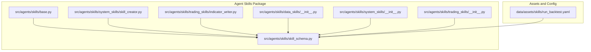
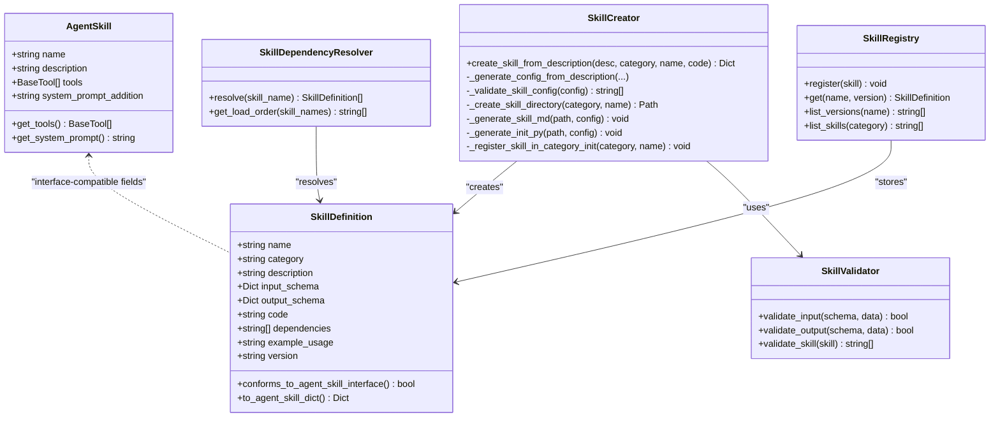
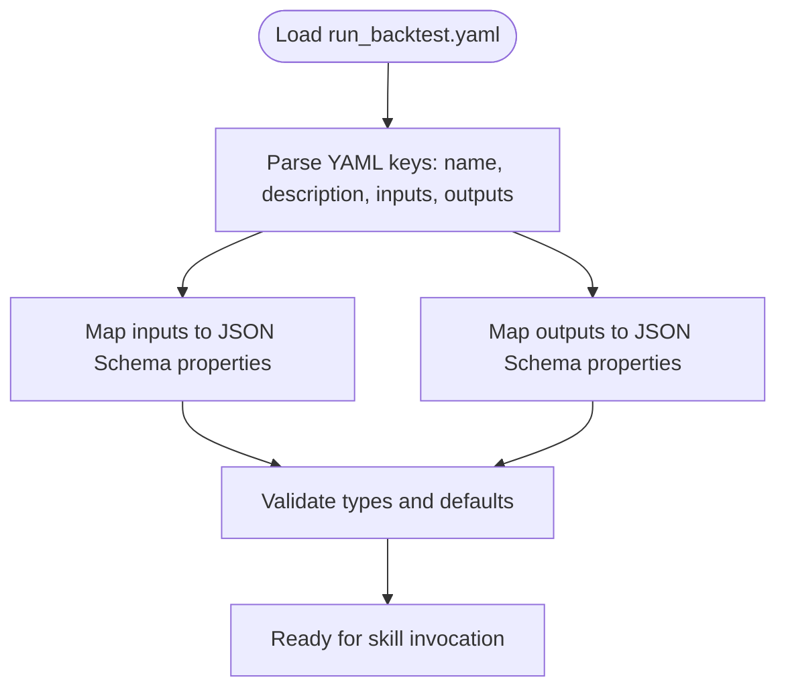
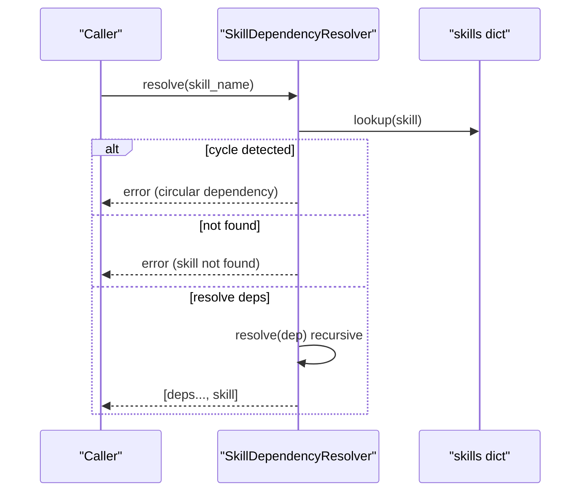
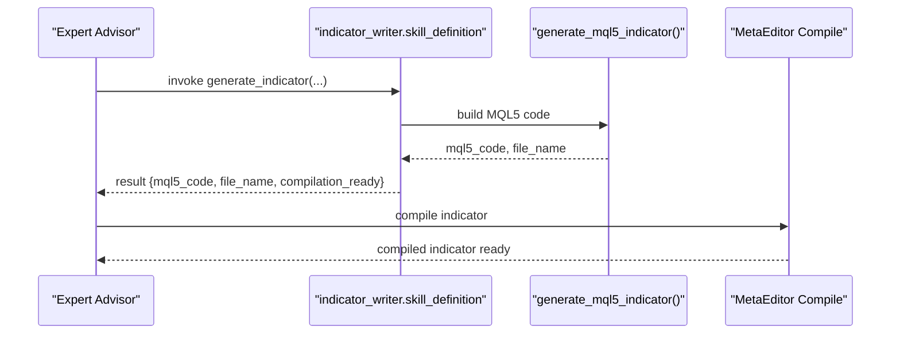
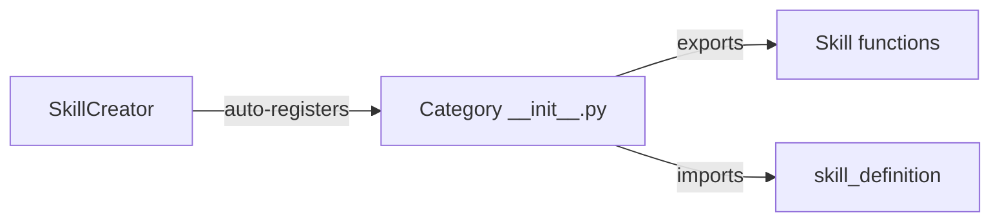
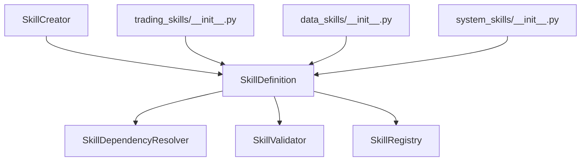

# Skill System Architecture

<cite>
**Referenced Files in This Document**
- [README.md](file://README.md)
- [skill_schema.py](file://src/agents/skills/skill_schema.py)
- [base.py](file://src/agents/skills/base.py)
- [skill_creator.py](file://src/agents/skills/system_skills/skill_creator.py)
- [indicator_writer.py](file://src/agents/skills/trading_skills/indicator_writer.py)
- [data_skills/__init__.py](file://src/agents/skills/data_skills/__init__.py)
- [system_skills/__init__.py](file://src/agents/skills/system_skills/__init__.py)
- [trading_skills/__init__.py](file://src/agents/skills/trading_skills/__init__.py)
- [run_backtest.yaml](file://data/assets/skills/run_backtest.yaml)
</cite>

## Table of Contents
1. [Introduction](#introduction)
2. [Project Structure](#project-structure)
3. [Core Components](#core-components)
4. [Architecture Overview](#architecture-overview)
5. [Detailed Component Analysis](#detailed-component-analysis)
6. [Dependency Analysis](#dependency-analysis)
7. [Performance Considerations](#performance-considerations)
8. [Troubleshooting Guide](#troubleshooting-guide)
9. [Conclusion](#conclusion)
10. [Appendices](#appendices)

## Introduction
This document describes the Skill System Architecture within the Strategy Repository. The system organizes capabilities into three categories:
- Data skills: Operations that fetch, transform, and prepare market and reference data.
- System skills: Infrastructure and operational capabilities such as logging and alerts.
- Trading skills: Strategy-related computations and code generation helpers.

It covers YAML configuration patterns, skill definition schemas, dependency resolution, versioning, and runtime integration with expert advisors and backtesting engines. Practical examples demonstrate creating skills, managing configurations, and composing strategies from modular skills.

## Project Structure
The skill system is implemented under the agents skills package and supported by configuration assets and documentation.

**Diagram sources**
- [base.py](file://src/agents/skills/base.py#L1-L25)
- [skill_schema.py](file://src/agents/skills/skill_schema.py#L1-L423)
- [skill_creator.py](file://src/agents/skills/system_skills/skill_creator.py#L1-L742)
- [indicator_writer.py](file://src/agents/skills/trading_skills/indicator_writer.py#L1-L796)
- [data_skills/__init__.py](file://src/agents/skills/data_skills/__init__.py#L1-L113)
- [system_skills/__init__.py](file://src/agents/skills/system_skills/__init__.py#L1-L88)
- [trading_skills/__init__.py](file://src/agents/skills/trading_skills/__init__.py#L1-L253)
- [run_backtest.yaml](file://data/assets/skills/run_backtest.yaml#L1-L18)

**Section sources**
- [README.md](file://README.md#L1-L80)
- [skill_schema.py](file://src/agents/skills/skill_schema.py#L1-L423)
- [base.py](file://src/agents/skills/base.py#L1-L25)

## Core Components
- AgentSkill: Minimal abstraction for skills as collections of tools and system prompts.
- SkillDefinition: Pydantic model defining the canonical schema for skills, including name, category, JSON schemas for input/output, code payload, dependencies, example usage, and version.
- SkillValidator: Validates skill definitions against JSON Schema and interface requirements.
- SkillDependencyResolver: Recursively resolves dependencies and determines load order, detecting cycles.
- SkillRegistry: Manages multiple versions of skills and supports latest-version lookup.
- SkillCreator: Automated skill scaffolding that generates directory structure, SKILL.md, __init__.py, and registers skills in category modules.

**Section sources**
- [base.py](file://src/agents/skills/base.py#L9-L25)
- [skill_schema.py](file://src/agents/skills/skill_schema.py#L25-L120)
- [skill_schema.py](file://src/agents/skills/skill_schema.py#L199-L317)
- [skill_schema.py](file://src/agents/skills/skill_schema.py#L122-L197)
- [skill_schema.py](file://src/agents/skills/skill_schema.py#L319-L410)
- [skill_creator.py](file://src/agents/skills/system_skills/skill_creator.py#L104-L218)

## Architecture Overview
The skill system separates concerns across schema, validation, dependency resolution, and registry management. Skills are authored as Python modules exporting a SkillDefinition and associated functions. The SkillCreator automates authoring and ensures consistent structure and validation.

**Diagram sources**
- [base.py](file://src/agents/skills/base.py#L9-L25)
- [skill_schema.py](file://src/agents/skills/skill_schema.py#L25-L120)
- [skill_schema.py](file://src/agents/skills/skill_schema.py#L199-L317)
- [skill_schema.py](file://src/agents/skills/skill_schema.py#L122-L197)
- [skill_schema.py](file://src/agents/skills/skill_schema.py#L319-L410)
- [skill_creator.py](file://src/agents/skills/system_skills/skill_creator.py#L104-L218)

## Detailed Component Analysis

### YAML Configuration Structure
Skills can be described declaratively via YAML assets. The repository includes a backtest runner asset that defines inputs and outputs for strategy execution.

**Diagram sources**
- [run_backtest.yaml](file://data/assets/skills/run_backtest.yaml#L1-L18)

**Section sources**
- [run_backtest.yaml](file://data/assets/skills/run_backtest.yaml#L1-L18)

### Skill Definition Patterns
Each skill is defined by a SkillDefinition with:
- name: Lowercase, underscore-separated identifiers.
- category: One of trading_skills, system_skills, data_skills.
- input_schema and output_schema: JSON Schema for validation.
- code: Executable logic (Python or MQL5).
- dependencies: Names of prerequisite skills.
- example_usage: Demonstrative invocation.
- version: Semantic versioning.

Validation enforces schema correctness and interface conformance.

**Section sources**
- [skill_schema.py](file://src/agents/skills/skill_schema.py#L25-L120)
- [skill_schema.py](file://src/agents/skills/skill_schema.py#L199-L317)

### Dependency Resolution Workflow
The resolver traverses dependencies depth-first, marking nodes during traversal to detect cycles and returning a dependency-sorted list.

**Diagram sources**
- [skill_schema.py](file://src/agents/skills/skill_schema.py#L122-L197)

**Section sources**
- [skill_schema.py](file://src/agents/skills/skill_schema.py#L122-L197)

### Runtime Integration with Expert Advisors
Trading skills often produce MQL5 code artifacts. The indicator writer skill generates compilation-ready MQL5 indicators with property directives, buffer initialization, and OnCalculate scaffolding. These can be integrated into expert advisors as part of strategy development.

**Diagram sources**
- [indicator_writer.py](file://src/agents/skills/trading_skills/indicator_writer.py#L447-L574)

**Section sources**
- [indicator_writer.py](file://src/agents/skills/trading_skills/indicator_writer.py#L447-L574)

### Skill Registration and Category Modules
Skills are exported from category modules and can be auto-registered by the SkillCreator. The category __init__.py files expose functions and definitions for downstream consumption.

**Diagram sources**
- [system_skills/__init__.py](file://src/agents/skills/system_skills/__init__.py#L84-L88)
- [trading_skills/__init__.py](file://src/agents/skills/trading_skills/__init__.py#L245-L251)
- [data_skills/__init__.py](file://src/agents/skills/data_skills/__init__.py#L1-L113)
- [skill_creator.py](file://src/agents/skills/system_skills/skill_creator.py#L640-L714)

**Section sources**
- [system_skills/__init__.py](file://src/agents/skills/system_skills/__init__.py#L1-L88)
- [trading_skills/__init__.py](file://src/agents/skills/trading_skills/__init__.py#L1-L253)
- [data_skills/__init__.py](file://src/agents/skills/data_skills/__init__.py#L1-L113)
- [skill_creator.py](file://src/agents/skills/system_skills/skill_creator.py#L640-L714)

### Practical Examples

#### Example: Creating a Data Skill
- Use the SkillCreator to scaffold a new data skill from a high-level description.
- The creator infers name, code, input/output schemas, and generates SKILL.md and __init__.py.
- Auto-registration updates the category module’s __all__ list.

**Section sources**
- [skill_creator.py](file://src/agents/skills/system_skills/skill_creator.py#L150-L218)
- [skill_creator.py](file://src/agents/skills/system_skills/skill_creator.py#L521-L631)
- [skill_creator.py](file://src/agents/skills/system_skills/skill_creator.py#L640-L714)

#### Example: Using a Trading Skill (RSI)
- The trading skills module exposes calculate_rsi with NumPy-backed computation.
- The skill’s SkillDefinition provides input/output schemas and example usage.

**Section sources**
- [trading_skills/__init__.py](file://src/agents/skills/trading_skills/__init__.py#L18-L84)
- [skill_schema.py](file://src/agents/skills/skill_schema.py#L681-L783)

#### Example: Generating an MQL5 Indicator
- The indicator writer skill produces a complete, compilation-ready MQL5 indicator.
- It supports ring buffers, property directives, and buffer initialization.

**Section sources**
- [indicator_writer.py](file://src/agents/skills/trading_skills/indicator_writer.py#L447-L574)
- [indicator_writer.py](file://src/agents/skills/trading_skills/indicator_writer.py#L681-L783)

### Configuration Management
- YAML assets define structured inputs and outputs for skills like run_backtest.
- SKILL.md frontmatter standardizes metadata for each skill.
- Category __init__.py files centralize exports and imports for discoverability.

**Section sources**
- [run_backtest.yaml](file://data/assets/skills/run_backtest.yaml#L1-L18)
- [skill_creator.py](file://src/agents/skills/system_skills/skill_creator.py#L521-L581)
- [system_skills/__init__.py](file://src/agents/skills/system_skills/__init__.py#L1-L88)

### Skill-Based Strategy Development
- Compose strategies by invoking multiple skills in sequence.
- Use SkillDependencyResolver to ensure prerequisites are loaded first.
- Persist and version skills via SkillRegistry to manage evolution.

**Section sources**
- [skill_schema.py](file://src/agents/skills/skill_schema.py#L122-L197)
- [skill_schema.py](file://src/agents/skills/skill_schema.py#L319-L410)

## Dependency Analysis
The skill system exhibits low coupling between categories and strong cohesion within each skill module. Dependencies are declared in SkillDefinition and enforced by SkillDependencyResolver.

**Diagram sources**
- [skill_schema.py](file://src/agents/skills/skill_schema.py#L122-L197)
- [skill_schema.py](file://src/agents/skills/skill_schema.py#L199-L317)
- [skill_schema.py](file://src/agents/skills/skill_schema.py#L319-L410)
- [skill_creator.py](file://src/agents/skills/system_skills/skill_creator.py#L104-L218)
- [trading_skills/__init__.py](file://src/agents/skills/trading_skills/__init__.py#L245-L251)
- [data_skills/__init__.py](file://src/agents/skills/data_skills/__init__.py#L1-L113)
- [system_skills/__init__.py](file://src/agents/skills/system_skills/__init__.py#L1-L88)

**Section sources**
- [skill_schema.py](file://src/agents/skills/skill_schema.py#L122-L197)
- [skill_schema.py](file://src/agents/skills/skill_schema.py#L199-L317)
- [skill_schema.py](file://src/agents/skills/skill_schema.py#L319-L410)

## Performance Considerations
- Prefer NumPy-backed computations in trading skills for vectorized operations.
- Use ring buffers in MQL5 indicators to minimize recalculations and improve latency.
- Validate inputs early with JSON Schema to avoid expensive misconfigured invocations.
- Cache frequently accessed data in data skills to reduce repeated network/API calls.

[No sources needed since this section provides general guidance]

## Troubleshooting Guide
Common issues and resolutions:
- Circular dependencies: Detected by SkillDependencyResolver; refactor skill dependencies to remove cycles.
- Invalid schema: SkillValidator reports malformed input/output schemas; ensure properties and types are correctly defined.
- Empty code or example_usage: Validation fails; provide executable code and a working example.
- Unknown skill name: Lookup returns None; confirm skill registration and category imports.

**Section sources**
- [skill_schema.py](file://src/agents/skills/skill_schema.py#L153-L173)
- [skill_schema.py](file://src/agents/skills/skill_schema.py#L279-L317)

## Conclusion
The Skill System Architecture provides a robust, extensible foundation for composing trading strategies from modular, versioned capabilities. By enforcing schema-driven definitions, validating inputs/outputs, resolving dependencies, and automating authoring, the system accelerates development while maintaining reliability and traceability.

[No sources needed since this section summarizes without analyzing specific files]

## Appendices

### Appendix A: YAML Frontmatter and SKILL.md
- SKILL.md frontmatter standardizes metadata for skills.
- run_backtest.yaml demonstrates structured inputs and outputs for backtesting.

**Section sources**
- [skill_creator.py](file://src/agents/skills/system_skills/skill_creator.py#L521-L581)
- [run_backtest.yaml](file://data/assets/skills/run_backtest.yaml#L1-L18)

### Appendix B: Integration with NRPD and Knowledge Bases
- The repository integrates Neural Pattern Recognition (NRPD) and knowledge bases for strategy synthesis and retrieval.
- Skills can leverage NRPD outputs and KB indices to inform strategy decisions.

[No sources needed since this section provides general guidance]