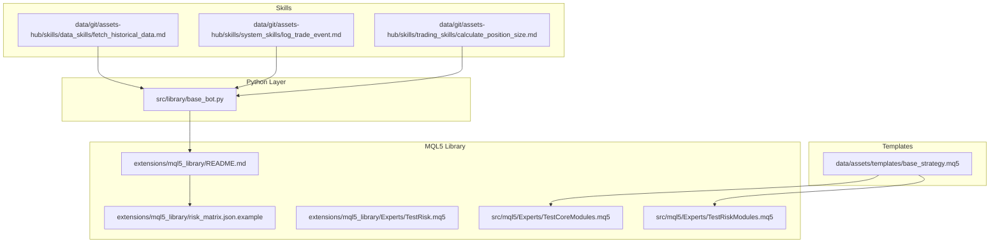
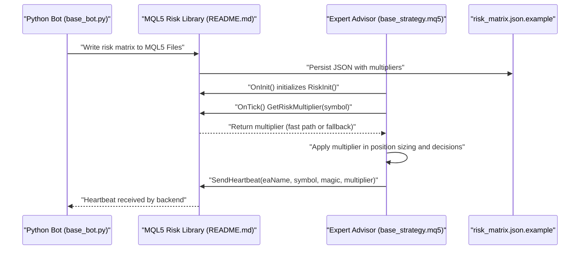
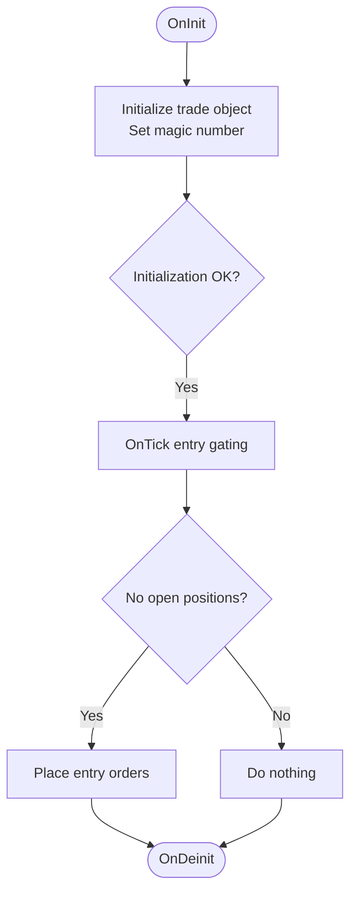
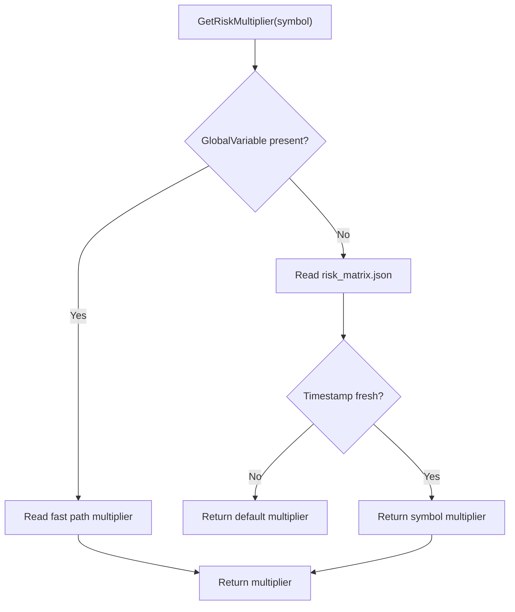
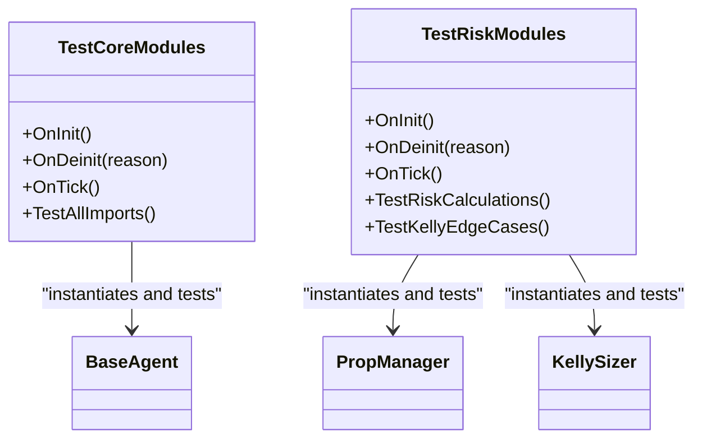
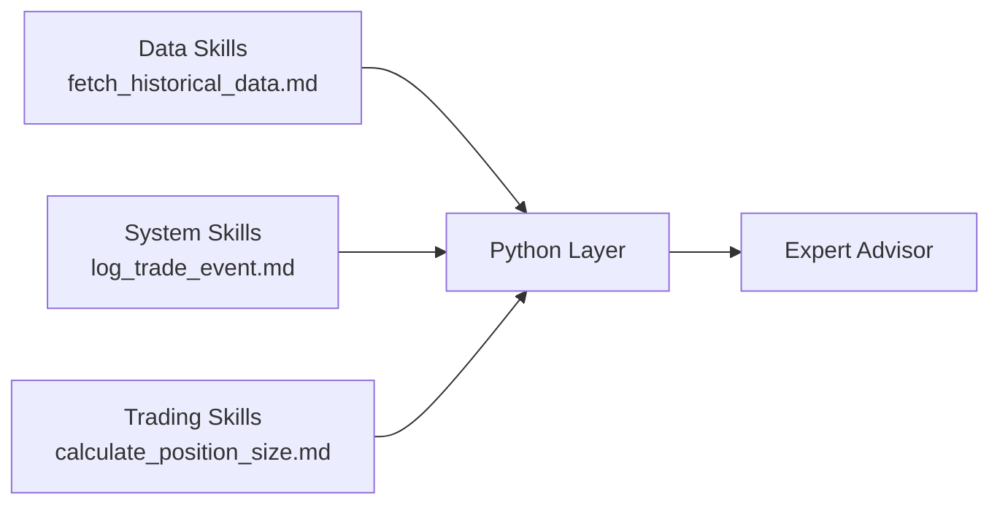
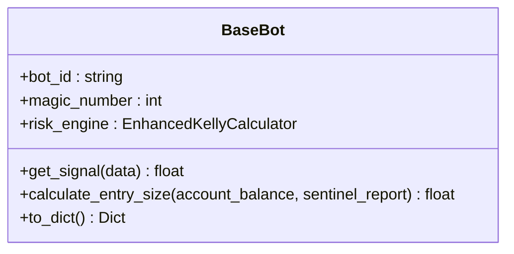
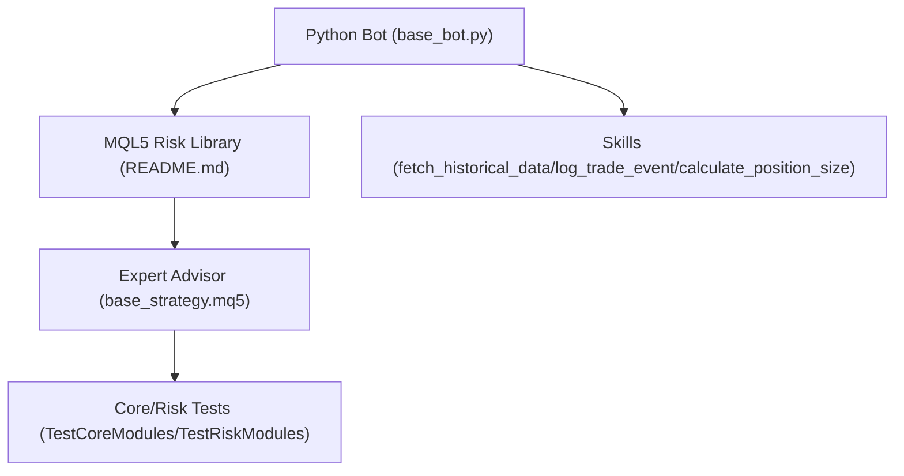

# Strategy Repository

<cite>
**Referenced Files in This Document**
- [base_strategy.mq5](file://data/assets/templates/base_strategy.mq5)
- [run_backtest.yaml](file://data/assets/skills/run_backtest.yaml)
- [README.md](file://extensions/mql5_library/README.md)
- [risk_matrix.json.example](file://extensions/mql5_library/risk_matrix.json.example)
- [TestRisk.mq5](file://extensions/mql5_library/Experts/TestRisk.mq5)
- [TestCoreModules.mq5](file://src/mql5/Experts/TestCoreModules.mq5)
- [TestRiskModules.mq5](file://src/mql5/Experts/TestRiskModules.mq5)
- [fetch_historical_data.md](file://data/git/assets-hub/skills/data_skills/fetch_historical_data.md)
- [log_trade_event.md](file://data/git/assets-hub/skills/system_skills/log_trade_event.md)
- [calculate_position_size.md](file://data/git/assets-hub/skills/trading_skills/calculate_position_size.md)
- [base_bot.py](file://src/library/base_bot.py)
</cite>

## Table of Contents
1. [Introduction](#introduction)
2. [Project Structure](#project-structure)
3. [Core Components](#core-components)
4. [Architecture Overview](#architecture-overview)
5. [Detailed Component Analysis](#detailed-component-analysis)
6. [Dependency Analysis](#dependency-analysis)
7. [Performance Considerations](#performance-considerations)
8. [Troubleshooting Guide](#troubleshooting-guide)
9. [Conclusion](#conclusion)
10. [Appendices](#appendices)

## Introduction
This document describes the Strategy Repository and the end-to-end strategy development workflow within the QUANTMINDX ecosystem. It covers:
- Template management for strategy development, including the base strategy template structure and MQL5 library integration
- Asset organization and skill-based components across data skills, system skills, and trading skills
- Expert advisor creation, code generation processes, and version control integration
- The skill system architecture and practical examples for customization and development
- Asset indexing, template inheritance patterns, and reusable component architecture
- Strategy versioning, deployment workflows, and integration with the broader QUANTMINDX ecosystem

## Project Structure
The Strategy Repository is organized around three primary areas:
- Templates: reusable MQL5 strategy scaffolding and module tests
- Skills: modular, composable capabilities for data ingestion, system logging, and trading logic
- MQL5 Library: shared risk management and standard library modules enabling Python-backed governance and low-latency execution

**Diagram sources**
- [base_strategy.mq5](file://data/assets/templates/base_strategy.mq5#L1-L45)
- [TestCoreModules.mq5](file://src/mql5/Experts/TestCoreModules.mq5#L1-L266)
- [TestRiskModules.mq5](file://src/mql5/Experts/TestRiskModules.mq5#L1-L303)
- [README.md](file://extensions/mql5_library/README.md#L1-L297)
- [risk_matrix.json.example](file://extensions/mql5_library/risk_matrix.json.example#L1-L23)
- [TestRisk.mq5](file://extensions/mql5_library/Experts/TestRisk.mq5#L1-L340)
- [fetch_historical_data.md](file://data/git/assets-hub/skills/data_skills/fetch_historical_data.md#L1-L206)
- [log_trade_event.md](file://data/git/assets-hub/skills/system_skills/log_trade_event.md#L1-L161)
- [calculate_position_size.md](file://data/git/assets-hub/skills/trading_skills/calculate_position_size.md#L1-L126)
- [base_bot.py](file://src/library/base_bot.py#L1-L79)

**Section sources**
- [base_strategy.mq5](file://data/assets/templates/base_strategy.mq5#L1-L45)
- [README.md](file://extensions/mql5_library/README.md#L1-L297)
- [risk_matrix.json.example](file://extensions/mql5_library/risk_matrix.json.example#L1-L23)
- [TestRisk.mq5](file://extensions/mql5_library/Experts/TestRisk.mq5#L1-L340)
- [TestCoreModules.mq5](file://src/mql5/Experts/TestCoreModules.mq5#L1-L266)
- [TestRiskModules.mq5](file://src/mql5/Experts/TestRiskModules.mq5#L1-L303)
- [fetch_historical_data.md](file://data/git/assets-hub/skills/data_skills/fetch_historical_data.md#L1-L206)
- [log_trade_event.md](file://data/git/assets-hub/skills/system_skills/log_trade_event.md#L1-L161)
- [calculate_position_size.md](file://data/git/assets-hub/skills/trading_skills/calculate_position_size.md#L1-L126)
- [base_bot.py](file://src/library/base_bot.py#L1-L79)

## Core Components
- Base Strategy Template: Provides a minimal MQL5 expert advisor scaffold with input parameters, global trade object, and lifecycle hooks. It demonstrates the recommended structure for initializing magic numbers and entry gating logic.
- MQL5 Risk Management Library: Bridges Python risk governance with MQL5 execution via a dual-path risk multiplier retrieval (fast path GlobalVariable, fallback JSON file) and heartbeat monitoring.
- Standard Library (QSL) Tests: Validate compilation and runtime behavior of core and risk modules, ensuring reusable component reliability.
- Skill System: Modular capabilities packaged as YAML/markdown artifacts with structured input/output schemas and executable code, categorized into data skills, system skills, and trading skills.
- Python Base Bot: Defines a standardized interface for bots, integrating risk engines and providing a consistent metadata surface for strategy auctions and routing.

**Section sources**
- [base_strategy.mq5](file://data/assets/templates/base_strategy.mq5#L11-L44)
- [README.md](file://extensions/mql5_library/README.md#L84-L142)
- [TestCoreModules.mq5](file://src/mql5/Experts/TestCoreModules.mq5#L35-L185)
- [TestRiskModules.mq5](file://src/mql5/Experts/TestRiskModules.mq5#L41-L177)
- [fetch_historical_data.md](file://data/git/assets-hub/skills/data_skills/fetch_historical_data.md#L13-L83)
- [log_trade_event.md](file://data/git/assets-hub/skills/system_skills/log_trade_event.md#L13-L73)
- [calculate_position_size.md](file://data/git/assets-hub/skills/trading_skills/calculate_position_size.md#L13-L65)
- [base_bot.py](file://src/library/base_bot.py#L14-L79)

## Architecture Overview
The Strategy Repository integrates Python-based risk governance with MQL5 expert advisors through a shared library and standardized skill components. The flow below illustrates how a Python bot interacts with the MQL5 library and how skills feed data and logic into strategies.

**Diagram sources**
- [base_bot.py](file://src/library/base_bot.py#L14-L79)
- [README.md](file://extensions/mql5_library/README.md#L84-L142)
- [base_strategy.mq5](file://data/assets/templates/base_strategy.mq5#L21-L44)
- [risk_matrix.json.example](file://extensions/mql5_library/risk_matrix.json.example#L1-L23)

## Detailed Component Analysis

### Base Strategy Template
The base template establishes:
- Property declarations and includes
- Input parameters for risk percent and magic number
- Global trade object initialization in OnInit
- Lifecycle hooks for initialization and deinitialization
- A skeleton entry gating block for position management

**Diagram sources**
- [base_strategy.mq5](file://data/assets/templates/base_strategy.mq5#L21-L44)

**Section sources**
- [base_strategy.mq5](file://data/assets/templates/base_strategy.mq5#L11-L44)

### MQL5 Risk Management Library
Key capabilities:
- Dual-path risk multiplier retrieval with fast path via GlobalVariable and fallback via JSON file
- Heartbeat mechanism to notify Python backend of EA status
- Configuration via input parameters and JSON schema
- Comprehensive test coverage validating all paths

**Diagram sources**
- [README.md](file://extensions/mql5_library/README.md#L86-L105)
- [TestRisk.mq5](file://extensions/mql5_library/Experts/TestRisk.mq5#L118-L206)

**Section sources**
- [README.md](file://extensions/mql5_library/README.md#L84-L178)
- [risk_matrix.json.example](file://extensions/mql5_library/risk_matrix.json.example#L1-L23)
- [TestRisk.mq5](file://extensions/mql5_library/Experts/TestRisk.mq5#L118-L206)

### Standard Library (QSL) Tests
Compilation and runtime validation of core and risk modules:
- Core modules test validates BaseAgent instantiation, constants, types, and utility macros
- Risk modules test validates PropManager, KellySizer, and RiskClient integration

**Diagram sources**
- [TestCoreModules.mq5](file://src/mql5/Experts/TestCoreModules.mq5#L35-L185)
- [TestRiskModules.mq5](file://src/mql5/Experts/TestRiskModules.mq5#L41-L177)

**Section sources**
- [TestCoreModules.mq5](file://src/mql5/Experts/TestCoreModules.mq5#L35-L185)
- [TestRiskModules.mq5](file://src/mql5/Experts/TestRiskModules.mq5#L41-L177)

### Skill System Architecture
Skills are modular, composable capabilities with:
- Structured input/output schemas
- Executable code blocks
- YAML frontmatter specifying metadata and dependencies

Categories:
- Data skills: e.g., fetching historical OHLCV data
- System skills: e.g., logging trade events to the journal
- Trading skills: e.g., calculating position size based on risk parameters

**Diagram sources**
- [fetch_historical_data.md](file://data/git/assets-hub/skills/data_skills/fetch_historical_data.md#L13-L83)
- [log_trade_event.md](file://data/git/assets-hub/skills/system_skills/log_trade_event.md#L13-L73)
- [calculate_position_size.md](file://data/git/assets-hub/skills/trading_skills/calculate_position_size.md#L13-L65)

**Section sources**
- [fetch_historical_data.md](file://data/git/assets-hub/skills/data_skills/fetch_historical_data.md#L1-L206)
- [log_trade_event.md](file://data/git/assets-hub/skills/system_skills/log_trade_event.md#L1-L161)
- [calculate_position_size.md](file://data/git/assets-hub/skills/trading_skills/calculate_position_size.md#L1-L126)

### Python Base Bot Integration
The Base Bot defines a standardized interface for all bots:
- Abstractions for signal generation and position sizing
- Integration with an enhanced Kelly calculator
- Metadata export for strategy auctions and routing

**Diagram sources**
- [base_bot.py](file://src/library/base_bot.py#L14-L79)

**Section sources**
- [base_bot.py](file://src/library/base_bot.py#L14-L79)

### Practical Examples

#### Strategy Template Customization
- Extend the base template by adding indicator calculations, entry/exit conditions, and position sizing logic
- Integrate risk multiplier retrieval from the MQL5 library to scale position sizes dynamically
- Use heartbeat to monitor EA health and synchronize with Python backend

**Section sources**
- [base_strategy.mq5](file://data/assets/templates/base_strategy.mq5#L37-L44)
- [README.md](file://extensions/mql5_library/README.md#L107-L127)

#### Expert Advisor Creation Workflow
- Scaffold EA from the base template
- Include core and risk modules for robust foundation
- Validate compilation and runtime behavior using provided test EAs

**Section sources**
- [TestCoreModules.mq5](file://src/mql5/Experts/TestCoreModules.mq5#L35-L185)
- [TestRiskModules.mq5](file://src/mql5/Experts/TestRiskModules.mq5#L41-L177)

#### Skill-Based Development Workflows
- Data skills: fetch historical data to feed indicators and backtesting
- System skills: log trade events to maintain a comprehensive journal
- Trading skills: compute position size and incorporate into EA logic

**Section sources**
- [fetch_historical_data.md](file://data/git/assets-hub/skills/data_skills/fetch_historical_data.md#L85-L186)
- [log_trade_event.md](file://data/git/assets-hub/skills/system_skills/log_trade_event.md#L75-L135)
- [calculate_position_size.md](file://data/git/assets-hub/skills/trading_skills/calculate_position_size.md#L67-L114)

### Asset Indexing System
Assets are organized under a structured hierarchy:
- Templates: reusable strategy scaffolds
- Skills: modular capabilities with schemas and code
- MQL5 Library: shared modules and tests

Asset indexing supports:
- Discoverability via category and metadata
- Version control integration through frontmatter
- Reusability across strategies and EAs

**Section sources**
- [base_strategy.mq5](file://data/assets/templates/base_strategy.mq5#L1-L45)
- [run_backtest.yaml](file://data/assets/skills/run_backtest.yaml#L1-L18)
- [README.md](file://extensions/mql5_library/README.md#L1-L297)

### Template Inheritance Patterns and Reusable Components
- Base template provides a minimal, extensible foundation
- Core and risk module tests demonstrate inheritance and composition patterns
- Shared library modules enable consistent behavior across EAs

**Section sources**
- [TestCoreModules.mq5](file://src/mql5/Experts/TestCoreModules.mq5#L15-L18)
- [TestRiskModules.mq5](file://src/mql5/Experts/TestRiskModules.mq5#L19-L23)

### Strategy Versioning and Deployment
- Skills include version metadata in frontmatter for traceability
- Deployment involves copying library modules to MQL5 Include and Experts folders and compiling via MetaEditor
- Version control integration is supported through the assets hub structure

**Section sources**
- [fetch_historical_data.md](file://data/git/assets-hub/skills/data_skills/fetch_historical_data.md#L2-L6)
- [README.md](file://extensions/mql5_library/README.md#L5-L20)

### Integration with the QUANTMINDX Ecosystem
- Python bot layer feeds risk parameters and analytics into MQL5 EAs
- Skills encapsulate domain-specific logic for data, system, and trading functions
- Heartbeat and risk matrix mechanisms ensure synchronization between Python and MQL5

**Section sources**
- [base_bot.py](file://src/library/base_bot.py#L14-L79)
- [README.md](file://extensions/mql5_library/README.md#L179-L292)

## Dependency Analysis
The Strategy Repository exhibits clear separation of concerns:
- Python layer depends on the MQL5 library for risk parameter propagation
- MQL5 EAs depend on shared library modules and tests for validation
- Skills provide decoupled capabilities consumed by both layers

**Diagram sources**
- [base_bot.py](file://src/library/base_bot.py#L14-L79)
- [README.md](file://extensions/mql5_library/README.md#L1-L297)
- [base_strategy.mq5](file://data/assets/templates/base_strategy.mq5#L1-L45)
- [TestCoreModules.mq5](file://src/mql5/Experts/TestCoreModules.mq5#L1-L266)
- [TestRiskModules.mq5](file://src/mql5/Experts/TestRiskModules.mq5#L1-L303)
- [fetch_historical_data.md](file://data/git/assets-hub/skills/data_skills/fetch_historical_data.md#L1-L206)
- [log_trade_event.md](file://data/git/assets-hub/skills/system_skills/log_trade_event.md#L1-L161)
- [calculate_position_size.md](file://data/git/assets-hub/skills/trading_skills/calculate_position_size.md#L1-L126)

**Section sources**
- [base_bot.py](file://src/library/base_bot.py#L14-L79)
- [README.md](file://extensions/mql5_library/README.md#L1-L297)
- [base_strategy.mq5](file://data/assets/templates/base_strategy.mq5#L1-L45)
- [TestCoreModules.mq5](file://src/mql5/Experts/TestCoreModules.mq5#L1-L266)
- [TestRiskModules.mq5](file://src/mql5/Experts/TestRiskModules.mq5#L1-L303)
- [fetch_historical_data.md](file://data/git/assets-hub/skills/data_skills/fetch_historical_data.md#L1-L206)
- [log_trade_event.md](file://data/git/assets-hub/skills/system_skills/log_trade_event.md#L1-L161)
- [calculate_position_size.md](file://data/git/assets-hub/skills/trading_skills/calculate_position_size.md#L1-L126)

## Performance Considerations
- Prefer the fast path GlobalVariable for real-time risk multiplier updates to minimize latency
- Cache risk multiplier per tick to avoid repeated file reads
- Validate risk multiplier ranges and handle defaults gracefully
- Use heartbeat intervals appropriate for monitoring needs without overloading the backend

[No sources needed since this section provides general guidance]

## Troubleshooting Guide
Common issues and resolutions:
- WebRequest errors during heartbeat: ensure the backend is running and the URL is whitelisted
- File not found for risk matrix: verify placement in the MQL5 Files directory and correct permissions
- Stale data warnings: update timestamps and confirm the Python governor is writing fresh data

**Section sources**
- [README.md](file://extensions/mql5_library/README.md#L264-L284)

## Conclusion
The Strategy Repository provides a robust framework for strategy development within QUANTMINDX:
- A minimal base template and validated core/risk modules form a reliable foundation
- The MQL5 library synchronizes Python risk governance with low-latency execution
- The skill system offers modular, versioned capabilities across data, system, and trading domains
- Clear integration patterns support versioning, deployment, and ecosystem-wide interoperability

[No sources needed since this section summarizes without analyzing specific files]

## Appendices

### Appendix A: Backtest Skill Definition
The run_backtest skill defines inputs and outputs for executing backtests using the QuantMind Backtest Engine.

**Section sources**
- [run_backtest.yaml](file://data/assets/skills/run_backtest.yaml#L1-L18)