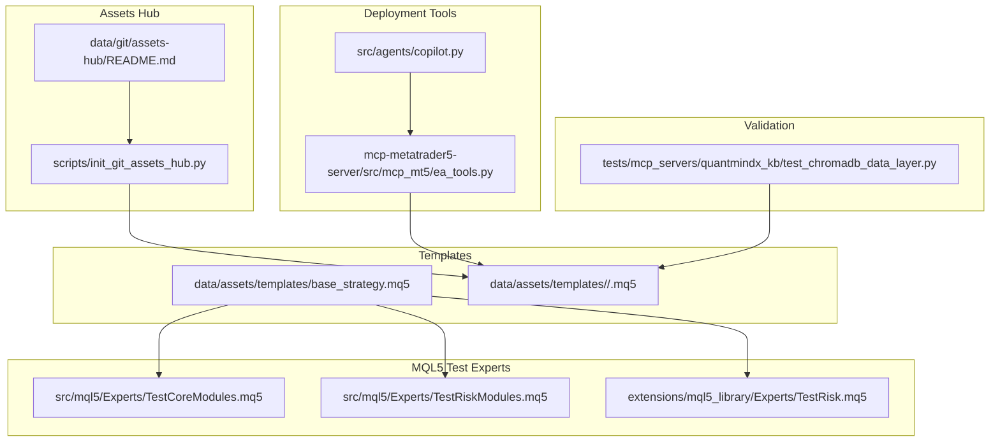
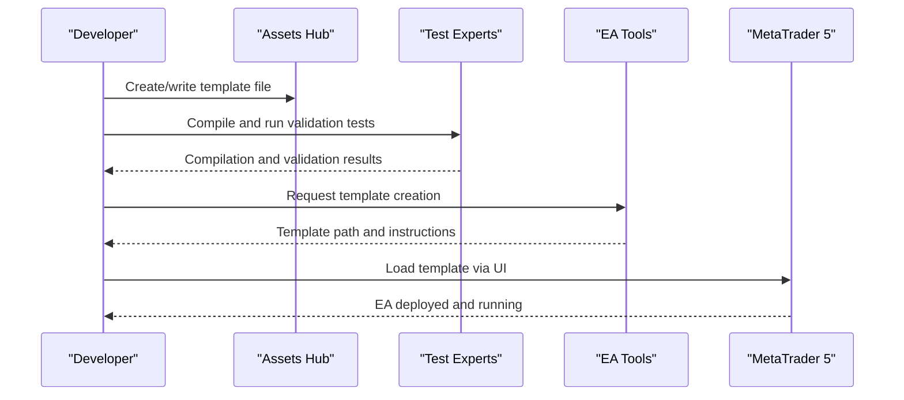
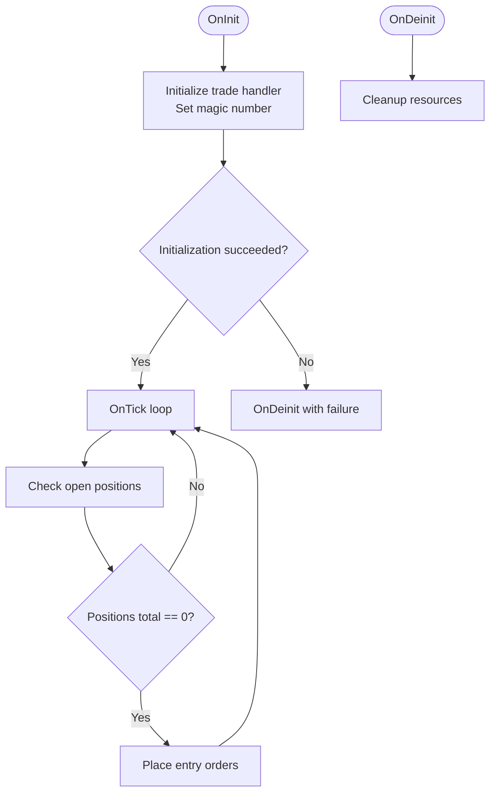
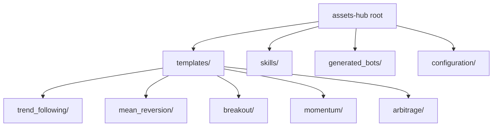
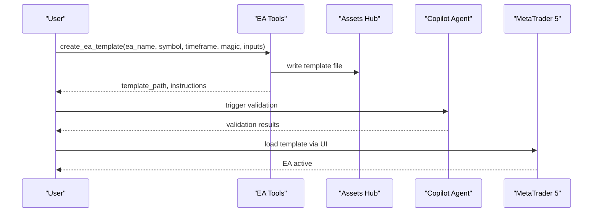
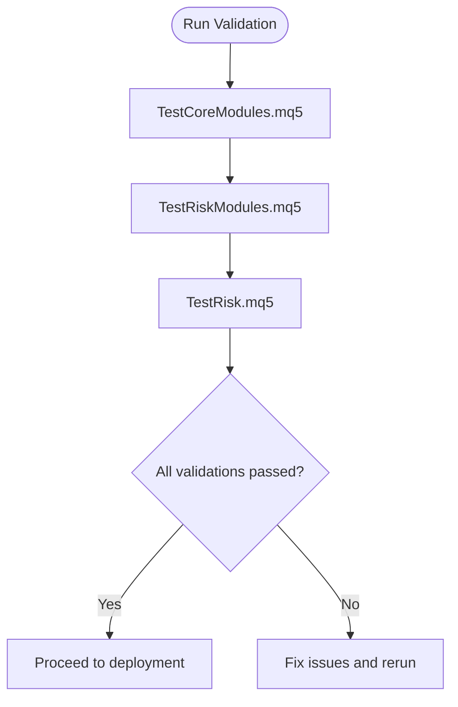
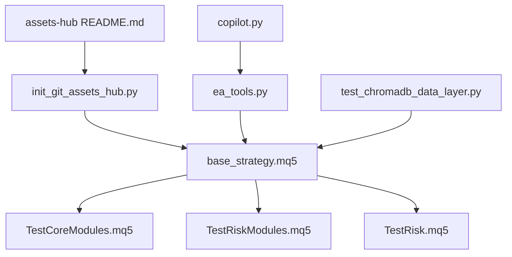

# Template Management

<cite>
**Referenced Files in This Document**
- [base_strategy.mq5](file://data/assets/templates/base_strategy.mq5)
- [TestCoreModules.mq5](file://src/mql5/Experts/TestCoreModules.mq5)
- [TestRiskModules.mq5](file://src/mql5/Experts/TestRiskModules.mq5)
- [TestRisk.mq5](file://extensions/mql5_library/Experts/TestRisk.mq5)
- [README.md](file://data/git/assets-hub/README.md)
- [init_git_assets_hub.py](file://scripts/init_git_assets_hub.py)
- [ea_tools.py](file://mcp-metatrader5-server/src/mcp_mt5/ea_tools.py)
- [copilot.py](file://src/agents/copilot.py)
- [test_chromadb_data_layer.py](file://tests/mcp_servers/quantmindx_kb/test_chromadb_data_layer.py)
</cite>

## Table of Contents
1. [Introduction](#introduction)
2. [Project Structure](#project-structure)
3. [Core Components](#core-components)
4. [Architecture Overview](#architecture-overview)
5. [Detailed Component Analysis](#detailed-component-analysis)
6. [Dependency Analysis](#dependency-analysis)
7. [Performance Considerations](#performance-considerations)
8. [Troubleshooting Guide](#troubleshooting-guide)
9. [Conclusion](#conclusion)
10. [Appendices](#appendices)

## Introduction
This document describes the Template Management system within the Strategy Repository. It focuses on the base strategy template structure, input parameters, global variable declarations, and expert advisor lifecycle functions. It explains template inheritance patterns, parameter customization, and the modular component architecture used in MQL5. It also documents the asset organization structure for strategy templates, file naming conventions, and version control integration. Practical examples illustrate template customization, parameter tuning, and strategy modification workflows. Finally, it covers template validation, testing procedures, and deployment patterns within the MQL5 environment.

## Project Structure
The Template Management system spans several areas:
- Strategy templates stored under data/assets/templates
- MQL5 test experts validating core and risk modules
- Git-backed assets hub for templates and skills
- Tools for EA template creation and deployment
- Automated tests ensuring template integrity

**Diagram sources**
- [base_strategy.mq5](file://data/assets/templates/base_strategy.mq5#L1-L45)
- [TestCoreModules.mq5](file://src/mql5/Experts/TestCoreModules.mq5#L1-L266)
- [TestRiskModules.mq5](file://src/mql5/Experts/TestRiskModules.mq5#L1-L303)
- [TestRisk.mq5](file://extensions/mql5_library/Experts/TestRisk.mq5#L1-L340)
- [README.md](file://data/git/assets-hub/README.md#L1-L42)
- [init_git_assets_hub.py](file://scripts/init_git_assets_hub.py#L46-L169)
- [ea_tools.py](file://mcp-metatrader5-server/src/mcp_mt5/ea_tools.py#L157-L195)
- [copilot.py](file://src/agents/copilot.py#L42-L75)
- [test_chromadb_data_layer.py](file://tests/mcp_servers/quantmindx_kb/test_chromadb_data_layer.py#L151-L186)

**Section sources**
- [base_strategy.mq5](file://data/assets/templates/base_strategy.mq5#L1-L45)
- [README.md](file://data/git/assets-hub/README.md#L1-L42)
- [init_git_assets_hub.py](file://scripts/init_git_assets_hub.py#L46-L169)

## Core Components
This section outlines the base strategy template structure and the lifecycle functions commonly used in MQL5 Expert Advisors.

- Base Strategy Template
  - Properties and includes: Defines copyright, link, version, and includes standard libraries.
  - Input parameters: Declares configurable parameters such as risk percent and magic number.
  - Global variables: Declares shared objects like trade handlers.
  - Lifecycle functions: OnInit, OnDeinit, OnTick, and optional advanced handlers.

- Lifecycle Functions
  - OnInit: Initializes resources, sets magic numbers, and prepares the EA for operation.
  - OnDeinit: Cleans up resources upon removal or shutdown.
  - OnTick: Executes per-tick logic, including entry/exit conditions and order management.

- Modular Components
  - Core modules: BaseAgent, Constants, Types
  - Risk modules: PropManager, RiskClient, KellySizer
  - Utilities: JSON, RingBuffer, Sockets

These components are validated by dedicated test experts that compile and exercise the modules, ensuring correctness and readiness for deployment.

**Section sources**
- [base_strategy.mq5](file://data/assets/templates/base_strategy.mq5#L1-L45)
- [TestCoreModules.mq5](file://src/mql5/Experts/TestCoreModules.mq5#L1-L266)
- [TestRiskModules.mq5](file://src/mql5/Experts/TestRiskModules.mq5#L1-L303)
- [TestRisk.mq5](file://extensions/mql5_library/Experts/TestRisk.mq5#L1-L340)

## Architecture Overview
The Template Management architecture integrates template storage, validation, and deployment:

- Template Storage
  - Templates are categorized under templates/<category>/ and managed via a Git repository.
  - Categories include trend_following, mean_reversion, breakout, momentum, arbitrage.

- Validation and Testing
  - Test experts compile and validate core and risk modules.
  - Automated tests ensure template integrity and Git operations.

- Deployment and Orchestration
  - Tools create EA templates and guide users to apply them in MetaTrader 5.
  - Agents coordinate compilation and validation steps.

**Diagram sources**
- [README.md](file://data/git/assets-hub/README.md#L1-L42)
- [TestCoreModules.mq5](file://src/mql5/Experts/TestCoreModules.mq5#L1-L266)
- [TestRiskModules.mq5](file://src/mql5/Experts/TestRiskModules.mq5#L1-L303)
- [TestRisk.mq5](file://extensions/mql5_library/Experts/TestRisk.mq5#L1-L340)
- [ea_tools.py](file://mcp-metatrader5-server/src/mcp_mt5/ea_tools.py#L157-L195)

## Detailed Component Analysis

### Base Strategy Template
The base strategy template defines the foundational structure for Expert Advisors:
- Properties and includes: Establishes metadata and library dependencies.
- Input parameters: Provides tunable parameters for risk and identification.
- Global variables: Declares reusable objects for trade operations.
- Lifecycle functions: Implements OnInit, OnDeinit, and OnTick with placeholder logic for entry conditions.

**Diagram sources**
- [base_strategy.mq5](file://data/assets/templates/base_strategy.mq5#L1-L45)

**Section sources**
- [base_strategy.mq5](file://data/assets/templates/base_strategy.mq5#L1-L45)

### Template Organization and File Naming
The Assets Hub organizes templates by category and enforces a commit message convention:
- Directory layout: templates/<category>/<template_name>.mq5
- Categories: trend_following, mean_reversion, breakout, momentum, arbitrage
- Commit message format: Strategy: {name}, Backtest: Sharpe={sharpe}, Drawdown={drawdown}%

**Diagram sources**
- [README.md](file://data/git/assets-hub/README.md#L1-L42)
- [init_git_assets_hub.py](file://scripts/init_git_assets_hub.py#L46-L169)

**Section sources**
- [README.md](file://data/git/assets-hub/README.md#L1-L42)
- [init_git_assets_hub.py](file://scripts/init_git_assets_hub.py#L46-L169)

### Template Creation and Deployment Workflow
The deployment workflow involves creating a template, validating it, and applying it in MetaTrader 5:
- Create template via tools that manage EA creation and parameterization.
- Validate compilation and deployment using agent nodes and test experts.
- Apply the template in MT5 using the built-in template loading mechanism.

**Diagram sources**
- [ea_tools.py](file://mcp-metatrader5-server/src/mcp_mt5/ea_tools.py#L157-L195)
- [copilot.py](file://src/agents/copilot.py#L42-L75)

**Section sources**
- [ea_tools.py](file://mcp-metatrader5-server/src/mcp_mt5/ea_tools.py#L157-L195)
- [copilot.py](file://src/agents/copilot.py#L42-L75)

### Template Validation and Testing Procedures
Template validation combines automated tests and manual verification:
- Core modules validation: Compiles and exercises BaseAgent, Constants, Types.
- Risk modules validation: Compiles and exercises PropManager, RiskClient, KellySizer.
- Risk library validation: Tests fast path (GlobalVariable), fallback path (JSON file), and heartbeat.

**Diagram sources**
- [TestCoreModules.mq5](file://src/mql5/Experts/TestCoreModules.mq5#L1-L266)
- [TestRiskModules.mq5](file://src/mql5/Experts/TestRiskModules.mq5#L1-L303)
- [TestRisk.mq5](file://extensions/mql5_library/Experts/TestRisk.mq5#L1-L340)

**Section sources**
- [TestCoreModules.mq5](file://src/mql5/Experts/TestCoreModules.mq5#L1-L266)
- [TestRiskModules.mq5](file://src/mql5/Experts/TestRiskModules.mq5#L1-L303)
- [TestRisk.mq5](file://extensions/mql5_library/Experts/TestRisk.mq5#L1-L340)

### Practical Examples: Customization and Modification
Practical customization examples include:
- Parameter tuning: Adjust risk percent and magic number to align with strategy goals.
- Strategy modification: Extend OnTick logic to incorporate indicators and entry filters.
- Module integration: Import and instantiate core and risk modules to leverage standardized functionality.

These examples are demonstrated by the test experts that instantiate and exercise the modules, ensuring they compile and function as expected.

**Section sources**
- [base_strategy.mq5](file://data/assets/templates/base_strategy.mq5#L1-L45)
- [TestCoreModules.mq5](file://src/mql5/Experts/TestCoreModules.mq5#L1-L266)
- [TestRiskModules.mq5](file://src/mql5/Experts/TestRiskModules.mq5#L1-L303)

## Dependency Analysis
Template Management depends on:
- Template files and categories
- Core and risk modules
- Git-backed assets hub
- Deployment tools and agents
- Automated tests

**Diagram sources**
- [base_strategy.mq5](file://data/assets/templates/base_strategy.mq5#L1-L45)
- [TestCoreModules.mq5](file://src/mql5/Experts/TestCoreModules.mq5#L1-L266)
- [TestRiskModules.mq5](file://src/mql5/Experts/TestRiskModules.mq5#L1-L303)
- [TestRisk.mq5](file://extensions/mql5_library/Experts/TestRisk.mq5#L1-L340)
- [README.md](file://data/git/assets-hub/README.md#L1-L42)
- [init_git_assets_hub.py](file://scripts/init_git_assets_hub.py#L46-L169)
- [ea_tools.py](file://mcp-metatrader5-server/src/mcp_mt5/ea_tools.py#L157-L195)
- [copilot.py](file://src/agents/copilot.py#L42-L75)
- [test_chromadb_data_layer.py](file://tests/mcp_servers/quantmindx_kb/test_chromadb_data_layer.py#L151-L186)

**Section sources**
- [base_strategy.mq5](file://data/assets/templates/base_strategy.mq5#L1-L45)
- [README.md](file://data/git/assets-hub/README.md#L1-L42)
- [init_git_assets_hub.py](file://scripts/init_git_assets_hub.py#L46-L169)
- [ea_tools.py](file://mcp-metatrader5-server/src/mcp_mt5/ea_tools.py#L157-L195)
- [copilot.py](file://src/agents/copilot.py#L42-L75)
- [test_chromadb_data_layer.py](file://tests/mcp_servers/quantmindx_kb/test_chromadb_data_layer.py#L151-L186)

## Performance Considerations
- Template compilation: Use strict property and minimal includes to reduce compilation overhead.
- Lifecycle efficiency: Keep OnInit lightweight and defer heavy initialization to OnTick as needed.
- Risk evaluation: Use cached risk multipliers and avoid frequent disk I/O in hot paths.
- Testing cadence: Run validation tests periodically to catch regressions early.

## Troubleshooting Guide
Common issues and resolutions:
- Compilation failures: Validate that all includes resolve and parameters are correctly typed.
- Risk multiplier retrieval: Ensure GlobalVariable or JSON fallback is correctly configured.
- Template application: Confirm the template path and instructions from deployment tools.
- Git operations: Verify commit message format and repository structure.

**Section sources**
- [TestRisk.mq5](file://extensions/mql5_library/Experts/TestRisk.mq5#L1-L340)
- [ea_tools.py](file://mcp-metatrader5-server/src/mcp_mt5/ea_tools.py#L157-L195)
- [test_chromadb_data_layer.py](file://tests/mcp_servers/quantmindx_kb/test_chromadb_data_layer.py#L151-L186)

## Conclusion
The Template Management system provides a structured approach to designing, organizing, validating, and deploying MQL5 Expert Advisors. The base strategy template establishes a consistent lifecycle and parameterization model. The modular architecture leverages core and risk modules to ensure robustness and maintainability. The Git-backed assets hub and deployment tools streamline template creation and application, while comprehensive testing guarantees reliability across environments.

## Appendices
- Asset organization and commit conventions are documented in the Assets Hub README and initialization script.
- Automated tests validate template integrity and Git operations.

**Section sources**
- [README.md](file://data/git/assets-hub/README.md#L1-L42)
- [init_git_assets_hub.py](file://scripts/init_git_assets_hub.py#L46-L169)
- [test_chromadb_data_layer.py](file://tests/mcp_servers/quantmindx_kb/test_chromadb_data_layer.py#L151-L186)