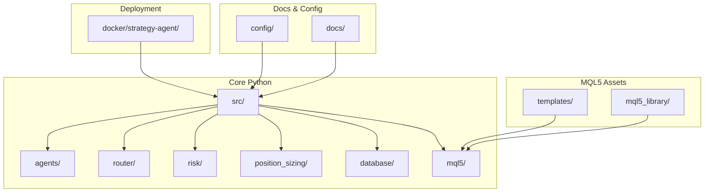
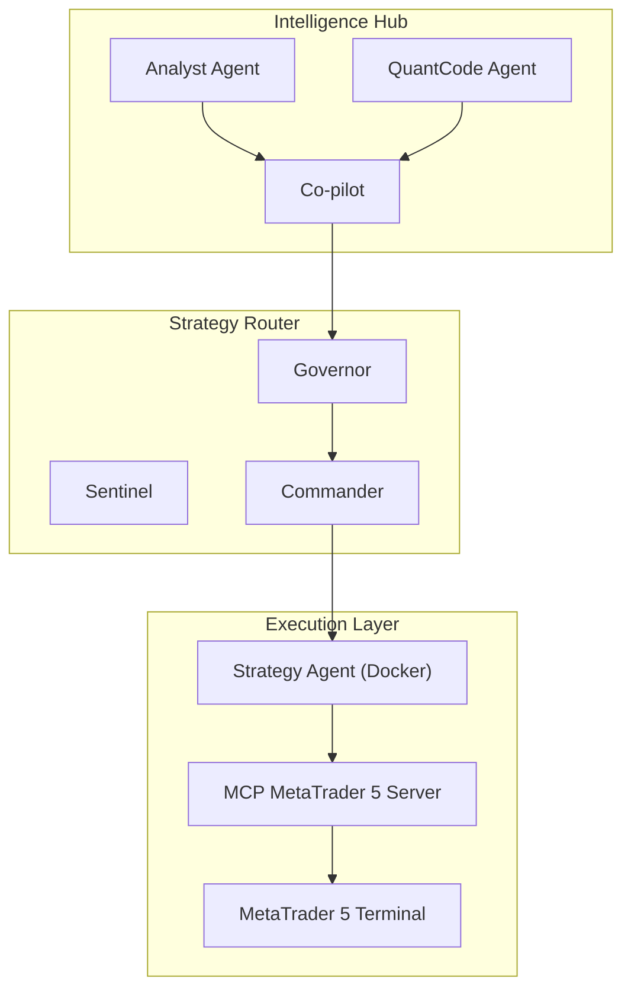
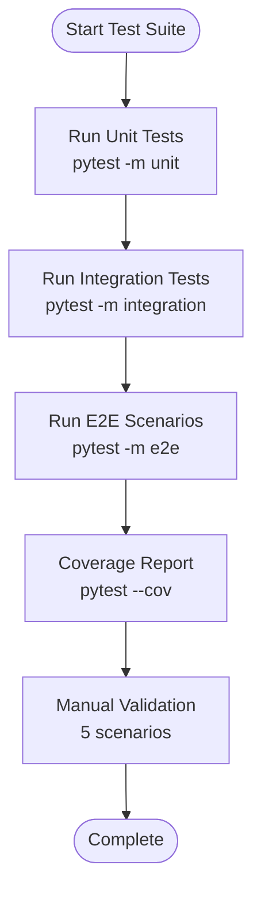
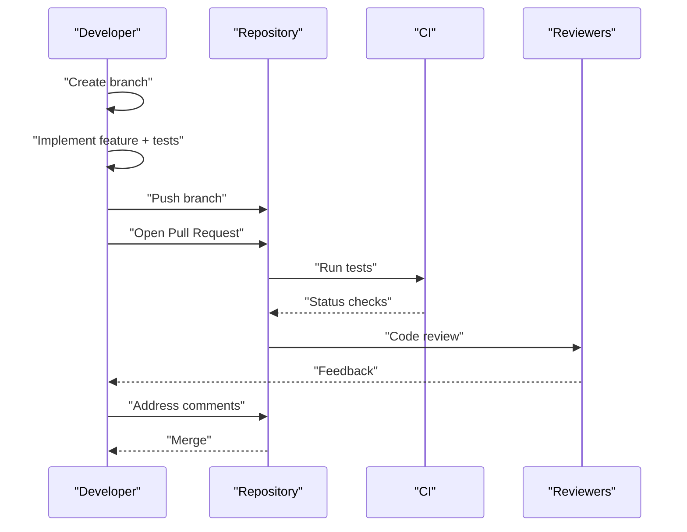
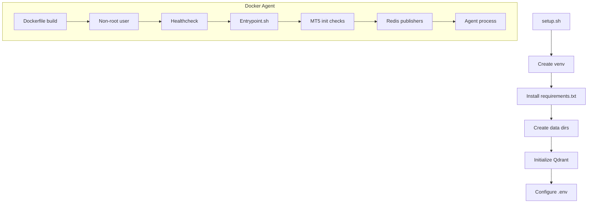
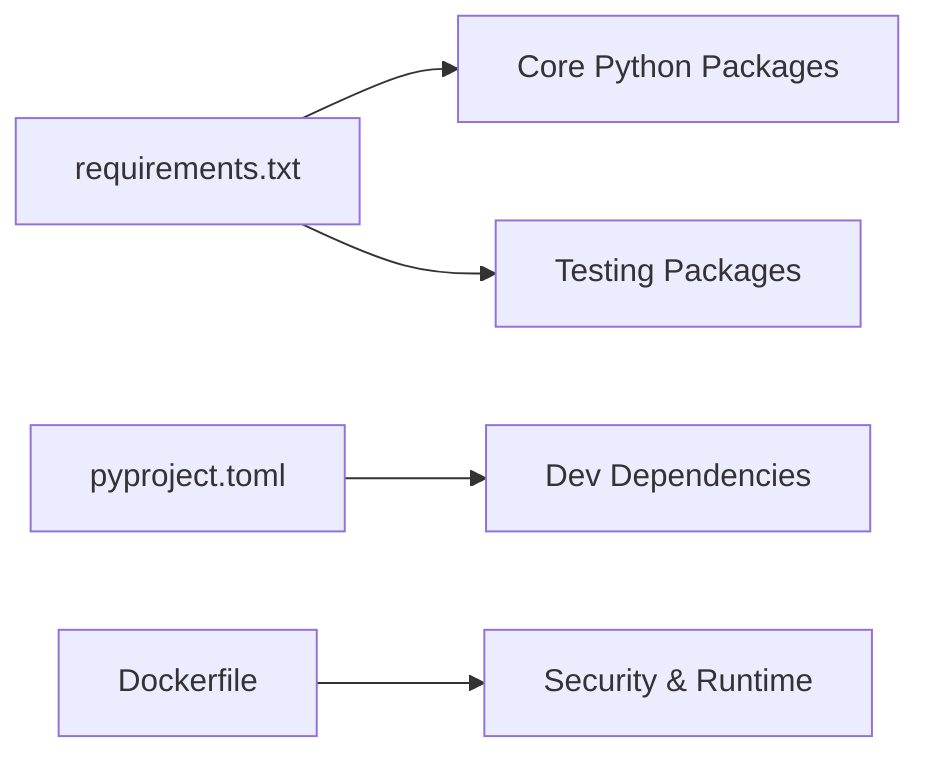

# Development Guidelines

<cite>
**Referenced Files in This Document**
- [coding_standards.md](file://data/assets/coding_standards.md)
- [test_specification.md](file://docs/testing/test_specification.md)
- [CONTRIBUTING.md](file://mcp-metatrader5-server/CONTRIBUTING.md)
- [README.md](file://README.md)
- [requirements.txt](file://requirements.txt)
- [pytest.ini](file://pytest.ini)
- [setup.sh](file://setup.sh)
- [Dockerfile](file://docker/strategy-agent/Dockerfile)
- [entrypoint.sh](file://docker/strategy-agent/entrypoint.sh)
- [requirements.txt](file://docker/strategy-agent/requirements.txt)
- [pyproject.toml](file://mcp-metatrader5-server/pyproject.toml)
- [brokers.yaml](file://config/brokers.yaml)
- [cli.py](file://src/agents/cli.py)
</cite>

## Table of Contents
1. [Introduction](#introduction)
2. [Project Structure](#project-structure)
3. [Core Components](#core-components)
4. [Architecture Overview](#architecture-overview)
5. [Detailed Component Analysis](#detailed-component-analysis)
6. [Dependency Analysis](#dependency-analysis)
7. [Performance Considerations](#performance-considerations)
8. [Troubleshooting Guide](#troubleshooting-guide)
9. [Conclusion](#conclusion)
10. [Appendices](#appendices)

## Introduction
This document provides comprehensive development guidelines for QUANTMIND-X. It consolidates coding standards, testing strategies, contribution workflows, environment setup, debugging, performance optimization, project structure conventions, and security considerations tailored for quantitative trading development. The guidelines are grounded in repository artifacts and reflect the project’s multi-language stack (Python, MQL5), containerized deployments, and agent-driven architecture.

## Project Structure
QUANTMIND-X is organized around:
- Core Python packages under src/ implementing agents, routers, risk engines, position sizing, and integrations.
- MQL5 assets under data/assets/templates and extensions/mql5_library for EA development.
- Dockerized strategy agent under docker/strategy-agent for secure, reproducible deployments.
- MCP MetaTrader 5 server under mcp-metatrader5-server for protocol-based trading integration.
- Extensive documentation under docs/, including testing specifications and architecture notes.
- Configuration under config/ (e.g., broker registry) and scripts/ for ingestion and indexing.

**Diagram sources**
- [README.md](file://README.md#L1-L80)
- [brokers.yaml](file://config/brokers.yaml#L1-L116)

**Section sources**
- [README.md](file://README.md#L1-L80)
- [brokers.yaml](file://config/brokers.yaml#L1-L116)

## Core Components
- Agents: CLI entrypoints and agent orchestration under src/agents.
- Router: Market routing, governance, and synchronization under src/router.
- Risk Engine: Tiered risk computation and governor logic under src/risk.
- Position Sizing: Enhanced Kelly and portfolio sizing under src/position_sizing.
- Integrations: Crypto connectors, broker adapters, and MCP tools under src/integrations and src/mcp_tools.
- MQL5: Expert Advisors and shared libraries under src/mql5 and extensions/mql5_library.

Key conventions observed:
- Type hints and docstrings for Python code.
- Strict compilation and risk management for MQL5.
- Centralized broker configuration via YAML.

**Section sources**
- [coding_standards.md](file://data/assets/coding_standards.md#L1-L16)
- [cli.py](file://src/agents/cli.py#L1-L58)
- [brokers.yaml](file://config/brokers.yaml#L1-L116)

## Architecture Overview
The system comprises:
- Intelligence Hub (Analyst, QuantCode, Co-pilot) orchestrated via LangGraph/LangChain.
- Strategy Router (Sentinel, Governor, Commander) enforcing risk and dispatching strategies.
- MCP MetaTrader 5 server enabling protocol-based trading.
- Dockerized strategy agent for secure, isolated execution.

**Diagram sources**
- [README.md](file://README.md#L7-L38)
- [Dockerfile](file://docker/strategy-agent/Dockerfile#L1-L83)
- [entrypoint.sh](file://docker/strategy-agent/entrypoint.sh#L1-L266)

**Section sources**
- [README.md](file://README.md#L1-L80)
- [Dockerfile](file://docker/strategy-agent/Dockerfile#L1-L83)
- [entrypoint.sh](file://docker/strategy-agent/entrypoint.sh#L1-L266)

## Detailed Component Analysis

### Coding Standards
- Python
  - Use typing and docstrings for all public functions.
  - Prefer safe IO and avoid external network calls except via MCP.
- MQL5
  - Compile with zero warnings.
  - Enforce SL/TP on every order and use input variables for strategy parameters.
- Backtesting
  - Use Backtrader with flexible CSV/Pandas processing.

**Section sources**
- [coding_standards.md](file://data/assets/coding_standards.md#L1-L16)

### Testing Strategies
- Test Pyramid
  - Unit tests (pytest): 50+ cases, focused on isolation and speed.
  - Integration tests: Broker registry, hybrid core, socket/websocket stability.
  - End-to-end: Full workflow, backtest refinement, paper trading, deployment.
- Coverage Targets
  - Statement/Branch/Function/Line coverage targets defined in the test spec.
- Execution Guidelines
  - Use pytest markers (unit, integration, load, property, asyncio).
  - Configure timeouts and strict markers for reliability.
- TDD Philosophy
  - RED-GREEN-REFACTOR cycle enforced across components.

**Diagram sources**
- [test_specification.md](file://docs/testing/test_specification.md#L29-L74)
- [pytest.ini](file://pytest.ini#L16-L31)

**Section sources**
- [test_specification.md](file://docs/testing/test_specification.md#L1-L1929)
- [pytest.ini](file://pytest.ini#L1-L53)

### Contribution Guidelines
- Development Workflow
  - Fork, branch, develop, test, document, and submit PRs.
  - Use conventional commit types (feat, fix, docs, test, refactor, ci, chore).
- Code Style
  - Lint/format with ruff; auto-fix where possible.
- Testing
  - Add tests alongside new functionality; mark appropriately.
- Documentation
  - Update docstrings and docs/ as needed; build locally with mkdocs.

**Diagram sources**
- [CONTRIBUTING.md](file://mcp-metatrader5-server/CONTRIBUTING.md#L45-L182)

**Section sources**
- [CONTRIBUTING.md](file://mcp-metatrader5-server/CONTRIBUTING.md#L1-L264)

### Development Environment Setup
- Local Setup
  - Use setup.sh to create a venv, install dependencies, create directories, and initialize Qdrant.
  - Configure .env with API keys and service endpoints.
- Dockerized Agent
  - Build and run the strategy agent container with non-root user, read-only FS, and health checks.
  - Entrypoint initializes MT5 checks, starts heartbeat and trade publishers, and launches the agent.
- MCP MetaTrader 5 Server
  - Install with uv, configure .env, and run unit tests to validate setup.

**Diagram sources**
- [setup.sh](file://setup.sh#L1-L122)
- [Dockerfile](file://docker/strategy-agent/Dockerfile#L1-L83)
- [entrypoint.sh](file://docker/strategy-agent/entrypoint.sh#L1-L266)

**Section sources**
- [setup.sh](file://setup.sh#L1-L122)
- [Dockerfile](file://docker/strategy-agent/Dockerfile#L1-L83)
- [entrypoint.sh](file://docker/strategy-agent/entrypoint.sh#L1-L266)
- [pyproject.toml](file://mcp-metatrader5-server/pyproject.toml#L59-L86)

### Debugging Techniques
- Logging
  - Use structlog and python-json-logger in the agent container for structured logs.
- Graceful Shutdown
  - Entrypoint traps SIGTERM/SIGINT to stop background publishers cleanly.
- MT5 Diagnostics
  - Entrypoint attempts MT5 initialization and logs last error if unavailable (expected in containers).
- Test Isolation
  - pytest.ini sets strict markers and disables warnings to surface hidden issues.

**Section sources**
- [entrypoint.sh](file://docker/strategy-agent/entrypoint.sh#L222-L239)
- [entrypoint.sh](file://docker/strategy-agent/entrypoint.sh#L43-L81)
- [pytest.ini](file://pytest.ini#L24-L31)

### Performance Optimization Guidelines
- Coverage-Driven Refactoring
  - Maintain and improve coverage targets to ensure reliable hot paths.
- Async Patterns
  - Favor asyncio-compatible clients (aiohttp) and minimize blocking calls.
- Broker Registry and Connectivity
  - Use the YAML registry to manage multiple brokers; tune retries and timeouts.
- Container Hardening
  - Limit resources (CPU/memory) and restrict privileges in docker-compose for predictable latency.

**Section sources**
- [test_specification.md](file://docs/testing/test_specification.md#L58-L74)
- [requirements.txt](file://requirements.txt#L51-L55)
- [brokers.yaml](file://config/brokers.yaml#L1-L116)
- [Dockerfile](file://docker/strategy-agent/Dockerfile#L69-L78)

### Project Structure Conventions and Naming Patterns
- Python
  - Modules under src/<area>/; tests mirror structure under tests/.
  - CLI entrypoints under src/agents/cli.py.
- MQL5
  - Templates under data/assets/templates/base_strategy.mq5.
  - Libraries under extensions/mql5_library/Include/QuantMind/ and Experts/.
- Configuration
  - YAML-based broker registry under config/brokers.yaml.
- Documentation
  - Architecture and testing docs under docs/.

**Section sources**
- [cli.py](file://src/agents/cli.py#L1-L58)
- [brokers.yaml](file://config/brokers.yaml#L1-L116)

### Architectural Decision-Making Processes
- Multi-Agent Orchestration
  - Analyst Agent parses NPRD/transcripts; QuantCode Agent compiles and refines strategies; Co-pilot coordinates.
- Risk-Aware Dispatch
  - Sentinel detects chaos; Governor enforces caps; Commander auctions strategies.
- MCP Integration
  - Protocol-first trading via MCP MetaTrader 5 server with optional MT5 socket bridge.

**Section sources**
- [README.md](file://README.md#L7-L38)

### Security Considerations
- Container Security
  - Non-root user, read-only root filesystem, capability drops, and healthchecks.
- Secrets Management
  - Load secrets from .env and environment variables; avoid embedding credentials.
- Network Boundaries
  - Restrict outbound calls to MCP-defined services; avoid ad-hoc network IO.

**Section sources**
- [Dockerfile](file://docker/strategy-agent/Dockerfile#L29-L64)
- [entrypoint.sh](file://docker/strategy-agent/entrypoint.sh#L31-L41)
- [coding_standards.md](file://data/assets/coding_standards.md#L4-L5)

### Best Practices for Quantitative Trading Development
- Safety-First IO and Networking
  - Enforce allowed directories and MCP-only external calls.
- MQL5 Discipline
  - Zero-warning builds, mandatory SL/TP, and parameterized inputs.
- Backtesting Rigor
  - Use Backtrader with flexible data feeds; validate assumptions with property-based tests.
- Continuous Quality
  - Maintain coverage targets; enforce TDD; automate linting and formatting.

**Section sources**
- [coding_standards.md](file://data/assets/coding_standards.md#L4-L16)
- [test_specification.md](file://docs/testing/test_specification.md#L58-L74)
- [CONTRIBUTING.md](file://mcp-metatrader5-server/CONTRIBUTING.md#L80-L93)

## Dependency Analysis
- Python Dependencies
  - Core: LangChain, LangGraph, OpenAI/Anthropic, Pydantic, Click, Rich, pandas, numpy, scipy, aiohttp, ccxt.
  - Testing: pytest, pytest-asyncio, pytest-cov, hypothesis.
  - V8 Expansion: pyzmq, aiohttp, ccxt.
- MCP MetaTrader 5 Server
  - Uses uv for dependency management; pytest configuration and markers defined in pyproject.toml.
- Docker Agent
  - Minimal base image, non-root user, pinned versions, and security-focused runtime flags.

**Diagram sources**
- [requirements.txt](file://requirements.txt#L1-L55)
- [pyproject.toml](file://mcp-metatrader5-server/pyproject.toml#L22-L86)
- [Dockerfile](file://docker/strategy-agent/Dockerfile#L4-L43)

**Section sources**
- [requirements.txt](file://requirements.txt#L1-L55)
- [pyproject.toml](file://mcp-metatrader5-server/pyproject.toml#L22-L86)
- [Dockerfile](file://docker/strategy-agent/Dockerfile#L4-L43)

## Performance Considerations
- Favor fast unit tests (<100ms) and isolate dependencies.
- Use asyncio-compatible clients and avoid blocking I/O.
- Tune broker connectivity (timeouts, retries) and leverage property-based tests to validate invariants.
- Container resource limits and read-only FS for predictable latency.

**Section sources**
- [test_specification.md](file://docs/testing/test_specification.md#L69-L74)
- [requirements.txt](file://requirements.txt#L51-L55)
- [Dockerfile](file://docker/strategy-agent/Dockerfile#L69-L78)

## Troubleshooting Guide
- Setup Issues
  - Verify Python version and venv activation; ensure Qdrant path exists after setup.sh.
- Docker Agent
  - Confirm non-root execution, healthcheck passes, and Redis connectivity.
  - Entrypoint logs MT5 initialization failures; expected in containerized environments without MT5 terminal.
- Tests
  - Run with strict markers and coverage; use pytest.ini defaults to prevent hangs.
- Broker Connectivity
  - Validate .env and broker registry entries; confirm enabled flags and environment variable substitution.

**Section sources**
- [setup.sh](file://setup.sh#L20-L28)
- [entrypoint.sh](file://docker/strategy-agent/entrypoint.sh#L31-L41)
- [entrypoint.sh](file://docker/strategy-agent/entrypoint.sh#L43-L81)
- [pytest.ini](file://pytest.ini#L24-L31)
- [brokers.yaml](file://config/brokers.yaml#L90-L116)

## Conclusion
These guidelines consolidate QUANTMIND-X’s coding standards, testing methodologies, contribution workflows, environment setup, debugging, performance, and security practices. By adhering to these standards—especially safety-first IO/networking, strict MQL5 discipline, TDD with coverage targets, and container hardening—contributors can reliably deliver robust, scalable quantitative trading solutions.

## Appendices
- CLI Usage
  - Launch agents via src/agents/cli.py with chat subcommand.
- Broker Registry
  - Configure multiple brokers (MT5 mock/socket, Binance Spot/Futures) in YAML.

**Section sources**
- [cli.py](file://src/agents/cli.py#L18-L58)
- [brokers.yaml](file://config/brokers.yaml#L1-L116)