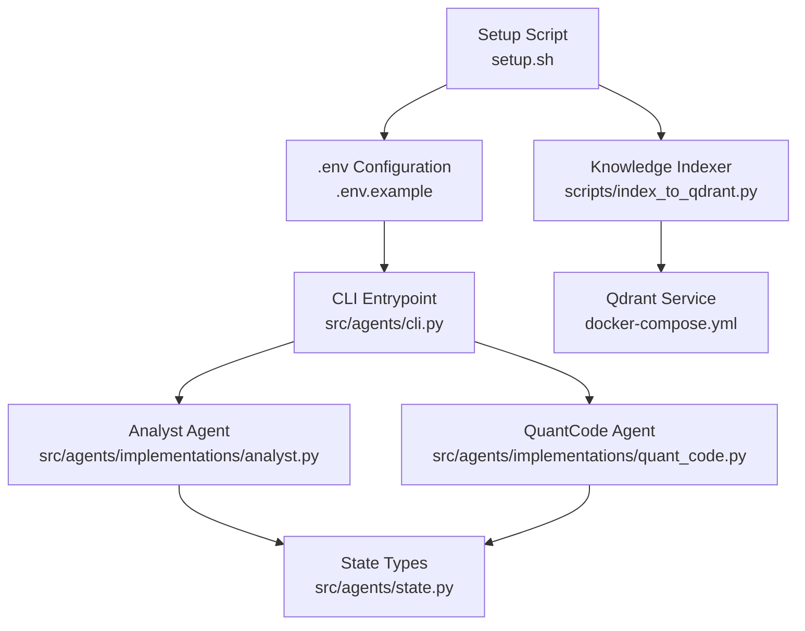
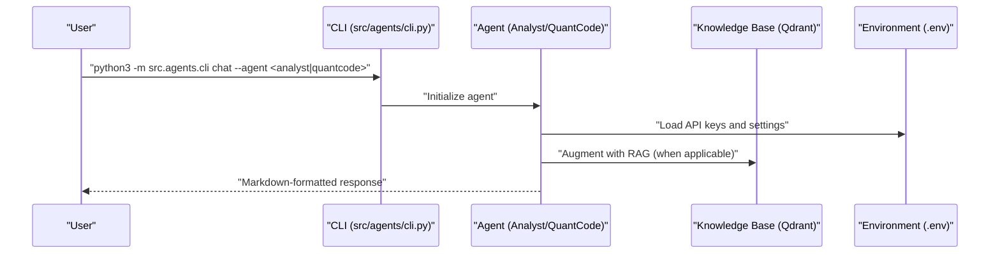
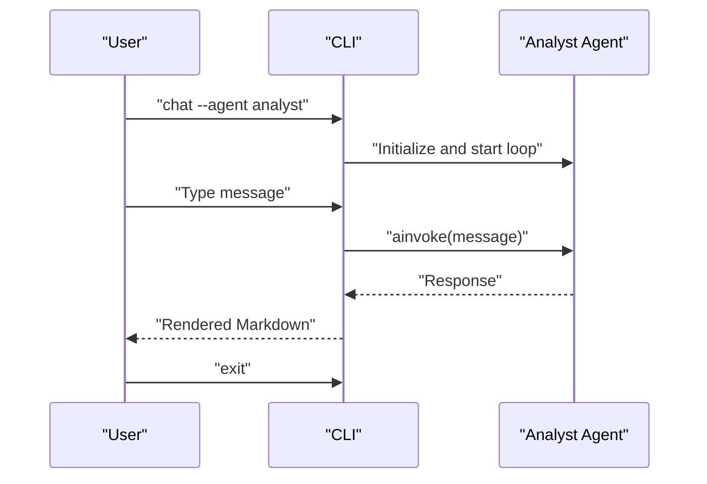
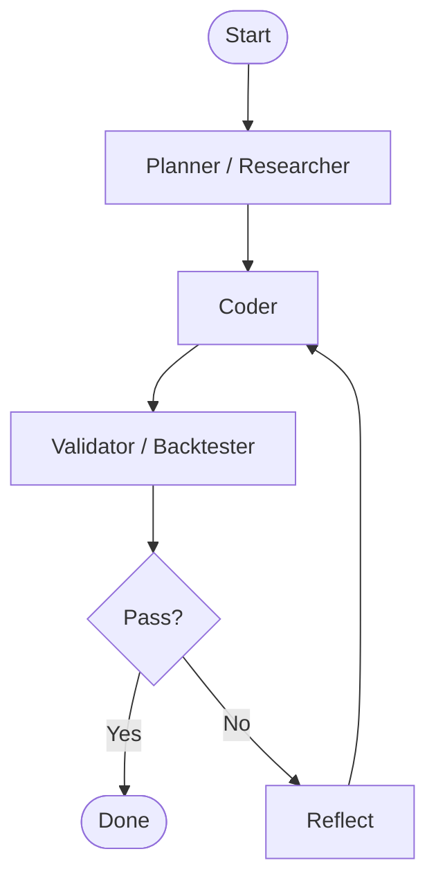
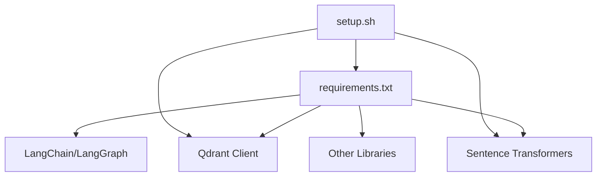

# Getting Started

<cite>
**Referenced Files in This Document**
- [README.md](file://README.md)
- [setup.sh](file://setup.sh)
- [requirements.txt](file://requirements.txt)
- [docker-compose.yml](file://docker-compose.yml)
- [.env.example](file://.env.example)
- [src/agents/cli.py](file://src/agents/cli.py)
- [src/agents/implementations/analyst.py](file://src/agents/implementations/analyst.py)
- [src/agents/implementations/quant_code.py](file://src/agents/implementations/quant_code.py)
- [src/agents/state.py](file://src/agents/state.py)
- [scripts/index_to_qdrant.py](file://scripts/index_to_qdrant.py)
- [docker/strategy-agent/Dockerfile](file://docker/strategy-agent/Dockerfile)
- [server/Dockerfile](file://server/Dockerfile)
</cite>

## Table of Contents
1. [Introduction](#introduction)
2. [Project Structure](#project-structure)
3. [Core Components](#core-components)
4. [Architecture Overview](#architecture-overview)
5. [Detailed Component Analysis](#detailed-component-analysis)
6. [Dependency Analysis](#dependency-analysis)
7. [Performance Considerations](#performance-considerations)
8. [Troubleshooting Guide](#troubleshooting-guide)
9. [Conclusion](#conclusion)
10. [Appendices](#appendices)

## Introduction
This guide helps you install, configure, and use QUANTMIND-X for the first time. You will set up the environment, configure API keys, index knowledge, and interact with the Analyst and QuantCode agents via the CLI. It also covers system requirements, verification steps, and initial troubleshooting.

## Project Structure
QUANTMIND-X is a multi-component system:
- Agents and workflows live under src/agents
- CLI entrypoint is in src/agents/cli.py
- Knowledge indexing is provided by scripts/index_to_qdrant.py
- Environment variables are configured via .env and .env.example
- Docker Compose provisions Qdrant and a knowledge indexer service
- Dockerfiles define containerized services for strategy agents and servers

**Diagram sources**
- [src/agents/cli.py](file://src/agents/cli.py#L1-L58)
- [src/agents/implementations/analyst.py](file://src/agents/implementations/analyst.py#L1-L134)
- [src/agents/implementations/quant_code.py](file://src/agents/implementations/quant_code.py#L1-L139)
- [src/agents/state.py](file://src/agents/state.py#L1-L76)
- [.env.example](file://.env.example#L1-L25)
- [scripts/index_to_qdrant.py](file://scripts/index_to_qdrant.py#L1-L182)
- [docker-compose.yml](file://docker-compose.yml#L1-L27)
- [setup.sh](file://setup.sh#L1-L122)

**Section sources**
- [README.md](file://README.md#L41-L64)
- [setup.sh](file://setup.sh#L1-L122)
- [docker-compose.yml](file://docker-compose.yml#L1-L27)

## Core Components
- CLI: Provides chat sessions with Analyst and QuantCode agents.
- Analyst Agent: Extracts strategy mechanics from NPRD, augments with knowledge base, checks compliance, and synthesizes a TRD.
- QuantCode Agent: Plans, generates, validates, reflects, and refines strategy code iteratively.
- State Management: Defines typed state structures for agents and workflows.
- Knowledge Indexer: Builds a vector index in Qdrant from scraped articles.
- Environment Configuration: Centralized via .env and .env.example.

**Section sources**
- [src/agents/cli.py](file://src/agents/cli.py#L1-L58)
- [src/agents/implementations/analyst.py](file://src/agents/implementations/analyst.py#L1-L134)
- [src/agents/implementations/quant_code.py](file://src/agents/implementations/quant_code.py#L1-L139)
- [src/agents/state.py](file://src/agents/state.py#L1-L76)
- [scripts/index_to_qdrant.py](file://scripts/index_to_qdrant.py#L1-L182)

## Architecture Overview
The system integrates:
- CLI-driven agent interactions
- LangGraph-based workflows for Analyst and QuantCode
- Qdrant-backed knowledge base for retrieval
- Docker orchestration for services

**Diagram sources**
- [src/agents/cli.py](file://src/agents/cli.py#L22-L54)
- [src/agents/implementations/analyst.py](file://src/agents/implementations/analyst.py#L48-L122)
- [src/agents/implementations/quant_code.py](file://src/agents/implementations/quant_code.py#L50-L127)
- [.env.example](file://.env.example#L1-L25)

## Detailed Component Analysis

### Installation and Setup
Follow these steps to install and configure QUANTMIND-X:

1. Install system dependencies
   - Ensure Python 3.10+ is installed.
   - Confirm pip is available.

2. Create a virtual environment and install Python dependencies
   - Use the provided setup script to create venv and install requirements.

3. Prepare directories and environment
   - The setup script creates data directories and a starter .env file.
   - Add your API keys to .env.

4. Initialize Qdrant
   - The setup script attempts to create the mql5_knowledge collection locally.
   - Alternatively, use Docker Compose to run Qdrant as a service.

5. Index knowledge
   - Run the knowledge indexer to embed and store scraped articles in Qdrant.

6. Verify installation
   - Run the CLI to chat with agents.
   - Optionally run the router stress test.

**Section sources**
- [setup.sh](file://setup.sh#L20-L122)
- [requirements.txt](file://requirements.txt#L1-L55)
- [docker-compose.yml](file://docker-compose.yml#L1-L27)
- [scripts/index_to_qdrant.py](file://scripts/index_to_qdrant.py#L69-L182)
- [README.md](file://README.md#L41-L64)

### Environment Configuration
- Required for OpenRouter
  - Set OPENROUTER_API_KEY and OPENROUTER_BASE_URL in .env.
- Additional optional keys
  - FIRECRAWL_API_KEY, QDRANT_HOST/PORT, OPENAI_API_KEY, ANTHROPIC_API_KEY, Binance keys for crypto module.
- Example template
  - See .env.example for all supported variables.

**Section sources**
- [README.md](file://README.md#L43-L48)
- [.env.example](file://.env.example#L1-L25)

### Initial System Configuration
- Create directories for inputs, scraped articles, Qdrant storage, and logs.
- Generate .env with placeholders; fill in your keys.
- Optionally run Docker Compose to provision Qdrant and a one-shot knowledge indexer.

**Section sources**
- [setup.sh](file://setup.sh#L65-L86)
- [docker-compose.yml](file://docker-compose.yml#L1-L27)

### CLI Interaction Examples
- Chat with the Analyst agent
  - python3 -m src.agents.cli chat --agent analyst
- Chat with the QuantCode agent
  - python3 -m src.agents.cli chat --agent quantcode
- Exit the session by typing exit or quit.

**Diagram sources**
- [src/agents/cli.py](file://src/agents/cli.py#L22-L54)
- [src/agents/implementations/analyst.py](file://src/agents/implementations/analyst.py#L123-L134)

**Section sources**
- [src/agents/cli.py](file://src/agents/cli.py#L50-L54)
- [README.md](file://README.md#L50-L58)

### Basic Usage Examples
- Analyst agent
  - Provide a research query; the agent gathers context, extracts insights, synthesizes a report, and validates quality.
- QuantCode agent
  - Provide a strategy request; the agent plans, writes code, validates/backtests, reflects, and repeats until quality criteria are met.

**Diagram sources**
- [src/agents/implementations/analyst.py](file://src/agents/implementations/analyst.py#L48-L122)
- [src/agents/implementations/quant_code.py](file://src/agents/implementations/quant_code.py#L50-L127)

**Section sources**
- [src/agents/implementations/analyst.py](file://src/agents/implementations/analyst.py#L1-L134)
- [src/agents/implementations/quant_code.py](file://src/agents/implementations/quant_code.py#L1-L139)

### Common Command Patterns
- Launch agents via CLI
  - python3 -m src.agents.cli chat --agent analyst
  - python3 -m src.agents.cli chat --agent quantcode
- Index knowledge base
  - python3 scripts/index_to_qdrant.py
- Run router stress test
  - python3 stress_test_router.py

**Section sources**
- [README.md](file://README.md#L50-L64)
- [scripts/index_to_qdrant.py](file://scripts/index_to_qdrant.py#L69-L182)

### Verification Steps
- Confirm environment variables are loaded by the agent initialization.
- Verify Qdrant connectivity and collection presence.
- Ensure the knowledge indexer completes without errors.
- Test CLI chat sessions and observe rendered responses.

**Section sources**
- [scripts/index_to_qdrant.py](file://scripts/index_to_qdrant.py#L79-L105)
- [src/agents/cli.py](file://src/agents/cli.py#L22-L54)

## Dependency Analysis
Key runtime dependencies include LangChain, LangGraph, Qdrant client, sentence-transformers, and others. The setup script installs these and prepares the environment.

**Diagram sources**
- [requirements.txt](file://requirements.txt#L1-L55)
- [setup.sh](file://setup.sh#L42-L63)

**Section sources**
- [requirements.txt](file://requirements.txt#L1-L55)
- [setup.sh](file://setup.sh#L42-L63)

## Performance Considerations
- Embedding model downloads occur on first index; expect initial latency.
- Qdrant local path indexing is efficient; consider Docker Compose for persistent storage.
- Agent workflows rely on network calls to LLM providers; ensure stable connectivity.

[No sources needed since this section provides general guidance]

## Troubleshooting Guide
- Missing Python or pip
  - Ensure Python 3.10+ and pip are installed before running setup.sh.
- Missing dependencies during setup
  - Re-run setup.sh to install qdrant-client and sentence-transformers.
- Qdrant collection creation
  - On first run, the script attempts to create the collection; if it fails, start Qdrant via Docker Compose.
- Knowledge indexing errors
  - Verify data/scraped_articles exists and contains .md files.
  - Confirm embedding model loads and vectors are generated.
- CLI chat issues
  - Ensure .env contains valid API keys.
  - Check that the agent factory functions are reachable from the CLI entrypoint.

**Section sources**
- [setup.sh](file://setup.sh#L20-L27)
- [setup.sh](file://setup.sh#L87-L106)
- [scripts/index_to_qdrant.py](file://scripts/index_to_qdrant.py#L16-L31)
- [scripts/index_to_qdrant.py](file://scripts/index_to_qdrant.py#L74-L78)
- [scripts/index_to_qdrant.py](file://scripts/index_to_qdrant.py#L146-L148)
- [src/agents/cli.py](file://src/agents/cli.py#L22-L54)

## Conclusion
You are now ready to use QUANTMIND-X. Install dependencies, configure environment variables, index knowledge, and interact with the Analyst and QuantCode agents via the CLI. Use the troubleshooting section to resolve common issues and verify your setup.

[No sources needed since this section summarizes without analyzing specific files]

## Appendices

### Environment Variable Setup (OpenRouter)
- Set OPENROUTER_API_KEY and OPENROUTER_BASE_URL in .env.
- Reference .env.example for the complete list of supported variables.

**Section sources**
- [README.md](file://README.md#L43-L48)
- [.env.example](file://.env.example#L1-L25)

### Docker Services
- Qdrant service runs on localhost:6333 with persistent storage.
- A one-shot knowledge indexer service depends on Qdrant.

**Section sources**
- [docker-compose.yml](file://docker-compose.yml#L1-L27)

### Container Hardening Notes
- Strategy agent Dockerfile sets non-root user, read-only root filesystem, and health checks.
- Server Dockerfile installs Node, Python tools, and exposes port 3000.

**Section sources**
- [docker/strategy-agent/Dockerfile](file://docker/strategy-agent/Dockerfile#L1-L83)
- [server/Dockerfile](file://server/Dockerfile#L1-L49)