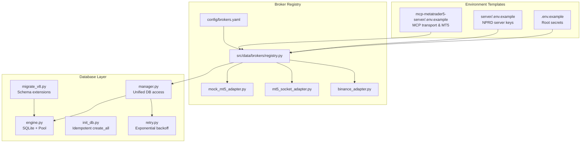
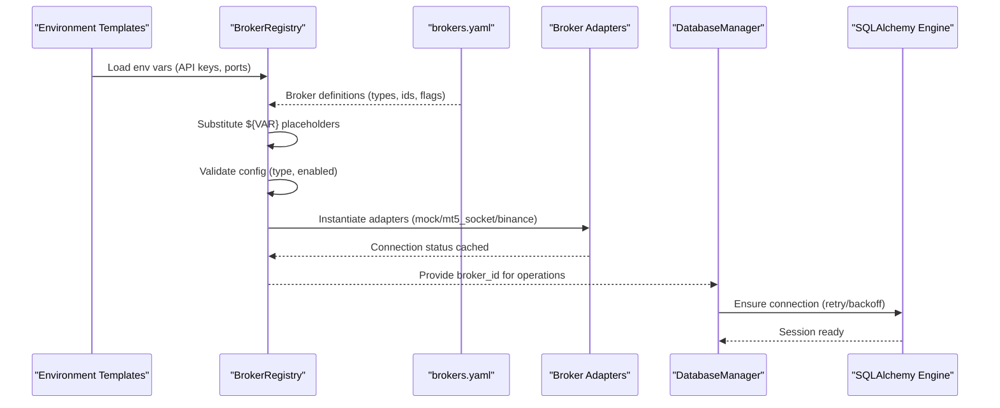
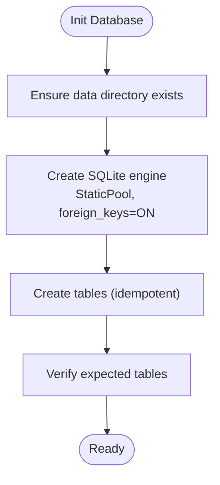
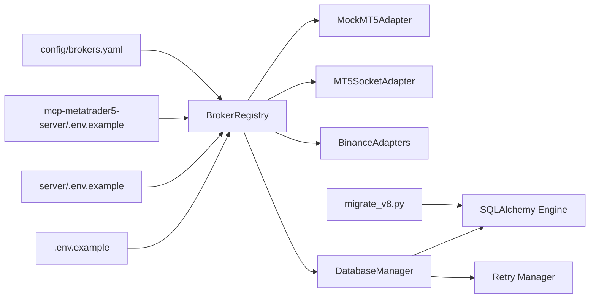

# Configuration Management

<cite>
**Referenced Files in This Document**
- [.env.example](file://.env.example)
- [config/brokers.yaml](file://config/brokers.yaml)
- [src/data/brokers/registry.py](file://src/data/brokers/registry.py)
- [src/data/brokers/mt5_socket_adapter.py](file://src/data/brokers/mt5_socket_adapter.py)
- [src/data/brokers/binance_adapter.py](file://src/data/brokers/binance_adapter.py)
- [src/data/brokers/mock_mt5_adapter.py](file://src/data/brokers/mock_mt5_adapter.py)
- [src/database/engine.py](file://src/database/engine.py)
- [src/database/init_db.py](file://src/database/init_db.py)
- [src/database/manager.py](file://src/database/manager.py)
- [src/database/migrate_v8.py](file://src/database/migrate_v8.py)
- [src/database/retry.py](file://src/database/retry.py)
- [server/.env.example](file://server/.env.example)
- [mcp-metatrader5-server/.env.example](file://mcp-metatrader5-server/.env.example)
- [docker/strategy-agent/validate_config.py](file://docker/strategy-agent/validate_config.py)
</cite>

## Table of Contents
1. [Introduction](#introduction)
2. [Project Structure](#project-structure)
3. [Core Components](#core-components)
4. [Architecture Overview](#architecture-overview)
5. [Detailed Component Analysis](#detailed-component-analysis)
6. [Dependency Analysis](#dependency-analysis)
7. [Performance Considerations](#performance-considerations)
8. [Troubleshooting Guide](#troubleshooting-guide)
9. [Conclusion](#conclusion)
10. [Appendices](#appendices)

## Introduction
This document describes the complete configuration system powering the QuantMindX platform. It covers environment variables, broker adapter configurations, and database settings. It explains the .env.example template structure, required API keys, and optional configuration parameters. It documents the broker registry configuration for MetaTrader 5 (including mock and socket bridge variants), crypto exchanges (Binance Spot and Futures), and environment-specific overrides. It also details database connection management, migration procedures, and connection pooling strategies, along with configuration validation, secret management, and deployment best practices.

## Project Structure
The configuration system spans three primary areas:
- Environment variables and templates (.env.example files)
- Broker registry and adapter configurations (YAML + adapter implementations)
- Database configuration, initialization, and migration scripts

**Diagram sources**
- [.env.example](file://.env.example#L1-L25)
- [server/.env.example](file://server/.env.example#L1-L15)
- [mcp-metatrader5-server/.env.example](file://mcp-metatrader5-server/.env.example#L1-L16)
- [config/brokers.yaml](file://config/brokers.yaml#L1-L116)
- [src/data/brokers/registry.py](file://src/data/brokers/registry.py#L1-L356)
- [src/data/brokers/mock_mt5_adapter.py](file://src/data/brokers/mock_mt5_adapter.py#L1-L354)
- [src/data/brokers/mt5_socket_adapter.py](file://src/data/brokers/mt5_socket_adapter.py#L1-L397)
- [src/data/brokers/binance_adapter.py](file://src/data/brokers/binance_adapter.py#L1-L236)
- [src/database/engine.py](file://src/database/engine.py#L1-L68)
- [src/database/init_db.py](file://src/database/init_db.py#L1-L145)
- [src/database/migrate_v8.py](file://src/database/migrate_v8.py#L1-L245)
- [src/database/retry.py](file://src/database/retry.py#L1-L254)
- [src/database/manager.py](file://src/database/manager.py#L1-L841)

**Section sources**
- [.env.example](file://.env.example#L1-L25)
- [server/.env.example](file://server/.env.example#L1-L15)
- [mcp-metatrader5-server/.env.example](file://mcp-metatrader5-server/.env.example#L1-L16)
- [config/brokers.yaml](file://config/brokers.yaml#L1-L116)
- [src/data/brokers/registry.py](file://src/data/brokers/registry.py#L1-L356)
- [src/database/engine.py](file://src/database/engine.py#L1-L68)
- [src/database/init_db.py](file://src/database/init_db.py#L1-L145)
- [src/database/migrate_v8.py](file://src/database/migrate_v8.py#L1-L245)
- [src/database/retry.py](file://src/database/retry.py#L1-L254)
- [src/database/manager.py](file://src/database/manager.py#L1-L841)

## Core Components
- Environment templates define required and optional secrets and server parameters. They include placeholders for API keys, database endpoints, and broker credentials.
- The broker registry loads YAML configurations, substitutes environment variables, validates entries, and instantiates appropriate adapters (mock MT5, socket-based MT5, Binance Spot/Futures).
- Database layer configures SQLite with a static pool, ensures foreign key constraints, and exposes a unified manager with retry logic and session management.

Key configuration artifacts:
- Root environment template: [root .env.example](file://.env.example#L1-L25)
- Server environment template: [server .env.example](file://server/.env.example#L1-L15)
- MCP MT5 environment template: [mcp-metatrader5-server .env.example](file://mcp-metatrader5-server/.env.example#L1-L16)
- Broker registry YAML: [config/brokers.yaml](file://config/brokers.yaml#L1-L116)
- Registry loader and validator: [src/data/brokers/registry.py](file://src/data/brokers/registry.py#L92-L171)
- Database engine and session: [src/database/engine.py](file://src/database/engine.py#L19-L56)
- Database initializer: [src/database/init_db.py](file://src/database/init_db.py#L18-L56)
- Migration script: [src/database/migrate_v8.py](file://src/database/migrate_v8.py#L34-L182)
- Retry and connection manager: [src/database/retry.py](file://src/database/retry.py#L149-L233)

**Section sources**
- [.env.example](file://.env.example#L1-L25)
- [server/.env.example](file://server/.env.example#L1-L15)
- [mcp-metatrader5-server/.env.example](file://mcp-metatrader5-server/.env.example#L1-L16)
- [config/brokers.yaml](file://config/brokers.yaml#L1-L116)
- [src/data/brokers/registry.py](file://src/data/brokers/registry.py#L92-L171)
- [src/database/engine.py](file://src/database/engine.py#L19-L56)
- [src/database/init_db.py](file://src/database/init_db.py#L18-L56)
- [src/database/migrate_v8.py](file://src/database/migrate_v8.py#L34-L182)
- [src/database/retry.py](file://src/database/retry.py#L149-L233)

## Architecture Overview
The configuration architecture integrates environment-driven secrets, broker registry orchestration, and database connectivity with robust retry and migration support.

**Diagram sources**
- [src/data/brokers/registry.py](file://src/data/brokers/registry.py#L92-L171)
- [config/brokers.yaml](file://config/brokers.yaml#L1-L116)
- [src/database/manager.py](file://src/database/manager.py#L56-L77)
- [src/database/retry.py](file://src/database/retry.py#L149-L233)
- [src/database/engine.py](file://src/database/engine.py#L19-L56)

## Detailed Component Analysis

### Environment Templates and Secret Management
- Root template (.env.example): Defines secrets for web scraping, LLM providers, and crypto exchanges, plus optional flags for futures trading.
- Server template (server/.env.example): Defines API keys for external LLM providers and server runtime parameters.
- MCP MT5 template (mcp-metatrader5-server/.env.example): Controls transport mode and optional MT5 client parameters.

Secret management guidelines:
- Never commit real secrets to version control; use .env files or secure secret managers in CI/CD.
- Prefer environment variable substitution in YAML configs (e.g., ${VAR_NAME}) to keep templates portable.
- Rotate keys regularly and restrict provider permissions to minimal required scopes.

Examples of required and optional keys:
- Required: FIRECRAWL_API_KEY, QDRANT_HOST, QDRANT_PORT, GEMINI_API_KEY, BINANCE_API_KEY, BINANCE_API_SECRET.
- Optional: LLM keys (OPENAI, ANTHROPIC), BINANCE_TESTNET keys, BINANCE_FUTURES_ENABLED, MCP transport settings.

**Section sources**
- [.env.example](file://.env.example#L1-L25)
- [server/.env.example](file://server/.env.example#L1-L15)
- [mcp-metatrader5-server/.env.example](file://mcp-metatrader5-server/.env.example#L1-L16)

### Broker Registry Configuration
The broker registry centralizes broker configuration and lifecycle management:
- Loads YAML, substitutes ${VAR_NAME} placeholders with environment variables, validates presence of required fields, and registers adapters.
- Supports:
  - Mock MT5 for development
  - Socket-based MT5 for VPS-hosted terminals
  - Binance Spot and Futures (with testnet support)

Broker types and fields:
- mt5_mock: account_id, server, login, initial_balance, enabled, description.
- mt5_socket: vps_host, vps_port, account_id, timeout, max_retries, enabled, description.
- binance_spot: api_key, api_secret, testnet, enabled, description.
- binance_futures: api_key, api_secret, testnet, enabled, description.

Environment-specific overrides:
- ${VAR_NAME} syntax in YAML resolves to environment variables at runtime, enabling per-environment configuration without changing files.

Validation and lifecycle:
- Validation checks presence of type and adapter availability, and defaults enabled to true if omitted.
- Registration caches connection status; lazy-loading occurs on first access.
- All-enabled registration is supported for startup initialization.

**Section sources**
- [config/brokers.yaml](file://config/brokers.yaml#L1-L116)
- [src/data/brokers/registry.py](file://src/data/brokers/registry.py#L92-L171)
- [src/data/brokers/registry.py](file://src/data/brokers/registry.py#L172-L252)
- [src/data/brokers/registry.py](file://src/data/brokers/registry.py#L274-L298)

### Adapter Implementations
- Mock MT5 Adapter: Simulates balances, orders, positions, and order books for local development and testing.
- Socket MT5 Adapter: Connects to a remote MT5 terminal via ZMQ over TCP, sending requests and receiving responses.
- Binance Adapters: Wrap a shared connector to provide Spot and Futures trading APIs.

Operational notes:
- Socket adapter enforces timeouts and raises explicit connection errors on failures.
- Binance adapters validate credentials and delegate trading operations to the connector.
- Mock adapter maintains deterministic state and updates prices for profit calculation.

**Section sources**
- [src/data/brokers/mock_mt5_adapter.py](file://src/data/brokers/mock_mt5_adapter.py#L21-L354)
- [src/data/brokers/mt5_socket_adapter.py](file://src/data/brokers/mt5_socket_adapter.py#L29-L397)
- [src/data/brokers/binance_adapter.py](file://src/data/brokers/binance_adapter.py#L20-L236)

### Database Configuration, Connection Management, and Migration
Database engine:
- SQLite backend with a static pool suitable for single-writer scenarios.
- Foreign key enforcement enabled via PRAGMA on connect.
- Thread-local scoped sessions created via a session factory.

Initialization:
- Idempotent table creation without destructive operations; supports optional drop-all for controlled resets.
- Directory creation for the database path is handled automatically.

Migration:
- V8 migration adds schema extensions (risk_mode, risk_tier_transitions, crypto_trades) and indexes.
- Backward-compatible; can be applied to existing V7 databases.
- Includes verification steps and rollback guidance.

Connection reliability:
- Retry manager implements exponential backoff with jitter for transient failures.
- Connection manager tests connectivity and executes operations with retry policy.

Unified database manager:
- Singleton providing methods for SQLite tables and ChromaDB vectors.
- Context-managed sessions with automatic commit/rollback and cleanup.

**Diagram sources**
- [src/database/engine.py](file://src/database/engine.py#L16-L67)
- [src/database/init_db.py](file://src/database/init_db.py#L18-L56)

**Section sources**
- [src/database/engine.py](file://src/database/engine.py#L19-L56)
- [src/database/init_db.py](file://src/database/init_db.py#L18-L56)
- [src/database/migrate_v8.py](file://src/database/migrate_v8.py#L34-L182)
- [src/database/retry.py](file://src/database/retry.py#L149-L233)
- [src/database/manager.py](file://src/database/manager.py#L56-L77)

## Dependency Analysis
The configuration system exhibits clear separation of concerns:
- Environment templates feed the broker registry and server components.
- Broker registry depends on YAML configuration and adapter implementations.
- Database manager depends on engine and retry modules, and optionally on ChromaDB client.

**Diagram sources**
- [src/data/brokers/registry.py](file://src/data/brokers/registry.py#L36-L91)
- [config/brokers.yaml](file://config/brokers.yaml#L1-L116)
- [src/database/manager.py](file://src/database/manager.py#L14-L77)
- [src/database/engine.py](file://src/database/engine.py#L19-L56)
- [src/database/migrate_v8.py](file://src/database/migrate_v8.py#L50-L182)

**Section sources**
- [src/data/brokers/registry.py](file://src/data/brokers/registry.py#L36-L91)
- [src/database/manager.py](file://src/database/manager.py#L14-L77)
- [src/database/engine.py](file://src/database/engine.py#L19-L56)
- [src/database/migrate_v8.py](file://src/database/migrate_v8.py#L50-L182)

## Performance Considerations
- SQLite static pool is optimized for single-writer workloads typical in research and backtesting; avoid concurrent writers for best performance.
- Retry backoff reduces thundering herd on transient failures; tune max_retries and delays for production SLAs.
- Indexes created by V8 migration improve query performance for risk tiers and crypto trades.
- Socket adapter timeouts should match expected VPS latency; adjust timeout and max_retries accordingly.

[No sources needed since this section provides general guidance]

## Troubleshooting Guide
Common configuration issues and resolutions:
- Missing or invalid broker type: Ensure type matches an available adapter; the registry validates against known types.
- Disabled broker: enabled flag defaults to true if omitted; explicitly set enabled: false to prevent registration.
- Socket connectivity failures: Verify VPS host/port, firewall rules, and account_id; check timeout and max_retries.
- Database initialization failures: Confirm write permissions to data directory and absence of conflicting locks.
- Migration errors: Review migration logs and ensure SQLite version compatibility; use rollback guidance for testing.

Validation utilities:
- Broker registry validates YAML and environment substitutions; review logs for detailed error messages.
- Retry manager surfaces DatabaseRetryError after max retries; inspect underlying exceptions for root cause.
- Docker configuration validator checks container hardening, healthchecks, and service composition.

**Section sources**
- [src/data/brokers/registry.py](file://src/data/brokers/registry.py#L144-L171)
- [src/database/retry.py](file://src/database/retry.py#L19-L23)
- [docker/strategy-agent/validate_config.py](file://docker/strategy-agent/validate_config.py#L13-L56)

## Conclusion
The QuantMindX configuration system combines environment-driven secrets, a flexible broker registry, and a resilient database layer. By leveraging YAML templates, environment variable substitution, and robust retry logic, the platform supports development, testing, and production deployments with clear separation of concerns and strong operational safeguards.

[No sources needed since this section summarizes without analyzing specific files]

## Appendices

### Environment Variable Reference
- Root secrets:
  - FIRECRAWL_API_KEY
  - QDRANT_HOST, QDRANT_PORT
  - OPENAI_API_KEY, ANTHROPIC_API_KEY
  - BINANCE_API_KEY, BINANCE_API_SECRET
  - BINANCE_TESTNET_KEY, BINANCE_TESTNET_SECRET
  - BINANCE_FUTURES_ENABLED

- Server runtime:
  - GEMINI_API_KEY, QWEN_API_KEY, QWEN_BASE_URL
  - PORT

- MCP MT5 transport:
  - MT5_MCP_TRANSPORT (stdio/http)
  - MT5_MCP_HOST, MT5_MCP_PORT
  - MT5_PATH, MT5_LOGIN, MT5_PASSWORD, MT5_SERVER

**Section sources**
- [.env.example](file://.env.example#L1-L25)
- [server/.env.example](file://server/.env.example#L1-L15)
- [mcp-metatrader5-server/.env.example](file://mcp-metatrader5-server/.env.example#L1-L16)

### Broker Configuration Examples
- Development (mock MT5):
  - mt5_mock with enabled: true and initial_balance set for sandbox testing.
- Testing (Binance testnet):
  - binance_spot_testnet and/or binance_futures_testnet with enabled: true.
- Production (socket MT5 + Binance):
  - mt5_socket with vps_host pointing to VPS and enabled: true.
  - binance_spot_main/binance_futures_main with enabled: true.

**Section sources**
- [config/brokers.yaml](file://config/brokers.yaml#L13-L84)

### Database Migration Procedures
- Apply V8 schema extensions:
  - Run migration script; it adds risk_mode, risk_tier_transitions, crypto_trades, and indexes.
- Verification:
  - Migration logs confirm presence of expected columns and tables.
- Rollback:
  - Drop risk_tier_transitions; note SQLite limitations for dropping columns.

**Section sources**
- [src/database/migrate_v8.py](file://src/database/migrate_v8.py#L34-L182)

### Deployment Best Practices
- Use environment templates to parameterize deployments; keep secrets out of code.
- Validate Docker configuration with the provided validator to enforce security hardening.
- Enable healthchecks and resource limits in compose files.
- Keep retry and timeout settings aligned with expected network conditions.

**Section sources**
- [docker/strategy-agent/validate_config.py](file://docker/strategy-agent/validate_config.py#L13-L198)