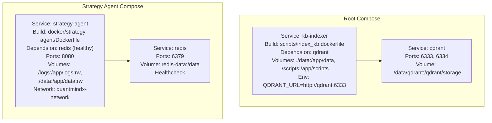
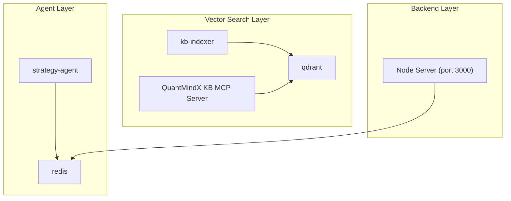
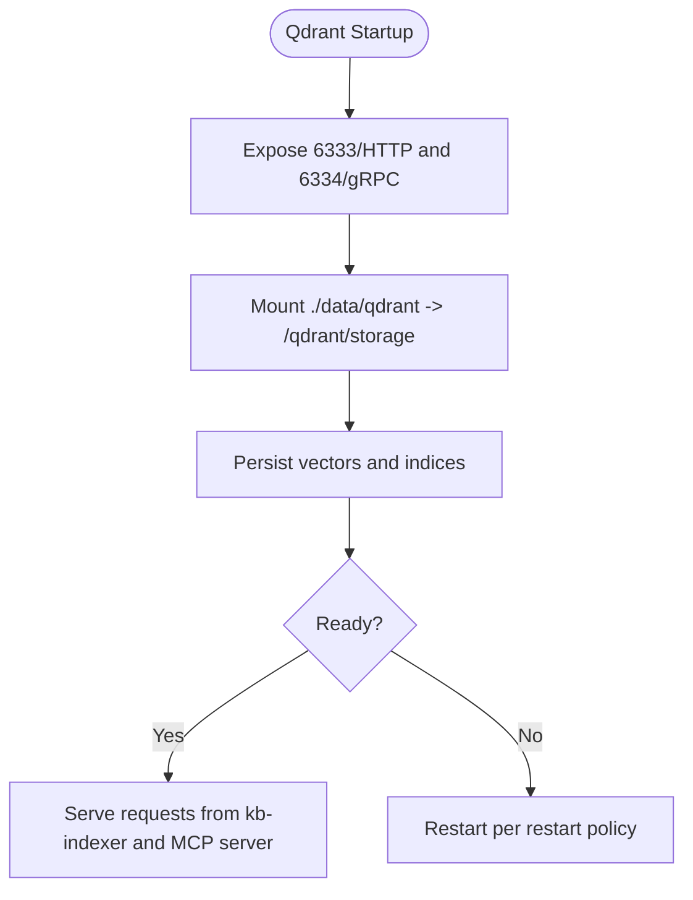
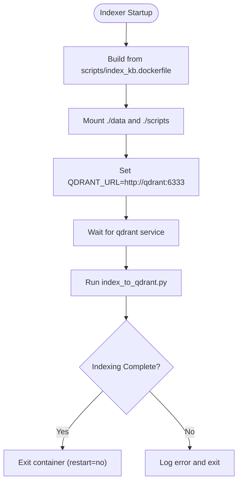
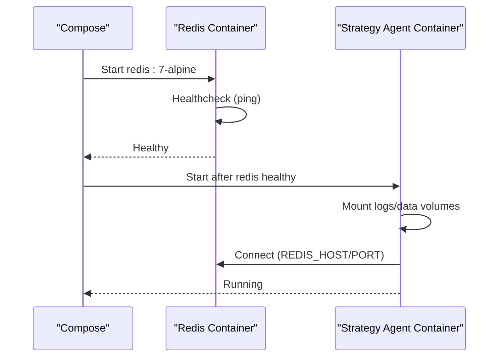
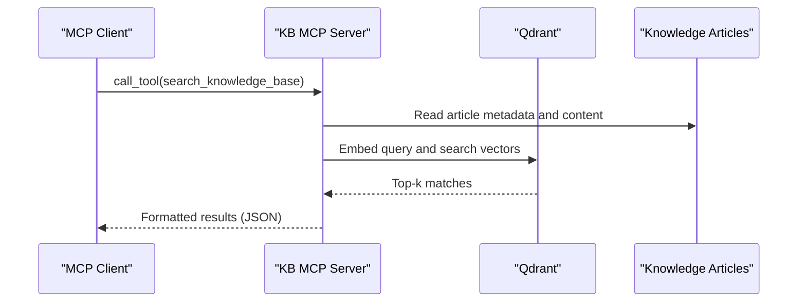
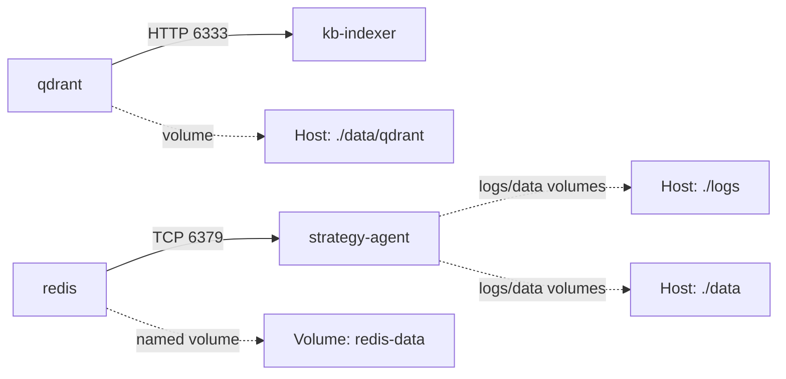

# Dockerized Services

<cite>
**Referenced Files in This Document**
- [docker-compose.yml](file://docker-compose.yml)
- [index_kb.dockerfile](file://scripts/index_kb.dockerfile)
- [server.py](file://mcp-servers/quantmindx-kb/server.py)
- [start.sh](file://mcp-servers/quantmindx-kb/start.sh)
- [kb-start.sh](file://scripts/kb-start.sh)
- [.env.example](file://.env.example)
- [Dockerfile](file://server/Dockerfile)
- [Dockerfile](file://docker/strategy-agent/Dockerfile)
- [docker-compose.yml](file://docker/strategy-agent/docker-compose.yml)
- [mcp-metatrader5-server README.md](file://mcp-metatrader5-server/README.md)
</cite>

## Table of Contents
1. [Introduction](#introduction)
2. [Project Structure](#project-structure)
3. [Core Components](#core-components)
4. [Architecture Overview](#architecture-overview)
5. [Detailed Component Analysis](#detailed-component-analysis)
6. [Dependency Analysis](#dependency-analysis)
7. [Performance Considerations](#performance-considerations)
8. [Troubleshooting Guide](#troubleshooting-guide)
9. [Conclusion](#conclusion)

## Introduction
This document explains the Dockerized Services setup for the QuantMindX platform with a focus on container orchestration for:
- Qdrant vector database service
- Knowledge base indexer service
- MCP server containers (including the QuantMindX Knowledge Base MCP server and the MetaTrader 5 MCP server)

It covers Docker Compose configuration, service dependencies, port mappings, volume mounting strategies, container build processes, environment variable configuration, inter-service communication, startup sequences, health checks, restart policies, networking, data persistence, and troubleshooting guidance.

## Project Structure
The Dockerized Services are primarily orchestrated via two Compose files:
- Root-level compose for Qdrant and the knowledge base indexer
- Strategy Agent compose for Redis and the Strategy Agent service

**Diagram sources**
- [docker-compose.yml](file://docker-compose.yml#L3-L27)
- [docker-compose.yml](file://docker/strategy-agent/docker-compose.yml#L6-L100)

**Section sources**
- [docker-compose.yml](file://docker-compose.yml#L1-L27)
- [docker-compose.yml](file://docker/strategy-agent/docker-compose.yml#L1-L100)

## Core Components
- Qdrant vector database service
  - Image: qdrant/qdrant:latest
  - Ports: 6333 (HTTP), 6334 (gRPC)
  - Volume: persistent storage mounted under /qdrant/storage
  - Restart policy: unless-stopped
- Knowledge Base Indexer service
  - Builds from scripts/index_kb.dockerfile
  - Depends on qdrant
  - Mounts data and scripts directories
  - Environment variable QDRANT_URL points to qdrant service
  - Restart policy: no
- Strategy Agent service (Redis-based)
  - Redis service: image redis:7-alpine, healthchecked, persisted volume
  - Strategy Agent service: build from docker/strategy-agent/Dockerfile, depends on healthy redis, exposes 8080, mounts logs and data, runs on a dedicated network
- MCP servers
  - QuantMindX Knowledge Base MCP server: runs locally or via Docker Compose; integrates with Qdrant for semantic search
  - MetaTrader 5 MCP server: separate server for trading and market data via MCP; supports stdio and HTTP transports

**Section sources**
- [docker-compose.yml](file://docker-compose.yml#L4-L27)
- [docker-compose.yml](file://docker/strategy-agent/docker-compose.yml#L8-L88)
- [index_kb.dockerfile](file://scripts/index_kb.dockerfile#L1-L25)
- [server.py](file://mcp-servers/quantmindx-kb/server.py#L1-L189)
- [mcp-metatrader5-server README.md](file://mcp-metatrader5-server/README.md#L1-L311)

## Architecture Overview
The system orchestrates three primary workstreams:
- Vector search pipeline: knowledge ingestion and indexing into Qdrant, served by the QuantMindX Knowledge Base MCP server
- Trading automation pipeline: Redis-backed agent with MCP server for MT5 integration
- Backend services: Node-based server exposing APIs and tools

**Diagram sources**
- [docker-compose.yml](file://docker-compose.yml#L3-L27)
- [docker-compose.yml](file://docker/strategy-agent/docker-compose.yml#L6-L100)
- [server.py](file://mcp-servers/quantmindx-kb/server.py#L38-L48)

## Detailed Component Analysis

### Qdrant Vector Database Service
- Purpose: Persistent vector storage for semantic search over knowledge base content
- Ports:
  - 6333: HTTP API
  - 6334: gRPC API
- Volumes:
  - Host path ./data/qdrant mapped to /qdrant/storage inside the container
- Restart policy: unless-stopped
- Inter-service communication:
  - kb-indexer connects via QDRANT_URL=http://qdrant:6333
  - MCP server (when using local Qdrant path) reads/writes to data/qdrant_db

**Diagram sources**
- [docker-compose.yml](file://docker-compose.yml#L4-L12)

**Section sources**
- [docker-compose.yml](file://docker-compose.yml#L4-L12)

### Knowledge Base Indexer Service
- Build context: scripts/index_kb.dockerfile
- Purpose: ingest scraped articles and index them into Qdrant
- Volumes:
  - ./data:/app/data (mounted for scripts and data)
  - ./scripts:/app/scripts (mounted for indexing scripts)
- Environment:
  - QDRANT_URL=http://qdrant:6333
- Dependencies:
  - depends_on: qdrant
- Restart policy: no (intended for one-off indexing)
- Execution:
  - Default command runs scripts/index_to_qdrant.py against data/scraped_articles/

**Diagram sources**
- [docker-compose.yml](file://docker-compose.yml#L14-L27)
- [index_kb.dockerfile](file://scripts/index_kb.dockerfile#L1-L25)

**Section sources**
- [docker-compose.yml](file://docker-compose.yml#L14-L27)
- [index_kb.dockerfile](file://scripts/index_kb.dockerfile#L1-L25)

### Strategy Agent Service (Redis-based)
- Redis service:
  - Image: redis:7-alpine
  - Healthcheck: ping via redis-cli
  - Persistence: named volume redis-data
  - Ports: 6379
  - Security: read-only root fs, tmpfs for temp dirs, restricted capabilities
- Strategy Agent service:
  - Build: docker/strategy-agent/Dockerfile
  - Depends on redis being healthy
  - Ports: 8080
  - Volumes: ./logs and ./data (read-write), optional MT5 terminal mount (read-only)
  - Security: read-only root fs, tmpfs, capability drop/add, pids limit
  - Networking: custom bridge network quantmindx-network
  - Resource limits: CPUs and memory limits/reservations via deploy.resources
  - Restart policy: on failure with max attempts

**Diagram sources**
- [docker-compose.yml](file://docker/strategy-agent/docker-compose.yml#L8-L88)
- [Dockerfile](file://docker/strategy-agent/Dockerfile#L1-L83)

**Section sources**
- [docker-compose.yml](file://docker/strategy-agent/docker-compose.yml#L8-L88)
- [Dockerfile](file://docker/strategy-agent/Dockerfile#L1-L83)

### MCP Servers
- QuantMindX Knowledge Base MCP Server
  - Runs semantic search over MQL5 knowledge base
  - Integrates with Qdrant for embeddings and retrieval
  - Tools: search_knowledge_base, get_article_content, kb_stats
  - Can be launched via start script or Docker Compose
- MetaTrader 5 MCP Server
  - Provides MCP access to MetaTrader 5 for market data and trading
  - Supports stdio (default for MCP clients) and HTTP modes
  - Environment configuration for transport and MT5 credentials

**Diagram sources**
- [server.py](file://mcp-servers/quantmindx-kb/server.py#L101-L174)

**Section sources**
- [server.py](file://mcp-servers/quantmindx-kb/server.py#L1-L189)
- [start.sh](file://mcp-servers/quantmindx-kb/start.sh#L1-L29)
- [kb-start.sh](file://scripts/kb-start.sh#L1-L27)
- [mcp-metatrader5-server README.md](file://mcp-metatrader5-server/README.md#L43-L151)

## Dependency Analysis
- Service dependencies
  - kb-indexer depends_on qdrant
  - strategy-agent depends_on redis with condition service_healthy
- Networking
  - qdrant and kb-indexer communicate over default bridge network
  - strategy-agent joins quantmindx-network for isolated communication
- Data persistence
  - Qdrant persists vectors under /qdrant/storage
  - Redis persists under redis-data named volume
  - Agent writes logs and data under mounted host paths

**Diagram sources**
- [docker-compose.yml](file://docker-compose.yml#L4-L27)
- [docker-compose.yml](file://docker/strategy-agent/docker-compose.yml#L8-L100)

**Section sources**
- [docker-compose.yml](file://docker-compose.yml#L4-L27)
- [docker-compose.yml](file://docker/strategy-agent/docker-compose.yml#L8-L100)

## Performance Considerations
- CPU and memory limits for the Strategy Agent
  - CPUs: 1.0 limit, 0.25 reservation
  - Memory: 512M limit, 128M reservation
- Health checks
  - Redis: periodic ping healthcheck
  - Strategy Agent: basic healthcheck returning success
- Resource allocation
  - Consider increasing CPU/memory limits for high-throughput scenarios
  - Adjust pids_limit to prevent fork bomb risks
- Storage
  - Ensure sufficient disk space for Qdrant and Redis volumes
  - Monitor growth of ./data/scraped_articles and ./data/qdrant

[No sources needed since this section provides general guidance]

## Troubleshooting Guide
- Qdrant container fails to start or is unhealthy
  - Verify port availability on 6333/6334
  - Confirm volume path ./data/qdrant exists and is writable
  - Check restart policy unless-stopped
- kb-indexer exits immediately
  - Ensure qdrant is healthy before starting kb-indexer
  - Confirm QDRANT_URL is set to http://qdrant:6333
  - Validate that ./data/scraped_articles exists and contains content
- Redis healthcheck failures
  - Confirm redis is reachable on 6379
  - Review healthcheck interval and retries
- Strategy Agent cannot connect to Redis
  - Verify depends_on condition service_healthy
  - Check REDIS_HOST and REDIS_PORT environment variables
- MCP server not responding
  - For QuantMindX KB MCP server, confirm Qdrant is running and collection exists
  - For MetaTrader 5 MCP server, verify transport mode (stdio vs http) and credentials
- Environment variables
  - Root .env.example defines QDRANT_HOST/PORT and other provider keys
  - MCP MT5 server .env.example controls transport and MT5 credentials

**Section sources**
- [docker-compose.yml](file://docker-compose.yml#L4-L27)
- [docker-compose.yml](file://docker/strategy-agent/docker-compose.yml#L8-L88)
- [.env.example](file://.env.example#L5-L8)
- [mcp-metatrader5-server README.md](file://mcp-metatrader5-server/README.md#L6-L16)

## Conclusion
The Dockerized Services provide a modular, secure, and scalable foundation for the QuantMindX platform. Qdrant serves as the vector database for semantic search, kb-indexer performs one-off indexing, and the Strategy Agent leverages Redis for eventing and persistence. MCP servers enable integration with knowledge bases and trading platforms. Proper health checks, restart policies, and volume management ensure reliability and maintainability.