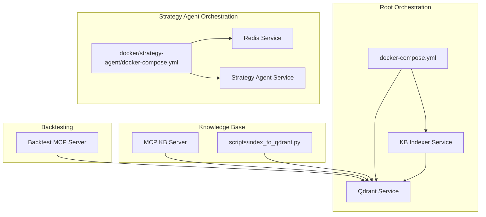
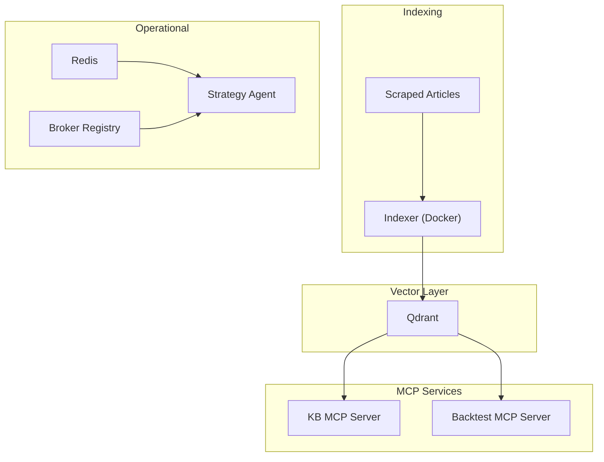
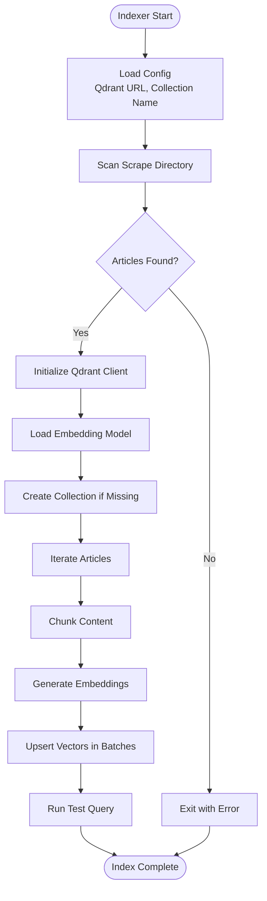
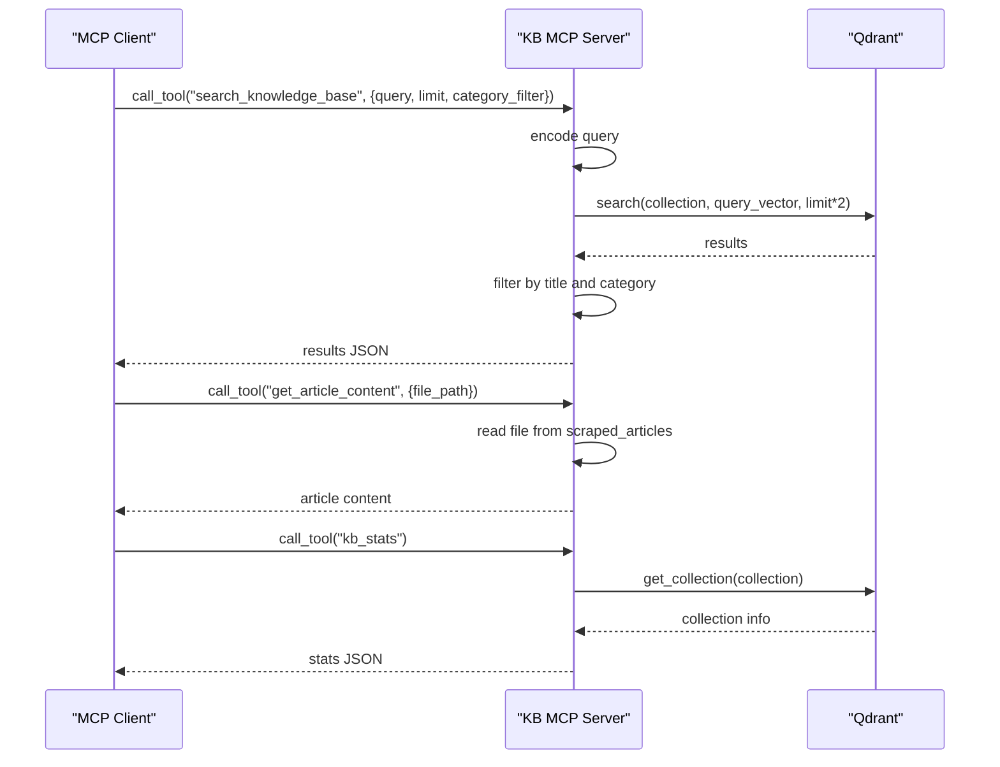
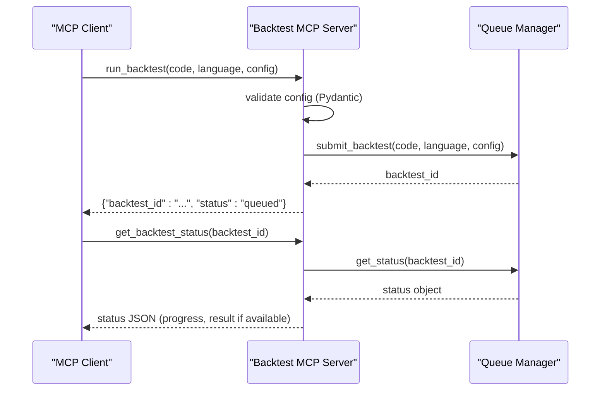
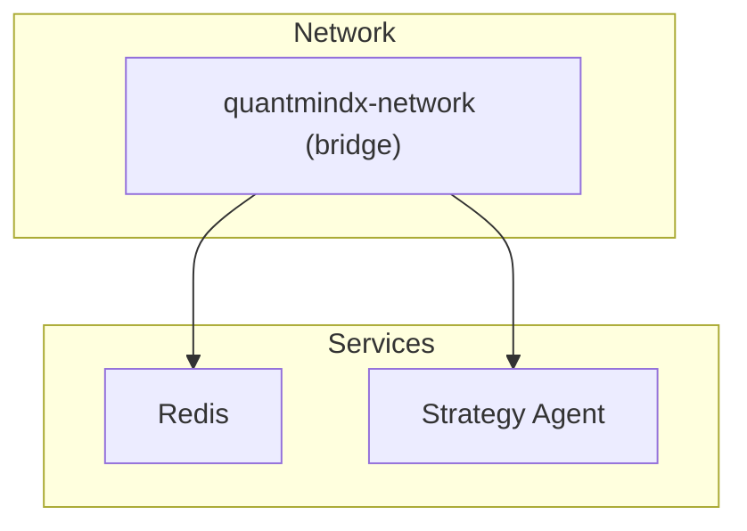
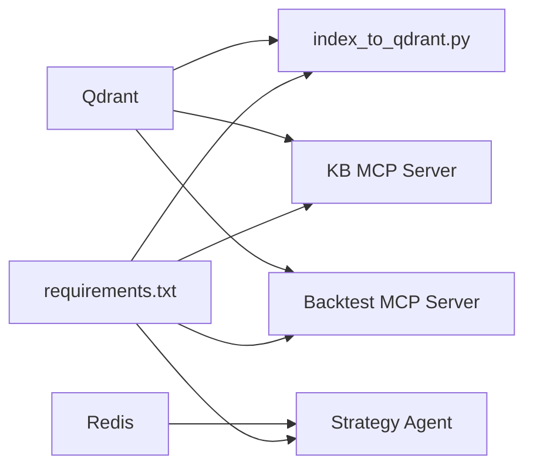
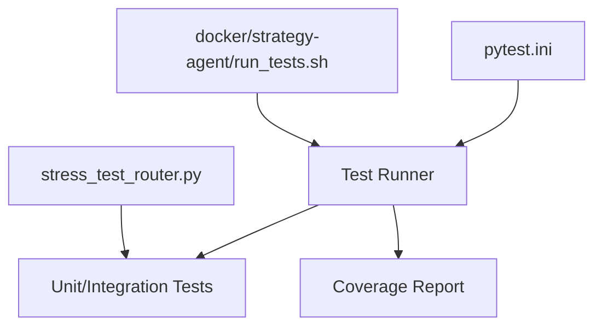

# Infrastructure and Deployment

<cite>
**Referenced Files in This Document**
- [docker-compose.yml](file://docker-compose.yml)
- [docker/strategy-agent/docker-compose.yml](file://docker/strategy-agent/docker-compose.yml)
- [docker/strategy-agent/Dockerfile](file://docker/strategy-agent/Dockerfile)
- [docker/strategy-agent/run_tests.sh](file://docker/strategy-agent/run_tests.sh)
- [scripts/kb-start.sh](file://scripts/kb-start.sh)
- [scripts/index_to_qdrant.py](file://scripts/index_to_qdrant.py)
- [mcp-servers/quantmindx-kb/server.py](file://mcp-servers/quantmindx-kb/server.py)
- [mcp-servers/backtest-mcp-server/main.py](file://mcp-servers/backtest-mcp-server/main.py)
- [config/brokers.yaml](file://config/brokers.yaml)
- [.env.example](file://.env.example)
- [server/.env.example](file://server/.env.example)
- [pytest.ini](file://pytest.ini)
- [stress_test_router.py](file://stress_test_router.py)
- [requirements.txt](file://requirements.txt)
</cite>

## Table of Contents
1. [Introduction](#introduction)
2. [Project Structure](#project-structure)
3. [Core Components](#core-components)
4. [Architecture Overview](#architecture-overview)
5. [Detailed Component Analysis](#detailed-component-analysis)
6. [Dependency Analysis](#dependency-analysis)
7. [Performance Considerations](#performance-considerations)
8. [Troubleshooting Guide](#troubleshooting-guide)
9. [Conclusion](#conclusion)
10. [Appendices](#appendices)

## Introduction
This document describes the Infrastructure and Deployment section for the QuantMindX platform. It covers the Dockerized microservices architecture, including the Qdrant vector database, the knowledge base indexer, and the MCP servers for knowledge base search and backtesting. It also documents configuration management (environment variables, broker settings, deployment configurations), monitoring and testing infrastructure (test suites, stress testing, performance benchmarking), deployment procedures, scaling considerations, maintenance protocols, production setup guidelines, infrastructure requirements, networking configuration, service orchestration, security considerations, backup procedures, and disaster recovery planning.

## Project Structure
The infrastructure relies on Docker Compose for orchestration and a set of scripts for indexing and MCP server management. Key elements:
- Root Docker Compose defines Qdrant and the knowledge base indexer.
- Strategy Agent Docker Compose defines Redis and the agent service with strict security hardening.
- Scripts handle knowledge base indexing and MCP server startup.
- MCP servers expose tools for semantic search and backtesting.
- Configuration files define broker connectivity and environment variables.

**Diagram sources**
- [docker-compose.yml](file://docker-compose.yml#L1-L27)
- [docker/strategy-agent/docker-compose.yml](file://docker/strategy-agent/docker-compose.yml#L1-L100)
- [mcp-servers/quantmindx-kb/server.py](file://mcp-servers/quantmindx-kb/server.py#L1-L189)
- [mcp-servers/backtest-mcp-server/main.py](file://mcp-servers/backtest-mcp-server/main.py#L1-L362)
- [scripts/index_to_qdrant.py](file://scripts/index_to_qdrant.py#L1-L182)

**Section sources**
- [docker-compose.yml](file://docker-compose.yml#L1-L27)
- [docker/strategy-agent/docker-compose.yml](file://docker/strategy-agent/docker-compose.yml#L1-L100)

## Core Components
- Qdrant vector database: Persistent vector storage for the knowledge base, exposed on standard ports and backed by a mounted volume.
- Knowledge Base Indexer: A one-shot Dockerized process that loads scraped articles, generates embeddings, and upserts vectors into Qdrant.
- MCP Knowledge Base Server: An MCP server providing semantic search over the indexed knowledge base and article retrieval.
- MCP Backtest Server: An MCP server exposing tools to submit and track backtests with configuration validation and queue management.
- Strategy Agent: A Dockerized agent with Redis for eventing and MT5 integration, hardened with read-only filesystem, resource limits, and security caps.
- Broker Configuration: Centralized YAML configuration supporting MT5 mock/socket and Binance Spot/Futures with environment variable substitution.
- Environment Variables: Examples for Qdrant, LLM providers, and crypto APIs.

**Section sources**
- [docker-compose.yml](file://docker-compose.yml#L4-L26)
- [scripts/index_to_qdrant.py](file://scripts/index_to_qdrant.py#L1-L182)
- [mcp-servers/quantmindx-kb/server.py](file://mcp-servers/quantmindx-kb/server.py#L1-L189)
- [mcp-servers/backtest-mcp-server/main.py](file://mcp-servers/backtest-mcp-server/main.py#L1-L362)
- [docker/strategy-agent/docker-compose.yml](file://docker/strategy-agent/docker-compose.yml#L1-L100)
- [config/brokers.yaml](file://config/brokers.yaml#L1-L116)
- [.env.example](file://.env.example#L1-L25)
- [server/.env.example](file://server/.env.example#L1-L15)

## Architecture Overview
The system is composed of:
- Vector database layer: Qdrant for embeddings and similarity search.
- Indexing pipeline: Scripted ingestion from scraped content into Qdrant.
- MCP services: Knowledge base search and backtesting orchestrators.
- Operational services: Redis-backed agent and broker-agnostic crypto adapters.
- Configuration and secrets: YAML with environment variable interpolation and example env files.

**Diagram sources**
- [docker-compose.yml](file://docker-compose.yml#L4-L26)
- [scripts/index_to_qdrant.py](file://scripts/index_to_qdrant.py#L1-L182)
- [mcp-servers/quantmindx-kb/server.py](file://mcp-servers/quantmindx-kb/server.py#L1-L189)
- [mcp-servers/backtest-mcp-server/main.py](file://mcp-servers/backtest-mcp-server/main.py#L1-L362)
- [docker/strategy-agent/docker-compose.yml](file://docker/strategy-agent/docker-compose.yml#L1-L100)

## Detailed Component Analysis

### Qdrant Vector Database
- Purpose: Store embeddings for semantic search over MQL5 knowledge base.
- Ports: 6333 (HTTP), 6334 (gRPC).
- Persistence: Volume mounted under /qdrant/storage.
- Restart policy: unless-stopped.

Operational notes:
- Ensure sufficient disk space for embeddings and logs.
- Monitor health via standard Qdrant endpoints.
- Back up the storage volume regularly.

**Section sources**
- [docker-compose.yml](file://docker-compose.yml#L4-L12)

### Knowledge Base Indexer
- Image: Built from scripts/index_kb.dockerfile.
- Inputs: Mounted data and scripts directories.
- Environment: QDRANT_URL pointing to the Qdrant service.
- Depends on: Qdrant service.
- Restart policy: no (one-shot).

Indexing pipeline:
- Loads markdown articles from data/scraped_articles.
- Extracts frontmatter and chunks content.
- Generates embeddings and upserts into a named collection.
- Includes a test query to validate search.

**Diagram sources**
- [docker-compose.yml](file://docker-compose.yml#L14-L26)
- [scripts/index_to_qdrant.py](file://scripts/index_to_qdrant.py#L69-L182)

**Section sources**
- [docker-compose.yml](file://docker-compose.yml#L14-L26)
- [scripts/index_to_qdrant.py](file://scripts/index_to_qdrant.py#L1-L182)

### MCP Knowledge Base Server
- Runs from the project root and validates directory context.
- Provides three tools:
  - search_knowledge_base: Semantic search with optional category filtering.
  - get_article_content: Retrieve full article content by file path.
  - kb_stats: Collection statistics.
- Uses local Qdrant path and a sentence-transformers model.

**Diagram sources**
- [mcp-servers/quantmindx-kb/server.py](file://mcp-servers/quantmindx-kb/server.py#L50-L174)

**Section sources**
- [mcp-servers/quantmindx-kb/server.py](file://mcp-servers/quantmindx-kb/server.py#L1-L189)

### MCP Backtest Server
- FastMCP-based server with two primary tools:
  - run_backtest: Submits strategy code (Python or MQ5) with validated configuration.
  - get_backtest_status: Tracks status and returns metrics upon completion.
- Queue management supports up to 10 workers with CPU-aware allocation.
- Rich configuration schema and error classification.

**Diagram sources**
- [mcp-servers/backtest-mcp-server/main.py](file://mcp-servers/backtest-mcp-server/main.py#L85-L256)

**Section sources**
- [mcp-servers/backtest-mcp-server/main.py](file://mcp-servers/backtest-mcp-server/main.py#L1-L362)

### Strategy Agent (Dockerized)
- Service: Redis-backed agent with MT5 integration.
- Security hardening:
  - Read-only root filesystem with tmpfs for temp directories.
  - Non-root user and dropped capabilities.
  - Healthchecks and resource limits.
- Networking: Dedicated bridge network with static subnet.
- Ports: 8080 exposed for monitoring/health checks.
- Volumes: Writable logs and data mounts; optional read-only MT5 terminal mount.

**Diagram sources**
- [docker/strategy-agent/docker-compose.yml](file://docker/strategy-agent/docker-compose.yml#L94-L100)

**Section sources**
- [docker/strategy-agent/docker-compose.yml](file://docker/strategy-agent/docker-compose.yml#L1-L100)
- [docker/strategy-agent/Dockerfile](file://docker/strategy-agent/Dockerfile#L1-L83)

### Broker Configuration Management
- YAML-based configuration with environment variable substitution.
- Supports:
  - MT5 mock for development.
  - MT5 socket bridge for VPS-hosted terminals.
  - Binance Spot and Futures (including testnet).
- Flags:
  - enabled: controls automatic registration on startup.
  - timeout and max_retries: socket bridge tuning.
- Migration path: development → testnet → production.

**Section sources**
- [config/brokers.yaml](file://config/brokers.yaml#L1-L116)

### Environment Variables and Secrets
- Root environment example includes:
  - Firecrawl API key.
  - Qdrant host/port.
  - LLM API keys (OpenAI/Anthropic placeholders).
  - Binance API keys and testnet credentials.
  - Binance Futures toggle.
- Server environment example includes:
  - Gemini/Qwen API keys.
  - Server port.

Best practices:
- Store secrets outside the repository; use .env files or secret managers.
- Validate environment variables during startup in services that require them.

**Section sources**
- [.env.example](file://.env.example#L1-L25)
- [server/.env.example](file://server/.env.example#L1-L15)

## Dependency Analysis
Key dependencies and relationships:
- Indexer depends on Qdrant client and sentence-transformers.
- MCP KB server depends on Qdrant client and sentence-transformers.
- MCP backtest server depends on FastMCP and internal models/queue manager.
- Strategy Agent depends on Redis and optionally MT5 terminal.
- Broker configuration integrates with crypto adapters and socket bridges.

**Diagram sources**
- [requirements.txt](file://requirements.txt#L1-L55)
- [scripts/index_to_qdrant.py](file://scripts/index_to_qdrant.py#L1-L182)
- [mcp-servers/quantmindx-kb/server.py](file://mcp-servers/quantmindx-kb/server.py#L1-L189)
- [mcp-servers/backtest-mcp-server/main.py](file://mcp-servers/backtest-mcp-server/main.py#L1-L362)
- [docker/strategy-agent/docker-compose.yml](file://docker/strategy-agent/docker-compose.yml#L1-L100)

**Section sources**
- [requirements.txt](file://requirements.txt#L1-L55)

## Performance Considerations
- Vector indexing:
  - Batch upserts reduce overhead; tune batch size for throughput vs. latency.
  - Embedding model selection impacts latency and accuracy.
- Qdrant:
  - Use appropriate vector size and distance metric.
  - Monitor disk usage and optimize collection settings.
- MCP servers:
  - Backtest server enforces concurrency limits; scale horizontally by adding instances.
  - Use result caching for identical configurations.
- Strategy Agent:
  - Resource limits prevent resource exhaustion; adjust CPU/memory based on workload.
  - Health checks ensure liveness; configure restart policies appropriately.

[No sources needed since this section provides general guidance]

## Troubleshooting Guide
Common issues and resolutions:
- Qdrant not reachable:
  - Verify service health and port exposure.
  - Confirm volume persistence and permissions.
- Indexer failures:
  - Ensure scraped articles exist and are readable.
  - Check embedding model availability and network access.
- MCP server errors:
  - Validate configuration schema and inputs.
  - Inspect queue manager status and logs.
- Redis connectivity:
  - Confirm healthcheck passes and network isolation is correct.
- Broker configuration:
  - Verify environment variables are set and interpolation works.
  - Check enabled flags and timeouts for socket bridge.

**Section sources**
- [docker-compose.yml](file://docker-compose.yml#L4-L26)
- [scripts/index_to_qdrant.py](file://scripts/index_to_qdrant.py#L1-L182)
- [mcp-servers/quantmindx-kb/server.py](file://mcp-servers/quantmindx-kb/server.py#L1-L189)
- [mcp-servers/backtest-mcp-server/main.py](file://mcp-servers/backtest-mcp-server/main.py#L1-L362)
- [docker/strategy-agent/docker-compose.yml](file://docker/strategy-agent/docker-compose.yml#L1-L100)
- [config/brokers.yaml](file://config/brokers.yaml#L1-L116)

## Conclusion
The QuantMindX infrastructure leverages Docker Compose for modular orchestration, Qdrant for semantic search, and MCP servers for extensible tooling. Configuration is centralized via YAML and environment variables, with strong emphasis on security hardening for operational services. The testing and stress frameworks provide confidence in correctness and resilience. Scaling and production readiness depend on proper resource allocation, persistent storage, and robust monitoring.

[No sources needed since this section summarizes without analyzing specific files]

## Appendices

### Deployment Procedures
- Local development:
  - Start Qdrant and KB indexer via root compose.
  - Run MCP KB server from project root.
  - Optionally start Redis and Strategy Agent for agent workflows.
- Production:
  - Use environment variables for secrets and broker credentials.
  - Scale MCP servers horizontally behind a reverse proxy.
  - Persist Qdrant storage and Redis data with volumes.
  - Enforce network segmentation and firewall rules.

**Section sources**
- [docker-compose.yml](file://docker-compose.yml#L1-L27)
- [docker/strategy-agent/docker-compose.yml](file://docker/strategy-agent/docker-compose.yml#L1-L100)
- [config/brokers.yaml](file://config/brokers.yaml#L1-L116)

### Scaling Considerations
- Qdrant:
  - Horizontal sharding and replicas for high availability.
  - Monitor CPU, memory, and disk I/O.
- MCP Servers:
  - Stateless design allows easy horizontal scaling.
  - Use load balancers and keep-alive health checks.
- Strategy Agent:
  - Adjust CPU and memory limits based on workload.
  - Use autoscaling groups with health-based metrics.

**Section sources**
- [docker/strategy-agent/docker-compose.yml](file://docker/strategy-agent/docker-compose.yml#L62-L74)

### Maintenance Protocols
- Regular backups:
  - Snapshot Qdrant storage and Redis data.
  - Archive MCP server logs and indices.
- Rotation and cleanup:
  - Prune old Docker images and unused volumes.
  - Rotate log files and enforce retention policies.
- Updates:
  - Pin dependency versions in requirements.txt.
  - Test updates in staging before production rollout.

**Section sources**
- [docker-compose.yml](file://docker-compose.yml#L10-L11)
- [docker/strategy-agent/docker-compose.yml](file://docker/strategy-agent/docker-compose.yml#L15-L16)

### Production Setup Guidelines
- Networking:
  - Use dedicated bridge networks for services.
  - Restrict inbound ports to necessary services only.
- Security:
  - Apply container hardening (non-root, read-only FS, capability drops).
  - Use secrets management for API keys and tokens.
- Observability:
  - Enable health checks and metrics collection.
  - Centralize logs and set up alerts for critical events.

**Section sources**
- [docker/strategy-agent/docker-compose.yml](file://docker/strategy-agent/docker-compose.yml#L22-L79)

### Infrastructure Requirements
- Compute:
  - Qdrant: SSD-backed storage; adequate CPU for embedding generation and search.
  - MCP servers: CPU-bound; provision cores proportional to concurrency targets.
  - Strategy Agent: Light to moderate; ensure headroom for MT5 operations.
- Memory:
  - Qdrant: Scale with vector count and dimensionality.
  - MCP servers: Heap sizing for embedding models and caches.
- Storage:
  - Qdrant: Persistent volume for /qdrant/storage.
  - Redis: AOF-enabled volume for durability.
- Network:
  - Internal bridge network for service communication.
  - Public ingress for MCP server exposure if applicable.

**Section sources**
- [docker-compose.yml](file://docker-compose.yml#L10-L11)
- [docker/strategy-agent/docker-compose.yml](file://docker/strategy-agent/docker-compose.yml#L94-L100)

### Service Orchestration
- Compose files define service lifecycles and dependencies.
- Health checks ensure readiness and automatic restarts.
- Resource limits prevent noisy neighbor problems.

**Section sources**
- [docker-compose.yml](file://docker-compose.yml#L24-L26)
- [docker/strategy-agent/docker-compose.yml](file://docker/strategy-agent/docker-compose.yml#L17-L88)

### Security Considerations
- Container hardening:
  - Read-only root filesystem, tmpfs for temporary directories.
  - Drop unnecessary capabilities; restrict privileges.
- Secrets management:
  - Use environment variables or secret managers.
  - Avoid committing secrets to repositories.
- Network isolation:
  - Dedicated bridge networks and subnet configuration.
  - Limit exposed ports and use TLS termination at ingress.

**Section sources**
- [docker/strategy-agent/docker-compose.yml](file://docker/strategy-agent/docker-compose.yml#L54-L79)
- [docker/strategy-agent/Dockerfile](file://docker/strategy-agent/Dockerfile#L61-L78)

### Backup Procedures
- Qdrant:
  - Periodically snapshot /qdrant/storage.
  - Validate backups and test restore procedures.
- Redis:
  - Enable AOF persistence and snapshot periodically.
- MCP server logs and indices:
  - Archive logs and maintain offsite copies.

**Section sources**
- [docker-compose.yml](file://docker-compose.yml#L10-L11)
- [docker/strategy-agent/docker-compose.yml](file://docker/strategy-agent/docker-compose.yml#L15-L16)

### Disaster Recovery Planning
- Replication:
  - Configure Qdrant replicas and cross-region backups.
  - Maintain warm standby for MCP servers.
- Failover:
  - Automate failover for Redis using sentinel or managed services.
- Recovery time/objective:
  - Define RTO/RPO targets and rehearse restoration drills.

**Section sources**
- [docker-compose.yml](file://docker-compose.yml#L12)
- [docker/strategy-agent/docker-compose.yml](file://docker/strategy-agent/docker-compose.yml#L11-L16)

### Monitoring and Testing Infrastructure
- Test suite:
  - Pytest configuration with markers for slow, integration, load, property, and asyncio tests.
  - Coverage configuration excludes tests and compiled artifacts.
- Stress testing:
  - Router stress test simulates market scenarios and evaluates adaptive behavior.
- MCP server testing:
  - Use run_tests.sh to validate Docker security posture and container health.

**Diagram sources**
- [pytest.ini](file://pytest.ini#L1-L53)
- [stress_test_router.py](file://stress_test_router.py#L1-L59)
- [docker/strategy-agent/run_tests.sh](file://docker/strategy-agent/run_tests.sh#L1-L94)

**Section sources**
- [pytest.ini](file://pytest.ini#L1-L53)
- [stress_test_router.py](file://stress_test_router.py#L1-L59)
- [docker/strategy-agent/run_tests.sh](file://docker/strategy-agent/run_tests.sh#L1-L94)