# Monitoring and Testing Infrastructure

<cite>
**Referenced Files in This Document**
- [pytest.ini](file://pytest.ini)
- [conftest.py](file://conftest.py)
- [tests/conftest.py](file://tests/conftest.py)
- [requirements.txt](file://requirements.txt)
- [stress_test_router.py](file://stress_test_router.py)
- [docker/strategy-agent/run_tests.sh](file://docker/strategy-agent/run_tests.sh)
- [docker/strategy-agent/Dockerfile](file://docker/strategy-agent/Dockerfile)
- [docker/strategy-agent/docker-compose.yml](file://docker/strategy-agent/docker-compose.yml)
- [scripts/TEST_INSTRUCTIONS.md](file://scripts/TEST_INSTRUCTIONS.md)
</cite>

## Table of Contents
1. [Introduction](#introduction)
2. [Project Structure](#project-structure)
3. [Core Components](#core-components)
4. [Architecture Overview](#architecture-overview)
5. [Detailed Component Analysis](#detailed-component-analysis)
6. [Dependency Analysis](#dependency-analysis)
7. [Performance Considerations](#performance-considerations)
8. [Troubleshooting Guide](#troubleshooting-guide)
9. [Conclusion](#conclusion)
10. [Appendices](#appendices)

## Introduction
This document describes the complete Monitoring and Testing Infrastructure for the project. It covers the testing framework (unit, integration, end-to-end, load, and property-based tests), pytest configuration and fixtures, stress testing for high-frequency trading scenarios, performance benchmarking and load testing methodologies, test coverage analysis, continuous integration and automated pipelines, monitoring and observability practices, logging configuration, error tracking, test data management, mock services, test environment isolation, debugging techniques, performance profiling, and production monitoring strategies.

## Project Structure
The testing infrastructure is organized around pytest with a layered structure:
- Root-level pytest configuration and global fixtures
- Suite-specific fixtures and test groups under tests/
- Dedicated stress testing utilities for router behavior
- Containerized testing environments for security and integration
- Operational scripts for manual verification and remediation

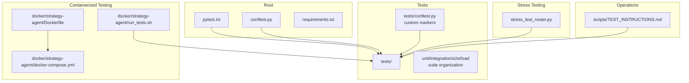

**Diagram sources**
- [pytest.ini](file://pytest.ini#L1-L53)
- [conftest.py](file://conftest.py#L1-L75)
- [requirements.txt](file://requirements.txt#L1-L55)
- [tests/conftest.py](file://tests/conftest.py#L1-L8)
- [stress_test_router.py](file://stress_test_router.py#L1-L59)
- [docker/strategy-agent/Dockerfile](file://docker/strategy-agent/Dockerfile#L1-L83)
- [docker/strategy-agent/docker-compose.yml](file://docker/strategy-agent/docker-compose.yml#L1-L100)
- [docker/strategy-agent/run_tests.sh](file://docker/strategy-agent/run_tests.sh#L1-L94)
- [scripts/TEST_INSTRUCTIONS.md](file://scripts/TEST_INSTRUCTIONS.md#L1-L91)

**Section sources**
- [pytest.ini](file://pytest.ini#L1-L53)
- [conftest.py](file://conftest.py#L1-L75)
- [tests/conftest.py](file://tests/conftest.py#L1-L8)
- [requirements.txt](file://requirements.txt#L1-L55)
- [stress_test_router.py](file://stress_test_router.py#L1-L59)
- [docker/strategy-agent/Dockerfile](file://docker/strategy-agent/Dockerfile#L1-L83)
- [docker/strategy-agent/docker-compose.yml](file://docker/strategy-agent/docker-compose.yml#L1-L100)
- [docker/strategy-agent/run_tests.sh](file://docker/strategy-agent/run_tests.sh#L1-L94)
- [scripts/TEST_INSTRUCTIONS.md](file://scripts/TEST_INSTRUCTIONS.md#L1-L91)

## Core Components
- Pytest configuration and markers define test categories and output behavior.
- Global fixtures manage asyncio loops, task cleanup, and warning suppression.
- Suite-specific fixtures add domain markers and environment controls.
- Stress testing utilities simulate high-frequency trading scenarios.
- Containerized environments enforce security hardening and resource limits for reproducible testing.
- Operational scripts provide manual verification steps and remediation guidance.

Key capabilities:
- Unit and property-based tests with hypothesis-driven validation
- Integration tests across routers, brokers, and crypto connectors
- End-to-end workflows validating full pipelines
- Load tests for concurrent connections and stability
- Benchmarks for latency and throughput comparisons
- Coverage reporting configured via pytest-cov and coverage tool
- Logging and health checks integrated with Docker compose

**Section sources**
- [pytest.ini](file://pytest.ini#L1-L53)
- [conftest.py](file://conftest.py#L1-L75)
- [tests/conftest.py](file://tests/conftest.py#L1-L8)
- [stress_test_router.py](file://stress_test_router.py#L1-L59)
- [docker/strategy-agent/Dockerfile](file://docker/strategy-agent/Dockerfile#L1-L83)
- [docker/strategy-agent/docker-compose.yml](file://docker/strategy-agent/docker-compose.yml#L1-L100)
- [docker/strategy-agent/run_tests.sh](file://docker/strategy-agent/run_tests.sh#L1-L94)
- [requirements.txt](file://requirements.txt#L44-L54)

## Architecture Overview
The testing architecture integrates pytest orchestration, suite-specific fixtures, and containerized environments. Async test flows are supported with automatic timeout markers. Coverage is collected centrally, and Docker-based environments isolate and harden test execution.

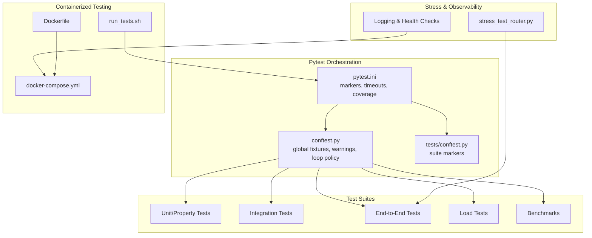

**Diagram sources**
- [pytest.ini](file://pytest.ini#L1-L53)
- [conftest.py](file://conftest.py#L1-L75)
- [tests/conftest.py](file://tests/conftest.py#L1-L8)
- [stress_test_router.py](file://stress_test_router.py#L1-L59)
- [docker/strategy-agent/Dockerfile](file://docker/strategy-agent/Dockerfile#L1-L83)
- [docker/strategy-agent/docker-compose.yml](file://docker/strategy-agent/docker-compose.yml#L1-L100)
- [docker/strategy-agent/run_tests.sh](file://docker/strategy-agent/run_tests.sh#L1-L94)

## Detailed Component Analysis

### Pytest Configuration and Fixtures
- Markers: slow, integration, load, property, asyncio are defined centrally and enforced via strict markers.
- Asyncio mode is set to auto; event loop policy and session-scoped loop are standardized.
- Cleanup tasks cancel pending asyncio tasks after each test to prevent leaks.
- Coverage configuration targets src and omits tests, cache, and bytecode directories.
- Warning filters suppress noisy deprecation and resource warnings during property-based testing.

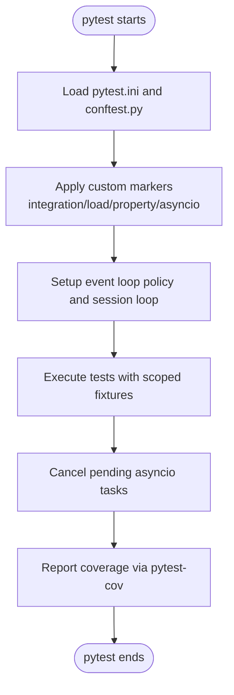

**Diagram sources**
- [pytest.ini](file://pytest.ini#L1-L53)
- [conftest.py](file://conftest.py#L31-L75)

**Section sources**
- [pytest.ini](file://pytest.ini#L1-L53)
- [conftest.py](file://conftest.py#L1-L75)

### Suite-Specific Markers and Organization
- Domain markers (router, slow, benchmark) are registered to avoid unknown mark warnings.
- Automatic slow marker assignment for load and e2e tests ensures long-running tests are properly categorized.

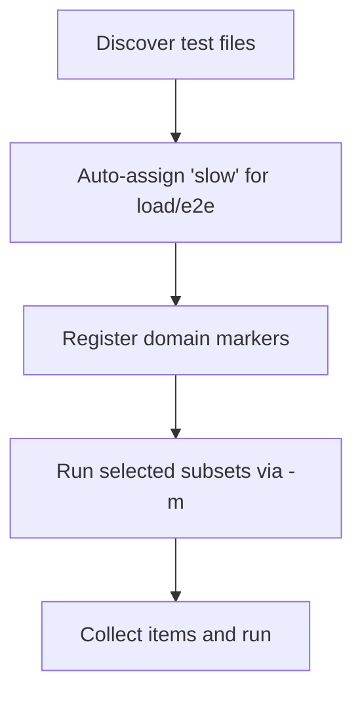

**Diagram sources**
- [tests/conftest.py](file://tests/conftest.py#L1-L8)
- [conftest.py](file://conftest.py#L67-L75)

**Section sources**
- [tests/conftest.py](file://tests/conftest.py#L1-L8)
- [conftest.py](file://conftest.py#L67-L75)

### Stress Testing for High-Frequency Trading Scenarios
- Simulates steady trends, flash crashes with chaos, and high-frequency noise.
- Uses a minimal TestBot to generate constant signals and evaluates router quality and allocation scalar.
- Demonstrates regime detection and adaptive response under volatile conditions.

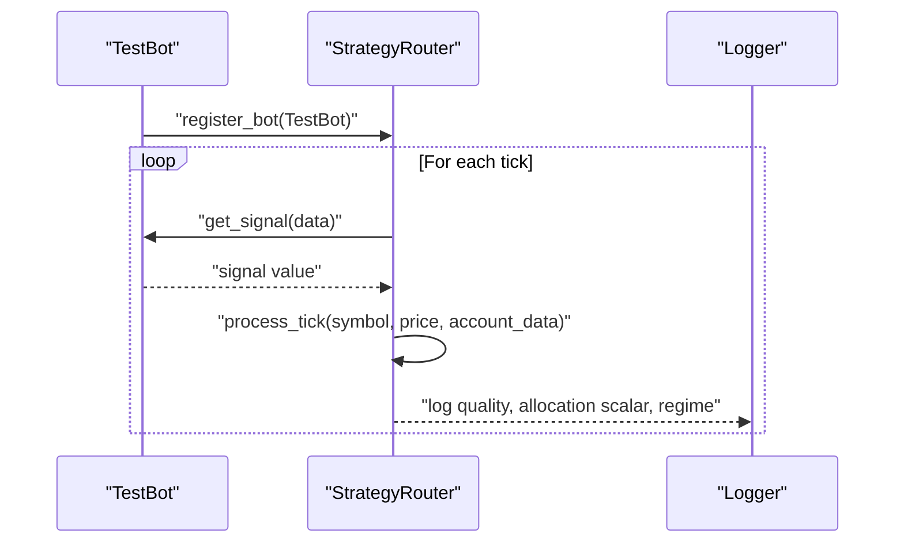

**Diagram sources**
- [stress_test_router.py](file://stress_test_router.py#L14-L38)

**Section sources**
- [stress_test_router.py](file://stress_test_router.py#L1-L59)

### Load Testing Methodologies
- Multi-broker concurrent load tests evaluate throughput and stability under contention.
- Socket load tests measure sustained connection handling.
- WebSocket stream stability tests validate long-running streams.

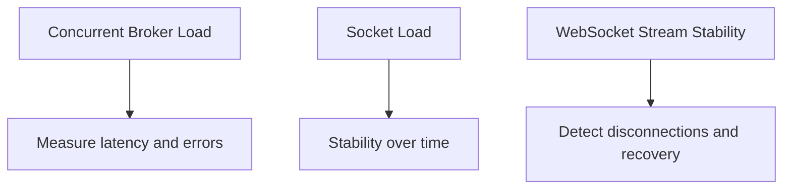

**Diagram sources**
- [tests/load/test_multi_broker_concurrent.py](file://tests/load/test_multi_broker_concurrent.py)
- [tests/load/test_socket_load.py](file://tests/load/test_socket_load.py)
- [tests/load/test_websocket_stream_stability.py](file://tests/load/test_websocket_stream_stability.py)

**Section sources**
- [tests/load/test_multi_broker_concurrent.py](file://tests/load/test_multi_broker_concurrent.py)
- [tests/load/test_socket_load.py](file://tests/load/test_socket_load.py)
- [tests/load/test_websocket_stream_stability.py](file://tests/load/test_websocket_stream_stability.py)

### Performance Benchmarking Procedures
- Broker registry benchmark measures registration and lookup performance.
- Order book cache benchmark evaluates caching hit rates and latency.
- Risk tier calculation benchmark validates computational cost scaling.
- Socket vs REST latency benchmark compares transport overhead.

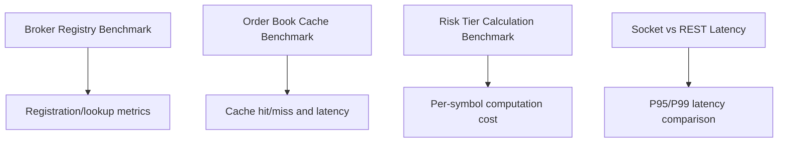

**Diagram sources**
- [tests/benchmarks/test_broker_registry_benchmark.py](file://tests/benchmarks/test_broker_registry_benchmark.py)
- [tests/benchmarks/test_order_book_cache_benchmark.py](file://tests/benchmarks/test_order_book_cache_benchmark.py)
- [tests/benchmarks/test_risk_tier_calculation_benchmark.py](file://tests/benchmarks/test_risk_tier_calculation_benchmark.py)
- [tests/benchmarks/test_socket_vs_rest_latency.py](file://tests/benchmarks/test_socket_vs_rest_latency.py)

**Section sources**
- [tests/benchmarks/test_broker_registry_benchmark.py](file://tests/benchmarks/test_broker_registry_benchmark.py)
- [tests/benchmarks/test_order_book_cache_benchmark.py](file://tests/benchmarks/test_order_book_cache_benchmark.py)
- [tests/benchmarks/test_risk_tier_calculation_benchmark.py](file://tests/benchmarks/test_risk_tier_calculation_benchmark.py)
- [tests/benchmarks/test_socket_vs_rest_latency.py](file://tests/benchmarks/test_socket_vs_rest_latency.py)

### Property-Based Testing and Validation
- Hypothesis-driven property tests validate invariants across randomized inputs.
- Property tests are marked accordingly and excluded from default runs via markers.

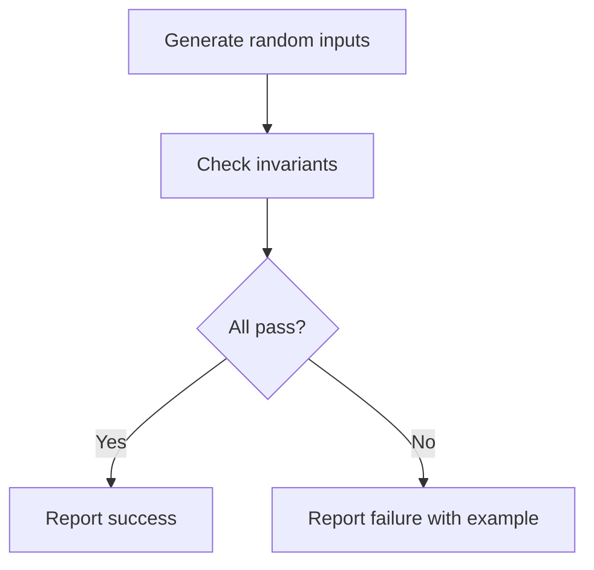

**Diagram sources**
- [pytest.ini](file://pytest.ini#L17-L24)
- [conftest.py](file://conftest.py#L11-L25)

**Section sources**
- [pytest.ini](file://pytest.ini#L17-L24)
- [conftest.py](file://conftest.py#L11-L25)

### Test Coverage Analysis
- Coverage source is configured to target src and exclude tests, caches, and compiled artifacts.
- Coverage report excludes lines commonly exempted in production codebases.

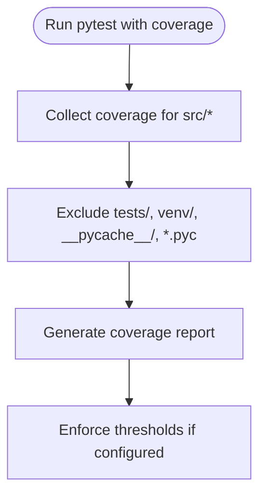

**Diagram sources**
- [pytest.ini](file://pytest.ini#L36-L53)

**Section sources**
- [pytest.ini](file://pytest.ini#L36-L53)

### Continuous Integration and Automated Pipelines
- Containerized test runner script validates Docker and pytest availability, sets up a minimal mock agent, and executes tests with verbose output.
- Dockerfile enforces non-root user, read-only filesystem, capability drops, and health checks.
- docker-compose.yml defines security hardening, resource limits, network isolation, and volume mounts for logs/data.

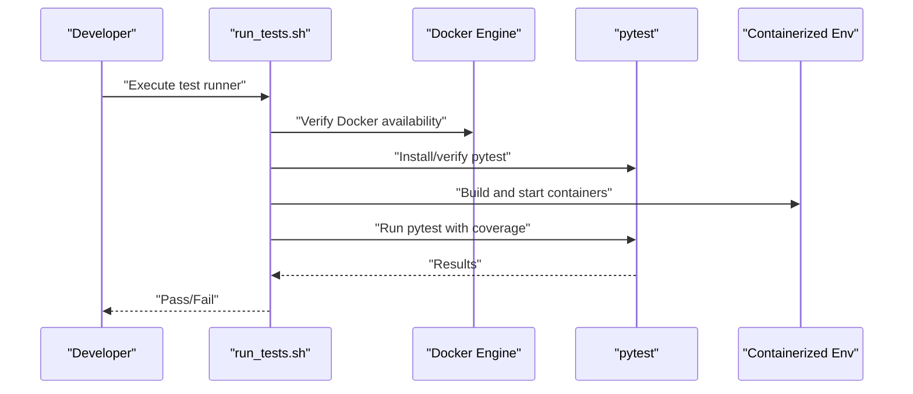

**Diagram sources**
- [docker/strategy-agent/run_tests.sh](file://docker/strategy-agent/run_tests.sh#L1-L94)
- [docker/strategy-agent/Dockerfile](file://docker/strategy-agent/Dockerfile#L1-L83)
- [docker/strategy-agent/docker-compose.yml](file://docker/strategy-agent/docker-compose.yml#L1-L100)

**Section sources**
- [docker/strategy-agent/run_tests.sh](file://docker/strategy-agent/run_tests.sh#L1-L94)
- [docker/strategy-agent/Dockerfile](file://docker/strategy-agent/Dockerfile#L1-L83)
- [docker/strategy-agent/docker-compose.yml](file://docker/strategy-agent/docker-compose.yml#L1-L100)

### Monitoring and Observability Practices
- Logging is configured at INFO level with structured formatting in stress tests.
- Health checks are defined in Docker Compose to monitor service readiness.
- Resource limits (CPU/memory) and PID caps prevent resource exhaustion.
- Read-only root filesystem and capability drops harden the container environment.

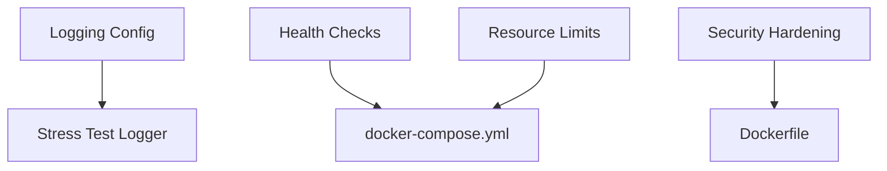

**Diagram sources**
- [stress_test_router.py](file://stress_test_router.py#L11-L12)
- [docker/strategy-agent/docker-compose.yml](file://docker/strategy-agent/docker-compose.yml#L62-L87)
- [docker/strategy-agent/Dockerfile](file://docker/strategy-agent/Dockerfile#L62-L78)

**Section sources**
- [stress_test_router.py](file://stress_test_router.py#L11-L12)
- [docker/strategy-agent/docker-compose.yml](file://docker/strategy-agent/docker-compose.yml#L62-L87)
- [docker/strategy-agent/Dockerfile](file://docker/strategy-agent/Dockerfile#L62-L78)

### Error Tracking and Debugging Techniques
- pytest-timeout is included to prevent hanging tests; slow tests can override defaults.
- pytest-asyncio handles async flows; event loop policy and cleanup fixtures mitigate leaks.
- Warning filters reduce noise from external libraries during property-based testing.
- Manual verification steps guide HTTP status checks and output validation for scraping scripts.

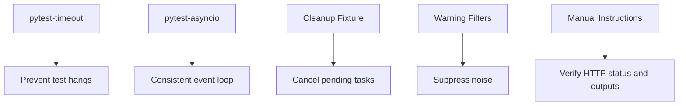

**Diagram sources**
- [pytest.ini](file://pytest.ini#L12-L14)
- [conftest.py](file://conftest.py#L31-L75)
- [requirements.txt](file://requirements.txt#L47-L48)
- [scripts/TEST_INSTRUCTIONS.md](file://scripts/TEST_INSTRUCTIONS.md#L1-L91)

**Section sources**
- [pytest.ini](file://pytest.ini#L12-L14)
- [conftest.py](file://conftest.py#L31-L75)
- [requirements.txt](file://requirements.txt#L47-L48)
- [scripts/TEST_INSTRUCTIONS.md](file://scripts/TEST_INSTRUCTIONS.md#L1-L91)

### Test Data Management and Mock Services
- Minimal mock agent modules are generated dynamically by the test runner to validate containerized environments.
- Volume mounts in docker-compose expose logs and data directories for inspection and persistence.
- Redis service provides pub/sub and caching for integration testing.

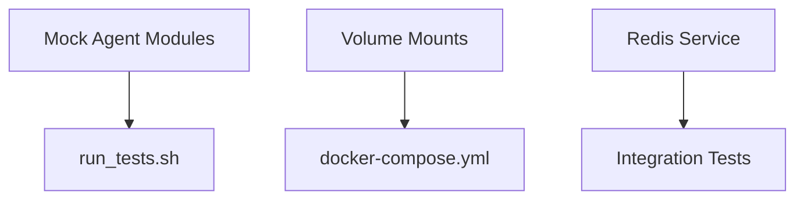

**Diagram sources**
- [docker/strategy-agent/run_tests.sh](file://docker/strategy-agent/run_tests.sh#L53-L77)
- [docker/strategy-agent/docker-compose.yml](file://docker/strategy-agent/docker-compose.yml#L48-L53)
- [docker/strategy-agent/docker-compose.yml](file://docker/strategy-agent/docker-compose.yml#L8-L27)

**Section sources**
- [docker/strategy-agent/run_tests.sh](file://docker/strategy-agent/run_tests.sh#L53-L77)
- [docker/strategy-agent/docker-compose.yml](file://docker/strategy-agent/docker-compose.yml#L48-L53)
- [docker/strategy-agent/docker-compose.yml](file://docker/strategy-agent/docker-compose.yml#L8-L27)

### Test Environment Isolation
- Non-root user and capability drops minimize attack surface.
- Read-only root filesystem with tmpfs for temporary data.
- Network isolation via dedicated bridge network.
- Resource reservations and limits prevent noisy-neighbor effects.

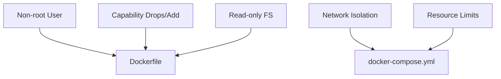

**Diagram sources**
- [docker/strategy-agent/Dockerfile](file://docker/strategy-agent/Dockerfile#L29-L78)
- [docker/strategy-agent/docker-compose.yml](file://docker/strategy-agent/docker-compose.yml#L54-L87)

**Section sources**
- [docker/strategy-agent/Dockerfile](file://docker/strategy-agent/Dockerfile#L29-L78)
- [docker/strategy-agent/docker-compose.yml](file://docker/strategy-agent/docker-compose.yml#L54-L87)

## Dependency Analysis
Testing dependencies are declared in requirements.txt, including pytest, pytest-asyncio, pytest-timeout, pytest-cov, and hypothesis. These enable asynchronous test execution, timeout enforcement, coverage reporting, and property-based testing.

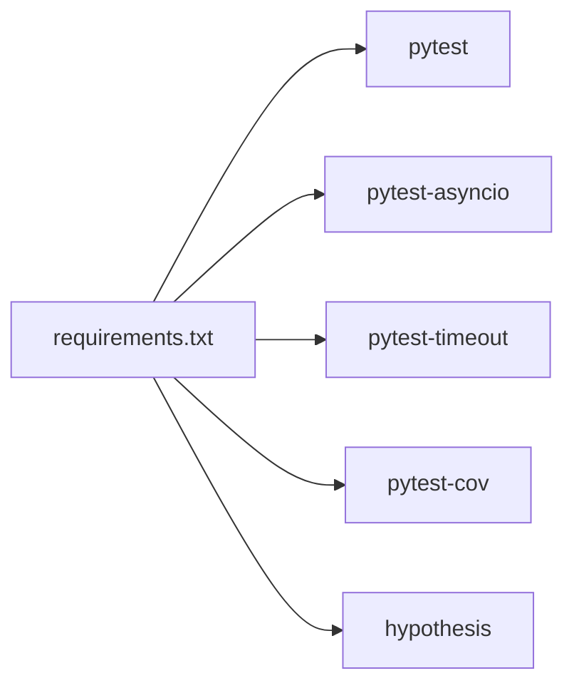

**Diagram sources**
- [requirements.txt](file://requirements.txt#L44-L49)

**Section sources**
- [requirements.txt](file://requirements.txt#L44-L49)

## Performance Considerations
- Prefer property-based tests for broad input coverage with fewer test cases.
- Use load tests to identify saturation points and regressions under concurrency.
- Leverage benchmarks to track latency-sensitive paths and ensure no performance drift.
- Apply resource limits in containerized environments to prevent resource starvation.

## Troubleshooting Guide
- If tests hang, confirm pytest-timeout is active and adjust slow test timeouts as needed.
- If asyncio tasks leak, ensure cleanup fixtures are applied and event loop policy is consistent.
- If coverage is missing, verify pytest-cov configuration and source paths.
- For scraping failures, follow manual verification steps to check HTTP status and output quality.

**Section sources**
- [pytest.ini](file://pytest.ini#L12-L14)
- [conftest.py](file://conftest.py#L31-L75)
- [pytest.ini](file://pytest.ini#L36-L53)
- [scripts/TEST_INSTRUCTIONS.md](file://scripts/TEST_INSTRUCTIONS.md#L1-L91)

## Conclusion
The testing infrastructure combines robust pytest configuration, suite-specific markers, comprehensive test categories (unit, integration, e2e, load, benchmarks), and property-based validation. Containerized environments enforce security and isolation, while logging, health checks, and resource limits support observability. Coverage reporting and CI-friendly scripts streamline automated pipelines. Together, these practices provide a solid foundation for reliable, high-performance trading systems.

## Appendices
- Additional operational guidance for manual verification and remediation is documented in the test instructions.

**Section sources**
- [scripts/TEST_INSTRUCTIONS.md](file://scripts/TEST_INSTRUCTIONS.md#L1-L91)