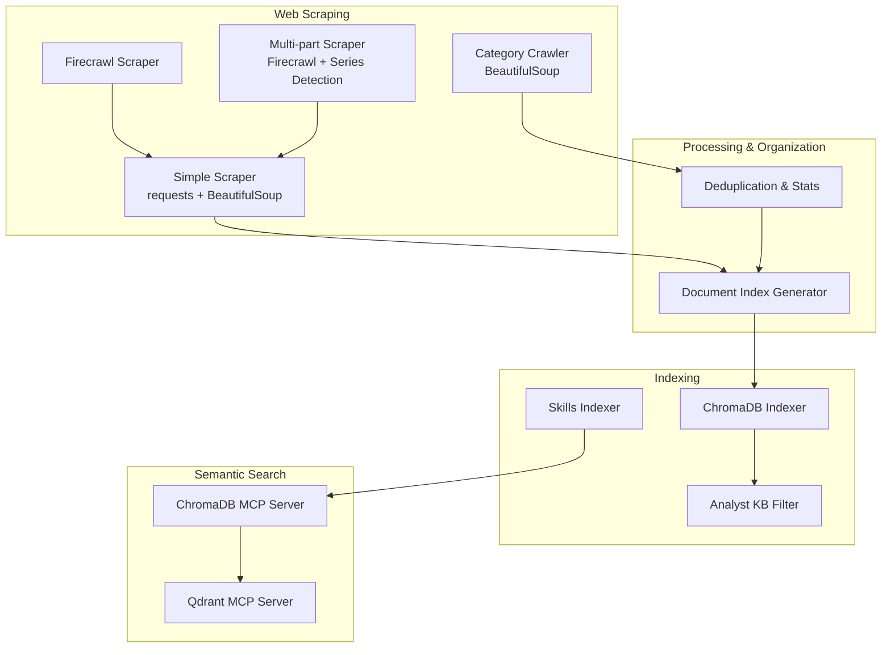
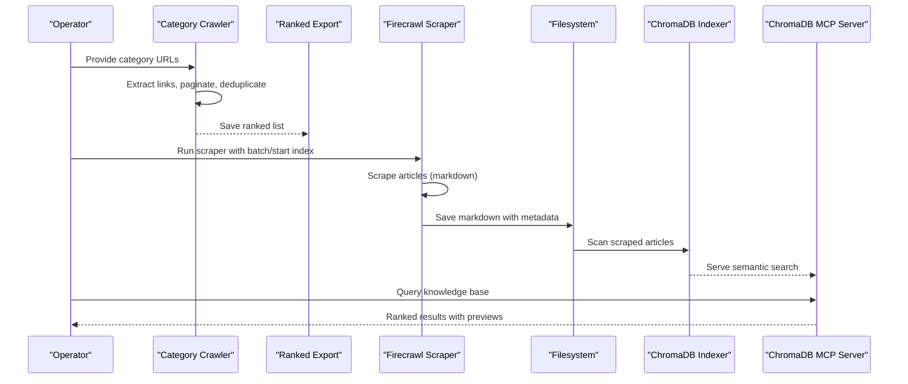
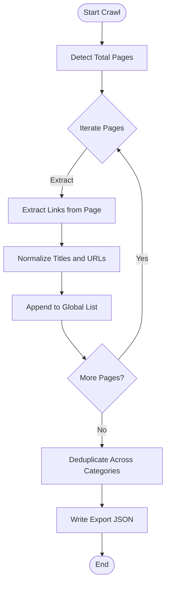
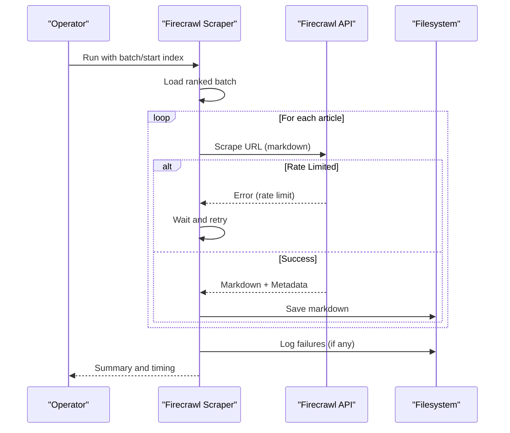
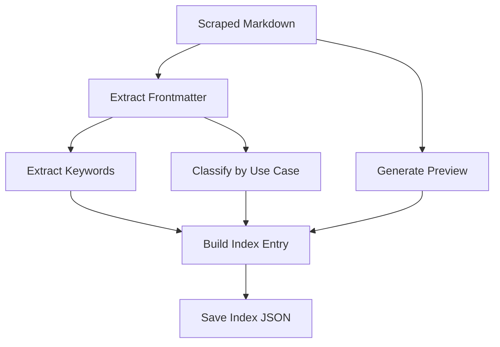
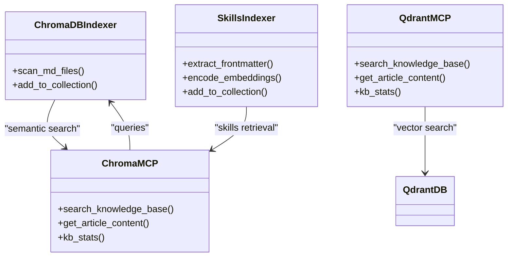
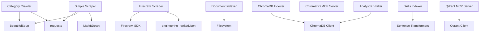

# Article Processing Pipeline

<cite>
**Referenced Files in This Document**
- [category_crawler.py](file://scripts/category_crawler.py)
- [crawl_all_categories.py](file://scripts/crawl_all_categories.py)
- [CATEGORY_CRAWLER_USAGE.md](file://scripts/CATEGORY_CRAWLER_USAGE.md)
- [firecrawl_scraper.py](file://scripts/firecrawl_scraper.py)
- [FIRECRAWL_USAGE.md](file://scripts/FIRECRAWL_USAGE.md)
- [simple_scraper.py](file://scripts/simple_scraper.py)
- [scraper.py](file://scripts/scraper.py)
- [SCRAPER_USAGE.md](file://scripts/SCRAPER_USAGE.md)
- [generate_document_index.py](file://scripts/generate_document_index.py)
- [index_chroma.py](file://scripts/index_chroma.py)
- [index_skills_to_chroma.py](file://scripts/index_skills_to_chroma.py)
- [search_kb.py](file://scripts/search_kb.py)
- [filter_analyst_kb.py](file://scripts/filter_analyst_kb.py)
- [server_chroma.py](file://mcp-servers/quantmindx-kb/server_chroma.py)
- [server.py](file://mcp-servers/quantmindx-kb/server.py)
- [engineering_ranked.json](file://data/exports/engineering_ranked.json)
</cite>

## Table of Contents
1. [Introduction](#introduction)
2. [Project Structure](#project-structure)
3. [Core Components](#core-components)
4. [Architecture Overview](#architecture-overview)
5. [Detailed Component Analysis](#detailed-component-analysis)
6. [Dependency Analysis](#dependency-analysis)
7. [Performance Considerations](#performance-considerations)
8. [Troubleshooting Guide](#troubleshooting-guide)
9. [Conclusion](#conclusion)
10. [Appendices](#appendices)

## Introduction
This document describes the Article Processing Pipeline responsible for discovering, extracting, transforming, organizing, and indexing MQL5 articles into a structured knowledge base. It covers:
- Web scraping infrastructure using BeautifulSoup-based crawlers and Firecrawl integration
- Category-based crawling strategies and batch processing
- Content processing workflow from raw HTML extraction to organized markdown
- Filtering mechanisms for analyst knowledge base content, relevance scoring, and categorization
- Batch processing architecture, error handling, and retry strategies
- Data transformation, deduplication, and quality assurance
- Integration with knowledge base collections and semantic indexing pipeline

## Project Structure
The pipeline is implemented primarily under the scripts directory and integrates with MCP servers for semantic search and retrieval. Key directories and files:
- scripts: Web scraping, indexing, and knowledge base utilities
- data/exports: Ranked article lists and intermediate exports
- data/scraped_articles: Organized markdown outputs
- data/logs: Failure logs for retries
- mcp-servers/quantmindx-kb: Semantic search servers backed by ChromaDB/Qdrant

**Diagram sources**
- [category_crawler.py](file://scripts/category_crawler.py#L14-L206)
- [crawl_all_categories.py](file://scripts/crawl_all_categories.py#L14-L109)
- [firecrawl_scraper.py](file://scripts/firecrawl_scraper.py#L35-L242)
- [simple_scraper.py](file://scripts/simple_scraper.py#L59-L234)
- [scraper.py](file://scripts/scraper.py#L18-L243)
- [generate_document_index.py](file://scripts/generate_document_index.py#L80-L170)
- [index_chroma.py](file://scripts/index_chroma.py#L23-L79)
- [index_skills_to_chroma.py](file://scripts/index_skills_to_chroma.py#L287-L409)
- [filter_analyst_kb.py](file://scripts/filter_analyst_kb.py#L60-L186)
- [server_chroma.py](file://mcp-servers/quantmindx-kb/server_chroma.py#L387-L800)
- [server.py](file://mcp-servers/quantmindx-kb/server.py#L101-L175)

**Section sources**
- [category_crawler.py](file://scripts/category_crawler.py#L14-L206)
- [crawl_all_categories.py](file://scripts/crawl_all_categories.py#L14-L109)
- [firecrawl_scraper.py](file://scripts/firecrawl_scraper.py#L35-L242)
- [simple_scraper.py](file://scripts/simple_scraper.py#L59-L234)
- [scraper.py](file://scripts/scraper.py#L18-L243)
- [generate_document_index.py](file://scripts/generate_document_index.py#L80-L170)
- [index_chroma.py](file://scripts/index_chroma.py#L23-L79)
- [index_skills_to_chroma.py](file://scripts/index_skills_to_chroma.py#L287-L409)
- [filter_analyst_kb.py](file://scripts/filter_analyst_kb.py#L60-L186)
- [server_chroma.py](file://mcp-servers/quantmindx-kb/server_chroma.py#L387-L800)
- [server.py](file://mcp-servers/quantmindx-kb/server.py#L101-L175)

## Core Components
- Category Crawler: Extracts article links from MQL5 category pages using BeautifulSoup, supports pagination detection and deduplication across categories.
- Firecrawl Scraper: High-throughput scraper using Firecrawl SDK to convert article HTML to clean markdown, with rate-limit-aware retry logic and resume capability.
- Simple Scraper: Lightweight alternative using requests + BeautifulSoup + MarkItDown, with randomized delays and user agents.
- Multi-part Scraper: Detects article series and attempts to discover related parts for cohesive content assembly.
- Document Index Generator: Produces a summary index with keyword extraction, classification, and sorting by relevance.
- Indexers: ChromaDB indexer for articles and skills indexer for agent skills, with HNSW configurations and embedding generation.
- Analyst KB Filter: Filters the main knowledge base to a curated analyst collection based on category rules.
- MCP Servers: Semantic search servers exposing tools for knowledge base search, content retrieval, and asset discovery.

**Section sources**
- [category_crawler.py](file://scripts/category_crawler.py#L14-L206)
- [firecrawl_scraper.py](file://scripts/firecrawl_scraper.py#L35-L242)
- [simple_scraper.py](file://scripts/simple_scraper.py#L59-L234)
- [scraper.py](file://scripts/scraper.py#L18-L243)
- [generate_document_index.py](file://scripts/generate_document_index.py#L80-L170)
- [index_chroma.py](file://scripts/index_chroma.py#L23-L79)
- [index_skills_to_chroma.py](file://scripts/index_skills_to_chroma.py#L287-L409)
- [filter_analyst_kb.py](file://scripts/filter_analyst_kb.py#L60-L186)
- [server_chroma.py](file://mcp-servers/quantmindx-kb/server_chroma.py#L387-L800)
- [server.py](file://mcp-servers/quantmindx-kb/server.py#L101-L175)

## Architecture Overview
The pipeline follows a staged workflow:
- Discovery: Crawl category pages and produce ranked article lists
- Extraction: Scrape articles via Firecrawl or lightweight methods
- Transformation: Convert to markdown, enrich with metadata, and normalize
- Organization: Deduplicate, classify, and index content
- Indexing: Persist to ChromaDB/Qdrant and expose via MCP tools
- Retrieval: Analyst KB filtering and semantic search

**Diagram sources**
- [category_crawler.py](file://scripts/category_crawler.py#L128-L173)
- [crawl_all_categories.py](file://scripts/crawl_all_categories.py#L49-L99)
- [firecrawl_scraper.py](file://scripts/firecrawl_scraper.py#L196-L242)
- [index_chroma.py](file://scripts/index_chroma.py#L23-L79)
- [server_chroma.py](file://mcp-servers/quantmindx-kb/server_chroma.py#L636-L710)

## Detailed Component Analysis

### Category Crawler and Batch Strategy
- Implements BeautifulSoup-based extraction of article links from category pages
- Supports pagination detection via multiple strategies and builds page URLs
- Provides multi-category crawling with deduplication across categories
- Outputs a consolidated list with per-article page numbers and categories

**Diagram sources**
- [category_crawler.py](file://scripts/category_crawler.py#L80-L173)
- [crawl_all_categories.py](file://scripts/crawl_all_categories.py#L52-L99)

**Section sources**
- [category_crawler.py](file://scripts/category_crawler.py#L14-L206)
- [crawl_all_categories.py](file://scripts/crawl_all_categories.py#L14-L109)
- [CATEGORY_CRAWLER_USAGE.md](file://scripts/CATEGORY_CRAWLER_USAGE.md#L1-L114)

### Firecrawl Integration and Retry Mechanisms
- Initializes Firecrawl SDK and loads a ranked list from engineering_ranked.json
- Implements retry logic for rate-limit errors with dynamic wait times
- Converts results to markdown with enriched metadata and saves per-category
- Provides resume capability by skipping already-scraped articles
- Logs failures to per-batch JSON files for later retries

**Diagram sources**
- [firecrawl_scraper.py](file://scripts/firecrawl_scraper.py#L38-L242)
- [FIRECRAWL_USAGE.md](file://scripts/FIRECRAWL_USAGE.md#L45-L74)

**Section sources**
- [firecrawl_scraper.py](file://scripts/firecrawl_scraper.py#L35-L242)
- [FIRECRAWL_USAGE.md](file://scripts/FIRECRAWL_USAGE.md#L1-L183)

### Lightweight Scraper (requests + BeautifulSoup)
- Uses randomized delays and rotating user agents to reduce bot detection
- Converts HTML to markdown using MarkItDown with graceful fallback
- Saves markdown with metadata and supports batch processing with prime-number delays
- Logs failures to per-batch JSON files

**Section sources**
- [simple_scraper.py](file://scripts/simple_scraper.py#L59-L234)
- [SCRAPER_USAGE.md](file://scripts/SCRAPER_USAGE.md#L1-L87)

### Multi-part Article Series Handling
- Detects series using patterns for parts, chapters, episodes, and bracketed numbering
- Attempts to find related parts by scanning article content for internal links
- Saves series metadata and related URLs in markdown frontmatter
- Integrates with Firecrawl and lightweight scrapers

**Section sources**
- [scraper.py](file://scripts/scraper.py#L18-L243)
- [SCRAPER_USAGE.md](file://scripts/SCRAPER_USAGE.md#L40-L87)

### Content Processing Workflow and Quality Assurance
- Generates a document index with keyword extraction, classification, and relevance sorting
- Produces both full and compact summaries for downstream analysis
- Cleans and normalizes content for consistent processing

**Diagram sources**
- [generate_document_index.py](file://scripts/generate_document_index.py#L80-L170)

**Section sources**
- [generate_document_index.py](file://scripts/generate_document_index.py#L18-L170)

### Deduplication and Categorization
- Deduplicates across categories during multi-category crawling
- Maintains per-article category lists and counts duplicates
- Provides statistics and warnings for Firecrawl page limits

**Section sources**
- [crawl_all_categories.py](file://scripts/crawl_all_categories.py#L52-L109)

### Filtering Mechanisms for Analyst Knowledge Base
- Filters the main knowledge base collection to a curated analyst_kb collection
- Accepts specific categories and rejects unwanted combinations
- Creates collection with metadata and batches additions to manage memory

**Section sources**
- [filter_analyst_kb.py](file://scripts/filter_analyst_kb.py#L36-L186)

### Batch Processing Architecture
- Uses ranked article lists as input for batched scraping
- Supports multiple accounts/batches to exceed platform limits
- Implements resume and retry via per-batch logs

**Section sources**
- [firecrawl_scraper.py](file://scripts/firecrawl_scraper.py#L62-L70)
- [FIRECRAWL_USAGE.md](file://scripts/FIRECRAWL_USAGE.md#L45-L74)

### Integration with Knowledge Base Collections and Semantic Indexing
- ChromaDB indexer persists articles with metadata and built-in embeddings
- Skills indexer embeds and stores agent skills with structured schemas
- MCP servers expose tools for semantic search, content retrieval, and asset discovery
- Qdrant-based server provides similar capabilities with vector search

**Diagram sources**
- [index_chroma.py](file://scripts/index_chroma.py#L23-L79)
- [index_skills_to_chroma.py](file://scripts/index_skills_to_chroma.py#L287-L409)
- [server_chroma.py](file://mcp-servers/quantmindx-kb/server_chroma.py#L387-L800)
- [server.py](file://mcp-servers/quantmindx-kb/server.py#L101-L175)

**Section sources**
- [index_chroma.py](file://scripts/index_chroma.py#L23-L79)
- [index_skills_to_chroma.py](file://scripts/index_skills_to_chroma.py#L287-L409)
- [server_chroma.py](file://mcp-servers/quantmindx-kb/server_chroma.py#L387-L800)
- [server.py](file://mcp-servers/quantmindx-kb/server.py#L101-L175)

## Dependency Analysis
Key dependencies and relationships:
- Category Crawler depends on BeautifulSoup and requests
- Firecrawl Scraper depends on Firecrawl SDK and JSON exports
- Simple Scraper depends on requests, BeautifulSoup, and MarkItDown
- Indexers depend on ChromaDB and sentence-transformers (for skills)
- MCP servers depend on ChromaDB/Qdrant and embedding models
- Analyst KB Filter depends on ChromaDB client and metadata parsing

**Diagram sources**
- [category_crawler.py](file://scripts/category_crawler.py#L6-L28)
- [firecrawl_scraper.py](file://scripts/firecrawl_scraper.py#L14-L60)
- [simple_scraper.py](file://scripts/simple_scraper.py#L14-L37)
- [index_chroma.py](file://scripts/index_chroma.py#L12-L32)
- [index_skills_to_chroma.py](file://scripts/index_skills_to_chroma.py#L18-L36)
- [server_chroma.py](file://mcp-servers/quantmindx-kb/server_chroma.py#L67-L71)
- [server.py](file://mcp-servers/quantmindx-kb/server.py#L30-L45)
- [filter_analyst_kb.py](file://scripts/filter_analyst_kb.py#L12-L20)

**Section sources**
- [category_crawler.py](file://scripts/category_crawler.py#L6-L28)
- [firecrawl_scraper.py](file://scripts/firecrawl_scraper.py#L14-L60)
- [simple_scraper.py](file://scripts/simple_scraper.py#L14-L37)
- [index_chroma.py](file://scripts/index_chroma.py#L12-L32)
- [index_skills_to_chroma.py](file://scripts/index_skills_to_chroma.py#L18-L36)
- [server_chroma.py](file://mcp-servers/quantmindx-kb/server_chroma.py#L67-L71)
- [server.py](file://mcp-servers/quantmindx-kb/server.py#L30-L45)
- [filter_analyst_kb.py](file://scripts/filter_analyst_kb.py#L12-L20)

## Performance Considerations
- Rate limiting: Firecrawl handles rate limits automatically; lightweight scraper uses prime-number delays and randomized user agents
- Batch sizing: Respect platform limits (e.g., Firecrawl free tier 500 pages/month) and split into multiple batches/accounts
- Memory management: Batch add to ChromaDB to avoid memory spikes
- Caching: ChromaDB MCP server caches query results with TTL for improved latency
- Index tuning: HNSW parameters optimized for recall/speed balance

[No sources needed since this section provides general guidance]

## Troubleshooting Guide
Common issues and resolutions:
- Missing API keys: Ensure FIRECRAWL_API_KEY is configured for Firecrawl-based scrapers
- Rate limits: Firecrawl scraper implements retry with wait times; adjust batch sizes accordingly
- File permission errors: Verify write permissions for data/scraped_articles and data/logs
- ChromaDB connectivity: Use connection manager with health checks; restart server if unhealthy
- Duplicate content: Use deduplication scripts and analyst KB filter to maintain quality
- Failed URLs: Inspect per-batch logs in data/logs and rerun targeted batches

**Section sources**
- [firecrawl_scraper.py](file://scripts/firecrawl_scraper.py#L55-L60)
- [firecrawl_scraper.py](file://scripts/firecrawl_scraper.py#L114-L138)
- [server_chroma.py](file://mcp-servers/quantmindx-kb/server_chroma.py#L106-L136)
- [crawl_all_categories.py](file://scripts/crawl_all_categories.py#L88-L92)
- [filter_analyst_kb.py](file://scripts/filter_analyst_kb.py#L82-L91)

## Conclusion
The Article Processing Pipeline combines robust web scraping, intelligent content processing, and semantic indexing to deliver a high-quality knowledge base tailored for analyst workflows. By leveraging category-based crawling, curated filtering, and scalable indexing, it supports efficient discovery and retrieval of MQL5 content at scale.

[No sources needed since this section summarizes without analyzing specific files]

## Appendices

### Data Models and Schemas
- Ranked article export schema: url, title, categories (array), relevance_score
- Scraped article schema: frontmatter with title, url, categories, relevance_score, scraped_at; body in markdown
- Index entry schema: file, title, url, categories, relevance_score, keywords, classification, preview, word_count
- MCP tool schemas: search_knowledge_base, get_article_content, kb_stats, list_categories, list_skills, get_skill, list_templates, get_template, get_algorithm_template, get_coding_standards, get_bad_patterns

**Section sources**
- [engineering_ranked.json](file://data/exports/engineering_ranked.json#L1-L200)
- [generate_document_index.py](file://scripts/generate_document_index.py#L90-L105)
- [server_chroma.py](file://mcp-servers/quantmindx-kb/server_chroma.py#L392-L566)
- [server.py](file://mcp-servers/quantmindx-kb/server.py#L50-L99)