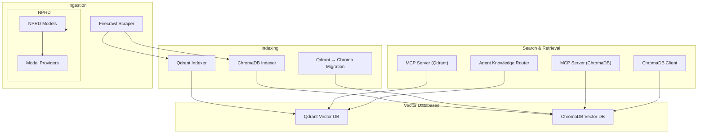
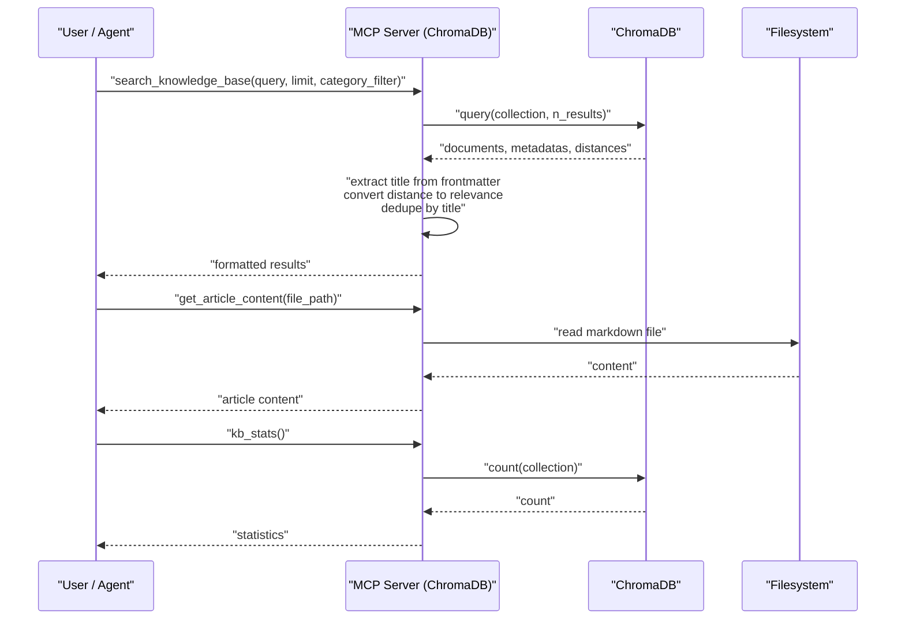
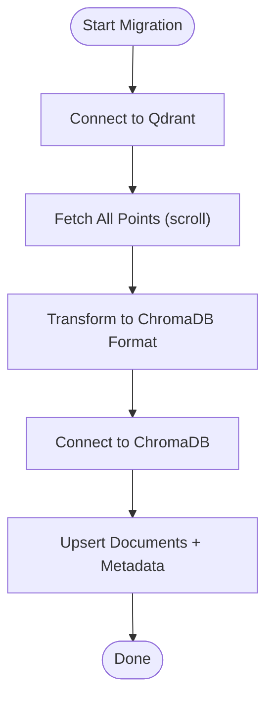
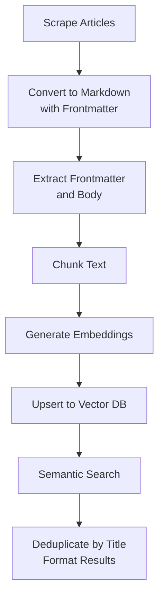
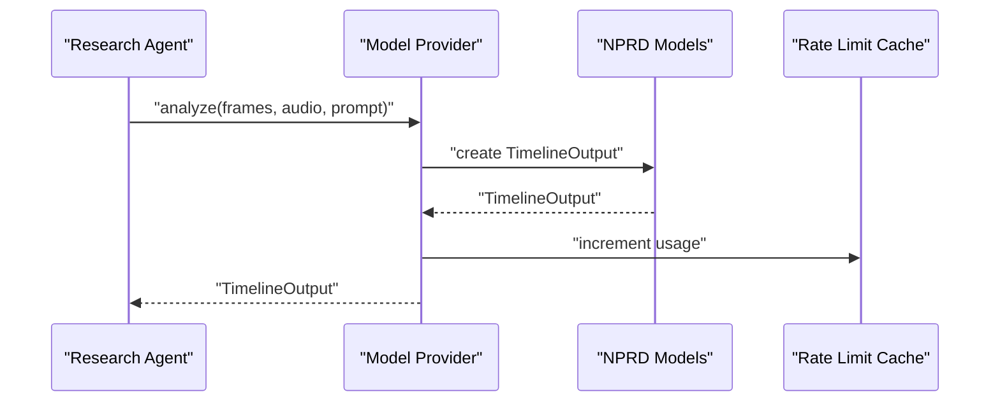
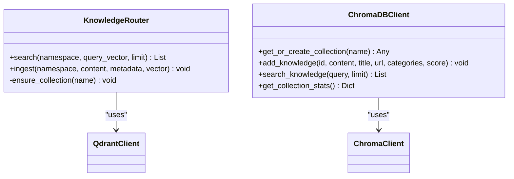
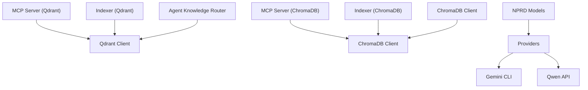

# Knowledge Base System

<cite>
**Referenced Files in This Document**
- [server.py](file://mcp-servers/quantmindx-kb/server.py)
- [server_chroma.py](file://mcp-servers/quantmindx-kb/server_chroma.py)
- [index_to_qdrant.py](file://scripts/index_to_qdrant.py)
- [index_chroma.py](file://scripts/index_chroma.py)
- [search_kb.py](file://scripts/search_kb.py)
- [router.py](file://src/agents/knowledge/router.py)
- [chroma_client.py](file://src/database/chroma_client.py)
- [models.py](file://src/nprd/models.py)
- [providers.py](file://src/nprd/providers.py)
- [KNOWLEDGE_BASE_SETUP.md](file://docs/KNOWLEDGE_BASE_SETUP.md)
- [KNOWLEDGE_BASES_AND_IDE.md](file://docs/KNOWLEDGE_BASES_AND_IDE.md)
- [migrate_qdrant_to_chroma.py](file://scripts/migrate_qdrant_to_chroma.py)
</cite>

## Table of Contents
1. [Introduction](#introduction)
2. [Project Structure](#project-structure)
3. [Core Components](#core-components)
4. [Architecture Overview](#architecture-overview)
5. [Detailed Component Analysis](#detailed-component-analysis)
6. [Dependency Analysis](#dependency-analysis)
7. [Performance Considerations](#performance-considerations)
8. [Troubleshooting Guide](#troubleshooting-guide)
9. [Conclusion](#conclusion)

## Introduction
This document describes the Knowledge Base System that powers semantic search over MQL5 articles, code templates, and research content. It covers vector database integration with ChromaDB and Qdrant, the article processing pipeline (web scraping, content organization, indexing), NPRD (Neural Pattern Recognition) integration for video processing, and the multi-agent system integration for research and strategy development. The system emphasizes scalable, modular components with robust search, retrieval, and content management capabilities.

## Project Structure
The Knowledge Base System spans several modules:
- MCP servers for semantic search over articles and assets
- Scripts for scraping, indexing, and migrating between vector databases
- Database clients for ChromaDB and Qdrant
- NPRD models and providers for video content processing
- Documentation for setup, architecture, and IDE integration

**Diagram sources**
- [server.py](file://mcp-servers/quantmindx-kb/server.py#L1-L189)
- [server_chroma.py](file://mcp-servers/quantmindx-kb/server_chroma.py#L1-L1099)
- [index_to_qdrant.py](file://scripts/index_to_qdrant.py#L1-L182)
- [index_chroma.py](file://scripts/index_chroma.py#L1-L79)
- [migrate_qdrant_to_chroma.py](file://scripts/migrate_qdrant_to_chroma.py#L47-L181)
- [router.py](file://src/agents/knowledge/router.py#L1-L106)
- [chroma_client.py](file://src/database/chroma_client.py#L1-L477)
- [models.py](file://src/nprd/models.py#L1-L340)
- [providers.py](file://src/nprd/providers.py#L1-L743)

**Section sources**
- [KNOWLEDGE_BASES_AND_IDE.md](file://docs/KNOWLEDGE_BASES_AND_IDE.md#L589-L677)

## Core Components
- MCP Servers for semantic search over articles and assets:
  - Qdrant-based MCP server with embedding-based search and article retrieval
  - ChromaDB-based MCP server with caching, connection pooling, and structured asset retrieval tools
- Vector database clients:
  - ChromaDB client with HNSW configuration and collection management
  - Qdrant client for namespace-based isolation and cross-collection search
- Article processing pipeline:
  - Web scraping and markdown conversion
  - Frontmatter extraction, chunking, and embedding
  - Indexing into Qdrant and ChromaDB
- NPRD integration:
  - Video processing models and providers (Gemini CLI, Qwen-VL)
  - Timeline output and rate limiting
- Multi-agent integration:
  - Agent Knowledge Router for isolated namespaces and global standards
  - IDE integration for dashboard, strategy editor, and KB browsing

**Section sources**
- [server.py](file://mcp-servers/quantmindx-kb/server.py#L1-L189)
- [server_chroma.py](file://mcp-servers/quantmindx-kb/server_chroma.py#L1-L1099)
- [chroma_client.py](file://src/database/chroma_client.py#L1-L477)
- [router.py](file://src/agents/knowledge/router.py#L1-L106)
- [models.py](file://src/nprd/models.py#L1-L340)
- [providers.py](file://src/nprd/providers.py#L1-L743)

## Architecture Overview
The system integrates ingestion, indexing, and retrieval across vector databases and MCP servers, with optional migration between Qdrant and ChromaDB. Agents and the IDE consume knowledge via MCP tools and direct database access.

**Diagram sources**
- [server_chroma.py](file://mcp-servers/quantmindx-kb/server_chroma.py#L568-L800)
- [chroma_client.py](file://src/database/chroma_client.py#L327-L353)

**Section sources**
- [server_chroma.py](file://mcp-servers/quantmindx-kb/server_chroma.py#L386-L800)
- [chroma_client.py](file://src/database/chroma_client.py#L327-L353)

## Detailed Component Analysis

### Vector Database Integration: Qdrant and ChromaDB
- Qdrant MCP Server:
  - Embedding model: sentence-transformers all-MiniLM-L6-v2
  - Collection: mql5_knowledge
  - Tools: search_knowledge_base, get_article_content, kb_stats
  - Deduplication by title and optional category filtering
- ChromaDB MCP Server:
  - Built-in embedding function with HNSW configuration (cosine)
  - Collections: mql5_knowledge, algorithm_templates, agentic_skills, coding_standards, bad_patterns_graveyard
  - Structured retrieval tools with Pydantic schemas
  - Query result caching (60s TTL), connection pooling, health checks
- Migration:
  - Qdrant to ChromaDB migration script transforms payloads and preserves metadata

**Diagram sources**
- [migrate_qdrant_to_chroma.py](file://scripts/migrate_qdrant_to_chroma.py#L82-L181)

**Section sources**
- [server.py](file://mcp-servers/quantmindx-kb/server.py#L38-L174)
- [server_chroma.py](file://mcp-servers/quantmindx-kb/server_chroma.py#L272-L313)
- [index_to_qdrant.py](file://scripts/index_to_qdrant.py#L64-L162)
- [index_chroma.py](file://scripts/index_chroma.py#L23-L76)
- [migrate_qdrant_to_chroma.py](file://scripts/migrate_qdrant_to_chroma.py#L47-L181)

### Article Processing Pipeline
- Web scraping and markdown conversion:
  - Firecrawl scraper and simple scraper produce markdown with frontmatter
  - Frontmatter includes title, URL, categories, relevance_score, scraped_at
- Content organization:
  - Document index generator extracts summaries, keywords, classifications, and previews
- Indexing:
  - Qdrant indexer chunks text, generates embeddings, and upserts vectors
  - ChromaDB indexer adds documents with metadata and uses built-in embeddings
- Retrieval:
  - Quick search script demonstrates ChromaDB query and preview extraction

**Diagram sources**
- [index_to_qdrant.py](file://scripts/index_to_qdrant.py#L38-L140)
- [generate_document_index.py](file://scripts/generate_document_index.py#L80-L147)
- [search_kb.py](file://scripts/search_kb.py#L12-L47)

**Section sources**
- [index_to_qdrant.py](file://scripts/index_to_qdrant.py#L38-L182)
- [index_chroma.py](file://scripts/index_chroma.py#L23-L79)
- [generate_document_index.py](file://scripts/generate_document_index.py#L80-L147)
- [search_kb.py](file://scripts/search_kb.py#L12-L61)

### NPRD Integration for Pattern Matching and Market Research
- Models:
  - TimelineClip, TimelineOutput, VideoMetadata, JobStatus, JobOptions, RateLimit, NPRDConfig
- Providers:
  - GeminiCLIProvider: YOLO mode, rate limit tracking, CLI execution
  - QwenVLProvider: headless mode, API calls, rate limit enforcement
- Workflow:
  - Extract frames and audio, analyze with selected provider, generate timeline output, save results

**Diagram sources**
- [models.py](file://src/nprd/models.py#L25-L104)
- [providers.py](file://src/nprd/providers.py#L81-L201)
- [providers.py](file://src/nprd/providers.py#L426-L554)

**Section sources**
- [models.py](file://src/nprd/models.py#L1-L340)
- [providers.py](file://src/nprd/providers.py#L1-L743)

### Knowledge Base Architecture and Search Algorithms
- Collections and namespaces:
  - Qdrant: namespace-based collections for isolated agent knowledge and global standards
  - ChromaDB: separate collections for knowledge, templates, skills, standards, and bad patterns
- Search algorithms:
  - Cosine similarity with HNSW index configuration
  - Query result deduplication by title and optional category filtering
  - Distance-to-relevance conversion for ChromaDB results
- Retrieval mechanisms:
  - MCP tools expose search, content retrieval, and statistics
  - Direct client access for advanced filtering and metadata queries

**Diagram sources**
- [router.py](file://src/agents/knowledge/router.py#L19-L103)
- [chroma_client.py](file://src/database/chroma_client.py#L76-L156)

**Section sources**
- [router.py](file://src/agents/knowledge/router.py#L1-L106)
- [chroma_client.py](file://src/database/chroma_client.py#L76-L416)

### Asset Indexing System and Market Data Organization
- Asset collections in ChromaDB:
  - algorithm_templates, agentic_skills, coding_standards, bad_patterns_graveyard
- Structured retrieval:
  - Pydantic models define schemas for templates, skills, standards, and bad patterns
  - Tools return structured results with code, dependencies, and usage examples
- Market data organization:
  - Tiered memory architecture with working, short-term, and long-term stores
  - ChromaDB serves as the long-term semantic store for patterns and strategies

**Section sources**
- [server_chroma.py](file://mcp-servers/quantmindx-kb/server_chroma.py#L288-L313)
- [server_chroma.py](file://mcp-servers/quantmindx-kb/server_chroma.py#L338-L383)
- [KNOWLEDGE_BASES_AND_IDE.md](file://docs/KNOWLEDGE_BASES_AND_IDE.md#L132-L184)

### Research Workflow Integration with Multi-Agent System
- Agent Knowledge Router:
  - Isolated namespaces per agent (Analyst, QuantCode) plus global standards
  - Combines private and global results for context-aware retrieval
- IDE integration:
  - Dashboard, Bot Manager, Strategy Editor, Backtest View, Trade Journal, KB Browser, Evolution Center
  - MCP servers enable semantic search and asset retrieval from the IDE

**Section sources**
- [router.py](file://src/agents/knowledge/router.py#L40-L71)
- [KNOWLEDGE_BASES_AND_IDE.md](file://docs/KNOWLEDGE_BASES_AND_IDE.md#L400-L586)

## Dependency Analysis
Key dependencies and relationships:
- MCP servers depend on vector database clients and embedding models
- Indexing scripts depend on sentence-transformers and qdrant-client/chromadb
- NPRD providers depend on external APIs and rate limiting
- Agent Knowledge Router depends on Qdrant for namespace isolation

**Diagram sources**
- [server.py](file://mcp-servers/quantmindx-kb/server.py#L30-L45)
- [server_chroma.py](file://mcp-servers/quantmindx-kb/server_chroma.py#L67-L71)
- [index_to_qdrant.py](file://scripts/index_to_qdrant.py#L16-L30)
- [index_chroma.py](file://scripts/index_chroma.py#L11-L16)
- [router.py](file://src/agents/knowledge/router.py#L13-L15)
- [chroma_client.py](file://src/database/chroma_client.py#L12-L21)
- [models.py](file://src/nprd/models.py#L1-L12)
- [providers.py](file://src/nprd/providers.py#L8-L23)

**Section sources**
- [server.py](file://mcp-servers/quantmindx-kb/server.py#L30-L45)
- [server_chroma.py](file://mcp-servers/quantmindx-kb/server_chroma.py#L67-L71)
- [index_to_qdrant.py](file://scripts/index_to_qdrant.py#L16-L30)
- [index_chroma.py](file://scripts/index_chroma.py#L11-L16)
- [router.py](file://src/agents/knowledge/router.py#L13-L15)
- [chroma_client.py](file://src/database/chroma_client.py#L12-L21)
- [models.py](file://src/nprd/models.py#L1-L12)
- [providers.py](file://src/nprd/providers.py#L8-L23)

## Performance Considerations
- ChromaDB optimizations:
  - HNSW index configuration (cosine, M=16, construction_ef=100, search_ef=50)
  - Built-in embeddings eliminate external model loading overhead
  - Query result caching (60s TTL) reduces repeated computation
  - Connection pooling and health checks improve reliability
- Qdrant considerations:
  - Sentence-transformers model loading cost; consider keeping model loaded
  - Chunking strategy balances recall and performance
- NPRD providers:
  - Rate limiting and retries; headless mode for automation
  - Cache directory and size limits for video processing artifacts

[No sources needed since this section provides general guidance]

## Troubleshooting Guide
- MCP server startup and dependencies:
  - Ensure MCP SDK and embedding libraries are installed
  - Verify project root security check and PYTHONPATH
- Qdrant connectivity:
  - Confirm Qdrant service is running and accessible
  - Check collection existence and vector configuration
- ChromaDB performance:
  - Validate HNSW metadata and collection counts
  - Monitor cache hit rate and health checks
- NPRD provider issues:
  - Authentication and rate limit errors
  - Network connectivity and timeouts
- Migration:
  - Verify Qdrant path and collection presence before migration
  - Confirm ChromaDB persistence path and collection creation

**Section sources**
- [KNOWLEDGE_BASE_SETUP.md](file://docs/KNOWLEDGE_BASE_SETUP.md#L149-L163)
- [server_chroma.py](file://mcp-servers/quantmindx-kb/server_chroma.py#L620-L633)
- [providers.py](file://src/nprd/providers.py#L163-L189)
- [migrate_qdrant_to_chroma.py](file://scripts/migrate_qdrant_to_chroma.py#L51-L57)

## Conclusion
The Knowledge Base System provides a robust, scalable foundation for semantic search over trading knowledge, code assets, and video-derived insights. By leveraging ChromaDB and Qdrant with dedicated MCP servers, structured asset retrieval, and migration pathways, it supports multi-agent workflows and IDE integration. The NPRD integration extends the system’s capability to process multimedia content for market research. Together, these components enable efficient knowledge discovery, pattern recognition, and strategy development.