# NPRD Integration

<cite>
**Referenced Files in This Document**
- [__init__.py](file://src/nprd/__init__.py)
- [models.py](file://src/nprd/models.py)
- [processors.py](file://src/nprd/processor.py)
- [providers.py](file://src/nprd/providers.py)
- [cache.py](file://src/nprd/cache.py)
- [downloader.py](file://src/nprd/downloader.py)
- [extractors.py](file://src/nprd/extractors.py)
- [job_queue.py](file://src/nprd/job_queue.py)
- [retry.py](file://src/nprd/retry.py)
- [rate_limiter.py](file://src/nprd/rate_limiter.py)
- [model_provider_interface.md](file://docs/nprd/model_provider_interface.md)
- [nprd_server.js](file://server/nprd_server.js)
- [README.md](file://README.md)
</cite>

## Table of Contents
1. [Introduction](#introduction)
2. [Project Structure](#project-structure)
3. [Core Components](#core-components)
4. [Architecture Overview](#architecture-overview)
5. [Detailed Component Analysis](#detailed-component-analysis)
6. [Dependency Analysis](#dependency-analysis)
7. [Performance Considerations](#performance-considerations)
8. [Troubleshooting Guide](#troubleshooting-guide)
9. [Conclusion](#conclusion)
10. [Appendices](#appendices)

## Introduction
This document describes the NPRD (Neural Pattern Recognition) Integration component, focusing on its architecture for pattern matching and market research capabilities. NPRD is designed as a “dumb extraction” pipeline that captures objective, verbatim transcripts and visual descriptions from multimedia content without inferring strategies or injecting domain bias. The system integrates:
- Asynchronous job queue management
- Robust retry and rate-limiting mechanisms
- Artifact caching for processed patterns
- Downloader and extractor modules for market data
- Provider implementations for multimodal AI analysis
- Integration hooks for downstream strategy development within a multi-agent system

## Project Structure
The NPRD module resides under src/nprd and exposes a cohesive API surface for orchestration, data modeling, and integration. Key directories and files include:
- Orchestrator: processors.py
- Data models: models.py
- Providers: providers.py
- Infrastructure: cache.py, downloader.py, extractors.py, job_queue.py, retry.py, rate_limiter.py
- Public API: __init__.py
- Documentation: model_provider_interface.md
- Server bridge: nprd_server.js

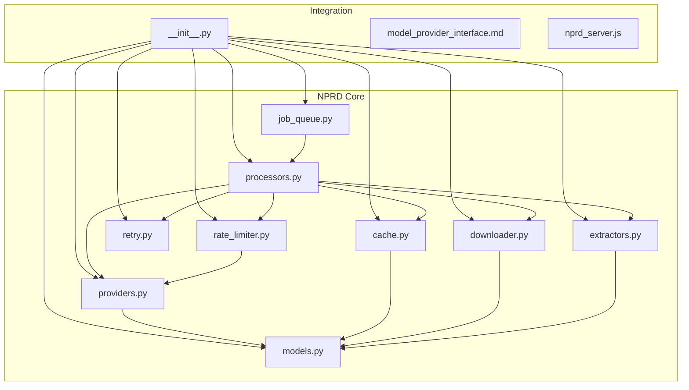

**Diagram sources**
- [__init__.py](file://src/nprd/__init__.py#L1-L85)
- [models.py](file://src/nprd/models.py#L1-L340)
- [processors.py](file://src/nprd/processor.py#L1-L799)
- [providers.py](file://src/nprd/providers.py#L1-L743)
- [cache.py](file://src/nprd/cache.py#L1-L680)
- [downloader.py](file://src/nprd/downloader.py#L1-L285)
- [extractors.py](file://src/nprd/extractors.py#L1-L352)
- [job_queue.py](file://src/nprd/job_queue.py#L1-L651)
- [retry.py](file://src/nprd/retry.py#L1-L303)
- [rate_limiter.py](file://src/nprd/rate_limiter.py#L1-L385)
- [model_provider_interface.md](file://docs/nprd/model_provider_interface.md#L1-L270)
- [nprd_server.js](file://server/nprd_server.js)

**Section sources**
- [__init__.py](file://src/nprd/__init__.py#L1-L85)
- [README.md](file://README.md)

## Core Components
- Data models: Define the canonical structures for timelines, clips, job states, and configuration.
- Processor: Orchestrates the full pipeline: download → extract → analyze → persist.
- Providers: Abstractions and implementations for multimodal AI analysis.
- Cache: Content-addressable artifact cache with integrity checks and eviction policies.
- Downloader: Robust video download with retry/backoff and validation.
- Extractors: Frame and audio extraction using ffmpeg.
- Job Queue: Persistent, concurrent job management with SQLite.
- Retry: Exponential backoff with jitter and error classification.
- Rate Limiter: Token-bucket with sliding window and provider fallback.

**Section sources**
- [models.py](file://src/nprd/models.py#L1-L340)
- [processors.py](file://src/nprd/processor.py#L1-L799)
- [providers.py](file://src/nprd/providers.py#L1-L743)
- [cache.py](file://src/nprd/cache.py#L1-L680)
- [downloader.py](file://src/nprd/downloader.py#L1-L285)
- [extractors.py](file://src/nprd/extractors.py#L1-L352)
- [job_queue.py](file://src/nprd/job_queue.py#L1-L651)
- [retry.py](file://src/nprd/retry.py#L1-L303)
- [rate_limiter.py](file://src/nprd/rate_limiter.py#L1-L385)

## Architecture Overview
NPRD’s architecture emphasizes separation of concerns and resilience:
- The Processor coordinates the pipeline and delegates to specialized modules.
- Providers encapsulate AI analysis, enabling pluggable backends.
- Cache reduces redundant processing and accelerates subsequent runs.
- Downloader and Extractors rely on external tools (yt-dlp, ffmpeg) with validation.
- Job Queue persists state and enables asynchronous execution.
- Retry and Rate Limiter mitigate transient failures and quota constraints.

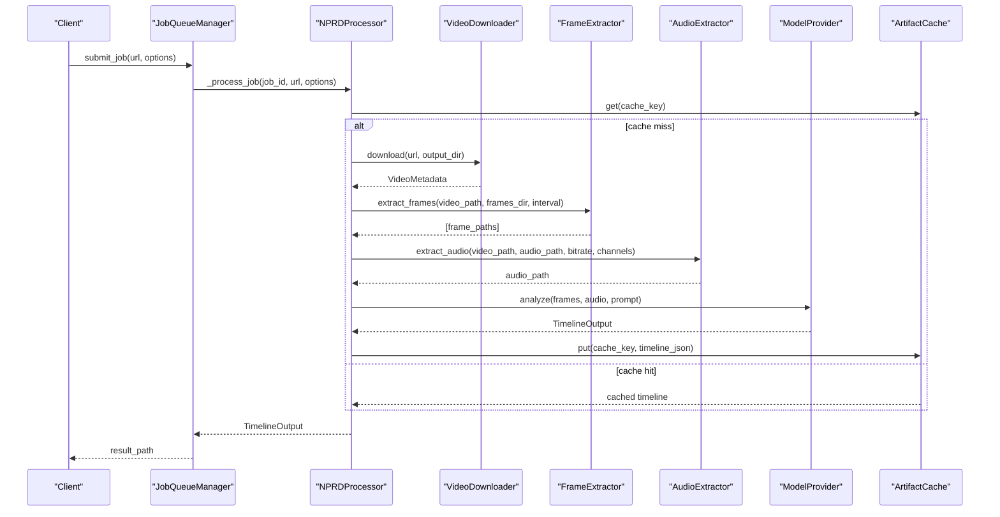

**Diagram sources**
- [job_queue.py](file://src/nprd/job_queue.py#L581-L622)
- [processors.py](file://src/nprd/processor.py#L260-L356)
- [downloader.py](file://src/nprd/downloader.py#L46-L106)
- [extractors.py](file://src/nprd/extractors.py#L51-L124)
- [providers.py](file://src/nprd/providers.py#L112-L190)
- [cache.py](file://src/nprd/cache.py#L77-L168)

## Detailed Component Analysis

### Data Models
NPRD defines strongly typed models for pipeline state and outputs:
- TimelineClip: per-clip transcript and visual description with timestamps.
- TimelineOutput: top-level timeline with metadata and array of clips.
- VideoMetadata: post-download metadata.
- JobStatus/JobOptions: job lifecycle and runtime configuration.
- RateLimit: provider-side usage tracking.
- NPRDConfig: global configuration loaded from environment.

Key behaviors:
- JSON serialization/deserialization for persistence and transport.
- Validation helpers and conversion utilities.
- RateLimit supports increment/reset and remaining calculation.

**Section sources**
- [models.py](file://src/nprd/models.py#L15-L340)

### Processor Orchestration
The NPRDProcessor is the central orchestrator:
- Accepts a URL, optional job_id, and options.
- Checks cache for content-addressed key.
- Executes pipeline steps with status callbacks and progress updates.
- Supports playlist extraction and batch job creation.
- Integrates retry, rate limiting, and provider fallback.

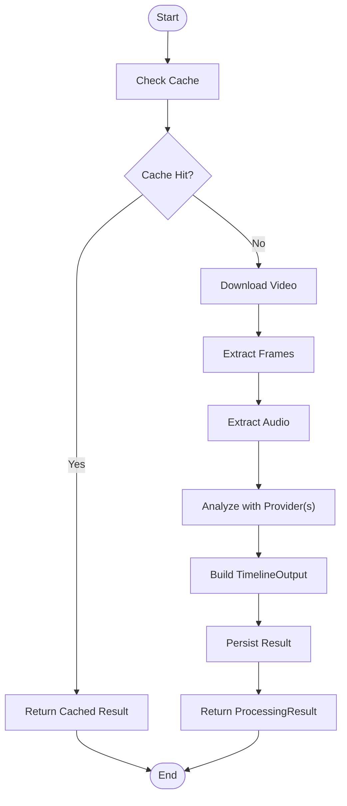

**Diagram sources**
- [processors.py](file://src/nprd/processor.py#L260-L356)

**Section sources**
- [processors.py](file://src/nprd/processor.py#L112-L799)

### Provider Implementations
Providers implement a unified interface for multimodal analysis:
- ModelProvider: abstract interface for analyze() and rate limit tracking.
- GeminiCLIProvider: uses Gemini CLI with YOLO mode; subscription-based usage tracking.
- QwenVLProvider: uses OpenAI-compatible endpoint; free tier with strict quotas.

Provider interface and implementation details:
- analyze() validates inputs, executes provider-specific logic, parses output into TimelineOutput, and increments usage counters.
- get_rate_limit() returns provider-specific usage metrics.
- Error handling distinguishes authentication, network, validation, and rate limit errors.

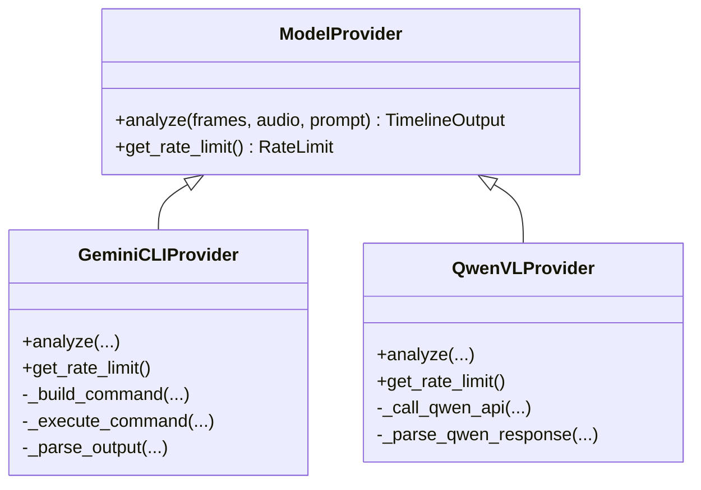

**Diagram sources**
- [providers.py](file://src/nprd/providers.py#L29-L78)
- [providers.py](file://src/nprd/providers.py#L81-L424)
- [providers.py](file://src/nprd/providers.py#L426-L743)

**Section sources**
- [providers.py](file://src/nprd/providers.py#L1-L743)
- [model_provider_interface.md](file://docs/nprd/model_provider_interface.md#L1-L270)

### Cache Management
ArtifactCache provides content-addressable storage with:
- Hierarchical directory layout for efficient lookup.
- Integrity verification via checksums.
- Multiple eviction strategies: LRU, size-based, age-based.
- Manifest tracking of stored artifacts and sizes.

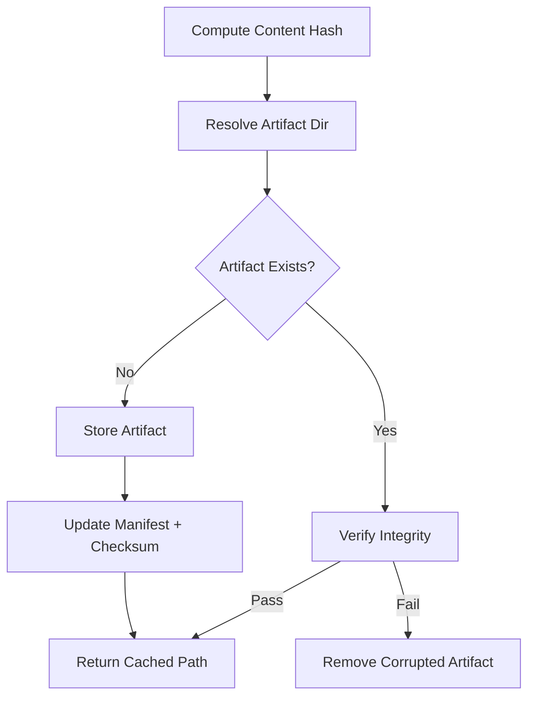

**Diagram sources**
- [cache.py](file://src/nprd/cache.py#L77-L168)
- [cache.py](file://src/nprd/cache.py#L217-L274)

**Section sources**
- [cache.py](file://src/nprd/cache.py#L1-L680)

### Downloader Module
VideoDownloader wraps yt-dlp with:
- Retry logic using exponential backoff.
- URL validation and file integrity checks.
- Metadata extraction and playlist info retrieval.

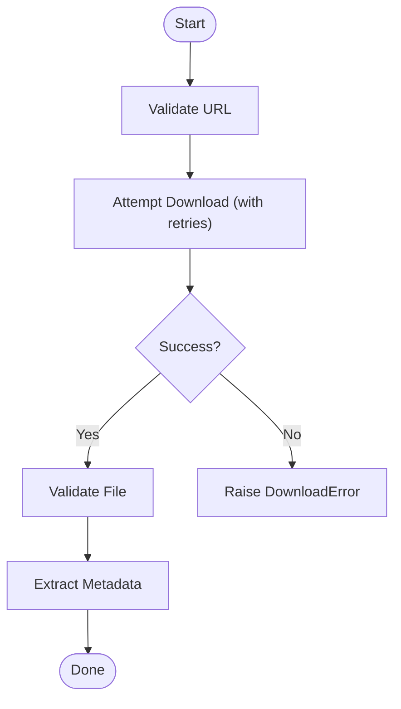

**Diagram sources**
- [downloader.py](file://src/nprd/downloader.py#L46-L106)
- [downloader.py](file://src/nprd/downloader.py#L108-L154)

**Section sources**
- [downloader.py](file://src/nprd/downloader.py#L1-L285)

### Extractors (Frames and Audio)
FrameExtractor and AudioExtractor use ffmpeg:
- Frame extraction at configurable intervals with validation and partial success handling.
- Audio extraction to MP3 with bitrate/channel controls and duration checks.

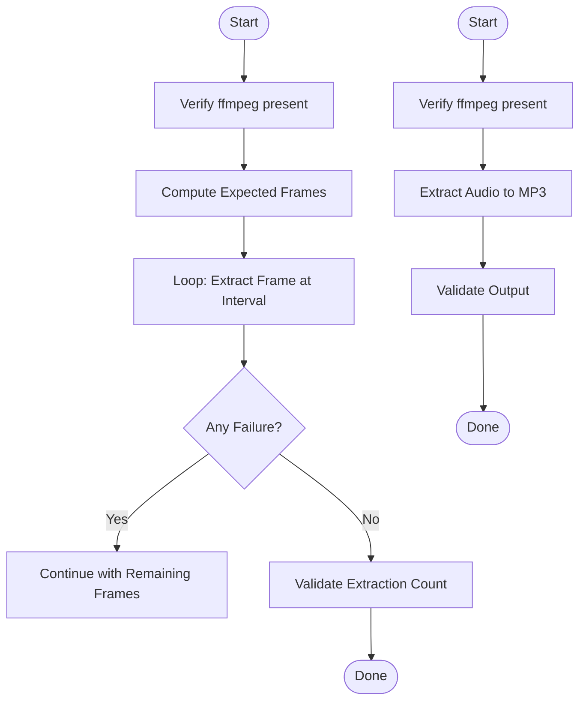

**Diagram sources**
- [extractors.py](file://src/nprd/extractors.py#L51-L124)
- [extractors.py](file://src/nprd/extractors.py#L215-L297)

**Section sources**
- [extractors.py](file://src/nprd/extractors.py#L1-L352)

### Job Queue System
JobQueueManager provides:
- SQLite-backed persistence for jobs and logs.
- Concurrent execution with configurable limits.
- Automatic recovery of interrupted jobs.
- Status updates and result persistence.

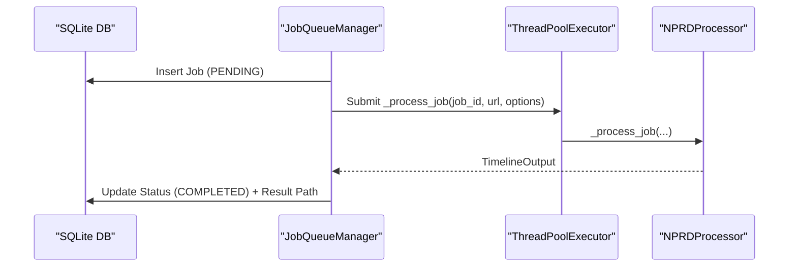

**Diagram sources**
- [job_queue.py](file://src/nprd/job_queue.py#L127-L188)
- [job_queue.py](file://src/nprd/job_queue.py#L417-L440)
- [job_queue.py](file://src/nprd/job_queue.py#L581-L622)

**Section sources**
- [job_queue.py](file://src/nprd/job_queue.py#L1-L651)

### Retry Mechanisms
RetryHandler implements:
- Exponential backoff with jitter.
- Error classification (retryable vs non-retryable).
- Configurable max retries and delays.

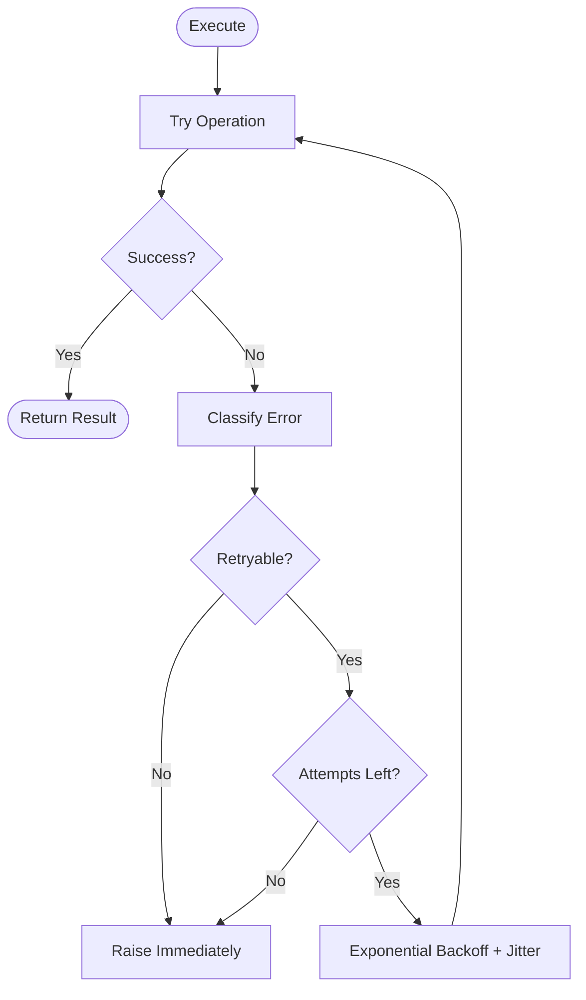

**Diagram sources**
- [retry.py](file://src/nprd/retry.py#L55-L117)

**Section sources**
- [retry.py](file://src/nprd/retry.py#L1-L303)

### Rate Limiting
RateLimiter implements:
- Token bucket with sliding window.
- Per-provider tracking and automatic fallback.
- MultiProviderRateLimiter for prioritized provider selection.

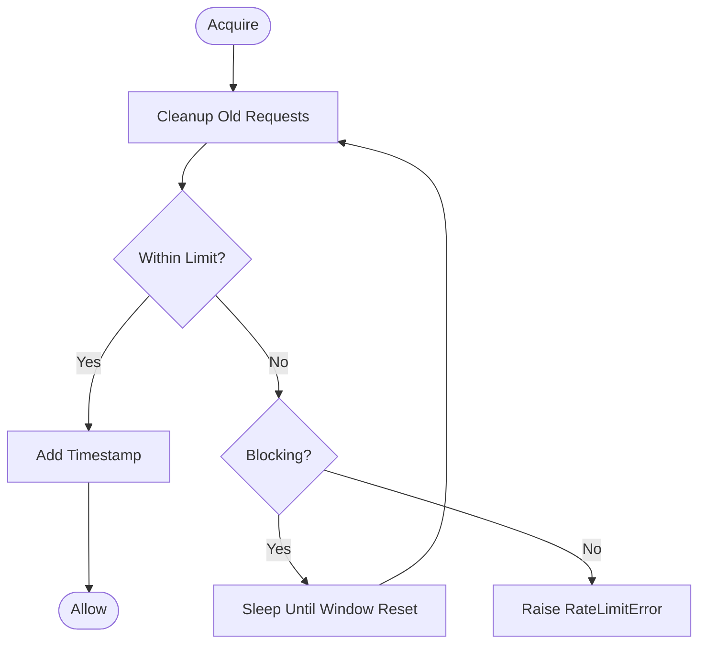

**Diagram sources**
- [rate_limiter.py](file://src/nprd/rate_limiter.py#L64-L130)
- [rate_limiter.py](file://src/nprd/rate_limiter.py#L241-L299)

**Section sources**
- [rate_limiter.py](file://src/nprd/rate_limiter.py#L1-L385)

### Neural Pattern Recognition Workflows
While the repository focuses on “dumb extraction,” the resulting TimelineOutput provides the foundation for downstream pattern recognition:
- TimelineClip stores verbatim transcripts and objective visual descriptions, enabling downstream agents to detect recurring themes, speaker roles, and visual markers.
- TimelineOutput serves as the canonical artifact for knowledge bases and strategy development.
- The “dumb extraction” philosophy prevents model collapse and ensures unbiased, reusable data.

**Section sources**
- [processors.py](file://src/nprd/processor.py#L43-L61)
- [models.py](file://src/nprd/models.py#L25-L104)

### Integration with Knowledge Base Collections
- TimelineOutput can be persisted to JSON and later indexed into knowledge bases.
- The cache layer can store processed artifacts keyed by content hash, supporting deduplication and reuse.
- JobQueueManager persists results to disk, enabling downstream systems to consume artifacts reliably.

**Section sources**
- [models.py](file://src/nprd/models.py#L93-L104)
- [processors.py](file://src/nprd/processor.py#L397-L400)
- [job_queue.py](file://src/nprd/job_queue.py#L596-L609)

### Relationship to Strategy Development in Multi-Agent Systems
- NPRD produces objective, verbatim artifacts that downstream agents (e.g., Analyst, Copilot) can analyze to infer strategies.
- The “dumb extraction” approach avoids injecting assumptions, reducing risk of hallucination and ensuring downstream reasoning is grounded in observed facts.
- JobQueue and cache layers enable scalable ingestion of market research content for multi-agent workflows.

**Section sources**
- [processors.py](file://src/nprd/processor.py#L43-L61)
- [job_queue.py](file://src/nprd/job_queue.py#L1-L651)

## Dependency Analysis
NPRD components exhibit low coupling and high cohesion:
- Processor depends on Downloader, Extractors, Providers, Cache, Retry, and RateLimiter.
- Providers depend on models and exceptions.
- Cache depends on models and filesystem operations.
- JobQueue depends on models and SQLite.
- Retry and RateLimiter are standalone utilities used across modules.

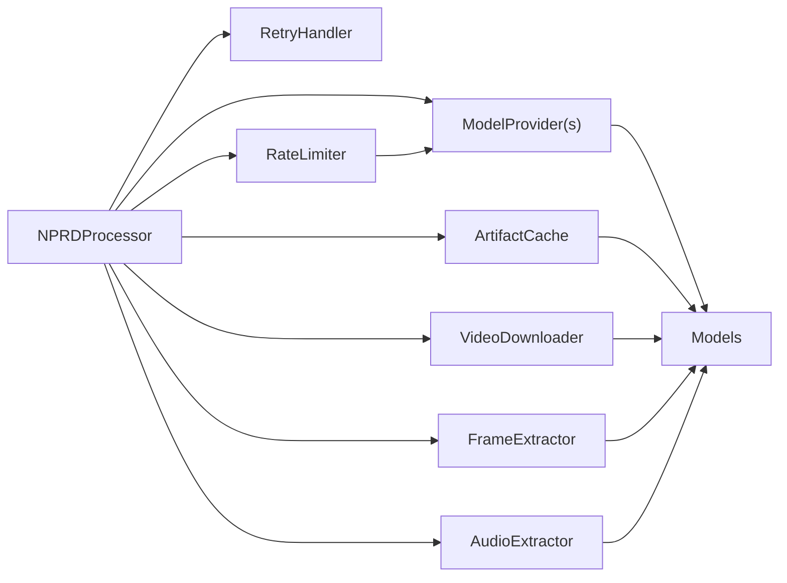

**Diagram sources**
- [processors.py](file://src/nprd/processor.py#L131-L194)
- [providers.py](file://src/nprd/providers.py#L16-L23)
- [cache.py](file://src/nprd/cache.py#L17-L20)
- [downloader.py](file://src/nprd/downloader.py#L13-L14)
- [extractors.py](file://src/nprd/extractors.py#L13-L13)
- [rate_limiter.py](file://src/nprd/rate_limiter.py#L14-L14)

**Section sources**
- [processors.py](file://src/nprd/processor.py#L1-L799)
- [providers.py](file://src/nprd/providers.py#L1-L743)
- [cache.py](file://src/nprd/cache.py#L1-L680)
- [downloader.py](file://src/nprd/downloader.py#L1-L285)
- [extractors.py](file://src/nprd/extractors.py#L1-L352)
- [rate_limiter.py](file://src/nprd/rate_limiter.py#L1-L385)

## Performance Considerations
- Concurrency: JobQueueManager uses a thread pool to process multiple jobs concurrently, bounded by max_concurrent_jobs.
- I/O Bound Optimization: ffmpeg-based extraction and yt-dlp downloads dominate runtime; ensure adequate CPU and disk throughput.
- Cache Utilization: Content-addressable caching minimizes repeated processing and network fetches.
- Retry Backoff: Exponential backoff with jitter prevents thundering herds and improves resilience under transient failures.
- Rate Limiting: Token-bucket sliding window prevents quota exhaustion; MultiProviderRateLimiter enables fallback to alternative providers.
- Persistence: SQLite-backed job queue ensures durability and recovery after restarts.

[No sources needed since this section provides general guidance]

## Troubleshooting Guide
Common issues and resolutions:
- Authentication failures: Provider-specific authentication errors indicate misconfigured API keys or missing environment variables.
- Network errors: Transient network failures trigger retry logic; verify connectivity and consider increasing max_retries.
- Rate limit exceeded: Use MultiProviderRateLimiter to select alternative providers or wait for window reset.
- Validation errors: Invalid inputs (missing files, unsupported formats) raise ValidationError; verify paths and formats.
- Cache integrity failures: Corrupted artifacts are removed automatically; inspect logs for checksum mismatches.
- Job failures: JobQueueManager records logs and errors; inspect job status and logs for root cause.

**Section sources**
- [providers.py](file://src/nprd/providers.py#L163-L189)
- [retry.py](file://src/nprd/retry.py#L119-L187)
- [rate_limiter.py](file://src/nprd/rate_limiter.py#L83-L130)
- [cache.py](file://src/nprd/cache.py#L169-L215)
- [job_queue.py](file://src/nprd/job_queue.py#L278-L341)

## Conclusion
NPRD delivers a robust, extensible framework for unbiased, objective extraction of multimedia content. Its modular design, resilient retry and rate-limiting strategies, and durable job queue enable scalable ingestion suitable for multi-agent strategy development. The resulting TimelineOutput provides a solid foundation for downstream pattern recognition and knowledge base integration.

[No sources needed since this section summarizes without analyzing specific files]

## Appendices

### API Surface and Entry Points
- Public exports are centralized in __init__.py, exposing models, processors, components, exceptions, and logging utilities.
- Server bridge (nprd_server.js) provides an HTTP entry point for external clients to trigger processing.

**Section sources**
- [__init__.py](file://src/nprd/__init__.py#L40-L84)
- [nprd_server.js](file://server/nprd_server.js)