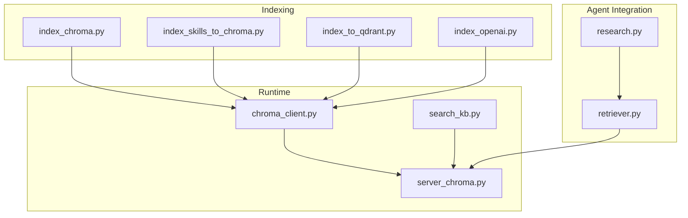
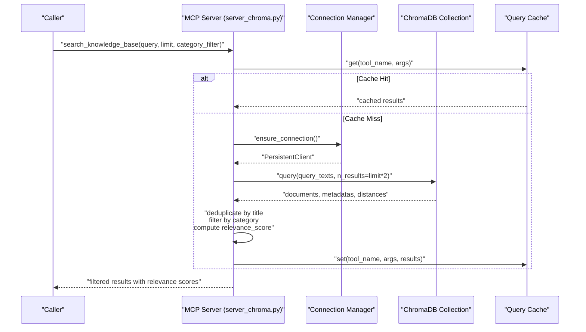
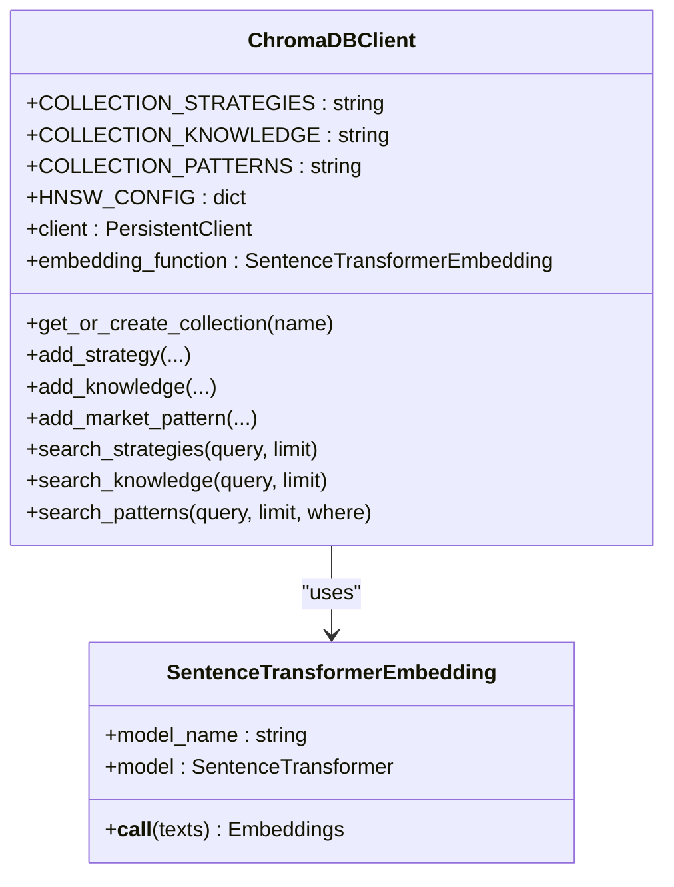
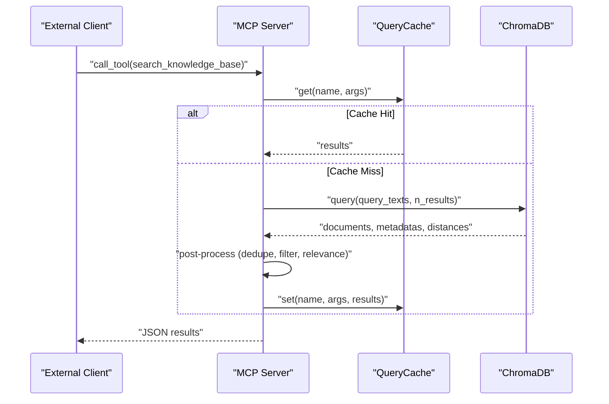
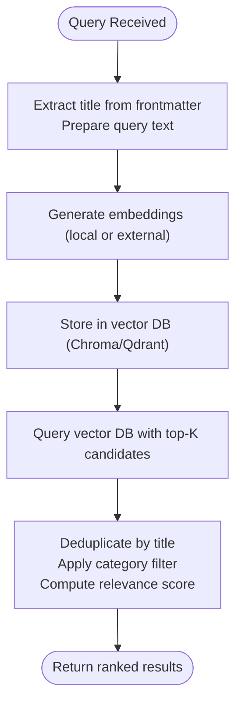
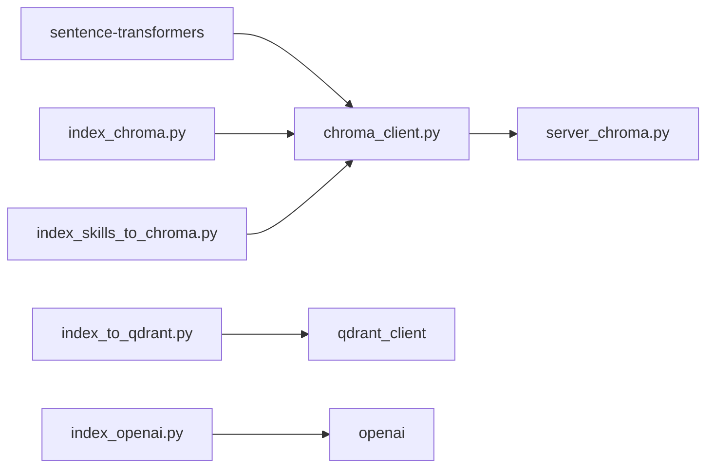

# Semantic Search Capabilities

<cite>
**Referenced Files in This Document**
- [chroma_client.py](file://src/database/chroma_client.py)
- [server_chroma.py](file://mcp-servers/quantmindx-kb/server_chroma.py)
- [search_kb.py](file://scripts/search_kb.py)
- [index_chroma.py](file://scripts/index_chroma.py)
- [index_skills_to_chroma.py](file://scripts/index_skills_to_chroma.py)
- [index_to_qdrant.py](file://scripts/index_to_qdrant.py)
- [index_openai.py](file://scripts/index_openai.py)
- [research.py](file://src/agents/skills/research.py)
- [retriever.py](file://src/agents/knowledge/retriever.py)
</cite>

## Table of Contents
1. [Introduction](#introduction)
2. [Project Structure](#project-structure)
3. [Core Components](#core-components)
4. [Architecture Overview](#architecture-overview)
5. [Detailed Component Analysis](#detailed-component-analysis)
6. [Dependency Analysis](#dependency-analysis)
7. [Performance Considerations](#performance-considerations)
8. [Troubleshooting Guide](#troubleshooting-guide)
9. [Conclusion](#conclusion)
10. [Appendices](#appendices)

## Introduction
This document describes the Semantic Search Capabilities implemented in the repository. It focuses on the end-to-end pipeline that transforms natural language queries into vector embeddings using sentence-transformers, stores them in a vector database, and retrieves semantically similar documents. It also covers search result ranking, metadata filtering, pagination and caching optimizations, and integration options with local sentence-transformers and external OpenAI embeddings. Hybrid search approaches combining semantic and keyword-based methods are discussed conceptually.

## Project Structure
The semantic search implementation spans indexing utilities, a vector database client, an MCP server exposing retrieval tools, and agent-side retrieval hooks.

**Diagram sources**
- [index_chroma.py](file://scripts/index_chroma.py#L1-L79)
- [index_skills_to_chroma.py](file://scripts/index_skills_to_chroma.py#L1-L409)
- [index_to_qdrant.py](file://scripts/index_to_qdrant.py#L1-L182)
- [index_openai.py](file://scripts/index_openai.py#L1-L149)
- [chroma_client.py](file://src/database/chroma_client.py#L1-L477)
- [server_chroma.py](file://mcp-servers/quantmindx-kb/server_chroma.py#L1-L1099)
- [search_kb.py](file://scripts/search_kb.py#L1-L61)
- [research.py](file://src/agents/skills/research.py#L1-L24)
- [retriever.py](file://src/agents/knowledge/retriever.py#L1-L26)

**Section sources**
- [index_chroma.py](file://scripts/index_chroma.py#L1-L79)
- [index_skills_to_chroma.py](file://scripts/index_skills_to_chroma.py#L1-L409)
- [index_to_qdrant.py](file://scripts/index_to_qdrant.py#L1-L182)
- [index_openai.py](file://scripts/index_openai.py#L1-L149)
- [chroma_client.py](file://src/database/chroma_client.py#L1-L477)
- [server_chroma.py](file://mcp-servers/quantmindx-kb/server_chroma.py#L1-L1099)
- [search_kb.py](file://scripts/search_kb.py#L1-L61)
- [research.py](file://src/agents/skills/research.py#L1-L24)
- [retriever.py](file://src/agents/knowledge/retriever.py#L1-L26)

## Core Components
- Vector database client and embedding function:
  - Sentence-transformers-based embedding function producing normalized vectors for cosine similarity.
  - ChromaDB client managing collections and search queries.
- MCP server for semantic retrieval:
  - Provides structured tools for knowledge base search, category listing, and asset retrieval.
  - Implements caching and connection health checks for performance.
- Indexing utilities:
  - Local ChromaDB indexing for scraped articles.
  - Skills indexing with sentence-transformers embeddings.
  - Alternative Qdrant indexing with sentence-transformers or OpenAI embeddings.
- Agent integration:
  - Research skill and standardized retriever tool for downstream agents.

**Section sources**
- [chroma_client.py](file://src/database/chroma_client.py#L32-L74)
- [chroma_client.py](file://src/database/chroma_client.py#L76-L157)
- [server_chroma.py](file://mcp-servers/quantmindx-kb/server_chroma.py#L87-L141)
- [server_chroma.py](file://mcp-servers/quantmindx-kb/server_chroma.py#L147-L219)
- [index_chroma.py](file://scripts/index_chroma.py#L23-L79)
- [index_skills_to_chroma.py](file://scripts/index_skills_to_chroma.py#L287-L409)
- [index_to_qdrant.py](file://scripts/index_to_qdrant.py#L69-L182)
- [index_openai.py](file://scripts/index_openai.py#L72-L149)
- [research.py](file://src/agents/skills/research.py#L9-L24)
- [retriever.py](file://src/agents/knowledge/retriever.py#L10-L26)

## Architecture Overview
The semantic search architecture integrates ingestion, storage, and retrieval across local and optional external embedding providers.

**Diagram sources**
- [server_chroma.py](file://mcp-servers/quantmindx-kb/server_chroma.py#L568-L711)
- [server_chroma.py](file://mcp-servers/quantmindx-kb/server_chroma.py#L147-L219)
- [server_chroma.py](file://mcp-servers/quantmindx-kb/server_chroma.py#L87-L141)

## Detailed Component Analysis

### Vector Embedding and Storage Client
- Embedding function:
  - Uses sentence-transformers with a pre-defined model to produce normalized embeddings suitable for cosine similarity.
  - Lazily loads the model and encodes batches efficiently.
- ChromaDB client:
  - Manages three collections: strategy DNA, market research, and agent memory.
  - Initializes HNSW index with cosine space and tuned parameters for recall and speed.
  - Provides convenience methods to add documents and metadata, and to search with configurable limits.

**Diagram sources**
- [chroma_client.py](file://src/database/chroma_client.py#L32-L74)
- [chroma_client.py](file://src/database/chroma_client.py#L76-L157)

**Section sources**
- [chroma_client.py](file://src/database/chroma_client.py#L32-L74)
- [chroma_client.py](file://src/database/chroma_client.py#L76-L157)
- [chroma_client.py](file://src/database/chroma_client.py#L299-L354)
- [chroma_client.py](file://src/database/chroma_client.py#L355-L388)

### MCP Server for Semantic Retrieval
- Tools exposed:
  - search_knowledge_base with optional category filter and result limit.
  - get_article_content, kb_stats, list_categories, list/get skills/templates.
- Optimizations:
  - Connection pooling with periodic health checks.
  - In-memory query result cache with TTL and hit-rate tracking.
  - Deduplication by title and relevance score derived from cosine distance.

**Diagram sources**
- [server_chroma.py](file://mcp-servers/quantmindx-kb/server_chroma.py#L568-L711)
- [server_chroma.py](file://mcp-servers/quantmindx-kb/server_chroma.py#L147-L219)
- [server_chroma.py](file://mcp-servers/quantmindx-kb/server_chroma.py#L87-L141)

**Section sources**
- [server_chroma.py](file://mcp-servers/quantmindx-kb/server_chroma.py#L386-L567)
- [server_chroma.py](file://mcp-servers/quantmindx-kb/server_chroma.py#L636-L711)
- [server_chroma.py](file://mcp-servers/quantmindx-kb/server_chroma.py#L147-L219)
- [server_chroma.py](file://mcp-servers/quantmindx-kb/server_chroma.py#L87-L141)

### Query Processing Pipeline
- Preprocessing:
  - Extract titles from frontmatter or headings.
  - Optional deduplication by title.
- Embedding:
  - Sentence-transformers embeddings computed during indexing or at query time depending on the chosen path.
- Similarity:
  - Cosine similarity via normalized embeddings; distances returned by ChromaDB converted to relevance scores.
- Ranking:
  - Results ranked by relevance score (derived from distance), with optional category filtering.

**Diagram sources**
- [server_chroma.py](file://mcp-servers/quantmindx-kb/server_chroma.py#L636-L711)
- [index_skills_to_chroma.py](file://scripts/index_skills_to_chroma.py#L342-L382)
- [index_to_qdrant.py](file://scripts/index_to_qdrant.py#L118-L140)
- [index_openai.py](file://scripts/index_openai.py#L116-L131)

**Section sources**
- [server_chroma.py](file://mcp-servers/quantmindx-kb/server_chroma.py#L636-L711)
- [index_skills_to_chroma.py](file://scripts/index_skills_to_chroma.py#L342-L382)
- [index_to_qdrant.py](file://scripts/index_to_qdrant.py#L118-L140)
- [index_openai.py](file://scripts/index_openai.py#L116-L131)

### Filtering and Metadata Conditions
- Category-based filters:
  - The MCP server supports category filtering by checking metadata categories against the query.
- Additional metadata filters:
  - The ChromaDB client’s pattern search accepts a where clause for advanced filtering (e.g., agent type, memory type, timestamps).
- Temporal queries:
  - Timestamp metadata enables temporal filtering via where clauses when querying patterns or other collections.

**Section sources**
- [server_chroma.py](file://mcp-servers/quantmindx-kb/server_chroma.py#L674-L679)
- [chroma_client.py](file://src/database/chroma_client.py#L355-L388)

### Pagination and Result Limits
- Current implementation:
  - MCP server requests extra candidates to improve post-filtering quality, then limits the final result set.
  - Search methods accept a limit parameter to cap results.
- Suggested enhancements:
  - Implement cursor-based pagination for large result sets.
  - Introduce offset/limit with stable sorting on relevance score.

**Section sources**
- [server_chroma.py](file://mcp-servers/quantmindx-kb/server_chroma.py#L652-L655)
- [server_chroma.py](file://mcp-servers/quantmindx-kb/server_chroma.py#L636-L711)
- [chroma_client.py](file://src/database/chroma_client.py#L299-L354)

### Integration with Embedding Models and External Providers
- Local sentence-transformers:
  - Used for indexing skills and optional Qdrant indexing.
- OpenAI embeddings:
  - Indexer supports OpenAI’s embedding API for Qdrant storage.
- Hybrid search:
  - Conceptual integration paths:
    - Weighted combination of semantic scores and keyword match scores.
    - Multi-stage reranking where initial retrieval uses semantic search and final results are refined with lexical matching.

**Section sources**
- [index_skills_to_chroma.py](file://scripts/index_skills_to_chroma.py#L304-L308)
- [index_to_qdrant.py](file://scripts/index_to_qdrant.py#L83-L87)
- [index_openai.py](file://scripts/index_openai.py#L34-L41)

### Agent Integration Hooks
- Research skill:
  - Wraps a standardized retriever tool for agents to query the knowledge base.
- Retriever tool:
  - Defines a LangChain-compatible tool signature for search_knowledge_base with query and collection parameters.

**Section sources**
- [research.py](file://src/agents/skills/research.py#L9-L24)
- [retriever.py](file://src/agents/knowledge/retriever.py#L10-L26)

## Dependency Analysis
Key runtime dependencies and their roles:
- ChromaDB client depends on sentence-transformers for embeddings and chromadb for persistence.
- MCP server depends on chromadb for retrieval and implements caching and connection pooling.
- Indexing scripts depend on sentence-transformers and either chromadb or qdrant_client; OpenAI indexer depends on openai.

**Diagram sources**
- [chroma_client.py](file://src/database/chroma_client.py#L18-L21)
- [server_chroma.py](file://mcp-servers/quantmindx-kb/server_chroma.py#L67-L71)
- [index_to_qdrant.py](file://scripts/index_to_qdrant.py#L16-L30)
- [index_openai.py](file://scripts/index_openai.py#L13-L25)
- [index_chroma.py](file://scripts/index_chroma.py#L11-L16)
- [index_skills_to_chroma.py](file://scripts/index_skills_to_chroma.py#L18-L29)

**Section sources**
- [chroma_client.py](file://src/database/chroma_client.py#L18-L21)
- [server_chroma.py](file://mcp-servers/quantmindx-kb/server_chroma.py#L67-L71)
- [index_to_qdrant.py](file://scripts/index_to_qdrant.py#L16-L30)
- [index_openai.py](file://scripts/index_openai.py#L13-L25)
- [index_chroma.py](file://scripts/index_chroma.py#L11-L16)
- [index_skills_to_chroma.py](file://scripts/index_skills_to_chroma.py#L18-L29)

## Performance Considerations
- Index configuration:
  - HNSW parameters tuned for cosine similarity (M, construction ef, search ef) to balance recall and latency.
- Caching:
  - Query result cache with TTL reduces repeated computation for identical queries.
- Connection health:
  - Periodic health checks and recovery minimize downtime.
- Chunking and deduplication:
  - Deduplication by title avoids redundant results; chunking improves granularity for retrieval.
- Scalability:
  - Consider batching embeddings and upserts during indexing.
  - For very large corpora, introduce pagination and cursor-based retrieval.

[No sources needed since this section provides general guidance]

## Troubleshooting Guide
- Connection failures:
  - Verify ChromaDB persistence path and health checks; restart the MCP server if recovery fails.
- Missing collections:
  - Ensure collections are created during initialization or via indexing scripts.
- Embedding mismatches:
  - Confirm embedding dimension and model alignment between indexing and query-time paths.
- Cache anomalies:
  - Monitor cache hit rate and TTL; adjust TTL or disable caching temporarily to isolate issues.

**Section sources**
- [server_chroma.py](file://mcp-servers/quantmindx-kb/server_chroma.py#L106-L136)
- [server_chroma.py](file://mcp-servers/quantmindx-kb/server_chroma.py#L620-L634)

## Conclusion
The repository implements a robust semantic search pipeline centered on sentence-transformers embeddings and ChromaDB, with an MCP server providing structured retrieval tools and caching for performance. Indexing utilities support both local and external embeddings, while agent integration offers a standardized retriever interface. The design accommodates metadata filtering, deduplication, and relevance scoring, with clear extension points for pagination, hybrid search, and advanced filtering.

## Appendices

### Search Result Ranking and Relevance Scoring
- Distance metric:
  - Cosine distance is used by ChromaDB; relevance score is computed as 1 - distance.
- Ranking:
  - Results are ordered by relevance score; category filtering further refines output.

**Section sources**
- [server_chroma.py](file://mcp-servers/quantmindx-kb/server_chroma.py#L682-L684)
- [server_chroma.py](file://mcp-servers/quantmindx-kb/server_chroma.py#L696-L702)

### Quick Search CLI
- A simple CLI demonstrates querying the ChromaDB-backed knowledge base and formatting results.

**Section sources**
- [search_kb.py](file://scripts/search_kb.py#L12-L47)