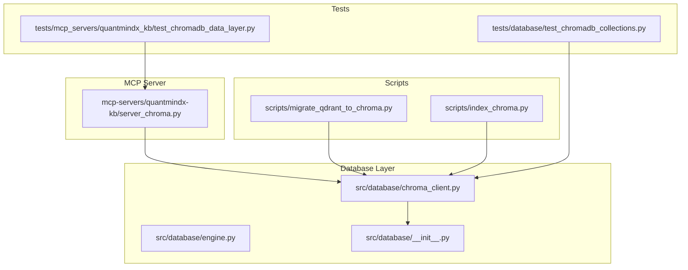
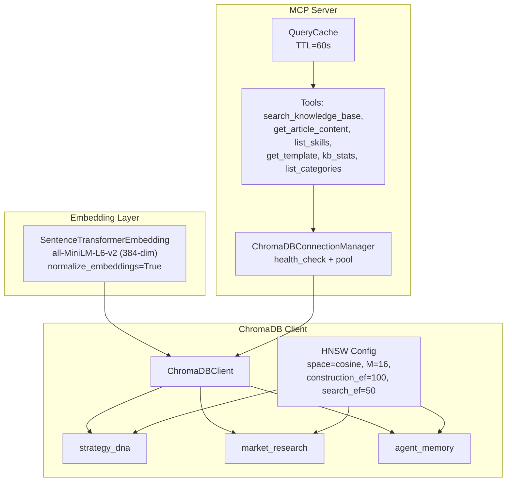
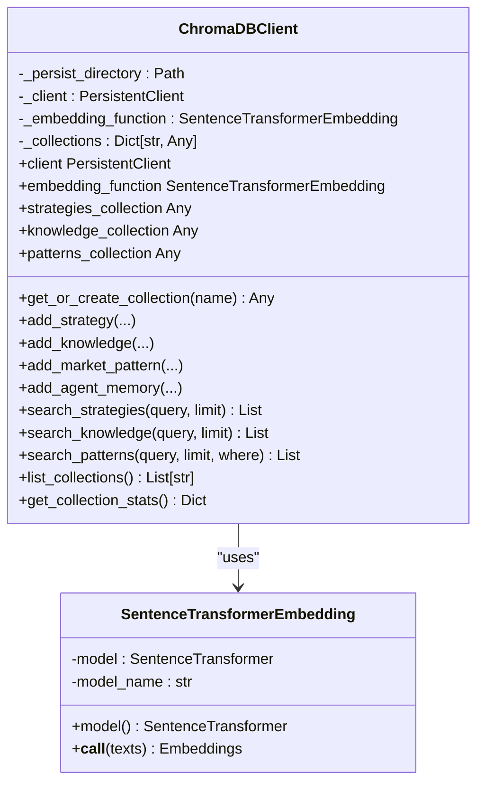
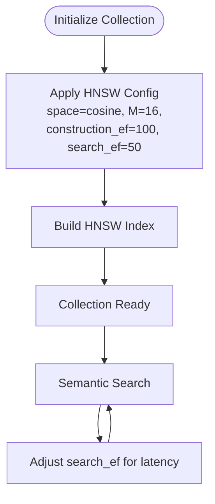
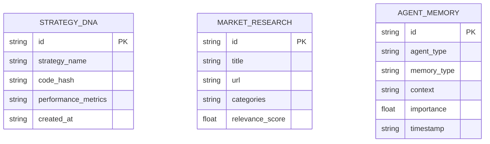
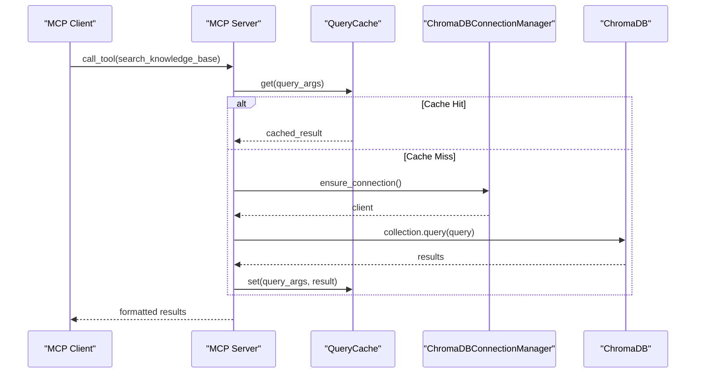
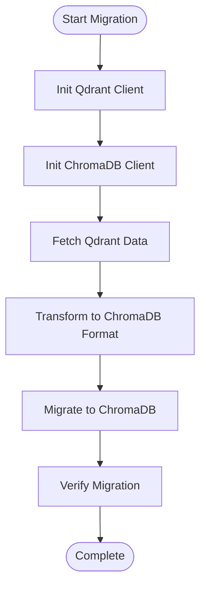
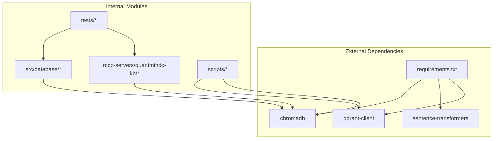

# Vector Database Integration

<cite>
**Referenced Files in This Document**
- [chroma_client.py](file://src/database/chroma_client.py)
- [server_chroma.py](file://mcp-servers/quantmindx-kb/server_chroma.py)
- [migrate_qdrant_to_chroma.py](file://scripts/migrate_qdrant_to_chroma.py)
- [index_chroma.py](file://scripts/index_chroma.py)
- [test_chromadb_collections.py](file://tests/database/test_chromadb_collections.py)
- [test_chromadb_data_layer.py](file://tests/mcp_servers/quantmindx_kb/test_chromadb_data_layer.py)
- [requirements.txt](file://requirements.txt)
- [engine.py](file://src/database/engine.py)
- [__init__.py](file://src/database/__init__.py)
</cite>

## Table of Contents
1. [Introduction](#introduction)
2. [Project Structure](#project-structure)
3. [Core Components](#core-components)
4. [Architecture Overview](#architecture-overview)
5. [Detailed Component Analysis](#detailed-component-analysis)
6. [Dependency Analysis](#dependency-analysis)
7. [Performance Considerations](#performance-considerations)
8. [Troubleshooting Guide](#troubleshooting-guide)
9. [Conclusion](#conclusion)

## Introduction
This document provides comprehensive coverage of the Vector Database Integration component in the QuantMindX project. It focuses on the ChromaDB client implementation using sentence-transformers all-MiniLM-L6-v2 for 384-dimensional embeddings with cosine similarity. The document explains the HNSW index configuration for efficient nearest neighbor search, details the three collection types (strategy_dna, market_research, agent_memory), and documents the embedding function architecture, lazy loading mechanism, and normalization for cosine similarity. Implementation details for collection management, metadata handling, and search operations are included, along with migration from Qdrant to ChromaDB, persistence configuration, and performance optimization strategies.

## Project Structure
The vector database integration spans several modules:
- Core ChromaDB client and embedding function
- MCP server for knowledge base search
- Migration scripts for data transfer
- Indexing utilities
- Tests validating collections, metadata, and search operations

**Diagram sources**
- [chroma_client.py](file://src/database/chroma_client.py#L1-L477)
- [server_chroma.py](file://mcp-servers/quantmindx-kb/server_chroma.py#L1-L1099)
- [migrate_qdrant_to_chroma.py](file://scripts/migrate_qdrant_to_chroma.py#L1-L303)
- [index_chroma.py](file://scripts/index_chroma.py#L1-L79)
- [test_chromadb_collections.py](file://tests/database/test_chromadb_collections.py#L1-L215)
- [test_chromadb_data_layer.py](file://tests/mcp_servers/quantmindx_kb/test_chromadb_data_layer.py#L1-L331)
- [engine.py](file://src/database/engine.py#L1-L68)
- [__init__.py](file://src/database/__init__.py#L1-L21)

**Section sources**
- [chroma_client.py](file://src/database/chroma_client.py#L1-L477)
- [server_chroma.py](file://mcp-servers/quantmindx-kb/server_chroma.py#L1-L1099)
- [migrate_qdrant_to_chroma.py](file://scripts/migrate_qdrant_to_chroma.py#L1-L303)
- [index_chroma.py](file://scripts/index_chroma.py#L1-L79)
- [test_chromadb_collections.py](file://tests/database/test_chromadb_collections.py#L1-L215)
- [test_chromadb_data_layer.py](file://tests/mcp_servers/quantmindx_kb/test_chromadb_data_layer.py#L1-L331)
- [engine.py](file://src/database/engine.py#L1-L68)
- [__init__.py](file://src/database/__init__.py#L1-L21)

## Core Components
- ChromaDB Client: Provides persistent vector storage with lazy-loaded embedding function and HNSW index configuration.
- Embedding Function: SentenceTransformerEmbedding using all-MiniLM-L6-v2 for 384-dimensional embeddings with cosine similarity normalization.
- Collections: Three primary collections for strategies, knowledge, and agent memory with metadata support.
- MCP Server: Implements semantic search over MQL5 articles with caching and connection pooling.
- Migration Scripts: Convert data from Qdrant to ChromaDB while preserving metadata.
- Indexing Utilities: Lightweight indexer for knowledge base documents.

**Section sources**
- [chroma_client.py](file://src/database/chroma_client.py#L32-L120)
- [chroma_client.py](file://src/database/chroma_client.py#L122-L156)
- [server_chroma.py](file://mcp-servers/quantmindx-kb/server_chroma.py#L280-L292)
- [migrate_qdrant_to_chroma.py](file://scripts/migrate_qdrant_to_chroma.py#L132-L168)
- [index_chroma.py](file://scripts/index_chroma.py#L23-L76)

## Architecture Overview
The vector database architecture integrates ChromaDB with sentence-transformers for semantic search. The ChromaDB client manages collections with HNSW indices configured for cosine similarity. The MCP server adds performance optimizations including connection pooling, health checks, and query result caching.

**Diagram sources**
- [chroma_client.py](file://src/database/chroma_client.py#L32-L120)
- [chroma_client.py](file://src/database/chroma_client.py#L87-L93)
- [server_chroma.py](file://mcp-servers/quantmindx-kb/server_chroma.py#L87-L140)
- [server_chroma.py](file://mcp-servers/quantmindx-kb/server_chroma.py#L147-L218)
- [server_chroma.py](file://mcp-servers/quantmindx-kb/server_chroma.py#L280-L292)

## Detailed Component Analysis

### ChromaDB Client and Embedding Function
The ChromaDB client encapsulates:
- Lazy-loaded embedding function using sentence-transformers all-MiniLM-L6-v2
- HNSW index configuration for cosine similarity with M=16, construction_ef=100, search_ef=50
- Singleton access pattern for global client reuse
- Three primary collections: strategy_dna, market_research, agent_memory

**Diagram sources**
- [chroma_client.py](file://src/database/chroma_client.py#L32-L74)
- [chroma_client.py](file://src/database/chroma_client.py#L76-L456)

Key implementation details:
- Embedding function lazy loads the model and normalizes embeddings for cosine similarity.
- HNSW configuration ensures optimal recall/speed balance with cosine space.
- Collections are created on-demand and cached for performance.
- Metadata is stored alongside documents for filtering and retrieval.

**Section sources**
- [chroma_client.py](file://src/database/chroma_client.py#L32-L74)
- [chroma_client.py](file://src/database/chroma_client.py#L76-L156)
- [chroma_client.py](file://src/database/chroma_client.py#L158-L297)
- [chroma_client.py](file://src/database/chroma_client.py#L299-L388)
- [chroma_client.py](file://src/database/chroma_client.py#L390-L416)

### HNSW Index Configuration
The HNSW index is configured for cosine similarity with:
- Space: cosine
- M: 16 (connections per node)
- Construction ef: 100
- Search ef: 50

These parameters balance recall and speed for semantic search. The configuration is applied when creating collections and can be tuned for latency vs. accuracy trade-offs.

**Diagram sources**
- [chroma_client.py](file://src/database/chroma_client.py#L87-L93)
- [server_chroma.py](file://mcp-servers/quantmindx-kb/server_chroma.py#L280-L286)

**Section sources**
- [chroma_client.py](file://src/database/chroma_client.py#L87-L93)
- [server_chroma.py](file://mcp-servers/quantmindx-kb/server_chroma.py#L280-L286)

### Collection Types and Metadata
Three primary collections serve distinct use cases:
- strategy_dna: Stores trading strategies with performance metrics and deduplication hashes
- market_research: Stores knowledge articles with categorization and relevance scores
- agent_memory: Stores multi-agent experiences with agent type, memory type, and importance

Each collection supports metadata filtering and retrieval, enabling targeted semantic search.

**Diagram sources**
- [chroma_client.py](file://src/database/chroma_client.py#L158-L190)
- [chroma_client.py](file://src/database/chroma_client.py#L192-L224)
- [chroma_client.py](file://src/database/chroma_client.py#L226-L297)

**Section sources**
- [chroma_client.py](file://src/database/chroma_client.py#L82-L85)
- [chroma_client.py](file://src/database/chroma_client.py#L158-L190)
- [chroma_client.py](file://src/database/chroma_client.py#L192-L224)
- [chroma_client.py](file://src/database/chroma_client.py#L226-L297)

### MCP Server Integration and Performance Optimizations
The MCP server enhances the ChromaDB client with:
- Connection pooling and health checks
- Query result caching with 60-second TTL
- Structured tool definitions for knowledge base operations
- Metadata extraction and filtering

**Diagram sources**
- [server_chroma.py](file://mcp-servers/quantmindx-kb/server_chroma.py#L147-L218)
- [server_chroma.py](file://mcp-servers/quantmindx-kb/server_chroma.py#L87-L140)
- [server_chroma.py](file://mcp-servers/quantmindx-kb/server_chroma.py#L636-L710)

**Section sources**
- [server_chroma.py](file://mcp-servers/quantmindx-kb/server_chroma.py#L87-L140)
- [server_chroma.py](file://mcp-servers/quantmindx-kb/server_chroma.py#L147-L218)
- [server_chroma.py](file://mcp-servers/quantmindx-kb/server_chroma.py#L636-L710)

### Migration from Qdrant to ChromaDB
The migration script converts existing Qdrant data to ChromaDB format:
- Connects to Qdrant and ChromaDB
- Extracts points with payload, metadata, and vectors
- Transforms to ChromaDB format (ids, documents, metadatas, embeddings)
- Migrates data with automatic embedding generation if vectors are missing

**Diagram sources**
- [migrate_qdrant_to_chroma.py](file://scripts/migrate_qdrant_to_chroma.py#L231-L303)
- [migrate_qdrant_to_chroma.py](file://scripts/migrate_qdrant_to_chroma.py#L82-L168)

**Section sources**
- [migrate_qdrant_to_chroma.py](file://scripts/migrate_qdrant_to_chroma.py#L1-L303)

### Persistence Configuration
Persistence is configured through:
- Project root path resolution for storage locations
- ChromaDB persistent client with path-based storage
- Data directory structure under data/chromadb/

**Section sources**
- [chroma_client.py](file://src/database/chroma_client.py#L27-L29)
- [chroma_client.py](file://src/database/chroma_client.py#L95-L107)
- [server_chroma.py](file://mcp-servers/quantmindx-kb/server_chroma.py#L74-L75)

## Dependency Analysis
External dependencies include ChromaDB, sentence-transformers, and qdrant-client for migration. The project maintains separate concerns between the database layer and MCP server.

**Diagram sources**
- [requirements.txt](file://requirements.txt#L8-L11)
- [chroma_client.py](file://src/database/chroma_client.py#L12-L21)
- [server_chroma.py](file://mcp-servers/quantmindx-kb/server_chroma.py#L67-L71)
- [migrate_qdrant_to_chroma.py](file://scripts/migrate_qdrant_to_chroma.py#L22-L37)

**Section sources**
- [requirements.txt](file://requirements.txt#L8-L11)
- [chroma_client.py](file://src/database/chroma_client.py#L12-L21)
- [server_chroma.py](file://mcp-servers/quantmindx-kb/server_chroma.py#L67-L71)
- [migrate_qdrant_to_chroma.py](file://scripts/migrate_qdrant_to_chroma.py#L22-L37)

## Performance Considerations
- HNSW configuration: M=16, construction_ef=100, search_ef=50 balances recall and speed for cosine similarity.
- Lazy loading: Embedding model is loaded on first use to reduce startup overhead.
- Connection pooling: MCP server maintains a single client instance with periodic health checks.
- Query caching: Results cached for 60 seconds to reduce repeated searches.
- Metadata filtering: Enables targeted queries reducing result set sizes.
- Batch indexing: Indexing utilities process documents in batches for efficiency.

[No sources needed since this section provides general guidance]

## Troubleshooting Guide
Common issues and resolutions:
- Missing dependencies: Ensure chromadb and sentence-transformers are installed.
- Model loading failures: Check model availability and network connectivity.
- Connection errors: Verify ChromaDB service is running and accessible.
- Permission errors: Confirm write access to data/chromadb directory.
- Migration failures: Validate Qdrant connectivity and data format.

**Section sources**
- [chroma_client.py](file://src/database/chroma_client.py#L12-L21)
- [server_chroma.py](file://mcp-servers/quantmindx-kb/server_chroma.py#L67-L71)
- [migrate_qdrant_to_chroma.py](file://scripts/migrate_qdrant_to_chroma.py#L242-L251)

## Conclusion
The Vector Database Integration provides a robust foundation for semantic search using ChromaDB and sentence-transformers. The implementation includes efficient HNSW indexing, lazy-loaded embeddings, and comprehensive collection management. The MCP server adds production-grade features like connection pooling, caching, and structured tooling. Migration tools facilitate transitions from Qdrant, while tests validate functionality across collections, metadata handling, and search operations.