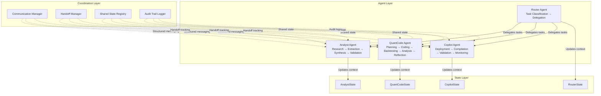
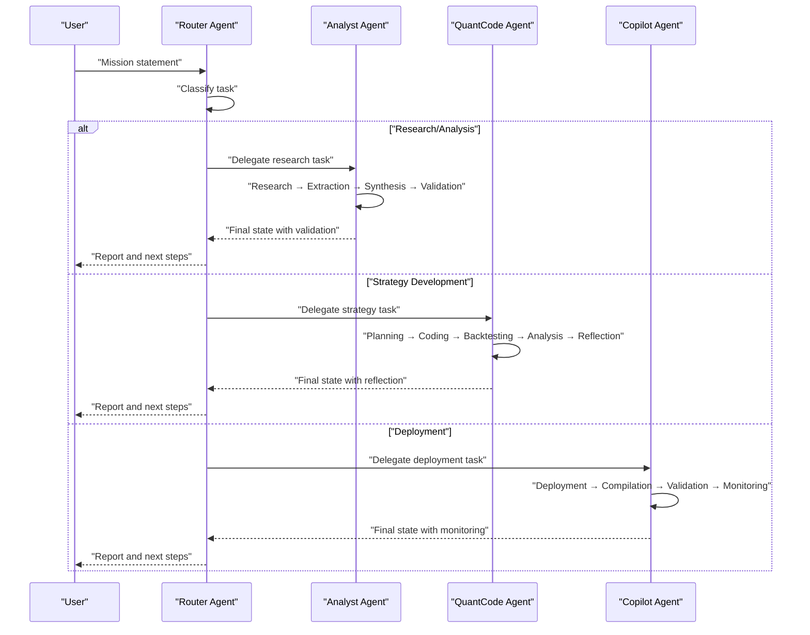
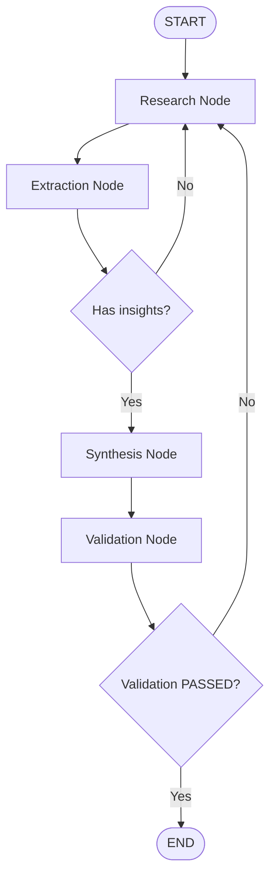
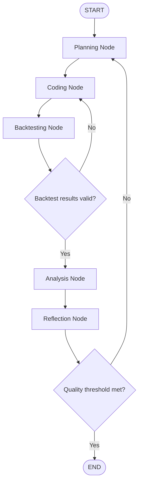
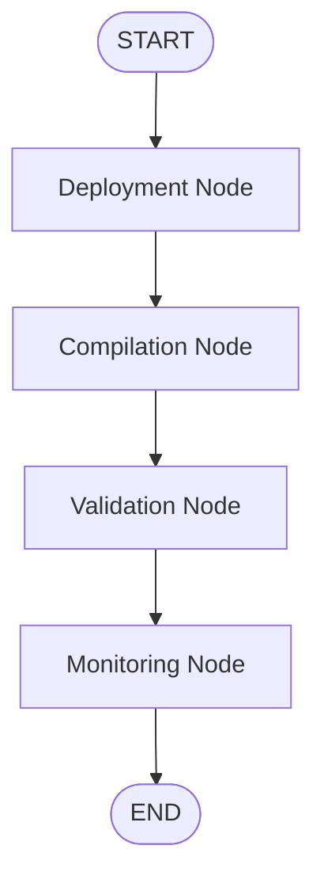
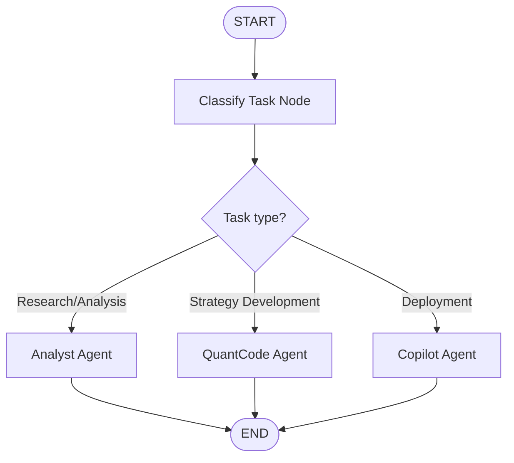
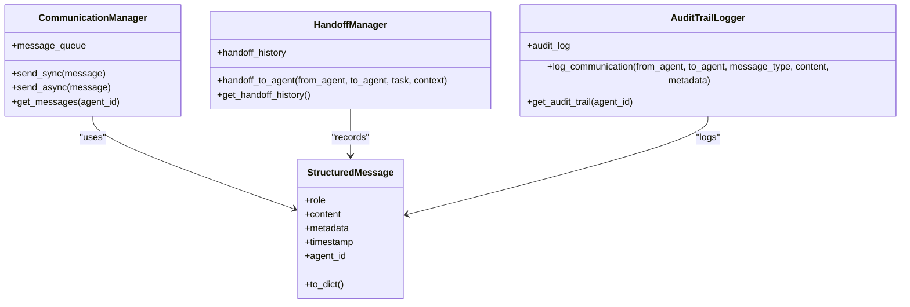
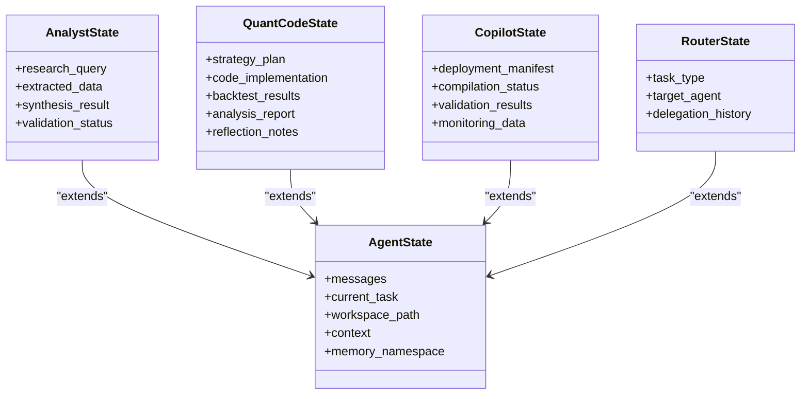
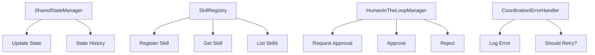
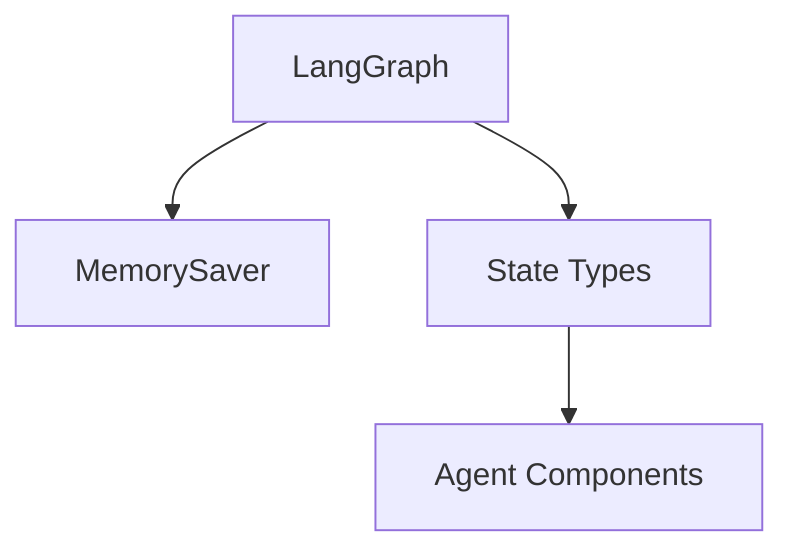

# Agent Architecture Overview

<cite>
**Referenced Files in This Document**
- [src/agents/__init__.py](file://src/agents/__init__.py)
- [src/agents/state.py](file://src/agents/state.py)
- [src/agents/analyst.py](file://src/agents/analyst.py)
- [src/agents/quantcode.py](file://src/agents/quantcode.py)
- [src/agents/copilot.py](file://src/agents/copilot.py)
- [src/agents/router.py](file://src/agents/router.py)
- [src/agents/coordination.py](file://src/agents/coordination.py)
- [langgraph.json](file://langgraph.json)
- [docs/trds/agent_framework_v1.md](file://docs/trds/agent_framework_v1.md)
- [docs/trds/quant_code_v1.md](file://docs/trds/quant_code_v1.md)
- [docs/trds/copilot_v1.md](file://docs/trds/copilot_v1.md)
</cite>

## Table of Contents
1. [Introduction](#introduction)
2. [Project Structure](#project-structure)
3. [Core Components](#core-components)
4. [Architecture Overview](#architecture-overview)
5. [Detailed Component Analysis](#detailed-component-analysis)
6. [Dependency Analysis](#dependency-analysis)
7. [Performance Considerations](#performance-considerations)
8. [Troubleshooting Guide](#troubleshooting-guide)
9. [Conclusion](#conclusion)

## Introduction
This document presents the Agent Architecture Overview for the QuantMindX tri-layer sentient architecture. It explains how the Analyst Agent, QuantCode Agent, and Copilot Agent collaborate through a LangGraph-based workflow to develop, validate, and deploy trading strategies. The framework emphasizes state-driven orchestration, inter-agent communication protocols, and a Trial & Reflection loop for continuous improvement. The architecture integrates a Router agent for intelligent task delegation and a coordination layer for shared state, skills, and audit trails.

## Project Structure
The agent system is organized around a layered design with clear separation of concerns:
- State layer: TypedDict-based state definitions for each agent
- Workflow layer: LangGraph StateGraph implementations per agent
- Coordination layer: Shared messaging, handoff, and audit systems
- Router layer: Task classification and delegation to specialized agents

**Diagram sources**
- [src/agents/router.py](file://src/agents/router.py#L161-L172)
- [src/agents/analyst.py](file://src/agents/analyst.py#L175-L218)
- [src/agents/quantcode.py](file://src/agents/quantcode.py#L194-L229)
- [src/agents/copilot.py](file://src/agents/copilot.py#L99-L114)
- [src/agents/state.py](file://src/agents/state.py#L14-L76)
- [src/agents/coordination.py](file://src/agents/coordination.py#L58-L105)

**Section sources**
- [src/agents/__init__.py](file://src/agents/__init__.py#L7-L66)
- [src/agents/state.py](file://src/agents/state.py#L14-L76)
- [src/agents/analyst.py](file://src/agents/analyst.py#L175-L218)
- [src/agents/quantcode.py](file://src/agents/quantcode.py#L194-L229)
- [src/agents/copilot.py](file://src/agents/copilot.py#L99-L114)
- [src/agents/router.py](file://src/agents/router.py#L161-L172)
- [src/agents/coordination.py](file://src/agents/coordination.py#L58-L105)

## Core Components
- Agent State Definitions: TypedDict-based state schemas define the shared and agent-specific fields persisted across workflow nodes.
- Analyst Agent: Implements a research → extraction → synthesis → validation workflow with conditional retries.
- QuantCode Agent: Implements a planning → coding → backtesting → analysis → reflection loop with quality gates and retry logic.
- Copilot Agent: Manages deployment, compilation, validation, and monitoring with a linear workflow.
- Router Agent: Classifies incoming tasks and delegates to the appropriate agent, supporting broker-specific deployment preparation.
- Coordination Layer: Provides structured messaging, handoff management, shared state, communication patterns, skill registry, human-in-the-loop approvals, error handling, and audit trails.

**Section sources**
- [src/agents/state.py](file://src/agents/state.py#L14-L76)
- [src/agents/analyst.py](file://src/agents/analyst.py#L24-L136)
- [src/agents/quantcode.py](file://src/agents/quantcode.py#L24-L162)
- [src/agents/copilot.py](file://src/agents/copilot.py#L21-L96)
- [src/agents/router.py](file://src/agents/router.py#L20-L95)
- [src/agents/coordination.py](file://src/agents/coordination.py#L22-L208)

## Architecture Overview
The tri-layer sentient architecture coordinates three specialized agents:
- Analyst Agent: Architectural design and TRD synthesis
- QuantCode Agent: Engineering implementation with Trial & Reflection
- Copilot Agent: Deployment and operational supervision

**Diagram sources**
- [src/agents/router.py](file://src/agents/router.py#L20-L95)
- [src/agents/analyst.py](file://src/agents/analyst.py#L24-L136)
- [src/agents/quantcode.py](file://src/agents/quantcode.py#L24-L162)
- [src/agents/copilot.py](file://src/agents/copilot.py#L21-L96)

## Detailed Component Analysis

### Analyst Agent Workflow
The Analyst Agent follows a four-stage workflow with conditional edges for error handling and retries:
- Research: Gathers market data and information
- Extraction: Extracts key insights from research data
- Synthesis: Creates an actionable analysis report
- Validation: Ensures quality and completeness

**Diagram sources**
- [src/agents/analyst.py](file://src/agents/analyst.py#L143-L168)
- [src/agents/analyst.py](file://src/agents/analyst.py#L175-L218)

**Section sources**
- [src/agents/analyst.py](file://src/agents/analyst.py#L24-L136)
- [src/agents/state.py](file://src/agents/state.py#L30-L39)

### QuantCode Agent Workflow
The QuantCode Agent implements a Trial & Reflection loop:
- Planning: Creates a strategy development plan
- Coding: Implements strategy logic
- Backtesting: Runs strategy backtests
- Analysis: Analyzes backtest results
- Reflection: Reviews performance and improvement areas

**Diagram sources**
- [src/agents/quantcode.py](file://src/agents/quantcode.py#L169-L187)
- [src/agents/quantcode.py](file://src/agents/quantcode.py#L194-L229)

**Section sources**
- [src/agents/quantcode.py](file://src/agents/quantcode.py#L24-L162)
- [src/agents/state.py](file://src/agents/state.py#L42-L52)
- [docs/trds/quant_code_v1.md](file://docs/trds/quant_code_v1.md#L15-L24)

### Copilot Agent Workflow
The Copilot Agent manages deployment lifecycle:
- Deployment: Creates deployment manifest
- Compilation: Compiles the Expert Advisor
- Validation: Validates deployment readiness
- Monitoring: Tracks operational performance

**Diagram sources**
- [src/agents/copilot.py](file://src/agents/copilot.py#L99-L114)

**Section sources**
- [src/agents/copilot.py](file://src/agents/copilot.py#L21-L96)
- [src/agents/state.py](file://src/agents/state.py#L55-L64)
- [docs/trds/copilot_v1.md](file://docs/trds/copilot_v1.md#L41-L55)

### Router Agent and Task Delegation
The Router Agent classifies tasks and delegates to the appropriate agent, with support for broker-specific deployment preparation:
- Classify: Determines task type and target agent
- Delegate: Prepares deployment configuration when needed

**Diagram sources**
- [src/agents/router.py](file://src/agents/router.py#L20-L63)
- [src/agents/router.py](file://src/agents/router.py#L161-L172)

**Section sources**
- [src/agents/router.py](file://src/agents/router.py#L20-L95)
- [src/agents/state.py](file://src/agents/state.py#L67-L75)

### Inter-Agent Communication Protocols
Inter-agent communication is standardized through:
- StructuredMessage: Envelope with role, content, metadata, timestamp, and agent identifier
- CommunicationManager: Synchronous and asynchronous message sending with queue management
- HandoffManager: Records task handoffs with timestamps and status
- AuditTrailLogger: Logs inter-agent communications for compliance and debugging

**Diagram sources**
- [src/agents/coordination.py](file://src/agents/coordination.py#L22-L51)
- [src/agents/coordination.py](file://src/agents/coordination.py#L177-L208)
- [src/agents/coordination.py](file://src/agents/coordination.py#L58-L104)
- [src/agents/coordination.py](file://src/agents/coordination.py#L360-L402)

**Section sources**
- [src/agents/coordination.py](file://src/agents/coordination.py#L22-L208)
- [src/agents/coordination.py](file://src/agents/coordination.py#L360-L402)

### State Management System
State management is implemented via TypedDict schemas with message accumulation and agent-specific fields:
- AgentState: Base schema with messages, current_task, workspace_path, context, memory_namespace
- AnalystState: Research query, extracted data, synthesis result, validation status
- QuantCodeState: Strategy plan, code implementation, backtest results, analysis report, reflection notes
- CopilotState: Deployment manifest, compilation status, validation results, monitoring data
- RouterState: Task type, target agent, delegation history

**Diagram sources**
- [src/agents/state.py](file://src/agents/state.py#L14-L76)

**Section sources**
- [src/agents/state.py](file://src/agents/state.py#L14-L76)

### Skill Orchestration and Shared Resources
The coordination layer provides:
- SharedStateManager: Centralized state updates with history tracking
- SkillRegistry: Skills registration and lookup for cross-agent capability sharing
- HumanInTheLoopManager: Approval requests and resolutions for critical actions
- CoordinationErrorHandler: Error logging and retry decisions

**Diagram sources**
- [src/agents/coordination.py](file://src/agents/coordination.py#L140-L171)
- [src/agents/coordination.py](file://src/agents/coordination.py#L214-L248)
- [src/agents/coordination.py](file://src/agents/coordination.py#L254-L308)
- [src/agents/coordination.py](file://src/agents/coordination.py#L314-L354)

**Section sources**
- [src/agents/coordination.py](file://src/agents/coordination.py#L140-L171)
- [src/agents/coordination.py](file://src/agents/coordination.py#L214-L248)
- [src/agents/coordination.py](file://src/agents/coordination.py#L254-L308)
- [src/agents/coordination.py](file://src/agents/coordination.py#L314-L354)

## Dependency Analysis
The agent framework relies on LangGraph for workflow orchestration and a set of coordination utilities for inter-agent communication and state management.

**Diagram sources**
- [src/agents/analyst.py](file://src/agents/analyst.py#L232-L242)
- [src/agents/quantcode.py](file://src/agents/quantcode.py#L232-L243)
- [src/agents/copilot.py](file://src/agents/copilot.py#L117-L127)
- [src/agents/router.py](file://src/agents/router.py#L175-L185)

**Section sources**
- [src/agents/analyst.py](file://src/agents/analyst.py#L232-L242)
- [src/agents/quantcode.py](file://src/agents/quantcode.py#L232-L243)
- [src/agents/copilot.py](file://src/agents/copilot.py#L117-L127)
- [src/agents/router.py](file://src/agents/router.py#L175-L185)
- [langgraph.json](file://langgraph.json#L5-L10)

## Performance Considerations
- Workflow state persistence: MemorySaver checkpointing enables recovery and reduces recomputation
- Conditional routing: Early termination on validation failures minimizes unnecessary computation
- Retry thresholds: CoordinationErrorHandler limits retries to prevent cascading failures
- Asynchronous messaging: CommunicationManager supports non-blocking message delivery for scalability

[No sources needed since this section provides general guidance]

## Troubleshooting Guide
Common issues and resolutions:
- Workflow stuck in retry loop: Validate conditional edge logic and ensure state updates propagate correctly
- Missing broker connectivity: Router Agent prepares deployment configuration and reports availability status
- Audit trail discrepancies: Use AuditTrailLogger to trace inter-agent communications and identify misconfigurations
- State corruption: Verify TypedDict schemas and message accumulation annotations

**Section sources**
- [src/agents/analyst.py](file://src/agents/analyst.py#L143-L168)
- [src/agents/quantcode.py](file://src/agents/quantcode.py#L169-L187)
- [src/agents/router.py](file://src/agents/router.py#L98-L158)
- [src/agents/coordination.py](file://src/agents/coordination.py#L360-L402)

## Conclusion
The QuantMindX tri-layer sentient architecture integrates Analyst, QuantCode, and Copilot agents through a robust LangGraph-based workflow system. The Router agent intelligently delegates tasks, while the coordination layer ensures reliable inter-agent communication, shared state management, and auditability. The QuantCode agent’s Trial & Reflection loop guarantees iterative improvement, and the Copilot Agent provides end-to-end deployment supervision. Together, these components form a scalable, maintainable, and extensible framework for autonomous trading strategy development.