# Agent Workflows and Coordination

<cite>
**Referenced Files in This Document**
- [analyst.py](file://src/agents/analyst.py)
- [quantcode.py](file://src/agents/quantcode.py)
- [copilot.py](file://src/agents/copilot.py)
- [coordination.py](file://src/agents/coordination.py)
- [state.py](file://src/agents/state.py)
- [router.py](file://src/agents/router.py)
- [agent_framework_v1.md](file://docs/trds/agent_framework_v1.md)
- [analyst_agent_v1.md](file://docs/trds/analyst_agent_v1.md)
- [quant_code_v1.md](file://docs/trds/quant_code_v1.md)
- [copilot_v1.md](file://docs/trds/copilot_v1.md)
- [strategy_router_v1.md](file://docs/trds/strategy_router_v1.md)
</cite>

## Table of Contents
1. [Introduction](#introduction)
2. [Project Structure](#project-structure)
3. [Core Components](#core-components)
4. [Architecture Overview](#architecture-overview)
5. [Detailed Component Analysis](#detailed-component-analysis)
6. [Dependency Analysis](#dependency-analysis)
7. [Performance Considerations](#performance-considerations)
8. [Troubleshooting Guide](#troubleshooting-guide)
9. [Conclusion](#conclusion)
10. [Appendices](#appendices)

## Introduction
This document explains the Agent Workflows and Coordination system for the QuantMindX platform, focusing on how the Analyst, QuantCode, and Copilot agents collaborate to design, implement, and deploy trading strategies. It covers workflow orchestration patterns, inter-agent communication protocols, skill management, task delegation, and the Trial & Reflection loop. It also documents state management, conditional edges, and auditability to ensure reliable, traceable, and extensible agent collaboration.

## Project Structure
The agent subsystem centers on LangGraph-based state machines with shared state and structured messaging. The Router classifies tasks and delegates to specialized agents. Each agent exposes a StateGraph workflow with deterministic nodes and conditional edges for retries and validation.

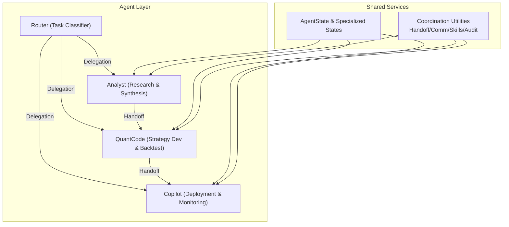

**Diagram sources**
- [router.py](file://src/agents/router.py#L161-L172)
- [analyst.py](file://src/agents/analyst.py#L175-L218)
- [quantcode.py](file://src/agents/quantcode.py#L194-L229)
- [copilot.py](file://src/agents/copilot.py#L99-L114)
- [state.py](file://src/agents/state.py#L14-L76)
- [coordination.py](file://src/agents/coordination.py#L58-L208)

**Section sources**
- [router.py](file://src/agents/router.py#L1-L212)
- [analyst.py](file://src/agents/analyst.py#L1-L288)
- [quantcode.py](file://src/agents/quantcode.py#L1-L276)
- [copilot.py](file://src/agents/copilot.py#L1-L155)
- [state.py](file://src/agents/state.py#L1-L76)
- [coordination.py](file://src/agents/coordination.py#L1-L403)

## Core Components
- Router: Classifies tasks and delegates to Analyst, QuantCode, or Copilot. Supports broker-aware deployment preparation.
- Analyst: Market research → extraction → synthesis → validation workflow with conditional retries.
- QuantCode: Planning → coding → backtesting → analysis → reflection loop with quality gating.
- Copilot: Deployment manifest → compilation → validation → monitoring workflow.
- Shared State: TypedDict-based state with message accumulation and agent-specific fields.
- Coordination Utilities: Structured messaging, handoff manager, shared state manager, communication manager, skill registry, human-in-the-loop, error handling, and audit trail.

**Section sources**
- [router.py](file://src/agents/router.py#L20-L96)
- [analyst.py](file://src/agents/analyst.py#L24-L136)
- [quantcode.py](file://src/agents/quantcode.py#L24-L162)
- [copilot.py](file://src/agents/copilot.py#L21-L96)
- [state.py](file://src/agents/state.py#L14-L76)
- [coordination.py](file://src/agents/coordination.py#L30-L208)

## Architecture Overview
The system implements a hierarchical orchestration pattern:
- Router ingests high-level goals and classifies tasks.
- Analyst produces TRDs and other synthesis artifacts.
- QuantCode implements and validates strategies.
- Copilot deploys and monitors executions.
- Coordination utilities enable structured handoffs, shared state, and auditability.

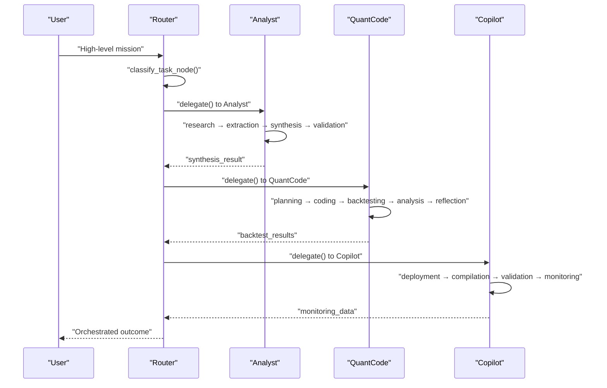

**Diagram sources**
- [router.py](file://src/agents/router.py#L161-L172)
- [analyst.py](file://src/agents/analyst.py#L175-L218)
- [quantcode.py](file://src/agents/quantcode.py#L194-L229)
- [copilot.py](file://src/agents/copilot.py#L99-L114)

## Detailed Component Analysis

### Analyst Agent Workflow
The Analyst agent follows a four-stage workflow:
- Research: Gather market data and information.
- Extraction: Extract key insights.
- Synthesis: Produce an analysis report.
- Validation: Ensure completeness and quality.

Conditional edges enable retries on failure:
- If extraction lacks key insights, loop back to research.
- If validation fails, loop back to research.

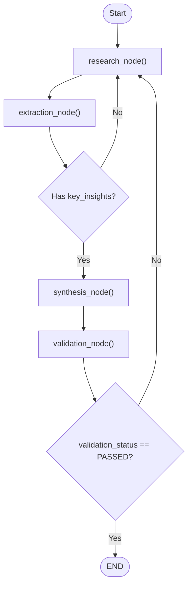

**Diagram sources**
- [analyst.py](file://src/agents/analyst.py#L143-L168)
- [analyst.py](file://src/agents/analyst.py#L175-L218)

**Section sources**
- [analyst.py](file://src/agents/analyst.py#L24-L136)
- [state.py](file://src/agents/state.py#L30-L40)

### QuantCode Agent Workflow
The QuantCode agent implements a Trial & Reflection loop:
- Planning: Build strategy plan.
- Coding: Implement strategy logic.
- Backtesting: Evaluate performance metrics.
- Analysis: Summarize results.
- Reflection: Suggest improvements.

Quality gates:
- If backtesting yields no trades, loop back to coding.
- If Kelly score threshold is not met, loop back to planning.

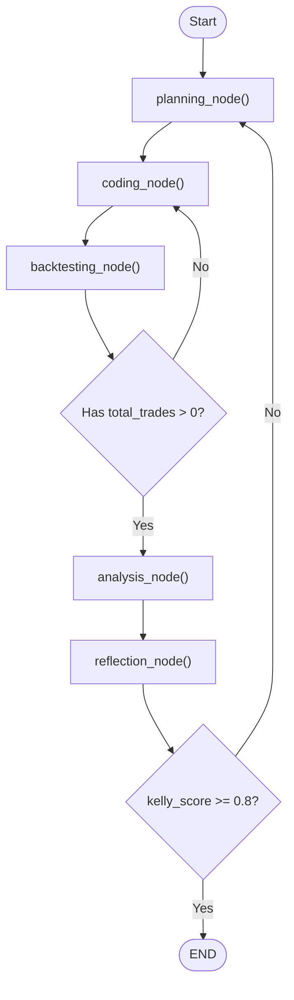

**Diagram sources**
- [quantcode.py](file://src/agents/quantcode.py#L169-L187)
- [quantcode.py](file://src/agents/quantcode.py#L194-L229)

**Section sources**
- [quantcode.py](file://src/agents/quantcode.py#L24-L162)
- [state.py](file://src/agents/state.py#L42-L53)

### Copilot Agent Workflow
The Copilot orchestrates deployment and monitoring:
- Deployment: Create EA deployment manifest.
- Compilation: Compile MQL5 EA.
- Validation: Validate deployment readiness.
- Monitoring: Track EA performance.

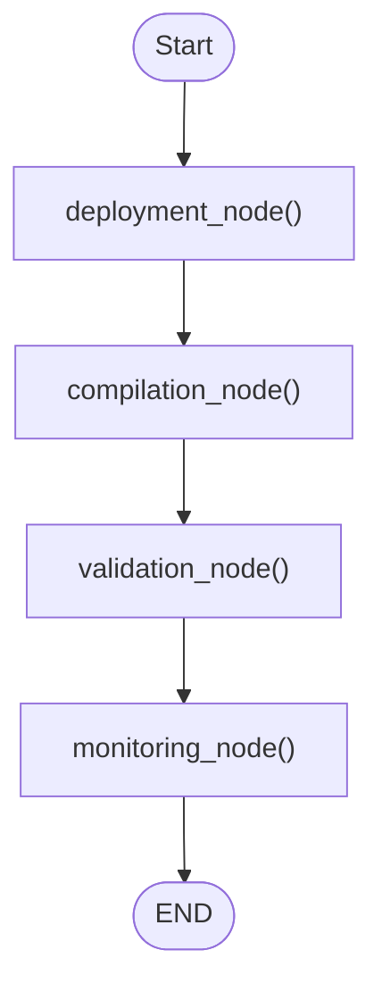

**Diagram sources**
- [copilot.py](file://src/agents/copilot.py#L99-L114)

**Section sources**
- [copilot.py](file://src/agents/copilot.py#L21-L96)
- [state.py](file://src/agents/state.py#L55-L65)

### Router and Task Delegation
The Router performs keyword-based classification and prepares deployment configurations when needed. It records delegation history and attaches broker type metadata.

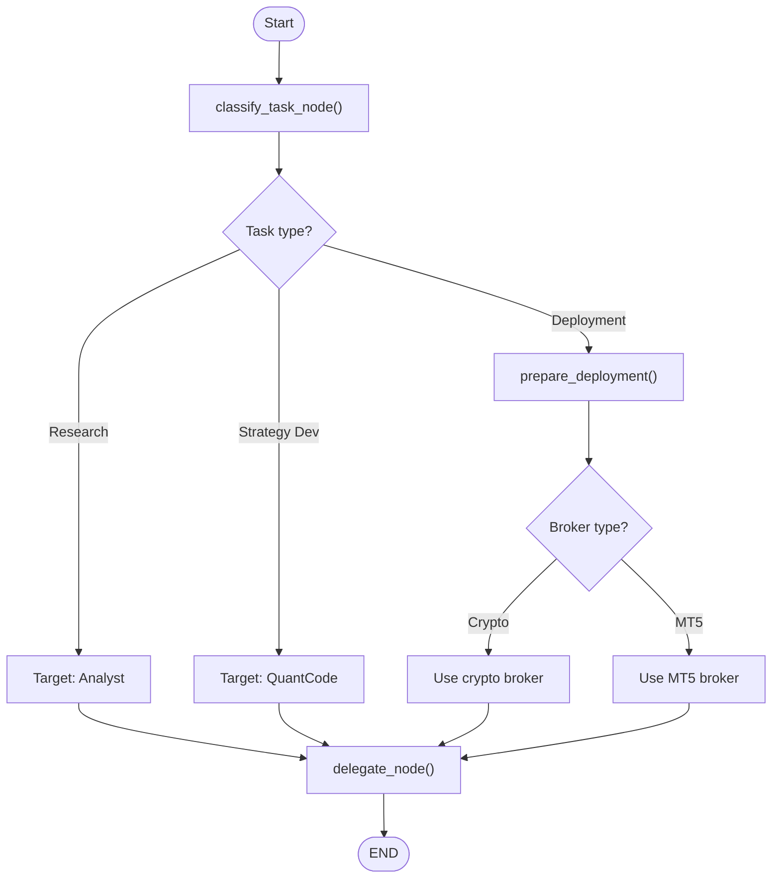

**Diagram sources**
- [router.py](file://src/agents/router.py#L20-L63)
- [router.py](file://src/agents/router.py#L98-L158)
- [router.py](file://src/agents/router.py#L161-L172)

**Section sources**
- [router.py](file://src/agents/router.py#L20-L96)
- [state.py](file://src/agents/state.py#L67-L76)

### Inter-Agent Communication Protocols and Handoffs
Structured messaging and handoff patterns ensure traceability and reliability:
- StructuredMessage defines role, content, metadata, timestamp, and agent_id.
- HandoffManager tracks transitions and context across agents.
- SharedStateManager centralizes cross-agent state updates with history.
- CommunicationManager supports synchronous and asynchronous messaging.
- AuditTrailLogger captures inter-agent communications for compliance.

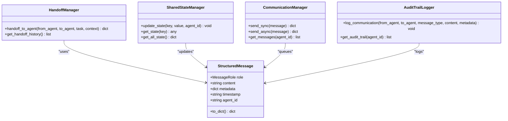

**Diagram sources**
- [coordination.py](file://src/agents/coordination.py#L30-L51)
- [coordination.py](file://src/agents/coordination.py#L58-L104)
- [coordination.py](file://src/agents/coordination.py#L140-L171)
- [coordination.py](file://src/agents/coordination.py#L177-L208)
- [coordination.py](file://src/agents/coordination.py#L360-L403)

**Section sources**
- [coordination.py](file://src/agents/coordination.py#L30-L208)
- [coordination.py](file://src/agents/coordination.py#L360-L403)

### Skill Management and Knowledge Sharing
The skill registry enables agents to share capabilities:
- SkillRegistry stores skills with function references, agent ownership, and metadata.
- Skills can be invoked by name and accessed across agents for reuse.

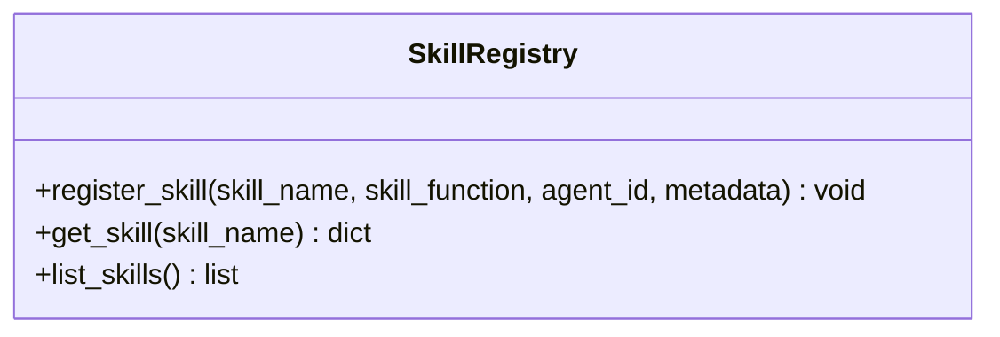

**Diagram sources**
- [coordination.py](file://src/agents/coordination.py#L214-L248)

**Section sources**
- [coordination.py](file://src/agents/coordination.py#L214-L248)

### Human-in-the-Loop Integration
Human approvals gate critical actions:
- HumanInTheLoopManager tracks pending approvals and supports approval/rejection.
- Used during handoffs requiring oversight.

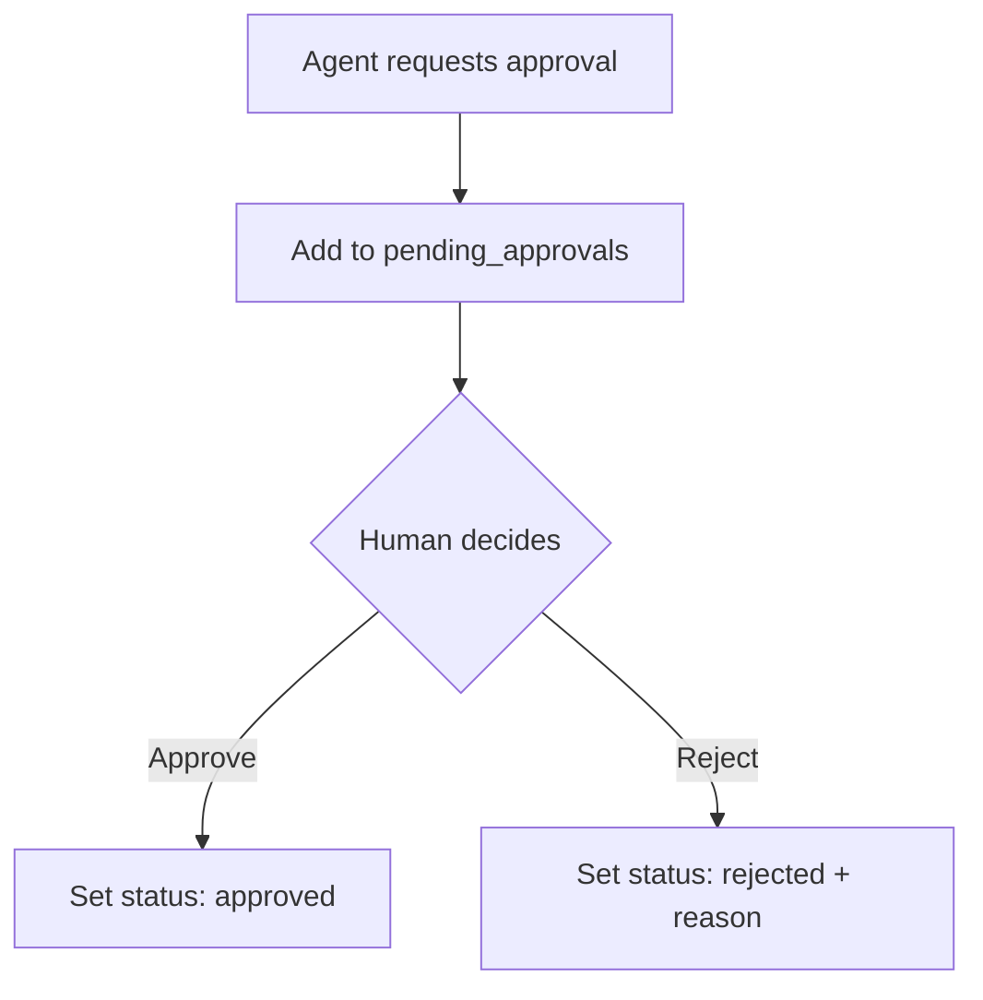

**Diagram sources**
- [coordination.py](file://src/agents/coordination.py#L254-L308)

**Section sources**
- [coordination.py](file://src/agents/coordination.py#L254-L308)

### Error Handling and Retry Strategies
CoordinationErrorHandler centralizes error logging and retry decisions:
- Logs errors with agent, type, message, and context.
- Determines whether to retry based on recent error counts.

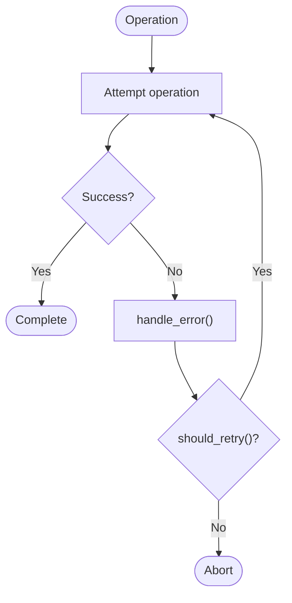

**Diagram sources**
- [coordination.py](file://src/agents/coordination.py#L314-L354)

**Section sources**
- [coordination.py](file://src/agents/coordination.py#L314-L354)

### State Transition Patterns and Persistence
AgentState accumulates messages and carries agent-specific context. Specialized states extend base fields for each agent’s workflow.

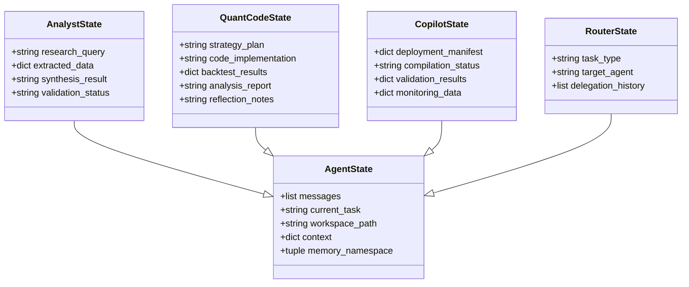

**Diagram sources**
- [state.py](file://src/agents/state.py#L14-L76)

**Section sources**
- [state.py](file://src/agents/state.py#L14-L76)

### Collaborative Decision-Making and Conflict Resolution
- Router resolves ambiguity by defaulting to Analyst and classifying by keywords.
- Broker-aware deployment preparation selects appropriate broker adapters.
- SharedStateManager and AuditTrailLogger provide transparency for conflict resolution and governance.

**Section sources**
- [router.py](file://src/agents/router.py#L20-L63)
- [router.py](file://src/agents/router.py#L98-L158)
- [coordination.py](file://src/agents/coordination.py#L140-L171)
- [coordination.py](file://src/agents/coordination.py#L360-L403)

### Resource Allocation Strategies
- Router’s delegation history and broker metadata inform downstream resource selection.
- Copilot’s validation ensures deployment readiness before monitoring.

**Section sources**
- [router.py](file://src/agents/router.py#L47-L63)
- [copilot.py](file://src/agents/copilot.py#L58-L75)

### Trial & Reflection Loop Patterns
QuantCode’s loop integrates trial runs with reflection-driven improvements:
- Backtesting yields metrics; reflection suggests enhancements.
- Quality gates enforce minimum thresholds before completion.

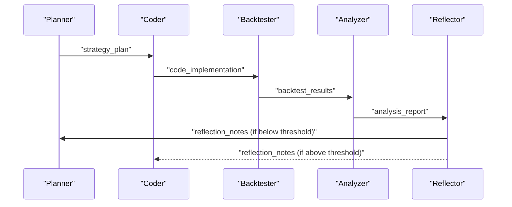

**Diagram sources**
- [quantcode.py](file://src/agents/quantcode.py#L24-L162)

**Section sources**
- [quantcode.py](file://src/agents/quantcode.py#L77-L162)

## Dependency Analysis
The agents depend on shared state and coordination utilities. Router depends on broker registry for deployment preparation.

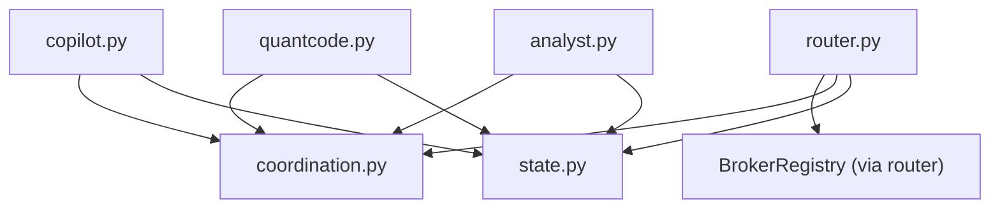

**Diagram sources**
- [router.py](file://src/agents/router.py#L110-L128)
- [state.py](file://src/agents/state.py#L14-L76)
- [coordination.py](file://src/agents/coordination.py#L58-L208)

**Section sources**
- [router.py](file://src/agents/router.py#L98-L158)
- [analyst.py](file://src/agents/analyst.py#L1-L288)
- [quantcode.py](file://src/agents/quantcode.py#L1-L276)
- [copilot.py](file://src/agents/copilot.py#L1-L155)
- [coordination.py](file://src/agents/coordination.py#L1-L403)

## Performance Considerations
- Use conditional edges to avoid unnecessary recomputation and to short-circuit failed branches.
- Persist state with MemorySaver to minimize repeated work across agent transitions.
- Asynchronous messaging can decouple agents for improved throughput.
- Keep message sizes reasonable; use metadata for auxiliary context.
- Employ audit trails selectively to balance observability and overhead.

## Troubleshooting Guide
Common issues and resolutions:
- Validation failures in Analyst: Inspect extraction completeness; ensure research is rerun when key insights are missing.
- Backtesting failures in QuantCode: Verify coding correctness; iterate until backtesting yields positive trade counts.
- Quality thresholds not met: Adjust strategy plan or refine indicators before re-running reflection.
- Broker unavailability: Router’s deployment preparation surfaces connection errors; select alternate broker or resolve connectivity.
- Coordination errors: Use CoordinationErrorHandler to inspect recent errors and decide on retries.

**Section sources**
- [analyst.py](file://src/agents/analyst.py#L111-L136)
- [analyst.py](file://src/agents/analyst.py#L143-L168)
- [quantcode.py](file://src/agents/quantcode.py#L169-L187)
- [router.py](file://src/agents/router.py#L139-L158)
- [coordination.py](file://src/agents/coordination.py#L314-L354)

## Conclusion
The QuantMindX agent ecosystem combines LangGraph-based workflows with shared state and robust coordination utilities. The Router classifies and delegates tasks, the Analyst synthesizes requirements, QuantCode implements and validates strategies, and Copilot manages deployment and monitoring. Structured messaging, handoffs, shared state, and auditability ensure traceability and reliability. The Trial & Reflection loop and quality gates drive continuous improvement, while error handling and retry strategies provide resilience.

## Appendices

### Reference Materials
- Agent Framework Vision and Directory Layout: [agent_framework_v1.md](file://docs/trds/agent_framework_v1.md#L37-L87)
- Analyst Agent TRD: [analyst_agent_v1.md](file://docs/trds/analyst_agent_v1.md#L1-L67)
- QuantCode Agent TRD: [quant_code_v1.md](file://docs/trds/quant_code_v1.md#L1-L54)
- Copilot TRD: [copilot_v1.md](file://docs/trds/copilot_v1.md#L1-L72)
- Strategy Router TRD: [strategy_router_v1.md](file://docs/trds/strategy_router_v1.md#L1-L236)