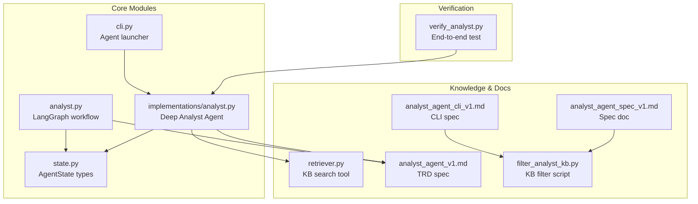
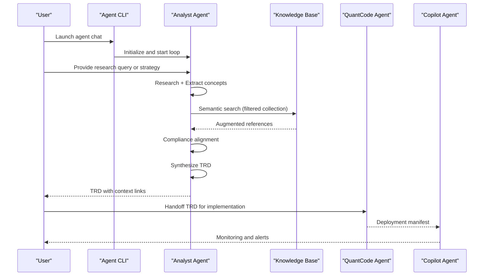
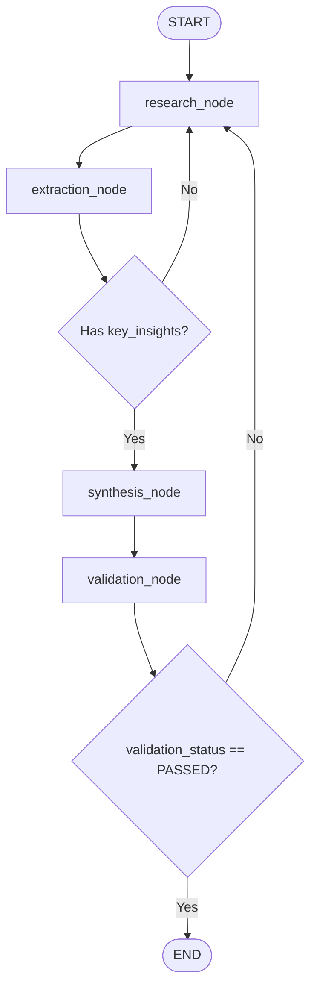
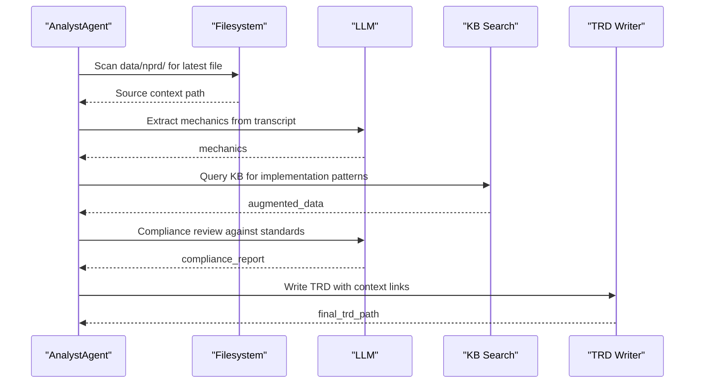
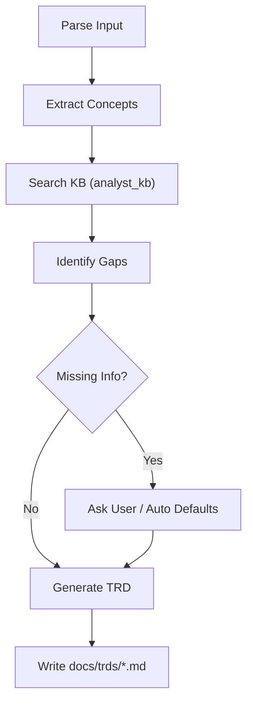
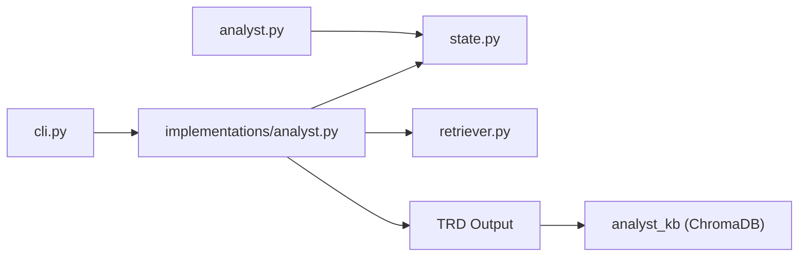

# Analyst Agent

<cite>
**Referenced Files in This Document**
- [analyst.py](file://src/agents/analyst.py)
- [implementations/analyst.py](file://src/agents/implementations/analyst.py)
- [state.py](file://src/agents/state.py)
- [cli.py](file://src/agents/cli.py)
- [retriever.py](file://src/agents/knowledge/retriever.py)
- [analyst_agent_v1.md](file://docs/trds/analyst_agent_v1.md)
- [analyst_agent_cli_v1.md](file://docs/trds/analyst_agent_cli_v1.md)
- [analyst_agent_spec_v1.md](file://docs/specs/analyst_agent_spec_v1.md)
- [filter_analyst_kb.py](file://scripts/filter_analyst_kb.py)
- [verify_analyst.py](file://verify_analyst.py)
</cite>

## Table of Contents
1. [Introduction](#introduction)
2. [Project Structure](#project-structure)
3. [Core Components](#core-components)
4. [Architecture Overview](#architecture-overview)
5. [Detailed Component Analysis](#detailed-component-analysis)
6. [Dependency Analysis](#dependency-analysis)
7. [Performance Considerations](#performance-considerations)
8. [Troubleshooting Guide](#troubleshooting-guide)
9. [Conclusion](#conclusion)
10. [Appendices](#appendices)

## Introduction
The Analyst Agent is the “Strategy Architect” of the QuantMindX ecosystem. It transforms unstructured trading content (NPRD transcripts, articles) into high-precision Technical Requirements Documents (TRDs) for downstream implementation by the QuantCode Agent. The Agent integrates market research, knowledge augmentation, and ecosystem alignment into a structured workflow, ensuring strategies adhere to standardized templates and technical requirements. It collaborates with other agents—particularly QuantCode and Copilot—by coordinating handoffs, validating TRD readiness, and maintaining traceability through context headers and source links.

## Project Structure
The Analyst Agent spans two complementary implementations:
- A LangGraph-based workflow for research, extraction, synthesis, and validation
- A CLI-driven pipeline for ingestion, concept extraction, knowledge base search, gap identification, and TRD generation

**Diagram sources**
- [analyst.py](file://src/agents/analyst.py#L175-L242)
- [implementations/analyst.py](file://src/agents/implementations/analyst.py#L19-L44)
- [state.py](file://src/agents/state.py#L30-L40)
- [cli.py](file://src/agents/cli.py#L12-L16)
- [retriever.py](file://src/agents/knowledge/retriever.py#L14-L25)
- [analyst_agent_v1.md](file://docs/trds/analyst_agent_v1.md#L1-L67)
- [analyst_agent_cli_v1.md](file://docs/trds/analyst_agent_cli_v1.md#L1-L120)
- [analyst_agent_spec_v1.md](file://docs/specs/analyst_agent_spec_v1.md#L1-L120)
- [filter_analyst_kb.py](file://scripts/filter_analyst_kb.py#L60-L173)
- [verify_analyst.py](file://verify_analyst.py#L7-L28)

**Section sources**
- [analyst.py](file://src/agents/analyst.py#L1-L288)
- [implementations/analyst.py](file://src/agents/implementations/analyst.py#L1-L134)
- [state.py](file://src/agents/state.py#L1-L76)
- [cli.py](file://src/agents/cli.py#L1-L58)
- [analyst_agent_v1.md](file://docs/trds/analyst_agent_v1.md#L1-L67)
- [analyst_agent_cli_v1.md](file://docs/trds/analyst_agent_cli_v1.md#L1-L120)
- [analyst_agent_spec_v1.md](file://docs/specs/analyst_agent_spec_v1.md#L1-L120)
- [filter_analyst_kb.py](file://scripts/filter_analyst_kb.py#L1-L186)
- [verify_analyst.py](file://verify_analyst.py#L1-L31)

## Core Components
- LangGraph Research Workflow (analyst.py): Implements a four-stage pipeline: research, extraction, synthesis, and validation, with conditional edges for retries and quality checks.
- Deep Analyst Agent (implementations/analyst.py): A specialized synthesis graph that ingests NPRD content, augments with KB, aligns to ecosystem standards, and produces TRDs.
- State Types (state.py): Defines typed state structures for agents, including AnalystState with research_query, extracted_data, synthesis_result, and validation_status.
- CLI Launcher (cli.py): Provides a unified entry point to launch agents (analyst, quantcode, copilot) in interactive chat mode.
- Knowledge Retrieval Tool (retriever.py): A standardized tool for semantic search across collections (placeholder for ChromaDB in V1).
- TRD Specs (analyst_agent_v1.md, analyst_agent_cli_v1.md, analyst_agent_spec_v1.md): Define TRD structure, ecosystem alignment, and CLI workflow.
- KB Filter Script (filter_analyst_kb.py): Creates a curated analyst_kb collection from the main knowledge base.
- Verification (verify_analyst.py): End-to-end test that triggers the Deep Analyst Agent and validates TRD generation.

**Section sources**
- [analyst.py](file://src/agents/analyst.py#L24-L136)
- [implementations/analyst.py](file://src/agents/implementations/analyst.py#L19-L122)
- [state.py](file://src/agents/state.py#L30-L40)
- [cli.py](file://src/agents/cli.py#L12-L54)
- [retriever.py](file://src/agents/knowledge/retriever.py#L14-L25)
- [analyst_agent_v1.md](file://docs/trds/analyst_agent_v1.md#L1-L67)
- [analyst_agent_cli_v1.md](file://docs/trds/analyst_agent_cli_v1.md#L1-L120)
- [analyst_agent_spec_v1.md](file://docs/specs/analyst_agent_spec_v1.md#L1-L120)
- [filter_analyst_kb.py](file://scripts/filter_analyst_kb.py#L60-L173)
- [verify_analyst.py](file://verify_analyst.py#L7-L28)

## Architecture Overview
The Analyst Agent participates in a multi-agent orchestration:
- Input: NPRD transcripts or strategy documents
- Processing: Extraction → Knowledge augmentation → Ecosystem alignment → TRD synthesis
- Output: TRD with context links and metadata
- Coordination: Works with QuantCode (consumes TRD) and Copilot (deployment/monitoring)

**Diagram sources**
- [cli.py](file://src/agents/cli.py#L22-L54)
- [implementations/analyst.py](file://src/agents/implementations/analyst.py#L48-L122)
- [retriever.py](file://src/agents/knowledge/retriever.py#L14-L25)
- [analyst_agent_v1.md](file://docs/trds/analyst_agent_v1.md#L31-L34)

## Detailed Component Analysis

### LangGraph Research Workflow (analyst.py)
- Nodes:
  - research_node: Gathers market data and information; returns AIMessage and research_results
  - extraction_node: Extracts key insights; returns extracted_data and updates context
  - synthesis_node: Synthesizes insights into a structured analysis report; stores synthesis_result
  - validation_node: Validates completeness and quality; sets validation_status
- Conditional Edges:
  - Continues to synthesis if extraction yields key_insights
  - Retries research if validation fails or extraction is empty
- Graph Construction:
  - StateGraph with AnalystState
  - MemorySaver checkpointing enabled by default

**Diagram sources**
- [analyst.py](file://src/agents/analyst.py#L143-L168)
- [analyst.py](file://src/agents/analyst.py#L175-L218)

**Section sources**
- [analyst.py](file://src/agents/analyst.py#L24-L136)
- [analyst.py](file://src/agents/analyst.py#L175-L242)

### Deep Analyst Agent (implementations/analyst.py)
- State: AnalystState with messages, mechanics, augmented_data, compliance_report, final_trd_path, source_context
- Nodes:
  - nprd_miner_node: Reads latest NPRD file, extracts structured strategy logic via LLM
  - kb_augmenter_node: Searches KB for MQL5 implementation patterns
  - compliance_check_node: Validates against QuantMindX V1 standards (BaseBot, EnhancedKelly, NativeBridge, performance rank)
  - synthesis_node: Generates TRD with context links and writes to docs/trds
- Graph: StateGraph with four nodes and sequential edges ending at END

**Diagram sources**
- [implementations/analyst.py](file://src/agents/implementations/analyst.py#L48-L122)

**Section sources**
- [implementations/analyst.py](file://src/agents/implementations/analyst.py#L19-L122)

### State Management (state.py)
- AnalystState extends AgentState with:
  - research_query
  - extracted_data
  - synthesis_result
  - validation_status
- Ensures message accumulation and typed state for multi-agent workflows

**Section sources**
- [state.py](file://src/agents/state.py#L30-L40)

### CLI Launcher (cli.py)
- Provides unified entry point for launching agents
- Supports async chat sessions with user input loop
- Routes to analyst, quantcode, or copilot factories

**Section sources**
- [cli.py](file://src/agents/cli.py#L12-L54)

### Knowledge Retrieval Tool (retriever.py)
- Standardized tool signature for KB search
- Placeholder logic returns simulated results; V1 targets ChromaDB integration

**Section sources**
- [retriever.py](file://src/agents/knowledge/retriever.py#L14-L25)

### TRD Generation and Specifications
- TRD Structure:
  - Frontmatter with strategy_name, source, generated_at, status, version
  - Sections: Overview, Entry Logic, Exit Logic, Filters, Indicators, Risk Management, Knowledge Base References, Missing Information, Next Steps
- Context Header Requirements:
  - Source NPRD link
  - Research Articles
  - Ecosystem version and compliance status
- CLI Workflow:
  - Parse input (NPRD JSON or strategy doc)
  - Extract concepts (LangChain + LLM)
  - Search KB (ChromaDB analyst_kb)
  - Identify gaps and ask user or use defaults (autonomous mode)
  - Generate TRD markdown and write to docs/trds/

**Diagram sources**
- [analyst_agent_cli_v1.md](file://docs/trds/analyst_agent_cli_v1.md#L142-L196)
- [analyst_agent_spec_v1.md](file://docs/specs/analyst_agent_spec_v1.md#L211-L337)

**Section sources**
- [analyst_agent_v1.md](file://docs/trds/analyst_agent_v1.md#L58-L67)
- [analyst_agent_cli_v1.md](file://docs/trds/analyst_agent_cli_v1.md#L455-L621)
- [analyst_agent_spec_v1.md](file://docs/specs/analyst_agent_spec_v1.md#L484-L671)

### Knowledge Base Integration
- Filtered Collection:
  - analyst_kb created from mql5_knowledge with acceptance/rejection criteria
  - Categories: Trading Systems, Trading, Expert Advisors, Indicators
  - Rejections: Machine Learning, Integration
- CLI Integration:
  - KB search queries generated from extracted concepts
  - Deduplicated results and capped to top N
- Verification:
  - Script supports recreation, batch addition, and test queries

**Section sources**
- [analyst_agent_cli_v1.md](file://docs/trds/analyst_agent_cli_v1.md#L624-L729)
- [analyst_agent_spec_v1.md](file://docs/specs/analyst_agent_spec_v1.md#L624-L729)
- [filter_analyst_kb.py](file://scripts/filter_analyst_kb.py#L36-L173)

### Decision-Making Algorithms and Market Analysis Workflows
- Conditional Edge Logic:
  - Extraction to synthesis: requires key_insights
  - Validation to end: requires PASSED status; otherwise retry research
- Quality Gates:
  - Validation checks ensure presence of insights, metrics, and recommendations
- Human-in-the-Loop:
  - CLI supports autonomous mode and interactive prompts for missing fields
  - Gap identification categorizes missing information for targeted collection

**Section sources**
- [analyst.py](file://src/agents/analyst.py#L143-L168)
- [analyst.py](file://src/agents/analyst.py#L111-L136)
- [analyst_agent_spec_v1.md](file://docs/specs/analyst_agent_spec_v1.md#L276-L322)

### Collaboration Mechanisms with QuantCode and Copilot Agents
- Analyst to QuantCode:
  - TRD produced by Analyst serves as canonical spec for QuantCode implementation
  - Context links and metadata enable traceability
- Analyst to Copilot:
  - TRD enables deployment manifests and monitoring handoff
  - Compliance alignment ensures adherence to ecosystem standards

**Section sources**
- [analyst_agent_v1.md](file://docs/trds/analyst_agent_v1.md#L31-L34)
- [implementations/analyst.py](file://src/agents/implementations/analyst.py#L82-L97)

## Dependency Analysis
- Internal Dependencies:
  - analyst.py depends on state.py for typed state and LangGraph for graph construction
  - implementations/analyst.py depends on retriever.py for KB search and BaseAgent for skills
  - cli.py depends on agent factories to launch chats
- External Integrations:
  - KB search tool placeholder intended for ChromaDB (analyst_kb)
  - TRD generation relies on markdown templates and file I/O

**Diagram sources**
- [analyst.py](file://src/agents/analyst.py#L15-L16)
- [implementations/analyst.py](file://src/agents/implementations/analyst.py#L6-L8)
- [cli.py](file://src/agents/cli.py#L6-L8)
- [retriever.py](file://src/agents/knowledge/retriever.py#L14-L25)

**Section sources**
- [analyst.py](file://src/agents/analyst.py#L1-L288)
- [implementations/analyst.py](file://src/agents/implementations/analyst.py#L1-L134)
- [state.py](file://src/agents/state.py#L1-L76)
- [cli.py](file://src/agents/cli.py#L1-L58)
- [retriever.py](file://src/agents/knowledge/retriever.py#L1-L26)

## Performance Considerations
- Latency Targets:
  - KB search latency under 500ms per query
  - TRD generation under 30 seconds
- Graceful Degradation:
  - Continue without KB if unavailable
  - Retry on LLM API failures with backoff
- Scalability:
  - Batch add to KB collections
  - File size limits for inputs and memory usage caps

**Section sources**
- [analyst_agent_spec_v1.md](file://docs/specs/analyst_agent_spec_v1.md#L674-L753)

## Troubleshooting Guide
- Common Issues:
  - Empty extraction results: triggers retry to research
  - Validation failure: returns to research for correction
  - KB unavailability: continue without references
  - TRD not generated: verify output path and permissions
- Verification:
  - Use verify_analyst.py to run end-to-end test and confirm TRD creation

**Section sources**
- [analyst.py](file://src/agents/analyst.py#L111-L136)
- [verify_analyst.py](file://verify_analyst.py#L7-L28)

## Conclusion
The Analyst Agent establishes a robust foundation for transforming unstructured trading content into precise TRDs. Its dual-mode implementations—LangGraph workflow and CLI pipeline—enable both iterative research and automated TRD generation. Through knowledge augmentation, compliance alignment, and structured outputs, it anchors the QuantMindX strategy lifecycle and facilitates seamless handoffs to QuantCode and Copilot agents.

## Appendices

### Configuration Options and Skill Management
- CLI Options:
  - Global: version, help, verbose, config
  - Generate: input path, type (nprd or strategy_doc), auto mode, output dir, model, temperature
- Skills:
  - ResearchSkill and TaskQueueSkill integrated into AnalystAgent factory

**Section sources**
- [analyst_agent_spec_v1.md](file://docs/specs/analyst_agent_spec_v1.md#L756-L800)
- [implementations/analyst.py](file://src/agents/implementations/analyst.py#L123-L133)