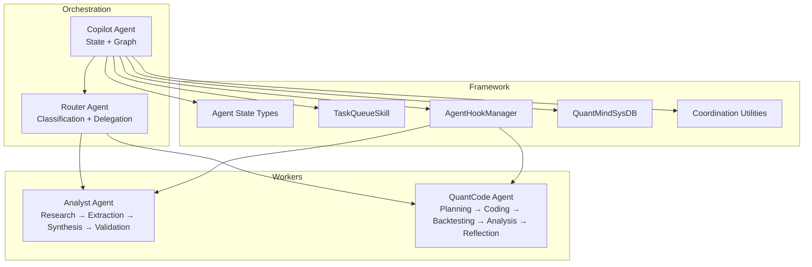
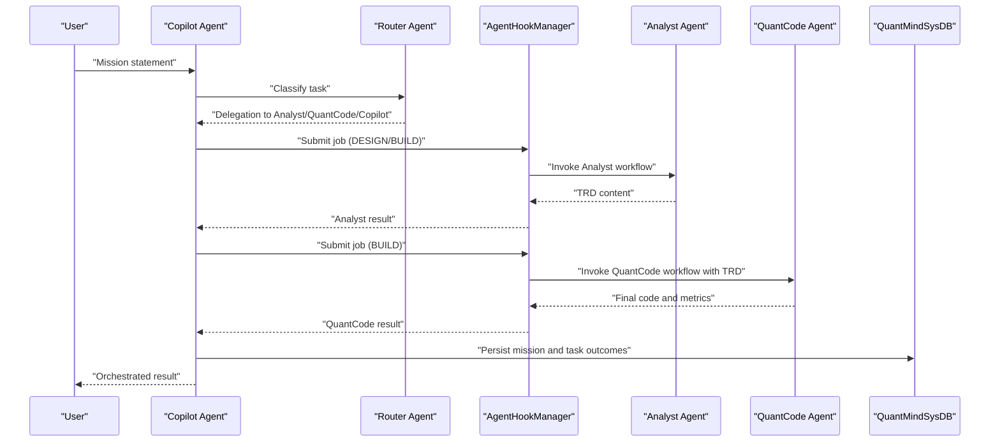
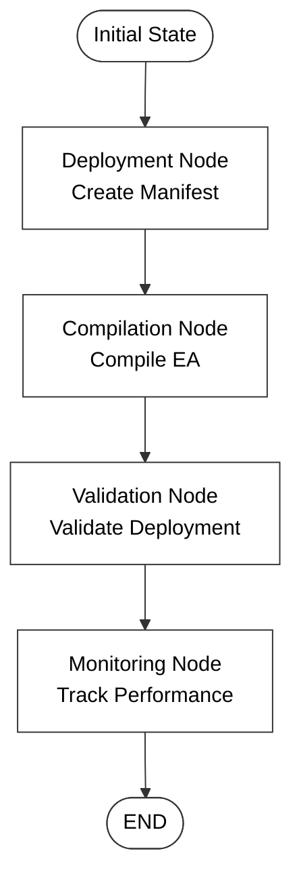
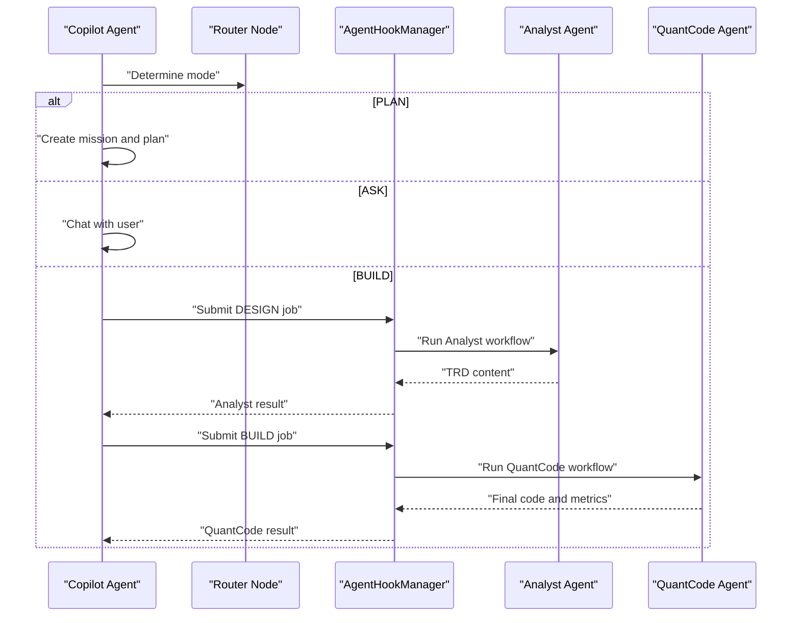
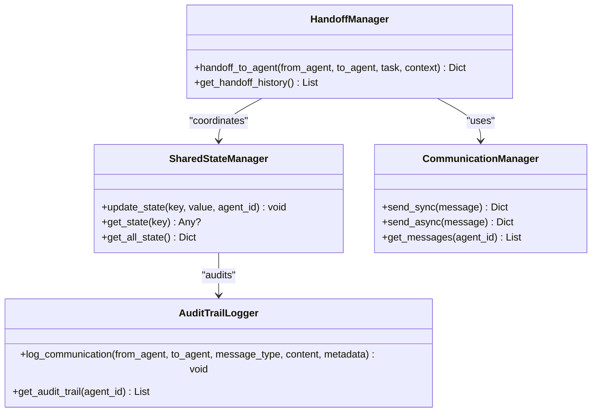
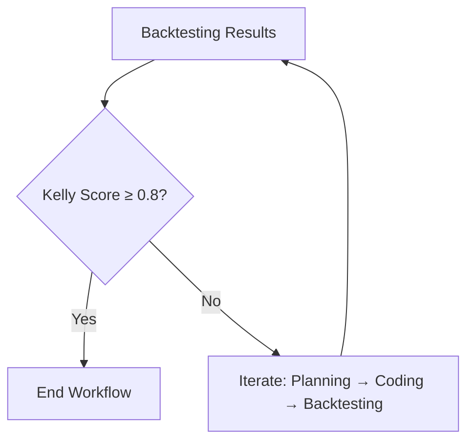
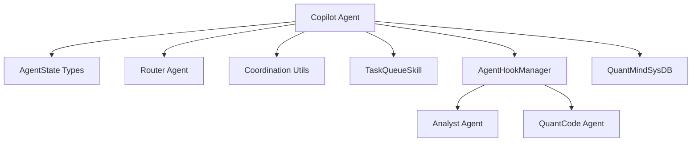

# Copilot Agent

<cite>
**Referenced Files in This Document**
- [copilot.py](file://src/agents/copilot.py)
- [state.py](file://src/agents/state.py)
- [analyst.py](file://src/agents/analyst.py)
- [quantcode.py](file://src/agents/quantcode.py)
- [router.py](file://src/agents/router.py)
- [coordination.py](file://src/agents/coordination.py)
- [copilot_v1.md](file://docs/trds/copilot_v1.md)
- [copilot.py](file://src/agents/implementations/copilot.py)
- [queuing.py](file://src/agents/skills/queuing.py)
- [hooks.py](file://src/agents/core/hooks.py)
- [database.py](file://src/agents/core/database.py)
</cite>

## Table of Contents
1. [Introduction](#introduction)
2. [Project Structure](#project-structure)
3. [Core Components](#core-components)
4. [Architecture Overview](#architecture-overview)
5. [Detailed Component Analysis](#detailed-component-analysis)
6. [Dependency Analysis](#dependency-analysis)
7. [Performance Considerations](#performance-considerations)
8. [Troubleshooting Guide](#troubleshooting-guide)
9. [Conclusion](#conclusion)

## Introduction
The Copilot Agent is the master orchestrator in the QuantMind-X ecosystem. It supervises end-to-end strategy development from high-level mission statements to deployment and monitoring. It coordinates between the Analyst Agent (design and synthesis) and the QuantCode Agent (coding and backtesting), while also integrating with the Router for task classification and the broader agent framework for state, messaging, and persistence.

The Copilot Agent’s responsibilities include:
- Interpreting user intent and selecting operational mode (PLAN, ASK, BUILD)
- Managing cross-agent handoffs via a standardized hook mechanism
- Maintaining global state and context across specialized workflows
- Integrating with a task queue and system database for mission and task tracking
- Ensuring efficient resource utilization and optimal collaboration across agents

## Project Structure
The Copilot Agent spans multiple modules:
- Orchestration and state: orchestration graph, state definitions, and execution entry points
- Worker agents: Analyst and QuantCode workflows
- Router: task classification and delegation
- Coordination utilities: structured messaging, handoffs, shared state, communication patterns, and audit trails
- Framework integration: task queue skill, hook manager, and system database

**Diagram sources**
- [copilot.py](file://src/agents/copilot.py#L99-L127)
- [router.py](file://src/agents/router.py#L161-L185)
- [analyst.py](file://src/agents/analyst.py#L175-L242)
- [quantcode.py](file://src/agents/quantcode.py#L194-L243)
- [state.py](file://src/agents/state.py#L14-L76)
- [queuing.py](file://src/agents/skills/queuing.py#L13-L92)
- [hooks.py](file://src/agents/core/hooks.py#L18-L67)
- [database.py](file://src/agents/core/database.py#L23-L92)
- [coordination.py](file://src/agents/coordination.py#L58-L403)

**Section sources**
- [copilot.py](file://src/agents/copilot.py#L1-L155)
- [state.py](file://src/agents/state.py#L1-L76)
- [analyst.py](file://src/agents/analyst.py#L1-L288)
- [quantcode.py](file://src/agents/quantcode.py#L1-L276)
- [router.py](file://src/agents/router.py#L1-L212)
- [coordination.py](file://src/agents/coordination.py#L1-L403)
- [copilot_v1.md](file://docs/trds/copilot_v1.md#L1-L72)
- [copilot.py](file://src/agents/implementations/copilot.py#L37-L174)
- [queuing.py](file://src/agents/skills/queuing.py#L1-L92)
- [hooks.py](file://src/agents/core/hooks.py#L1-L68)
- [database.py](file://src/agents/core/database.py#L1-L92)

## Core Components
- Copilot orchestration graph and execution: Defines nodes for deployment, compilation, validation, and monitoring; compiles a StateGraph with memory checkpointing and runs a workflow from a structured initial state.
- Agent state types: Provides typed state structures for all agents, including CopilotState with fields for deployment artifacts, compilation status, validation results, and monitoring data.
- Analyst workflow: A LangGraph pipeline that moves through research, extraction, synthesis, and validation with conditional edges for retries and error handling.
- QuantCode workflow: A LangGraph pipeline that moves through planning, coding, backtesting, analysis, and reflection with conditional edges to iterate until quality thresholds are met.
- Router workflow: Classifies tasks and delegates to Analyst, QuantCode, or Copilot, with broker-aware preparation for deployment tasks.
- Coordination utilities: Structured messaging, handoff manager, shared state, communication patterns, skill registry, human-in-the-loop approvals, error handling, and audit trails.
- Framework integration: TaskQueueSkill for persistent handoffs, AgentHookManager for standardized inter-agent invocation, and QuantMindSysDB for mission and task persistence.

**Section sources**
- [copilot.py](file://src/agents/copilot.py#L21-L155)
- [state.py](file://src/agents/state.py#L55-L65)
- [analyst.py](file://src/agents/analyst.py#L24-L137)
- [quantcode.py](file://src/agents/quantcode.py#L24-L163)
- [router.py](file://src/agents/router.py#L20-L159)
- [coordination.py](file://src/agents/coordination.py#L58-L403)
- [queuing.py](file://src/agents/skills/queuing.py#L13-L92)
- [hooks.py](file://src/agents/core/hooks.py#L18-L67)
- [database.py](file://src/agents/core/database.py#L48-L89)

## Architecture Overview
The Copilot Agent operates as the central controller that:
- Receives a high-level mission statement
- Routes tasks via the Router
- Coordinates Analyst and QuantCode through the HookManager
- Persists mission and task state in the system database
- Uses a task queue for durable handoffs
- Maintains a shared state and audit trail for visibility and compliance

**Diagram sources**
- [copilot.py](file://src/agents/implementations/copilot.py#L96-L158)
- [router.py](file://src/agents/router.py#L20-L96)
- [hooks.py](file://src/agents/core/hooks.py#L25-L65)
- [analyst.py](file://src/agents/analyst.py#L249-L287)
- [quantcode.py](file://src/agents/quantcode.py#L250-L275)
- [database.py](file://src/agents/core/database.py#L48-L89)

## Detailed Component Analysis

### Copilot Agent Orchestration Graph
The Copilot Agent defines a deterministic workflow with four nodes: deployment, compilation, validation, and monitoring. It compiles a StateGraph with memory checkpointing and executes a single-threaded workflow with a structured initial state.

Key characteristics:
- Nodes encapsulate discrete steps in EA lifecycle management
- State carries deployment artifacts, compilation status, validation results, and monitoring telemetry
- MemorySaver enables checkpointing for resilience and recovery
- Execution uses a thread_id for session scoping

**Diagram sources**
- [copilot.py](file://src/agents/copilot.py#L99-L127)
- [copilot.py](file://src/agents/copilot.py#L21-L96)
- [state.py](file://src/agents/state.py#L55-L65)

**Section sources**
- [copilot.py](file://src/agents/copilot.py#L21-L155)
- [state.py](file://src/agents/state.py#L55-L65)

### Multi-Agent Orchestration (PLAN/ASK/BUILD Modes)
The V2 Copilot Agent introduces explicit operational modes:
- PLAN: Decompose mission into a Strategy Design Plan
- ASK: Collaborative chat mode
- BUILD: Execute Analyst → QuantCode pipeline with handoffs

Operational flow:
- Router node determines mode based on user input
- Build mode submits jobs to Analyst and QuantCode via the HookManager
- Results are aggregated and returned to the user

**Diagram sources**
- [copilot.py](file://src/agents/implementations/copilot.py#L96-L158)
- [hooks.py](file://src/agents/core/hooks.py#L25-L65)
- [analyst.py](file://src/agents/analyst.py#L249-L287)
- [quantcode.py](file://src/agents/quantcode.py#L250-L275)

**Section sources**
- [copilot.py](file://src/agents/implementations/copilot.py#L37-L174)
- [copilot_v1.md](file://docs/trds/copilot_v1.md#L20-L72)

### Task Coordination and Handoff Patterns
The Copilot Agent integrates with:
- AgentHookManager for standardized inter-agent invocation
- TaskQueueSkill for durable handoffs and queue management
- QuantMindSysDB for mission and task persistence

Patterns:
- Handoff manager tracks transitions and context across agents
- Shared state maintains cross-step context
- Structured messaging ensures consistent metadata and timestamps
- Audit trail logs inter-agent communications for compliance

**Diagram sources**
- [coordination.py](file://src/agents/coordination.py#L58-L403)

**Section sources**
- [coordination.py](file://src/agents/coordination.py#L58-L403)
- [hooks.py](file://src/agents/core/hooks.py#L18-L67)
- [queuing.py](file://src/agents/skills/queuing.py#L13-L92)
- [database.py](file://src/agents/core/database.py#L48-L89)

### Workflow Optimization Functions
Optimization mechanisms:
- Conditional edges in Analyst and QuantCode workflows reduce redundant work and accelerate convergence
- Retry loops ensure robustness when intermediate steps fail
- Broker-aware deployment preparation in Router minimizes runtime failures
- Persistent state and checkpoints enable recovery and inspection

**Diagram sources**
- [quantcode.py](file://src/agents/quantcode.py#L169-L188)

**Section sources**
- [analyst.py](file://src/agents/analyst.py#L143-L169)
- [quantcode.py](file://src/agents/quantcode.py#L169-L188)
- [router.py](file://src/agents/router.py#L98-L159)

### Configuration Options, State Management, and Integration
Configuration and state:
- CopilotState includes fields for deployment manifest, compilation status, validation results, and monitoring data
- Initial state sets workspace path, memory namespace, and current task
- MemorySaver checkpointing supports resilient execution

Integration points:
- TaskQueueSkill provides push/list/pop operations for durable handoffs
- AgentHookManager registers handlers and routes jobs with mission-scoped task IDs
- QuantMindSysDB persists missions and tasks, enabling cross-session continuity

**Section sources**
- [state.py](file://src/agents/state.py#L55-L65)
- [copilot.py](file://src/agents/copilot.py#L130-L155)
- [queuing.py](file://src/agents/skills/queuing.py#L22-L84)
- [hooks.py](file://src/agents/core/hooks.py#L25-L65)
- [database.py](file://src/agents/core/database.py#L48-L89)

## Dependency Analysis
The Copilot Agent depends on:
- LangGraph for stateful workflows and memory checkpointing
- Agent state types for typed state structures
- Router for task classification and delegation
- Analyst and QuantCode workflows for specialized tasks
- Coordination utilities for messaging, handoffs, and auditing
- Framework components for queueing, hooks, and persistence

**Diagram sources**
- [copilot.py](file://src/agents/copilot.py#L1-L155)
- [state.py](file://src/agents/state.py#L14-L76)
- [router.py](file://src/agents/router.py#L1-L212)
- [analyst.py](file://src/agents/analyst.py#L1-L288)
- [quantcode.py](file://src/agents/quantcode.py#L1-L276)
- [coordination.py](file://src/agents/coordination.py#L1-L403)
- [queuing.py](file://src/agents/skills/queuing.py#L1-L92)
- [hooks.py](file://src/agents/core/hooks.py#L1-L68)
- [database.py](file://src/agents/core/database.py#L1-L92)

**Section sources**
- [copilot.py](file://src/agents/copilot.py#L1-L155)
- [state.py](file://src/agents/state.py#L14-L76)
- [router.py](file://src/agents/router.py#L1-L212)
- [analyst.py](file://src/agents/analyst.py#L1-L288)
- [quantcode.py](file://src/agents/quantcode.py#L1-L276)
- [coordination.py](file://src/agents/coordination.py#L1-L403)
- [queuing.py](file://src/agents/skills/queuing.py#L1-L92)
- [hooks.py](file://src/agents/core/hooks.py#L1-L68)
- [database.py](file://src/agents/core/database.py#L1-L92)

## Performance Considerations
- Use conditional edges to avoid unnecessary iterations and reduce total execution time
- Persist state with MemorySaver to minimize recomputation on restarts
- Offload heavy tasks to the TaskQueueSkill to prevent blocking the orchestration loop
- Employ structured messaging and audit trails to detect bottlenecks and anomalies early
- Integrate broker-aware deployment preparation to avoid runtime failures and retries

## Troubleshooting Guide
Common issues and resolutions:
- Missing Supabase credentials: The system database falls back to mock behavior; ensure environment variables are configured for full functionality
- No active hook handler: Verify that the AgentHookManager has registered handlers for the target agent
- Task queue exhaustion: Use list_queue to inspect pending tasks and pop_task to fetch the next item
- Handoff failures: Review handoff history and audit trail logs for context and timestamps

**Section sources**
- [database.py](file://src/agents/core/database.py#L32-L47)
- [hooks.py](file://src/agents/core/hooks.py#L49-L51)
- [queuing.py](file://src/agents/skills/queuing.py#L42-L82)
- [coordination.py](file://src/agents/coordination.py#L87-L104)
- [coordination.py](file://src/agents/coordination.py#L370-L402)

## Conclusion
The Copilot Agent serves as the master orchestrator for complex trading strategy development. By combining LangGraph-based workflows, standardized inter-agent communication via hooks, durable task queuing, and persistent state management, it ensures efficient resource utilization and optimal collaboration among Analyst and QuantCode agents. Its integration with the Router, coordination utilities, and system database provides a robust foundation for scalable, auditable, and resilient strategy lifecycle management.