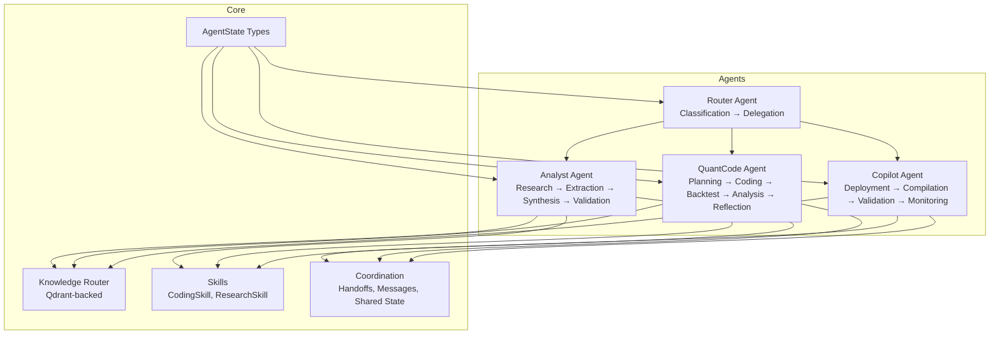
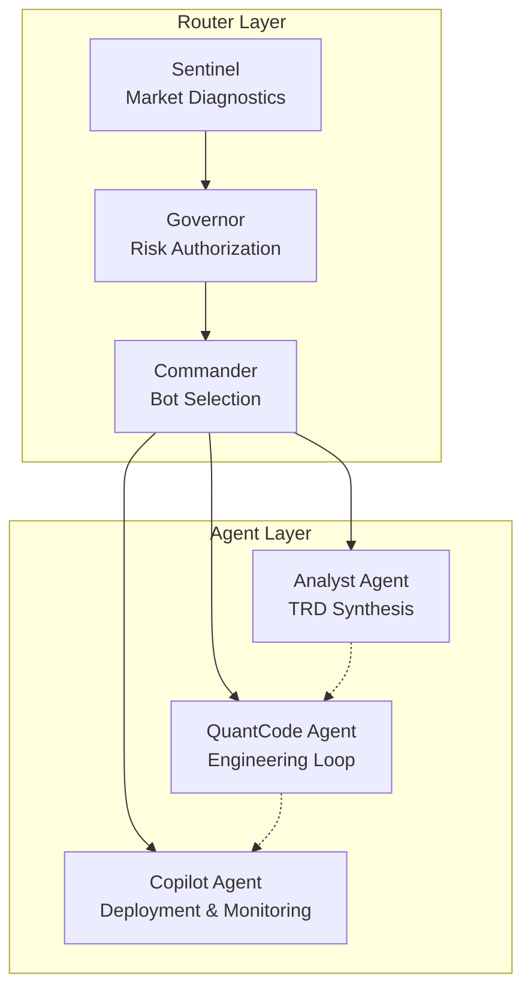
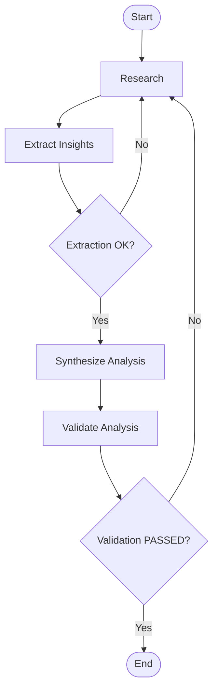
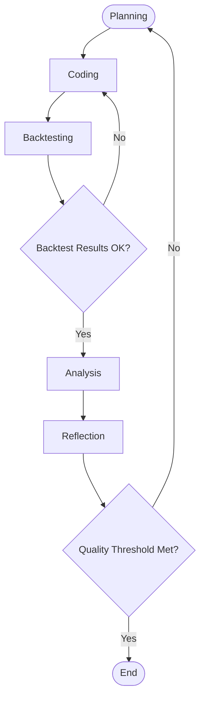
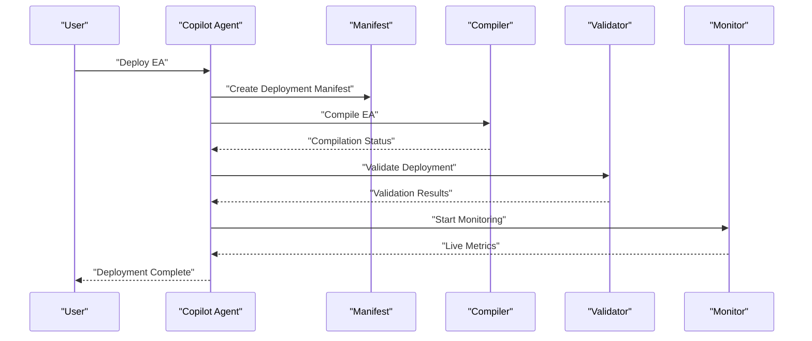
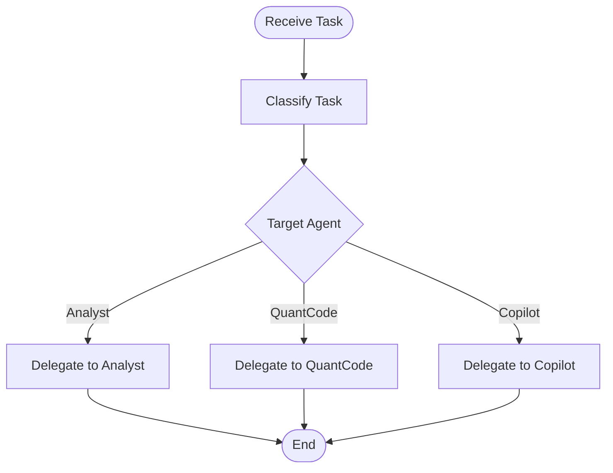
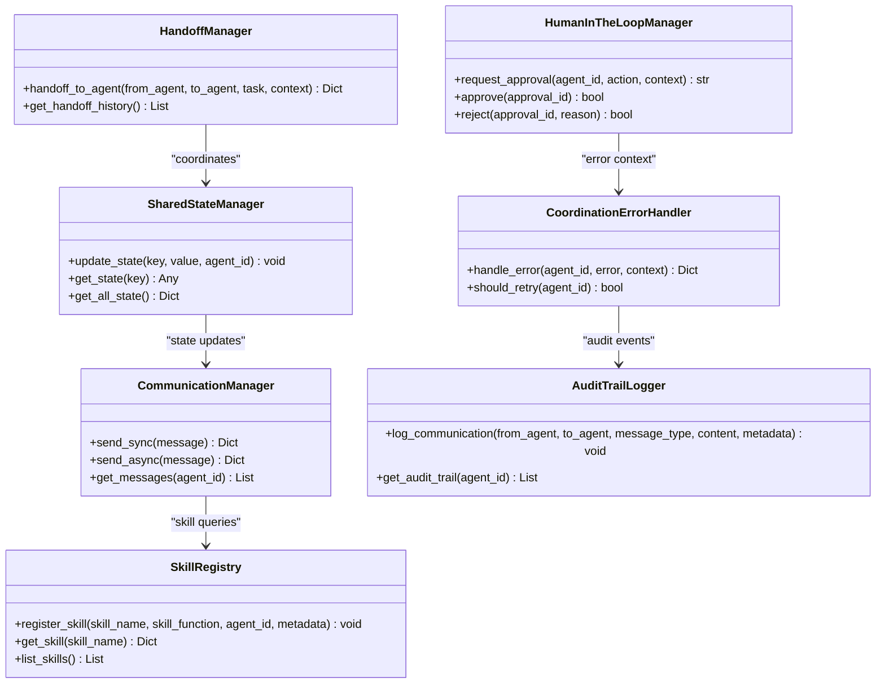
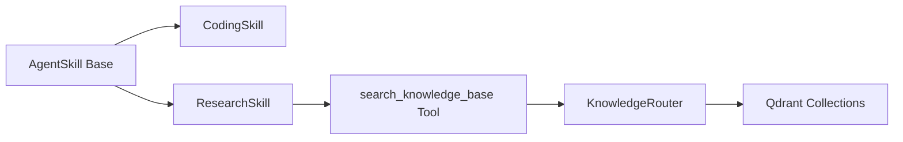
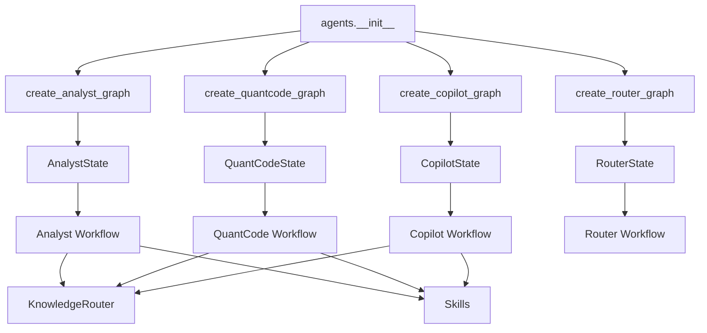

# Multi-Agent AI System

<cite>
**Referenced Files in This Document**
- [agent_framework_v1.md](file://docs/trds/agent_framework_v1.md)
- [analyst_agent_v1.md](file://docs/trds/analyst_agent_v1.md)
- [quant_code_v1.md](file://docs/trds/quant_code_v1.md)
- [strategy_router_v1.md](file://docs/trds/strategy_router_v1.md)
- [prop_module_v1.md](file://docs/trds/prop_module_v1.md)
- [__init__.py](file://src/agents/__init__.py)
- [state.py](file://src/agents/state.py)
- [analyst.py](file://src/agents/analyst.py)
- [quantcode.py](file://src/agents/quantcode.py)
- [copilot.py](file://src/agents/copilot.py)
- [router.py](file://src/agents/router.py)
- [coordination.py](file://src/agents/coordination.py)
- [base.py](file://src/agents/skills/base.py)
- [coding.py](file://src/agents/skills/coding.py)
- [research.py](file://src/agents/skills/research.py)
- [retriever.py](file://src/agents/knowledge/retriever.py)
- [router.py](file://src/agents/knowledge/router.py)
</cite>

## Table of Contents
1. [Introduction](#introduction)
2. [Project Structure](#project-structure)
3. [Core Components](#core-components)
4. [Architecture Overview](#architecture-overview)
5. [Detailed Component Analysis](#detailed-component-analysis)
6. [Dependency Analysis](#dependency-analysis)
7. [Performance Considerations](#performance-considerations)
8. [Troubleshooting Guide](#troubleshooting-guide)
9. [Conclusion](#conclusion)
10. [Appendices](#appendices)

## Introduction
This document describes the Multi-Agent AI System that orchestrates a tri-layer sentient architecture for end-to-end trading strategy lifecycle management. The system centers on three specialized agents:
- Analyst Agent: Research, synthesis, and TRD generation for strategy architects.
- QuantCode Agent: Automated strategy engineering with iterative Trial & Reflection loops, backtesting, and analysis.
- Copilot Agent: Master orchestrator for deployment, compilation, validation, and monitoring.

These agents collaborate through LangGraph workflows, shared state, structured messaging, and a skill-based capability system. The Router Agent performs initial task classification and delegation, while the Coordination module provides handoff patterns, shared state, communication abstractions, and audit trails. The system integrates with a knowledge router for RAG-style retrieval and supports MCP-based tooling.

## Project Structure
The multi-agent system is organized under src/agents with clear separation of concerns:
- Core orchestration and state definitions
- Agent-specific workflows (Analyst, QuantCode, Copilot, Router)
- Coordination utilities for inter-agent communication and shared state
- Skills and knowledge base integration for tooling and retrieval

**Diagram sources**
- [__init__.py](file://src/agents/__init__.py#L15-L37)
- [state.py](file://src/agents/state.py#L14-L76)
- [analyst.py](file://src/agents/analyst.py#L175-L218)
- [quantcode.py](file://src/agents/quantcode.py#L194-L229)
- [copilot.py](file://src/agents/copilot.py#L99-L114)
- [router.py](file://src/agents/router.py#L161-L172)
- [coordination.py](file://src/agents/coordination.py#L58-L104)
- [retriever.py](file://src/agents/knowledge/retriever.py#L14-L25)
- [router.py](file://src/agents/knowledge/router.py#L19-L105)

**Section sources**
- [__init__.py](file://src/agents/__init__.py#L1-L67)
- [state.py](file://src/agents/state.py#L1-L76)

## Core Components
- Agent State Management: TypedDict-based state structures define the conversation history, current task, workspace path, context, and agent-specific fields. Specializations include AnalystState, QuantCodeState, CopilotState, and RouterState.
- Router Agent: Classifies incoming tasks and delegates to the appropriate agent, with optional broker-type preparation for deployment tasks.
- Analyst Agent: Executes a four-stage workflow—research, extraction, synthesis, and validation—with conditional edges for retries and quality gating.
- QuantCode Agent: Implements a Trial & Reflection loop—planning, coding, backtesting, analysis, and reflection—iterating until quality thresholds are met.
- Copilot Agent: Manages deployment lifecycle from manifest creation through compilation, validation, and monitoring.
- Coordination Utilities: Provide structured messaging, handoff patterns, shared state, communication queues, skill registries, human-in-the-loop approvals, error handling, and audit trails.
- Skills and Knowledge: Modular skills (CodingSkill, ResearchSkill) expose tools and system prompts; the Knowledge Router enables namespace-aware retrieval across private and global collections.

**Section sources**
- [state.py](file://src/agents/state.py#L14-L76)
- [router.py](file://src/agents/router.py#L20-L96)
- [analyst.py](file://src/agents/analyst.py#L24-L136)
- [quantcode.py](file://src/agents/quantcode.py#L24-L162)
- [copilot.py](file://src/agents/copilot.py#L21-L96)
- [coordination.py](file://src/agents/coordination.py#L58-L403)
- [base.py](file://src/agents/skills/base.py#L9-L25)
- [coding.py](file://src/agents/skills/coding.py#L10-L33)
- [research.py](file://src/agents/skills/research.py#L9-L24)
- [retriever.py](file://src/agents/knowledge/retriever.py#L14-L25)
- [router.py](file://src/agents/knowledge/router.py#L19-L105)

## Architecture Overview
The system follows a tri-layer sentient architecture:
- Sentinel (Router) observes market conditions and regimes.
- Governor enforces risk budgets and compliance.
- Commander selects and dispatches strategies.
- Agents (Analyst, QuantCode, Copilot) operate autonomously within LangGraph workflows, collaborating via shared state and structured handoffs.

**Diagram sources**
- [strategy_router_v1.md](file://docs/trds/strategy_router_v1.md#L13-L18)
- [analyst_agent_v1.md](file://docs/trds/analyst_agent_v1.md#L1-L67)
- [quant_code_v1.md](file://docs/trds/quant_code_v1.md#L1-L54)
- [copilot.py](file://src/agents/copilot.py#L21-L96)

## Detailed Component Analysis

### Analyst Agent
Responsibilities:
- Ingest and analyze market content to produce Technical Requirements Documents (TRDs).
- Augment with knowledge base references and align with ecosystem standards.
- Provide a human-in-the-loop review gate before handing off to QuantCode.

Workflow:
- Research → Extraction → Synthesis → Validation
- Conditional edges enable retries on extraction/validation failures.

**Diagram sources**
- [analyst.py](file://src/agents/analyst.py#L175-L218)

**Section sources**
- [analyst.py](file://src/agents/analyst.py#L24-L136)
- [analyst_agent_v1.md](file://docs/trds/analyst_agent_v1.md#L8-L34)

### QuantCode Agent
Responsibilities:
- Implement production-grade MQL5 Expert Advisors from TRDs.
- Enforce a meta-compiler feedback loop with iterative healing.
- Manage a reusable asset hub and library for components.

Workflow:
- Planning → Coding → Backtesting → Analysis → Reflection
- Iterates until quality thresholds are satisfied.

**Diagram sources**
- [quantcode.py](file://src/agents/quantcode.py#L194-L229)

**Section sources**
- [quantcode.py](file://src/agents/quantcode.py#L24-L162)
- [quant_code_v1.md](file://docs/trds/quant_code_v1.md#L15-L24)

### Copilot Agent
Responsibilities:
- Create deployment manifests, compile Expert Advisors, validate deployments, and monitor live performance.
- Acts as the master orchestrator coordinating agent handoffs and global task queuing.

**Diagram sources**
- [copilot.py](file://src/agents/copilot.py#L99-L114)

**Section sources**
- [copilot.py](file://src/agents/copilot.py#L21-L96)

### Router Agent
Responsibilities:
- Classify incoming tasks and delegate to the appropriate agent.
- Prepare broker configurations for deployment tasks and track delegation history.

**Diagram sources**
- [router.py](file://src/agents/router.py#L161-L172)

**Section sources**
- [router.py](file://src/agents/router.py#L20-L96)

### Coordination Utilities
Capabilities:
- Structured messaging with roles and metadata.
- Handoff manager for agent-to-agent transitions.
- Shared state manager for cross-agent visibility.
- Communication manager supporting sync/async patterns.
- Skill registry for capability sharing.
- Human-in-the-loop approvals and audit trails.
- Error handling and retry policies.

**Diagram sources**
- [coordination.py](file://src/agents/coordination.py#L58-L403)

**Section sources**
- [coordination.py](file://src/agents/coordination.py#L58-L403)

### Skills and Knowledge Integration
- AgentSkill defines a modular capability container with tools and system prompts.
- CodingSkill exposes file management and shell tools (restricted).
- ResearchSkill integrates a retrieval tool backed by the Knowledge Router.
- Knowledge Router supports isolated namespaces per agent and a global collection, with lazy collection creation and hybrid search.

**Diagram sources**
- [base.py](file://src/agents/skills/base.py#L9-L25)
- [coding.py](file://src/agents/skills/coding.py#L10-L33)
- [research.py](file://src/agents/skills/research.py#L9-L24)
- [retriever.py](file://src/agents/knowledge/retriever.py#L14-L25)
- [router.py](file://src/agents/knowledge/router.py#L19-L105)

**Section sources**
- [base.py](file://src/agents/skills/base.py#L9-L25)
- [coding.py](file://src/agents/skills/coding.py#L10-L33)
- [research.py](file://src/agents/skills/research.py#L9-L24)
- [retriever.py](file://src/agents/knowledge/retriever.py#L14-L25)
- [router.py](file://src/agents/knowledge/router.py#L19-L105)

## Dependency Analysis
Key dependencies and relationships:
- Agent exports and orchestration entry points are centralized in the agents package initializer.
- Each agent’s workflow depends on its state type and LangGraph constructs.
- Router coordinates downstream agents and prepares broker contexts for deployment tasks.
- Coordination utilities are used across agents for consistent inter-agent communication and state management.
- Skills and knowledge router provide shared capabilities and retrieval.

**Diagram sources**
- [__init__.py](file://src/agents/__init__.py#L15-L37)
- [state.py](file://src/agents/state.py#L14-L76)
- [analyst.py](file://src/agents/analyst.py#L175-L218)
- [quantcode.py](file://src/agents/quantcode.py#L194-L229)
- [copilot.py](file://src/agents/copilot.py#L99-L114)
- [router.py](file://src/agents/router.py#L161-L172)
- [router.py](file://src/agents/knowledge/router.py#L19-L105)

**Section sources**
- [__init__.py](file://src/agents/__init__.py#L15-L37)
- [state.py](file://src/agents/state.py#L14-L76)
- [analyst.py](file://src/agents/analyst.py#L175-L218)
- [quantcode.py](file://src/agents/quantcode.py#L194-L229)
- [copilot.py](file://src/agents/copilot.py#L99-L114)
- [router.py](file://src/agents/router.py#L161-L172)

## Performance Considerations
- LangGraph checkpointing and thread IDs enable deterministic, resumable workflows with minimal overhead.
- Conditional edges reduce unnecessary computation by short-circuiting on validation failures.
- Shared state and message queues decouple agents while maintaining traceability.
- Knowledge retrieval merges private and global namespaces to balance specificity and breadth.
- The Router’s classification and delegation minimize misrouting and redundant processing.

[No sources needed since this section provides general guidance]

## Troubleshooting Guide
Common operational issues and mitigations:
- Task classification errors: Verify Router keyword matching and broker-type detection logic.
- Workflow retries: Ensure validation gates are correctly configured to trigger research/coding re-execution.
- Knowledge retrieval failures: Confirm Qdrant connectivity and collection initialization.
- Coordination errors: Use the error handler to log and decide retry behavior; inspect audit trails for inter-agent communication anomalies.
- Human-in-the-loop delays: Implement timeouts and escalation paths for pending approvals.

**Section sources**
- [router.py](file://src/agents/router.py#L20-L96)
- [analyst.py](file://src/agents/analyst.py#L143-L168)
- [quantcode.py](file://src/agents/quantcode.py#L169-L187)
- [router.py](file://src/agents/knowledge/router.py#L28-L38)
- [coordination.py](file://src/agents/coordination.py#L314-L354)
- [coordination.py](file://src/agents/coordination.py#L360-L403)

## Conclusion
The Multi-Agent AI System implements a robust tri-layer sentient architecture that spans research, engineering, and deployment. Through LangGraph workflows, structured state management, and coordinated handoffs, the Analyst, QuantCode, and Copilot agents collaborate to deliver end-to-end strategy lifecycle automation. The Router provides intelligent task routing, while the Coordination utilities ensure reliable inter-agent communication and governance. The skills and knowledge systems offer extensible capabilities and contextual retrieval, enabling scalable and repeatable strategy development.

[No sources needed since this section summarizes without analyzing specific files]

## Appendices

### Agent Framework Overview
- The framework establishes a standardized BaseAgent pattern, skill composition, and knowledge orchestration for all agents.
- CLI launch and streaming response support streamline interactive development and testing.

**Section sources**
- [agent_framework_v1.md](file://docs/trds/agent_framework_v1.md#L9-L101)

### Router and Propagation Modules
- The Router’s tri-layer control hierarchy ensures market intelligence, risk governance, and command execution remain aligned.
- The Prop Firm Module extends governance and commander logic for survival-mode constraints and preservation protocols.

**Section sources**
- [strategy_router_v1.md](file://docs/trds/strategy_router_v1.md#L9-L236)
- [prop_module_v1.md](file://docs/trds/prop_module_v1.md#L1-L132)