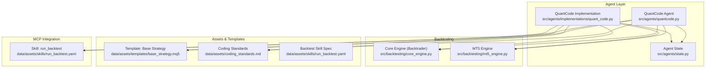
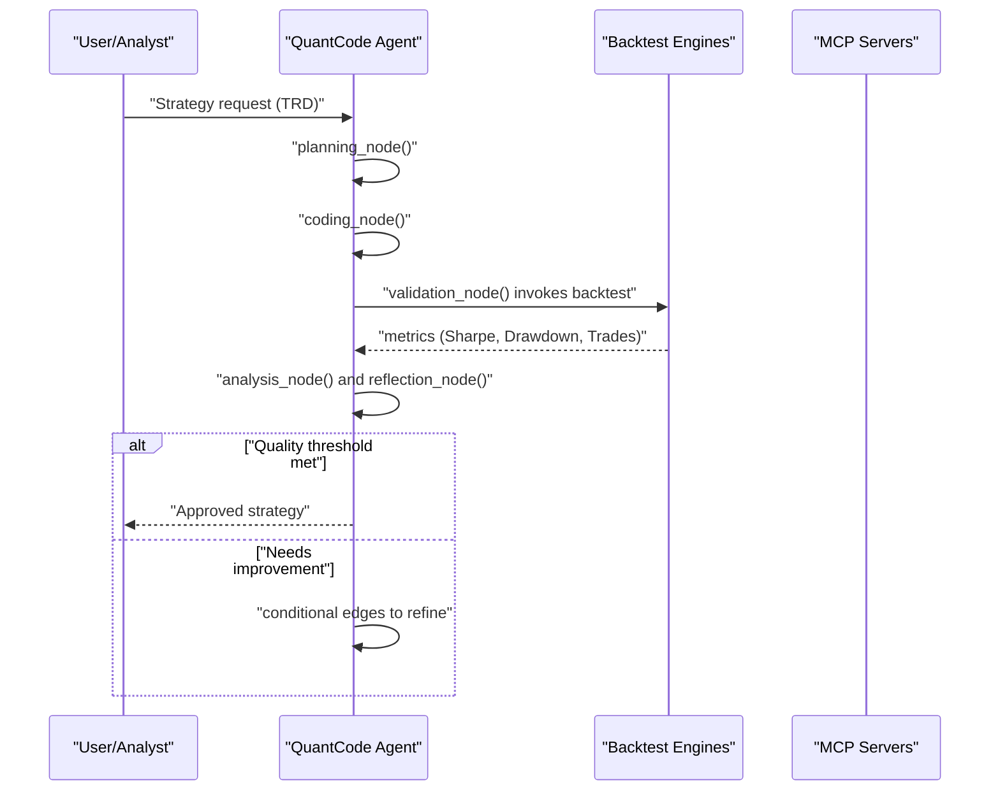
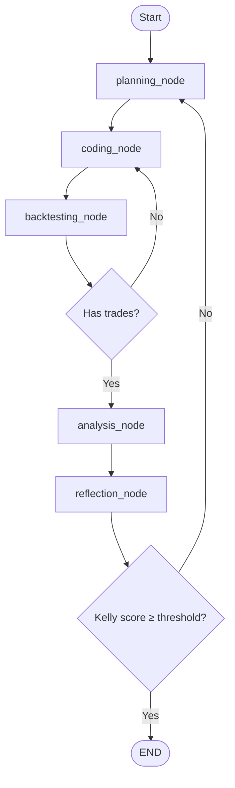
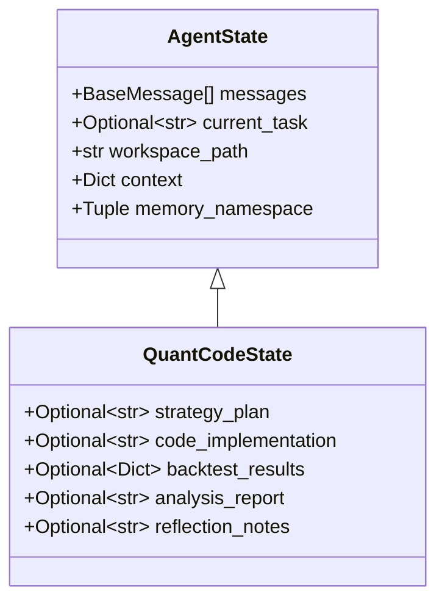
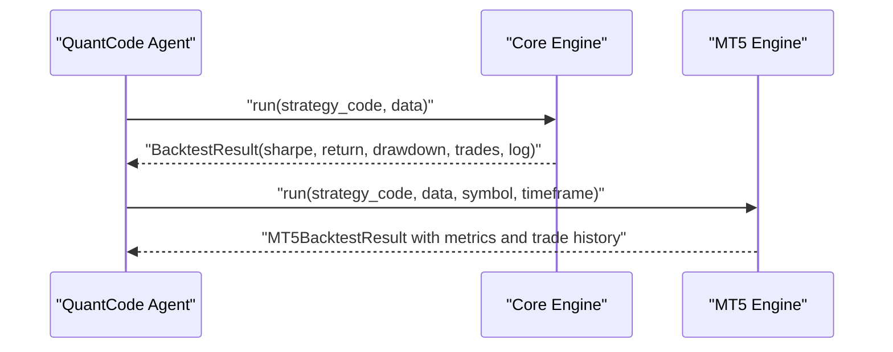
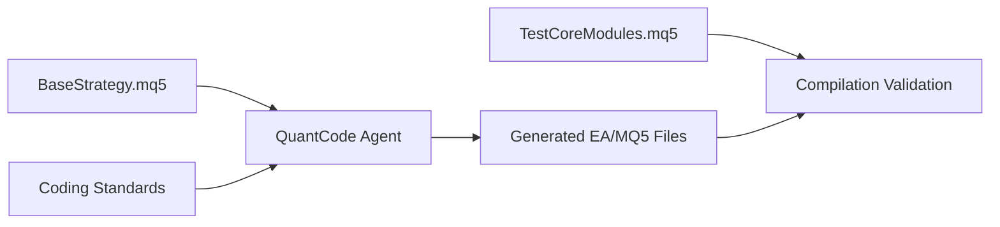
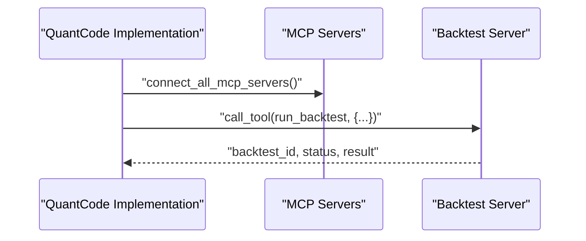
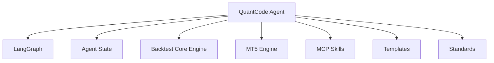

# QuantCode Agent

<cite>
**Referenced Files in This Document**
- [quantcode.py](file://src/agents/quantcode.py)
- [quant_code_v1.md](file://docs/trds/quant_code_v1.md)
- [state.py](file://src/agents/state.py)
- [quant_code.py](file://src/agents/implementations/quant_code.py)
- [base_strategy.mq5](file://data/assets/templates/base_strategy.mq5)
- [coding_standards.md](file://data/assets/coding_standards.md)
- [run_backtest.yaml](file://data/assets/skills/run_backtest.yaml)
- [core_engine.py](file://src/backtesting/core_engine.py)
- [mt5_engine.py](file://src/backtesting/mt5_engine.py)
- [TestCoreModules.mq5](file://src/mql5/Experts/TestCoreModules.mq5)
- [test_agents.py](file://tests/agents/test_agents.py)
- [test_task_group_8_integration.py](file://tests/agents/test_task_group_8_integration.py)
- [test_full_workflow_e2e.py](file://tests/e2e/test_full_workflow_e2e.py)
- [test_paper_trading_e2e.py](file://tests/e2e/test_paper_trading_e2e.py)
</cite>

## Table of Contents
1. [Introduction](#introduction)
2. [Project Structure](#project-structure)
3. [Core Components](#core-components)
4. [Architecture Overview](#architecture-overview)
5. [Detailed Component Analysis](#detailed-component-analysis)
6. [Dependency Analysis](#dependency-analysis)
7. [Performance Considerations](#performance-considerations)
8. [Troubleshooting Guide](#troubleshooting-guide)
9. [Conclusion](#conclusion)
10. [Appendices](#appendices)

## Introduction
The QuantCode Agent is the “Quantitative Engineering Factory” responsible for transforming research and TRDs into deployable trading strategies. It orchestrates an iterative, high-precision workflow that generates, validates, refines, and certifies strategies across Python and MQL5 environments. The agent integrates tightly with backtesting engines, MCP servers, and the broader Analyst–Copilot ecosystem to ensure production-grade, repeatable, and scalable strategy development.

Key responsibilities:
- Strategy planning and decomposition into modular components
- Code generation for Python strategies and MQL5 Expert Advisors
- Automated backtesting and performance evaluation
- Iterative refinement guided by metrics and MCP feedback
- Coordination with the Analyst agent for TRD ingestion and with the Copilot agent for deployment orchestration

## Project Structure
The QuantCode Agent spans several modules:
- Agent workflow and state management
- Backtesting engines (Python and MT5)
- MQL5 template and library assets
- MCP skills and integration
- Tests validating workflow correctness and end-to-end behavior

**Diagram sources**
- [quantcode.py](file://src/agents/quantcode.py#L194-L243)
- [quant_code.py](file://src/agents/implementations/quant_code.py#L20-L48)
- [state.py](file://src/agents/state.py#L42-L52)
- [core_engine.py](file://src/backtesting/core_engine.py#L13-L83)
- [mt5_engine.py](file://src/backtesting/mt5_engine.py#L320-L782)
- [base_strategy.mq5](file://data/assets/templates/base_strategy.mq5#L1-L45)
- [coding_standards.md](file://data/assets/coding_standards.md#L1-L16)
- [run_backtest.yaml](file://data/assets/skills/run_backtest.yaml#L1-L18)

**Section sources**
- [quantcode.py](file://src/agents/quantcode.py#L1-L276)
- [quant_code.py](file://src/agents/implementations/quant_code.py#L1-L139)
- [state.py](file://src/agents/state.py#L1-L76)
- [core_engine.py](file://src/backtesting/core_engine.py#L1-L83)
- [mt5_engine.py](file://src/backtesting/mt5_engine.py#L1-L991)
- [base_strategy.mq5](file://data/assets/templates/base_strategy.mq5#L1-L45)
- [coding_standards.md](file://data/assets/coding_standards.md#L1-L16)
- [run_backtest.yaml](file://data/assets/skills/run_backtest.yaml#L1-L18)

## Core Components
- Agent workflow graph: Defines planning → coding → backtesting → analysis → reflection → decision loop with conditional edges.
- State schema: Extends a generic agent state with strategy-specific fields for plan, code, backtest results, analysis, and reflection.
- Backtesting engines: Python-based dynamic strategy execution and MT5-compatible simulator for MQL5-style environments.
- Template and standards: Base MQL5 template and coding standards to enforce safety, type hints, and risk management.
- MCP skills: Backtest skill spec enabling standardized invocation of the backtesting framework.

**Section sources**
- [quantcode.py](file://src/agents/quantcode.py#L24-L243)
- [state.py](file://src/agents/state.py#L42-L52)
- [core_engine.py](file://src/backtesting/core_engine.py#L13-L83)
- [mt5_engine.py](file://src/backtesting/mt5_engine.py#L320-L782)
- [base_strategy.mq5](file://data/assets/templates/base_strategy.mq5#L1-L45)
- [coding_standards.md](file://data/assets/coding_standards.md#L1-L16)
- [run_backtest.yaml](file://data/assets/skills/run_backtest.yaml#L1-L18)

## Architecture Overview
The QuantCode Agent follows a LangGraph-based workflow with deterministic nodes and conditional edges. It supports two operational modes:
- General: Retail-focused strategies
- PropFirm: Proprietary firm mode with equity clamp and drawdown-aware logic (ingested from Analyst)

**Diagram sources**
- [quantcode.py](file://src/agents/quantcode.py#L24-L243)
- [quant_code.py](file://src/agents/implementations/quant_code.py#L50-L127)
- [core_engine.py](file://src/backtesting/core_engine.py#L18-L83)
- [mt5_engine.py](file://src/backtesting/mt5_engine.py#L695-L782)

## Detailed Component Analysis

### Workflow Graph and Iterative Loop
The agent’s workflow is a StateGraph with five nodes and conditional edges:
- Planning: Creates strategy plan and context
- Coding: Generates Python or MQL5 implementation
- Backtesting: Runs strategy against historical data
- Analysis: Summarizes performance metrics
- Reflection: Produces improvement notes

Conditional logic:
- After backtesting: if trades > 0, go to analysis; otherwise, re-run coding
- After reflection: if Kelly score ≥ threshold, finish; else, restart planning

**Diagram sources**
- [quantcode.py](file://src/agents/quantcode.py#L169-L188)
- [quantcode.py](file://src/agents/quantcode.py#L194-L243)

**Section sources**
- [quantcode.py](file://src/agents/quantcode.py#L24-L243)

### State Schema and Persistence
QuantCodeState extends the generic AgentState with:
- strategy_plan
- code_implementation
- backtest_results
- analysis_report
- reflection_notes

This enables persistent conversation history and cross-node context propagation.

**Diagram sources**
- [state.py](file://src/agents/state.py#L14-L52)

**Section sources**
- [state.py](file://src/agents/state.py#L42-L52)

### Backtesting Integration
Two complementary backtesting engines support the agent:
- Python engine (Backtrader): dynamically executes strategy code and computes Sharpe, drawdown, trades, and returns
- MT5 engine: simulates MQL5 built-ins and provides MT5-like metrics and trade history

**Diagram sources**
- [core_engine.py](file://src/backtesting/core_engine.py#L18-L83)
- [mt5_engine.py](file://src/backtesting/mt5_engine.py#L695-L782)

**Section sources**
- [core_engine.py](file://src/backtesting/core_engine.py#L13-L83)
- [mt5_engine.py](file://src/backtesting/mt5_engine.py#L320-L782)

### MQL5 Integration and Template Management
- Template: BaseStrategy.mq5 provides a minimal MQL5 structure with inputs, CTrade, OnInit/OnDeinit, and a skeleton OnTick entry block
- Coding standards: Enforce zero-warnings compilation, mandatory risk parameters, and explicit input variables
- Core modules test: TestCoreModules.mq5 verifies compilation and runtime behavior of QuantMind standard library modules

**Diagram sources**
- [base_strategy.mq5](file://data/assets/templates/base_strategy.mq5#L1-L45)
- [coding_standards.md](file://data/assets/coding_standards.md#L8-L12)
- [TestCoreModules.mq5](file://src/mql5/Experts/TestCoreModules.mq5#L1-L266)

**Section sources**
- [base_strategy.mq5](file://data/assets/templates/base_strategy.mq5#L1-L45)
- [coding_standards.md](file://data/assets/coding_standards.md#L1-L16)
- [TestCoreModules.mq5](file://src/mql5/Experts/TestCoreModules.mq5#L1-L266)

### MCP Skills and Tooling
- Backtest skill spec defines inputs (strategy_code, symbol, timeframe) and outputs (sharpe_ratio, total_return, drawdown, logs)
- Agent integration tests confirm MCP connectivity and tool availability for MT5 and backtest servers

**Diagram sources**
- [run_backtest.yaml](file://data/assets/skills/run_backtest.yaml#L1-L18)
- [test_task_group_8_integration.py](file://tests/agents/test_task_group_8_integration.py#L519-L545)

**Section sources**
- [run_backtest.yaml](file://data/assets/skills/run_backtest.yaml#L1-L18)
- [test_task_group_8_integration.py](file://tests/agents/test_task_group_8_integration.py#L519-L545)

### Operational Modes and Coordination
- Modes: @General and @PropFirm modes tailor risk and equity constraints based on Analyst-provided TRDs
- Coordination: The agent collaborates with Analyst (research ingestion) and Copilot (deployment orchestration) to move from insight to execution

**Section sources**
- [quant_code_v1.md](file://docs/trds/quant_code_v1.md#L8-L12)

## Dependency Analysis
The QuantCode Agent depends on:
- LangGraph for workflow orchestration
- Backtesting engines for evaluation
- MCP skills for standardized tool invocation
- Templates and standards for code quality
- Agent state for persistence

**Diagram sources**
- [quantcode.py](file://src/agents/quantcode.py#L194-L243)
- [quant_code.py](file://src/agents/implementations/quant_code.py#L20-L48)
- [state.py](file://src/agents/state.py#L42-L52)
- [core_engine.py](file://src/backtesting/core_engine.py#L13-L83)
- [mt5_engine.py](file://src/backtesting/mt5_engine.py#L320-L782)
- [run_backtest.yaml](file://data/assets/skills/run_backtest.yaml#L1-L18)
- [base_strategy.mq5](file://data/assets/templates/base_strategy.mq5#L1-L45)
- [coding_standards.md](file://data/assets/coding_standards.md#L1-L16)

**Section sources**
- [quantcode.py](file://src/agents/quantcode.py#L1-L276)
- [quant_code.py](file://src/agents/implementations/quant_code.py#L1-L139)
- [state.py](file://src/agents/state.py#L1-L76)
- [core_engine.py](file://src/backtesting/core_engine.py#L1-L83)
- [mt5_engine.py](file://src/backtesting/mt5_engine.py#L1-L991)
- [run_backtest.yaml](file://data/assets/skills/run_backtest.yaml#L1-L18)
- [base_strategy.mq5](file://data/assets/templates/base_strategy.mq5#L1-L45)
- [coding_standards.md](file://data/assets/coding_standards.md#L1-L16)

## Performance Considerations
- Backtrader engine: Suitable for rapid prototyping; ensure sandboxing for dynamic code execution
- MT5 engine: Provides realistic market simulation and metrics; leverage built-in MQL5 function overloads for parity
- Iterative refinement: Early termination on insufficient trades prevents wasted compute
- MCP backtests: Prefer batched or queued invocations to avoid blocking the main thread

[No sources needed since this section provides general guidance]

## Troubleshooting Guide
Common issues and resolutions:
- Missing logic in generated code: validation_node enforces presence of class/function definitions and returns a retryable error
- Backtrader dependency missing: validation_node checks for required imports and increments retry count
- Insufficient trades: conditional edges route back to coding to improve signal generation
- MCP connectivity: Ensure servers are configured and tools are discoverable

**Section sources**
- [quant_code.py](file://src/agents/implementations/quant_code.py#L89-L127)
- [test_agents.py](file://tests/agents/test_agents.py#L130-L168)
- [test_task_group_8_integration.py](file://tests/agents/test_task_group_8_integration.py#L519-L545)

## Conclusion
The QuantCode Agent delivers a robust, iterative pipeline for transforming research into deployable strategies. By combining LangGraph orchestration, rigorous backtesting, MCP-integrated validation, and MQL5 template-driven generation, it ensures high-quality, reproducible outcomes. Its operational modes and integration with Analyst and Copilot agents form a cohesive system for end-to-end strategy lifecycle management.

[No sources needed since this section summarizes without analyzing specific files]

## Appendices

### End-to-End Workflow Examples
- Full workflow E2E: Demonstrates planning → coding → backtest → analysis and MCP backtest invocation
- Paper trading E2E: Shows reflection and deployment triggers under primal conditions

**Section sources**
- [test_full_workflow_e2e.py](file://tests/e2e/test_full_workflow_e2e.py#L72-L100)
- [test_paper_trading_e2e.py](file://tests/e2e/test_paper_trading_e2e.py#L529-L573)