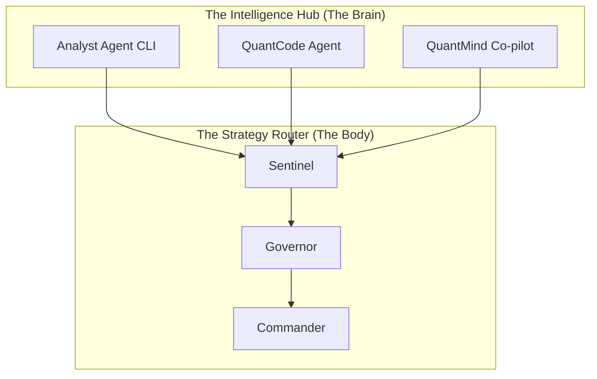
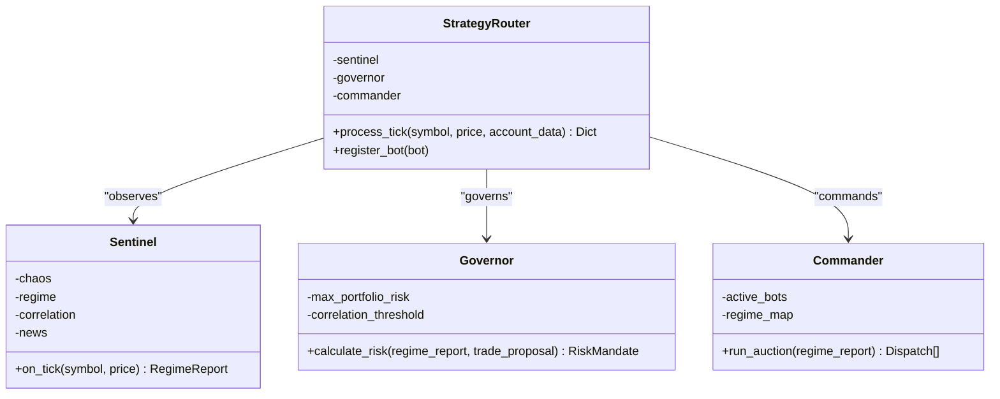
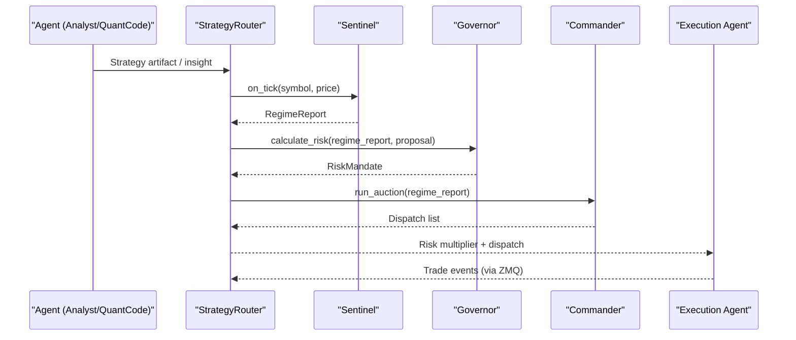
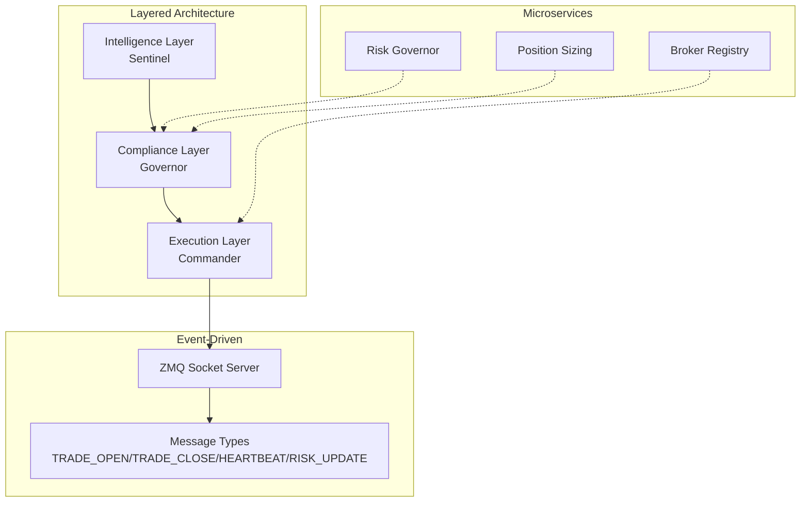
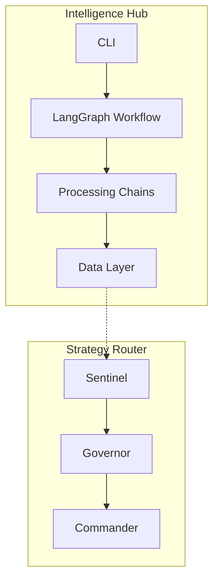
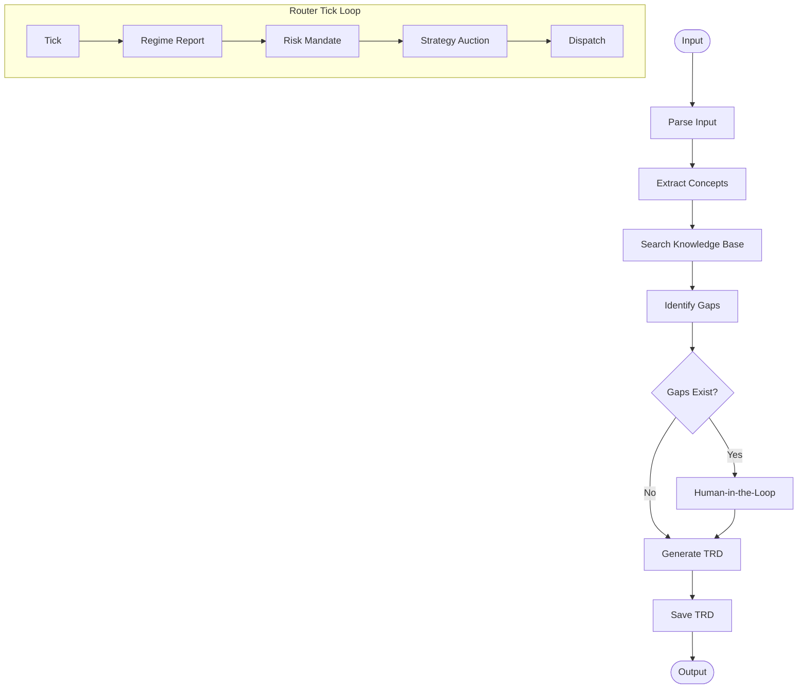
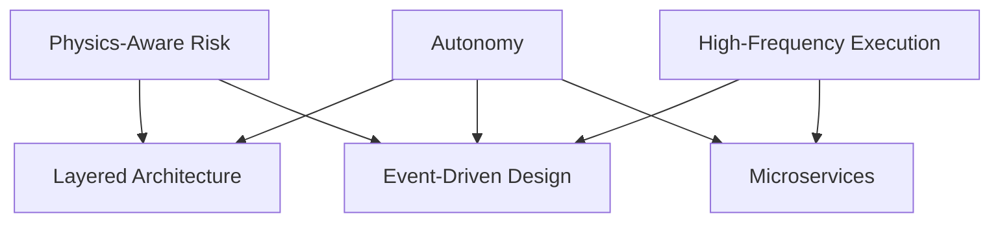

# Architecture Overview

<cite>
**Referenced Files in This Document**
- [README.md](file://README.md)
- [system_architecture.md](file://docs/architecture/system_architecture.md)
- [components.md](file://docs/architecture/components.md)
- [data_flow.md](file://docs/architecture/data_flow.md)
- [engine.py](file://src/router/engine.py)
- [sentinel.py](file://src/router/sentinel.py)
- [governor.py](file://src/router/governor.py)
- [commander.py](file://src/router/commander.py)
- [socket_server.py](file://src/router/socket_server.py)
- [sync.py](file://src/router/sync.py)
- [governor.py](file://src/risk/governor.py)
- [enhanced_kelly.py](file://src/position_sizing/enhanced_kelly.py)
- [cli.py](file://src/agents/cli.py)
- [brokers.yaml](file://config/brokers.yaml)
</cite>

## Table of Contents
1. [Introduction](#introduction)
2. [Dual-Hemisphere Architecture](#dual-hemisphere-architecture)
3. [Tri-Layer Sentient Architecture](#tri-layer-sentient-architecture)
4. [Multi-Agent System and Execution Layer](#multi-agent-system-and-execution-layer)
5. [Architectural Patterns](#architectural-patterns)
6. [System Boundaries and Component Interactions](#system-boundaries-and-component-interactions)
7. [Data Flow Patterns](#data-flow-patterns)
8. [Strategic Rationale](#strategic-rationale)
9. [Conclusion](#conclusion)

## Introduction
QUANTMIND-X is a dual-hemisphere trading architecture designed for autonomy, physics-aware risk management, and high-frequency trading execution. The system is organized around two primary hemispheres:
- The Intelligence Hub (The Brain): A multi-agent system that transforms unstructured trading insights into executable strategy artifacts.
- The Strategy Router (The Body): A real-time execution floor that governs risk, selects optimal strategies, and dispatches trades.

This document explains how the tri-layer sentient architecture enables autonomous decision-making, how the multi-agent system integrates with the execution layer, and how layered architecture, event-driven design, and microservices approaches support the project’s core objectives.

**Section sources**
- [README.md](file://README.md#L1-L80)

## Dual-Hemisphere Architecture
The Intelligence Hub (The Brain) and Strategy Router (The Body) represent complementary hemispheres:
- The Brain: Multi-agent orchestration (Analyst Agent, QuantCode Agent, QuantMind Co-pilot) that consumes NPRD outputs and synthesizes technical requirements.
- The Body: Real-time risk governance, strategy selection, and trade dispatch via Sentinel, Governor, and Commander.

**Diagram sources**
- [README.md](file://README.md#L7-L22)
- [engine.py](file://src/router/engine.py#L16-L67)

**Section sources**
- [README.md](file://README.md#L7-L22)
- [engine.py](file://src/router/engine.py#L16-L67)

## Tri-Layer Sentient Architecture
The Strategy Router implements a tri-layer sentient architecture that enables autonomous decision-making:
- Intelligence Layer (Sentinel): Aggregates sensor data into a unified Regime Report (chaos, stability, systemic risk).
- Compliance Layer (Governor): Calculates risk mandates based on physics and portfolio constraints.
- Execution Layer (Commander): Runs a strategy auction to select and dispatch bots aligned with the current market regime.

**Diagram sources**
- [sentinel.py](file://src/router/sentinel.py#L27-L84)
- [governor.py](file://src/router/governor.py#L16-L61)
- [commander.py](file://src/router/commander.py#L11-L55)
- [engine.py](file://src/router/engine.py#L16-L67)

**Section sources**
- [sentinel.py](file://src/router/sentinel.py#L27-L84)
- [governor.py](file://src/router/governor.py#L16-L61)
- [commander.py](file://src/router/commander.py#L11-L55)
- [engine.py](file://src/router/engine.py#L16-L67)

## Multi-Agent System and Execution Layer
The multi-agent system interacts with the execution layer through a cohesive loop:
- Agents (Analyst, QuantCode, Co-pilot) produce strategy artifacts and insights.
- The Router observes market conditions, computes risk, and auctions strategies to execution agents.
- Execution agents receive risk multipliers and dispatch trades with sub-5ms latency via ZMQ sockets.

**Diagram sources**
- [engine.py](file://src/router/engine.py#L29-L60)
- [socket_server.py](file://src/router/socket_server.py#L150-L325)

**Section sources**
- [engine.py](file://src/router/engine.py#L29-L60)
- [socket_server.py](file://src/router/socket_server.py#L150-L325)

## Architectural Patterns
The system employs several architectural patterns:
- Layered Architecture: Clear separation between Intelligence, Compliance, and Execution layers.
- Event-Driven Design: ZMQ sockets replace polling for sub-5ms trade event latency.
- Microservices Approach: Independent components (Sentinel, Governor, Commander) communicate via explicit interfaces and messages.

**Diagram sources**
- [socket_server.py](file://src/router/socket_server.py#L28-L35)
- [brokers.yaml](file://config/brokers.yaml#L8-L116)
- [governor.py](file://src/risk/governor.py#L42-L104)

**Section sources**
- [socket_server.py](file://src/router/socket_server.py#L28-L35)
- [brokers.yaml](file://config/brokers.yaml#L8-L116)
- [governor.py](file://src/risk/governor.py#L42-L104)

## System Boundaries and Component Interactions
System boundaries separate the Intelligence Hub from the Strategy Router and define external interfaces:
- External Interfaces include file-based inputs (NPRD JSON, strategy documents), ChromaDB, LLM APIs, and CLI.
- Internal boundaries separate the Router’s three layers and define clear handoffs for risk mandates and strategy dispatch.

**Diagram sources**
- [system_architecture.md](file://docs/architecture/system_architecture.md#L95-L122)
- [components.md](file://docs/architecture/components.md#L22-L68)

**Section sources**
- [system_architecture.md](file://docs/architecture/system_architecture.md#L95-L122)
- [components.md](file://docs/architecture/components.md#L22-L68)

## Data Flow Patterns
The system exhibits several data flow patterns:
- End-to-end TRD generation from NPRD/strategy documents through extraction, knowledge base search, gap detection, and TRD generation.
- Router tick loop: observe → govern → command → dispatch with risk multipliers.
- Event-driven trade lifecycle: trade open/close/modify with heartbeat and risk update messages.

**Diagram sources**
- [data_flow.md](file://docs/architecture/data_flow.md#L71-L278)
- [engine.py](file://src/router/engine.py#L29-L60)

**Section sources**
- [data_flow.md](file://docs/architecture/data_flow.md#L71-L278)
- [engine.py](file://src/router/engine.py#L29-L60)

## Strategic Rationale
The architecture choices align with QUANTMIND-X’s core objectives:
- Autonomy: Multi-agent system and Router layers operate independently, enabling decentralized decision-making.
- Physics-Aware Risk: Chaos sensors and Lyapunov proxies inform risk throttling and regime classification.
- High-Frequency Trading: ZMQ sockets deliver sub-5ms latency for trade events and risk updates.

**Diagram sources**
- [README.md](file://README.md#L25-L38)
- [socket_server.py](file://src/router/socket_server.py#L28-L35)

**Section sources**
- [README.md](file://README.md#L25-L38)
- [socket_server.py](file://src/router/socket_server.py#L28-L35)

## Conclusion
QUANTMIND-X’s dual-hemisphere architecture couples a multi-agent Intelligence Hub with a physics-aware Strategy Router. The tri-layer sentient design—Sentinel, Governor, and Commander—enables autonomous, risk-aware decision-making. Event-driven ZMQ sockets and layered architecture support sub-5ms execution latency, while microservices enable modular, extensible growth toward full autonomy and live deployment.

**Section sources**
- [README.md](file://README.md#L1-L80)
- [engine.py](file://src/router/engine.py#L16-L67)
- [socket_server.py](file://src/router/socket_server.py#L37-L121)