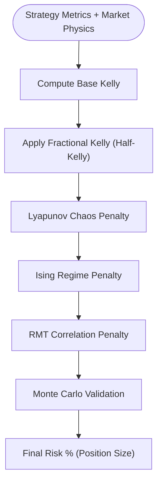
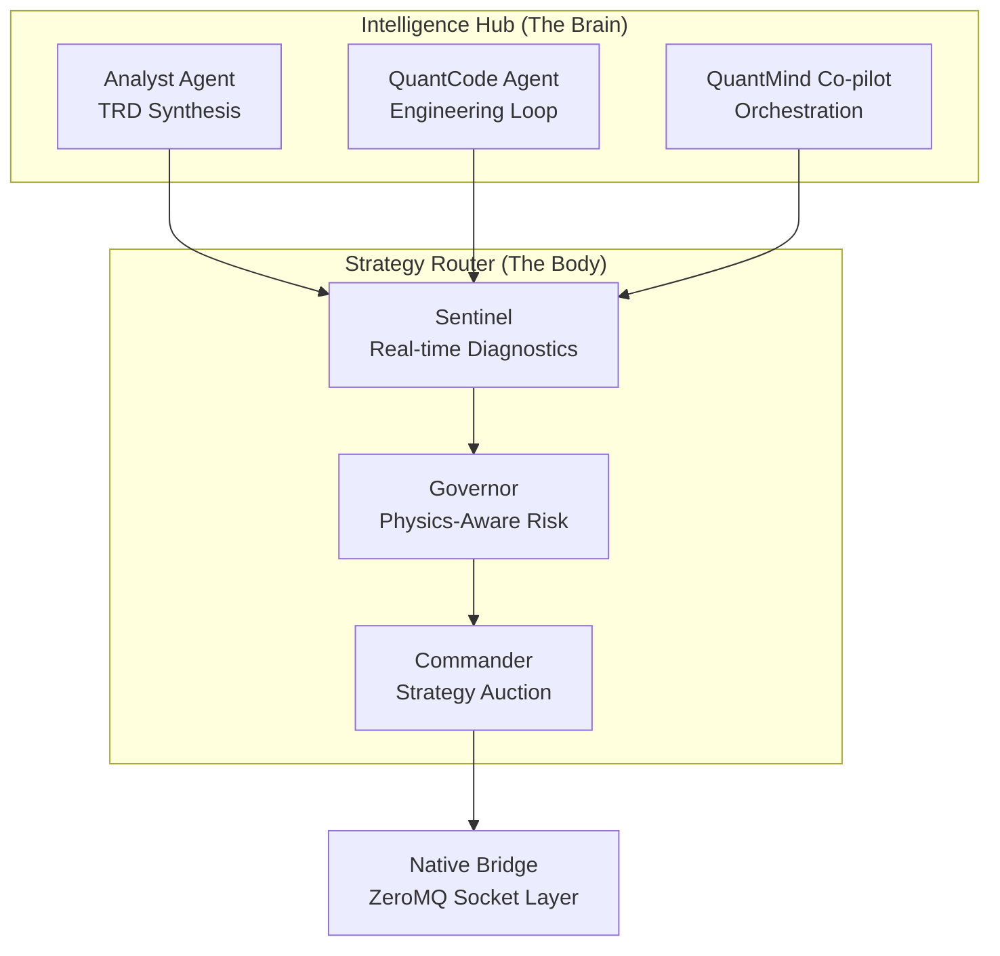
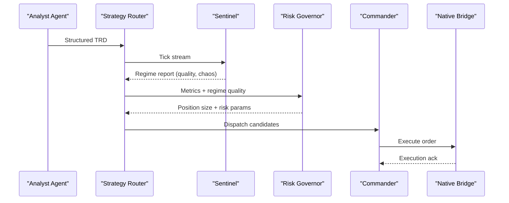
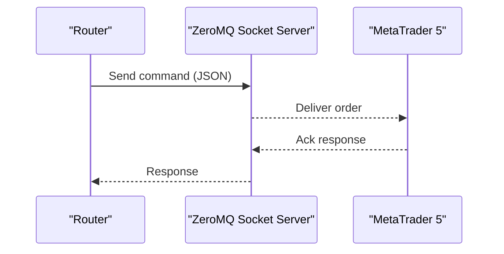
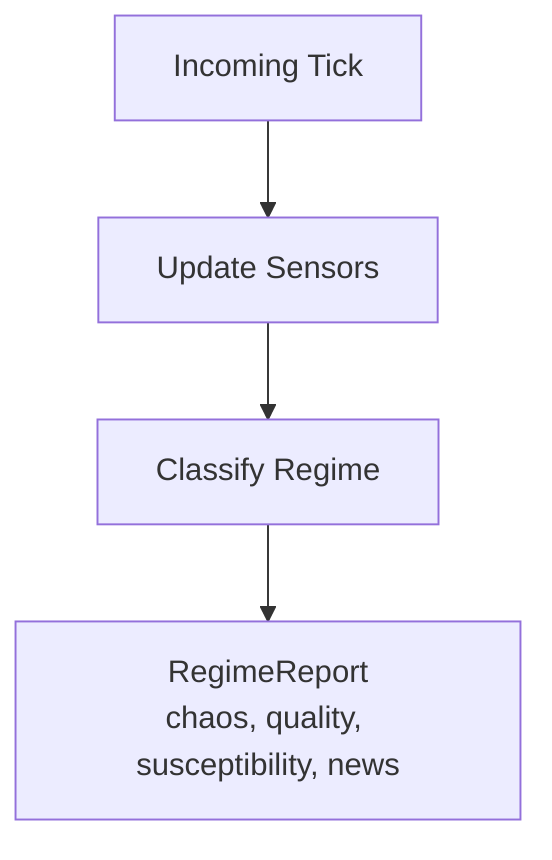
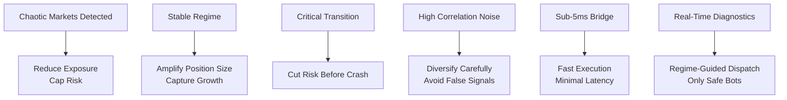

# Core Philosophy and Design Principles

<cite>
**Referenced Files in This Document**
- [README.md](file://README.md)
- [ECONOPHYSICS_INTEGRATION.md](file://docs/ECONOPHYSICS_INTEGRATION.md)
- [system_architecture.md](file://docs/architecture/system_architecture.md)
- [components.md](file://docs/architecture/components.md)
- [data_flow.md](file://docs/architecture/data_flow.md)
- [governor.py](file://src/risk/governor.py)
- [enhanced_kelly.py](file://src/position_sizing/enhanced_kelly.py)
- [sentinel.py](file://src/router/sentinel.py)
- [interface.py](file://src/router/interface.py)
- [socket_server.py](file://src/router/socket_server.py)
- [stress_test_router.py](file://stress_test_router.py)
- [deployment_guide.md](file://docs/v8/deployment_guide.md)
</cite>

## Table of Contents
1. [Introduction](#introduction)
2. [Philosophy: Markets Are Chaotic and Exploitable](#philosophy-markets-are-chaotic-and-exploitable)
3. [Econophysics-Driven Trading Systems](#econophysics-driven-trading-systems)
4. [Tri-Layer Sentient Architecture](#tri-layer-sentient-architecture)
5. [AI Creativity Meets Physics-Based Risk Management](#ai-creativity-meets-physics-based-risk-management)
6. [ZeroMQ: Low-Latency Communication](#zeromq-low-latency-communication)
7. [Real-Time Market Diagnostics](#real-time-market-diagnostics)
8. [Guiding All Technical Decisions](#guiding-all-technical-decisions)
9. [Conclusion](#conclusion)

## Introduction
This document codifies the QUANTMIND-X core philosophy and design principles. At its heart lies the belief that financial markets exhibit chaotic behavior that can be detected and exploited through chaos theory and econophysics. The platform integrates these scientific insights into a tri-layer sentient architecture that mirrors biological decision-making processes, while combining AI creativity with physics-based risk management. Strategic technology choices—such as ZeroMQ for sub-5ms communication and a real-time diagnostics engine—ensure responsiveness, reliability, and safety across all market regimes.

## Philosophy: Markets Are Chaotic and Exploitable
QUANTMIND-X is built on the premise that markets are inherently chaotic. Chaos theory provides a mathematical lens to quantify unpredictability and detect regime shifts before they become catastrophic events. Rather than fighting randomness, the system measures it and adapts:
- Chaos sensors monitor divergence rates to anticipate loss of predictability.
- When chaos exceeds thresholds, the system reduces exposure and tightens risk controls.
- During stable regimes, it amplifies position sizing to capture growth opportunities.

This philosophy underpins the entire stack: from real-time diagnostics to position sizing and execution.

**Section sources**
- [README.md](file://README.md#L27-L28)

## Econophysics-Driven Trading Systems
Econophysics offers rigorous, physics-inspired tools to understand and exploit market structure. QUANTMIND-X integrates several econophysics modules:
- Lyapunov Exponent: Measures chaos and instability; used to dampen position sizing when predictability collapses.
- Ising Model: Detects phase transitions and critical points; informs regime classification and risk adjustments.
- Random Matrix Theory (RMT): Filters noise from correlation matrices to improve diversification and reduce false positives.
- Monte Carlo: Validates strategy robustness and stress-tests sizing under uncertainty.
- Wavelet Transform: Enables multi-timeframe analysis to align trades with dominant cycles.

These modules feed directly into the Enhanced Kelly position sizing engine, which applies:
1) Fractional Kelly (conservative growth)
2) Hard risk caps (absolute per-trade limits)
3) Dynamic volatility scaling (ATR-based)

**Diagram sources**
- [ECONOPHYSICS_INTEGRATION.md](file://docs/ECONOPHYSICS_INTEGRATION.md#L69-L155)

**Section sources**
- [ECONOPHYSICS_INTEGRATION.md](file://docs/ECONOPHYSICS_INTEGRATION.md#L14-L17)
- [ECONOPHYSICS_INTEGRATION.md](file://docs/ECONOPHYSICS_INTEGRATION.md#L69-L155)
- [governor.py](file://src/risk/governor.py#L262-L297)
- [enhanced_kelly.py](file://src/position_sizing/enhanced_kelly.py#L128-L377)

## Tri-Layer Sentient Architecture
QUANTMIND-X employs a tri-layer sentient architecture that mirrors biological decision-making:
- Intelligence Hub (The Brain): Multi-agent system that consumes NPRD content and produces structured TRDs. It orchestrates analysis, engineering, and coordination using LangGraph and LLMs.
- Strategy Router (The Body): Real-time execution floor that governs risk and dispatches strategies. It comprises:
  - Sentinel: Real-time diagnostics using chaos sensors and regime detectors.
  - Governor: Physics-aware risk management and position sizing.
  - Commander: Strategy auction that selects and dispatches bots per regime.
- Native Bridge: Low-latency socket layer connecting Python analytics to MetaTrader 5.

**Diagram sources**
- [README.md](file://README.md#L11-L21)
- [system_architecture.md](file://docs/architecture/system_architecture.md#L125-L163)

**Section sources**
- [README.md](file://README.md#L11-L21)
- [system_architecture.md](file://docs/architecture/system_architecture.md#L125-L163)

## AI Creativity Meets Physics-Based Risk Management
QUANTMIND-X balances creative AI with disciplined risk:
- AI agents transform unstructured content into precise, executable TRDs and iteratively refine strategies.
- Risk governance enforces scientific constraints derived from chaos theory, phase transitions, and correlation noise.
- Position sizing is a physics-aware Kelly engine that:
  - Starts with fractional Kelly
  - Caps risk per trade
  - Scales dynamically with volatility and regime quality
  - Incorporates econophysics penalties for chaos and correlation

**Diagram sources**
- [system_architecture.md](file://docs/architecture/system_architecture.md#L202-L264)
- [sentinel.py](file://src/router/sentinel.py#L27-L63)
- [governor.py](file://src/risk/governor.py#L105-L224)

**Section sources**
- [system_architecture.md](file://docs/architecture/system_architecture.md#L125-L163)
- [sentinel.py](file://src/router/sentinel.py#L27-L63)
- [governor.py](file://src/risk/governor.py#L105-L224)
- [enhanced_kelly.py](file://src/position_sizing/enhanced_kelly.py#L128-L377)

## ZeroMQ: Low-Latency Communication
QUANTMIND-X uses ZeroMQ for sub-5ms integration between Python analytics and MetaTrader 5:
- PUSH socket for commands (dispatch orders).
- SUB socket for tick ingestion.
- Non-blocking sends/receives with polling for responsiveness.
- Latency tracking and warnings when targets are exceeded.
- Simulation mode when pyzmq is unavailable.

**Diagram sources**
- [interface.py](file://src/router/interface.py#L18-L80)
- [socket_server.py](file://src/router/socket_server.py#L76-L111)
- [deployment_guide.md](file://docs/v8/deployment_guide.md#L266-L294)

**Section sources**
- [README.md](file://README.md#L36-L37)
- [interface.py](file://src/router/interface.py#L18-L80)
- [socket_server.py](file://src/router/socket_server.py#L76-L111)
- [deployment_guide.md](file://docs/v8/deployment_guide.md#L266-L294)

## Real-Time Market Diagnostics
The Sentinel continuously monitors incoming ticks and aggregates signals into a unified regime report:
- Chaos score and regime quality inform whether the market is stable, trending, ranging, or chaotic.
- Susceptibility from the Ising model highlights critical transitions.
- News state flags kill zones to pause risky activity.
- Commander consults this report to authorize or withhold bot dispatches.

**Diagram sources**
- [sentinel.py](file://src/router/sentinel.py#L40-L63)

**Section sources**
- [README.md](file://README.md#L18-L21)
- [sentinel.py](file://src/router/sentinel.py#L27-L85)

## Guiding All Technical Decisions
These principles shape every decision:
- Chaos-first diagnostics drive risk policy; stable regimes allow growth, high chaos triggers protective caps.
- Econophysics sensors are cached and TTL-managed to preserve performance while maintaining freshness.
- Position sizing is layered: fractional Kelly, hard caps, and volatility scaling, with physics corrections.
- The tri-layer architecture ensures clear separation of concerns: analysis, diagnostics, and execution.
- ZeroMQ enables sub-5ms responsiveness between Python and MT5, validated by stress tests and latency logs.
- Real-time diagnostics are central to dispatch logic; bots are only authorized when regime quality exceeds thresholds.

**Diagram sources**
- [governor.py](file://src/risk/governor.py#L262-L297)
- [enhanced_kelly.py](file://src/position_sizing/enhanced_kelly.py#L301-L341)
- [sentinel.py](file://src/router/sentinel.py#L65-L85)
- [interface.py](file://src/router/interface.py#L18-L80)

**Section sources**
- [stress_test_router.py](file://stress_test_router.py#L18-L58)
- [governor.py](file://src/risk/governor.py#L105-L224)
- [enhanced_kelly.py](file://src/position_sizing/enhanced_kelly.py#L128-L377)

## Conclusion
QUANTMIND-X’s philosophy is rooted in chaos theory and econophysics, applied through a tri-layer sentient architecture that mirrors biological decision-making. AI creativity is harnessed to engineer robust strategies, while physics-based risk management ensures safety across all market regimes. ZeroMQ and real-time diagnostics enable sub-5ms responsiveness, and the entire system is designed so that scientific insights guide every technical choice—from sensors to execution.