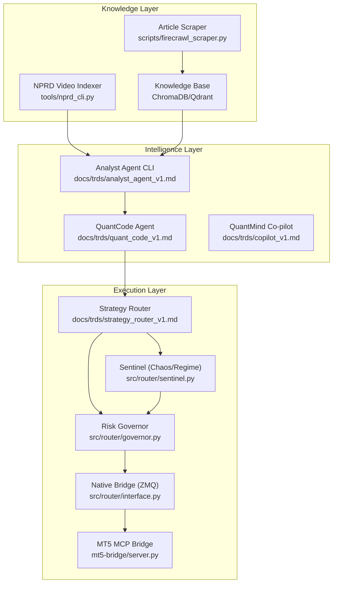
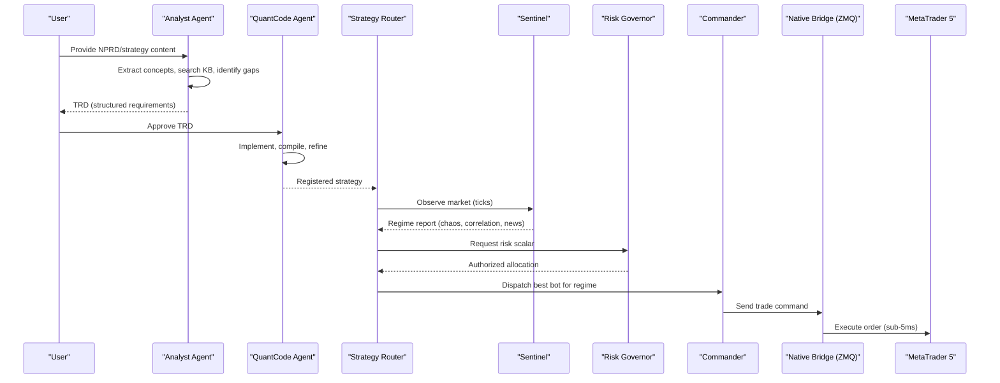
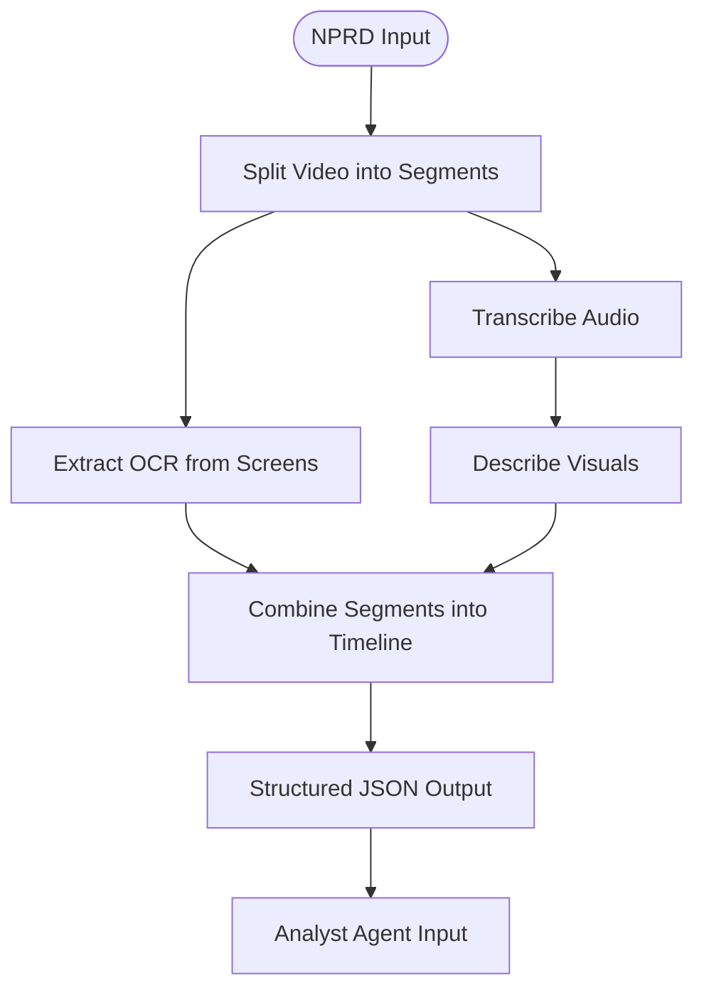
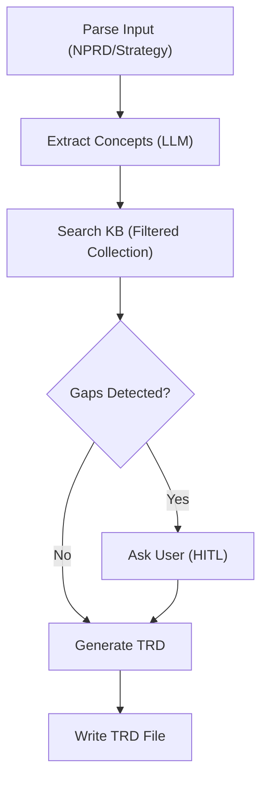
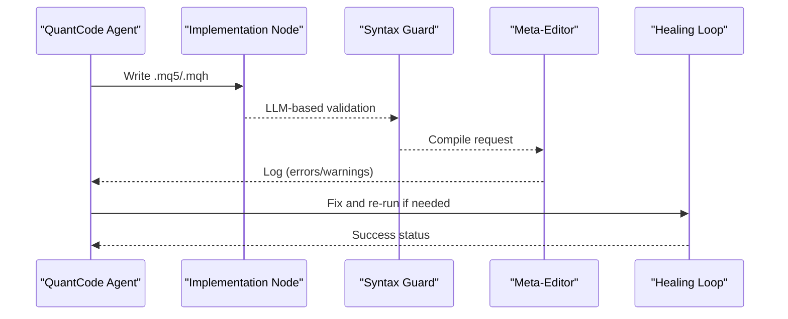
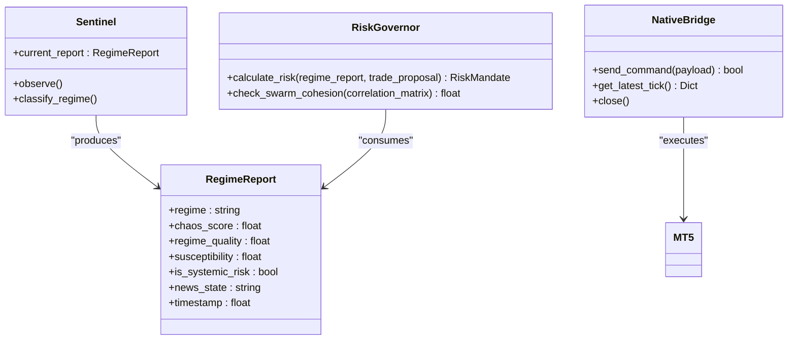
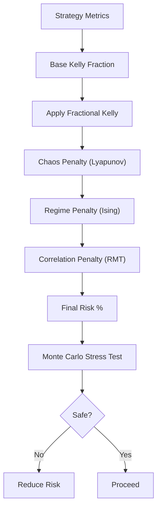
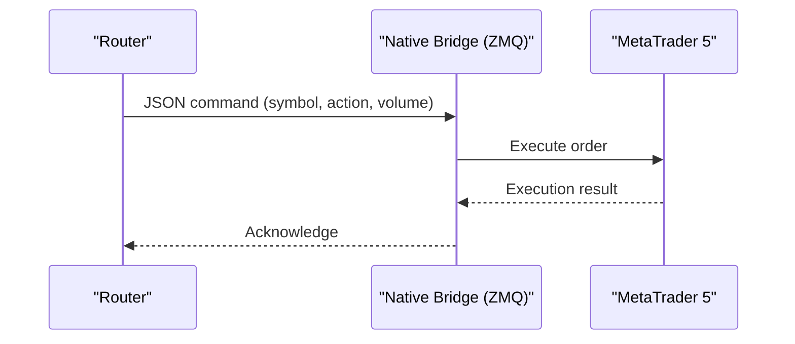
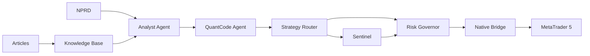

# Introduction and Purpose

<cite>
**Referenced Files in This Document**
- [README.md](file://README.md)
- [NPRD.md](file://NPRD.md)
- [docs/HANDOFF_QUANTMINDX.md](file://docs/HANDOFF_QUANTMINDX.md)
- [docs/ECONOPHYSICS_INTEGRATION.md](file://docs/ECONOPHYSICS_INTEGRATION.md)
- [docs/PROP_FIRMS_AND_ROUTER.md](file://docs/PROP_FIRMS_AND_ROUTER.md)
- [docs/trds/strategy_router_v1.md](file://docs/trds/strategy_router_v1.md)
- [docs/trds/analyst_agent_v1.md](file://docs/trds/analyst_agent_v1.md)
- [docs/trds/quant_code_v1.md](file://docs/trds/quant_code_v1.md)
- [docs/architecture/system_architecture.md](file://docs/architecture/system_architecture.md)
- [docs/user_guides/analyst_cli_manual.md](file://docs/user_guides/analyst_cli_manual.md)
- [src/router/sentinel.py](file://src/router/sentinel.py)
- [src/router/governor.py](file://src/router/governor.py)
- [src/router/interface.py](file://src/router/interface.py)
- [mt5-bridge/server.py](file://mt5-bridge/server.py)
- [brainstorming.md](file://brainstorming.md)
</cite>

## Table of Contents
1. [Introduction](#introduction)
2. [Project Structure](#project-structure)
3. [Core Components](#core-components)
4. [Architecture Overview](#architecture-overview)
5. [Detailed Component Analysis](#detailed-component-analysis)
6. [Dependency Analysis](#dependency-analysis)
7. [Performance Considerations](#performance-considerations)
8. [Troubleshooting Guide](#troubleshooting-guide)
9. [Conclusion](#conclusion)
10. [Appendices](#appendices)

## Introduction
QUANTMIND-X is an autonomous, physics-aware proprietary trading ecosystem designed to bridge neural pattern recognition (NPRD) and industrial-grade high-frequency trading through a tri-layer sentient architecture. The project’s mission is to deliver a robust, human-in-the-loop quantitative engineering factory that combines artificial intelligence with chaos theory for superior risk management. It targets three primary audiences:
- Quantitative researchers who seek to extract and codify trading insights from multimedia content
- Proprietary traders who require disciplined, rule-bound execution aligned with prop firm requirements
- AI/ML engineers who want to build and deploy production-grade trading systems with rigorous safety controls

QUANTMIND-X addresses gaps in traditional quantitative trading by combining:
- Multi-agent AI orchestration for strategy design and implementation
- Physics-aware risk management grounded in econophysics (chaos theory, phase transitions, correlation dynamics)
- High-frequency execution via a native bridge to MetaTrader 5 with sub-5ms latency

Its positioning in the broader quantitative trading ecosystem emphasizes:
- A scalable, modular architecture that integrates knowledge extraction, strategy synthesis, and automated deployment
- A strict risk governance stack that hardcodes safety limits and enforces discipline
- A phased roadmap toward live prop deployment, ensuring gradual validation and compliance

## Project Structure
At a high level, QUANTMIND-X comprises:
- A knowledge ingestion and extraction pipeline (NPRD and article scraping)
- A multi-agent system (Analyst Agent, QuantCode Agent, and a master orchestrator)
- A Strategy Router with physics-based diagnostics and risk governance
- A native bridge to MetaTrader 5 for low-latency execution
- Supporting infrastructure for backtesting, risk management, and deployment

**Diagram sources**
- [README.md](file://README.md#L1-L80)
- [docs/trds/analyst_agent_v1.md](file://docs/trds/analyst_agent_v1.md#L1-L67)
- [docs/trds/quant_code_v1.md](file://docs/trds/quant_code_v1.md#L1-L54)
- [docs/trds/strategy_router_v1.md](file://docs/trds/strategy_router_v1.md#L1-L104)
- [src/router/sentinel.py](file://src/router/sentinel.py#L1-L38)
- [src/router/governor.py](file://src/router/governor.py#L24-L61)
- [src/router/interface.py](file://src/router/interface.py#L1-L79)
- [mt5-bridge/server.py](file://mt5-bridge/server.py#L1-L84)

**Section sources**
- [README.md](file://README.md#L1-L80)
- [docs/HANDOFF_QUANTMINDX.md](file://docs/HANDOFF_QUANTMINDX.md#L94-L123)

## Core Components
- Neural Pattern Recognition (NPRD): A multimodal extraction pipeline that captures transcripts, visual descriptions, and OCR content from trading videos, preserving unbiased observations for downstream agents.
- Analyst Agent: Converts NPRD outputs and strategy documents into structured Technical Requirements Documents (TRDs), augmented by a filtered knowledge base and human-in-the-loop validation.
- QuantCode Agent: Implements production-grade MQL5 Expert Advisors and Python Router logic using a high-precision, iterative loop with compiler feedback and reusable component libraries.
- Strategy Router: A tri-layer control hierarchy that observes market physics, governs risk, and commands execution, ensuring that intelligence and compliance override strategy impulses.
- Risk Management: Physics-aware position sizing and three-tier risk controls, including chaos damping, phase transition guards, and systemic correlation adjustments.
- Native Bridge: A ZeroMQ-based integration layer enabling sub-5ms communication between Python intelligence and MetaTrader 5 execution.

**Section sources**
- [NPRD.md](file://NPRD.md#L1-L100)
- [docs/trds/analyst_agent_v1.md](file://docs/trds/analyst_agent_v1.md#L1-L67)
- [docs/trds/quant_code_v1.md](file://docs/trds/quant_code_v1.md#L1-L54)
- [docs/trds/strategy_router_v1.md](file://docs/trds/strategy_router_v1.md#L1-L104)
- [docs/ECONOPHYSICS_INTEGRATION.md](file://docs/ECONOPHYSICS_INTEGRATION.md#L67-L155)
- [src/router/interface.py](file://src/router/interface.py#L1-L79)

## Architecture Overview
QUANTMIND-X adopts a tri-layer sentient architecture:
- The Intelligence Hub (Analyst Agent, QuantCode Agent, Co-pilot) handles strategy lifecycle and synthesis.
- The Strategy Router (Sentinel, Governor, Commander) manages real-time diagnostics, risk governance, and trade dispatch.
- The Execution Layer (Native Bridge, MT5 MCP Bridge) provides low-latency, disciplined trading.

**Diagram sources**
- [docs/trds/strategy_router_v1.md](file://docs/trds/strategy_router_v1.md#L13-L19)
- [src/router/sentinel.py](file://src/router/sentinel.py#L17-L38)
- [src/router/governor.py](file://src/router/governor.py#L24-L54)
- [src/router/interface.py](file://src/router/interface.py#L43-L72)
- [mt5-bridge/server.py](file://mt5-bridge/server.py#L57-L84)

**Section sources**
- [README.md](file://README.md#L7-L38)
- [docs/trds/strategy_router_v1.md](file://docs/trds/strategy_router_v1.md#L1-L104)

## Detailed Component Analysis

### Neural Pattern Recognition (NPRD)
NPRD transforms unstructured video content into structured, unbiased data for strategy extraction. It integrates multimodal inputs (audio transcription, visual descriptions, OCR) and supports multiple model providers. The design principle is “dumb extraction,” preventing model collapse and ensuring downstream agents interpret the data.

**Diagram sources**
- [NPRD.md](file://NPRD.md#L7-L66)

**Section sources**
- [NPRD.md](file://NPRD.md#L1-L100)
- [docs/HANDOFF_QUANTMINDX.md](file://docs/HANDOFF_QUANTMINDX.md#L250-L296)

### Analyst Agent CLI
The Analyst Agent CLI converts NPRD outputs and strategy documents into structured TRDs, leveraging a filtered knowledge base and human-in-the-loop validation. It orchestrates a LangGraph workflow with explicit state transitions and HITL prompts for missing information.

**Diagram sources**
- [docs/architecture/system_architecture.md](file://docs/architecture/system_architecture.md#L528-L537)
- [docs/user_guides/analyst_cli_manual.md](file://docs/user_guides/analyst_cli_manual.md#L524-L567)

**Section sources**
- [docs/trds/analyst_agent_v1.md](file://docs/trds/analyst_agent_v1.md#L1-L67)
- [docs/architecture/system_architecture.md](file://docs/architecture/system_architecture.md#L1-L669)
- [docs/user_guides/analyst_cli_manual.md](file://docs/user_guides/analyst_cli_manual.md#L1-L800)

### QuantCode Agent
The QuantCode Agent implements production-grade MQL5 Expert Advisors and Python Router logic using a high-precision, iterative loop with compiler feedback and reusable component libraries. It supports @General and @PropFirm modes and manages a centralized asset hub for high-volume bot orchestration.

**Diagram sources**
- [docs/trds/quant_code_v1.md](file://docs/trds/quant_code_v1.md#L15-L24)

**Section sources**
- [docs/trds/quant_code_v1.md](file://docs/trds/quant_code_v1.md#L1-L54)

### Strategy Router (Sentinel, Governor, Commander)
The Strategy Router implements a tri-layer control hierarchy:
- Sentinel aggregates sensor data into a unified regime report (chaos score, correlation, news state).
- Governor calculates risk scalars using physics-based constraints (chaos, phase transitions, systemic correlation).
- Commander dispatches the best bot for the current market regime.

**Diagram sources**
- [src/router/sentinel.py](file://src/router/sentinel.py#L17-L38)
- [src/router/governor.py](file://src/router/governor.py#L24-L61)
- [src/router/interface.py](file://src/router/interface.py#L18-L79)

**Section sources**
- [docs/trds/strategy_router_v1.md](file://docs/trds/strategy_router_v1.md#L1-L104)
- [src/router/sentinel.py](file://src/router/sentinel.py#L1-L38)
- [src/router/governor.py](file://src/router/governor.py#L24-L61)
- [src/router/interface.py](file://src/router/interface.py#L1-L79)

### Physics-Aware Risk Management
QUANTMIND-X integrates econophysics to enhance position sizing and risk controls:
- Chaos damping via Lyapunov exponent thresholds
- Phase transition guards using Ising model susceptibility
- Correlation adjustments via Random Matrix Theory (RMT)
- Monte Carlo validation for statistical significance

**Diagram sources**
- [docs/ECONOPHYSICS_INTEGRATION.md](file://docs/ECONOPHYSICS_INTEGRATION.md#L67-L155)

**Section sources**
- [docs/ECONOPHYSICS_INTEGRATION.md](file://docs/ECONOPHYSICS_INTEGRATION.md#L1-L557)

### Native Bridge and MT5 Integration
The native bridge provides sub-5ms communication between Python and MetaTrader 5 using ZeroMQ, enabling rapid command dispatch and tick ingestion. The MT5 MCP bridge exposes a comprehensive set of trading functions for order management, account monitoring, and market data.

**Diagram sources**
- [src/router/interface.py](file://src/router/interface.py#L43-L72)
- [mt5-bridge/server.py](file://mt5-bridge/server.py#L57-L84)

**Section sources**
- [src/router/interface.py](file://src/router/interface.py#L1-L79)
- [mt5-bridge/server.py](file://mt5-bridge/server.py#L1-L84)

## Dependency Analysis
QUANTMIND-X exhibits layered cohesion with clear separation of concerns:
- Knowledge ingestion depends on NPRD and article scraping
- Intelligence layer depends on the knowledge base and LLM providers
- Strategy Router depends on physics sensors and risk governance
- Execution layer depends on the native bridge and MT5 MCP server

**Diagram sources**
- [docs/HANDOFF_QUANTMINDX.md](file://docs/HANDOFF_QUANTMINDX.md#L94-L123)
- [docs/trds/analyst_agent_v1.md](file://docs/trds/analyst_agent_v1.md#L1-L67)
- [docs/trds/quant_code_v1.md](file://docs/trds/quant_code_v1.md#L1-L54)
- [docs/trds/strategy_router_v1.md](file://docs/trds/strategy_router_v1.md#L1-L104)

**Section sources**
- [docs/HANDOFF_QUANTMINDX.md](file://docs/HANDOFF_QUANTMINDX.md#L425-L466)

## Performance Considerations
- Latency: Sub-5ms ZMQ bridge enables high-frequency execution suitable for scalping
- Throughput: LangGraph workflow and parallel KB searches support batch processing
- Reliability: Checkpointing, fallback providers, and graceful degradation ensure robust operation
- Scalability: Modular design allows incremental expansion to multi-strategy portfolios and multi-asset support

[No sources needed since this section provides general guidance]

## Troubleshooting Guide
Common operational issues and resolutions:
- ChromaDB connection failures: Verify path, permissions, and reinstall if necessary
- Missing KB collection: Recreate the filtered collection using the provided script
- Empty KB search results: Confirm collection count and test manual queries
- LLM API errors: Validate API keys and provider configuration
- Broker connectivity: Ensure MT5 initialization and network stability

**Section sources**
- [docs/user_guides/analyst_cli_manual.md](file://docs/user_guides/analyst_cli_manual.md#L720-L800)
- [docs/PROP_FIRMS_AND_ROUTER.md](file://docs/PROP_FIRMS_AND_ROUTER.md#L381-L407)

## Conclusion
QUANTMIND-X advances automated trading by combining multi-agent AI with physics-aware risk management. Its tri-layer sentient architecture ensures that intelligence and safety consistently override strategy impulses, while its phased roadmap toward live prop deployment provides a disciplined path to production readiness. By targeting quantitative researchers, proprietary traders, and AI/ML engineers, it fills critical gaps in traditional quantitative trading through unbiased knowledge extraction, structured strategy synthesis, and industrial-grade execution.

[No sources needed since this section summarizes without analyzing specific files]

## Appendices
- Target audience alignment: The ecosystem supports three primary user types with tailored workflows and safety controls
- Prop firm compatibility: Three-tier risk controls, ATR-based risk, and lifecycle tagging align with prop firm requirements
- Execution focus: Scalping emphasis and HFT-friendly broker research inform infrastructure choices

**Section sources**
- [docs/PROP_FIRMS_AND_ROUTER.md](file://docs/PROP_FIRMS_AND_ROUTER.md#L21-L67)
- [brainstorming.md](file://brainstorming.md#L37-L49)