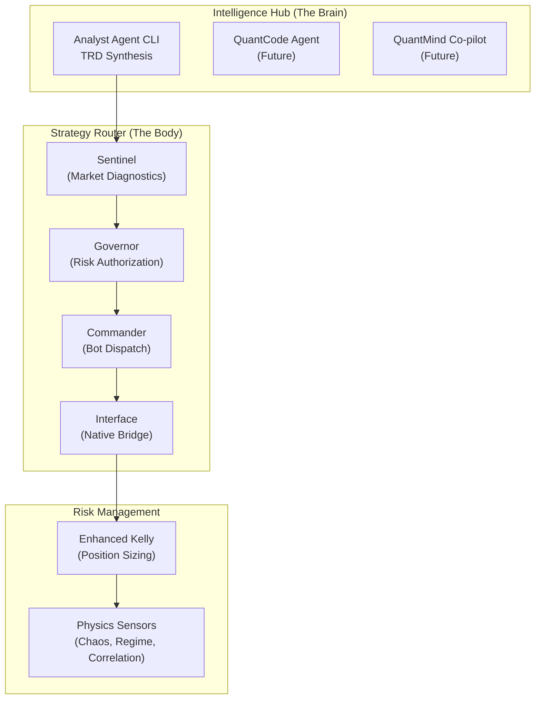
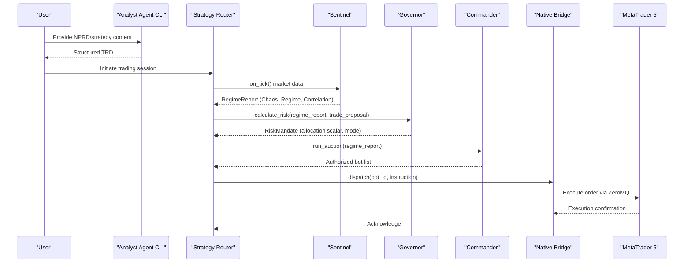
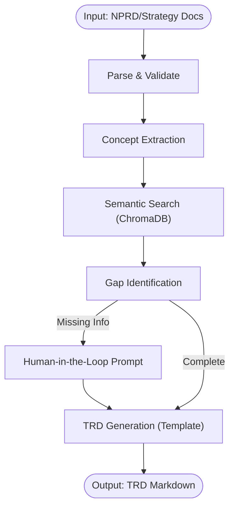
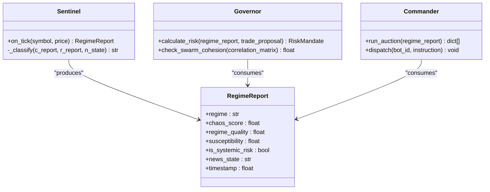
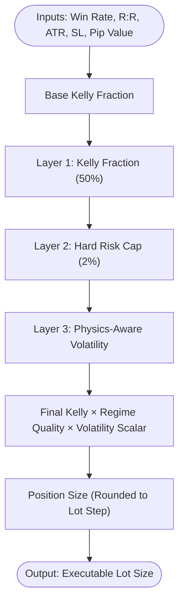
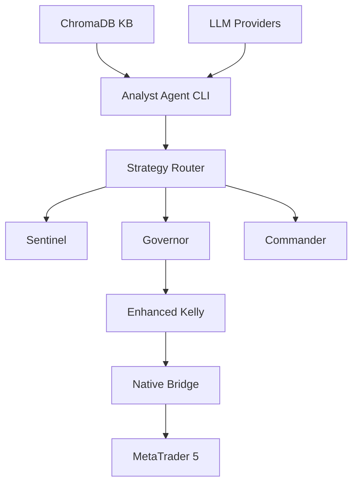

# Project Overview

<cite>
**Referenced Files in This Document**
- [README.md](file://README.md)
- [system_architecture.md](file://docs/architecture/system_architecture.md)
- [analyst_agent_v1.md](file://docs/trds/analyst_agent_v1.md)
- [strategy_router_v1.md](file://docs/trds/strategy_router_v1.md)
- [enhanced_kelly_position_sizing_v1.md](file://docs/trds/enhanced_kelly_position_sizing_v1.md)
- [ECONOPHYSICS_INTEGRATION.md](file://docs/ECONOPHYSICS_INTEGRATION.md)
- [PROP_FIRMS_AND_ROUTER.md](file://docs/PROP_FIRMS_AND_ROUTER.md)
- [sentinel.py](file://src/router/sentinel.py)
- [governor.py](file://src/router/governor.py)
- [commander.py](file://src/router/commander.py)
- [enhanced_kelly.py](file://src/position_sizing/enhanced_kelly.py)
- [risk_governor.py](file://src/risk/governor.py)
</cite>

## Table of Contents
1. [Introduction](#introduction)
2. [Project Structure](#project-structure)
3. [Core Components](#core-components)
4. [Architecture Overview](#architecture-overview)
5. [Detailed Component Analysis](#detailed-component-analysis)
6. [Dependency Analysis](#dependency-analysis)
7. [Performance Considerations](#performance-considerations)
8. [Troubleshooting Guide](#troubleshooting-guide)
9. [Conclusion](#conclusion)

## Introduction
QUANTMIND-X is an autonomous, physics-aware proprietary trading ecosystem that bridges neural pattern recognition (NPRD) and industrial-grade high-frequency trading through a tri-layer sentient architecture. The project’s mission is to transform unstructured trading insights into executable, risk-managed strategies with minimal human intervention, while maintaining strict compliance and scientific rigor.

At its core, QUANTMIND-X comprises:
- A dual-hemisphere architecture: The Intelligence Hub (The Brain) and the Strategy Router (The Body)
- A physics-first risk management system combining chaos theory with enhanced Kelly position sizing
- A scalable, modular design optimized for MetaTrader 5 and real-time execution

This overview introduces the project’s philosophy, technical positioning, and strategic role in modern quantitative trading ecosystems.

**Section sources**
- [README.md](file://README.md#L1-L80)

## Project Structure
The repository organizes functionality across ingestion, knowledge management, agent orchestration, strategy execution, and risk governance. The tri-layer architecture is implemented as:
- Intelligence Hub (The Brain): Multi-agent system for strategy synthesis and refinement
- Strategy Router (The Body): Real-time market diagnostics, risk governance, and dispatch
- Risk Management: Physics-aware position sizing and portfolio controls

**Diagram sources**
- [system_architecture.md](file://docs/architecture/system_architecture.md#L202-L264)
- [strategy_router_v1.md](file://docs/trds/strategy_router_v1.md#L1-L236)
- [enhanced_kelly_position_sizing_v1.md](file://docs/trds/enhanced_kelly_position_sizing_v1.md#L1-L234)

**Section sources**
- [system_architecture.md](file://docs/architecture/system_architecture.md#L1-L669)
- [analyst_agent_v1.md](file://docs/trds/analyst_agent_v1.md#L1-L67)
- [strategy_router_v1.md](file://docs/trds/strategy_router_v1.md#L1-L236)
- [enhanced_kelly_position_sizing_v1.md](file://docs/trds/enhanced_kelly_position_sizing_v1.md#L1-L234)

## Core Components
- Intelligence Hub (The Brain)
  - Analyst Agent CLI: Converts NPRD transcripts and strategy documents into structured TRDs using semantic search and human-in-the-loop validation.
  - QuantCode Agent: Specialized engineering agent for iterative strategy development and refinement.
  - QuantMind Co-pilot: Master orchestrator coordinating agent workflows and global task queuing.

- Strategy Router (The Body)
  - Sentinel: Real-time market diagnostics using Lyapunov chaos sensors, Ising regime detection, and RMT correlation filters.
  - Governor: Enforces compliance and risk stacking, including Prop Firm Survival quadratic throttling.
  - Commander: Runs a strategy auction to dispatch the best bots for the current market regime.
  - Interface: Native bridge (ZeroMQ) for sub-5ms integration between Python intelligence and MetaTrader 5 execution.

- Risk Management
  - Enhanced Kelly Position Sizing: 3-layer protection combining fractional Kelly, hard risk caps, and dynamic volatility adjustment.
  - Physics-Aware Risk: Chaos, criticality, and systemic risk penalties integrated into sizing decisions.

**Section sources**
- [README.md](file://README.md#L7-L38)
- [analyst_agent_v1.md](file://docs/trds/analyst_agent_v1.md#L1-L67)
- [strategy_router_v1.md](file://docs/trds/strategy_router_v1.md#L1-L236)
- [enhanced_kelly_position_sizing_v1.md](file://docs/trds/enhanced_kelly_position_sizing_v1.md#L1-L234)
- [ECONOPHYSICS_INTEGRATION.md](file://docs/ECONOPHYSICS_INTEGRATION.md#L1-L557)

## Architecture Overview
The tri-layer sentient architecture ensures that market physics and account safety consistently override strategy impulses. The Intelligence Hub synthesizes strategies, while the Strategy Router governs execution in real time.

**Diagram sources**
- [system_architecture.md](file://docs/architecture/system_architecture.md#L266-L308)
- [strategy_router_v1.md](file://docs/trds/strategy_router_v1.md#L1-L236)
- [sentinel.py](file://src/router/sentinel.py#L1-L85)
- [governor.py](file://src/router/governor.py#L1-L62)
- [commander.py](file://src/router/commander.py#L1-L56)

**Section sources**
- [system_architecture.md](file://docs/architecture/system_architecture.md#L202-L308)
- [strategy_router_v1.md](file://docs/trds/strategy_router_v1.md#L1-L236)

## Detailed Component Analysis

### Intelligence Hub (The Brain)
- Analyst Agent CLI
  - Purpose: Convert NPRD transcripts and strategy documents into structured TRDs.
  - Processing: Orchestrated via LangGraph state machine with human-in-the-loop validation.
  - Integration: ChromaDB-backed semantic search and template-based TRD generation.

**Diagram sources**
- [system_architecture.md](file://docs/architecture/system_architecture.md#L202-L264)
- [analyst_agent_v1.md](file://docs/trds/analyst_agent_v1.md#L1-L67)

**Section sources**
- [system_architecture.md](file://docs/architecture/system_architecture.md#L1-L669)
- [analyst_agent_v1.md](file://docs/trds/analyst_agent_v1.md#L1-L67)

### Strategy Router (The Body)
- Sentinel
  - Role: Market diagnostics using ChaosSensor (Lyapunov), RegimeSensor (Ising), CorrelationSensor (RMT), and NewsSensor.
  - Output: RegimeReport with chaos score, regime quality, and systemic risk flags.

- Governor
  - Role: Calculates risk mandates based on physics and portfolio constraints, applying emergency clamps and swarm correlation checks.

- Commander
  - Role: Executes strategy auctions, ranks bots by performance, and selects top candidates per regime.

- Interface
  - Role: Native bridge (ZeroMQ) for sub-5ms command dispatch to MetaTrader 5.

**Diagram sources**
- [sentinel.py](file://src/router/sentinel.py#L1-L85)
- [governor.py](file://src/router/governor.py#L1-L62)
- [commander.py](file://src/router/commander.py#L1-L56)

**Section sources**
- [strategy_router_v1.md](file://docs/trds/strategy_router_v1.md#L1-L236)
- [sentinel.py](file://src/router/sentinel.py#L1-L85)
- [governor.py](file://src/router/governor.py#L1-L62)
- [commander.py](file://src/router/commander.py#L1-L56)

### Risk Management: Physics-Aware Enhanced Kelly
- Philosophy: Combine chaos theory with enhanced Kelly position sizing for robust risk control.
- Layers:
  1) Kelly Fraction: Fractional Kelly (default 50%) to capture growth without full-Kelly ruin.
  2) Hard Risk Cap: Absolute per-trade cap (default 2%) to protect capital.
  3) Dynamic Volatility Adjustment: Real-time scaling based on ATR divergence and regime quality.

**Diagram sources**
- [enhanced_kelly_position_sizing_v1.md](file://docs/trds/enhanced_kelly_position_sizing_v1.md#L19-L186)
- [enhanced_kelly.py](file://src/position_sizing/enhanced_kelly.py#L128-L377)
- [risk_governor.py](file://src/risk/governor.py#L105-L224)

**Section sources**
- [enhanced_kelly_position_sizing_v1.md](file://docs/trds/enhanced_kelly_position_sizing_v1.md#L1-L234)
- [enhanced_kelly.py](file://src/position_sizing/enhanced_kelly.py#L1-L418)
- [risk_governor.py](file://src/risk/governor.py#L1-L447)

### Conceptual Overview
Beginners can think of QUANTMIND-X as a two-stage factory:
- Stage 1 (The Brain): Extract, synthesize, and validate trading ideas from unstructured content.
- Stage 2 (The Body): Observe market conditions, enforce risk rules, and dispatch the right strategies at the right time.

Experts will recognize the tri-layer architecture as a disciplined hybrid of:
- Neural pattern recognition (NPRD) for idea generation
- Physics-aware risk management for sizing and allocation
- Real-time execution governance for compliance and performance

**Section sources**
- [README.md](file://README.md#L1-L80)
- [ECONOPHYSICS_INTEGRATION.md](file://docs/ECONOPHYSICS_INTEGRATION.md#L1-L557)

## Dependency Analysis
The system exhibits layered cohesion with explicit coupling between components:
- Intelligence Hub depends on the Knowledge Base (ChromaDB) and LLM providers for TRD synthesis.
- Strategy Router depends on physics sensors and governance logic for risk authorization.
- Risk Management integrates with both Router and execution layer for sizing and compliance.

**Diagram sources**
- [system_architecture.md](file://docs/architecture/system_architecture.md#L202-L264)
- [strategy_router_v1.md](file://docs/trds/strategy_router_v1.md#L1-L236)
- [enhanced_kelly_position_sizing_v1.md](file://docs/trds/enhanced_kelly_position_sizing_v1.md#L1-L234)

**Section sources**
- [system_architecture.md](file://docs/architecture/system_architecture.md#L1-L669)
- [strategy_router_v1.md](file://docs/trds/strategy_router_v1.md#L1-L236)
- [enhanced_kelly_position_sizing_v1.md](file://docs/trds/enhanced_kelly_position_sizing_v1.md#L1-L234)

## Performance Considerations
- Sub-5ms native bridge latency between Python and MetaTrader 5
- Physics sensors and risk calculations optimized for real-time tick processing
- Caching and tiered risk controls minimize redundant computations
- Portfolio scaling prevents over-leverage during multi-bot deployments

[No sources needed since this section provides general guidance]

## Troubleshooting Guide
Common issues and resolutions:
- TRD synthesis stalls due to missing information: Enable human-in-the-loop prompts and validate required fields.
- Router misclassification under chaos: Verify Lyapunov thresholds and systemic risk flags.
- Excessive position sizing: Confirm hard risk caps and volatility adjustments are active.
- Prop firm compliance failures: Align presets and governance rules with firm requirements.

**Section sources**
- [system_architecture.md](file://docs/architecture/system_architecture.md#L409-L455)
- [strategy_router_v1.md](file://docs/trds/strategy_router_v1.md#L1-L236)
- [enhanced_kelly_position_sizing_v1.md](file://docs/trds/enhanced_kelly_position_sizing_v1.md#L1-L234)
- [PROP_FIRMS_AND_ROUTER.md](file://docs/PROP_FIRMS_AND_ROUTER.md#L1-L773)

## Conclusion
QUANTMIND-X redefines proprietary trading by merging neural pattern recognition with physics-aware risk management and real-time execution governance. Its tri-layer sentient architecture ensures that market intelligence, disciplined controls, and compliant execution work in harmony. Whether you are a beginner exploring strategy synthesis or an experienced developer optimizing risk engines, QUANTMIND-X offers a principled, scalable foundation for autonomous trading.

[No sources needed since this section summarizes without analyzing specific files]