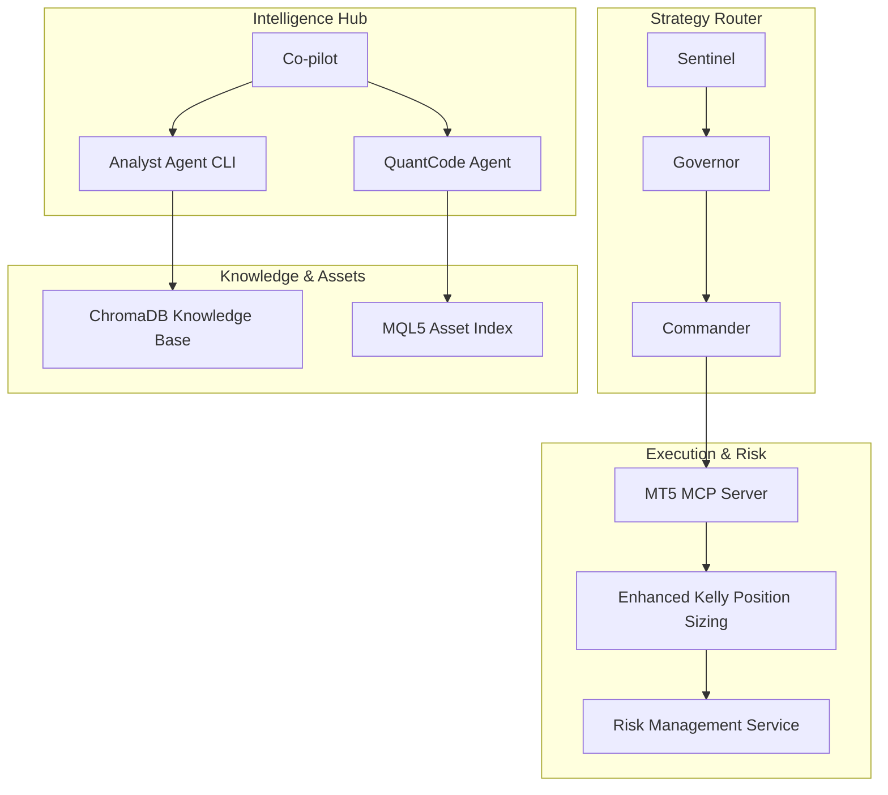
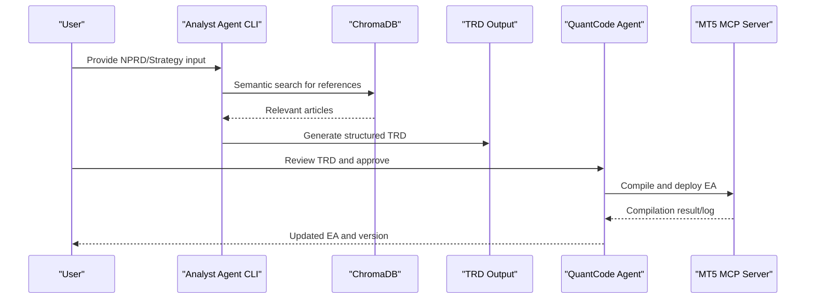
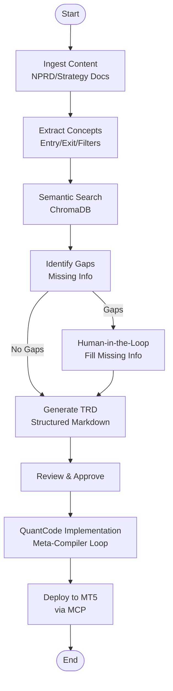
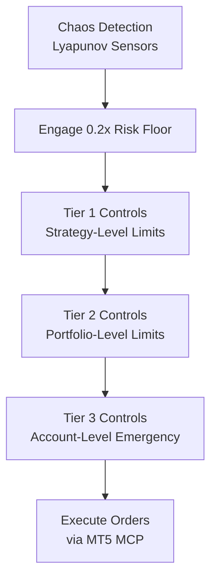
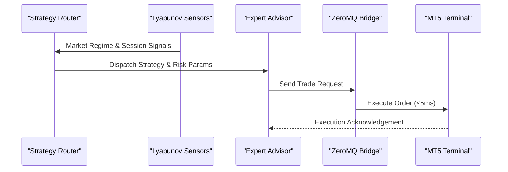
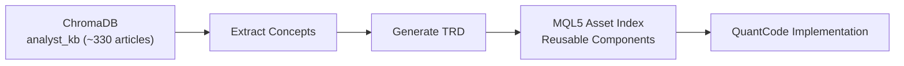
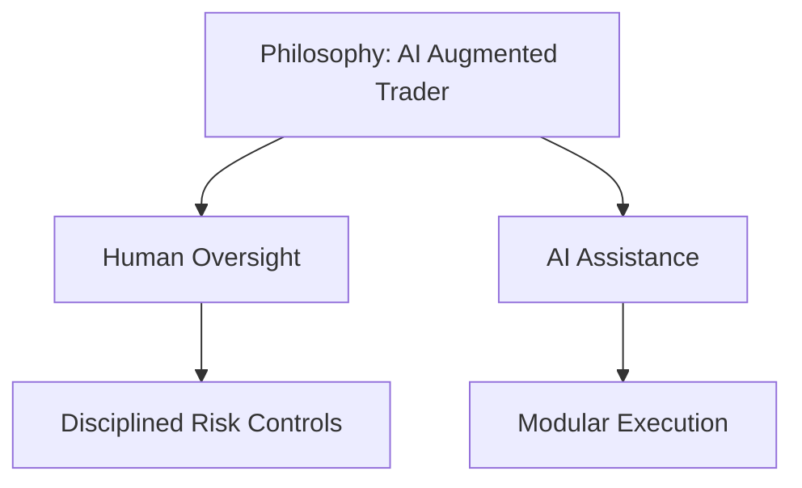
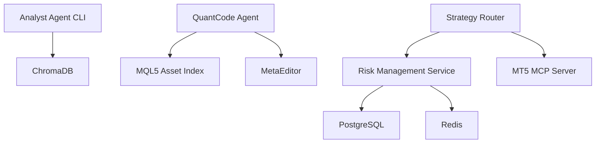

# Target Audience and Use Cases

<cite>
**Referenced Files in This Document**
- [README.md](file://README.md)
- [analyst_cli_manual.md](file://docs/user_guides/analyst_cli_manual.md)
- [analyst_agent_cli_v1.md](file://docs/trds/analyst_agent_cli_v1.md)
- [mql5_asset_index.md](file://docs/knowledge/mql5_asset_index.md)
- [HANDOFF_QUANTMINDX.md](file://docs/HANDOFF_QUANTMINDX.md)
- [enhanced_kelly_user_guide.md](file://docs/user_guides/enhanced_kelly_user_guide.md)
- [risk_management_component_v1.md](file://docs/trds/risk_management_component_v1.md)
- [PROP_FIRMS_AND_ROUTER.md](file://docs/PROP_FIRMS_AND_ROUTER.md)
- [user_stories.md](file://docs/ui_discussion/user_stories.md)
- [cli.py](file://src/agents/cli.py)
- [quant_code_v1.md](file://docs/trds/quant_code_v1.md)
</cite>

## Table of Contents
1. [Introduction](#introduction)
2. [Project Structure](#project-structure)
3. [Core Components](#core-components)
4. [Architecture Overview](#architecture-overview)
5. [Detailed Component Analysis](#detailed-component-analysis)
6. [Dependency Analysis](#dependency-analysis)
7. [Performance Considerations](#performance-considerations)
8. [Troubleshooting Guide](#troubleshooting-guide)
9. [Conclusion](#conclusion)
10. [Appendices](#appendices)

## Introduction
QUANTMIND-X is an autonomous, physics-aware proprietary trading ecosystem that bridges neural pattern recognition (NPRD) and industrial-grade high-frequency trading through a tri-layer sentient architecture. It enables quantitative researchers, proprietary trading firms, hedge funds, and AI/ML engineers to collaboratively develop, validate, and deploy risk-managed trading systems with strong human-in-the-loop governance.

## Project Structure
The platform is organized around:
- Intelligence Hub (Analyst Agent, QuantCode Agent, Co-pilot) for strategy lifecycle orchestration
- Strategy Router (Sentinel, Governor, Commander) for real-time risk and execution management
- Knowledge Base and CLI tools for ingestion, extraction, and TRD generation
- Risk management and position sizing engines
- MT5 MCP server for broker integration and execution

**Diagram sources**
- [README.md](file://README.md#L7-L23)
- [analyst_cli_manual.md](file://docs/user_guides/analyst_cli_manual.md#L43-L50)
- [mql5_asset_index.md](file://docs/knowledge/mql5_asset_index.md#L27-L44)
- [PROP_FIRMS_AND_ROUTER.md](file://docs/PROP_FIRMS_AND_ROUTER.md#L83-L109)
- [enhanced_kelly_user_guide.md](file://docs/user_guides/enhanced_kelly_user_guide.md#L18-L33)

**Section sources**
- [README.md](file://README.md#L1-L80)
- [analyst_cli_manual.md](file://docs/user_guides/analyst_cli_manual.md#L1-L120)
- [mql5_asset_index.md](file://docs/knowledge/mql5_asset_index.md#L1-L80)
- [PROP_FIRMS_AND_ROUTER.md](file://docs/PROP_FIRMS_AND_ROUTER.md#L1-L120)
- [enhanced_kelly_user_guide.md](file://docs/user_guides/enhanced_kelly_user_guide.md#L1-L80)

## Core Components
- Analyst Agent CLI: Converts unstructured trading content (NPRD/video outputs, strategy documents) into structured TRD markdown files with human-in-the-loop support and ChromaDB-backed knowledge base integration.
- QuantCode Agent: An autonomous engineering agent that implements production-grade MQL5 Expert Advisors and Python Router logic using a meta-compiler feedback loop and reusable asset hub.
- Strategy Router: Real-time market diagnostics and dispatch system enforcing risk stacking and compliance, with session- and regime-based routing.
- Enhanced Kelly Position Sizing: Scientifically optimal position sizing combining Kelly Criterion with multi-layer safety protections for prop firm and retail accounts.
- Risk Management Service: Centralized Python service enforcing risk limits across multiple bots, supporting both prop firm and personal account modes with real-time monitoring.
- MT5 MCP Server: Broker integration for MetaTrader 5, exposing tools for market data, trading, and account management.

**Section sources**
- [analyst_cli_manual.md](file://docs/user_guides/analyst_cli_manual.md#L24-L61)
- [quant_code_v1.md](file://docs/trds/quant_code_v1.md#L1-L54)
- [PROP_FIRMS_AND_ROUTER.md](file://docs/PROP_FIRMS_AND_ROUTER.md#L70-L182)
- [enhanced_kelly_user_guide.md](file://docs/user_guides/enhanced_kelly_user_guide.md#L18-L50)
- [risk_management_component_v1.md](file://docs/trds/risk_management_component_v1.md#L11-L22)
- [README.md](file://README.md#L11-L23)

## Architecture Overview
The system’s architecture emphasizes human-in-the-loop governance, physics-aware risk, and modular execution. The Intelligence Hub ingests knowledge and produces TRDs, while the Strategy Router enforces risk and dispatches strategies to MT5.

**Diagram sources**
- [analyst_cli_manual.md](file://docs/user_guides/analyst_cli_manual.md#L529-L537)
- [analyst_agent_cli_v1.md](file://docs/trds/analyst_agent_cli_v1.md#L142-L196)
- [quant_code_v1.md](file://docs/trds/quant_code_v1.md#L15-L24)

**Section sources**
- [analyst_cli_manual.md](file://docs/user_guides/analyst_cli_manual.md#L524-L588)
- [analyst_agent_cli_v1.md](file://docs/trds/analyst_agent_cli_v1.md#L69-L120)
- [quant_code_v1.md](file://docs/trds/quant_code_v1.md#L15-L24)

## Detailed Component Analysis

### Target Personas and Interaction Modes
- Quantitative Researchers
  - Interaction: CLI (Analyst Agent), Web Interface (IDE), Direct API (MCP)
  - Skill Level: Intermediate to Advanced (MQL5, Python, risk modeling)
  - Value: Automated strategy development from research content; structured TRD generation; ChromaDB-backed knowledge synthesis
- Proprietary Trading Firms
  - Interaction: CLI (Analyst Agent), Risk Management Service, MT5 MCP Server
  - Skill Level: Intermediate (understanding risk governance, prop firm rules)
  - Value: Prop firm-compatible risk controls; session- and regime-based routing; lifecycle tagging and quarantine
- Hedge Funds
  - Interaction: Web Interface (IDE), Risk Management Service, Direct API (MCP)
  - Skill Level: Advanced (portfolio risk, multi-strategy diversification)
  - Value: Multi-strategy portfolio design; correlation management; adaptive execution and router
- AI/ML Engineers
  - Interaction: CLI (Analyst Agent), Direct API (MCP), Python libraries
  - Skill Level: Advanced (vector databases, LangGraph, MCP)
  - Value: Knowledge base integration; agent orchestration; reusable asset hub and library management

**Section sources**
- [user_stories.md](file://docs/ui_discussion/user_stories.md#L1-L113)
- [PROP_FIRMS_AND_ROUTER.md](file://docs/PROP_FIRMS_AND_ROUTER.md#L21-L67)
- [risk_management_component_v1.md](file://docs/trds/risk_management_component_v1.md#L11-L22)
- [analyst_cli_manual.md](file://docs/user_guides/analyst_cli_manual.md#L64-L124)

### Use Cases and Workflows

#### Automated Strategy Development
- Ingest unstructured content (NPRD/video outputs, strategy documents)
- Extract structured TRDs with ChromaDB-backed references
- Human-in-the-loop validation and completion
- QuantCode Agent implements MQL5 EAs with meta-compiler feedback loop
- Deploy to MT5 via MCP server

**Diagram sources**
- [analyst_cli_manual.md](file://docs/user_guides/analyst_cli_manual.md#L529-L537)
- [analyst_agent_cli_v1.md](file://docs/trds/analyst_agent_cli_v1.md#L142-L196)
- [quant_code_v1.md](file://docs/trds/quant_code_v1.md#L15-L24)

**Section sources**
- [analyst_cli_manual.md](file://docs/user_guides/analyst_cli_manual.md#L524-L588)
- [analyst_agent_cli_v1.md](file://docs/trds/analyst_agent_cli_v1.md#L69-L120)
- [quant_code_v1.md](file://docs/trds/quant_code_v1.md#L15-L24)

#### Physics-Aware Risk Management
- Measure market chaos using Lyapunov-based sensors
- Enforce risk floors and dynamic volatility adjustments
- Apply three-tier risk controls (strategy, portfolio, account)
- Integrate with MT5 for real-time execution and monitoring

**Diagram sources**
- [README.md](file://README.md#L27-L35)
- [PROP_FIRMS_AND_ROUTER.md](file://docs/PROP_FIRMS_AND_ROUTER.md#L184-L241)
- [risk_management_component_v1.md](file://docs/trds/risk_management_component_v1.md#L228-L428)

**Section sources**
- [README.md](file://README.md#L27-L35)
- [PROP_FIRMS_AND_ROUTER.md](file://docs/PROP_FIRMS_AND_ROUTER.md#L184-L241)
- [risk_management_component_v1.md](file://docs/trds/risk_management_component_v1.md#L228-L428)

#### High-Frequency Trading Execution
- Sub-5ms communication layer using ZeroMQ between Python intelligence and MetaTrader 5
- Session- and regime-based routing to match strategies with optimal market conditions
- Correlation management to prevent overexposure across strategies and timeframes

**Diagram sources**
- [README.md](file://README.md#L36-L38)
- [PROP_FIRMS_AND_ROUTER.md](file://docs/PROP_FIRMS_AND_ROUTER.md#L70-L109)

**Section sources**
- [README.md](file://README.md#L36-L38)
- [PROP_FIRMS_AND_ROUTER.md](file://docs/PROP_FIRMS_AND_ROUTER.md#L70-L109)

#### Knowledge Base Integration
- ChromaDB-backed knowledge base with filtered collections for Analyst Agent
- Structured TRD generation with references to relevant MQL5 articles
- Asset index for reusable MQL5 components and utilities

**Diagram sources**
- [analyst_cli_manual.md](file://docs/user_guides/analyst_cli_manual.md#L147-L175)
- [mql5_asset_index.md](file://docs/knowledge/mql5_asset_index.md#L27-L44)

**Section sources**
- [analyst_cli_manual.md](file://docs/user_guides/analyst_cli_manual.md#L147-L203)
- [mql5_asset_index.md](file://docs/knowledge/mql5_asset_index.md#L27-L80)

### Conceptual Overview
The platform’s philosophy emphasizes human-in-the-loop governance, disciplined risk controls, and modular execution. AI augments human expertise rather than replacing it, ensuring transparency and accountability at every stage.

[No sources needed since this diagram shows conceptual workflow, not actual code structure]

[No sources needed since this section doesn't analyze specific files]

## Dependency Analysis
The system exhibits strong cohesion within functional domains and clear separation of concerns:
- CLI tools depend on ChromaDB for knowledge base queries
- QuantCode Agent depends on MQL5 asset index and MetaEditor for compilation
- Strategy Router depends on risk management services and MT5 MCP server
- Risk Management Service depends on PostgreSQL/Redis for persistence and real-time monitoring

**Diagram sources**
- [analyst_cli_manual.md](file://docs/user_guides/analyst_cli_manual.md#L147-L175)
- [mql5_asset_index.md](file://docs/knowledge/mql5_asset_index.md#L27-L44)
- [risk_management_component_v1.md](file://docs/trds/risk_management_component_v1.md#L112-L158)

**Section sources**
- [analyst_cli_manual.md](file://docs/user_guides/analyst_cli_manual.md#L147-L203)
- [mql5_asset_index.md](file://docs/knowledge/mql5_asset_index.md#L27-L80)
- [risk_management_component_v1.md](file://docs/trds/risk_management_component_v1.md#L112-L158)

## Performance Considerations
- Sub-5ms execution latency via ZeroMQ bridge
- Optimized position sizing with <200ms calculation time and <10MB memory usage
- Real-time monitoring via WebSocket for dashboard updates
- Scalable to 200+ concurrent bots with portfolio-level risk management

[No sources needed since this section provides general guidance]

## Troubleshooting Guide
Common issues and resolutions:
- ChromaDB connection failures: verify path and permissions; reinstall ChromaDB if needed
- Collection not found: create filtered collection using provided scripts; verify existence
- Empty KB search results: check article counts and test manual search
- LLM API errors: verify API keys and provider configuration
- Risk management service connectivity: ensure PostgreSQL and Redis are running; validate WebSocket connections

**Section sources**
- [analyst_cli_manual.md](file://docs/user_guides/analyst_cli_manual.md#L720-L800)
- [risk_management_component_v1.md](file://docs/trds/risk_management_component_v1.md#L704-L701)

## Conclusion
QUANTMIND-X delivers a comprehensive, human-in-the-loop quantitative trading factory tailored to researchers, prop firms, hedge funds, and AI/ML engineers. Its physics-aware risk management, modular execution, and integrated knowledge base streamline strategy development from concept to live deployment, while strict governance ensures compliance and sustainability across diverse trading environments.

[No sources needed since this section summarizes without analyzing specific files]

## Appendices

### Skill Level Requirements and Prerequisites
- Quantitative Researchers: MQL5 fundamentals, Python scripting, basic risk modeling
- Proprietary Trading Firms: Understanding of prop firm rules, risk governance, MT5 operations
- Hedge Funds: Portfolio risk management, multi-strategy design, correlation analytics
- AI/ML Engineers: Vector databases, LangGraph, MCP integration, Python libraries

**Section sources**
- [user_stories.md](file://docs/ui_discussion/user_stories.md#L1-L113)
- [PROP_FIRMS_AND_ROUTER.md](file://docs/PROP_FIRMS_AND_ROUTER.md#L21-L67)
- [enhanced_kelly_user_guide.md](file://docs/user_guides/enhanced_kelly_user_guide.md#L18-L50)

### Success Stories and Case Studies
- Scalping-focused automated trading system built from trading education content (Fabio Valentini, ICT references)
- Human-in-the-loop strategy extraction pipeline converting videos and articles into structured TRDs
- Prop firm-compatible execution with session- and regime-based routing, achieving consistent performance across market conditions

**Section sources**
- [HANDOFF_QUANTMINDX.md](file://docs/HANDOFF_QUANTMINDX.md#L36-L56)
- [analyst_cli_manual.md](file://docs/user_guides/analyst_cli_manual.md#L24-L42)
- [PROP_FIRMS_AND_ROUTER.md](file://docs/PROP_FIRMS_AND_ROUTER.md#L43-L56)