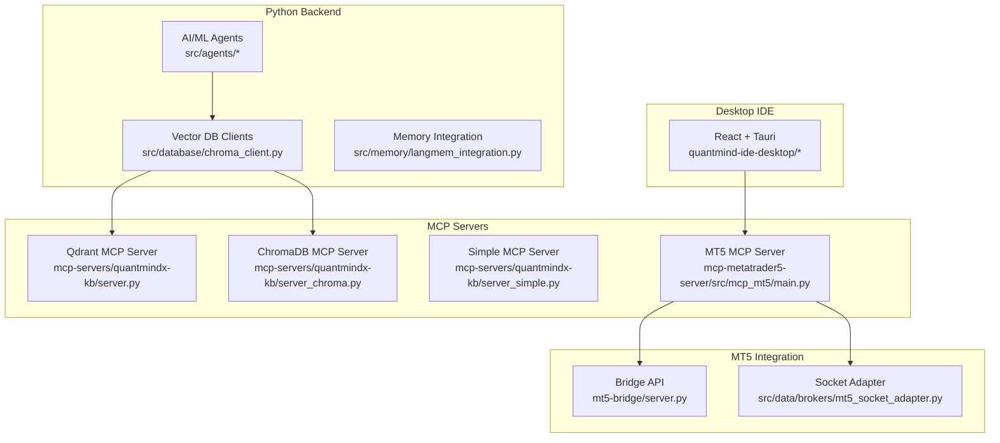
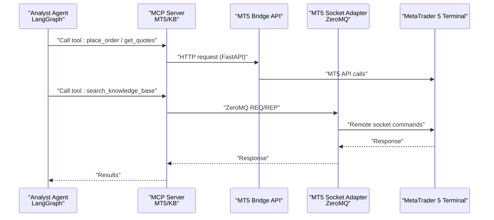
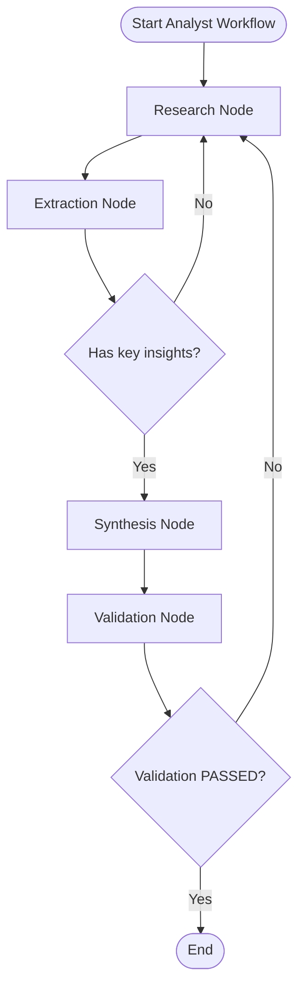
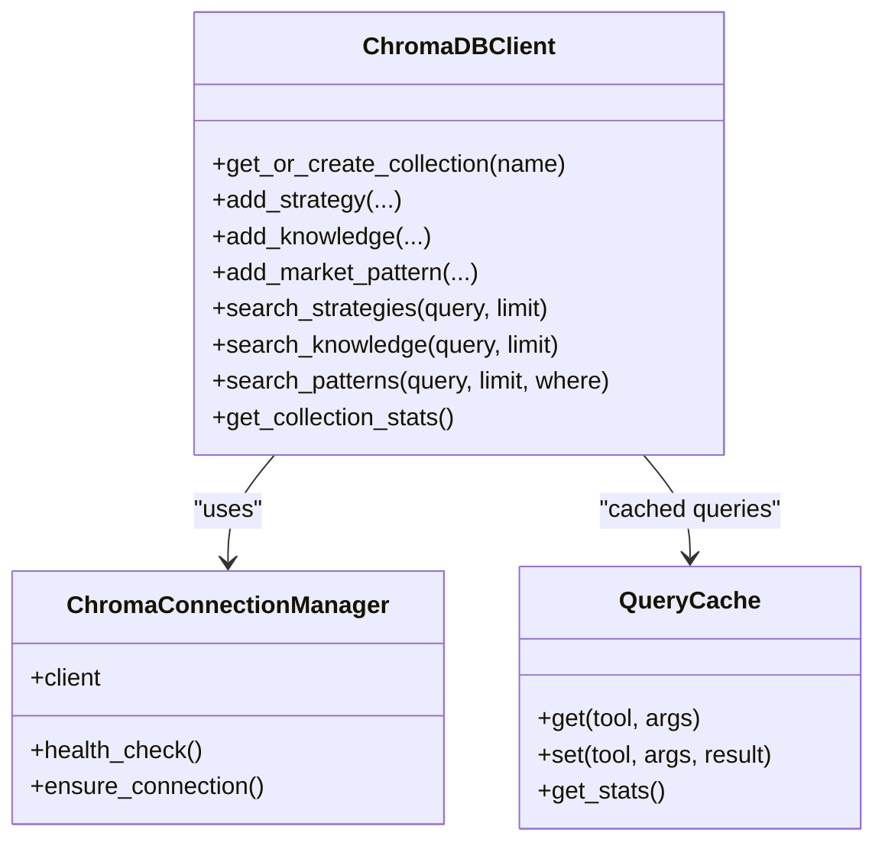
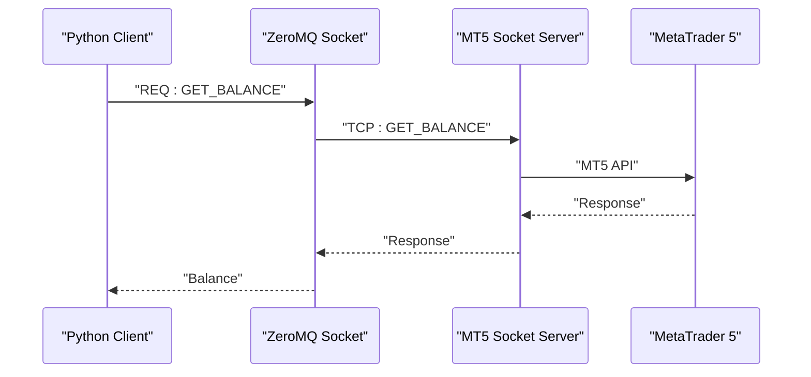
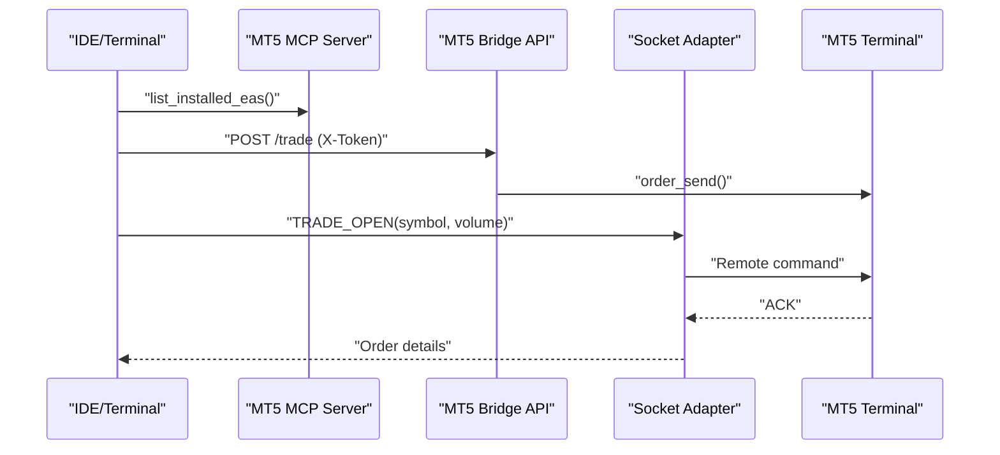
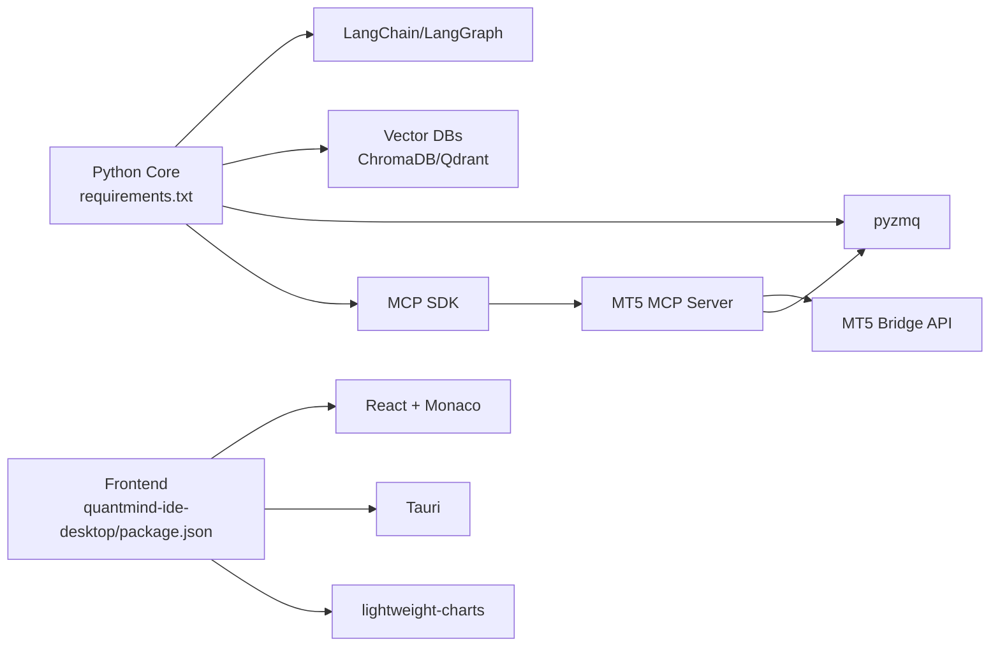

# Technology Stack

<cite>
**Referenced Files in This Document**
- [requirements.txt](file://requirements.txt)
- [docker/strategy-agent/requirements.txt](file://docker/strategy-agent/requirements.txt)
- [server/package.json](file://server/package.json)
- [quantmind-ide-desktop/package.json](file://quantmind-ide-desktop/package.json)
- [mcp-metatrader5-server/pyproject.toml](file://mcp-metatrader5-server/pyproject.toml)
- [extensions/nprd-extension/package.json](file://extensions/nprd-extension/package.json)
- [src/database/chroma_client.py](file://src/database/chroma_client.py)
- [mcp-servers/quantmindx-kb/server.py](file://mcp-servers/quantmindx-kb/server.py)
- [mcp-servers/quantmindx-kb/server_chroma.py](file://mcp-servers/quantmindx-kb/server_chroma.py)
- [mcp-servers/quantmindx-kb/server_simple.py](file://mcp-servers/quantmindx-kb/server_simple.py)
- [src/memory/langmem_integration.py](file://src/memory/langmem_integration.py)
- [src/agents/analyst.py](file://src/agents/analyst.py)
- [mcp-metatrader5-server/src/mcp_mt5/main.py](file://mcp-metatrader5-server/src/mcp_mt5/main.py)
- [mt5-bridge/server.py](file://mt5-bridge/server.py)
- [src/data/brokers/mt5_socket_adapter.py](file://src/data/brokers/mt5_socket_adapter.py)
- [scripts/index_chroma.py](file://scripts/index_chroma.py)
- [scripts/search_kb.py](file://scripts/search_kb.py)
</cite>

## Table of Contents
1. [Introduction](#introduction)
2. [Project Structure](#project-structure)
3. [Core Components](#core-components)
4. [Architecture Overview](#architecture-overview)
5. [Detailed Component Analysis](#detailed-component-analysis)
6. [Dependency Analysis](#dependency-analysis)
7. [Performance Considerations](#performance-considerations)
8. [Troubleshooting Guide](#troubleshooting-guide)
9. [Conclusion](#conclusion)

## Introduction
This document describes the QUANTMIND-X technology stack, focusing on the AI/ML platform, vector databases, MetaTrader 5 integration, and the desktop IDE. It explains how Python powers the backend and AI/ML workflows, how MQL5 integrates with MetaTrader 5 via MCP and socket bridges, and how JavaScript/TypeScript underpins the desktop IDE. It also covers the vector database technologies (ChromaDB and Qdrant), the communication infrastructure using ZeroMQ for high-frequency trading and MCP for AI integration, and the development environment setup, dependency management, and containerization approach. Finally, it outlines the rationale behind technology choices and how they support performance and scalability.

## Project Structure
The repository organizes functionality by domain and technology:
- Python backend and AI/ML: src/, requirements.txt
- MCP servers for AI/LLM integration: mcp-servers/, mcp-metatrader5-server/
- MetaTrader 5 integration: mt5-bridge/, src/data/brokers/mt5_socket_adapter.py
- Vector databases and knowledge base: scripts/index_chroma.py, mcp-servers/quantmindx-kb/*
- Desktop IDE: quantmind-ide-desktop/
- Server-side services: server/

**Diagram sources**
- [src/agents/analyst.py](file://src/agents/analyst.py#L1-L288)
- [src/database/chroma_client.py](file://src/database/chroma_client.py#L1-L477)
- [src/memory/langmem_integration.py](file://src/memory/langmem_integration.py#L1-L595)
- [mcp-servers/quantmindx-kb/server.py](file://mcp-servers/quantmindx-kb/server.py#L1-L189)
- [mcp-servers/quantmindx-kb/server_chroma.py](file://mcp-servers/quantmindx-kb/server_chroma.py#L1-L800)
- [mcp-servers/quantmindx-kb/server_simple.py](file://mcp-servers/quantmindx-kb/server_simple.py#L1-L98)
- [mcp-metatrader5-server/src/mcp_mt5/main.py](file://mcp-metatrader5-server/src/mcp_mt5/main.py#L1-L800)
- [mt5-bridge/server.py](file://mt5-bridge/server.py#L1-L96)
- [src/data/brokers/mt5_socket_adapter.py](file://src/data/brokers/mt5_socket_adapter.py#L1-L397)
- [quantmind-ide-desktop/package.json](file://quantmind-ide-desktop/package.json#L1-L39)

**Section sources**
- [requirements.txt](file://requirements.txt#L1-L55)
- [mcp-metatrader5-server/pyproject.toml](file://mcp-metatrader5-server/pyproject.toml#L1-L86)
- [server/package.json](file://server/package.json#L1-L21)
- [quantmind-ide-desktop/package.json](file://quantmind-ide-desktop/package.json#L1-L39)

## Core Components
- Python backend and AI/ML:
  - LangChain and LangGraph orchestrate agent workflows and state machines.
  - LangMem integrates semantic, episodic, and procedural memory with ChromaDB.
  - Vector database clients manage embeddings and semantic search.
- MCP (Model Context Protocol) servers:
  - Qdrant and ChromaDB-backed MCP servers expose semantic search tools to agents.
  - MT5 MCP server exposes trading controls and account management to AI agents.
- MetaTrader 5 integration:
  - FastAPI bridge for simple trade execution and status checks.
  - ZeroMQ socket adapter for ultra-low-latency remote trading from Linux to Windows VPS.
- Desktop IDE:
  - React + Tauri + Monaco Editor for a native desktop coding environment.

**Section sources**
- [src/agents/analyst.py](file://src/agents/analyst.py#L1-L288)
- [src/memory/langmem_integration.py](file://src/memory/langmem_integration.py#L1-L595)
- [src/database/chroma_client.py](file://src/database/chroma_client.py#L1-L477)
- [mcp-servers/quantmindx-kb/server.py](file://mcp-servers/quantmindx-kb/server.py#L1-L189)
- [mcp-servers/quantmindx-kb/server_chroma.py](file://mcp-servers/quantmindx-kb/server_chroma.py#L1-L800)
- [mcp-metatrader5-server/src/mcp_mt5/main.py](file://mcp-metatrader5-server/src/mcp_mt5/main.py#L1-L800)
- [mt5-bridge/server.py](file://mt5-bridge/server.py#L1-L96)
- [src/data/brokers/mt5_socket_adapter.py](file://src/data/brokers/mt5_socket_adapter.py#L1-L397)
- [quantmind-ide-desktop/package.json](file://quantmind-ide-desktop/package.json#L1-L39)

## Architecture Overview
The system combines Python-based AI/ML with MetaTrader 5 via two complementary channels:
- MCP-based AI integration for natural language-driven actions and knowledge retrieval.
- ZeroMQ-based socket bridge for high-performance, low-latency trading operations.

**Diagram sources**
- [mcp-metatrader5-server/src/mcp_mt5/main.py](file://mcp-metatrader5-server/src/mcp_mt5/main.py#L1-L800)
- [mt5-bridge/server.py](file://mt5-bridge/server.py#L1-L96)
- [src/data/brokers/mt5_socket_adapter.py](file://src/data/brokers/mt5_socket_adapter.py#L1-L397)
- [mcp-servers/quantmindx-kb/server_chroma.py](file://mcp-servers/quantmindx-kb/server_chroma.py#L1-L800)

## Detailed Component Analysis

### AI/ML Stack: LangChain, LangGraph, OpenAI, Anthropic
- LangGraph orchestrates the Analyst agent workflow with nodes for research, extraction, synthesis, and validation, enabling iterative refinement and conditional routing.
- LangChain integrates with OpenAI and Anthropic for LLM interactions, while LangMem manages memory across semantic, episodic, and procedural domains.
- Memory is persisted in ChromaDB, enabling semantic search and retrieval augmented generation (RAG) for agent context.

**Diagram sources**
- [src/agents/analyst.py](file://src/agents/analyst.py#L1-L288)
- [src/memory/langmem_integration.py](file://src/memory/langmem_integration.py#L1-L595)

**Section sources**
- [src/agents/analyst.py](file://src/agents/analyst.py#L1-L288)
- [src/memory/langmem_integration.py](file://src/memory/langmem_integration.py#L1-L595)
- [requirements.txt](file://requirements.txt#L13-L28)

### Vector Database Technologies: ChromaDB and Qdrant
- ChromaDB:
  - Sentence-transformers embeddings with cosine similarity.
  - Optimized HNSW index configuration for recall/speed balance.
  - Dedicated collections for strategies, knowledge, and agent memory.
- Qdrant:
  - MCP server for semantic search over MQL5 articles with category filtering and content retrieval.
- Scripts:
  - Lightweight indexer for ChromaDB and a CLI search utility.

**Diagram sources**
- [src/database/chroma_client.py](file://src/database/chroma_client.py#L1-L477)
- [mcp-servers/quantmindx-kb/server_chroma.py](file://mcp-servers/quantmindx-kb/server_chroma.py#L87-L141)
- [mcp-servers/quantmindx-kb/server_chroma.py](file://mcp-servers/quantmindx-kb/server_chroma.py#L147-L219)

**Section sources**
- [src/database/chroma_client.py](file://src/database/chroma_client.py#L1-L477)
- [mcp-servers/quantmindx-kb/server.py](file://mcp-servers/quantmindx-kb/server.py#L1-L189)
- [mcp-servers/quantmindx-kb/server_chroma.py](file://mcp-servers/quantmindx-kb/server_chroma.py#L1-L800)
- [mcp-servers/quantmindx-kb/server_simple.py](file://mcp-servers/quantmindx-kb/server_simple.py#L1-L98)
- [scripts/index_chroma.py](file://scripts/index_chroma.py#L1-L79)
- [scripts/search_kb.py](file://scripts/search_kb.py#L1-L61)

### Communication Infrastructure: ZeroMQ and MCP
- ZeroMQ (pyzmq):
  - REQ/REP sockets for low-latency MT5 commands from Linux to Windows VPS.
  - Configurable timeouts and robust error handling.
- MCP (Model Context Protocol):
  - MT5 MCP server exposing tools for EA management, account operations, alerts, and paper trading.
  - KB MCP servers (Qdrant and ChromaDB) exposing semantic search and asset retrieval tools.

**Diagram sources**
- [src/data/brokers/mt5_socket_adapter.py](file://src/data/brokers/mt5_socket_adapter.py#L1-L397)

**Section sources**
- [requirements.txt](file://requirements.txt#L52-L54)
- [src/data/brokers/mt5_socket_adapter.py](file://src/data/brokers/mt5_socket_adapter.py#L1-L397)
- [mcp-metatrader5-server/src/mcp_mt5/main.py](file://mcp-metatrader5-server/src/mcp_mt5/main.py#L1-L800)
- [mcp-servers/quantmindx-kb/server.py](file://mcp-servers/quantmindx-kb/server.py#L1-L189)
- [mcp-servers/quantmindx-kb/server_chroma.py](file://mcp-servers/quantmindx-kb/server_chroma.py#L1-L800)

### MetaTrader 5 Integration: MQL5 and Python
- MCP server:
  - Provides structured tools for EA lifecycle, account management, alerts, and trade journal.
- Bridge API:
  - FastAPI endpoints for status, account info, and trade execution with token-based auth.
- Socket adapter:
  - ZeroMQ REQ/REP client for remote VPS trading with low-latency and retry logic.

**Diagram sources**
- [mcp-metatrader5-server/src/mcp_mt5/main.py](file://mcp-metatrader5-server/src/mcp_mt5/main.py#L1-L800)
- [mt5-bridge/server.py](file://mt5-bridge/server.py#L1-L96)
- [src/data/brokers/mt5_socket_adapter.py](file://src/data/brokers/mt5_socket_adapter.py#L1-L397)

**Section sources**
- [mcp-metatrader5-server/src/mcp_mt5/main.py](file://mcp-metatrader5-server/src/mcp_mt5/main.py#L1-L800)
- [mt5-bridge/server.py](file://mt5-bridge/server.py#L1-L96)
- [src/data/brokers/mt5_socket_adapter.py](file://src/data/brokers/mt5_socket_adapter.py#L1-L397)

### Desktop IDE: JavaScript/TypeScript Stack
- React + TypeScript for UI components.
- Tauri for native desktop runtime and system APIs.
- Monaco Editor for code editing.
- TailwindCSS and Framer Motion for styling and animations.

**Section sources**
- [quantmind-ide-desktop/package.json](file://quantmind-ide-desktop/package.json#L1-L39)

## Dependency Analysis
- Python core:
  - LangChain, LangGraph, OpenAI, Anthropic for AI/ML.
  - ChromaDB, Qdrant, sentence-transformers for vector storage and embeddings.
  - pyzmq for ZeroMQ, aiohttp for async HTTP, ccxt for optional crypto.
- MCP ecosystem:
  - fastmcp for MT5 MCP server, mcp for generic MCP SDK.
- Frontend:
  - React, Monaco Editor, Tauri, lightweight-charts, TailwindCSS.

**Diagram sources**
- [requirements.txt](file://requirements.txt#L1-L55)
- [quantmind-ide-desktop/package.json](file://quantmind-ide-desktop/package.json#L1-L39)
- [mcp-metatrader5-server/pyproject.toml](file://mcp-metatrader5-server/pyproject.toml#L22-L32)

**Section sources**
- [requirements.txt](file://requirements.txt#L1-L55)
- [docker/strategy-agent/requirements.txt](file://docker/strategy-agent/requirements.txt#L1-L40)
- [server/package.json](file://server/package.json#L1-L21)
- [quantmind-ide-desktop/package.json](file://quantmind-ide-desktop/package.json#L1-L39)
- [mcp-metatrader5-server/pyproject.toml](file://mcp-metatrader5-server/pyproject.toml#L1-L86)

## Performance Considerations
- Vector search performance:
  - ChromaDB HNSW configuration tuned for cosine similarity and balanced recall/speed.
  - Query result caching with TTL reduces repeated computation.
- Low-latency trading:
  - ZeroMQ REQ/REP socket bridge minimizes IPC overhead for remote MT5 operations.
  - Timeouts and retry logic improve resilience.
- Async I/O:
  - aiohttp and asyncio used in MCP and bridge servers for concurrent operations.
- Containerization:
  - Strategy agent Dockerfile and docker-compose enable reproducible deployments and resource isolation.

[No sources needed since this section provides general guidance]

## Troubleshooting Guide
- Vector database indexing:
  - Ensure ChromaDB path exists and is writable; verify collection creation and embedding model availability.
- MCP server connectivity:
  - Confirm MCP server is running and reachable; verify tool schemas and input validation.
- MT5 MCP server:
  - Check MT5 terminal initialization, login, and symbol selection; validate account credentials and permissions.
- Bridge API:
  - Verify token authentication and MT5 initialization; confirm symbol visibility and order parameters.
- Socket adapter:
  - Validate VPS host/port, firewall rules, and ZeroMQ server status; monitor timeouts and connection health.

**Section sources**
- [scripts/index_chroma.py](file://scripts/index_chroma.py#L1-L79)
- [mcp-servers/quantmindx-kb/server_chroma.py](file://mcp-servers/quantmindx-kb/server_chroma.py#L1-L800)
- [mcp-metatrader5-server/src/mcp_mt5/main.py](file://mcp-metatrader5-server/src/mcp_mt5/main.py#L1-L800)
- [mt5-bridge/server.py](file://mt5-bridge/server.py#L1-L96)
- [src/data/brokers/mt5_socket_adapter.py](file://src/data/brokers/mt5_socket_adapter.py#L1-L397)

## Conclusion
QUANTMIND-X leverages a cohesive stack: Python for AI/ML orchestration and backend services, MQL5 for MetaTrader 5 integration via MCP and ZeroMQ, and a modern JavaScript/TypeScript desktop IDE. The vector database layer (ChromaDB and Qdrant) enables semantic search and RAG for agent-driven knowledge retrieval. The MCP protocol standardizes AI integration, while ZeroMQ ensures high-frequency trading performance. Dependency management and containerization streamline development and deployment, aligning with the project’s performance and scalability goals.