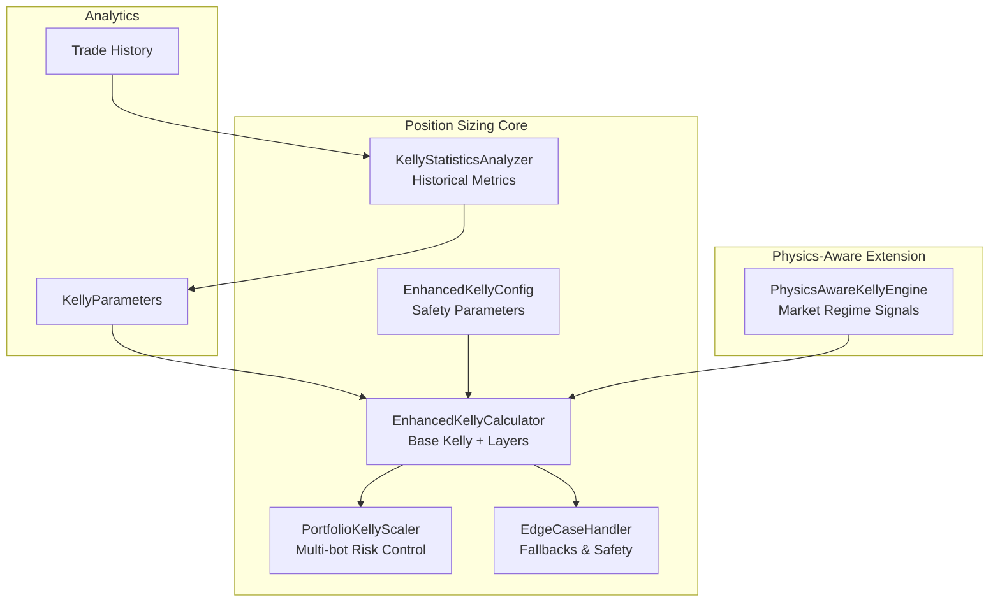
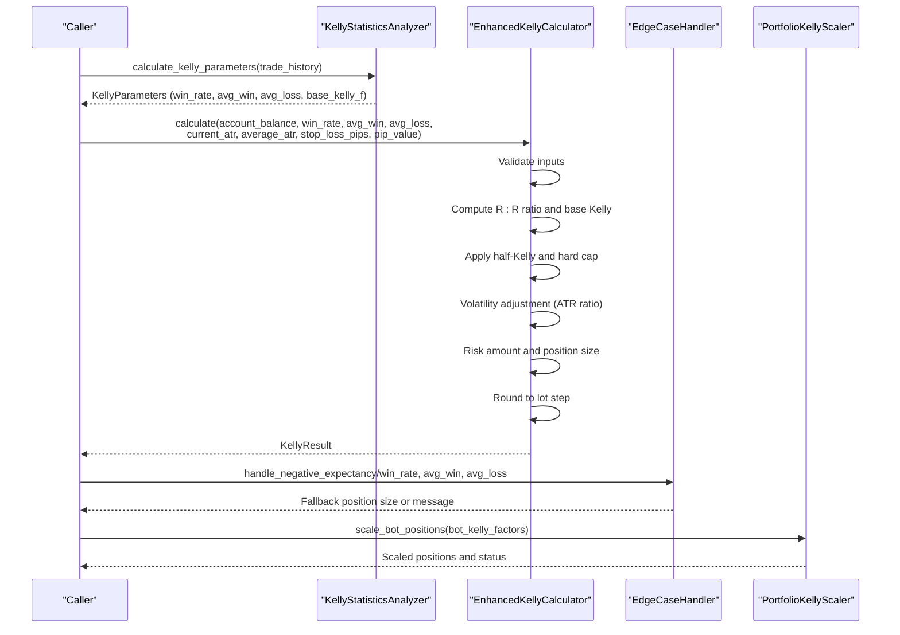
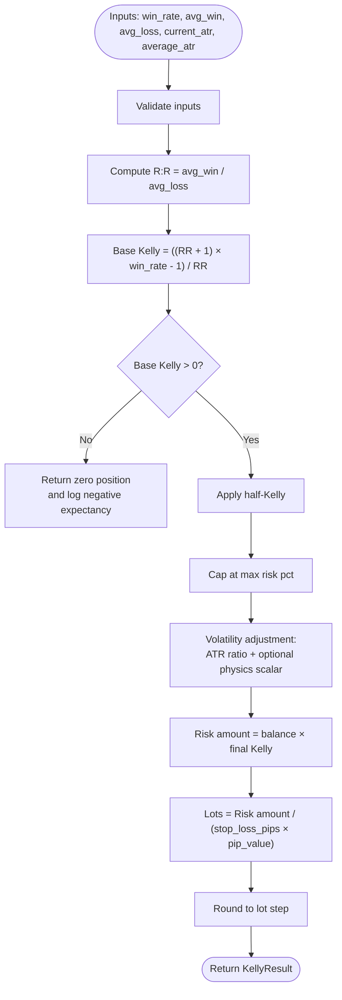
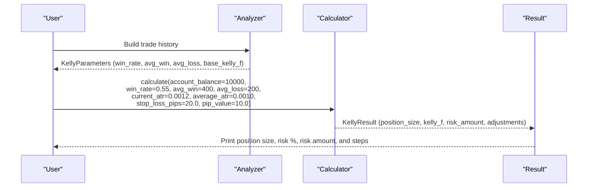
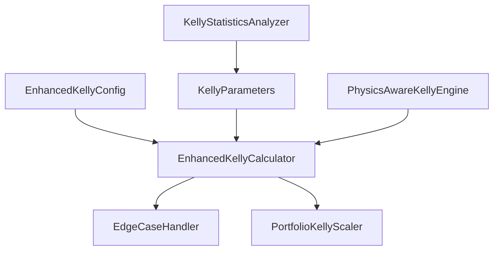

# Base Kelly Calculation

<cite>
**Referenced Files in This Document**
- [enhanced_kelly.py](file://src/position_sizing/enhanced_kelly.py)
- [kelly_analyzer.py](file://src/position_sizing/kelly_analyzer.py)
- [kelly_config.py](file://src/position_sizing/kelly_config.py)
- [portfolio_kelly.py](file://src/position_sizing/portfolio_kelly.py)
- [edge_cases.py](file://src/position_sizing/edge_cases.py)
- [kelly_engine.py](file://src/risk/sizing/kelly_engine.py)
- [enhanced_kelly_user_guide.md](file://docs/user_guides/enhanced_kelly_user_guide.md)
- [enhanced_kelly_api.md](file://docs/api/enhanced_kelly_api.md)
- [enhanced_kelly_position_sizing_v1.md](file://docs/trds/enhanced_kelly_position_sizing_v1.md)
- [test_kelly_criterion_properties.py](file://tests/mql5/test_kelly_criterion_properties.py)
- [test_kellysizer.py](file://tests/mql5/test_kellysizer.py)
</cite>

## Table of Contents
1. [Introduction](#introduction)
2. [Project Structure](#project-structure)
3. [Core Components](#core-components)
4. [Architecture Overview](#architecture-overview)
5. [Detailed Component Analysis](#detailed-component-analysis)
6. [Dependency Analysis](#dependency-analysis)
7. [Performance Considerations](#performance-considerations)
8. [Troubleshooting Guide](#troubleshooting-guide)
9. [Conclusion](#conclusion)
10. [Appendices](#appendices)

## Introduction
This document explains the base Kelly calculation system implemented across the QuantMindX codebase. It covers the mathematical foundation of the Kelly Criterion, risk-reward ratio computation, base Kelly fraction calculation, expectancy validation, input validation and error handling, fallback mechanisms, and practical examples with realistic trading parameters. It also documents how historical performance metrics inform position sizing decisions and how the system integrates with portfolio-level risk controls.

## Project Structure
The base Kelly calculation system spans several modules:
- Position sizing core: base calculation, validation, and portfolio scaling
- Analytics: extraction of Kelly parameters from historical trade data
- Configuration: tunable safety layers and constraints
- Edge case handling: robust fallbacks for negative expectancy, insufficient data, and extreme market conditions
- Physics-aware extension: advanced Kelly variant incorporating econophysical market regime signals

**Diagram sources**
- [enhanced_kelly.py](file://src/position_sizing/enhanced_kelly.py#L128-L377)
- [kelly_analyzer.py](file://src/position_sizing/kelly_analyzer.py#L27-L127)
- [portfolio_kelly.py](file://src/position_sizing/portfolio_kelly.py#L26-L96)
- [edge_cases.py](file://src/position_sizing/edge_cases.py#L22-L160)
- [kelly_engine.py](file://src/risk/sizing/kelly_engine.py#L25-L282)

**Section sources**
- [enhanced_kelly.py](file://src/position_sizing/enhanced_kelly.py#L1-L418)
- [kelly_analyzer.py](file://src/position_sizing/kelly_analyzer.py#L1-L228)
- [kelly_config.py](file://src/position_sizing/kelly_config.py#L1-L116)
- [portfolio_kelly.py](file://src/position_sizing/portfolio_kelly.py#L1-L254)
- [edge_cases.py](file://src/position_sizing/edge_cases.py#L1-L438)
- [kelly_engine.py](file://src/risk/sizing/kelly_engine.py#L1-L368)

## Core Components
- Enhanced Kelly Calculator: Computes base Kelly fraction, applies safety layers (half-Kelly, caps, volatility), and rounds to broker lot constraints.
- Kelly Statistics Analyzer: Extracts win rate, average win/loss, R:R ratio, base Kelly, expectancy, and reliability from historical trade data.
- Portfolio Kelly Scaler: Scales individual bot positions to maintain safe portfolio-level risk exposure.
- Edge Case Handler: Provides fallbacks for insufficient history, negative expectancy, missing physics data, flash crashes, and broker constraints.
- Physics-Aware Kelly Engine: Extends base Kelly with econophysical multipliers derived from market regime signals.

**Section sources**
- [enhanced_kelly.py](file://src/position_sizing/enhanced_kelly.py#L128-L377)
- [kelly_analyzer.py](file://src/position_sizing/kelly_analyzer.py#L27-L127)
- [portfolio_kelly.py](file://src/position_sizing/portfolio_kelly.py#L26-L96)
- [edge_cases.py](file://src/position_sizing/edge_cases.py#L22-L160)
- [kelly_engine.py](file://src/risk/sizing/kelly_engine.py#L25-L282)

## Architecture Overview
The system implements a layered approach:
1. Base Kelly fraction computation from win rate and payoff ratio
2. Safety layers: half-Kelly, hard risk cap, and volatility-adjusted scaling
3. Position sizing conversion to lots using stop loss and pip value
4. Broker rounding and portfolio risk control
5. Edge case handling and fallbacks
6. Optional physics-aware adjustments for market regimes

**Diagram sources**
- [kelly_analyzer.py](file://src/position_sizing/kelly_analyzer.py#L44-L127)
- [enhanced_kelly.py](file://src/position_sizing/enhanced_kelly.py#L190-L377)
- [edge_cases.py](file://src/position_sizing/edge_cases.py#L130-L160)
- [portfolio_kelly.py](file://src/position_sizing/portfolio_kelly.py#L57-L96)

## Detailed Component Analysis

### Base Kelly Calculation and Safety Layers
The base Kelly fraction is computed from win rate and payoff ratio, then adjusted by:
- Half-Kelly multiplier (typically 0.5)
- Hard risk cap (e.g., 2% per trade)
- Volatility adjustment via ATR ratio and optional physics scalar

**Diagram sources**
- [enhanced_kelly.py](file://src/position_sizing/enhanced_kelly.py#L253-L377)

**Section sources**
- [enhanced_kelly.py](file://src/position_sizing/enhanced_kelly.py#L190-L377)

### Risk-Reward Ratio and Expectancy Validation
- Risk-reward ratio (B) equals average win divided by average loss
- Base Kelly formula: f* = ((B + 1) × p - 1) / B
- Expectancy validation: if base Kelly ≤ 0, treat as negative expectancy and return zero position
- Expectancy can also be computed as p × avg_win - (1 - p) × avg_loss

**Section sources**
- [enhanced_kelly.py](file://src/position_sizing/enhanced_kelly.py#L258-L286)
- [kelly_analyzer.py](file://src/position_sizing/kelly_analyzer.py#L86-L97)

### Input Validation and Error Handling
- Input validation ensures win_rate ∈ (0, 1], avg_win > 0, avg_loss > 0, stop_loss_pips > 0, average_atr > 0
- Negative expectancy triggers zero position sizing with a warning
- EdgeCaseHandler manages:
  - Insufficient trade history with fallback risk percentages
  - Missing or stale physics data with safety multipliers
  - Flash crash detection via ATR thresholds
  - Broker constraints (min/max lot, lot step)
  - Margin constraints based on free margin

**Section sources**
- [enhanced_kelly.py](file://src/position_sizing/enhanced_kelly.py#L379-L398)
- [edge_cases.py](file://src/position_sizing/edge_cases.py#L43-L160)

### Practical Examples with Realistic Trading Parameters
Examples demonstrate how to compute position size using realistic parameters and interpret intermediate steps.

**Diagram sources**
- [enhanced_kelly.py](file://src/position_sizing/enhanced_kelly.py#L190-L377)
- [enhanced_kelly_user_guide.md](file://docs/user_guides/enhanced_kelly_user_guide.md#L260-L300)

**Section sources**
- [enhanced_kelly_user_guide.md](file://docs/user_guides/enhanced_kelly_user_guide.md#L258-L352)

### Relationship Between Historical Metrics and Position Sizing
Historical performance metrics extracted by the analyzer feed the calculator:
- Win rate and R:R ratio drive base Kelly
- Expectancy and profit factor indicate strategy quality
- Rolling Kelly helps detect edge decay over time
- Reliability assessment influences whether to use calculated Kelly or fallback sizing

**Section sources**
- [kelly_analyzer.py](file://src/position_sizing/kelly_analyzer.py#L44-L127)
- [kelly_analyzer.py](file://src/position_sizing/kelly_analyzer.py#L162-L227)

### Portfolio-Level Risk Scaling
When multiple bots trade concurrently, the portfolio scaler prevents over-leverage by:
- Computing total raw risk across bots
- Applying a scale factor if total risk exceeds the maximum allowed
- Optionally adjusting for correlation between bots

**Section sources**
- [portfolio_kelly.py](file://src/position_sizing/portfolio_kelly.py#L57-L158)

### Physics-Aware Kelly Extension
The physics-aware engine augments base Kelly with econophysical signals:
- Lyapunov exponent penalty (chaos)
- Ising susceptibility penalty (criticality)
- Maximum eigenvalue penalty (correlation risk)
- Weakest link aggregation and optional Monte Carlo validation

**Section sources**
- [kelly_engine.py](file://src/risk/sizing/kelly_engine.py#L25-L282)
- [enhanced_kelly_position_sizing_v1.md](file://docs/trds/enhanced_kelly_position_sizing_v1.md#L39-L86)

## Dependency Analysis
The modules exhibit clear separation of concerns with explicit dependencies:
- EnhancedKellyCalculator depends on EnhancedKellyConfig and performs the core calculation
- KellyStatisticsAnalyzer depends on trade history and produces KellyParameters
- PortfolioKellyScaler depends on bot Kelly factors and optional correlation matrix
- EdgeCaseHandler provides fallbacks used by the calculator and engine
- PhysicsAwareKellyEngine complements base Kelly with market regime signals

**Diagram sources**
- [kelly_config.py](file://src/position_sizing/kelly_config.py#L11-L61)
- [enhanced_kelly.py](file://src/position_sizing/enhanced_kelly.py#L166-L178)
- [kelly_analyzer.py](file://src/position_sizing/kelly_analyzer.py#L27-L43)
- [portfolio_kelly.py](file://src/position_sizing/portfolio_kelly.py#L26-L56)
- [edge_cases.py](file://src/position_sizing/edge_cases.py#L22-L42)
- [kelly_engine.py](file://src/risk/sizing/kelly_engine.py#L25-L87)

**Section sources**
- [kelly_config.py](file://src/position_sizing/kelly_config.py#L1-L116)
- [enhanced_kelly.py](file://src/position_sizing/enhanced_kelly.py#L1-L418)
- [kelly_analyzer.py](file://src/position_sizing/kelly_analyzer.py#L1-L228)
- [portfolio_kelly.py](file://src/position_sizing/portfolio_kelly.py#L1-L254)
- [edge_cases.py](file://src/position_sizing/edge_cases.py#L1-L438)
- [kelly_engine.py](file://src/risk/sizing/kelly_engine.py#L1-L368)

## Performance Considerations
- The system targets sub-200ms end-to-end calculation time and low memory usage
- Optimization tips include caching analyzer results, batching calculations, and using portfolio scaling
- Benchmarks are available in the test suite

**Section sources**
- [enhanced_kelly_user_guide.md](file://docs/user_guides/enhanced_kelly_user_guide.md#L494-L518)

## Troubleshooting Guide
Common issues and resolutions:
- Position size always zero: check for negative expectancy, insufficient history, or overly conservative configuration
- Position size too small: improve win rate, tighten stop loss, wait for lower volatility, or adjust Kelly fraction carefully
- Portfolio scaling too aggressive: reduce active bots, review correlation matrix, or increase portfolio risk cap
- Performance degradation: limit history size, use caching, and profile with benchmarks

**Section sources**
- [enhanced_kelly_user_guide.md](file://docs/user_guides/enhanced_kelly_user_guide.md#L521-L571)
- [edge_cases.py](file://src/position_sizing/edge_cases.py#L130-L160)

## Conclusion
The base Kelly calculation system provides a robust, mathematically grounded framework for position sizing with strong safety layers. By combining historical analytics, volatility-aware adjustments, and portfolio risk control, it supports both prop firm-grade discipline and practical trading constraints. The physics-aware extension further enhances resilience by adapting to changing market regimes.

## Appendices

### API Reference Highlights
- Enhanced Kelly Calculator: calculate(account_balance, win_rate, avg_win, avg_loss, current_atr, average_atr, stop_loss_pips, pip_value) -> KellyResult
- Kelly Statistics Analyzer: calculate_kelly_parameters(trade_history) -> KellyParameters
- Portfolio Kelly Scaler: scale_bot_positions(bot_kelly_factors, bot_correlations) -> Dict[str, float]
- Edge Case Handler: handle_negative_expectancy, handle_insufficient_history, handle_flash_crash, handle_broker_constraints

**Section sources**
- [enhanced_kelly_api.md](file://docs/api/enhanced_kelly_api.md#L22-L134)
- [enhanced_kelly_api.md](file://docs/api/enhanced_kelly_api.md#L138-L216)
- [enhanced_kelly_api.md](file://docs/api/enhanced_kelly_api.md#L219-L314)

### Mathematical Properties Verified by Tests
- Kelly formula accuracy: f* = (bp - q) / b
- Positive expectancy yields positive Kelly; negative expectancy yields zero
- Monotonicity with win rate and payoff ratio symmetry
- Maximum cap at 25% for safety

**Section sources**
- [test_kelly_criterion_properties.py](file://tests/mql5/test_kelly_criterion_properties.py#L23-L56)
- [test_kelly_criterion_properties.py](file://tests/mql5/test_kelly_criterion_properties.py#L100-L111)
- [test_kellysizer.py](file://tests/mql5/test_kellysizer.py#L20-L43)