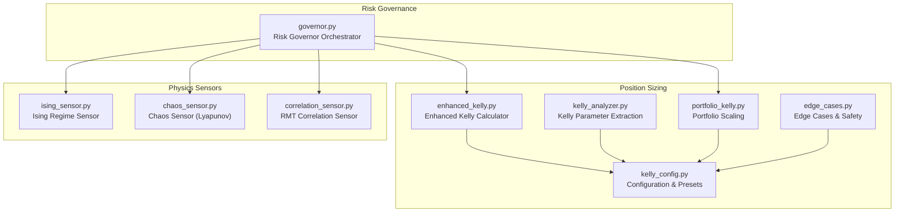
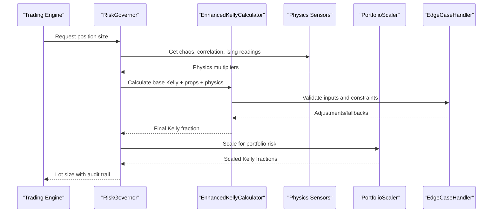
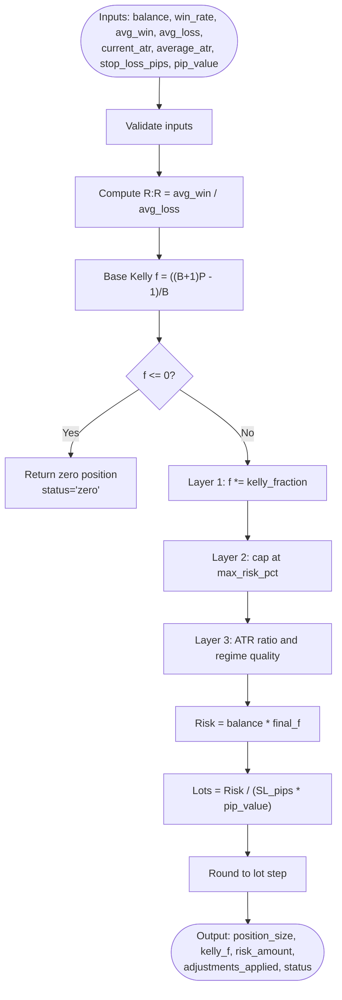
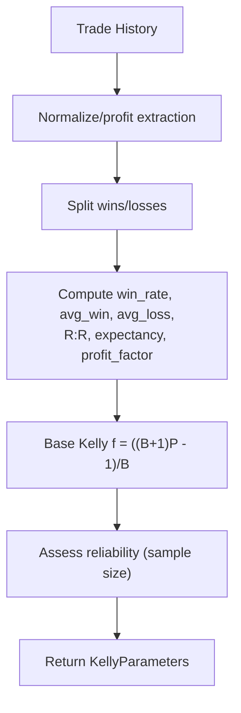
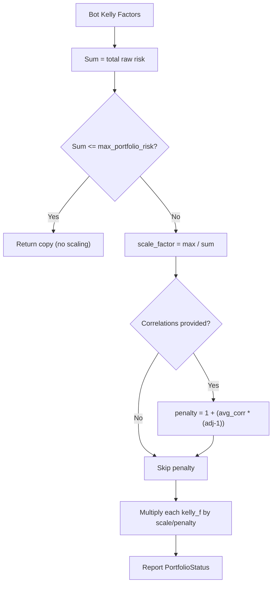
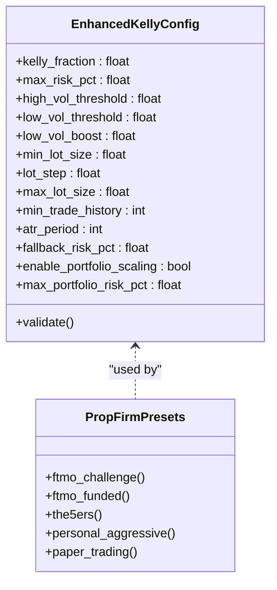
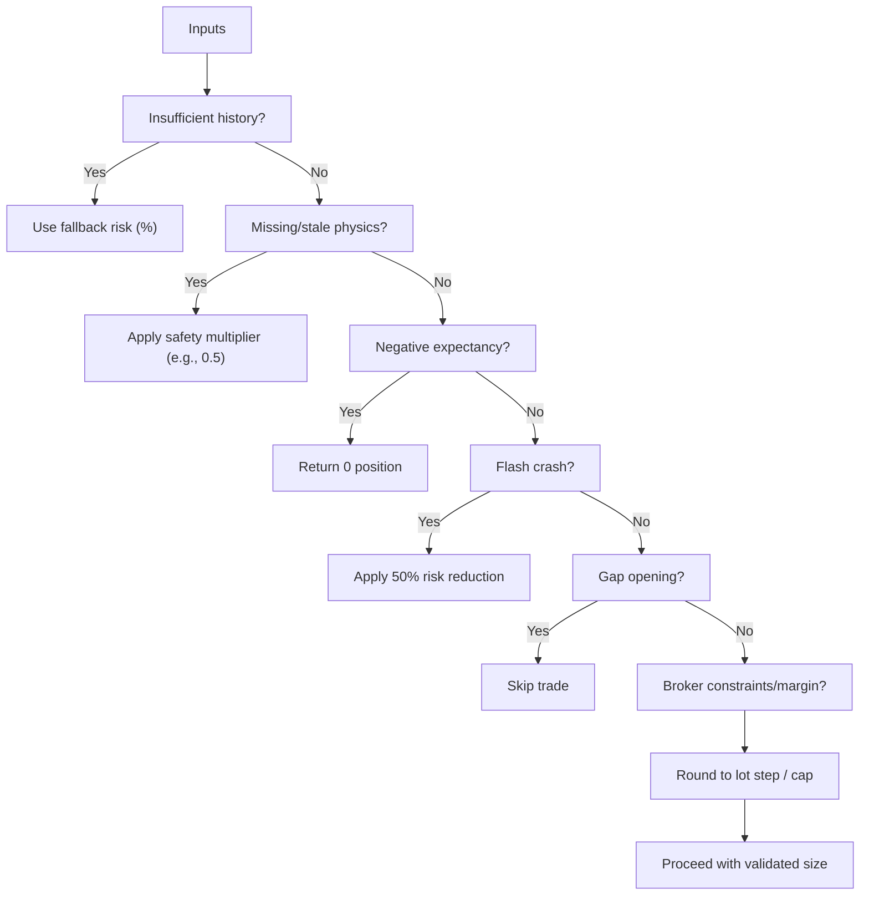
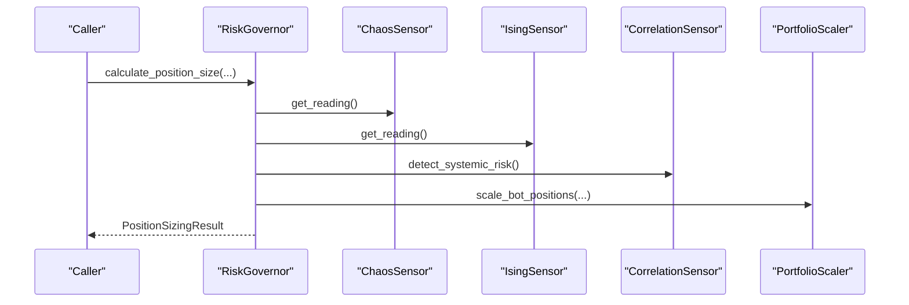
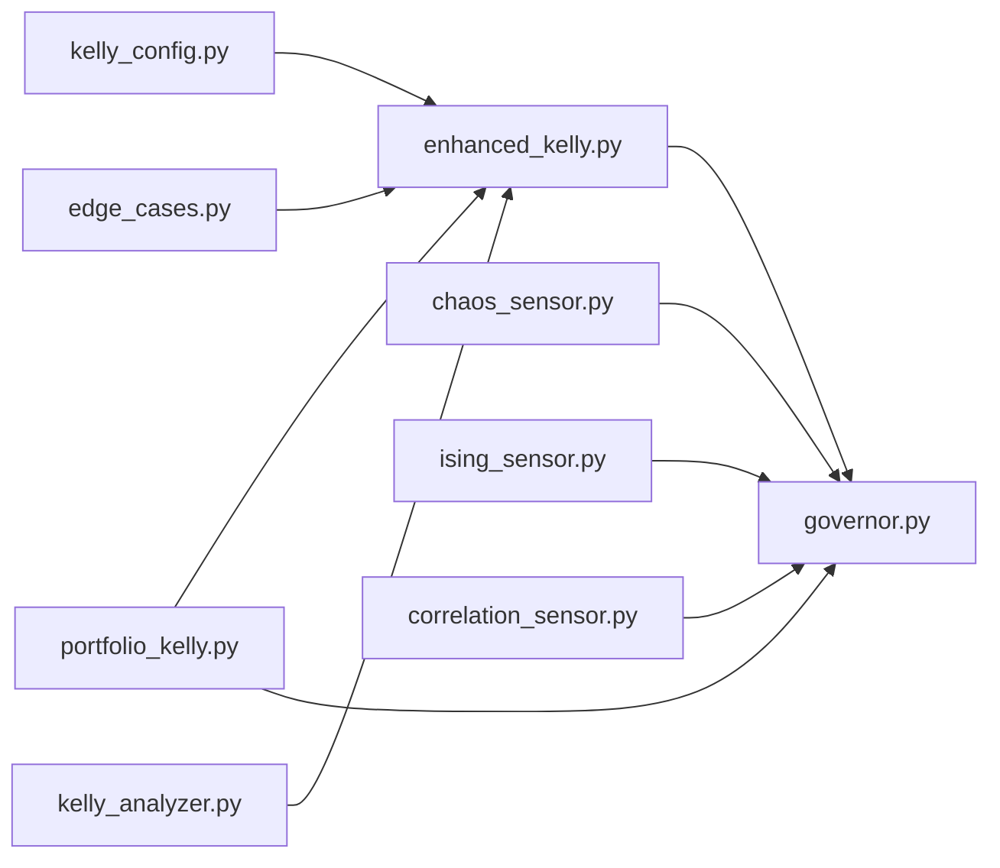

# Enhanced Kelly Position Sizing

<cite>
**Referenced Files in This Document**
- [enhanced_kelly.py](file://src/position_sizing/enhanced_kelly.py)
- [kelly_analyzer.py](file://src/position_sizing/kelly_analyzer.py)
- [portfolio_kelly.py](file://src/position_sizing/portfolio_kelly.py)
- [kelly_config.py](file://src/position_sizing/kelly_config.py)
- [edge_cases.py](file://src/position_sizing/edge_cases.py)
- [governor.py](file://src/risk/governor.py)
- [ising_sensor.py](file://src/risk/physics/ising_sensor.py)
- [chaos_sensor.py](file://src/risk/physics/chaos_sensor.py)
- [correlation_sensor.py](file://src/risk/physics/correlation_sensor.py)
- [enhanced_kelly_position_sizing_v1.md](file://docs/trds/enhanced_kelly_position_sizing_v1.md)
- [test_enhanced_kelly.py](file://tests/position_sizing/test_enhanced_kelly.py)
- [test_kelly_analyzer.py](file://tests/position_sizing/test_kelly_analyzer.py)
- [test_portfolio_kelly.py](file://tests/position_sizing/test_portfolio_kelly.py)
</cite>

## Table of Contents
1. [Introduction](#introduction)
2. [Project Structure](#project-structure)
3. [Core Components](#core-components)
4. [Architecture Overview](#architecture-overview)
5. [Detailed Component Analysis](#detailed-component-analysis)
6. [Dependency Analysis](#dependency-analysis)
7. [Performance Considerations](#performance-considerations)
8. [Troubleshooting Guide](#troubleshooting-guide)
9. [Conclusion](#conclusion)
10. [Appendices](#appendices)

## Introduction
This document describes the Enhanced Kelly Position Sizing system, a three-layer risk management framework designed for prop firm trading and systematic portfolios. The system combines:
- Base Kelly fraction calculation grounded in the Kelly Criterion
- Physics-based multipliers derived from econophysical sensors (chaos, phase transitions, and systemic correlation)
- Prop firm constraint enforcement and portfolio-level risk scaling

It further integrates edge-case handling, safety validators, and a risk governor orchestrator to ensure robust, compliant, and adaptive position sizing under varying market regimes.

## Project Structure
The Enhanced Kelly system spans two primary packages:
- Position sizing: core calculators, analyzers, configuration, and portfolio scaling
- Risk governance: orchestration, physics sensors, and integration with position sizing

**Diagram sources**
- [governor.py](file://src/risk/governor.py#L42-L104)
- [enhanced_kelly.py](file://src/position_sizing/enhanced_kelly.py#L128-L189)
- [kelly_analyzer.py](file://src/position_sizing/kelly_analyzer.py#L27-L43)
- [portfolio_kelly.py](file://src/position_sizing/portfolio_kelly.py#L26-L56)
- [kelly_config.py](file://src/position_sizing/kelly_config.py#L11-L61)
- [edge_cases.py](file://src/position_sizing/edge_cases.py#L22-L42)
- [ising_sensor.py](file://src/risk/physics/ising_sensor.py#L105-L118)
- [chaos_sensor.py](file://src/risk/physics/chaos_sensor.py#L31-L66)
- [correlation_sensor.py](file://src/risk/physics/correlation_sensor.py#L22-L56)

**Section sources**
- [governor.py](file://src/risk/governor.py#L42-L104)
- [enhanced_kelly.py](file://src/position_sizing/enhanced_kelly.py#L128-L189)
- [kelly_analyzer.py](file://src/position_sizing/kelly_analyzer.py#L27-L43)
- [portfolio_kelly.py](file://src/position_sizing/portfolio_kelly.py#L26-L56)
- [kelly_config.py](file://src/position_sizing/kelly_config.py#L11-L61)
- [edge_cases.py](file://src/position_sizing/edge_cases.py#L22-L42)
- [ising_sensor.py](file://src/risk/physics/ising_sensor.py#L105-L118)
- [chaos_sensor.py](file://src/risk/physics/chaos_sensor.py#L31-L66)
- [correlation_sensor.py](file://src/risk/physics/correlation_sensor.py#L22-L56)

## Core Components
- Enhanced Kelly Calculator: Computes position size via base Kelly, applies Layer 1 (half-Kelly), Layer 2 (hard risk cap), and Layer 3 (physics-aware volatility adjustment), then rounds to broker lot constraints.
- Kelly Statistics Analyzer: Extracts win rate, average win/loss, and Kelly parameters from historical trade data, with rolling window analysis and edge decay detection.
- Portfolio Kelly Scaler: Prevents portfolio over-leverage by scaling individual bot positions and reporting risk utilization status.
- Configuration & Presets: Defines safety multipliers, caps, volatility thresholds, broker constraints, and pre-configured prop firm presets.
- Edge Case Handler & Safety Validator: Enforces fallbacks, handles missing/stale data, negative expectancy, extreme payoffs, and validates account and position constraints.
- Risk Governor: Orchestrates physics sensors, prop firm constraints, and portfolio scaling into a unified position sizing API.

**Section sources**
- [enhanced_kelly.py](file://src/position_sizing/enhanced_kelly.py#L128-L377)
- [kelly_analyzer.py](file://src/position_sizing/kelly_analyzer.py#L27-L127)
- [portfolio_kelly.py](file://src/position_sizing/portfolio_kelly.py#L26-L158)
- [kelly_config.py](file://src/position_sizing/kelly_config.py#L11-L61)
- [edge_cases.py](file://src/position_sizing/edge_cases.py#L22-L437)
- [governor.py](file://src/risk/governor.py#L42-L104)

## Architecture Overview
The system implements a layered approach:
- Input layer: trade statistics, market volatility, and broker constraints
- Physics layer: econophysical sensors detect chaos, phase transitions, and systemic correlation
- Protection layer: prop firm presets and portfolio scaling
- Output layer: final position size with audit trail and safety checks

**Diagram sources**
- [governor.py](file://src/risk/governor.py#L105-L224)
- [enhanced_kelly.py](file://src/position_sizing/enhanced_kelly.py#L190-L377)
- [edge_cases.py](file://src/position_sizing/edge_cases.py#L22-L437)
- [portfolio_kelly.py](file://src/position_sizing/portfolio_kelly.py#L57-L96)
- [ising_sensor.py](file://src/risk/physics/ising_sensor.py#L140-L195)
- [chaos_sensor.py](file://src/risk/physics/chaos_sensor.py#L195-L241)
- [correlation_sensor.py](file://src/risk/physics/correlation_sensor.py#L229-L281)

## Detailed Component Analysis

### Enhanced Kelly Calculator
The Enhanced Kelly Calculator computes position size using:
- Base Kelly fraction: f = ((B + 1) × P - 1) / B, where B = avg_win / avg_loss and P = win_rate
- Layer 1: Safety multiplier (default 50% half-Kelly)
- Layer 2: Hard cap at maximum per-trade risk (default 2%)
- Layer 3: Physics-aware volatility adjustment combining regime quality and ATR ratio
- Lot rounding to broker constraints

**Diagram sources**
- [enhanced_kelly.py](file://src/position_sizing/enhanced_kelly.py#L190-L377)

**Section sources**
- [enhanced_kelly.py](file://src/position_sizing/enhanced_kelly.py#L128-L377)

### Kelly Statistics Analyzer
Extracts and reports:
- Win rate, average win/loss, risk-reward ratio
- Base Kelly fraction and expectancy
- Profit factor and reliability confidence
- Rolling window analysis and edge decay detection

**Diagram sources**
- [kelly_analyzer.py](file://src/position_sizing/kelly_analyzer.py#L44-L127)

**Section sources**
- [kelly_analyzer.py](file://src/position_sizing/kelly_analyzer.py#L27-L228)

### Portfolio Kelly Scaler
Manages multi-bot risk:
- Proportional scaling when total risk exceeds portfolio cap
- Correlation penalty to reduce effective leverage for correlated strategies
- Risk status reporting and bot allocation strategies (equal/performance)

**Diagram sources**
- [portfolio_kelly.py](file://src/position_sizing/portfolio_kelly.py#L57-L158)

**Section sources**
- [portfolio_kelly.py](file://src/position_sizing/portfolio_kelly.py#L26-L254)

### Configuration & Presets
Defines:
- Layer 1: Kelly fraction (default 50%)
- Layer 2: Hard risk cap (default 2%)
- Layer 3: Volatility thresholds and boosts
- Broker constraints (min/max lot, step)
- Prop firm presets (FTMO, The5%ers, personal, paper trading)

**Diagram sources**
- [kelly_config.py](file://src/position_sizing/kelly_config.py#L11-L116)

**Section sources**
- [kelly_config.py](file://src/position_sizing/kelly_config.py#L11-L116)

### Edge Cases & Safety
Handles:
- Insufficient trade history with fallback risk percentages
- Missing or stale physics data with safety multipliers
- Negative expectancy scenarios
- Flash crashes and gap openings
- Broker lot constraints and margin requirements
- Safety validation for position size and account state

**Diagram sources**
- [edge_cases.py](file://src/position_sizing/edge_cases.py#L43-L437)

**Section sources**
- [edge_cases.py](file://src/position_sizing/edge_cases.py#L22-L437)

### Risk Governor Orchestration
Coordinates:
- Physics sensors (Chaos, Ising, Correlation)
- Prop firm presets and portfolio scaling
- Caching for performance
- Unified position sizing API with audit trail

**Diagram sources**
- [governor.py](file://src/risk/governor.py#L105-L224)
- [chaos_sensor.py](file://src/risk/physics/chaos_sensor.py#L195-L241)
- [ising_sensor.py](file://src/risk/physics/ising_sensor.py#L140-L195)
- [correlation_sensor.py](file://src/risk/physics/correlation_sensor.py#L229-L281)
- [portfolio_kelly.py](file://src/position_sizing/portfolio_kelly.py#L57-L96)

**Section sources**
- [governor.py](file://src/risk/governor.py#L42-L447)

## Dependency Analysis
The Enhanced Kelly system exhibits modular cohesion with explicit coupling:
- Position sizing depends on configuration and edge-case handling
- Risk governor orchestrates position sizing, portfolio scaling, and physics sensors
- Physics sensors are independent and cached for performance
- Tests validate each module’s behavior and integration points

**Diagram sources**
- [kelly_config.py](file://src/position_sizing/kelly_config.py#L11-L116)
- [enhanced_kelly.py](file://src/position_sizing/enhanced_kelly.py#L128-L189)
- [edge_cases.py](file://src/position_sizing/edge_cases.py#L22-L42)
- [kelly_analyzer.py](file://src/position_sizing/kelly_analyzer.py#L27-L43)
- [portfolio_kelly.py](file://src/position_sizing/portfolio_kelly.py#L26-L56)
- [governor.py](file://src/risk/governor.py#L42-L104)
- [chaos_sensor.py](file://src/risk/physics/chaos_sensor.py#L31-L66)
- [ising_sensor.py](file://src/risk/physics/ising_sensor.py#L105-L118)
- [correlation_sensor.py](file://src/risk/physics/correlation_sensor.py#L22-L56)

**Section sources**
- [test_enhanced_kelly.py](file://tests/position_sizing/test_enhanced_kelly.py#L1-L623)
- [test_kelly_analyzer.py](file://tests/position_sizing/test_kelly_analyzer.py#L1-L376)
- [test_portfolio_kelly.py](file://tests/position_sizing/test_portfolio_kelly.py#L1-L451)

## Performance Considerations
- Physics sensor caching: TTL-based caching reduces repeated computation for chaos, ising, and correlation sensors.
- Lot rounding and caps: Prevent excessive precision and broker rounding errors.
- Portfolio scaling: Proportional scaling avoids O(n^2) operations; correlation penalties use average correlation for efficiency.
- Monte Carlo validation: Optional and configurable to avoid unnecessary computational overhead.

[No sources needed since this section provides general guidance]

## Troubleshooting Guide
Common issues and resolutions:
- Negative expectancy: System returns zero position and logs a warning; review trade history and expectations.
- Insufficient history: Falls back to conservative risk percentage; collect more trades for reliable Kelly parameters.
- Stale or missing physics data: Applies safety multipliers; ensure sensor pipelines are healthy.
- Broker constraints: Rounds to lot step and caps at min/max; verify lot step and min/max settings.
- Portfolio over-leverage: Portfolio scaler reduces positions; consider correlation adjustments and bot limits.

**Section sources**
- [edge_cases.py](file://src/position_sizing/edge_cases.py#L43-L437)
- [governor.py](file://src/risk/governor.py#L262-L333)

## Conclusion
The Enhanced Kelly Position Sizing system provides a robust, physics-informed, and compliant framework for position sizing. By layering base Kelly, hard risk caps, and physics-aware volatility adjustments, and integrating portfolio scaling and edge-case handling, it adapts to changing market regimes while enforcing prop firm constraints and governance requirements.

[No sources needed since this section summarizes without analyzing specific files]

## Appendices

### Mathematical Foundation and Variance Reduction
- Kelly Criterion: f* = (p(b+1) - 1) / b, balancing growth and ruin probability.
- Variance reduction: Half-Kelly (kelly_fraction=0.5) reduces drawdown while retaining ~70–80% of growth.
- Dynamic volatility adjustment: Inverse relationship with ATR ratio; regime quality multiplies volatility scalar.

**Section sources**
- [enhanced_kelly.py](file://src/position_sizing/enhanced_kelly.py#L9-L26)
- [kelly_config.py](file://src/position_sizing/kelly_config.py#L21-L31)

### Risk Caps, Hard Limits, and Survival Throttling
- Per-trade risk cap: default 2% (configurable)
- Portfolio risk cap: default 3% across bots (configurable)
- Flash crash penalty: immediate 50% risk reduction for extreme ATR spikes
- Gap opening detection: skip trades exceeding threshold multiples of ATR

**Section sources**
- [edge_cases.py](file://src/position_sizing/edge_cases.py#L162-L216)
- [kelly_config.py](file://src/position_sizing/kelly_config.py#L24-L48)

### Portfolio Kelly Scaling and Correlation-Based Position Sizing
- Proportional scaling when total risk exceeds cap
- Correlation penalty: 1.0 to 1.5 multiplier based on average absolute correlation
- Allocation strategies: equal or performance-based with minimum per-bot allocation

**Section sources**
- [portfolio_kelly.py](file://src/position_sizing/portfolio_kelly.py#L57-L254)

### Systematic Risk Assessment and Compliance
- Physics sensors: Chaos (Lyapunov), Ising (phase transitions), RMT (correlation)
- Prop firm presets: FTMO Challenge, Funded, The5%ers, personal, paper trading
- Audit trail: Comprehensive calculation steps and adjustments for compliance

**Section sources**
- [governor.py](file://src/risk/governor.py#L262-L434)
- [kelly_config.py](file://src/position_sizing/kelly_config.py#L63-L116)
- [enhanced_kelly_position_sizing_v1.md](file://docs/trds/enhanced_kelly_position_sizing_v1.md#L1-L234)

### Practical Examples and Parameter Tuning
- Example scenarios validated in tests: profitable strategy in normal/high/low volatility, negative expectancy, and prop firm presets.
- Parameter tuning tips:
  - Adjust kelly_fraction for aggressiveness (default 0.5)
  - Tighten max_risk_pct for conservative accounts
  - Calibrate volatility thresholds and low_vol_boost based on asset characteristics
  - Use PropFirmPresets for compliance alignment

**Section sources**
- [test_enhanced_kelly.py](file://tests/position_sizing/test_enhanced_kelly.py#L32-L623)
- [test_kelly_analyzer.py](file://tests/position_sizing/test_kelly_analyzer.py#L22-L376)
- [test_portfolio_kelly.py](file://tests/position_sizing/test_portfolio_kelly.py#L20-L451)