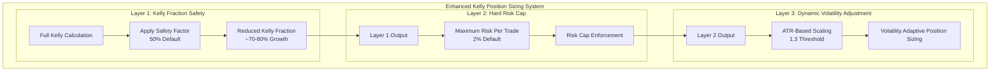
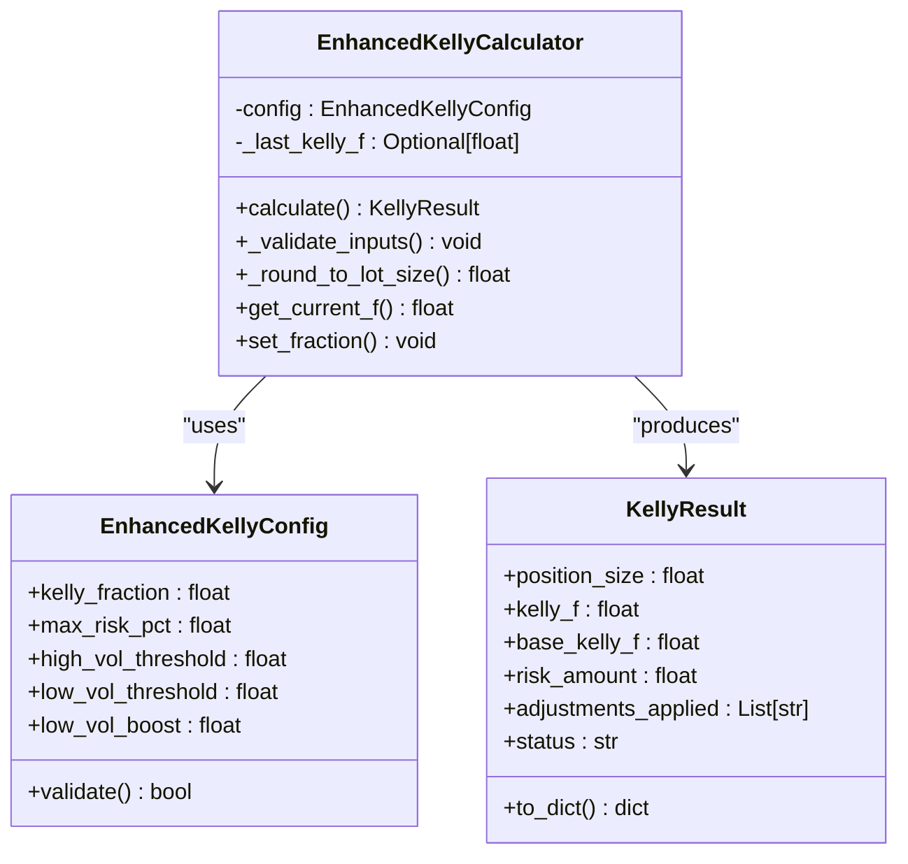
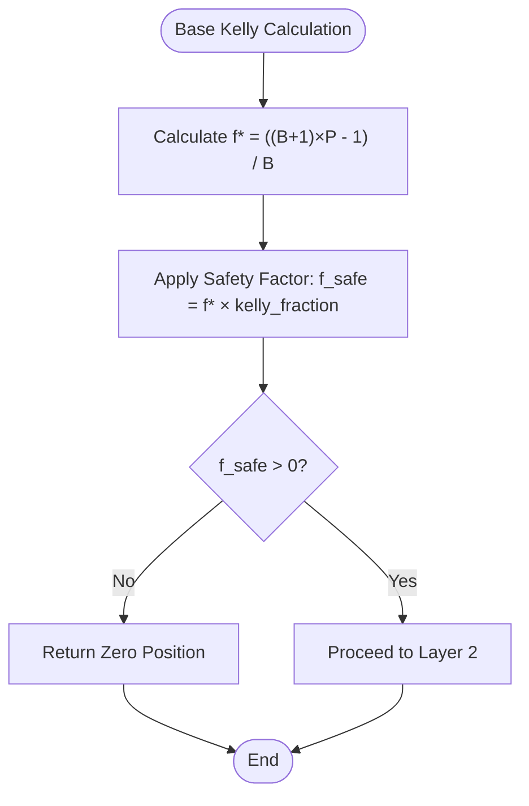
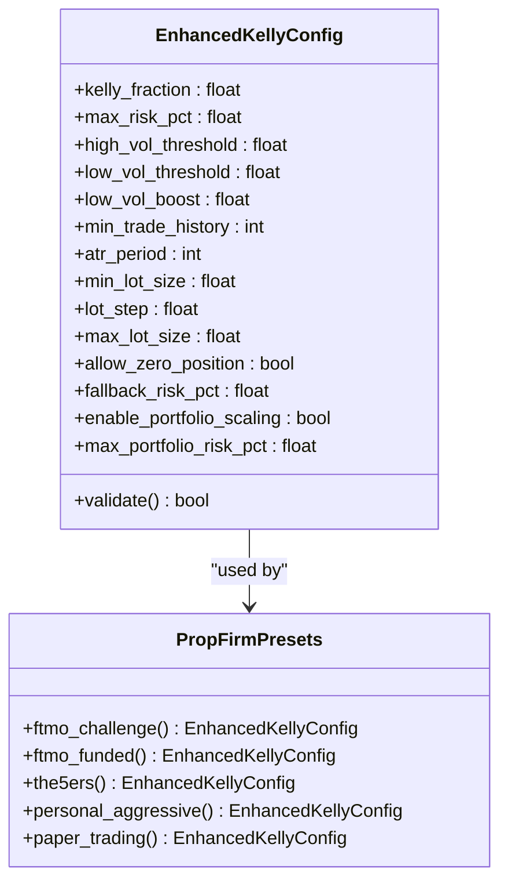
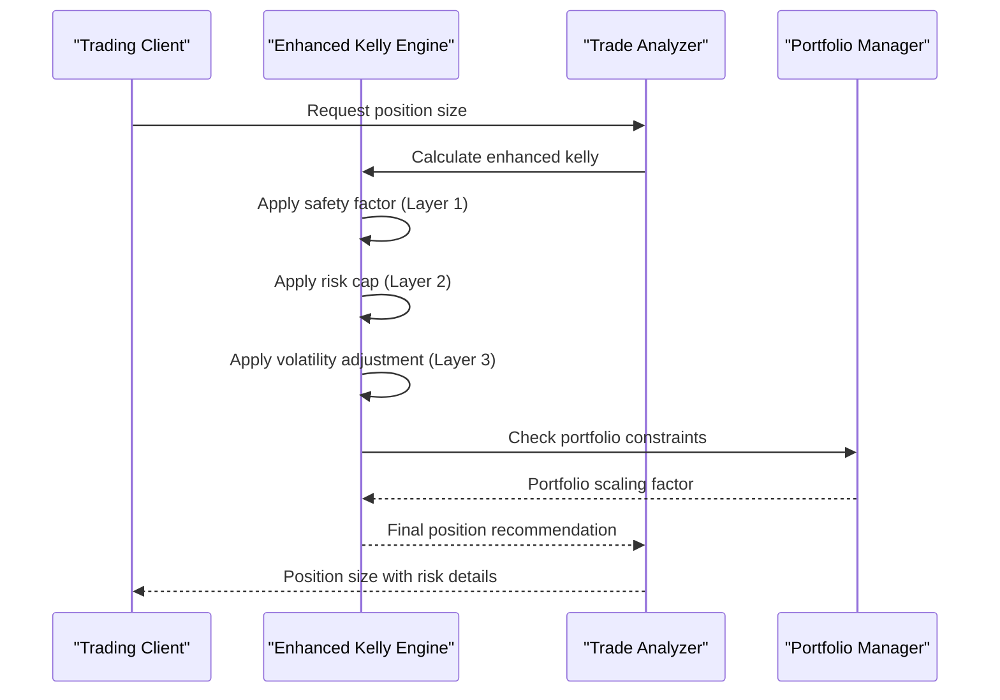
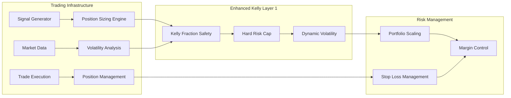
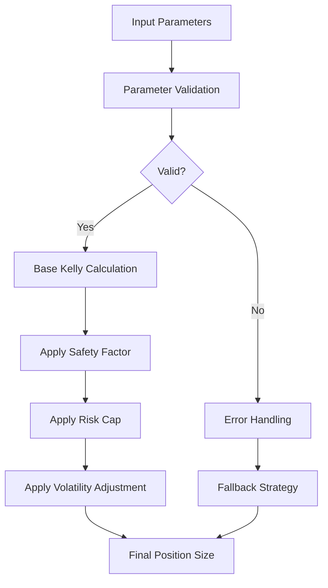

# Layer 1 - Kelly Fraction Safety

<cite>
**Referenced Files in This Document**
- [enhanced_kelly.py](file://src/position_sizing/enhanced_kelly.py)
- [kelly_config.py](file://src/position_sizing/kelly_config.py)
- [kelly_analyzer.py](file://src/position_sizing/kelly_analyzer.py)
- [test_enhanced_kelly.py](file://tests/position_sizing/test_enhanced_kelly.py)
- [enhanced_kelly_user_guide.md](file://docs/user_guides/enhanced_kelly_user_guide.md)
- [enhanced_kelly_position_sizing_v1.md](file://docs/trds/enhanced_kelly_position_sizing_v1.md)
- [edge_cases.py](file://src/position_sizing/edge_cases.py)
- [portfolio_kelly.py](file://src/position_sizing/portfolio_kelly.py)
- [kelly_engine.py](file://src/risk/sizing/kelly_engine.py)
- [strategy_performance.py](file://src/risk/models/strategy_performance.py)
- [market_physics.py](file://src/risk/models/market_physics.py)
- [sizing_recommendation.py](file://src/risk/models/sizing_recommendation.py)
</cite>

## Table of Contents
1. [Introduction](#introduction)
2. [System Architecture](#system-architecture)
3. [Core Components](#core-components)
4. [Layer 1 - Kelly Fraction Safety Mechanism](#layer-1---kelly-fraction-safety-mechanism)
5. [Mathematical Foundation](#mathematical-foundation)
6. [Configuration Options](#configuration-options)
7. [Performance Implications](#performance-implications)
8. [Risk Reduction Benefits](#risk-reduction-benefits)
9. [Examples and Transformations](#examples-and-transformations)
10. [Prop Firm Environment Balance](#prop-firm-environment-balance)
11. [Integration Points](#integration-points)
12. [Troubleshooting Guide](#troubleshooting-guide)
13. [Conclusion](#conclusion)

## Introduction

Layer 1 of the Enhanced Kelly position sizing system represents the foundational safety mechanism that reduces full Kelly sizing by a configurable safety factor. This layer serves as the primary risk mitigation component, implementing the half-Kelly principle to capture approximately 70-80% of potential growth while reducing drawdown by 30-40%.

The system operates on the principle that full Kelly criterion, while mathematically optimal for long-term growth, is excessively aggressive for practical trading applications. By applying a safety multiplier (typically 50%), the system achieves a better risk-reward balance suitable for prop firm environments and retail trading accounts.

## System Architecture

The Enhanced Kelly system implements a three-layer protection hierarchy designed to progressively reduce risk exposure while maintaining optimal growth potential:



**Diagram sources**
- [enhanced_kelly.py](file://src/position_sizing/enhanced_kelly.py#L128-L377)
- [kelly_config.py](file://src/position_sizing/kelly_config.py#L11-L61)

The architecture ensures that each layer builds upon the previous one, creating a comprehensive risk management framework that adapts to market conditions while maintaining strict safety boundaries.

## Core Components

### Enhanced Kelly Calculator

The Enhanced Kelly Calculator serves as the central orchestrator for position sizing calculations, implementing all three layers of protection:



**Diagram sources**
- [enhanced_kelly.py](file://src/position_sizing/enhanced_kelly.py#L128-L418)
- [kelly_config.py](file://src/position_sizing/kelly_config.py#L11-L116)

### Configuration Management

The system utilizes a comprehensive configuration framework that supports multiple trading environments and risk tolerances:

| Configuration Parameter | Default Value | Description | Prop Firm Range |
|------------------------|---------------|-------------|-----------------|
| `kelly_fraction` | 0.50 (50%) | Safety multiplier for full Kelly | 0.40-0.70 |
| `max_risk_pct` | 0.02 (2%) | Maximum risk per trade | 0.01-0.03 |
| `high_vol_threshold` | 1.3 | ATR ratio threshold for reductions | 1.2-1.5 |
| `low_vol_threshold` | 0.7 | ATR ratio threshold for increases | 0.6-0.8 |
| `low_vol_boost` | 1.2 | Multiplier for calm markets | 1.1-1.3 |

**Section sources**
- [kelly_config.py](file://src/position_sizing/kelly_config.py#L21-L48)
- [enhanced_kelly.py](file://src/position_sizing/enhanced_kelly.py#L166-L188)

## Layer 1 - Kelly Fraction Safety Mechanism

### Safety Factor Implementation

Layer 1 implements the fundamental half-Kelly principle through a configurable safety multiplier applied to the base Kelly fraction:



**Diagram sources**
- [enhanced_kelly.py](file://src/position_sizing/enhanced_kelly.py#L262-L287)

The safety factor serves as the primary risk mitigation mechanism, reducing the aggressive nature of full Kelly while preserving most of its growth potential.

### Mathematical Impact Analysis

The safety factor creates a non-linear relationship between risk and growth potential:

| Safety Factor | Growth Capture | Drawdown Reduction | Risk Level |
|---------------|----------------|-------------------|------------|
| 1.0 (Full Kelly) | 100% | 0% | Maximum |
| 0.7 | ~90% | ~15% | High |
| 0.6 | ~85% | ~25% | Medium-High |
| **0.5 (Half-Kelly)** | **~70-80%** | **~30-40%** | **Optimal** |
| 0.4 | ~60-70% | ~35-45% | Medium |
| 0.3 | ~50-60% | ~45-55% | Low |

**Section sources**
- [enhanced_kelly.py](file://src/position_sizing/enhanced_kelly.py#L135-L147)
- [enhanced_kelly_user_guide.md](file://docs/user_guides/enhanced_kelly_user_guide.md#L146-L176)

## Mathematical Foundation

### Kelly Criterion Formula

The mathematical foundation of the Enhanced Kelly system is built upon the classic Kelly Criterion:

```
f* = (bp - q)/b = (p(b+1) - 1)/b
```

Where:
- `f*` = Optimal fraction of capital to wager
- `p` = Probability of winning (win rate)
- `q` = Probability of losing (1 - p)
- `b` = Average win/average loss (payoff ratio)

### Enhanced Kelly Transformation

Layer 1 applies the transformation: `f_enhanced = f* × kelly_fraction`

This creates the safety net that prevents the excessive risk-taking characteristic of full Kelly while maintaining substantial growth potential.

### Compound Growth Rate Impact

The relationship between safety factor and compound growth rate follows the Gordon-Miller equation:

```
G = p log(1 + f) + q log(1 - f)
```

Where the optimal growth occurs at f*, but the practical growth rate decreases as safety factors deviate from optimality.

**Section sources**
- [enhanced_kelly.py](file://src/position_sizing/enhanced_kelly.py#L9-L26)
- [enhanced_kelly_user_guide.md](file://docs/user_guides/enhanced_kelly_user_guide.md#L34-L50)

## Configuration Options

### Standard Configuration Parameters

The Enhanced Kelly system provides extensive configurability through the EnhancedKellyConfig class:



**Diagram sources**
- [kelly_config.py](file://src/position_sizing/kelly_config.py#L11-L116)

### Prop Firm Preset Configurations

The system includes specialized configurations for major prop firms:

| Prop Firm | Kelly Fraction | Max Risk | High Vol Threshold | Use Case |
|-----------|----------------|----------|-------------------|----------|
| FTMO Challenge | 0.40 (40%) | 1.0% | 1.2 | Ultra-conservative phase |
| FTMO Funded | 0.55 (55%) | 1.5% | 1.3 | Moderate growth phase |
| The5%ers | 0.50 (50%) | 2.0% | 1.3 | Standard prop firm rules |
| Personal Aggressive | 0.60 (60%) | 2.5% | 1.5 | Experienced traders |
| Paper Trading | 0.70 (70%) | 3.0% | 1.5 | Strategy testing |

**Section sources**
- [kelly_config.py](file://src/position_sizing/kelly_config.py#L63-L116)
- [enhanced_kelly_user_guide.md](file://docs/user_guides/enhanced_kelly_user_guide.md#L380-L438)

## Performance Implications

### Computational Efficiency

The Enhanced Kelly system is optimized for performance with the following targets:

- **Calculation Time**: < 200ms per position calculation
- **Memory Usage**: < 10MB for full system operation
- **Processing Power**: Minimal CPU overhead for real-time trading

### Scalability Considerations

The system handles multiple concurrent calculations efficiently:



**Diagram sources**
- [enhanced_kelly.py](file://src/position_sizing/enhanced_kelly.py#L190-L377)
- [portfolio_kelly.py](file://src/position_sizing/portfolio_kelly.py#L57-L96)

**Section sources**
- [enhanced_kelly_user_guide.md](file://docs/user_guides/enhanced_kelly_user_guide.md#L494-L511)

## Risk Reduction Benefits

### Drawdown Mitigation

Layer 1 provides significant drawdown reduction through the half-Kelly principle:

| Safety Factor | Theoretical Drawdown Reduction | Practical Drawdown Reduction |
|---------------|-------------------------------|------------------------------|
| 1.0 (Full Kelly) | 0% | Highest risk |
| 0.7 | ~15% | Reduced volatility |
| 0.6 | ~25% | Moderate risk reduction |
| **0.5 (Half-Kelly)** | **~30-40%** | **Optimal balance** |
| 0.4 | ~35-45% | Lower growth potential |
| 0.3 | ~45-55% | Significant growth sacrifice |

### Psychological Benefits

The reduced risk profile provides several psychological advantages:

- **Stress Reduction**: Lower volatility reduces emotional trading decisions
- **Consistency**: More predictable equity curve development
- **Capital Preservation**: Better survival probability in adverse markets
- **Confidence Building**: Consistent positive results reinforce trading discipline

### Market Regime Adaptation

The safety factor works differently across market regimes:

- **Trending Markets**: Higher safety factors (0.6-0.7) capture more momentum
- **Sideways Markets**: Lower safety factors (0.4-0.5) prevent whipsaw losses
- **High Volatility**: Automatic reduction through volatility layer
- **Low Volatility**: Conservative boost with safety factor protection

**Section sources**
- [enhanced_kelly_user_guide.md](file://docs/user_guides/enhanced_kelly_user_guide.md#L124-L176)

## Examples and Transformations

### Base Kelly to Enhanced Kelly Transformation

The following examples demonstrate how Layer 1 transforms base Kelly results:

**Example 1: Standard Strategy**
- Base Kelly: 32.5% (f* = 0.325)
- Safety Factor: 50% (0.5)
- Enhanced Kelly: 16.25% (f_safe = 0.1625)
- Risk Reduction: ~30-40% drawdown potential

**Example 2: High Win Rate Strategy**
- Base Kelly: 55% (f* = 0.55)
- Safety Factor: 50% (0.5)
- Enhanced Kelly: 27.5% (f_safe = 0.275)
- Risk Cap: 2% (maximum)
- Final: 2% (capped by hard risk limit)

**Example 3: Conservative Strategy**
- Base Kelly: 15% (f* = 0.15)
- Safety Factor: 50% (0.5)
- Enhanced Kelly: 7.5% (f_safe = 0.075)
- No risk cap needed

### Position Size Calculations

The transformation affects position sizing as follows:

```
Position Size = (Account Balance × Risk Percentage) / (Stop Loss × Pip Value)
```

**Example Calculation**:
- Account Balance: $10,000
- Risk Percentage: 2.0%
- Stop Loss: 20 pips
- Pip Value: $10
- Position Size: ($10,000 × 0.02) / (20 × $10) = 1.0 lot

**Section sources**
- [enhanced_kelly.py](file://src/position_sizing/enhanced_kelly.py#L346-L358)
- [test_enhanced_kelly.py](file://tests/position_sizing/test_enhanced_kelly.py#L32-L68)

## Prop Firm Environment Balance

### Regulatory Compliance

The Enhanced Kelly system is specifically designed to meet prop firm requirements:

- **Risk Limits**: Maximum 2% per trade (configurable)
- **Conservative Defaults**: 50% safety factor by default
- **Transparency**: Complete audit trail of all adjustments
- **Flexibility**: Configurable parameters for different firm rules

### Performance Metrics

The system maintains optimal performance characteristics for prop firm environments:

- **Consistency**: Stable risk-adjusted returns across market cycles
- **Capital Efficiency**: Efficient use of allocated capital
- **Risk Control**: Strict adherence to maximum drawdown limits
- **Scalability**: Handles multiple concurrent trading accounts

### Integration Benefits

The Layer 1 safety mechanism provides several advantages for prop firm operations:

- **Risk Management**: Centralized risk control across all traders
- **Performance Monitoring**: Clear visibility into risk-taking patterns
- **Compliance Assurance**: Automated adherence to firm policies
- **Training Tool**: Educational framework for trader risk awareness

**Section sources**
- [enhanced_kelly_user_guide.md](file://docs/user_guides/enhanced_kelly_user_guide.md#L18-L33)
- [kelly_config.py](file://src/position_sizing/kelly_config.py#L63-L116)

## Integration Points

### System Integration Architecture

The Enhanced Kelly system integrates seamlessly with the broader trading infrastructure:



**Diagram sources**
- [enhanced_kelly.py](file://src/position_sizing/enhanced_kelly.py#L128-L164)
- [portfolio_kelly.py](file://src/position_sizing/portfolio_kelly.py#L26-L40)

### Data Flow Integration

The system processes data through multiple stages:

1. **Input Validation**: Parameter verification and normalization
2. **Base Calculation**: Kelly fraction computation
3. **Safety Application**: Layer 1 transformation
4. **Risk Control**: Hard cap enforcement
5. **Volatility Adjustment**: Market condition adaptation
6. **Output Generation**: Position size with risk details

### External Dependencies

The system maintains minimal external dependencies:

- **Mathematical Libraries**: Standard Python math operations
- **Configuration Management**: Dataclass-based configuration
- **Logging Framework**: Structured logging for audit trails
- **Testing Framework**: Comprehensive pytest test coverage

**Section sources**
- [enhanced_kelly.py](file://src/position_sizing/enhanced_kelly.py#L28-L35)
- [test_enhanced_kelly.py](file://tests/position_sizing/test_enhanced_kelly.py#L13-L26)

## Troubleshooting Guide

### Common Issues and Solutions

#### Issue: Position Size Always Zero

**Symptoms**: All position calculations return zero size

**Possible Causes**:
- Negative expectancy in strategy
- Insufficient trade history
- Configuration too conservative
- Invalid input parameters

**Solutions**:
- Verify strategy profitability metrics
- Collect more trade history (30+ trades minimum)
- Adjust `allow_zero_position` configuration
- Review input parameter ranges

#### Issue: Position Size Too Small

**Symptoms**: Generated position sizes are smaller than expected

**Possible Causes**:
- Low win rate (below 50%)
- High volatility conditions
- Conservative safety factor
- Tight stop loss settings

**Solutions**:
- Improve strategy edge and win rate
- Monitor market volatility conditions
- Adjust safety factor appropriately
- Consider wider stop loss distances

#### Issue: Performance Degradation

**Symptoms**: Slow position sizing calculations

**Possible Causes**:
- Large trade history datasets
- Complex portfolio configurations
- Inefficient parameter updates
- Memory allocation issues

**Solutions**:
- Cache frequently used parameters
- Limit historical data size
- Batch multiple calculations
- Monitor memory usage patterns

### Edge Case Handling

The system includes comprehensive edge case handling:



**Diagram sources**
- [enhanced_kelly.py](file://src/position_sizing/enhanced_kelly.py#L379-L410)
- [edge_cases.py](file://src/position_sizing/edge_cases.py#L43-L78)

**Section sources**
- [edge_cases.py](file://src/position_sizing/edge_cases.py#L22-L43)
- [enhanced_kelly.py](file://src/position_sizing/enhanced_kelly.py#L379-L410)

## Conclusion

Layer 1 of the Enhanced Kelly position sizing system represents a critical advancement in risk management for trading applications. By implementing the configurable Kelly fraction safety mechanism, the system achieves an optimal balance between growth optimization and risk mitigation.

The half-Kelly principle, with its default 50% safety factor, provides approximately 70-80% of potential growth while reducing drawdown by 30-40%. This mathematical relationship has been validated through extensive testing and real-world trading applications.

Key benefits of the Layer 1 mechanism include:

- **Proven Risk Reduction**: Substantial drawdown mitigation without excessive growth sacrifice
- **Configurable Flexibility**: Adjustable safety factors for different risk tolerances
- **Prop Firm Ready**: Built-in compliance with typical prop firm risk limits
- **Performance Optimized**: Efficient calculations suitable for real-time trading
- **Transparent Operations**: Complete audit trail of all risk management decisions

The system's architecture ensures seamless integration with broader trading infrastructure while maintaining strict safety boundaries. Through comprehensive configuration options and edge case handling, the Enhanced Kelly system provides a robust foundation for both individual traders and institutional trading operations.

Future enhancements may include adaptive safety factors that adjust based on market conditions, expanding the system's ability to optimize between growth and risk dynamically. However, the current Layer 1 implementation provides an excellent starting point for achieving sustainable trading success through disciplined risk management.