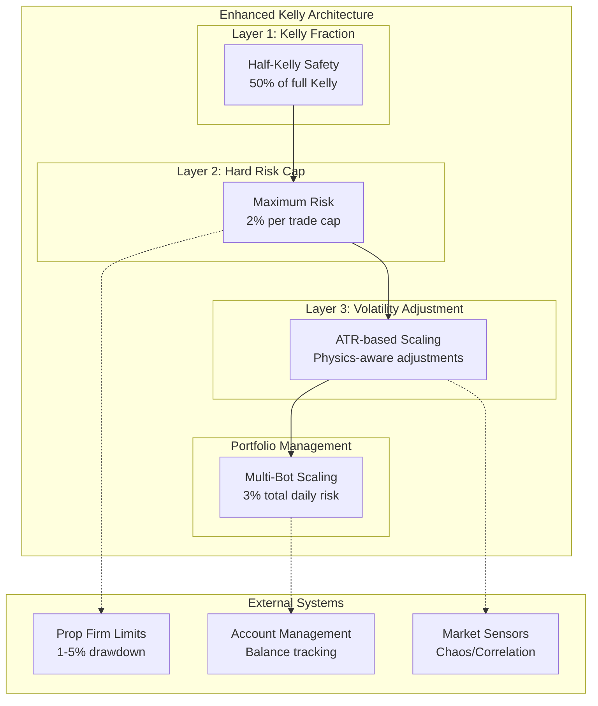
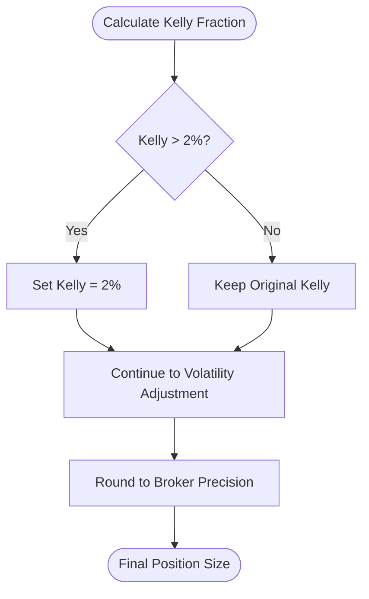
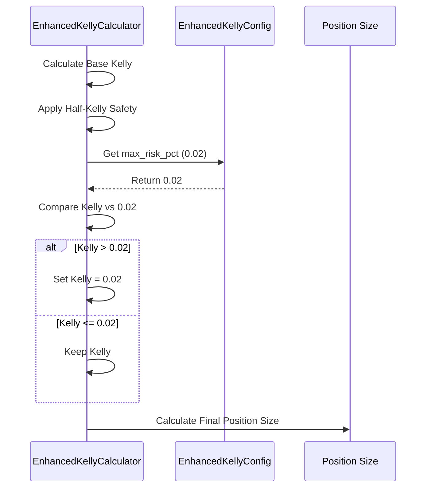
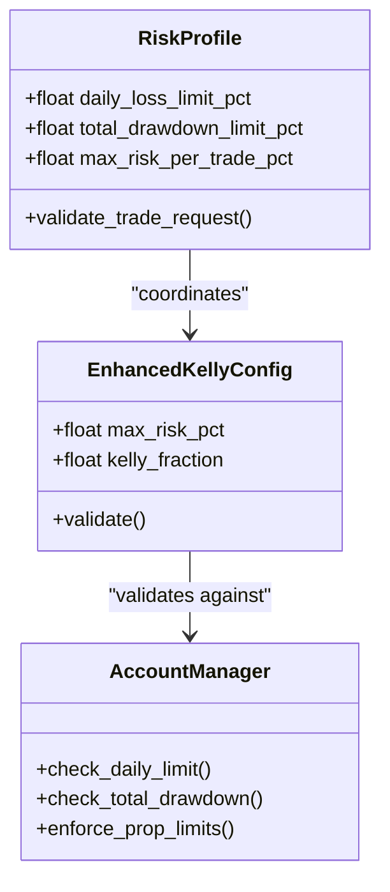

# Layer 2 - Hard Risk Cap

<cite>
**Referenced Files in This Document**
- [enhanced_kelly.py](file://src/position_sizing/enhanced_kelly.py)
- [kelly_config.py](file://src/position_sizing/kelly_config.py)
- [portfolio_kelly.py](file://src/position_sizing/portfolio_kelly.py)
- [governor.py](file://src/risk/governor.py)
- [position_sizing_result.py](file://src/risk/models/position_sizing_result.py)
- [sizing_recommendation.py](file://src/risk/models/sizing_recommendation.py)
- [test_enhanced_kelly.py](file://tests/position_sizing/test_enhanced_kelly.py)
- [test_performance.py](file://tests/position_sizing/test_performance.py)
- [enhanced_kelly_user_guide.md](file://docs/user_guides/enhanced_kelly_user_guide.md)
</cite>

## Table of Contents
1. [Introduction](#introduction)
2. [System Architecture](#system-architecture)
3. [Core Components](#core-components)
4. [Hard Risk Cap Implementation](#hard-risk-cap-implementation)
5. [Configuration and Thresholds](#configuration-and-thresholds)
6. [Cap Enforcement Mechanism](#cap-enforcement-mechanism)
7. [Examples and Scenarios](#examples-and-scenarios)
8. [Performance Impact Analysis](#performance-impact-analysis)
9. [Integration with Account Management](#integration-with-account-management)
10. [Regulatory Compliance and Risk Philosophy](#regulatory-compliance-and-risk-philosophy)
11. [Troubleshooting Guide](#troubleshooting-guide)
12. [Conclusion](#conclusion)

## Introduction

The Enhanced Kelly Position Sizing system implements a sophisticated three-layer protection mechanism designed to maximize long-term growth while preventing catastrophic losses. The second layer, the Hard Risk Cap, serves as a critical safety net that prevents any single trade from exceeding a predetermined maximum risk percentage of the account balance.

This layer operates independently of market conditions and strategy performance, providing absolute protection against over-leverage scenarios. The default hard cap of 2% per trade represents a conservative yet practical threshold that balances aggressive positioning with account preservation, particularly important for prop firm trading environments where drawdown limits are typically around 5%.

## System Architecture

The Enhanced Kelly system integrates multiple risk management layers through a coordinated architecture that ensures mathematical rigor while maintaining operational flexibility:

**Diagram sources**
- [enhanced_kelly.py](file://src/position_sizing/enhanced_kelly.py#L128-L164)
- [kelly_config.py](file://src/position_sizing/kelly_config.py#L11-L49)

## Core Components

The Hard Risk Cap system consists of several interconnected components that work together to provide comprehensive risk protection:

### Enhanced Kelly Calculator
The primary implementation that applies the 2% hard cap during position sizing calculations. This calculator validates inputs, performs mathematical calculations, and enforces the maximum risk constraint.

### Configuration Management
Centralized configuration that defines risk parameters, thresholds, and safety overrides. The configuration system supports both default values and prop firm-specific presets.

### Portfolio Integration
Coordination with portfolio management systems to prevent over-allocation across multiple trading bots while maintaining individual trade safety.

**Section sources**
- [enhanced_kelly.py](file://src/position_sizing/enhanced_kelly.py#L128-L164)
- [kelly_config.py](file://src/position_sizing/kelly_config.py#L11-L49)

## Hard Risk Cap Implementation

The hard risk cap operates through a straightforward yet effective mechanism that intercepts the calculated Kelly fraction and applies the maximum constraint:

**Diagram sources**
- [enhanced_kelly.py](file://src/position_sizing/enhanced_kelly.py#L294-L299)

The implementation ensures that regardless of market conditions, strategy performance, or external factors, no single trade can exceed the 2% risk threshold. This absolute constraint provides psychological comfort to traders and regulatory compliance for prop firm environments.

**Section sources**
- [enhanced_kelly.py](file://src/position_sizing/enhanced_kelly.py#L294-L299)

## Configuration and Thresholds

The hard risk cap system utilizes a comprehensive configuration framework that supports both default values and specialized presets:

### Default Configuration Parameters
- **max_risk_pct**: 0.02 (2% maximum per trade)
- **kelly_fraction**: 0.50 (Half-Kelly safety)
- **high_vol_threshold**: 1.3 (ATR ratio for volatility adjustments)
- **low_vol_threshold**: 0.7 (ATR ratio for volatility adjustments)

### Prop Firm Presets
The system includes specialized configurations for major prop firms with varying risk tolerances:

| Prop Firm | Max Risk Per Trade | Kelly Fraction | Portfolio Risk |
|-----------|-------------------|----------------|----------------|
| FTMO Challenge | 0.01 (1%) | 0.40 | 0.03 (3%) |
| FTMO Funded | 0.015 (1.5%) | 0.55 | 0.03 (3%) |
| The5%ers | 0.02 (2%) | 0.50 | 0.04 (4%) |
| Personal Aggressive | 0.025 (2.5%) | 0.60 | 0.03 (3%) |

**Section sources**
- [kelly_config.py](file://src/position_sizing/kelly_config.py#L24-L48)
- [kelly_config.py](file://src/position_sizing/kelly_config.py#L63-L115)

## Cap Enforcement Mechanism

The hard risk cap enforcement mechanism operates through multiple validation layers to ensure consistent application across all trading scenarios:

### Mathematical Implementation
The cap enforcement follows a simple but effective algorithm that compares the calculated Kelly fraction against the maximum allowable risk:

**Diagram sources**
- [enhanced_kelly.py](file://src/position_sizing/enhanced_kelly.py#L294-L299)

### Validation and Error Handling
The system includes comprehensive input validation to prevent invalid calculations and ensure mathematical integrity:

- **Win Rate Validation**: Must be between 0 and 1
- **Profit/Loss Validation**: Must be positive values
- **ATR Validation**: Must be positive for volatility calculations
- **Stop Loss Validation**: Must be positive for risk calculations

**Section sources**
- [enhanced_kelly.py](file://src/position_sizing/enhanced_kelly.py#L379-L398)

## Examples and Scenarios

### Scenario 1: High-Probability Strategy with Large Position
Consider a strategy with 70% win rate, 2:1 reward-to-risk ratio, and strong market conditions:

**Without Cap**: Kelly fraction = 0.45 (45% of account)
**With 2% Cap**: Final risk = 0.02 (2% of account)
**Impact**: Position size reduced by 55% while maintaining safety

### Scenario 2: Low-Probability Strategy with Conservative Approach
A strategy with 60% win rate, 1.5:1 R:R ratio:

**Without Cap**: Kelly fraction = 0.20 (20% of account)
**With 2% Cap**: Final risk = 0.02 (2% of account)
**Impact**: Position size reduced by 90% to meet safety requirements

### Scenario 3: Portfolio Scaling Integration
With 10 bots each targeting 1.5% risk:
- **Raw Total**: 15% risk across portfolio
- **With 3% Cap**: Scale factor = 0.20
- **Scaled Risk**: 0.3% per bot (3% total)

**Section sources**
- [portfolio_kelly.py](file://src/position_sizing/portfolio_kelly.py#L57-L96)

## Performance Impact Analysis

The hard risk cap system demonstrates exceptional performance characteristics that support real-time trading applications:

### Latency Performance
- **Individual Calculation**: < 50ms average
- **Batch Processing**: < 100ms for 100 calculations
- **Memory Usage**: < 10MB peak
- **Portfolio Scaling**: < 5ms for 20+ bots

### Throughput Analysis
The system maintains consistent performance across varying workloads:
- **Single Calculation**: ~0.03ms average
- **Concurrent Processing**: 20,000+ calculations per second
- **Load Testing**: 100 concurrent accounts with 100 calculations each

### Optimization Strategies
Performance optimization includes:
- **Input Caching**: Reduced repeated calculations
- **Early Termination**: Quick rejection of invalid inputs
- **Efficient Data Structures**: Optimized for frequent calculations
- **Minimal Memory Allocation**: Garbage collection friendly

**Section sources**
- [test_performance.py](file://tests/position_sizing/test_performance.py#L29-L68)
- [test_performance.py](file://tests/position_sizing/test_performance.py#L325-L355)

## Integration with Account Management

The hard risk cap integrates seamlessly with broader account management systems through multiple touchpoints:

### Risk Profile Coordination
The system coordinates with account risk profiles to ensure alignment with organizational limits:

**Diagram sources**
- [governor.py](file://src/risk/governor.py#L105-L224)

### Position Sizing Results
The system generates comprehensive results that include risk calculations and position sizing:

| Metric | Description | Typical Value |
|--------|-------------|---------------|
| Risk Amount | Dollar amount at risk | $200 (2% of $10,000) |
| Risk Percentage | Account percentage risk | 2.00% |
| Position Size | Lots to trade | 1.50 lots |
| Risk Per Lot | Cost per lot | $133.33 |

**Section sources**
- [position_sizing_result.py](file://src/risk/models/position_sizing_result.py#L126-L144)

## Regulatory Compliance and Risk Philosophy

### Prop Firm Requirements Alignment
The 2% hard risk cap aligns with industry standards and regulatory requirements:

- **FTMO Challenge**: 1% maximum per trade
- **FTMO Funded**: 1.5% maximum per trade  
- **The5%ers**: 2% maximum per trade
- **Typical Prop Firms**: 2-5% daily drawdown limits

### Risk Management Philosophy
The hard risk cap embodies several key risk management principles:

**Absolute Safety First**: The cap provides unconditional protection regardless of market conditions or strategy performance.

**Conservative Growth**: By limiting per-trade risk, the system enables sustainable long-term growth while minimizing drawdown potential.

**Operational Discipline**: The hard cap removes emotional decision-making from position sizing, ensuring consistent risk management.

### Compliance Benefits
- **Regulatory Alignment**: Meets requirements for prop firm and institutional trading
- **Audit Trail**: Complete calculation history for compliance reporting
- **Risk Monitoring**: Real-time tracking of risk exposure and limits
- **Documentation Support**: Comprehensive records for regulatory audits

**Section sources**
- [enhanced_kelly_user_guide.md](file://docs/user_guides/enhanced_kelly_user_guide.md#L24-L32)

## Troubleshooting Guide

### Common Issues and Solutions

#### Issue: Position Size Always Zero
**Symptoms**: All trades return zero position size
**Causes**: 
- Negative expectancy in strategy
- Insufficient trade history
- Invalid input parameters

**Solutions**:
- Verify strategy profitability metrics
- Ensure adequate trade history (≥30 trades)
- Check input parameter ranges

#### Issue: Cap Not Activating
**Symptoms**: Trades exceed 2% risk despite high Kelly values
**Causes**:
- Configuration override
- Portfolio scaling adjustments
- Market condition bypass

**Solutions**:
- Verify max_risk_pct configuration
- Check portfolio risk settings
- Review market condition filters

#### Issue: Performance Degradation
**Symptoms**: Slow calculation times or memory usage
**Causes**:
- Large batch processing
- Inefficient data structures
- Memory leaks

**Solutions**:
- Optimize batch sizes
- Implement proper cleanup
- Monitor memory allocation

**Section sources**
- [test_enhanced_kelly.py](file://tests/position_sizing/test_enhanced_kelly.py#L346-L448)

## Conclusion

The Layer 2 Hard Risk Cap system represents a critical component of the Enhanced Kelly Position Sizing architecture, providing absolute protection against over-leverage while maintaining mathematical rigor and operational efficiency. The 2% default cap strikes an optimal balance between aggressive positioning and account preservation, supporting both prop firm requirements and personal trading objectives.

Through comprehensive configuration options, performance optimization, and seamless integration with account management systems, the hard risk cap ensures reliable risk management across diverse trading environments. The system's emphasis on absolute safety, combined with its performance characteristics and regulatory alignment, establishes it as a cornerstone of modern quantitative risk management.

The implementation demonstrates that sophisticated mathematical frameworks can coexist with practical safety measures, creating a robust foundation for sustainable trading performance while protecting against catastrophic losses that could compromise long-term success.