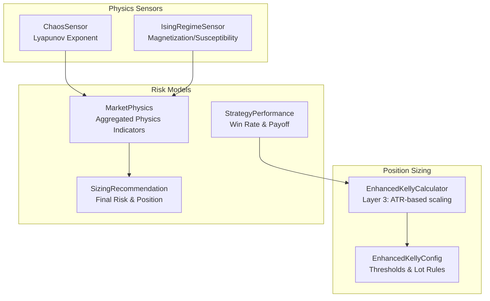
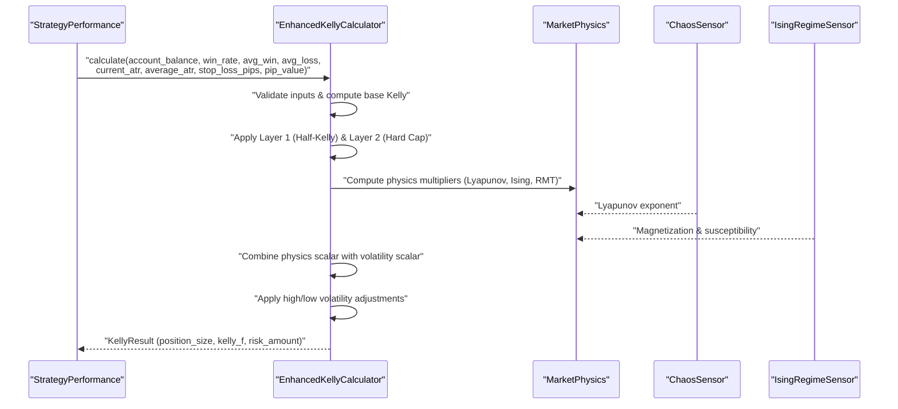
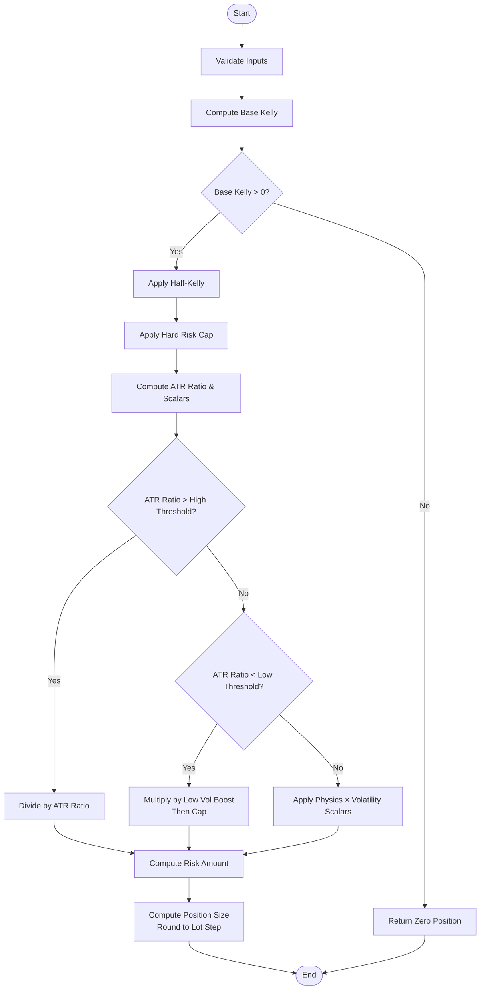
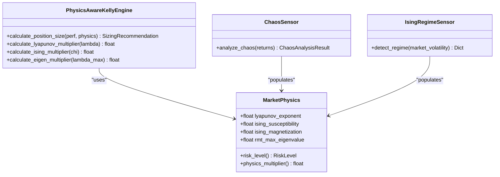
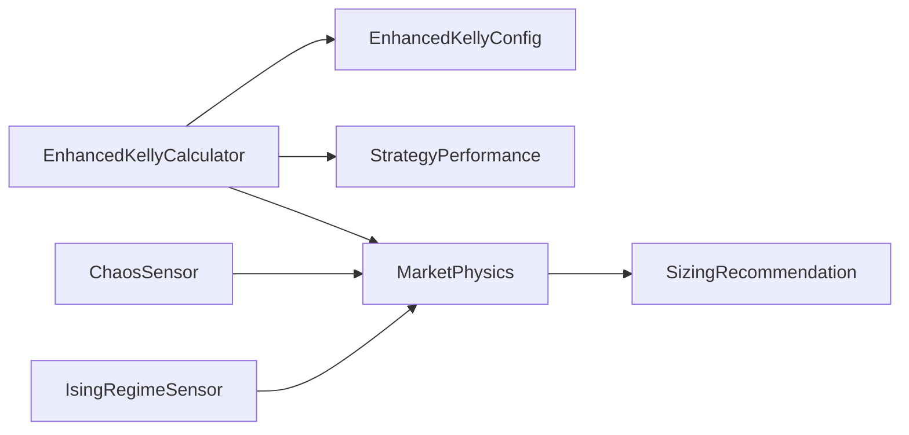

# Layer 3 - Volatility Adjustment

<cite>
**Referenced Files in This Document**
- [enhanced_kelly.py](file://src/position_sizing/enhanced_kelly.py)
- [kelly_config.py](file://src/position_sizing/kelly_config.py)
- [test_enhanced_kelly.py](file://tests/position_sizing/test_enhanced_kelly.py)
- [enhanced_kelly_position_sizing_v1.md](file://docs/trds/enhanced_kelly_position_sizing_v1.md)
- [chaos_sensor.py](file://src/risk/physics/chaos_sensor.py)
- [ising_sensor.py](file://src/risk/physics/ising_sensor.py)
- [kelly_engine.py](file://src/risk/sizing/kelly_engine.py)
- [market_physics.py](file://src/risk/models/market_physics.py)
- [strategy_performance.py](file://src/risk/models/strategy_performance.py)
- [sizing_recommendation.py](file://src/risk/models/sizing_recommendation.py)
</cite>

## Table of Contents
1. [Introduction](#introduction)
2. [Project Structure](#project-structure)
3. [Core Components](#core-components)
4. [Architecture Overview](#architecture-overview)
5. [Detailed Component Analysis](#detailed-component-analysis)
6. [Dependency Analysis](#dependency-analysis)
7. [Performance Considerations](#performance-considerations)
8. [Troubleshooting Guide](#troubleshooting-guide)
9. [Conclusion](#conclusion)

## Introduction
This document explains Layer 3 of the Enhanced Kelly position sizing system: the physics-aware volatility adjustment mechanism. It covers:
- ATR-based dynamic position sizing with high volatility reduction, low volatility conservative boost, and normal volatility maintenance
- The combined physics scalar approach using regime quality from Sentinel and volatility scaling
- Mathematical relationships between market volatility and position sizing
- Integration with chaos theory principles and market regime classification

The goal is to provide a clear, accessible guide for both technical and non-technical readers to understand how volatility and market regime characteristics influence position size decisions.

## Project Structure
The volatility adjustment system spans three primary areas:
- Position sizing core: Enhanced Kelly calculator and configuration
- Physics sensors: Chaos (Lyapunov exponent) and Ising model regime detection
- Risk models: Market physics aggregation and sizing recommendations

**Diagram sources**
- [enhanced_kelly.py](file://src/position_sizing/enhanced_kelly.py#L128-L377)
- [kelly_config.py](file://src/position_sizing/kelly_config.py#L11-L61)
- [chaos_sensor.py](file://src/risk/physics/chaos_sensor.py#L31-L241)
- [ising_sensor.py](file://src/risk/physics/ising_sensor.py#L105-L245)
- [market_physics.py](file://src/risk/models/market_physics.py#L27-L247)
- [sizing_recommendation.py](file://src/risk/models/sizing_recommendation.py#L15-L229)
- [strategy_performance.py](file://src/risk/models/strategy_performance.py#L16-L182)

**Section sources**
- [enhanced_kelly.py](file://src/position_sizing/enhanced_kelly.py#L1-L418)
- [kelly_config.py](file://src/position_sizing/kelly_config.py#L1-L116)
- [chaos_sensor.py](file://src/risk/physics/chaos_sensor.py#L1-L253)
- [ising_sensor.py](file://src/risk/physics/ising_sensor.py#L1-L246)
- [market_physics.py](file://src/risk/models/market_physics.py#L1-L247)
- [sizing_recommendation.py](file://src/risk/models/sizing_recommendation.py#L1-L229)
- [strategy_performance.py](file://src/risk/models/strategy_performance.py#L1-L182)

## Core Components
- Enhanced Kelly Calculator: Implements the three-layer protection system, including the volatility-adjusted Layer 3 using ATR ratios and physics scalars
- Enhanced Kelly Config: Defines thresholds for high/low volatility detection, conservative boost multipliers, and broker constraints
- Chaos Sensor: Computes Lyapunov exponent to quantify chaos and inform physics multipliers
- Ising Regime Sensor: Maps volatility to temperature and classifies market regimes via magnetization and susceptibility
- Market Physics Model: Aggregates physics indicators into a single risk-adjustment framework
- Strategy Performance & Sizing Recommendation: Provide the inputs and outputs for position sizing decisions

Key Layer 3 mechanics:
- High volatility reduction: When ATR ratio > high_vol_threshold, position size is divided by the ATR ratio
- Low volatility conservative boost: When ATR ratio < low_vol_threshold, position size is multiplied by low_vol_boost (subject to risk caps)
- Normal volatility maintenance: When ATR ratio falls between thresholds, position size is adjusted by combined physics scalar

**Section sources**
- [enhanced_kelly.py](file://src/position_sizing/enhanced_kelly.py#L128-L377)
- [kelly_config.py](file://src/position_sizing/kelly_config.py#L11-L61)
- [chaos_sensor.py](file://src/risk/physics/chaos_sensor.py#L31-L241)
- [ising_sensor.py](file://src/risk/physics/ising_sensor.py#L105-L245)
- [market_physics.py](file://src/risk/models/market_physics.py#L27-L247)
- [strategy_performance.py](file://src/risk/models/strategy_performance.py#L16-L182)
- [sizing_recommendation.py](file://src/risk/models/sizing_recommendation.py#L15-L229)

## Architecture Overview
The Layer 3 volatility adjustment integrates with the broader Enhanced Kelly ecosystem:

**Diagram sources**
- [enhanced_kelly.py](file://src/position_sizing/enhanced_kelly.py#L190-L377)
- [kelly_engine.py](file://src/risk/sizing/kelly_engine.py#L89-L282)
- [chaos_sensor.py](file://src/risk/physics/chaos_sensor.py#L195-L241)
- [ising_sensor.py](file://src/risk/physics/ising_sensor.py#L140-L195)
- [market_physics.py](file://src/risk/models/market_physics.py#L159-L177)

## Detailed Component Analysis

### Enhanced Kelly Calculator (Layer 3)
The Enhanced Kelly Calculator performs the following volatility-adjusted steps:
1. Validates inputs and computes base Kelly fraction
2. Applies Layer 1 (Half-Kelly) and Layer 2 (Hard Risk Cap)
3. Computes ATR ratio and combined physics scalar from Sentinel regime quality
4. Applies high/low volatility adjustments:
   - High volatility: divide by ATR ratio
   - Low volatility: multiply by low_vol_boost (then cap at max risk)
   - Normal: apply physics scalar × volatility scalar
5. Calculates risk amount and position size, rounds to broker lot step

**Diagram sources**
- [enhanced_kelly.py](file://src/position_sizing/enhanced_kelly.py#L190-L377)
- [kelly_config.py](file://src/position_sizing/kelly_config.py#L27-L30)

**Section sources**
- [enhanced_kelly.py](file://src/position_sizing/enhanced_kelly.py#L128-L377)
- [kelly_config.py](file://src/position_sizing/kelly_config.py#L11-L61)

### Physics-Aware Multipliers and Sentinel Regime Quality
The system combines physics signals with regime quality from Sentinel:
- Physics scalar: regime_quality (1.0 stable, 0.0 chaotic)
- Volatility scalar: inverse of ATR ratio (lower current ATR increases scalar)
- Combined adjustment: multiply base Kelly by both scalars, then apply Layer 3 volatility rules

**Diagram sources**
- [market_physics.py](file://src/risk/models/market_physics.py#L27-L247)
- [kelly_engine.py](file://src/risk/sizing/kelly_engine.py#L25-L282)
- [chaos_sensor.py](file://src/risk/physics/chaos_sensor.py#L31-L241)
- [ising_sensor.py](file://src/risk/physics/ising_sensor.py#L105-L245)

**Section sources**
- [kelly_engine.py](file://src/risk/sizing/kelly_engine.py#L25-L282)
- [market_physics.py](file://src/risk/models/market_physics.py#L131-L177)
- [chaos_sensor.py](file://src/risk/physics/chaos_sensor.py#L195-L241)
- [ising_sensor.py](file://src/risk/physics/ising_sensor.py#L140-L195)

### Threshold Configuration and Examples
Threshold configuration for high/low volatility detection:
- High volatility threshold: above which position size is reduced
- Low volatility threshold: below which position size is boosted conservatively
- Low volatility boost multiplier: applied in calm markets (subject to caps)

Example scenarios:
- High volatility reduction: ATR ratio = 2.0 → reduce position by 2.0×
- Low volatility conservative boost: ATR ratio = 0.5 → increase position by low_vol_boost (e.g., 1.2×)
- Normal volatility: ATR ratio between thresholds → apply physics × volatility scalars

These behaviors are validated by unit tests covering high/low volatility states and normal market conditions.

**Section sources**
- [kelly_config.py](file://src/position_sizing/kelly_config.py#L27-L30)
- [test_enhanced_kelly.py](file://tests/position_sizing/test_enhanced_kelly.py#L166-L239)

### Mathematical Relationship Between Volatility and Position Sizing
The relationship is piecewise:
- Base risk = min(base_Kelly × safety_fraction, max_risk_pct)
- Volatility-adjusted risk = Base risk × physics_scalar × vol_scalar
- If ATR ratio > high_threshold: risk = risk / ATR_ratio
- If ATR ratio < low_threshold: risk = risk × low_vol_boost (then cap)
- Position size = (account_balance × risk) / (stop_loss_pips × pip_value)
- Rounded to nearest broker lot step

This ensures:
- Downside protection during high volatility
- Conservative expansion during low volatility
- Consistent adherence to hard risk caps and broker constraints

**Section sources**
- [enhanced_kelly.py](file://src/position_sizing/enhanced_kelly.py#L190-L377)
- [kelly_config.py](file://src/position_sizing/kelly_config.py#L27-L30)

## Dependency Analysis
The Layer 3 volatility adjustment depends on:
- Enhanced Kelly Calculator and Config for thresholds and rounding rules
- Market Physics for aggregated multipliers and risk levels
- Chaos and Ising sensors for Lyapunov and Ising indicators
- Strategy Performance and Sizing Recommendation for inputs and outputs

**Diagram sources**
- [enhanced_kelly.py](file://src/position_sizing/enhanced_kelly.py#L128-L377)
- [kelly_config.py](file://src/position_sizing/kelly_config.py#L11-L61)
- [market_physics.py](file://src/risk/models/market_physics.py#L27-L247)
- [chaos_sensor.py](file://src/risk/physics/chaos_sensor.py#L31-L241)
- [ising_sensor.py](file://src/risk/physics/ising_sensor.py#L105-L245)
- [sizing_recommendation.py](file://src/risk/models/sizing_recommendation.py#L15-L229)

**Section sources**
- [enhanced_kelly.py](file://src/position_sizing/enhanced_kelly.py#L128-L377)
- [kelly_engine.py](file://src/risk/sizing/kelly_engine.py#L25-L282)
- [market_physics.py](file://src/risk/models/market_physics.py#L27-L247)

## Performance Considerations
- Computational efficiency: Physics sensors operate on rolling windows; cache results where appropriate
- Numerical stability: Ensure ATR ratio is well-defined and avoid division by zero
- Broker constraints: Lot step rounding prevents unrealistic fractional positions
- Monte Carlo validation: Optional post-processing for high-risk scenarios

[No sources needed since this section provides general guidance]

## Troubleshooting Guide
Common issues and resolutions:
- Negative expectancy: Returns zero position with explanatory adjustments
- Invalid inputs: Validation raises clear errors for out-of-range parameters
- Extremely high volatility: ATR ratio triggers severe reductions; confirm data quality
- Low volatility boost not applying: Verify thresholds and ensure risk cap does not override boost
- Lot rounding conflicts: Adjust min/max lot sizes and lot step to align with broker rules

**Section sources**
- [enhanced_kelly.py](file://src/position_sizing/enhanced_kelly.py#L25-L398)
- [test_enhanced_kelly.py](file://tests/position_sizing/test_enhanced_kelly.py#L346-L448)

## Conclusion
Layer 3 of the Enhanced Kelly system introduces a robust, physics-informed volatility adjustment that dynamically scales position size according to market conditions. By combining ATR-based scalars with regime quality from Sentinel and chaos theory insights, the system reduces risk during turbulent periods and allows for measured expansion during stable environments. The result is a safer, more adaptive approach to position sizing that aligns with econophysical principles and real-world market dynamics.