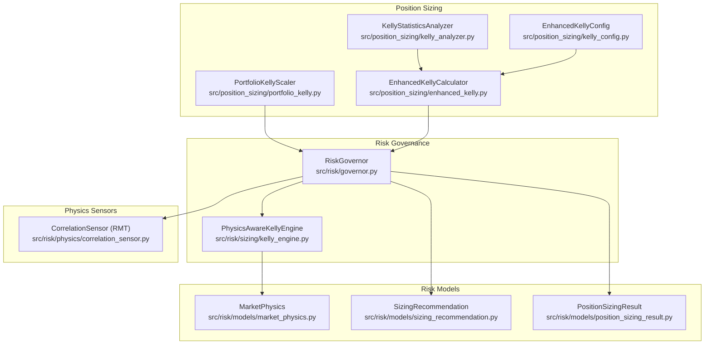
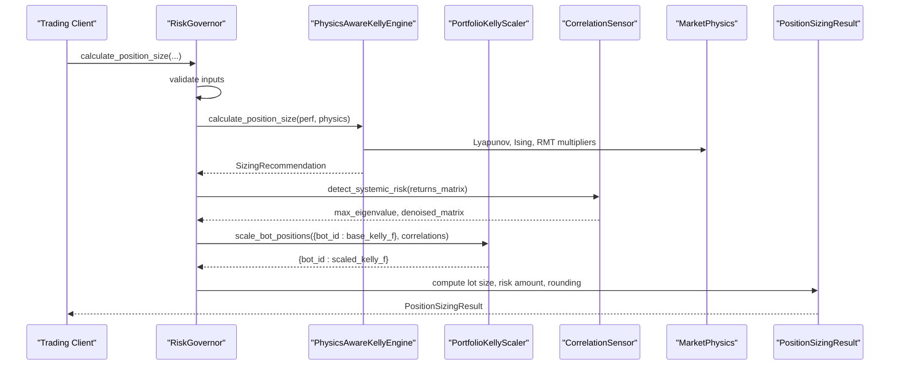
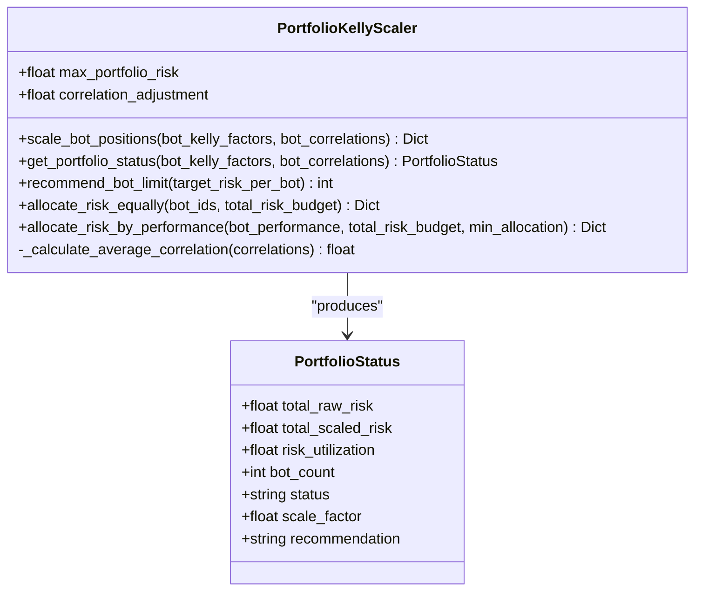
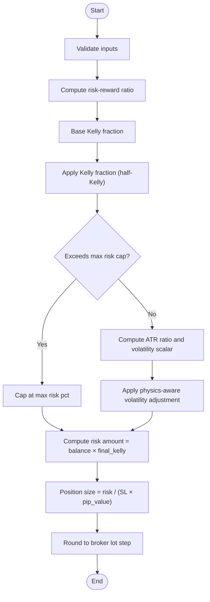
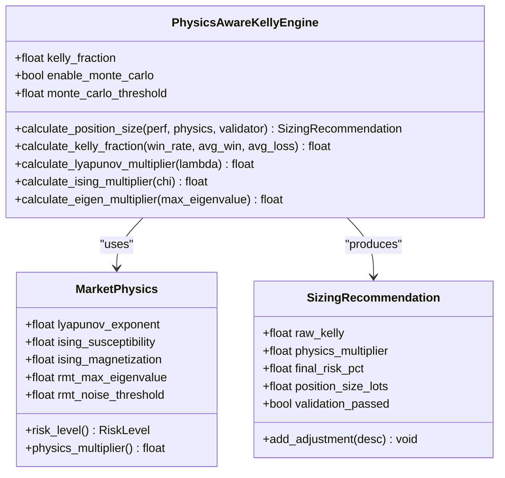
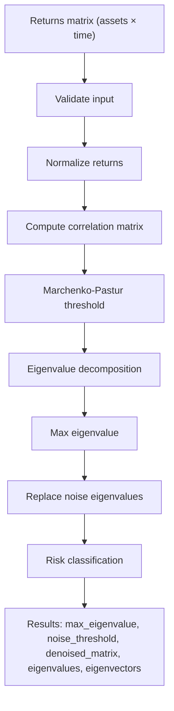
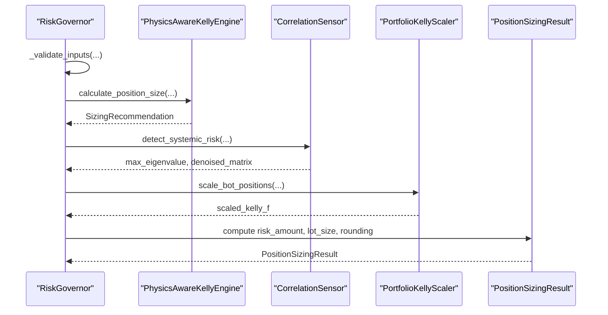
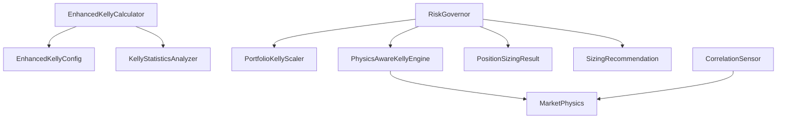

# Portfolio Kelly Scaling

<cite>
**Referenced Files in This Document**
- [portfolio_kelly.py](file://src/position_sizing/portfolio_kelly.py)
- [enhanced_kelly.py](file://src/position_sizing/enhanced_kelly.py)
- [kelly_analyzer.py](file://src/position_sizing/kelly_analyzer.py)
- [kelly_config.py](file://src/position_sizing/kelly_config.py)
- [kelly_engine.py](file://src/risk/sizing/kelly_engine.py)
- [correlation_sensor.py](file://src/risk/physics/correlation_sensor.py)
- [position_sizing_result.py](file://src/risk/models/position_sizing_result.py)
- [market_physics.py](file://src/risk/models/market_physics.py)
- [sizing_recommendation.py](file://src/risk/models/sizing_recommendation.py)
- [governor.py](file://src/risk/governor.py)
- [test_portfolio_kelly.py](file://tests/position_sizing/test_portfolio_kelly.py)
- [enhanced_kelly_position_sizing_v1.md](file://docs/trds/enhanced_kelly_position_sizing_v1.md)
</cite>

## Table of Contents
1. [Introduction](#introduction)
2. [Project Structure](#project-structure)
3. [Core Components](#core-components)
4. [Architecture Overview](#architecture-overview)
5. [Detailed Component Analysis](#detailed-component-analysis)
6. [Dependency Analysis](#dependency-analysis)
7. [Performance Considerations](#performance-considerations)
8. [Troubleshooting Guide](#troubleshooting-guide)
9. [Conclusion](#conclusion)
10. [Appendices](#appendices)

## Introduction
This document explains portfolio-level Kelly scaling and correlation-based position sizing within the QuantMindX ecosystem. It details how the system scales individual position sizes based on portfolio-wide risk exposure, correlation analysis between instruments, and systematic risk assessment. The documentation covers:
- Portfolio Kelly calculation methodology
- Diversification benefits quantification
- Position size adjustment for correlated positions
- Examples of portfolio construction scenarios
- Correlation matrix analysis
- Dynamic position scaling based on portfolio volatility targets
- Integration with risk governance systems
- Maximum drawdown constraints
- Performance optimization through proper diversification

## Project Structure
The portfolio Kelly scaling system spans several modules:
- Position sizing core: portfolio-level scaling, enhanced Kelly, and analyzer
- Risk governance: orchestrator integrating physics sensors, portfolio scaling, and sizing
- Risk models: market physics, sizing recommendation, and position sizing result
- Physics sensors: correlation analysis via Random Matrix Theory (RMT)

**Diagram sources**
- [portfolio_kelly.py](file://src/position_sizing/portfolio_kelly.py#L26-L254)
- [enhanced_kelly.py](file://src/position_sizing/enhanced_kelly.py#L128-L418)
- [kelly_analyzer.py](file://src/position_sizing/kelly_analyzer.py#L27-L228)
- [kelly_config.py](file://src/position_sizing/kelly_config.py#L11-L116)
- [governor.py](file://src/risk/governor.py#L42-L447)
- [kelly_engine.py](file://src/risk/sizing/kelly_engine.py#L25-L368)
- [correlation_sensor.py](file://src/risk/physics/correlation_sensor.py#L22-L285)
- [market_physics.py](file://src/risk/models/market_physics.py#L27-L247)
- [sizing_recommendation.py](file://src/risk/models/sizing_recommendation.py#L15-L229)
- [position_sizing_result.py](file://src/risk/models/position_sizing_result.py#L16-L246)

**Section sources**
- [portfolio_kelly.py](file://src/position_sizing/portfolio_kelly.py#L1-L254)
- [governor.py](file://src/risk/governor.py#L42-L447)

## Core Components
- PortfolioKellyScaler: Computes portfolio-wide risk scaling and correlation penalties to prevent over-leverage across multiple bots.
- EnhancedKellyCalculator: Implements layered position sizing with Kelly fraction, hard risk caps, and volatility adjustments.
- KellyStatisticsAnalyzer: Extracts Kelly parameters from trade history for sizing inputs.
- RiskGovernor: Orchestrates physics sensors, portfolio scaling, and sizing to produce final position sizes.
- Physics sensors and models: Provide chaos, correlation, and market regime signals for risk adjustment.

Key capabilities:
- Portfolio risk budgeting and proportional scaling
- Correlation-based diversification penalties
- Performance-based risk allocation
- Physics-aware risk caps and multipliers
- Monte Carlo validation for risk of ruin

**Section sources**
- [portfolio_kelly.py](file://src/position_sizing/portfolio_kelly.py#L26-L254)
- [enhanced_kelly.py](file://src/position_sizing/enhanced_kelly.py#L128-L418)
- [kelly_analyzer.py](file://src/position_sizing/kelly_analyzer.py#L27-L228)
- [governor.py](file://src/risk/governor.py#L42-L447)
- [kelly_engine.py](file://src/risk/sizing/kelly_engine.py#L25-L368)
- [correlation_sensor.py](file://src/risk/physics/correlation_sensor.py#L22-L285)
- [market_physics.py](file://src/risk/models/market_physics.py#L27-L247)
- [sizing_recommendation.py](file://src/risk/models/sizing_recommendation.py#L15-L229)
- [position_sizing_result.py](file://src/risk/models/position_sizing_result.py#L16-L246)

## Architecture Overview
The system integrates position sizing with risk governance and econophysical signals:
- Input: account balance, performance metrics, ATR, stop loss, pip value, and optional portfolio risk data
- Processing: base Kelly, physics adjustments, prop firm constraints, portfolio scaling, volatility scaling
- Output: final position size, risk amount, and audit trail

**Diagram sources**
- [governor.py](file://src/risk/governor.py#L105-L224)
- [kelly_engine.py](file://src/risk/sizing/kelly_engine.py#L89-L282)
- [correlation_sensor.py](file://src/risk/physics/correlation_sensor.py#L229-L281)
- [portfolio_kelly.py](file://src/position_sizing/portfolio_kelly.py#L57-L96)
- [position_sizing_result.py](file://src/risk/models/position_sizing_result.py#L146-L185)

## Detailed Component Analysis

### Portfolio Kelly Scaling
PortfolioKellyScaler manages position sizing across multiple bots to prevent portfolio over-leverage. It:
- Sums individual Kelly fractions and compares against a maximum portfolio risk
- Applies proportional scaling when total risk exceeds the limit
- Incorporates correlation penalties to adjust for lack of diversification
- Provides portfolio status reporting and allocation strategies

**Diagram sources**
- [portfolio_kelly.py](file://src/position_sizing/portfolio_kelly.py#L14-L254)

Key behaviors:
- Proportional scaling: scale_factor = max_portfolio_risk / raw_total_risk
- Correlation penalty: correlation_penalty = 1.0 + (avg_correlation × (correlation_adjustment - 1.0))
- Status thresholds: safe (< 70%), caution (70–90%), danger (> 90%)

**Section sources**
- [portfolio_kelly.py](file://src/position_sizing/portfolio_kelly.py#L26-L254)
- [test_portfolio_kelly.py](file://tests/position_sizing/test_portfolio_kelly.py#L20-L451)

### Enhanced Kelly Position Sizing
EnhancedKellyCalculator implements a three-layer protection system:
1. Kelly fraction (default 50% of full Kelly)
2. Hard risk cap (default 2% per trade)
3. Dynamic volatility adjustment (ATR-based scaling)

**Diagram sources**
- [enhanced_kelly.py](file://src/position_sizing/enhanced_kelly.py#L190-L377)

**Section sources**
- [enhanced_kelly.py](file://src/position_sizing/enhanced_kelly.py#L128-L418)
- [kelly_config.py](file://src/position_sizing/kelly_config.py#L11-L116)

### Physics-Aware Kelly Engine
PhysicsAwareKellyEngine combines traditional Kelly with econophysical indicators:
- Lyapunov multiplier for chaos sensitivity
- Ising multiplier for phase transitions
- Eigenvalue multiplier from RMT for systemic risk
- Weakest-link aggregation and optional Monte Carlo validation

**Diagram sources**
- [kelly_engine.py](file://src/risk/sizing/kelly_engine.py#L25-L368)
- [market_physics.py](file://src/risk/models/market_physics.py#L27-L247)
- [sizing_recommendation.py](file://src/risk/models/sizing_recommendation.py#L15-L229)

**Section sources**
- [kelly_engine.py](file://src/risk/sizing/kelly_engine.py#L25-L368)
- [market_physics.py](file://src/risk/models/market_physics.py#L27-L247)
- [sizing_recommendation.py](file://src/risk/models/sizing_recommendation.py#L15-L229)

### Correlation Analysis and RMT Filtering
CorrelationSensor performs Random Matrix Theory analysis to:
- Detect systemic risk via maximum eigenvalue
- Denoise correlation matrices
- Provide risk classification and denoised outputs

**Diagram sources**
- [correlation_sensor.py](file://src/risk/physics/correlation_sensor.py#L229-L281)

**Section sources**
- [correlation_sensor.py](file://src/risk/physics/correlation_sensor.py#L22-L285)

### Risk Governance Orchestration
RiskGovernor coordinates:
- Input validation
- Base Kelly calculation
- Physics-based adjustments
- Prop firm constraints
- Portfolio scaling
- Final position sizing and rounding

**Diagram sources**
- [governor.py](file://src/risk/governor.py#L105-L224)
- [kelly_engine.py](file://src/risk/sizing/kelly_engine.py#L89-L282)
- [correlation_sensor.py](file://src/risk/physics/correlation_sensor.py#L229-L281)
- [portfolio_kelly.py](file://src/position_sizing/portfolio_kelly.py#L57-L96)
- [position_sizing_result.py](file://src/risk/models/position_sizing_result.py#L146-L185)

**Section sources**
- [governor.py](file://src/risk/governor.py#L42-L447)

## Dependency Analysis
The system exhibits clear layering and separation of concerns:
- Position sizing depends on performance analytics and configuration
- Risk governance integrates physics sensors and portfolio scaling
- Models provide structured outputs for auditability and validation

**Diagram sources**
- [enhanced_kelly.py](file://src/position_sizing/enhanced_kelly.py#L128-L418)
- [kelly_config.py](file://src/position_sizing/kelly_config.py#L11-L116)
- [kelly_analyzer.py](file://src/position_sizing/kelly_analyzer.py#L27-L228)
- [governor.py](file://src/risk/governor.py#L42-L447)
- [portfolio_kelly.py](file://src/position_sizing/portfolio_kelly.py#L26-L254)
- [kelly_engine.py](file://src/risk/sizing/kelly_engine.py#L25-L368)
- [correlation_sensor.py](file://src/risk/physics/correlation_sensor.py#L22-L285)
- [market_physics.py](file://src/risk/models/market_physics.py#L27-L247)
- [position_sizing_result.py](file://src/risk/models/position_sizing_result.py#L16-L246)
- [sizing_recommendation.py](file://src/risk/models/sizing_recommendation.py#L15-L229)

**Section sources**
- [enhanced_kelly.py](file://src/position_sizing/enhanced_kelly.py#L128-L418)
- [governor.py](file://src/risk/governor.py#L42-L447)

## Performance Considerations
- Caching: RiskGovernor caches physics and account data to reduce computation overhead
- Batch processing: Portfolio scaling supports equal and performance-based allocations to optimize diversification
- Rounding: Broker lot step rounding prevents fractional lot violations
- Monte Carlo validation: Optional validation reduces risk of ruin for high-risk scenarios

[No sources needed since this section provides general guidance]

## Troubleshooting Guide
Common issues and resolutions:
- Negative expectancy: Enhanced Kelly returns zero position; analyzer flags low reliability
- Over-leveraging: Portfolio scaling reduces positions; review correlation penalties
- Data gaps: Physics sensors require minimum periods; ensure adequate history
- Broker constraints: Lot rounding may reduce position; adjust lot step or account balance

**Section sources**
- [enhanced_kelly.py](file://src/position_sizing/enhanced_kelly.py#L267-L286)
- [kelly_analyzer.py](file://src/position_sizing/kelly_analyzer.py#L104-L127)
- [correlation_sensor.py](file://src/risk/physics/correlation_sensor.py#L57-L80)
- [governor.py](file://src/risk/governor.py#L334-L347)

## Conclusion
The QuantMindX portfolio Kelly scaling system provides a robust framework for dynamic position sizing that accounts for portfolio risk, correlation effects, and systemic market regimes. By combining layered position sizing, econophysical risk signals, and portfolio-level controls, it enables disciplined trading under varying market conditions while maintaining safety and performance.

[No sources needed since this section summarizes without analyzing specific files]

## Appendices

### Portfolio Construction Scenarios
- Scenario A: Balanced portfolio with moderate correlations
  - Use proportional scaling; apply modest correlation penalty
- Scenario B: Highly correlated strategies
  - Apply stronger correlation penalty; consider reducing bot count
- Scenario C: Mixed performance bots
  - Use performance-based allocation with minimum risk per bot

**Section sources**
- [portfolio_kelly.py](file://src/position_sizing/portfolio_kelly.py#L174-L253)
- [test_portfolio_kelly.py](file://tests/position_sizing/test_portfolio_kelly.py#L164-L247)

### Correlation Matrix Analysis
- Input: returns matrix (assets × time)
- Output: max eigenvalue, denoised correlation matrix, risk classification
- Use max eigenvalue to infer systemic risk and adjust position sizing accordingly

**Section sources**
- [correlation_sensor.py](file://src/risk/physics/correlation_sensor.py#L229-L281)

### Dynamic Position Scaling Based on Portfolio Volatility Targets
- Target: Keep total portfolio risk within max_portfolio_risk
- Method: Compute average correlation and apply penalty; scale proportionally
- Monitoring: Use PortfolioStatus to track utilization and recommendations

**Section sources**
- [portfolio_kelly.py](file://src/position_sizing/portfolio_kelly.py#L57-L158)
- [test_portfolio_kelly.py](file://tests/position_sizing/test_portfolio_kelly.py#L20-L101)

### Integration with Risk Governance Systems
- RiskGovernor orchestrates all components and caches results
- Prop firm presets enforce constraints
- Monte Carlo validation provides an additional safety net

**Section sources**
- [governor.py](file://src/risk/governor.py#L68-L104)
- [kelly_engine.py](file://src/risk/sizing/kelly_engine.py#L54-L87)

### Maximum Drawdown Constraints and Performance Optimization
- Physics multipliers reduce risk during chaotic or critical regimes
- Monte Carlo validation rejects excessive risk sizes
- Proper diversification lowers correlation penalties and improves risk-adjusted returns

**Section sources**
- [kelly_engine.py](file://src/risk/sizing/kelly_engine.py#L199-L246)
- [market_physics.py](file://src/risk/models/market_physics.py#L131-L177)