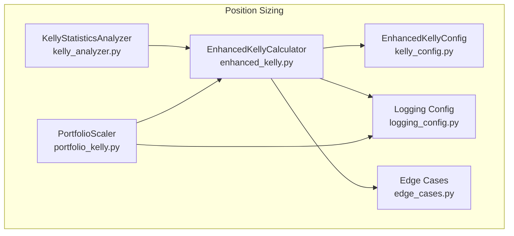
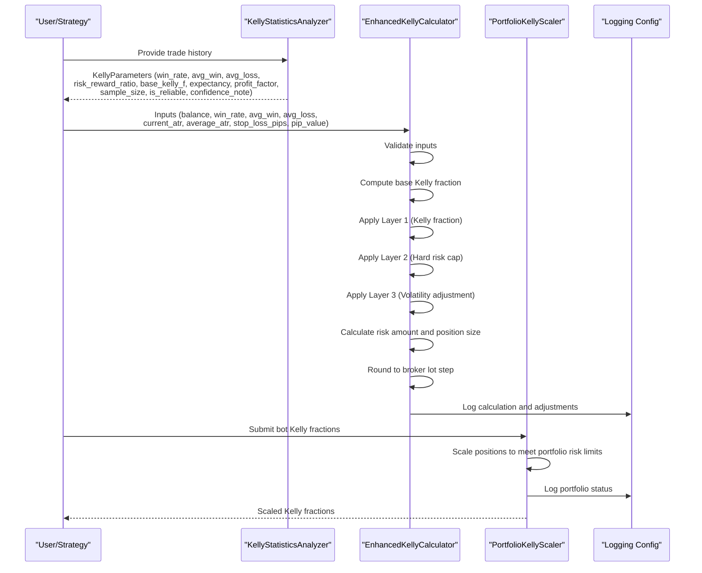
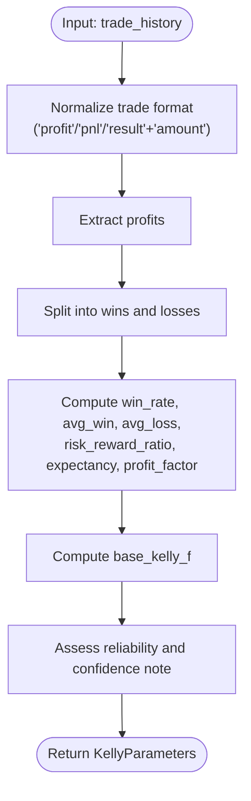
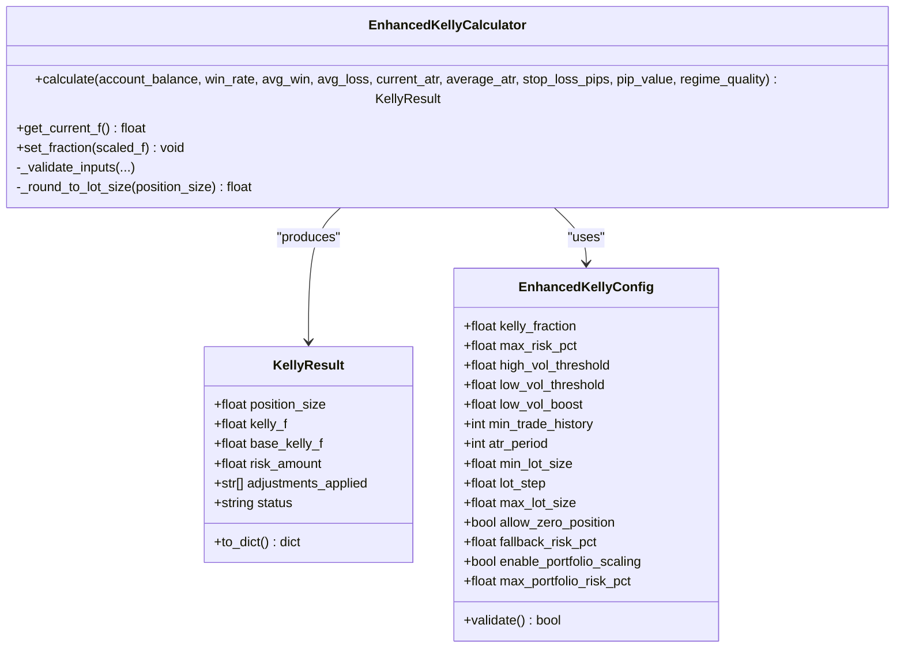
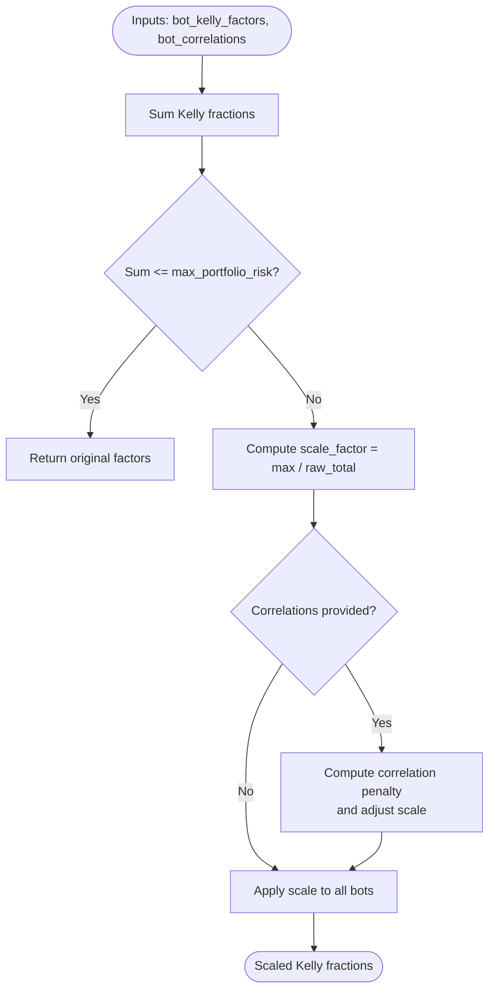
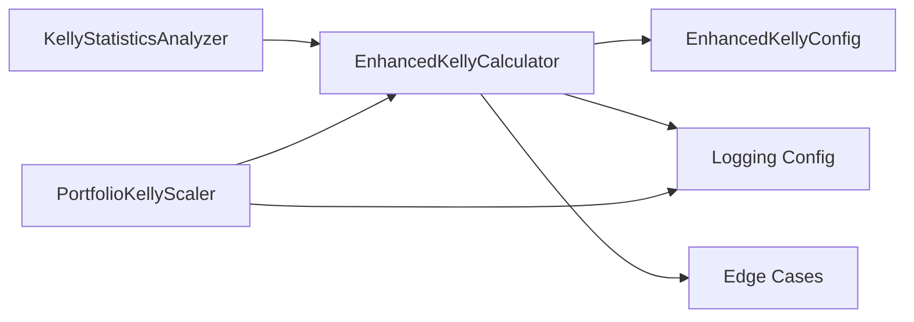

# Risk Analysis and Monitoring

<cite>
**Referenced Files in This Document**
- [kelly_analyzer.py](file://src/position_sizing/kelly_analyzer.py)
- [enhanced_kelly.py](file://src/position_sizing/enhanced_kelly.py)
- [logging_config.py](file://src/position_sizing/logging_config.py)
- [kelly_config.py](file://src/position_sizing/kelly_config.py)
- [portfolio_kelly.py](file://src/position_sizing/portfolio_kelly.py)
- [edge_cases.py](file://src/position_sizing/edge_cases.py)
- [test_kelly_analyzer.py](file://tests/position_sizing/test_kelly_analyzer.py)
- [test_enhanced_kelly.py](file://tests/position_sizing/test_enhanced_kelly.py)
- [test_portfolio_kelly.py](file://tests/position_sizing/test_portfolio_kelly.py)
- [enhanced_kelly_user_guide.md](file://docs/user_guides/enhanced_kelly_user_guide.md)
- [enhanced_kelly_position_sizing_v1.md](file://docs/trds/enhanced_kelly_position_sizing_v1.md)
</cite>

## Table of Contents
1. [Introduction](#introduction)
2. [Project Structure](#project-structure)
3. [Core Components](#core-components)
4. [Architecture Overview](#architecture-overview)
5. [Detailed Component Analysis](#detailed-component-analysis)
6. [Dependency Analysis](#dependency-analysis)
7. [Performance Considerations](#performance-considerations)
8. [Troubleshooting Guide](#troubleshooting-guide)
9. [Conclusion](#conclusion)
10. [Appendices](#appendices)

## Introduction
This document describes the Enhanced Kelly risk analysis and monitoring toolkit, focusing on position sizing performance tracking, historical analysis capabilities, and risk metrics computation. It explains how the system extracts and interprets Kelly parameters from trade history, computes dynamic position sizes with layered safety protections, manages portfolio risk across multiple bots, and provides structured logging and edge-case handling. It also outlines workflows for risk analysis, performance benchmarking, and integration with trading performance reporting systems, along with optimization opportunities for data-driven insights.

## Project Structure
The toolkit resides under the position sizing subsystem and integrates tightly with configuration, logging, and portfolio management utilities. The primary modules are:
- Kelly parameter extraction and rolling analysis
- Enhanced Kelly position sizing with 3-layer protections
- Portfolio scaling across multiple bots
- Logging and structured event capture
- Edge case handling and safety validations
- Tests validating behavior across scenarios

**Diagram sources**
- [kelly_analyzer.py](file://src/position_sizing/kelly_analyzer.py#L27-L228)
- [enhanced_kelly.py](file://src/position_sizing/enhanced_kelly.py#L128-L418)
- [kelly_config.py](file://src/position_sizing/kelly_config.py#L11-L116)
- [logging_config.py](file://src/position_sizing/logging_config.py#L58-L292)
- [edge_cases.py](file://src/position_sizing/edge_cases.py#L22-L438)
- [portfolio_kelly.py](file://src/position_sizing/portfolio_kelly.py#L26-L254)

**Section sources**
- [kelly_analyzer.py](file://src/position_sizing/kelly_analyzer.py#L1-L228)
- [enhanced_kelly.py](file://src/position_sizing/enhanced_kelly.py#L1-L418)
- [kelly_config.py](file://src/position_sizing/kelly_config.py#L1-L116)
- [logging_config.py](file://src/position_sizing/logging_config.py#L1-L292)
- [edge_cases.py](file://src/position_sizing/edge_cases.py#L1-L438)
- [portfolio_kelly.py](file://src/position_sizing/portfolio_kelly.py#L1-L254)

## Core Components
- KellyStatisticsAnalyzer: Extracts Kelly parameters (win rate, average win/loss, risk-reward ratio, base Kelly fraction, expectancy, profit factor), assesses reliability, and supports rolling-window analysis and edge decay detection.
- EnhancedKellyCalculator: Computes position size using a 3-layer protection system (Kelly fraction, hard risk cap, dynamic volatility adjustment), validates inputs, rounds to broker lot constraints, and logs detailed calculation steps.
- EnhancedKellyConfig: Centralizes configuration for safety multipliers, caps, volatility thresholds, broker constraints, and portfolio scaling parameters.
- PortfolioKellyScaler: Scales positions across multiple bots to maintain total portfolio risk within safe bounds, optionally adjusting for correlation.
- Logging Config: Structured JSON logging for calculations, edge cases, performance metrics, and portfolio status.
- Edge Case Handler: Provides fallbacks and safety checks for insufficient history, missing data, negative expectancy, extreme market events, and broker constraints.

**Section sources**
- [kelly_analyzer.py](file://src/position_sizing/kelly_analyzer.py#L27-L228)
- [enhanced_kelly.py](file://src/position_sizing/enhanced_kelly.py#L128-L418)
- [kelly_config.py](file://src/position_sizing/kelly_config.py#L11-L116)
- [portfolio_kelly.py](file://src/position_sizing/portfolio_kelly.py#L26-L254)
- [logging_config.py](file://src/position_sizing/logging_config.py#L58-L292)
- [edge_cases.py](file://src/position_sizing/edge_cases.py#L22-L438)

## Architecture Overview
The toolkit orchestrates position sizing decisions by combining historical performance analysis with real-time market conditions and portfolio constraints. The flow begins with trade history analysis, proceeds through Enhanced Kelly calculation with safeguards, and concludes with portfolio risk management and logging.

**Diagram sources**
- [kelly_analyzer.py](file://src/position_sizing/kelly_analyzer.py#L44-L127)
- [enhanced_kelly.py](file://src/position_sizing/enhanced_kelly.py#L190-L377)
- [portfolio_kelly.py](file://src/position_sizing/portfolio_kelly.py#L57-L158)
- [logging_config.py](file://src/position_sizing/logging_config.py#L106-L211)

## Detailed Component Analysis

### KellyStatisticsAnalyzer
- Purpose: Extract and interpret Kelly parameters from historical trades, support rolling analysis, and detect edge decay.
- Key capabilities:
  - Parameter extraction supporting multiple trade formats (direct profit, PnL, or result/amount).
  - Reliability assessment based on sample size with confidence notes.
  - Rolling window analysis to track evolving win rates and detect decay.
  - Edge decay detection comparing recent vs historical win rates.
- Complexity:
  - Parameter extraction: O(n) over trade history length.
  - Rolling windows: O(n × w) for window size w.
  - Decay detection: O(n) for n windows.

**Diagram sources**
- [kelly_analyzer.py](file://src/position_sizing/kelly_analyzer.py#L129-L160)
- [kelly_analyzer.py](file://src/position_sizing/kelly_analyzer.py#L44-L127)

**Section sources**
- [kelly_analyzer.py](file://src/position_sizing/kelly_analyzer.py#L27-L228)
- [test_kelly_analyzer.py](file://tests/position_sizing/test_kelly_analyzer.py#L22-L376)

### EnhancedKellyCalculator
- Purpose: Compute optimal position size using Enhanced Kelly with 3-layer protections and dynamic volatility adjustments.
- Layers:
  - Layer 1: Kelly fraction (default 50% safety multiplier).
  - Layer 2: Hard risk cap (default 2% max per trade).
  - Layer 3: Dynamic volatility adjustment via ATR ratio and regime quality.
- Robustness:
  - Input validation for win rate, average win/loss, stop loss, and ATR.
  - Negative expectancy handling returns zero position.
  - Broker lot rounding and constraints.
- Logging:
  - Structured logs for each calculation step and result.

**Diagram sources**
- [enhanced_kelly.py](file://src/position_sizing/enhanced_kelly.py#L128-L418)
- [kelly_config.py](file://src/position_sizing/kelly_config.py#L11-L116)

**Section sources**
- [enhanced_kelly.py](file://src/position_sizing/enhanced_kelly.py#L128-L418)
- [kelly_config.py](file://src/position_sizing/kelly_config.py#L11-L116)
- [test_enhanced_kelly.py](file://tests/position_sizing/test_enhanced_kelly.py#L28-L623)

### PortfolioKellyScaler
- Purpose: Manage portfolio risk across multiple bots to prevent over-leverage.
- Features:
  - Proportional scaling when total risk exceeds limits.
  - Optional correlation adjustment to penalize correlated positions.
  - Portfolio status reporting with risk utilization and recommendations.
  - Risk allocation strategies (equal or performance-based).
- Complexity:
  - Scaling: O(b) for b bots.
  - Status computation: O(b) plus optional correlation averaging.

**Diagram sources**
- [portfolio_kelly.py](file://src/position_sizing/portfolio_kelly.py#L57-L158)

**Section sources**
- [portfolio_kelly.py](file://src/position_sizing/portfolio_kelly.py#L26-L254)
- [test_portfolio_kelly.py](file://tests/position_sizing/test_portfolio_kelly.py#L20-L451)

### Logging Configuration
- Purpose: Provide structured JSON logging for position sizing calculations, edge cases, performance metrics, and portfolio status.
- Handlers:
  - Console handler for INFO-level messages.
  - Rotating file handler for DEBUG-level JSON logs.
- Fields:
  - Timestamp, level, logger name, message, module, function, line, and optional extras.
- Utilities:
  - Calculation logs with account balance, win rate, average win/loss, final Kelly fraction, position size, and risk amount.
  - Edge case logs with severity and details.
  - Performance logs with operation name and duration.
  - Portfolio status logs with bot counts, raw and scaled risk percentages, scale factor, and status.

**Section sources**
- [logging_config.py](file://src/position_sizing/logging_config.py#L19-L292)

### Edge Case Handling
- Purpose: Safely manage insufficient data, missing signals, extreme market conditions, and broker constraints.
- Mechanisms:
  - Insufficient history fallbacks with conservative risk percentages.
  - Missing or stale physics data safety modes.
  - Negative expectancy handling (zero position).
  - Flash crash and gap opening detection with penalties or skips.
  - Broker constraints rounding and capping.
  - Margin requirement checks and reductions.
  - Safety validator for position and account state checks.

**Section sources**
- [edge_cases.py](file://src/position_sizing/edge_cases.py#L22-L438)

## Dependency Analysis
- Analyzer depends on statistics for means and relies on normalized trade formats.
- Enhanced Kelly calculator depends on configuration for caps and thresholds, validates inputs, and logs outcomes.
- Portfolio scaler depends on bot Kelly fractions and optional correlation matrix.
- Logging is used across calculators and scalers for observability.
- Edge cases are integrated into calculation and scaling flows to ensure robustness.

**Diagram sources**
- [kelly_analyzer.py](file://src/position_sizing/kelly_analyzer.py#L27-L228)
- [enhanced_kelly.py](file://src/position_sizing/enhanced_kelly.py#L128-L418)
- [kelly_config.py](file://src/position_sizing/kelly_config.py#L11-L116)
- [portfolio_kelly.py](file://src/position_sizing/portfolio_kelly.py#L26-L254)
- [logging_config.py](file://src/position_sizing/logging_config.py#L58-L292)
- [edge_cases.py](file://src/position_sizing/edge_cases.py#L22-L438)

**Section sources**
- [kelly_analyzer.py](file://src/position_sizing/kelly_analyzer.py#L27-L228)
- [enhanced_kelly.py](file://src/position_sizing/enhanced_kelly.py#L128-L418)
- [kelly_config.py](file://src/position_sizing/kelly_config.py#L11-L116)
- [portfolio_kelly.py](file://src/position_sizing/portfolio_kelly.py#L26-L254)
- [logging_config.py](file://src/position_sizing/logging_config.py#L58-L292)
- [edge_cases.py](file://src/position_sizing/edge_cases.py#L22-L438)

## Performance Considerations
- Calculation targets:
  - Kelly calculation: < 50 ms
  - Analyzer (small history): < 10 ms
  - Analyzer (large history): < 50 ms
  - Portfolio scaling: < 5 ms
  - Full workflow: < 200 ms
  - Memory usage: < 10 MB
- Optimization tips:
  - Cache analyzer results to avoid repeated computations.
  - Batch calculations for concurrent signals.
  - Use portfolio scaler to auto-scale multiple bots.
  - Monitor performance with existing benchmarks.

**Section sources**
- [enhanced_kelly_user_guide.md](file://docs/user_guides/enhanced_kelly_user_guide.md#L494-L518)

## Troubleshooting Guide
Common issues and resolutions:
- Position size always zero:
  - Causes: Negative expectancy, insufficient history, overly conservative configuration.
  - Solutions: Review win rate and reward-to-risk ratio, collect more trade history, adjust configuration.
- Position size too small:
  - Causes: Low win rate, wide stop loss, high volatility.
  - Solutions: Improve strategy edge, tighten stops, wait for lower volatility, cautiously adjust Kelly fraction.
- Portfolio scaling too aggressive:
  - Causes: Too many active bots, high correlation, low portfolio risk cap.
  - Solutions: Reduce active bots, review correlation matrix, increase portfolio risk cap.
- Performance degradation:
  - Causes: Large trade history, rolling window calculations, concurrent requests.
  - Solutions: Limit history size, cache results, profile with benchmarks.

**Section sources**
- [enhanced_kelly_user_guide.md](file://docs/user_guides/enhanced_kelly_user_guide.md#L521-L571)

## Conclusion
The Enhanced Kelly toolkit provides a robust, data-driven framework for position sizing that balances growth with safety. By extracting actionable Kelly metrics from historical performance, enforcing multi-layer protections, and managing portfolio risk, it enables consistent risk management across single strategies and multi-bot deployments. Structured logging and edge-case handling ensure transparency and resilience, while performance targets and optimization strategies support scalable production use.

## Appendices

### Risk Analysis Workflows
- Historical analysis:
  - Analyze trade history to compute Kelly parameters and reliability.
  - Use rolling windows to detect edge decay and inform strategy adjustments.
- Real-time sizing:
  - Compute Enhanced Kelly position size with volatility-aware adjustments.
  - Apply portfolio scaling when multiple bots are active.
- Reporting integration:
  - Log structured events for dashboards and alerting systems.
  - Export results for downstream performance reporting.

**Section sources**
- [kelly_analyzer.py](file://src/position_sizing/kelly_analyzer.py#L162-L228)
- [enhanced_kelly.py](file://src/position_sizing/enhanced_kelly.py#L190-L377)
- [portfolio_kelly.py](file://src/position_sizing/portfolio_kelly.py#L107-L158)
- [logging_config.py](file://src/position_sizing/logging_config.py#L106-L211)

### Performance Benchmarking
- Use the existing test suites to validate performance targets and regressions.
- Run targeted benchmarks for analyzer, calculator, and portfolio scaling components.

**Section sources**
- [test_kelly_analyzer.py](file://tests/position_sizing/test_kelly_analyzer.py#L334-L376)
- [test_enhanced_kelly.py](file://tests/position_sizing/test_enhanced_kelly.py#L558-L623)
- [test_portfolio_kelly.py](file://tests/position_sizing/test_portfolio_kelly.py#L369-L451)

### Integration with Trading Performance Reporting
- Export Kelly parameters and calculation steps for reporting systems.
- Use logging outputs to populate dashboards and alerting channels.
- Incorporate portfolio status metrics for consolidated risk reporting.

**Section sources**
- [logging_config.py](file://src/position_sizing/logging_config.py#L106-L211)
- [enhanced_kelly_user_guide.md](file://docs/user_guides/enhanced_kelly_user_guide.md#L574-L650)