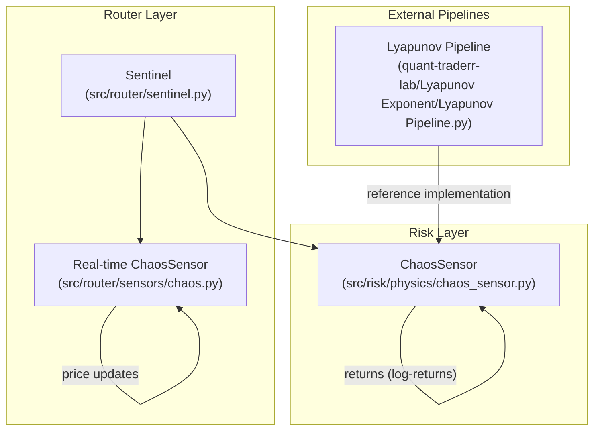
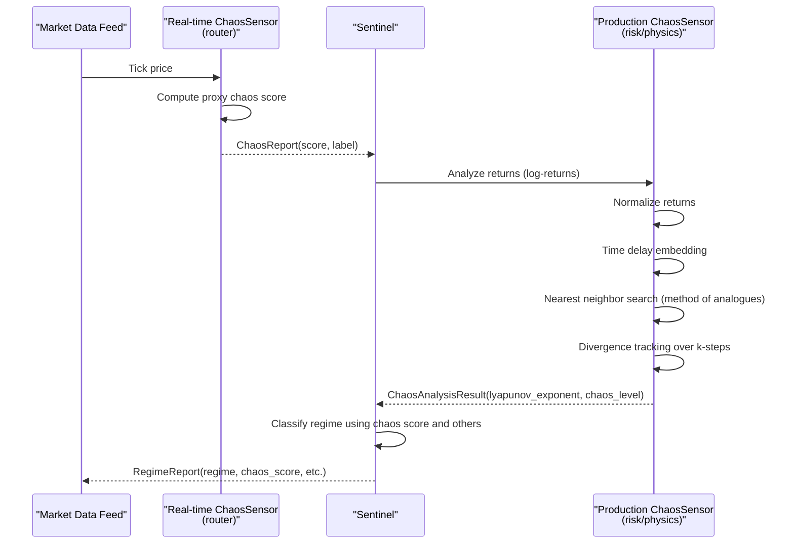
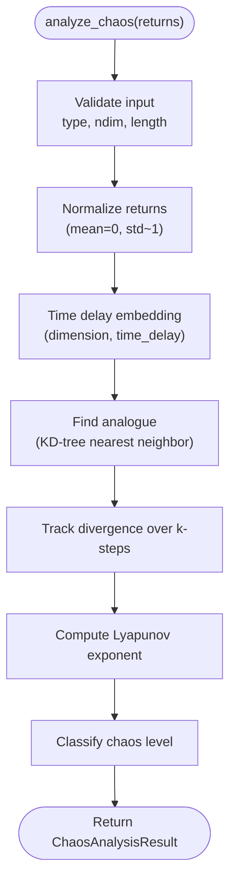
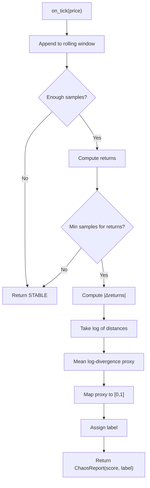
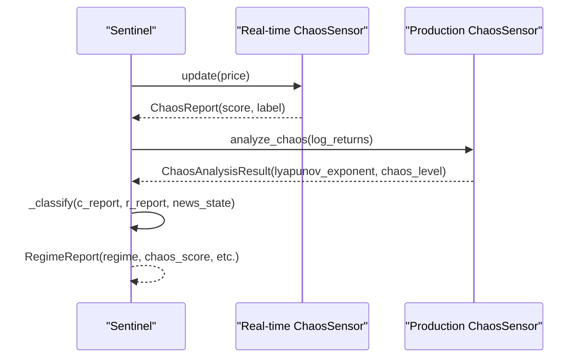
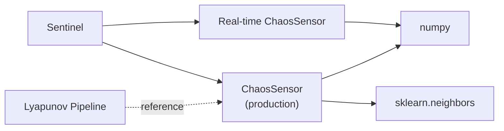

# Chaos Sensor

<cite>
**Referenced Files in This Document**
- [chaos_sensor.py](file://src/risk/physics/chaos_sensor.py)
- [chaos.py](file://src/router/sensors/chaos.py)
- [sentinel.py](file://src/router/sentinel.py)
- [test_chaos_sensor.py](file://tests/risk/physics/test_chaos_sensor.py)
- [test_physics_sensors.py](file://tests/risk/physics/test_physics_sensors.py)
- [Lyapunov Pipeline.py](file://quant-traderr-lab/Lyapunov Exponent/Lyapunov Pipeline.py)
- [chaos_theory_in_trading__part_1___introduction__application_in_financial_markets_and_lyapunov_expone.md](file://data/scraped_articles/trading_systems/chaos_theory_in_trading__part_1___introduction__application_in_financial_markets_and_lyapunov_expone.md)
</cite>

## Table of Contents
1. [Introduction](#introduction)
2. [Project Structure](#project-structure)
3. [Core Components](#core-components)
4. [Architecture Overview](#architecture-overview)
5. [Detailed Component Analysis](#detailed-component-analysis)
6. [Dependency Analysis](#dependency-analysis)
7. [Performance Considerations](#performance-considerations)
8. [Troubleshooting Guide](#troubleshooting-guide)
9. [Conclusion](#conclusion)
10. [Appendices](#appendices)

## Introduction
This document describes the Chaos Sensor subsystem that detects and quantifies market instability using the Lyapunov exponent. It explains the phase space reconstruction via time delay embedding, the method of analogues for nearest neighbor search, and divergence tracking. It also covers parameter tuning, data preprocessing, real-time operation, and the chaos level classification used for risk-aware trading decisions.

## Project Structure
The Chaos Sensor exists in two complementary forms:
- A production-grade Lyapunov analyzer operating on normalized log-returns arrays
- A lightweight real-time proxy sensor for streaming ticks

**Diagram sources**
- [chaos_sensor.py](file://src/risk/physics/chaos_sensor.py#L31-L253)
- [chaos.py](file://src/router/sensors/chaos.py#L14-L56)
- [sentinel.py](file://src/router/sentinel.py#L27-L84)
- [Lyapunov Pipeline.py](file://quant-traderr-lab/Lyapunov Exponent/Lyapunov Pipeline.py#L1-L237)

**Section sources**
- [chaos_sensor.py](file://src/risk/physics/chaos_sensor.py#L1-L253)
- [chaos.py](file://src/router/sensors/chaos.py#L1-L56)
- [sentinel.py](file://src/router/sentinel.py#L1-L84)
- [Lyapunov Pipeline.py](file://quant-traderr-lab/Lyapunov Exponent/Lyapunov Pipeline.py#L1-L237)

## Core Components
- Production ChaosSensor: Implements phase space reconstruction, method of analogues, divergence tracking, and chaos level classification.
- Real-time ChaosSensor: Lightweight proxy that consumes price ticks and estimates a chaos score using a simplified proxy.
- Sentinel: Integrates multiple sensors (including chaos) into a unified regime classification for risk-aware decisions.

Key responsibilities:
- Validate input arrays and enforce minimum lengths
- Normalize returns for shape-based analysis
- Embed returns into a delay-coordinate space
- Locate analogues via KD-tree nearest neighbor search
- Track divergence over k-steps to compute the Lyapunov-like exponent
- Classify chaos level thresholds
- Provide a real-time streaming interface for tick updates

**Section sources**
- [chaos_sensor.py](file://src/risk/physics/chaos_sensor.py#L31-L253)
- [chaos.py](file://src/router/sensors/chaos.py#L14-L56)
- [sentinel.py](file://src/router/sentinel.py#L27-L84)

## Architecture Overview
The Chaos Sensor subsystem integrates with the broader risk intelligence stack. The router’s real-time sensor feeds instantaneous chaos scores, while the production sensor operates on buffered log-returns for robust analysis.

**Diagram sources**
- [chaos.py](file://src/router/sensors/chaos.py#L19-L56)
- [sentinel.py](file://src/router/sentinel.py#L40-L84)
- [chaos_sensor.py](file://src/risk/physics/chaos_sensor.py#L195-L241)

## Detailed Component Analysis

### Production ChaosSensor (Lyapunov Exponent)
Implements a full-featured Lyapunov exponent estimator:
- Input validation: array type, dimensionality, and minimum length checks
- Normalization: z-score normalization of returns
- Phase space reconstruction: time delay embedding with configurable dimension and time lag
- Method of analogues: KD-tree nearest neighbor search between a subject trajectory and a historical library
- Divergence tracking: computes average logarithmic divergence over k-steps
- Chaos classification: thresholds map to STABLE, MODERATE, CHAOTIC

**Diagram sources**
- [chaos_sensor.py](file://src/risk/physics/chaos_sensor.py#L195-L241)

**Section sources**
- [chaos_sensor.py](file://src/risk/physics/chaos_sensor.py#L31-L253)
- [test_chaos_sensor.py](file://tests/risk/physics/test_chaos_sensor.py#L19-L140)
- [test_physics_sensors.py](file://tests/risk/physics/test_physics_sensors.py#L102-L196)

### Real-time ChaosSensor (Streaming Proxy)
Operates on tick prices and provides a fast-running proxy:
- Maintains a rolling window of prices
- Computes returns and proxy divergence
- Estimates a chaos score and label suitable for live updates
- Empirical normalization maps typical proxy values to [0, 1]

**Diagram sources**
- [chaos.py](file://src/router/sensors/chaos.py#L19-L56)

**Section sources**
- [chaos.py](file://src/router/sensors/chaos.py#L14-L56)

### Sentinel Integration
The Sentinel orchestrates sensor fusion and regime classification:
- Receives chaos score and regime signals
- Applies thresholds to label high-churn or breakout regimes
- Produces a unified RegimeReport for downstream risk management

**Diagram sources**
- [sentinel.py](file://src/router/sentinel.py#L40-L84)
- [chaos.py](file://src/router/sensors/chaos.py#L19-L56)
- [chaos_sensor.py](file://src/risk/physics/chaos_sensor.py#L195-L241)

**Section sources**
- [sentinel.py](file://src/router/sentinel.py#L27-L84)

## Dependency Analysis
- Internal dependencies:
  - router/sensors/chaos.py depends on numpy for numerical operations
  - risk/physics/chaos_sensor.py depends on numpy and sklearn.neighbors for KD-tree search
  - router/sentinel.py composes router/sensors/chaos.py and other sensors
- External references:
  - quant-traderr-lab/Lyapunov Pipeline.py provides a reference implementation of phase space reconstruction and method of analogues
  - Scraped MQL5 article documents a MetaQuotes implementation of the Lyapunov indicator using nearest neighbor search

**Diagram sources**
- [chaos_sensor.py](file://src/risk/physics/chaos_sensor.py#L14-L18)
- [chaos.py](file://src/router/sensors/chaos.py#L6-L7)
- [sentinel.py](file://src/router/sentinel.py#L10-L13)
- [Lyapunov Pipeline.py](file://quant-traderr-lab/Lyapunov Exponent/Lyapunov Pipeline.py#L38-L39)

**Section sources**
- [chaos_sensor.py](file://src/risk/physics/chaos_sensor.py#L14-L18)
- [chaos.py](file://src/router/sensors/chaos.py#L6-L7)
- [sentinel.py](file://src/router/sentinel.py#L10-L13)
- [Lyapunov Pipeline.py](file://quant-traderr-lab/Lyapunov Exponent/Lyapunov Pipeline.py#L23-L24)

## Performance Considerations
- Real-time proxy:
  - Minimal computation per tick; suitable for continuous streaming
  - Empirical score normalization ensures bounded output for regime mapping
- Production analyzer:
  - Enforces minimum lengths to avoid ill-formed embeddings
  - KD-tree search is efficient for moderate-sized libraries
  - Tests target sub-100 ms analysis time for typical buffers
- Recommendations:
  - Tune embedding dimension and time lag for the asset/timeframe
  - Adjust lookback and k-steps to balance responsiveness and stability
  - Cache repeated analyses keyed by input hash to avoid recomputation

[No sources needed since this section provides general guidance]

## Troubleshooting Guide
Common issues and resolutions:
- Insufficient data length:
  - The production analyzer raises errors if the input array is too short or multi-dimensional
  - Ensure at least several hundred points for meaningful embedding and divergence tracking
- Embedding mismatch:
  - If the embedding dimension and time lag exceed available samples, a ValueError is raised
  - Reduce dimension or time lag, or increase the sample size
- Nearest neighbor search failures:
  - If the historical library is too short after applying the Theiler window, a ValueError is raised
  - Increase lookback or reduce time lag to allow sufficient library points
- Real-time sensor returning STABLE:
  - Occurs when the rolling window is too small or returns cannot be computed
  - Ensure sufficient ticks and avoid extremely noisy or flat segments for meaningful proxy estimation

**Section sources**
- [chaos_sensor.py](file://src/risk/physics/chaos_sensor.py#L208-L218)
- [chaos_sensor.py](file://src/risk/physics/chaos_sensor.py#L83-L88)
- [chaos_sensor.py](file://src/risk/physics/chaos_sensor.py#L112-L128)
- [chaos.py](file://src/router/sensors/chaos.py#L27-L34)

## Conclusion
The Chaos Sensor subsystem combines a production-grade Lyapunov exponent estimator with a real-time proxy to support both batch and streaming analytics. By reconstructing phase space, locating analogues, and tracking divergence, it enables dynamic classification of market regimes that inform risk-aware trading decisions.

[No sources needed since this section summarizes without analyzing specific files]

## Appendices

### Mathematical Foundations and Interpretation
- Positive Lyapunov exponent indicates exponential divergence of nearby trajectories, signaling sensitive dependence on initial conditions and chaotic behavior.
- Negative exponent suggests convergence and more predictable dynamics.
- Zero or near-zero values imply neutral or weak divergence.

Practical implications:
- Higher positive values suggest shorter forecast horizons and increased volatility
- Useful for regime detection and volatility targeting

**Section sources**
- [chaos_theory_in_trading__part_1___introduction__application_in_financial_markets_and_lyapunov_expone.md](file://data/scraped_articles/trading_systems/chaos_theory_in_trading__part_1___introduction__application_in_financial_markets_and_lyapunov_expone.md#L75-L86)

### Parameter Tuning Guidelines
- Embedding dimension (m):
  - Start with small odd integers; typical defaults are 2–5
  - Increase for richer dynamics; ensure sufficient data to avoid empty embedding
- Time delay (τ):
  - Use autocorrelation or mutual information methods in practice; defaults around 10–20 ticks
  - Must be chosen relative to the asset’s turnover and noise level
- Lookback points:
  - Controls the length of the subject trajectory; defaults around 300
  - Larger windows improve stability but reduce responsiveness
- k-steps:
  - Number of divergence steps tracked; defaults around 10
  - Shorter k emphasizes short-term sensitivity; longer k smooths estimates

Validation and tests:
- Unit tests verify embedding correctness, nearest neighbor search, and chaos classification thresholds
- Additional tests confirm behavior on chaotic and periodic signals

**Section sources**
- [chaos_sensor.py](file://src/risk/physics/chaos_sensor.py#L48-L65)
- [test_chaos_sensor.py](file://tests/risk/physics/test_chaos_sensor.py#L36-L77)
- [test_physics_sensors.py](file://tests/risk/physics/test_physics_sensors.py#L105-L140)

### Data Preprocessing Requirements
- Input type: 1D numpy array of log-returns
- Minimum length: at least 300 points for reliable analysis
- Normalization: z-score normalization is applied internally to emphasize shape over scale
- Missing values: ensure no NaNs or infinities in the input series

**Section sources**
- [chaos_sensor.py](file://src/risk/physics/chaos_sensor.py#L212-L221)

### Real-time Analysis Capabilities
- Streaming proxy:
  - Operates on tick prices with a rolling window
  - Fast proxy divergence estimate suitable for continuous monitoring
- Production analyzer:
  - Batch-oriented; recomputes on new buffers
  - Supports caching keyed by input hash to avoid redundant computations

**Section sources**
- [chaos.py](file://src/router/sensors/chaos.py#L19-L56)
- [test_chaos_sensor.py](file://tests/risk/physics/test_chaos_sensor.py#L118-L127)

### Chaos Level Classification and Risk Implications
Classification thresholds (production analyzer):
- STABLE: Lyapunov exponent below a conservative threshold
- MODERATE: Intermediate range
- CHAOTIC: Above a higher threshold

Real-time proxy labels:
- STABLE, NOISY, CHAOTIC mapped from a bounded score

Risk management impact:
- High chaos levels may warrant reduced position sizes, wider stops, or regime switches
- Low chaos supports trend-following strategies and tighter controls

**Section sources**
- [chaos_sensor.py](file://src/risk/physics/chaos_sensor.py#L178-L193)
- [chaos.py](file://src/router/sensors/chaos.py#L52-L54)

### Practical Examples
- Market instability detection:
  - Rapid spikes in the Lyapunov exponent signal increased divergence and potential breakdowns
  - Real-time proxy flags sudden increases in chaos score, triggering defensive actions
- Predictive modeling:
  - Short-term forecasts become unreliable beyond a horizon inversely related to the exponent magnitude
  - Use chaos levels to gate model deployments and adjust confidence bands

[No sources needed since this section provides general guidance]