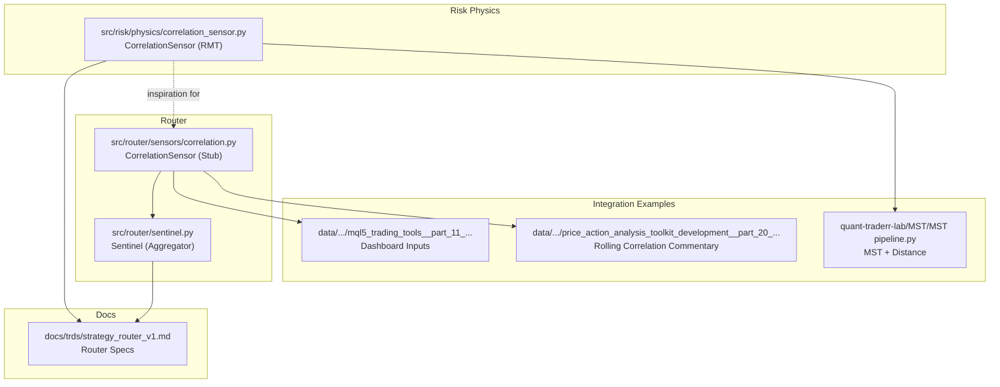
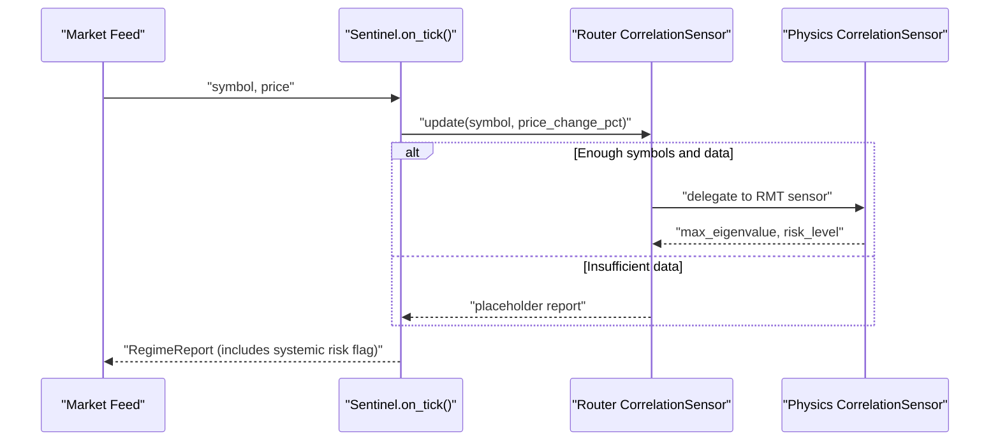
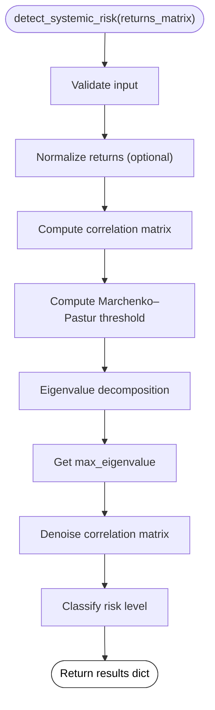
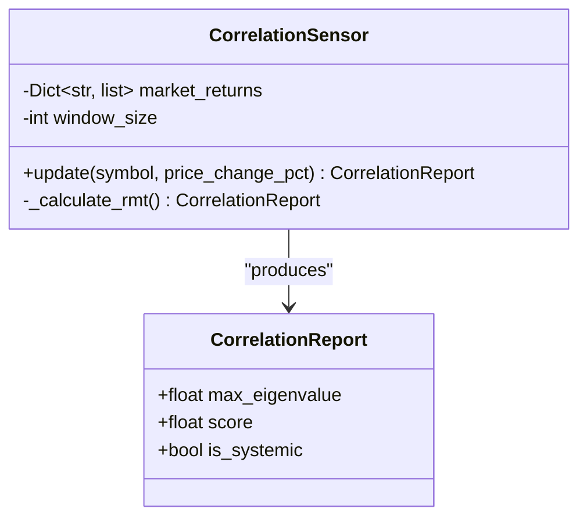
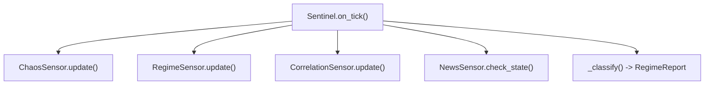
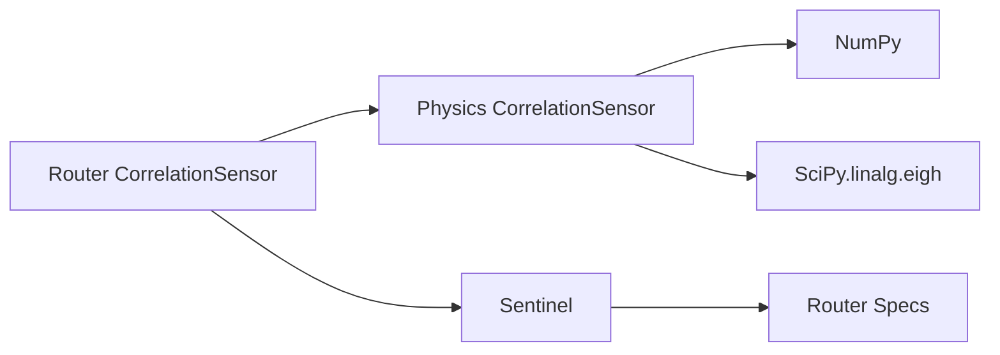

# Correlation Sensor

<cite>
**Referenced Files in This Document**
- [correlation_sensor.py](file://src/risk/physics/correlation_sensor.py)
- [test_correlation_sensor.py](file://tests/risk/physics/test_correlation_sensor.py)
- [test_physics_sensors.py](file://tests/risk/physics/test_physics_sensors.py)
- [correlation.py](file://src/router/sensors/correlation.py)
- [sentinel.py](file://src/router/sentinel.py)
- [strategy_router_v1.md](file://docs/trds/strategy_router_v1.md)
- [__init__.py](file://src/risk/physics/__init__.py)
- [MST pipeline.py](file://quant-traderr-lab/MST/MST pipeline.py)
- [mql5_trading_tools__part_11___correlation_matrix_dashboard__pearson__spearman__kendall__with_heatmap.md](file://data/scraped_articles/trading/mql5_trading_tools__part_11___correlation_matrix_dashboard__pearson__spearman__kendall__with_heatmap.md)
- [price_action_analysis_toolkit_development__part_20___external_flow__iv____correlation_pathfinder.md](file://data/scraped_articles/integration/price_action_analysis_toolkit_development__part_20___external_flow__iv____correlation_pathfinder.md)
</cite>

## Table of Contents
1. [Introduction](#introduction)
2. [Project Structure](#project-structure)
3. [Core Components](#core-components)
4. [Architecture Overview](#architecture-overview)
5. [Detailed Component Analysis](#detailed-component-analysis)
6. [Dependency Analysis](#dependency-analysis)
7. [Performance Considerations](#performance-considerations)
8. [Troubleshooting Guide](#troubleshooting-guide)
9. [Conclusion](#conclusion)
10. [Appendices](#appendices)

## Introduction
This document describes the Correlation Sensor subsystem responsible for measuring market interdependencies and systemic risk propagation using Random Matrix Theory (RMT). It explains the calculation of pairwise correlations, their evolution over time, detection of correlation clustering and regime shifts, and the integration with portfolio risk models. Practical examples illustrate abnormal correlation spikes and their implications for hedging strategies during stress periods.

## Project Structure
The Correlation Sensor exists in two complementary forms:
- A production-grade RMT-based implementation under the risk physics package.
- A router-level stub used by the intelligence layer for real-time systemic risk monitoring.

**Diagram sources**
- [correlation_sensor.py](file://src/risk/physics/correlation_sensor.py#L1-L285)
- [correlation.py](file://src/router/sensors/correlation.py#L1-L45)
- [sentinel.py](file://src/router/sentinel.py#L1-L85)
- [strategy_router_v1.md](file://docs/trds/strategy_router_v1.md#L50-L56)
- [MST pipeline.py](file://quant-traderr-lab/MST/MST pipeline.py#L145-L185)
- [mql5_trading_tools__part_11___correlation_matrix_dashboard__pearson__spearman__kendall__with_heatmap.md](file://data/scraped_articles/trading/mql5_trading_tools__part_11___correlation_matrix_dashboard__pearson__spearman__kendall__with_heatmap.md#L48-L63)
- [price_action_analysis_toolkit_development__part_20___external_flow__iv____correlation_pathfinder.md](file://data/scraped_articles/integration/price_action_analysis_toolkit_development__part_20___external_flow__iv____correlation_pathfinder.md#L231-L241)

**Section sources**
- [correlation_sensor.py](file://src/risk/physics/correlation_sensor.py#L1-L285)
- [correlation.py](file://src/router/sensors/correlation.py#L1-L45)
- [sentinel.py](file://src/router/sentinel.py#L1-L85)
- [strategy_router_v1.md](file://docs/trds/strategy_router_v1.md#L50-L56)

## Core Components
- Production RMT Correlation Sensor
  - Validates inputs, normalizes returns, constructs correlation matrices, computes Marchenko–Pastur noise thresholds, performs eigenvalue decomposition, denoises correlation matrices, and classifies systemic risk.
  - Provides caching for performance and numerical stability safeguards.
- Router-Level Correlation Sensor (Stub)
  - Maintains rolling returns per symbol and exposes a reporting interface for systemic risk signals. The current implementation is a placeholder awaiting integration with the production RMT sensor.

**Section sources**
- [correlation_sensor.py](file://src/risk/physics/correlation_sensor.py#L22-L285)
- [correlation.py](file://src/router/sensors/correlation.py#L15-L45)

## Architecture Overview
The Correlation Sensor participates in the Router’s intelligence loop. The Sentinel aggregates signals from multiple sensors and classifies regimes. The Router specification documents the intended role of the Correlation Sensor as a systemic risk meter using RMT.

**Diagram sources**
- [sentinel.py](file://src/router/sentinel.py#L40-L63)
- [correlation.py](file://src/router/sensors/correlation.py#L21-L33)
- [correlation_sensor.py](file://src/risk/physics/correlation_sensor.py#L229-L281)
- [strategy_router_v1.md](file://docs/trds/strategy_router_v1.md#L50-L56)

## Detailed Component Analysis

### Production RMT Correlation Sensor
The production implementation performs:
- Input validation ensuring minimum assets and periods.
- Optional normalization of returns to zero mean and unit variance.
- Construction of correlation matrices with NaN handling and numerical clipping.
- Marchenko–Pastur threshold computation based on the asset-to-period ratio.
- Eigenvalue decomposition and sorting.
- Denoising by replacing noise eigenvalues with averages and reconstructing a valid correlation matrix.
- Risk classification based on the maximum eigenvalue.

**Diagram sources**
- [correlation_sensor.py](file://src/risk/physics/correlation_sensor.py#L229-L281)

**Section sources**
- [correlation_sensor.py](file://src/risk/physics/correlation_sensor.py#L57-L79)
- [correlation_sensor.py](file://src/risk/physics/correlation_sensor.py#L81-L101)
- [correlation_sensor.py](file://src/risk/physics/correlation_sensor.py#L103-L135)
- [correlation_sensor.py](file://src/risk/physics/correlation_sensor.py#L137-L154)
- [correlation_sensor.py](file://src/risk/physics/correlation_sensor.py#L156-L174)
- [correlation_sensor.py](file://src/risk/physics/correlation_sensor.py#L176-L210)
- [correlation_sensor.py](file://src/risk/physics/correlation_sensor.py#L212-L227)
- [correlation_sensor.py](file://src/risk/physics/correlation_sensor.py#L229-L281)

### Router-Level Correlation Sensor (Stub)
The stub maintains rolling returns per symbol and exposes a reporting interface. It currently returns placeholder values and is intended to delegate to the production RMT sensor when integrated.

**Diagram sources**
- [correlation.py](file://src/router/sensors/correlation.py#L9-L44)

**Section sources**
- [correlation.py](file://src/router/sensors/correlation.py#L15-L45)

### Integration with Router Intelligence Loop
The Sentinel integrates the Correlation Sensor among other sensors to produce a unified regime report. The Router specification defines the Correlation Sensor’s role and output semantics.

**Diagram sources**
- [sentinel.py](file://src/router/sentinel.py#L40-L63)
- [strategy_router_v1.md](file://docs/trds/strategy_router_v1.md#L50-L56)

**Section sources**
- [sentinel.py](file://src/router/sentinel.py#L27-L38)
- [strategy_router_v1.md](file://docs/trds/strategy_router_v1.md#L50-L56)

## Dependency Analysis
- Internal dependencies
  - Router Correlation Sensor depends on the Sentinel and is intended to delegate to the Physics Correlation Sensor.
  - Physics Correlation Sensor depends on NumPy and SciPy for numerical computations and uses an LRU cache for performance.
- External integration points
  - The Router specification references the Correlation Sensor as part of the sensor array and links its output to risk governance and bot dispatch.

**Diagram sources**
- [correlation.py](file://src/router/sensors/correlation.py#L12-L13)
- [correlation_sensor.py](file://src/risk/physics/correlation_sensor.py#L16-L19)
- [sentinel.py](file://src/router/sentinel.py#L10-L13)
- [strategy_router_v1.md](file://docs/trds/strategy_router_v1.md#L50-L56)

**Section sources**
- [correlation.py](file://src/router/sensors/correlation.py#L12-L13)
- [correlation_sensor.py](file://src/risk/physics/correlation_sensor.py#L16-L19)
- [sentinel.py](file://src/router/sentinel.py#L10-L13)
- [strategy_router_v1.md](file://docs/trds/strategy_router_v1.md#L50-L56)

## Performance Considerations
- Numerical stability: The implementation clips correlation values to [-1, 1] and fills diagonal entries to ensure valid correlation matrices.
- Caching: The Physics Correlation Sensor caches results to avoid recomputation on repeated inputs.
- Complexity: Eigenvalue decomposition scales with matrix dimension; the tests enforce execution time constraints for typical workloads.

Practical guidance:
- Prefer rolling or expanding windows for real-time tracking to avoid lookahead bias.
- Monitor max eigenvalue trends to detect regime shifts and clustering.

**Section sources**
- [correlation_sensor.py](file://src/risk/physics/correlation_sensor.py#L131-L135)
- [correlation_sensor.py](file://src/risk/physics/correlation_sensor.py#L55-L55)
- [test_correlation_sensor.py](file://tests/risk/physics/test_correlation_sensor.py#L236-L249)

## Troubleshooting Guide
Common issues and resolutions:
- Input validation errors
  - Ensure the returns matrix is 2D and meets minimum asset and period requirements.
- Singular or ill-conditioned correlation matrices
  - The implementation handles NaNs and regularizes numerically; still, extreme collinearity can cause instability.
- Performance bottlenecks
  - Use caching and reduce dimensionality where feasible; validate window sizes and batch processing.

Validation references:
- Input validation tests and edge cases for minimum dimensions and NaN handling.
- Denoising correctness and reconstruction checks.

**Section sources**
- [correlation_sensor.py](file://src/risk/physics/correlation_sensor.py#L57-L79)
- [test_correlation_sensor.py](file://tests/risk/physics/test_correlation_sensor.py#L35-L56)
- [test_correlation_sensor.py](file://tests/risk/physics/test_correlation_sensor.py#L252-L284)
- [test_physics_sensors.py](file://tests/risk/physics/test_physics_sensors.py#L281-L291)

## Conclusion
The Correlation Sensor subsystem combines rigorous econophysical theory (RMT) with practical implementation to monitor systemic risk and detect regime shifts. The production RMT sensor provides robust correlation analysis with denoising and caching, while the router-level stub integrates seamlessly into the intelligence loop. Together, they support portfolio risk models, diversification assessments, and early-warning signals for market contagion.

## Appendices

### Mathematical Foundations and Implementation Notes
- Covariance and correlation
  - Covariance is computed from normalized returns; correlation matrices are derived and clipped to [-1, 1].
- Marchenko–Pastur threshold
  - Threshold λ_max is computed from the asset-to-period ratio Q = T/N to distinguish signal from noise.
- Eigenvalue decomposition
  - Eigenvalues are sorted descending; the maximum eigenvalue serves as the systemic risk indicator.
- Denoising
  - Noise eigenvalues are replaced by their average and the matrix is reconstructed and stabilized.

**Section sources**
- [correlation_sensor.py](file://src/risk/physics/correlation_sensor.py#L103-L135)
- [correlation_sensor.py](file://src/risk/physics/correlation_sensor.py#L137-L154)
- [correlation_sensor.py](file://src/risk/physics/correlation_sensor.py#L156-L174)
- [correlation_sensor.py](file://src/risk/physics/correlation_sensor.py#L176-L210)

### Real-Time Tracking and Early Warning Signals
- Real-time correlation tracking
  - Use rolling/expanding windows to compute evolving correlation matrices and monitor max eigenvalue.
- Abnormal correlation spikes
  - Thresholds at moderate/high risk levels trigger alerts; combine with other sensors for confirmation.
- Market contagion indicators
  - Rising average pairwise correlation and MST distance metrics suggest increased systemic risk.

**Section sources**
- [MST pipeline.py](file://quant-traderr-lab/MST/MST pipeline.py#L145-L185)
- [MST pipeline.py](file://quant-traderr-lab/MST/MST pipeline.py#L309-L335)
- [price_action_analysis_toolkit_development__part_20___external_flow__iv____correlation_pathfinder.md](file://data/scraped_articles/integration/price_action_analysis_toolkit_development__part_20___external_flow__iv____correlation_pathfinder.md#L231-L241)

### Integration with Portfolio Risk Models and Diversification
- Portfolio VaR and correlation matrices
  - Correlation structure influences portfolio risk; dynamic capital allocation can be informed by correlation metrics.
- Diversification assessment
  - Low pairwise correlation supports diversification; high correlation reduces benefits and increases tail risk.

**Section sources**
- [strategy_router_v1.md](file://docs/trds/strategy_router_v1.md#L94-L95)
- [mql5_trading_tools__part_11___correlation_matrix_dashboard__pearson__spearman__kendall__with_heatmap.md](file://data/scraped_articles/trading/mql5_trading_tools__part_11___correlation_matrix_dashboard__pearson__spearman__kendall__with_heatmap.md#L48-L63)