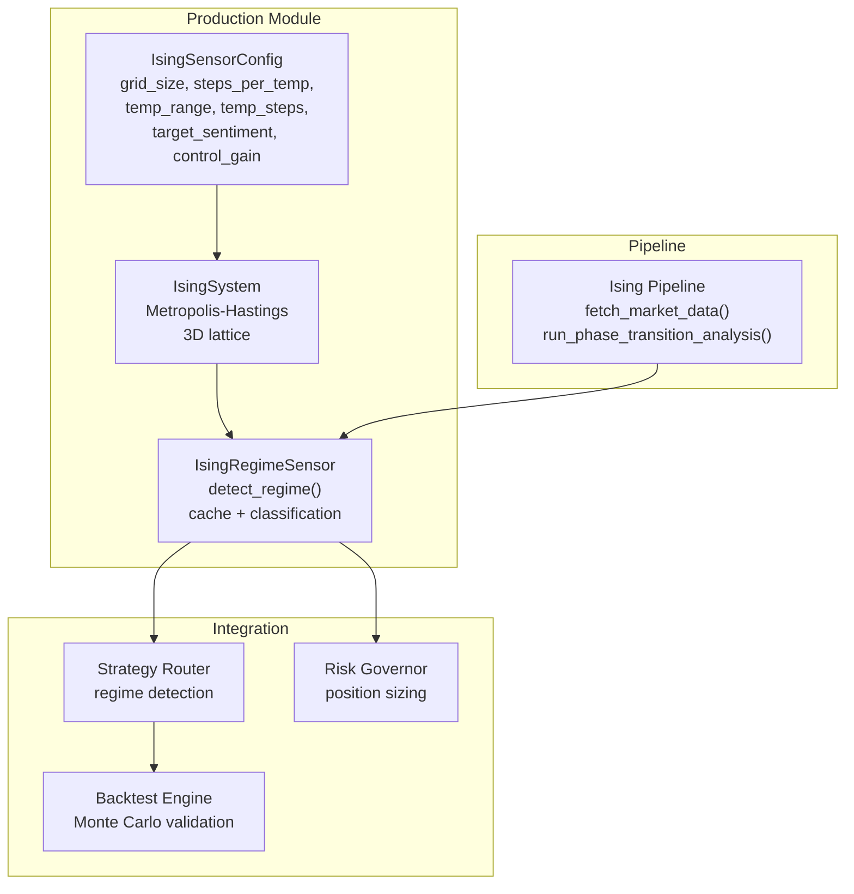
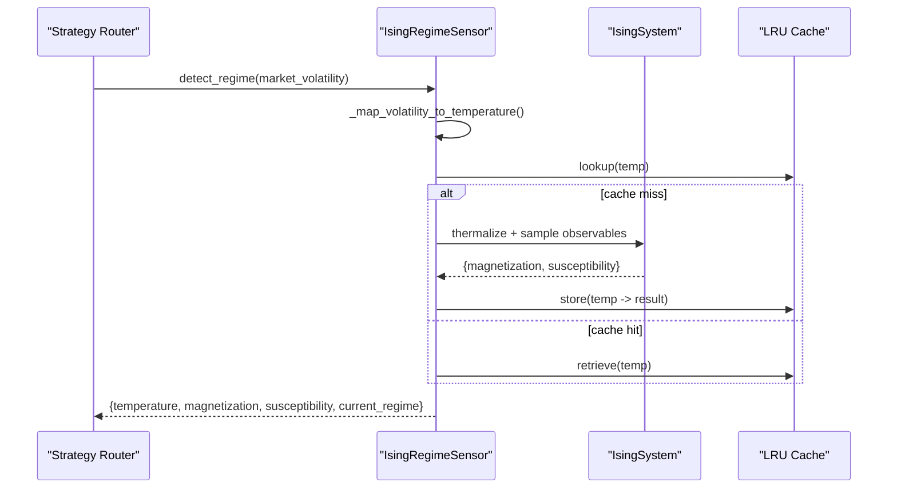
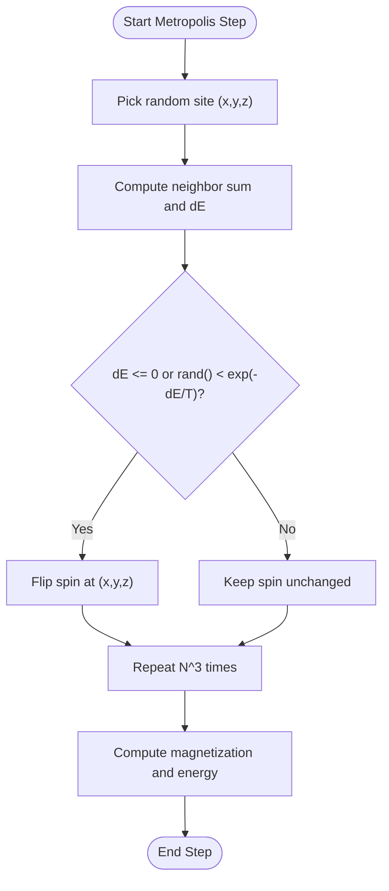
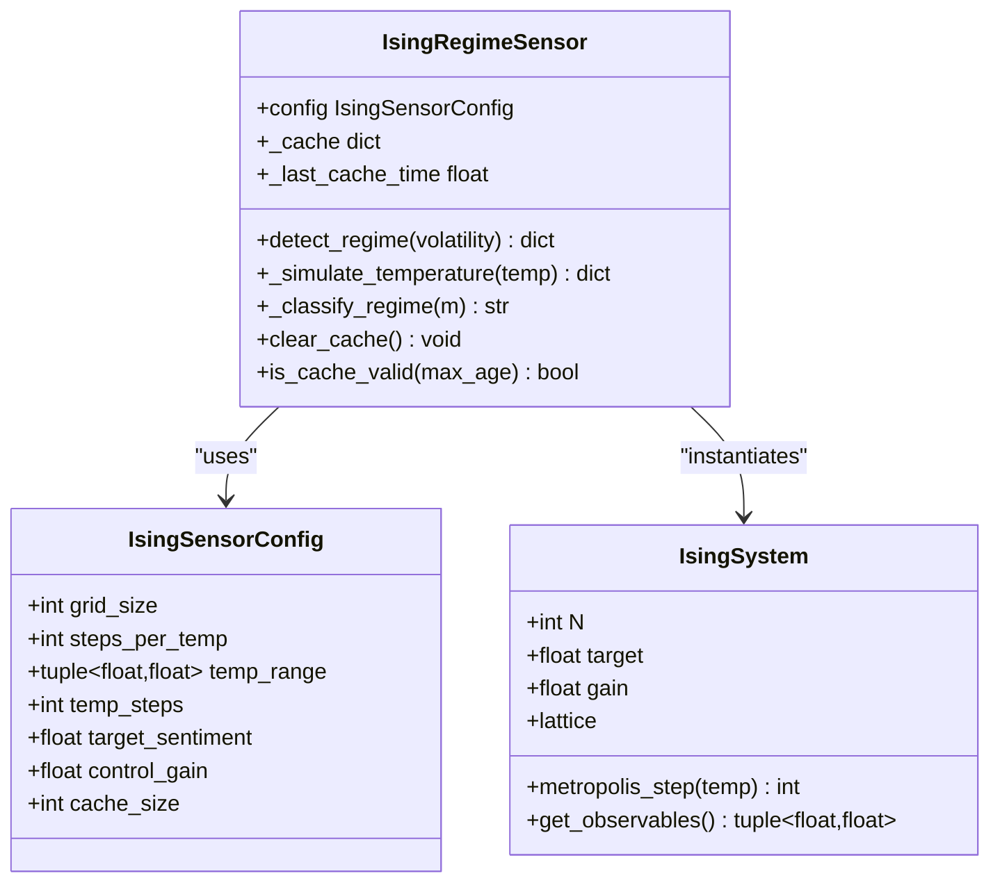
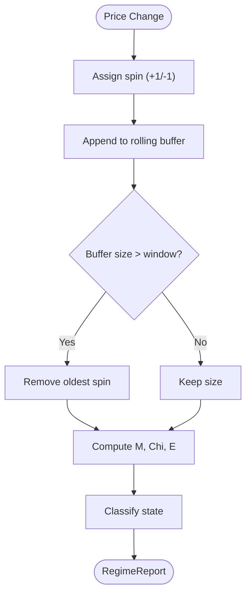
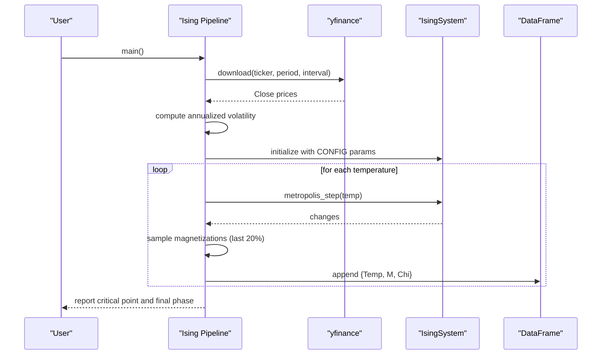
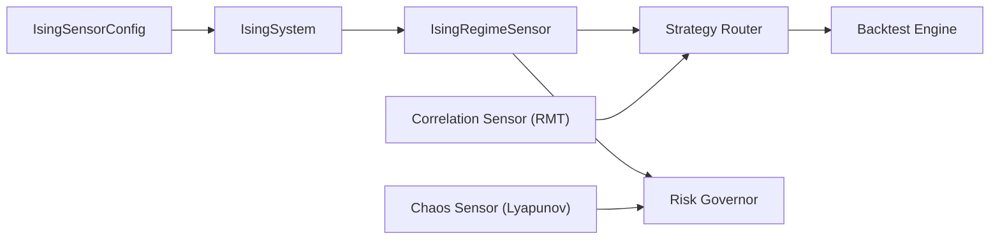

# Ising Sensor

<cite>
**Referenced Files in This Document**
- [ising_sensor.py](file://src/risk/physics/ising_sensor.py)
- [test_ising_sensor.py](file://src/risk/physics/tests/test_ising_sensor.py)
- [Ising Pipeline.py](file://quant-traderr-lab/Ising Model/Ising Pipeline.py)
- [regime.py](file://src/router/sensors/regime.py)
- [ECONOPHYSICS_INTEGRATION.md](file://docs/ECONOPHYSICS_INTEGRATION.md)
- [chaos_sensor.py](file://src/risk/physics/chaos_sensor.py)
- [correlation_sensor.py](file://src/risk/physics/correlation_sensor.py)
</cite>

## Table of Contents
1. [Introduction](#introduction)
2. [Project Structure](#project-structure)
3. [Core Components](#core-components)
4. [Architecture Overview](#architecture-overview)
5. [Detailed Component Analysis](#detailed-component-analysis)
6. [Dependency Analysis](#dependency-analysis)
7. [Performance Considerations](#performance-considerations)
8. [Troubleshooting Guide](#troubleshooting-guide)
9. [Conclusion](#conclusion)
10. [Appendices](#appendices)

## Introduction
The Ising Sensor subsystem applies the Ising model of statistical mechanics to detect financial market regime shifts and phase transitions. It maps volatility to temperature, simulates spin dynamics on a 3D lattice using Metropolis-Hastings Monte Carlo, and computes magnetization and susceptibility to identify critical points. The system supports both real-time classification using live volatility and offline annealing scans to locate critical temperatures. This document explains the mathematical foundations, implementation details, parameter calibration, and integration with broader econophysics modules for trading strategy adaptation.

## Project Structure
The Ising Sensor spans two primary implementations:
- A production-grade Python module under src/risk/physics implementing a 3D Ising lattice, Metropolis-Hastings dynamics, and caching.
- A standalone pipeline under quant-traderr-lab demonstrating volatility-to-temperature mapping, annealing, and criticality reporting.
- A lightweight rolling-window regime sensor under src/router/sensors for streaming updates.
- Integration guidance and use cases under docs/ECONOPHYSICS_INTEGRATION.md.

**Diagram sources**
- [ising_sensor.py](file://src/risk/physics/ising_sensor.py#L31-L246)
- [Ising Pipeline.py](file://quant-traderr-lab/Ising Model/Ising Pipeline.py#L1-L291)
- [ECONOPHYSICS_INTEGRATION.md](file://docs/ECONOPHYSICS_INTEGRATION.md#L318-L371)

**Section sources**
- [ising_sensor.py](file://src/risk/physics/ising_sensor.py#L1-L246)
- [Ising Pipeline.py](file://quant-traderr-lab/Ising Model/Ising Pipeline.py#L1-L291)
- [ECONOPHYSICS_INTEGRATION.md](file://docs/ECONOPHYSICS_INTEGRATION.md#L318-L371)

## Core Components
- IsingSensorConfig: Encapsulates simulation parameters (lattice size, temperature schedule, target sentiment, control gain).
- IsingSystem: Implements the 3D Ising lattice with periodic boundary conditions, Metropolis-Hastings updates, and observable computation (magnetization, energy).
- IsingRegimeSensor: Orchestrates simulations, caches results, maps volatility to temperature, and classifies regimes based on magnetization and susceptibility.

Key behaviors:
- Temperature mapping: Converts market volatility to a temperature proxy for Ising simulation.
- Annealing scan: Sweeps temperature range to find critical point via peak susceptibility.
- Real-time classification: Uses cached simulation at mapped temperature to infer current regime.

**Section sources**
- [ising_sensor.py](file://src/risk/physics/ising_sensor.py#L31-L246)
- [test_ising_sensor.py](file://src/risk/physics/tests/test_ising_sensor.py#L16-L237)

## Architecture Overview
The Ising Sensor integrates with the Strategy Router for regime detection and with Risk Governor/Enhanced Kelly for position sizing. It also collaborates with other econophysics sensors (Lyapunov, RMT) to form a holistic market state assessment.

**Diagram sources**
- [ising_sensor.py](file://src/risk/physics/ising_sensor.py#L113-L195)
- [ECONOPHYSICS_INTEGRATION.md](file://docs/ECONOPHYSICS_INTEGRATION.md#L327-L371)

## Detailed Component Analysis

### Mathematical Foundations and Statistical Mechanics
- Ising Model: Spins on a 3D lattice interact via nearest-neighbor coupling; energy is proportional to sum of products of neighboring spins. Magnetization is the mean spin value; susceptibility is variance of magnetization divided by temperature.
- Temperature and Volatility: In this implementation, market volatility proxies temperature; lower volatility corresponds to lower temperature (ordered phase), higher volatility to higher temperature (disordered phase).
- Criticality: Near a phase transition, susceptibility peaks, signaling increased sensitivity and potential regime change.

**Section sources**
- [Ising Pipeline.py](file://quant-traderr-lab/Ising Model/Ising Pipeline.py#L101-L176)
- [ising_sensor.py](file://src/risk/physics/ising_sensor.py#L91-L102)

### IsingSystem: 3D Lattice and Metropolis-Hastings
- Lattice: 12x12x12 spins initialized randomly to simulate high-temperature chaos.
- Dynamics: For each Monte Carlo step, a random spin is selected; the change in energy due to flipping equals 2 * spin * (sum of neighbors + bias). Accept with Metropolis criterion exp(-dE/T) or if dE ≤ 0.
- Bias: A constraint field enforces a target bullish ratio by computing the deviation from current up-ratio and applying a proportional bias.
- Observables: Magnetization is the mean spin; energy is computed via neighbor summation across three axes.

**Diagram sources**
- [ising_sensor.py](file://src/risk/physics/ising_sensor.py#L66-L102)

**Section sources**
- [ising_sensor.py](file://src/risk/physics/ising_sensor.py#L43-L102)

### IsingRegimeSensor: Regime Detection and Caching
- detect_regime: If volatility provided, maps to temperature, simulates, and returns regime classification; otherwise, performs an annealing scan and reports critical point and final state.
- Classification: Based on absolute magnetization thresholds, classifying as CHAOTIC, TRANSITIONAL, or ORDERED.
- Caching: Uses LRU cache keyed by temperature to accelerate repeated queries.

**Diagram sources**
- [ising_sensor.py](file://src/risk/physics/ising_sensor.py#L31-L246)

**Section sources**
- [ising_sensor.py](file://src/risk/physics/ising_sensor.py#L105-L246)
- [test_ising_sensor.py](file://src/risk/physics/tests/test_ising_sensor.py#L16-L141)

### Rolling-Window Regime Sensor (Streaming)
A lightweight alternative computes magnetization, susceptibility, and energy over a rolling window of price changes, enabling real-time streaming updates without full Monte Carlo simulation.

**Diagram sources**
- [regime.py](file://src/router/sensors/regime.py#L16-L54)

**Section sources**
- [regime.py](file://src/router/sensors/regime.py#L1-L55)

### Pipeline-Based Analysis (Quant Trader Lab)
The standalone pipeline demonstrates fetching market data, computing realized volatility as a temperature proxy, running an annealing simulation, and reporting criticality and final market phase.

**Diagram sources**
- [Ising Pipeline.py](file://quant-traderr-lab/Ising Model/Ising Pipeline.py#L67-L287)

**Section sources**
- [Ising Pipeline.py](file://quant-traderr-lab/Ising Model/Ising Pipeline.py#L1-L291)

## Dependency Analysis
- Internal dependencies:
  - IsingRegimeSensor depends on IsingSystem and IsingSensorConfig.
  - Uses NumPy for arrays and random number generation; Pandas for results aggregation in the pipeline.
- External dependencies:
  - yfinance for market data acquisition in the pipeline.
  - SciKit-learn for nearest neighbor computations in the Chaos Sensor (Lyapunov).
  - SciPy for eigenvalue decomposition in the Correlation Sensor (RMT).

**Diagram sources**
- [ising_sensor.py](file://src/risk/physics/ising_sensor.py#L31-L246)
- [chaos_sensor.py](file://src/risk/physics/chaos_sensor.py#L14-L253)
- [correlation_sensor.py](file://src/risk/physics/correlation_sensor.py#L16-L285)
- [ECONOPHYSICS_INTEGRATION.md](file://docs/ECONOPHYSICS_INTEGRATION.md#L318-L371)

**Section sources**
- [ising_sensor.py](file://src/risk/physics/ising_sensor.py#L20-L28)
- [Ising Pipeline.py](file://quant-traderr-lab/Ising Model/Ising Pipeline.py#L31-L37)
- [chaos_sensor.py](file://src/risk/physics/chaos_sensor.py#L14-L20)
- [correlation_sensor.py](file://src/risk/physics/correlation_sensor.py#L16-L21)

## Performance Considerations
- Lattice size: The default 12³ spins balances fidelity and speed; larger grids increase computational cost.
- Steps per temperature: Controls equilibration and sampling; increasing improves statistics but adds runtime.
- Caching: LRU cache reduces repeated simulations for the same temperature; cache age validation prevents stale results.
- Vectorization: Observable computation uses array operations; Metropolis updates iterate sites due to spatial correlations.
- Real-time streaming: The rolling-window sensor avoids heavy simulation for continuous monitoring.

Recommendations:
- Tune grid_size and steps_per_temp based on latency requirements.
- Use cache clearing and age checks to maintain freshness.
- For streaming, consider the rolling-window variant when full simulation is unnecessary.

**Section sources**
- [ising_sensor.py](file://src/risk/physics/ising_sensor.py#L113-L138)
- [test_ising_sensor.py](file://src/risk/physics/tests/test_ising_sensor.py#L87-L123)

## Troubleshooting Guide
Common issues and resolutions:
- Empty or invalid market data: The pipeline logs warnings and proceeds with simulation; ensure ticker and date range are valid.
- Slow detect_regime calls: Confirm caching is active; check cache age and clear if stale.
- Unexpected regime classification: Adjust target_sentiment and control_gain to align with desired sensitivity to sentiment bias.
- Numerical instability: Verify temperature values and ensure non-zero temperature for susceptibility calculation.

Validation references:
- Unit tests cover temperature mapping, classification thresholds, cache behavior, and observable correctness.

**Section sources**
- [Ising Pipeline.py](file://quant-traderr-lab/Ising Model/Ising Pipeline.py#L75-L97)
- [test_ising_sensor.py](file://src/risk/physics/tests/test_ising_sensor.py#L24-L141)

## Conclusion
The Ising Sensor provides a robust framework for detecting market regime shifts by modeling financial sentiment as spin dynamics and identifying critical points via susceptibility. It integrates seamlessly with strategy routing, risk management, and econophysics modules to support adaptive trading strategies. Parameter calibration and caching enable both real-time responsiveness and offline analysis, while the rolling-window variant offers a lightweight alternative for continuous monitoring.

## Appendices

### Practical Examples and Use Cases
- Detecting market regime transitions:
  - High susceptibility indicates proximity to a critical point; reduce exposure or hedge accordingly.
  - Strong positive (negative) magnetization suggests trending (bearish) conditions; consider trend-following strategies.
  - Low magnetization with high variance signals choppy markets; favor mean-reversion approaches.
- Trading strategy adaptation:
  - Use Ising-derived confidence and state to adjust position sizing and entry/exit rules.
  - Combine with Chaos Sensor (Lyapunov) and Correlation Sensor (RMT) for a multi-metric regime view.

**Section sources**
- [ECONOPHYSICS_INTEGRATION.md](file://docs/ECONOPHYSICS_INTEGRATION.md#L157-L172)
- [Ising Pipeline.py](file://quant-traderr-lab/Ising Model/Ising Pipeline.py#L239-L267)