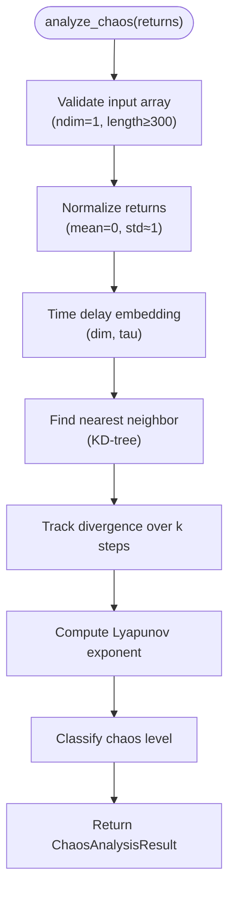

# Physics-Aware Risk Management

<cite>
**Referenced Files in This Document**
- [src/risk/physics/chaos_sensor.py](file://src/risk/physics/chaos_sensor.py)
- [src/risk/physics/correlation_sensor.py](file://src/risk/physics/correlation_sensor.py)
- [src/risk/physics/ising_sensor.py](file://src/risk/physics/ising_sensor.py)
- [src/risk/models/market_physics.py](file://src/risk/models/market_physics.py)
- [src/risk/governor.py](file://src/risk/governor.py)
- [src/risk/sizing/kelly_engine.py](file://src/risk/sizing/kelly_engine.py)
- [tests/risk/physics/test_ising_sensor.py](file://tests/risk/physics/test_ising_sensor.py)
- [tests/risk/physics/test_correlation_sensor.py](file://tests/risk/physics/test_correlation_sensor.py)
- [tests/risk/physics/test_physics_sensors.py](file://tests/risk/physics/test_physics_sensors.py)
- [docs/ECONOPHYSICS_INTEGRATION.md](file://docs/ECONOPHYSICS_INTEGRATION.md)
</cite>

## Table of Contents
1. [Introduction](#introduction)
2. [Project Structure](#project-structure)
3. [Core Components](#core-components)
4. [Architecture Overview](#architecture-overview)
5. [Detailed Component Analysis](#detailed-component-analysis)
6. [Dependency Analysis](#dependency-analysis)
7. [Performance Considerations](#performance-considerations)
8. [Troubleshooting Guide](#troubleshooting-guide)
9. [Conclusion](#conclusion)
10. [Appendices](#appendices)

## Introduction
This document describes the Physics-Aware Risk Management subsystem that integrates econophysics and chaos theory into financial market risk control. It covers:
- Chaos theory integration via Lyapunov exponent analysis for market instability detection
- Phase space reconstruction techniques and market predictability assessment
- Correlation sensor implementation using Random Matrix Theory (RMT) for systemic risk propagation
- Ising model sensor for phase transition detection and market regime shifts
- Mathematical foundations and practical applications in financial markets
- Implementation details for sensor calibration, data processing, and real-time market state analysis
- Physics-based position sizing adjustments and their impact on risk management decisions

## Project Structure
The Physics-Aware Risk Management subsystem resides under the risk package and includes:
- Physics sensors for chaos detection, correlation analysis, and Ising regime modeling
- Market physics model for combining indicators into a unified risk profile
- Risk governor orchestrating position sizing with physics-based adjustments
- Physics-aware Kelly engine for dynamic sizing with econophysics constraints

**Diagram sources**
- [src/risk/physics/chaos_sensor.py](file://src/risk/physics/chaos_sensor.py#L31-L253)
- [src/risk/physics/correlation_sensor.py](file://src/risk/physics/correlation_sensor.py#L22-L285)
- [src/risk/physics/ising_sensor.py](file://src/risk/physics/ising_sensor.py#L105-L246)
- [src/risk/models/market_physics.py](file://src/risk/models/market_physics.py#L27-L247)
- [src/risk/governor.py](file://src/risk/governor.py#L42-L447)
- [src/risk/sizing/kelly_engine.py](file://src/risk/sizing/kelly_engine.py#L25-L368)

**Section sources**
- [src/risk/physics/chaos_sensor.py](file://src/risk/physics/chaos_sensor.py#L1-L253)
- [src/risk/physics/correlation_sensor.py](file://src/risk/physics/correlation_sensor.py#L1-L285)
- [src/risk/physics/ising_sensor.py](file://src/risk/physics/ising_sensor.py#L1-L246)
- [src/risk/models/market_physics.py](file://src/risk/models/market_physics.py#L1-L247)
- [src/risk/governor.py](file://src/risk/governor.py#L1-L447)
- [src/risk/sizing/kelly_engine.py](file://src/risk/sizing/kelly_engine.py#L1-L368)

## Core Components
- ChaosSensor: Computes Lyapunov exponent using time delay embedding and the method of analogues to quantify market instability and predictability.
- CorrelationSensor: Implements RMT-based eigenvalue analysis to detect systemic risk and denoise correlation matrices.
- IsingRegimeSensor: Uses a 3D Ising spin system with Metropolis-Hastings sampling to detect phase transitions and classify market regimes.
- MarketPhysics: Pydantic model aggregating physics indicators into a unified risk profile with risk level and position sizing multiplier.
- RiskGovernor: Orchestrates sensor readings, applies physics-based adjustments, enforces constraints, and computes position sizes.
- PhysicsAwareKellyEngine: Calculates position sizing using econophysics constraints and optional Monte Carlo validation.

**Section sources**
- [src/risk/physics/chaos_sensor.py](file://src/risk/physics/chaos_sensor.py#L31-L253)
- [src/risk/physics/correlation_sensor.py](file://src/risk/physics/correlation_sensor.py#L22-L285)
- [src/risk/physics/ising_sensor.py](file://src/risk/physics/ising_sensor.py#L105-L246)
- [src/risk/models/market_physics.py](file://src/risk/models/market_physics.py#L27-L247)
- [src/risk/governor.py](file://src/risk/governor.py#L42-L447)
- [src/risk/sizing/kelly_engine.py](file://src/risk/sizing/kelly_engine.py#L25-L368)

## Architecture Overview
The subsystem integrates three physics sensors with risk management logic to produce a dynamic risk profile and position sizing multiplier.

**Diagram sources**
- [src/risk/governor.py](file://src/risk/governor.py#L105-L224)
- [src/risk/physics/chaos_sensor.py](file://src/risk/physics/chaos_sensor.py#L195-L241)
- [src/risk/physics/correlation_sensor.py](file://src/risk/physics/correlation_sensor.py#L229-L281)
- [src/risk/physics/ising_sensor.py](file://src/risk/physics/ising_sensor.py#L140-L195)
- [src/risk/models/market_physics.py](file://src/risk/models/market_physics.py#L123-L218)
- [src/risk/sizing/kelly_engine.py](file://src/risk/sizing/kelly_engine.py#L89-L282)

## Detailed Component Analysis

### Chaos Sensor: Lyapunov Exponent and Phase Space Reconstruction
The ChaosSensor performs:
- Time delay embedding to reconstruct phase space from univariate time series
- Method of analogues to locate nearest neighbors in the embedded space
- Divergence tracking over k-steps to estimate the Lyapunov exponent
- Chaos level classification based on thresholded Lyapunov values

**Diagram sources**
- [src/risk/physics/chaos_sensor.py](file://src/risk/physics/chaos_sensor.py#L67-L176)
- [src/risk/physics/chaos_sensor.py](file://src/risk/physics/chaos_sensor.py#L195-L241)

Implementation highlights:
- Embedding parameters: embedding_dimension, time_delay, lookback_points, k_steps
- Robust input validation and error handling for insufficient data
- Normalization to stabilize analysis across scales
- Classification thresholds for STABLE, MODERATE, CHAOTIC regimes

**Section sources**
- [src/risk/physics/chaos_sensor.py](file://src/risk/physics/chaos_sensor.py#L31-L253)
- [tests/risk/physics/test_physics_sensors.py](file://tests/risk/physics/test_physics_sensors.py#L102-L196)

### Correlation Sensor: Random Matrix Theory and Systemic Risk
The CorrelationSensor implements:
- Input validation for returns matrices (assets × time)
- Optional normalization of returns
- Correlation matrix construction with NaN handling
- Marchenko-Pastur threshold calculation for noise detection
- Eigenvalue decomposition and denoising of correlation matrices
- Risk classification based on maximum eigenvalue

**Diagram sources**
- [src/risk/physics/correlation_sensor.py](file://src/risk/physics/correlation_sensor.py#L57-L281)

Implementation highlights:
- Caching via LRU cache for performance
- Numerical stability with clipping and diagonal filling
- Risk thresholds for LOW, MODERATE, HIGH classifications
- Denoising replaces noise eigenvalues with average to preserve matrix properties

**Section sources**
- [src/risk/physics/correlation_sensor.py](file://src/risk/physics/correlation_sensor.py#L22-L285)
- [tests/risk/physics/test_correlation_sensor.py](file://tests/risk/physics/test_correlation_sensor.py#L18-L292)

### Ising Model Sensor: Phase Transitions and Regime Shifts
The IsingRegimeSensor simulates a 3D Ising spin system:
- Initializes a random spin lattice
- Performs Metropolis-Hastings updates with neighbor interactions and a bias field aligned to a target sentiment
- Computes observables: magnetization and susceptibility
- Classifies regimes based on magnetization magnitude and susceptibility peaks

**Diagram sources**
- [src/risk/physics/ising_sensor.py](file://src/risk/physics/ising_sensor.py#L31-L103)
- [src/risk/physics/ising_sensor.py](file://src/risk/physics/ising_sensor.py#L105-L246)

Implementation highlights:
- Configurable grid size, temperature range, and control gain
- Caching for simulation results
- Volatility-to-temperature mapping for real-time regime detection
- Regime classification: CHAOTIC, TRANSITIONAL, ORDERED

**Section sources**
- [src/risk/physics/ising_sensor.py](file://src/risk/physics/ising_sensor.py#L1-L246)
- [tests/risk/physics/test_ising_sensor.py](file://tests/risk/physics/test_ising_sensor.py#L1-L155)

### Market Physics Model and Risk Level Determination
MarketPhysics aggregates:
- Lyapunov exponent (chaos)
- Ising susceptibility (volatility clustering)
- Ising magnetization (trend strength/direction)
- RMT maximum eigenvalue and noise threshold
- Timestamps and staleness flags

It provides:
- Risk level classification (LOW, MODERATE, HIGH, EXTREME)
- Position sizing multiplier based on combined physics indicators
- Signal detection when RMT indicates true signal vs noise
- Trend direction inference from magnetization
- Human-readable regime description

**Diagram sources**
- [src/risk/models/market_physics.py](file://src/risk/models/market_physics.py#L27-L218)

**Section sources**
- [src/risk/models/market_physics.py](file://src/risk/models/market_physics.py#L1-L247)

### Risk Governor and Physics-Based Position Sizing
RiskGovernor orchestrates:
- Input validation and base Kelly calculation
- Physics-based adjustments from Chaos, Correlation, and Ising sensors
- Prop firm constraints and portfolio scaling
- Lot-size rounding and caching
- Comprehensive audit trail in PositionSizingResult

**Diagram sources**
- [src/risk/governor.py](file://src/risk/governor.py#L105-L224)

Physics-based adjustment logic:
- Chaos penalty: min(chaos_reading × 0.75, 0.75)
- Correlation penalty: min(correlation_reading × 0.5, 0.5)
- Ising penalty: min(ising_reading × 0.25, 0.25)
- Combined multiplier: max(0.25, 1.0 − total_penalty)

**Section sources**
- [src/risk/governor.py](file://src/risk/governor.py#L105-L297)

### Physics-Aware Kelly Engine
The PhysicsAwareKellyEngine:
- Computes base Kelly fraction and applies fractional Kelly
- Applies physics multipliers from Lyapunov, Ising, and RMT indicators
- Aggregates using the weakest-link rule
- Optionally validates with Monte Carlo simulation
- Caps risk at a conservative maximum

**Diagram sources**
- [src/risk/sizing/kelly_engine.py](file://src/risk/sizing/kelly_engine.py#L89-L282)

**Section sources**
- [src/risk/sizing/kelly_engine.py](file://src/risk/sizing/kelly_engine.py#L25-L368)

## Dependency Analysis
The subsystem exhibits clear separation of concerns:
- ChaosSensor depends on NumPy and scikit-learn’s NearestNeighbors
- CorrelationSensor depends on NumPy and SciPy’s eigh
- IsingRegimeSensor depends on NumPy and internal IsingSystem
- MarketPhysics is a data model with validators
- RiskGovernor composes all sensors and the Kelly engine
- Tests validate sensor correctness and performance constraints

**Diagram sources**
- [src/risk/physics/chaos_sensor.py](file://src/risk/physics/chaos_sensor.py#L14-L18)
- [src/risk/physics/correlation_sensor.py](file://src/risk/physics/correlation_sensor.py#L16-L18)
- [src/risk/physics/ising_sensor.py](file://src/risk/physics/ising_sensor.py#L20-L26)
- [src/risk/governor.py](file://src/risk/governor.py#L24-L37)
- [src/risk/sizing/kelly_engine.py](file://src/risk/sizing/kelly_engine.py#L16-L19)

**Section sources**
- [src/risk/physics/chaos_sensor.py](file://src/risk/physics/chaos_sensor.py#L14-L18)
- [src/risk/physics/correlation_sensor.py](file://src/risk/physics/correlation_sensor.py#L16-L18)
- [src/risk/physics/ising_sensor.py](file://src/risk/physics/ising_sensor.py#L20-L26)
- [src/risk/governor.py](file://src/risk/governor.py#L24-L37)
- [src/risk/sizing/kelly_engine.py](file://src/risk/sizing/kelly_engine.py#L16-L19)

## Performance Considerations
- ChaosSensor: Phase space embedding and KD-tree search scale with data length; ensure sufficient lookback points while respecting latency budgets.
- CorrelationSensor: Eigenvalue decomposition dominates runtime; leverage caching and avoid recomputation for identical inputs.
- IsingRegimeSensor: Monte Carlo sweeps are computationally intensive; use caching and configurable grid sizes for responsiveness.
- RiskGovernor: Caches physics and account data with TTLs to minimize repeated computations.
- Tests enforce performance targets (e.g., RMT under 150 ms for typical datasets).

[No sources needed since this section provides general guidance]

## Troubleshooting Guide
Common issues and resolutions:
- ChaosSensor insufficient data: Ensure input arrays meet minimum length and dimension requirements.
- CorrelationSensor invalid inputs: Verify 2D shape, minimum assets and periods, and handle NaN values appropriately.
- IsingRegimeSensor cache invalidation: Clear caches when changing configuration or when deterministic behavior is required.
- RiskGovernor constraint violations: Validate inputs and check prop firm presets and portfolio scaling logic.
- Physics-aware sizing anomalies: Review MarketPhysics thresholds and multiplier logic; confirm RMT availability for eigenvalue-based adjustments.

**Section sources**
- [src/risk/physics/chaos_sensor.py](file://src/risk/physics/chaos_sensor.py#L208-L218)
- [src/risk/physics/correlation_sensor.py](file://src/risk/physics/correlation_sensor.py#L57-L80)
- [src/risk/physics/ising_sensor.py](file://src/risk/physics/ising_sensor.py#L214-L223)
- [src/risk/governor.py](file://src/risk/governor.py#L225-L247)
- [src/risk/models/market_physics.py](file://src/risk/models/market_physics.py#L131-L177)

## Conclusion
The Physics-Aware Risk Management subsystem integrates chaos theory, econophysics, and statistical mechanics to enhance risk-aware position sizing. By combining Lyapunov exponent analysis, RMT-based correlation filtering, and Ising model regime detection, it provides dynamic risk adjustments grounded in physical principles. The RiskGovernor and PhysicsAwareKellyEngine translate these insights into actionable, real-time position sizing decisions with built-in safeguards and validation.

[No sources needed since this section summarizes without analyzing specific files]

## Appendices

### Mathematical Foundations and Practical Applications
- Chaos theory and Lyapunov exponents: Measure sensitivity to initial conditions; positive exponents imply chaos and reduced predictability.
- Phase space reconstruction: Time delay embedding recovers attractor geometry from scalar time series.
- Random Matrix Theory: Separates signal from noise using Marchenko-Pastur thresholds; eigenvalue spectrum reveals systemic risk.
- Ising model: Spin dynamics simulate collective behavior; susceptibility identifies critical points and phase transitions.
- Econophysics principles: Market dynamics modeled as physical systems; multi-scale analysis improves forecasting and risk control.

**Section sources**
- [docs/ECONOPHYSICS_INTEGRATION.md](file://docs/ECONOPHYSICS_INTEGRATION.md#L1-L557)