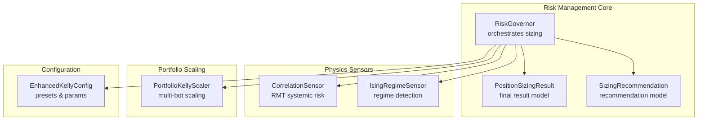
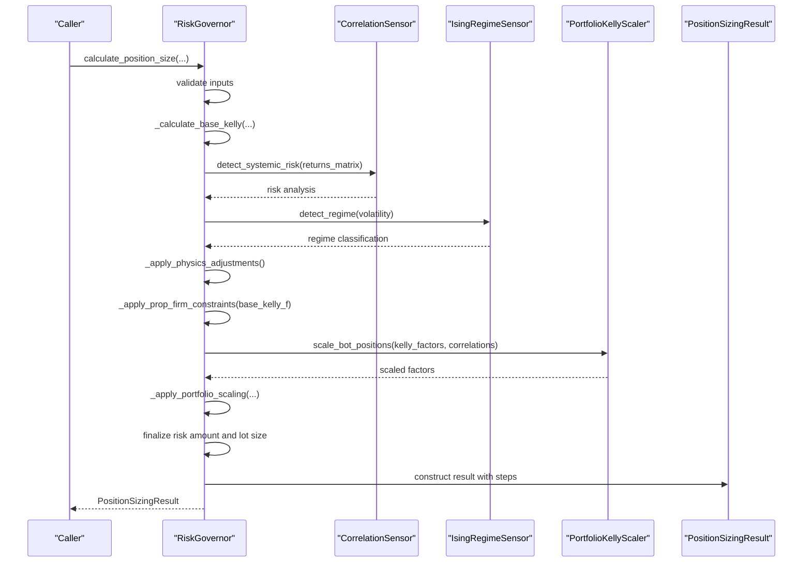
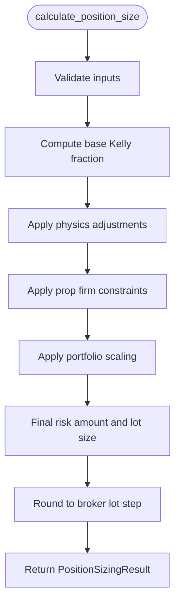
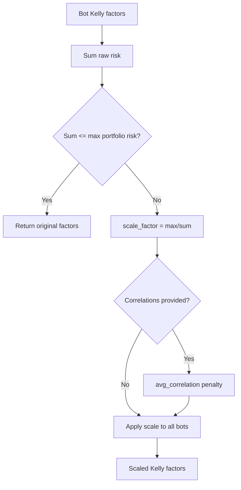
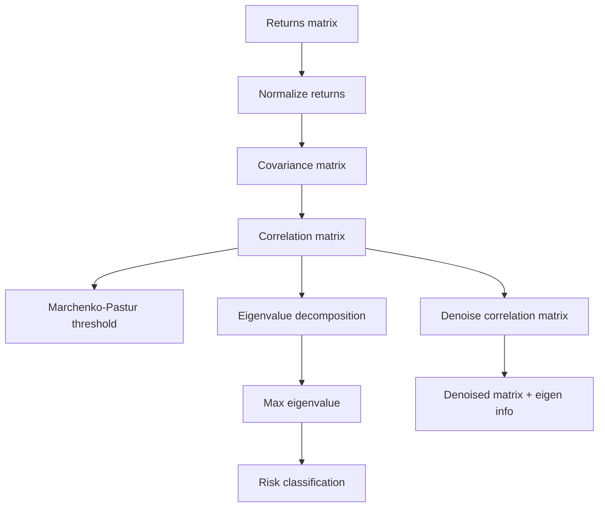
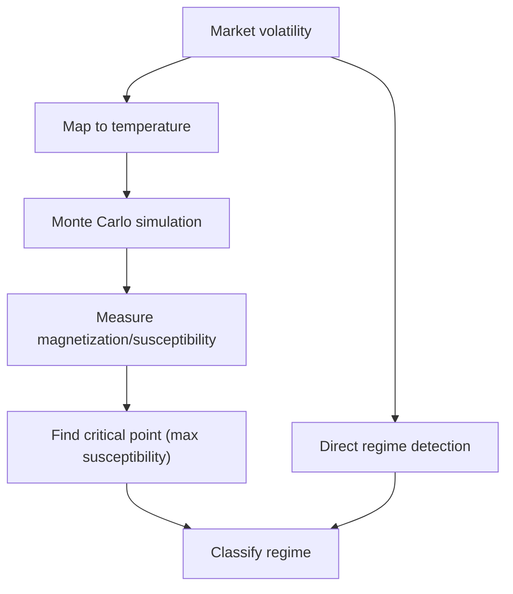
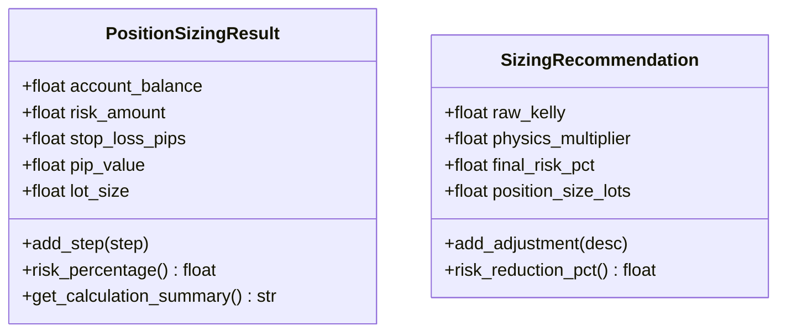
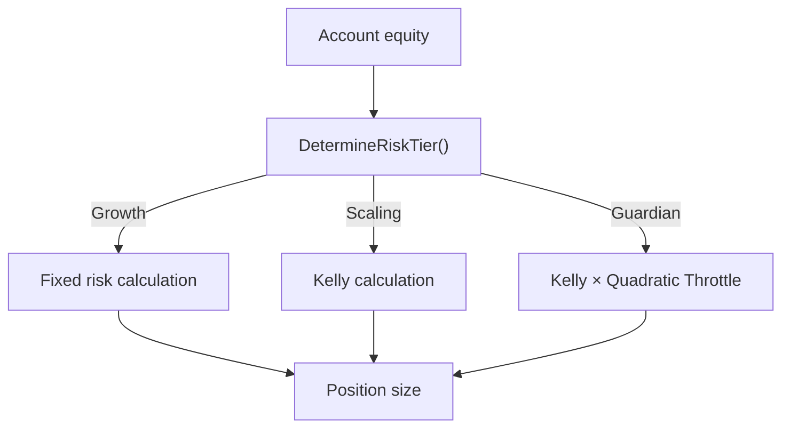
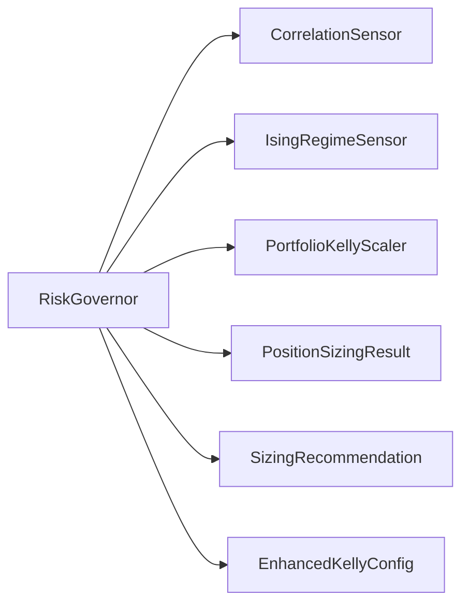

# Portfolio Risk Management

<cite>
**Referenced Files in This Document**
- [governor.py](file://src/risk/governor.py)
- [portfolio_kelly.py](file://src/position_sizing/portfolio_kelly.py)
- [position_sizing_result.py](file://src/risk/models/position_sizing_result.py)
- [sizing_recommendation.py](file://src/risk/models/sizing_recommendation.py)
- [correlation_sensor.py](file://src/risk/physics/correlation_sensor.py)
- [ising_sensor.py](file://src/risk/physics/ising_sensor.py)
- [kelly_config.py](file://src/position_sizing/kelly_config.py)
- [test_risk_tier_calculation_benchmark.py](file://tests/benchmarks/test_risk_tier_calculation_benchmark.py)
- [verify_enum_risk_tier.py](file://tests/mql5/verify_enum_risk_tier.py)
</cite>

## Table of Contents
1. [Introduction](#introduction)
2. [Project Structure](#project-structure)
3. [Core Components](#core-components)
4. [Architecture Overview](#architecture-overview)
5. [Detailed Component Analysis](#detailed-component-analysis)
6. [Dependency Analysis](#dependency-analysis)
7. [Performance Considerations](#performance-considerations)
8. [Troubleshooting Guide](#troubleshooting-guide)
9. [Conclusion](#conclusion)
10. [Appendices](#appendices)

## Introduction
This document presents a comprehensive guide to the Portfolio Risk Management system. It explains the correlation analysis algorithms, systemic risk assessment methodologies, and multi-bot position scaling. It documents the portfolio Kelly scaling implementation, risk utilization tracking, and over-leverage prevention mechanisms. It also covers integration with prop firm requirements, risk tier calculations, and compliance monitoring. Finally, it outlines the mathematical models for portfolio optimization, diversification benefits, and risk contribution analysis, and provides examples of portfolio construction, risk allocation strategies, and performance attribution.

## Project Structure
The Portfolio Risk Management system is organized around a central Risk Governor that orchestrates:
- Physics-based sensors for market regime detection and systemic risk
- Position sizing models and recommendations
- Portfolio-level Kelly scaling to prevent over-leverage
- Prop firm presets and tiered risk management
- Benchmarks and verification for performance and correctness

**Diagram sources**
- [governor.py](file://src/risk/governor.py#L42-L447)
- [correlation_sensor.py](file://src/risk/physics/correlation_sensor.py#L22-L285)
- [ising_sensor.py](file://src/risk/physics/ising_sensor.py#L105-L246)
- [portfolio_kelly.py](file://src/position_sizing/portfolio_kelly.py#L26-L254)
- [position_sizing_result.py](file://src/risk/models/position_sizing_result.py#L16-L246)
- [sizing_recommendation.py](file://src/risk/models/sizing_recommendation.py#L15-L229)
- [kelly_config.py](file://src/position_sizing/kelly_config.py#L11-L116)

**Section sources**
- [governor.py](file://src/risk/governor.py#L1-L447)
- [portfolio_kelly.py](file://src/position_sizing/portfolio_kelly.py#L1-L254)
- [position_sizing_result.py](file://src/risk/models/position_sizing_result.py#L1-L246)
- [sizing_recommendation.py](file://src/risk/models/sizing_recommendation.py#L1-L229)
- [correlation_sensor.py](file://src/risk/physics/correlation_sensor.py#L1-L285)
- [ising_sensor.py](file://src/risk/physics/ising_sensor.py#L1-L246)
- [kelly_config.py](file://src/position_sizing/kelly_config.py#L1-L116)

## Core Components
- RiskGovernor: Central orchestrator for Enhanced Kelly position sizing. It validates inputs, computes base Kelly, applies physics-based adjustments, enforces prop firm constraints, scales for portfolios, and rounds to broker lot steps. It exposes monitoring via portfolio status and detailed recommendations.
- PortfolioKellyScaler: Prevents over-leverage by scaling individual bot Kelly fractions when multiple bots are active, optionally penalizing correlated positions.
- CorrelationSensor: Implements Random Matrix Theory (RMT) to detect systemic risk from correlation matrices, including eigenvalue decomposition and denoising.
- IsingRegimeSensor: Uses a 3D Ising model with Metropolis-Hastings to simulate market regimes and detect phase transitions.
- PositionSizingResult and SizingRecommendation: Pydantic models capturing final sizing results and recommendation traces with constraint tracking.
- EnhancedKellyConfig: Presets and parameters for prop firm integration and tiered risk management.

**Section sources**
- [governor.py](file://src/risk/governor.py#L105-L447)
- [portfolio_kelly.py](file://src/position_sizing/portfolio_kelly.py#L26-L254)
- [correlation_sensor.py](file://src/risk/physics/correlation_sensor.py#L22-L285)
- [ising_sensor.py](file://src/risk/physics/ising_sensor.py#L105-L246)
- [position_sizing_result.py](file://src/risk/models/position_sizing_result.py#L16-L246)
- [sizing_recommendation.py](file://src/risk/models/sizing_recommendation.py#L15-L229)
- [kelly_config.py](file://src/position_sizing/kelly_config.py#L11-L116)

## Architecture Overview
The system follows a layered design:
- Input layer: account metrics, strategy metrics, and market data
- Physics layer: chaos, correlation, and regime sensors
- Decision layer: base Kelly computation, adjustments, and constraints
- Portfolio layer: multi-bot risk aggregation and scaling
- Output layer: final position size, risk amount, and audit trail

**Diagram sources**
- [governor.py](file://src/risk/governor.py#L105-L333)
- [correlation_sensor.py](file://src/risk/physics/correlation_sensor.py#L229-L281)
- [ising_sensor.py](file://src/risk/physics/ising_sensor.py#L140-L195)
- [portfolio_kelly.py](file://src/position_sizing/portfolio_kelly.py#L57-L96)
- [position_sizing_result.py](file://src/risk/models/position_sizing_result.py#L16-L246)

## Detailed Component Analysis

### RiskGovernor: Enhanced Kelly Position Sizing Orchestration
- Responsibilities:
  - Input validation and base Kelly computation
  - Physics-based adjustments using chaos, correlation, and regime sensors
  - Prop firm constraint enforcement via presets
  - Portfolio-level scaling to prevent over-leverage
  - Lot rounding and caching for performance
  - Detailed audit trail and monitoring
- Key methods:
  - calculate_position_size: end-to-end sizing pipeline
  - _apply_physics_adjustments: combines sensor readings into a multiplier
  - _apply_prop_firm_constraints: caps risk according to preset
  - _apply_portfolio_scaling: integrates PortfolioKellyScaler
  - get_portfolio_status: returns portfolio risk metrics
  - get_sizing_recommendation: returns recommendation with adjustment history

**Diagram sources**
- [governor.py](file://src/risk/governor.py#L105-L333)

**Section sources**
- [governor.py](file://src/risk/governor.py#L105-L447)

### Portfolio Kelly Scaling and Over-Leverage Prevention
- PortfolioKellyScaler:
  - Aggregates raw Kelly fractions across bots
  - Computes proportional scale factor when total risk exceeds max portfolio risk
  - Optionally penalizes correlated positions by adjusting the scale factor
  - Provides PortfolioStatus with risk utilization, status, and recommendation
  - Supports equal and performance-based risk allocation strategies
- Risk utilization tracking:
  - Calculates utilization as scaled total risk divided by max portfolio risk
  - Classifies status as safe/caution/danger and provides recommendations

**Diagram sources**
- [portfolio_kelly.py](file://src/position_sizing/portfolio_kelly.py#L57-L96)

**Section sources**
- [portfolio_kelly.py](file://src/position_sizing/portfolio_kelly.py#L26-L254)

### Correlation Analysis and Systemic Risk Assessment (RMT)
- CorrelationSensor:
  - Validates returns matrix dimensions and quality
  - Normalizes returns if enabled
  - Builds correlation matrix, handles NaN values
  - Computes Marchenko-Pastur noise threshold
  - Performs eigenvalue decomposition and denoises correlation matrix
  - Classifies risk level based on maximum eigenvalue
  - Provides denoised matrix and eigenvalue/eigenvector information
- Systemic risk detection:
  - High risk when max eigenvalue exceeds threshold
  - Denoised matrix improves stability and interpretability

**Diagram sources**
- [correlation_sensor.py](file://src/risk/physics/correlation_sensor.py#L103-L281)

**Section sources**
- [correlation_sensor.py](file://src/risk/physics/correlation_sensor.py#L22-L285)

### Market Regime Detection (Ising Model)
- IsingRegimeSensor:
  - 3D lattice with Metropolis-Hastings spin flips
  - Temperature-based simulation mapped from volatility
  - Observables: magnetization and susceptibility
  - Critical point detection via maximum susceptibility
  - Regime classification: CHAOTIC, TRANSITIONAL, ORDERED
- Integration with RiskGovernor:
  - Provides regime context for physics adjustments

**Diagram sources**
- [ising_sensor.py](file://src/risk/physics/ising_sensor.py#L140-L195)

**Section sources**
- [ising_sensor.py](file://src/risk/physics/ising_sensor.py#L105-L246)

### Position Sizing Models and Recommendations
- PositionSizingResult:
  - Captures account balance, risk amount, stop loss pips, pip value, lot size
  - Provides risk percentage, risk per lot, margin calculations, and audit trail
  - Includes helpers for validation, margin sufficiency, and JSON serialization
- SizingRecommendation:
  - Tracks raw Kelly, physics multiplier, final risk percentage, and position size
  - Records constraint source and adjustment history
  - Offers risk reduction percentage and zero-position checks

**Diagram sources**
- [position_sizing_result.py](file://src/risk/models/position_sizing_result.py#L16-L246)
- [sizing_recommendation.py](file://src/risk/models/sizing_recommendation.py#L15-L229)

**Section sources**
- [position_sizing_result.py](file://src/risk/models/position_sizing_result.py#L16-L246)
- [sizing_recommendation.py](file://src/risk/models/sizing_recommendation.py#L15-L229)

### Prop Firm Integration and Risk Tier Calculations
- EnhancedKellyConfig:
  - Defines presets for FTMO Challenge/Funded, The5%ers, and others
  - Encodes risk caps, volatility thresholds, and portfolio risk parameters
- Risk tier benchmarking:
  - Validates sub-millisecond latency for tier determination and position sizing
  - Tests across Growth, Scaling, and Guardian tiers with quadratic throttling in Guardian
- MQL5 enumeration verification:
  - Confirms ENUM_RISK_TIER definition and usage in DetermineRiskTier and CalculateTieredPositionSize

**Diagram sources**
- [test_risk_tier_calculation_benchmark.py](file://tests/benchmarks/test_risk_tier_calculation_benchmark.py#L95-L295)
- [verify_enum_risk_tier.py](file://tests/mql5/verify_enum_risk_tier.py#L15-L86)

**Section sources**
- [kelly_config.py](file://src/position_sizing/kelly_config.py#L63-L116)
- [test_risk_tier_calculation_benchmark.py](file://tests/benchmarks/test_risk_tier_calculation_benchmark.py#L20-L523)
- [verify_enum_risk_tier.py](file://tests/mql5/verify_enum_risk_tier.py#L15-L92)

## Dependency Analysis
- RiskGovernor depends on:
  - Physics sensors for systemic risk and regime context
  - PortfolioKellyScaler for multi-bot risk aggregation
  - PositionSizingResult and SizingRecommendation for outputs
  - EnhancedKellyConfig for prop firm presets and parameters
- Coupling and cohesion:
  - High cohesion within each module; moderate coupling via shared interfaces (e.g., correlation matrix inputs)
  - No circular dependencies observed among core modules

**Diagram sources**
- [governor.py](file://src/risk/governor.py#L24-L37)
- [portfolio_kelly.py](file://src/position_sizing/portfolio_kelly.py#L26-L56)
- [position_sizing_result.py](file://src/risk/models/position_sizing_result.py#L16-L42)
- [sizing_recommendation.py](file://src/risk/models/sizing_recommendation.py#L15-L31)
- [kelly_config.py](file://src/position_sizing/kelly_config.py#L11-L48)

**Section sources**
- [governor.py](file://src/risk/governor.py#L24-L37)
- [portfolio_kelly.py](file://src/position_sizing/portfolio_kelly.py#L26-L56)
- [position_sizing_result.py](file://src/risk/models/position_sizing_result.py#L16-L42)
- [sizing_recommendation.py](file://src/risk/models/sizing_recommendation.py#L15-L31)
- [kelly_config.py](file://src/position_sizing/kelly_config.py#L11-L48)

## Performance Considerations
- Latency targets validated by benchmarks:
  - Sub-millisecond average and median for tier determination and full position sizing
  - Acceptable P95/P99 under concurrent load
- Caching:
  - Physics sensor results cached with TTL to avoid repeated heavy computations
  - Account cache TTL configurable for monitoring consistency
- Computational complexity:
  - CorrelationSensor: O(N_assets^3) for eigen-decomposition; mitigated by caching and moderate grid sizes
  - IsingRegimeSensor: Monte Carlo sweeps with fixed grid size; optimized via caching and LRU
  - PortfolioKellyScaler: O(Bots) for aggregation and proportional scaling

[No sources needed since this section provides general guidance]

## Troubleshooting Guide
- Common issues and resolutions:
  - Invalid inputs: ensure positive account balance, win rate in [0,1], positive average win/loss, stop loss pips, and ATR
  - Negative expectancy: fallback to maximum risk percentage to avoid overexposure
  - Zero position sizing: check constraints (physics penalties, prop firm caps, portfolio scaling)
  - Margin sufficiency: validate remaining margin after position open; handle None gracefully
  - Prop firm preset mismatch: confirm preset name and parameters align with expectations
- Monitoring:
  - Use get_sizing_recommendation for adjustment history and constraint reasons
  - Use get_portfolio_status for risk utilization and recommendations
  - Inspect calculation_steps in PositionSizingResult for audit trail

**Section sources**
- [governor.py](file://src/risk/governor.py#L225-L333)
- [position_sizing_result.py](file://src/risk/models/position_sizing_result.py#L206-L237)
- [sizing_recommendation.py](file://src/risk/models/sizing_recommendation.py#L133-L176)

## Conclusion
The Portfolio Risk Management system integrates econophysical insights with practical position sizing and portfolio scaling to deliver robust risk controls. It leverages Random Matrix Theory for systemic risk detection, Ising modeling for regime classification, and portfolio-level Kelly scaling to prevent over-leverage. Prop firm presets and tiered risk management ensure compliance and performance targets. The modular design, combined with caching and rigorous benchmarking, supports sub-millisecond responsiveness essential for live trading.

[No sources needed since this section summarizes without analyzing specific files]

## Appendices

### Mathematical Models and Examples

- Portfolio Optimization and Diversification Benefits
  - Objective: maximize expected return subject to portfolio risk budget and diversification constraints
  - Approximation: minimize portfolio variance subject to target return and exposure limits
  - Diversification benefit: reduced portfolio variance compared to individual asset variances, especially when correlations are below 1.0
  - Practical example: allocate across N uncorrelated assets to achieve lower portfolio volatility than the highest individual variance

- Risk Contribution Analysis
  - Marginal risk contribution of asset i: ∂σ_p / ∂w_i
  - Total risk: σ_p = √(w^T Σ w)
  - Risk parity: equal marginal risk contributions across assets
  - Example: if two assets have identical volatilities but positive correlation, risk parity implies equal weights; if correlation increases, weights shift toward the less correlated asset

- Portfolio Construction Strategies
  - Equal-risk allocation: distribute risk budget equally across active bots
  - Performance-based allocation: weight risk by Sharpe ratios while enforcing minimum allocations
  - Example: with 5 bots and 3% portfolio risk, allocate 0.6% per bot initially, then adjust by performance while ensuring total equals 3%

- Risk Allocation and Attribution
  - Raw risk: sum of individual Kelly fractions
  - Scaled risk: after portfolio scaling and correlation penalties
  - Attribution: quantify how much of the reduction comes from portfolio scaling versus correlation penalties

- Dynamic Risk Budgeting
  - Adjust max portfolio risk based on market regime (e.g., reduce during CHAOTIC regimes)
  - Scale position size dynamically using volatility thresholds (ATR ratio)
  - Example: if ATR_current / ATR_avg > high_vol_threshold, reduce position size; if below low_vol_threshold, modestly increase

[No sources needed since this section provides general guidance]