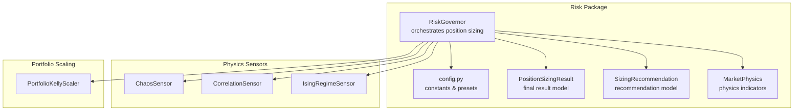
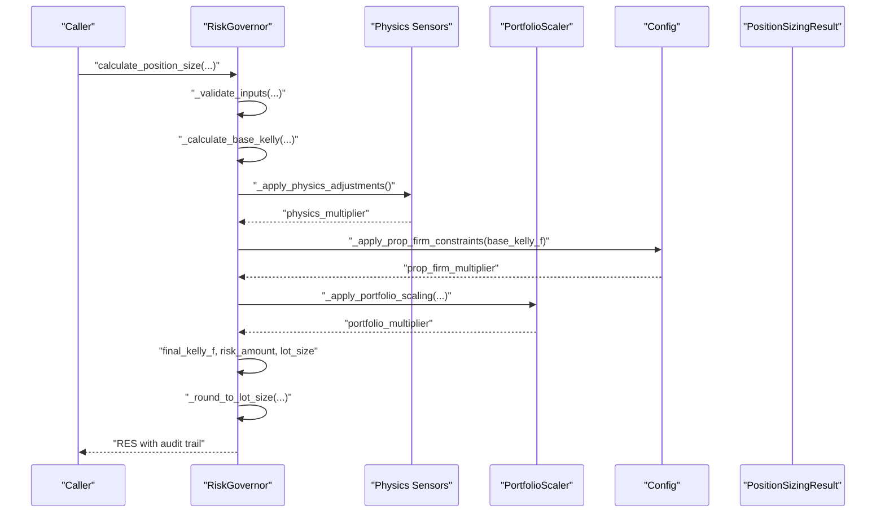
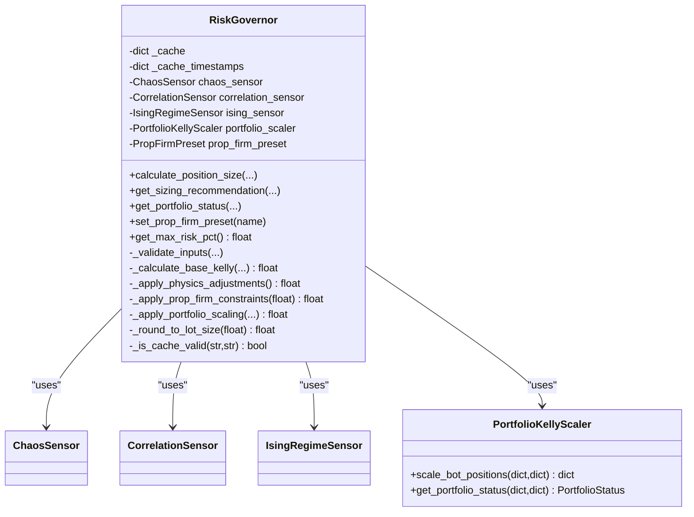
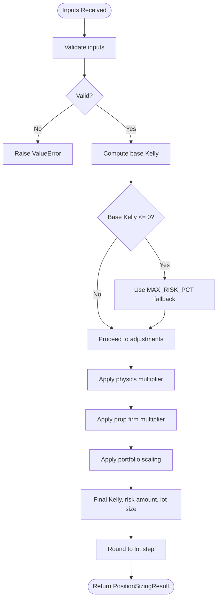
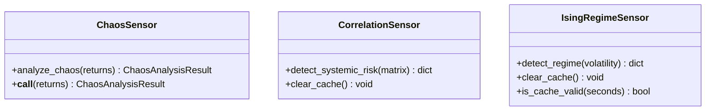
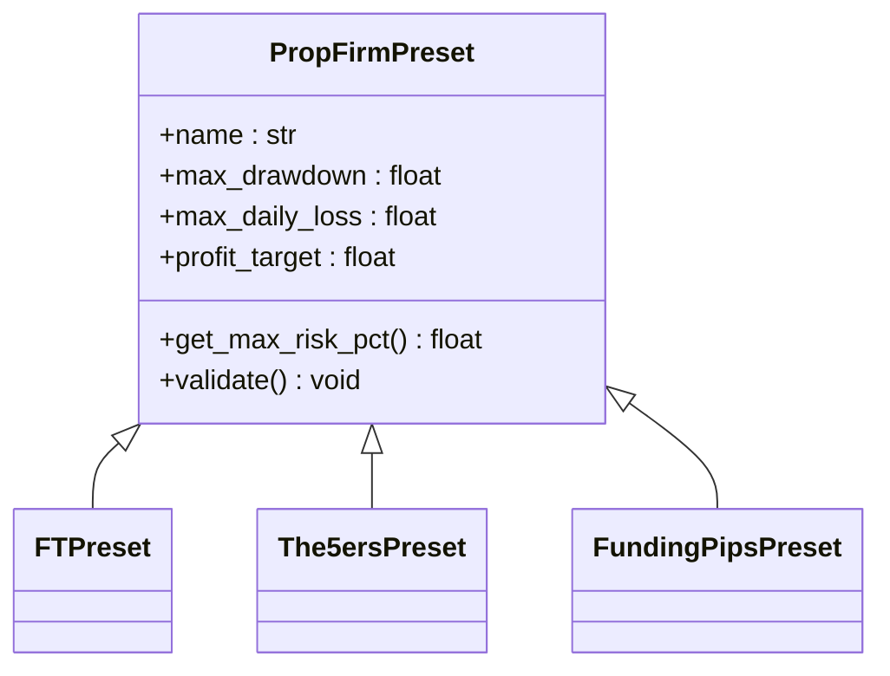
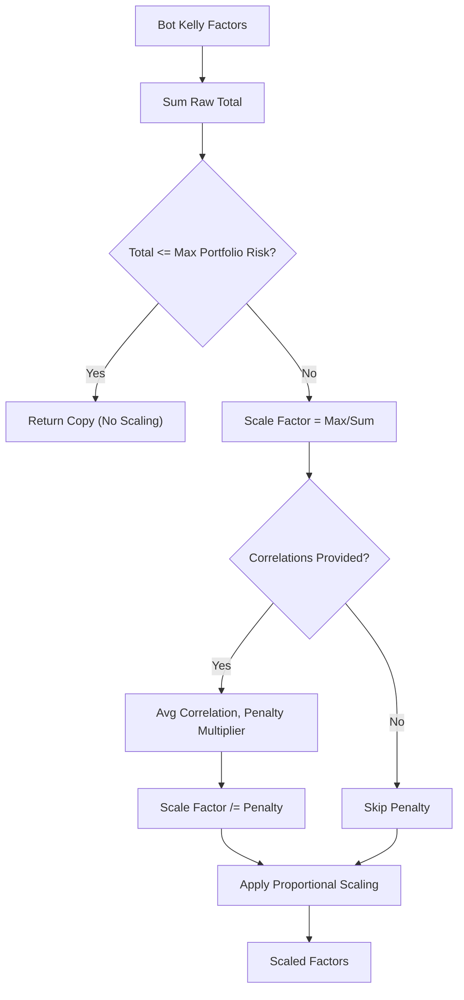
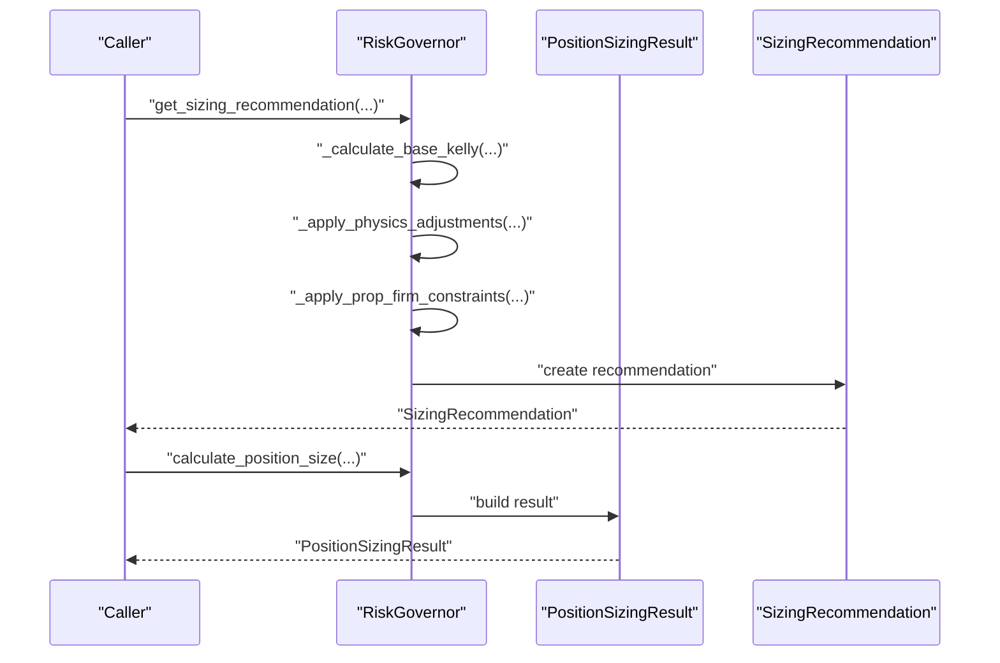
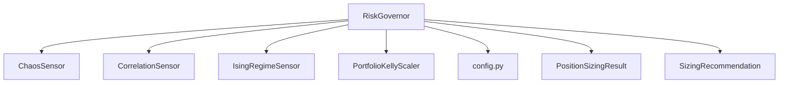

# Risk Governor System

<cite>
**Referenced Files in This Document**
- [governor.py](file://src/risk/governor.py)
- [config.py](file://agent-os/specs/2026-01-28-mycodingagents-quantmindx-architecture/2026-01-28-enhanced_kelly_position_sizing_v1/src/risk/config.py)
- [position_sizing_result.py](file://src/risk/models/position_sizing_result.py)
- [sizing_recommendation.py](file://src/risk/models/sizing_recommendation.py)
- [market_physics.py](file://src/risk/models/market_physics.py)
- [chaos_sensor.py](file://src/risk/physics/chaos_sensor.py)
- [correlation_sensor.py](file://src/risk/physics/correlation_sensor.py)
- [ising_sensor.py](file://src/risk/physics/ising_sensor.py)
- [portfolio_kelly.py](file://src/position_sizing/portfolio_kelly.py)
- [test_governor.py](file://src/risk/tests/test_governor.py)
</cite>

## Table of Contents
1. [Introduction](#introduction)
2. [Project Structure](#project-structure)
3. [Core Components](#core-components)
4. [Architecture Overview](#architecture-overview)
5. [Detailed Component Analysis](#detailed-component-analysis)
6. [Dependency Analysis](#dependency-analysis)
7. [Performance Considerations](#performance-considerations)
8. [Troubleshooting Guide](#troubleshooting-guide)
9. [Conclusion](#conclusion)
10. [Appendices](#appendices)

## Introduction
The Risk Governor System orchestrates the entire risk management workflow for position sizing using an Enhanced Kelly framework. It integrates physics-based market state sensors, prop firm presets, and portfolio scaling into a unified API. The system emphasizes safety layers, caching for performance, comprehensive logging, and strict input validation to ensure robust and compliant risk decisions across trading environments.

## Project Structure
The Risk Governor resides in the risk package and coordinates with physics sensors, configuration presets, and portfolio scaling utilities. Supporting models define the result and recommendation structures, while tests validate end-to-end behavior.

**Diagram sources**
- [governor.py](file://src/risk/governor.py#L42-L119)
- [config.py](file://agent-os/specs/2026-01-28-mycodingagents-quantmindx-architecture/2026-01-28-enhanced_kelly_position_sizing_v1/src/risk/config.py#L1-L363)
- [position_sizing_result.py](file://src/risk/models/position_sizing_result.py#L16-L90)
- [sizing_recommendation.py](file://src/risk/models/sizing_recommendation.py#L15-L80)
- [market_physics.py](file://src/risk/models/market_physics.py#L27-L91)
- [chaos_sensor.py](file://src/risk/physics/chaos_sensor.py#L31-L66)
- [correlation_sensor.py](file://src/risk/physics/correlation_sensor.py#L22-L56)
- [ising_sensor.py](file://src/risk/physics/ising_sensor.py#L105-L139)
- [portfolio_kelly.py](file://src/position_sizing/portfolio_kelly.py#L26-L56)

**Section sources**
- [governor.py](file://src/risk/governor.py#L42-L119)
- [config.py](file://agent-os/specs/2026-01-28-mycodingagents-quantmindx-architecture/2026-01-28-enhanced_kelly_position_sizing_v1/src/risk/config.py#L1-L363)

## Core Components
- RiskGovernor: Central orchestrator that validates inputs, computes base Kelly, applies physics-based adjustments, enforces prop firm constraints, scales for portfolio risk, rounds to broker lot sizes, and returns detailed results with audit trails.
- Physics Sensors: ChaosSensor (Lyapunov exponent), CorrelationSensor (Random Matrix Theory), and IsingRegimeSensor (magnetization/susceptibility) provide market regime signals.
- Configuration: Constants for cache TTLs, Kelly fractions, broker lot constraints, and prop firm presets.
- PortfolioScaler: PortfolioKellyScaler manages multi-bot risk allocation and scaling.
- Models: PositionSizingResult and SizingRecommendation encapsulate outputs and adjustment histories.

**Section sources**
- [governor.py](file://src/risk/governor.py#L105-L224)
- [chaos_sensor.py](file://src/risk/physics/chaos_sensor.py#L31-L66)
- [correlation_sensor.py](file://src/risk/physics/correlation_sensor.py#L22-L56)
- [ising_sensor.py](file://src/risk/physics/ising_sensor.py#L105-L139)
- [config.py](file://agent-os/specs/2026-01-28-mycodingagents-quantmindx-architecture/2026-01-28-enhanced_kelly_position_sizing_v1/src/risk/config.py#L20-L97)
- [portfolio_kelly.py](file://src/position_sizing/portfolio_kelly.py#L26-L56)
- [position_sizing_result.py](file://src/risk/models/position_sizing_result.py#L16-L90)
- [sizing_recommendation.py](file://src/risk/models/sizing_recommendation.py#L15-L80)

## Architecture Overview
The Risk Governor composes a calculation pipeline that integrates market-state awareness, regulatory/compliance constraints, and portfolio-wide risk controls.

**Diagram sources**
- [governor.py](file://src/risk/governor.py#L105-L224)
- [chaos_sensor.py](file://src/risk/physics/chaos_sensor.py#L262-L297)
- [correlation_sensor.py](file://src/risk/physics/correlation_sensor.py#L229-L281)
- [ising_sensor.py](file://src/risk/physics/ising_sensor.py#L140-L195)
- [portfolio_kelly.py](file://src/position_sizing/portfolio_kelly.py#L57-L96)
- [config.py](file://agent-os/specs/2026-01-28-mycodingagents-quantmindx-architecture/2026-01-28-enhanced_kelly_position_sizing_v1/src/risk/config.py#L241-L266)

## Detailed Component Analysis

### RiskGovernor Class
RiskGovernor is the central orchestrator. It maintains:
- In-memory caches for physics and account data with TTL-based validity checks.
- Physics sensors for chaos, correlation, and Ising regime detection.
- A portfolio scaler for multi-bot risk management.
- Prop firm preset support via configuration.

Key methods:
- calculate_position_size: Validates inputs, computes base Kelly, applies physics and prop firm constraints, scales for portfolio risk, calculates final position size, rounds to broker lot step, and logs performance.
- _validate_inputs: Enforces positivity and boundedness of inputs.
- _calculate_base_kelly: Implements the Kelly fraction formula and fallback to maximum risk when expectancy is negative.
- _apply_physics_adjustments: Computes a multiplier from sensor readings with caching.
- _apply_prop_firm_constraints: Caps risk according to preset-defined maximum.
- _apply_portfolio_scaling: Scales individual bot Kelly fractions to keep total portfolio risk within limits.
- _round_to_lot_size: Rounds to broker lot constraints.
- get_sizing_recommendation: Returns a recommendation object with adjustment history.
- get_portfolio_status: Reports portfolio risk metrics for monitoring.

**Diagram sources**
- [governor.py](file://src/risk/governor.py#L42-L119)
- [portfolio_kelly.py](file://src/position_sizing/portfolio_kelly.py#L26-L56)
- [chaos_sensor.py](file://src/risk/physics/chaos_sensor.py#L31-L66)
- [correlation_sensor.py](file://src/risk/physics/correlation_sensor.py#L22-L56)
- [ising_sensor.py](file://src/risk/physics/ising_sensor.py#L105-L139)

**Section sources**
- [governor.py](file://src/risk/governor.py#L68-L104)
- [governor.py](file://src/risk/governor.py#L105-L224)
- [governor.py](file://src/risk/governor.py#L225-L260)
- [governor.py](file://src/risk/governor.py#L262-L297)
- [governor.py](file://src/risk/governor.py#L299-L333)
- [governor.py](file://src/risk/governor.py#L334-L348)
- [governor.py](file://src/risk/governor.py#L371-L389)
- [governor.py](file://src/risk/governor.py#L391-L434)

### Input Validation and Safety Layers
- Inputs validated: account balance, win rate, average win/loss, stop loss in pips, average ATR.
- Negative expectancy triggers fallback to maximum risk percentage.
- Broker lot rounding prevents invalid position sizes.
- Prop firm presets enforce maximum risk per trade.

**Diagram sources**
- [governor.py](file://src/risk/governor.py#L225-L260)
- [governor.py](file://src/risk/governor.py#L248-L260)
- [governor.py](file://src/risk/governor.py#L262-L297)
- [governor.py](file://src/risk/governor.py#L299-L333)
- [governor.py](file://src/risk/governor.py#L334-L348)

**Section sources**
- [governor.py](file://src/risk/governor.py#L225-L260)
- [governor.py](file://src/risk/governor.py#L248-L260)
- [config.py](file://agent-os/specs/2026-01-28-mycodingagents-quantmindx-architecture/2026-01-28-enhanced_kelly_position_sizing_v1/src/risk/config.py#L78-L82)

### Physics Sensors Integration
- ChaosSensor: Computes Lyapunov exponent and chaos level from returns.
- CorrelationSensor: Uses Random Matrix Theory to detect systemic risk via eigenvalue analysis.
- IsingRegimeSensor: Simulates market regimes via magnetization and susceptibility.

**Diagram sources**
- [chaos_sensor.py](file://src/risk/physics/chaos_sensor.py#L31-L66)
- [correlation_sensor.py](file://src/risk/physics/correlation_sensor.py#L22-L56)
- [ising_sensor.py](file://src/risk/physics/ising_sensor.py#L105-L139)

**Section sources**
- [chaos_sensor.py](file://src/risk/physics/chaos_sensor.py#L195-L241)
- [correlation_sensor.py](file://src/risk/physics/correlation_sensor.py#L229-L281)
- [ising_sensor.py](file://src/risk/physics/ising_sensor.py#L140-L195)

### Prop Firm Presets and Compliance
- PropFirmPreset base class defines maximum drawdown, daily loss, and profit target.
- Derived presets (FTMO, The5ers, FundingPips) compute maximum risk per trade as a fraction of drawdown.
- RiskGovernor enforces these caps via prop firm multiplier.

**Diagram sources**
- [config.py](file://agent-os/specs/2026-01-28-mycodingagents-quantmindx-architecture/2026-01-28-enhanced_kelly_position_sizing_v1/src/risk/config.py#L103-L171)
- [config.py](file://agent-os/specs/2026-01-28-mycodingagents-quantmindx-architecture/2026-01-28-enhanced_kelly_position_sizing_v1/src/risk/config.py#L174-L230)

**Section sources**
- [config.py](file://agent-os/specs/2026-01-28-mycodingagents-quantmindx-architecture/2026-01-28-enhanced_kelly_position_sizing_v1/src/risk/config.py#L103-L171)
- [config.py](file://agent-os/specs/2026-01-28-mycodingagents-quantmindx-architecture/2026-01-28-enhanced_kelly_position_sizing_v1/src/risk/config.py#L241-L266)
- [governor.py](file://src/risk/governor.py#L299-L311)

### Portfolio Scaling and Monitoring
- PortfolioKellyScaler reduces individual bot risk when combined Kelly fractions exceed the portfolio risk cap.
- Incorporates correlation penalties to account for lack of diversification.
- Provides portfolio status reporting for monitoring utilization and recommendations.

**Diagram sources**
- [portfolio_kelly.py](file://src/position_sizing/portfolio_kelly.py#L57-L96)
- [portfolio_kelly.py](file://src/position_sizing/portfolio_kelly.py#L107-L158)

**Section sources**
- [portfolio_kelly.py](file://src/position_sizing/portfolio_kelly.py#L26-L56)
- [portfolio_kelly.py](file://src/position_sizing/portfolio_kelly.py#L57-L96)
- [portfolio_kelly.py](file://src/position_sizing/portfolio_kelly.py#L107-L158)

### Unified Position Sizing API
- calculate_position_size: Complete pipeline returning PositionSizingResult with risk amount, lot size, and step-by-step audit trail.
- get_sizing_recommendation: Returns SizingRecommendation with raw and adjusted values and adjustment descriptions.
- get_portfolio_status: Returns portfolio risk metrics for monitoring.

**Diagram sources**
- [governor.py](file://src/risk/governor.py#L391-L434)
- [governor.py](file://src/risk/governor.py#L105-L224)
- [position_sizing_result.py](file://src/risk/models/position_sizing_result.py#L16-L90)
- [sizing_recommendation.py](file://src/risk/models/sizing_recommendation.py#L15-L80)

**Section sources**
- [governor.py](file://src/risk/governor.py#L105-L224)
- [governor.py](file://src/risk/governor.py#L391-L434)
- [position_sizing_result.py](file://src/risk/models/position_sizing_result.py#L146-L185)
- [sizing_recommendation.py](file://src/risk/models/sizing_recommendation.py#L177-L200)

## Dependency Analysis
- RiskGovernor depends on:
  - Physics sensors for market-state signals.
  - PortfolioScaler for multi-bot risk management.
  - Config for constants and prop firm presets.
  - Pydantic models for structured outputs and validation.

**Diagram sources**
- [governor.py](file://src/risk/governor.py#L24-L37)
- [config.py](file://agent-os/specs/2026-01-28-mycodingagents-quantmindx-architecture/2026-01-28-enhanced_kelly_position_sizing_v1/src/risk/config.py#L1-L363)
- [position_sizing_result.py](file://src/risk/models/position_sizing_result.py#L16-L90)
- [sizing_recommendation.py](file://src/risk/models/sizing_recommendation.py#L15-L80)
- [portfolio_kelly.py](file://src/position_sizing/portfolio_kelly.py#L26-L56)

**Section sources**
- [governor.py](file://src/risk/governor.py#L24-L37)

## Performance Considerations
- Caching:
  - Physics sensor results cached with TTL to avoid repeated expensive computations.
  - Account info cache with shorter TTL for frequent updates.
- Lot rounding:
  - Ensures broker-compliant sizes and avoids micro-losses from fractional lots.
- Portfolio scaling:
  - Prevents portfolio over-leverage by proportionally scaling bot positions.
- Logging:
  - Structured logs with calculation metrics aid debugging and performance monitoring.

**Section sources**
- [governor.py](file://src/risk/governor.py#L75-L82)
- [governor.py](file://src/risk/governor.py#L349-L358)
- [governor.py](file://src/risk/governor.py#L334-L348)
- [portfolio_kelly.py](file://src/position_sizing/portfolio_kelly.py#L57-L96)

## Troubleshooting Guide
Common issues and resolutions:
- Invalid inputs: Ensure account balance, win rate, average win/loss, stop loss in pips, and average ATR are positive and within expected ranges.
- Negative expectancy: System falls back to maximum risk percentage to maintain safety.
- Cache staleness: Physics cache TTL prevents using outdated sensor readings; verify TTL values if unexpected behavior occurs.
- Prop firm constraint exceeded: If base Kelly exceeds preset maximum, the system automatically caps risk.
- Portfolio risk limit reached: PortfolioScaler reduces individual bot positions; review correlation matrix and adjust bot count or risk budgets.

Validation and tests:
- Unit tests cover basic position sizing, prop firm presets, portfolio scaling, caching behavior, and JSON serialization.

**Section sources**
- [governor.py](file://src/risk/governor.py#L225-L260)
- [governor.py](file://src/risk/governor.py#L248-L260)
- [governor.py](file://src/risk/governor.py#L349-L358)
- [test_governor.py](file://src/risk/tests/test_governor.py#L35-L119)
- [test_governor.py](file://src/risk/tests/test_governor.py#L82-L86)
- [test_governor.py](file://src/risk/tests/test_governor.py#L162-L191)

## Conclusion
The Risk Governor System provides a robust, physics-informed, and compliance-aware position sizing solution. By integrating market-state sensors, prop firm constraints, and portfolio-wide risk scaling, it ensures safe and optimized trade sizing across diverse environments. Its caching, validation, and logging mechanisms contribute to reliability and transparency.

## Appendices

### Calculation Workflow Summary
1. Validate inputs.
2. Compute base Kelly fraction.
3. Apply physics-based multiplier from chaos, correlation, and Ising sensors.
4. Apply prop firm risk cap.
5. Apply portfolio scaling to prevent over-leverage.
6. Calculate final risk amount and position size.
7. Round to broker lot step.
8. Return PositionSizingResult with audit trail.

**Section sources**
- [governor.py](file://src/risk/governor.py#L105-L224)

### Examples
- Risk mandate creation:
  - Set prop firm preset via RiskGovernor.set_prop_firm_preset to enforce constraints aligned with FTMO, The5ers, or FundingPips rules.
- Position sizing recommendation:
  - Use get_sizing_recommendation to receive raw and adjusted values with adjustment descriptions.
- Portfolio status monitoring:
  - Use get_portfolio_status to obtain total raw and scaled risk, utilization, and recommendations.

**Section sources**
- [governor.py](file://src/risk/governor.py#L366-L370)
- [governor.py](file://src/risk/governor.py#L391-L434)
- [governor.py](file://src/risk/governor.py#L371-L389)