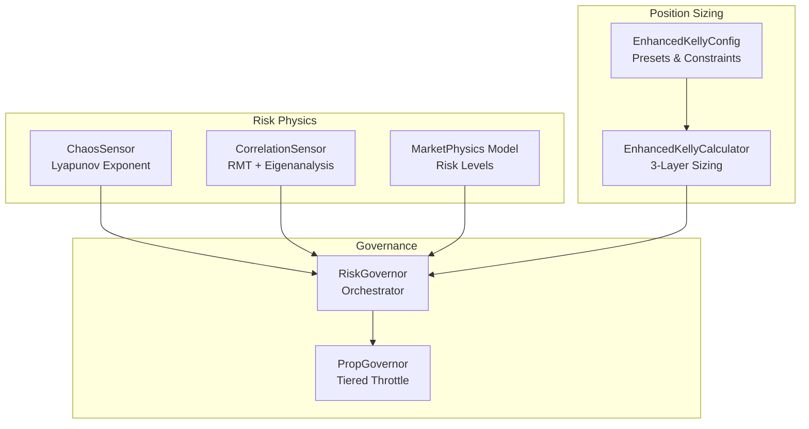
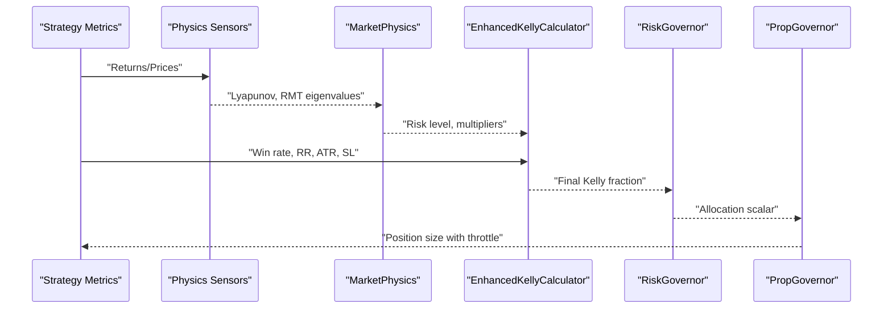
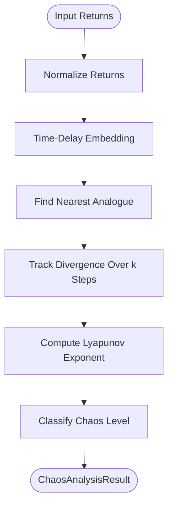
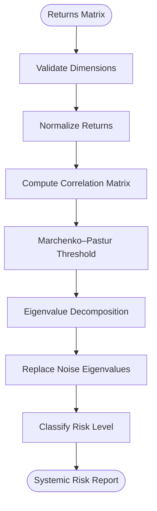
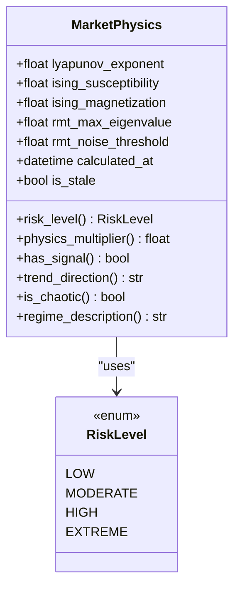
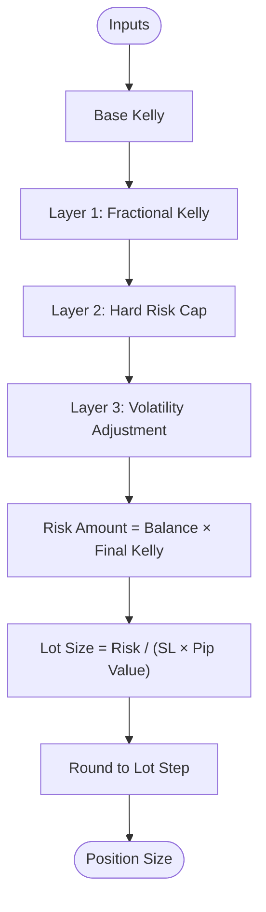
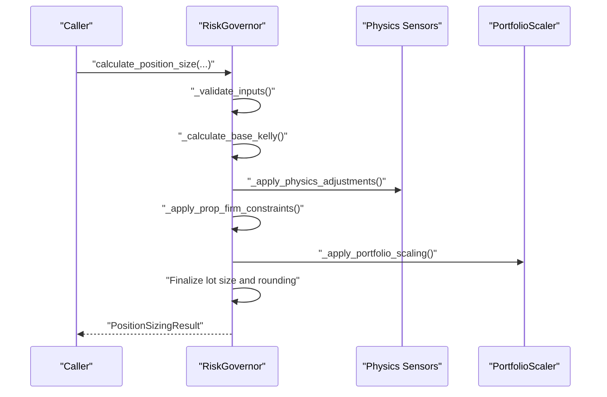
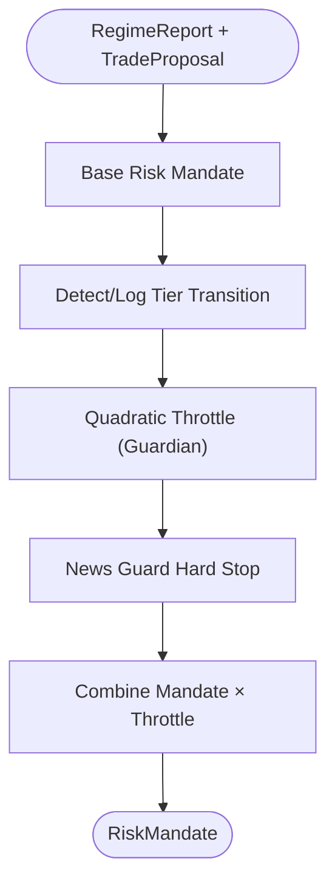
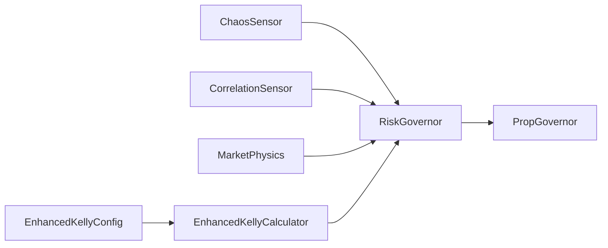

# Risk Management System

<cite>
**Referenced Files in This Document**
- [chaos_sensor.py](file://src/risk/physics/chaos_sensor.py)
- [correlation_sensor.py](file://src/risk/physics/correlation_sensor.py)
- [market_physics.py](file://src/risk/models/market_physics.py)
- [enhanced_kelly.py](file://src/position_sizing/enhanced_kelly.py)
- [kelly_config.py](file://src/position_sizing/kelly_config.py)
- [governor.py](file://src/risk/governor.py)
- [governor.py](file://src/router/prop/governor.py)
- [ECONOPHYSICS_INTEGRATION.md](file://docs/ECONOPHYSICS_INTEGRATION.md)
- [task_26_1_implementation_summary.md](file://docs/v8/task_26_1_implementation_summary.md)
- [test_chaos_sensor.py](file://tests/risk/physics/test_chaos_sensor.py)
- [test_correlation_sensor.py](file://tests/risk/physics/test_correlation_sensor.py)
- [test_enhanced_kelly.py](file://tests/position_sizing/test_enhanced_kelly.py)
- [test_prop_properties.py](file://tests/router/prop/test_prop_properties.py)
</cite>

## Table of Contents
1. [Introduction](#introduction)
2. [Project Structure](#project-structure)
3. [Core Components](#core-components)
4. [Architecture Overview](#architecture-overview)
5. [Detailed Component Analysis](#detailed-component-analysis)
6. [Dependency Analysis](#dependency-analysis)
7. [Performance Considerations](#performance-considerations)
8. [Troubleshooting Guide](#troubleshooting-guide)
9. [Conclusion](#conclusion)
10. [Appendices](#appendices)

## Introduction
This document describes the Risk Management System with a physics-aware approach integrating chaos theory and econophysics. It covers:
- Chaos theory integration via Lyapunov exponent analysis and phase space reconstruction for instability detection
- Random Matrix Theory (RMT) for systemic risk detection and correlation noise filtering
- The 3-layer Enhanced Kelly position sizing methodology: fractional Kelly, hard risk caps, and dynamic volatility adjustment
- The Governor system’s role in risk authorization and compliance enforcement
- Portfolio risk management, correlation analysis, and systemic risk assessment
- Mathematical foundations, implementation details, and practical examples
- Prop firm integration capabilities and survival quadratic throttling mechanisms

## Project Structure
The Risk Management System spans several modules:
- Physics sensors for chaos detection (Lyapunov), correlation analysis (RMT), and regime modeling
- Position sizing with Enhanced Kelly and configuration presets
- Risk Governor orchestrating physics inputs, constraints, and portfolio scaling
- Prop Governor extending base Governor with tier-aware throttling and survival logic
- Documentation and tests validating behavior and performance

**Diagram sources**
- [chaos_sensor.py](file://src/risk/physics/chaos_sensor.py#L31-L253)
- [correlation_sensor.py](file://src/risk/physics/correlation_sensor.py#L22-L285)
- [market_physics.py](file://src/risk/models/market_physics.py#L27-L247)
- [enhanced_kelly.py](file://src/position_sizing/enhanced_kelly.py#L128-L418)
- [kelly_config.py](file://src/position_sizing/kelly_config.py#L11-L116)
- [governor.py](file://src/risk/governor.py#L42-L447)
- [governor.py](file://src/router/prop/governor.py#L12-L249)

**Section sources**
- [chaos_sensor.py](file://src/risk/physics/chaos_sensor.py#L1-L253)
- [correlation_sensor.py](file://src/risk/physics/correlation_sensor.py#L1-L285)
- [market_physics.py](file://src/risk/models/market_physics.py#L1-L247)
- [enhanced_kelly.py](file://src/position_sizing/enhanced_kelly.py#L1-L418)
- [kelly_config.py](file://src/position_sizing/kelly_config.py#L1-L116)
- [governor.py](file://src/risk/governor.py#L1-L447)
- [governor.py](file://src/router/prop/governor.py#L1-L249)

## Core Components
- ChaosSensor: Computes Lyapunov exponent using phase space reconstruction and the method of analogues to quantify instability
- CorrelationSensor: Applies Random Matrix Theory to detect systemic risk via eigenvalue analysis and denoising
- MarketPhysics: Pydantic model aggregating physics indicators and deriving risk levels and multipliers
- EnhancedKellyCalculator: Implements 3-layer position sizing with fractional Kelly, hard risk caps, and volatility adjustments
- RiskGovernor: Orchestrates physics inputs, constraints, and portfolio scaling into a unified position sizing API
- PropGovernor: Extends governance with tier-aware quadratic throttling and hard stops for prop firm compliance

**Section sources**
- [chaos_sensor.py](file://src/risk/physics/chaos_sensor.py#L31-L253)
- [correlation_sensor.py](file://src/risk/physics/correlation_sensor.py#L22-L285)
- [market_physics.py](file://src/risk/models/market_physics.py#L27-L247)
- [enhanced_kelly.py](file://src/position_sizing/enhanced_kelly.py#L128-L418)
- [governor.py](file://src/risk/governor.py#L42-L447)
- [governor.py](file://src/router/prop/governor.py#L12-L249)

## Architecture Overview
The system integrates econophysics-derived signals into position sizing and compliance enforcement:
- Physics sensors produce chaos and correlation signals
- MarketPhysics consolidates signals into risk levels and multipliers
- Enhanced Kelly applies 3-layer protection and volatility adjustments
- RiskGovernor coordinates inputs, constraints, and portfolio scaling
- PropGovernor enforces tier-aware throttling and hard stops

**Diagram sources**
- [ECONOPHYSICS_INTEGRATION.md](file://docs/ECONOPHYSICS_INTEGRATION.md#L72-L155)
- [market_physics.py](file://src/risk/models/market_physics.py#L131-L177)
- [enhanced_kelly.py](file://src/position_sizing/enhanced_kelly.py#L190-L377)
- [governor.py](file://src/risk/governor.py#L105-L224)
- [governor.py](file://src/router/prop/governor.py#L37-L67)

## Detailed Component Analysis

### Chaos Theory Integration: Lyapunov Exponent and Phase Space Reconstruction
- Phase space reconstruction via time-delay embedding
- Method of analogues to locate nearest neighbors in reconstructed space
- Divergence tracking over k steps to compute Lyapunov exponent
- Chaos level classification for downstream risk adjustments

**Diagram sources**
- [chaos_sensor.py](file://src/risk/physics/chaos_sensor.py#L67-L241)

**Section sources**
- [chaos_sensor.py](file://src/risk/physics/chaos_sensor.py#L31-L253)
- [test_chaos_sensor.py](file://tests/risk/physics/test_chaos_sensor.py#L16-L39)

### Random Matrix Theory: Systemic Risk and Correlation Denoising
- Validates minimum dimensions and normalizes returns
- Builds correlation matrix with NaN handling and numerical stabilization
- Computes Marchenko–Pastur noise threshold
- Performs eigenvalue decomposition and denoises noise eigenvalues
- Classifies risk level and returns denoised matrix for portfolio use

**Diagram sources**
- [correlation_sensor.py](file://src/risk/physics/correlation_sensor.py#L57-L281)

**Section sources**
- [correlation_sensor.py](file://src/risk/physics/correlation_sensor.py#L22-L285)
- [test_correlation_sensor.py](file://tests/risk/physics/test_correlation_sensor.py#L150-L291)

### Market Physics Model: Risk Levels and Multipliers
- Aggregates Lyapunov exponent, Ising susceptibility and magnetization, and RMT eigenvalues
- Determines risk level categories and provides a position-size multiplier
- Offers trend direction inference and signal/noise assessment

**Diagram sources**
- [market_physics.py](file://src/risk/models/market_physics.py#L27-L247)

**Section sources**
- [market_physics.py](file://src/risk/models/market_physics.py#L19-L247)

### 3-Layer Enhanced Kelly Position Sizing
- Layer 1: Fractional Kelly (default 50%) to balance growth and drawdown
- Layer 2: Hard risk cap (default 2% per trade) to prevent over-leverage
- Layer 3: Dynamic volatility adjustment using ATR ratio and optional regime quality scalar
- Includes portfolio scaling and broker rounding to lot step

**Diagram sources**
- [enhanced_kelly.py](file://src/position_sizing/enhanced_kelly.py#L190-L377)
- [kelly_config.py](file://src/position_sizing/kelly_config.py#L11-L116)

**Section sources**
- [enhanced_kelly.py](file://src/position_sizing/enhanced_kelly.py#L128-L418)
- [kelly_config.py](file://src/position_sizing/kelly_config.py#L11-L116)
- [test_enhanced_kelly.py](file://tests/position_sizing/test_enhanced_kelly.py#L28-L52)

### Risk Governor Orchestration
- Validates inputs and computes base Kelly
- Applies physics-based multipliers from chaos, correlation, and Ising sensors
- Enforces prop firm constraints and portfolio scaling
- Rounds to broker lot step and logs calculation steps

**Diagram sources**
- [governor.py](file://src/risk/governor.py#L105-L224)

**Section sources**
- [governor.py](file://src/risk/governor.py#L42-L447)

### Prop Governor: Tier-Aware Throttling and Compliance
- Inherits base risk mandates and extends with:
  - Quadratic throttle based on distance to daily loss limit (survival curve)
  - News guard hard stop for prop rules
  - Tier detection and logging (growth/scaling/guardian)
- Applies tier-aware throttle and updates account risk mode

**Diagram sources**
- [governor.py](file://src/router/prop/governor.py#L37-L67)
- [task_26_1_implementation_summary.md](file://docs/v8/task_26_1_implementation_summary.md#L41-L138)

**Section sources**
- [governor.py](file://src/router/prop/governor.py#L12-L249)
- [task_26_1_implementation_summary.md](file://docs/v8/task_26_1_implementation_summary.md#L41-L138)
- [test_prop_properties.py](file://tests/router/prop/test_prop_properties.py#L1-L14)

## Dependency Analysis
- Physics sensors feed RiskGovernor with chaos and correlation signals
- MarketPhysics consolidates signals into risk levels and multipliers
- Enhanced KellyCalculator depends on EnhancedKellyConfig presets and validates inputs
- RiskGovernor coordinates Enhanced Kelly and portfolio scaling
- PropGovernor extends RiskGovernor with tier-aware throttling and database-backed tier transitions

**Diagram sources**
- [governor.py](file://src/risk/governor.py#L84-L90)
- [enhanced_kelly.py](file://src/position_sizing/enhanced_kelly.py#L166-L178)
- [governor.py](file://src/router/prop/governor.py#L19-L22)

**Section sources**
- [governor.py](file://src/risk/governor.py#L68-L104)
- [governor.py](file://src/router/prop/governor.py#L12-L36)

## Performance Considerations
- Physics sensors use caching and LRU caches to minimize recomputation
- CorrelationSensor performs eigenvalue decomposition efficiently and denoises matrices
- Enhanced Kelly computation is optimized with early exits for negative expectancy
- Prop Governor tiers are determined and logged with minimal database overhead

[No sources needed since this section provides general guidance]

## Troubleshooting Guide
Common issues and resolutions:
- Input validation failures: Ensure win rate, average win/loss, and ATR are positive and within valid ranges
- Insufficient data for chaos or correlation sensors: Provide adequate lookback points and asset counts
- Negative expectancy in Enhanced Kelly: System returns zero position; review strategy metrics
- Prop Governor tier transitions: Verify database connectivity and account risk_mode updates

**Section sources**
- [enhanced_kelly.py](file://src/position_sizing/enhanced_kelly.py#L255-L287)
- [governor.py](file://src/risk/governor.py#L225-L247)
- [governor.py](file://src/router/prop/governor.py#L124-L144)

## Conclusion
The Risk Management System blends econophysics with robust position sizing and governance:
- Chaos and correlation sensors detect instability and systemic risk
- MarketPhysics translates signals into interpretable risk levels and multipliers
- Enhanced Kelly applies layered protections and volatility-aware adjustments
- RiskGovernor orchestrates inputs and constraints; PropGovernor enforces compliance and survival logic across tiers

[No sources needed since this section summarizes without analyzing specific files]

## Appendices

### Mathematical Foundations
- Kelly Criterion: f* = (p(b+1) − 1)/b, balancing growth and ruin avoidance
- Fractional Kelly: reduces exposure for stability (default ~50%)
- Hard risk cap: limits per-trade risk (default ~2%)
- Volatility adjustment: scales by ATR ratio and optional regime quality scalar
- Quadratic throttle: Throttle = 1 − (loss/effective_limit)^2 in guardian tier

**Section sources**
- [enhanced_kelly.py](file://src/position_sizing/enhanced_kelly.py#L9-L26)
- [task_26_1_implementation_summary.md](file://docs/v8/task_26_1_implementation_summary.md#L41-L61)

### Practical Examples
- Chaos analysis: Use ChaosSensor to classify instability and derive a physics multiplier for reduced position sizing
- Correlation analysis: Use CorrelationSensor to detect systemic risk and denoise correlation matrices for portfolio allocation
- Enhanced Kelly: Call EnhancedKellyCalculator with strategy metrics and ATR data to compute position size with volatility adjustments
- Prop integration: PropGovernor applies tier-aware throttle and hard stops based on news events and account equity

**Section sources**
- [ECONOPHYSICS_INTEGRATION.md](file://docs/ECONOPHYSICS_INTEGRATION.md#L72-L155)
- [governor.py](file://src/risk/governor.py#L105-L224)
- [governor.py](file://src/router/prop/governor.py#L37-L67)