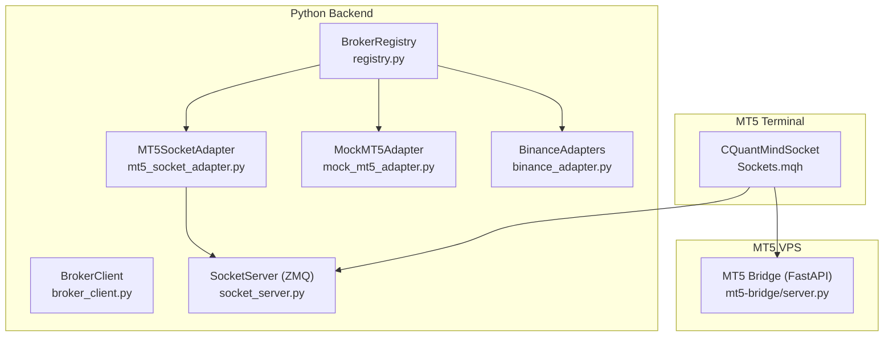
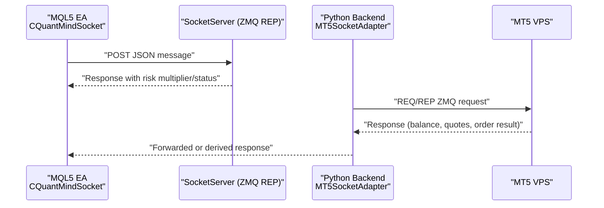
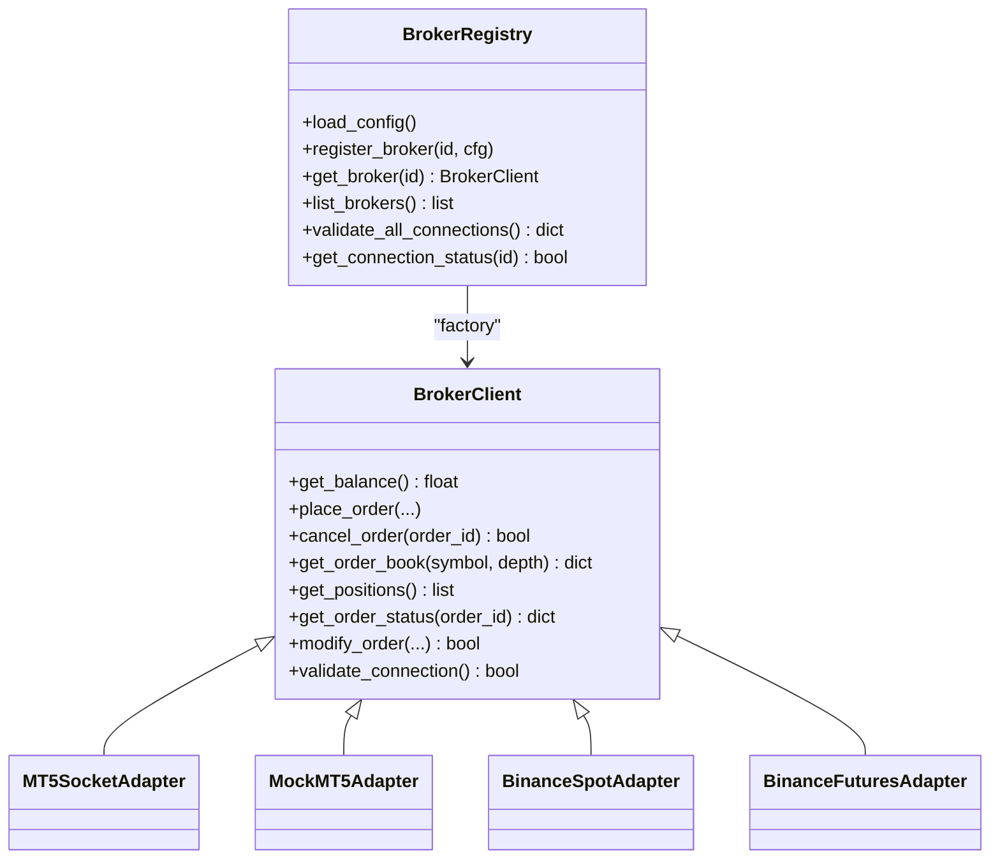
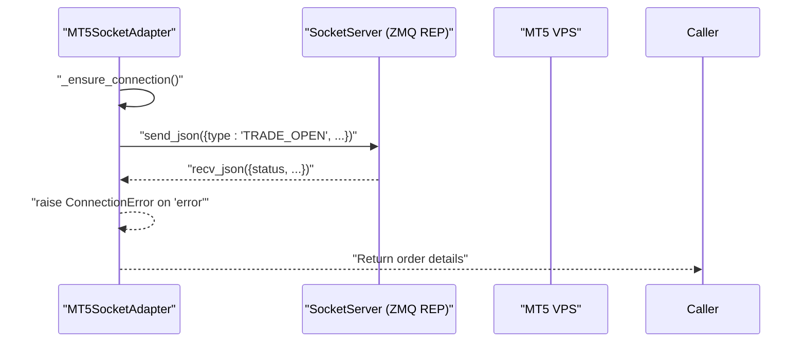
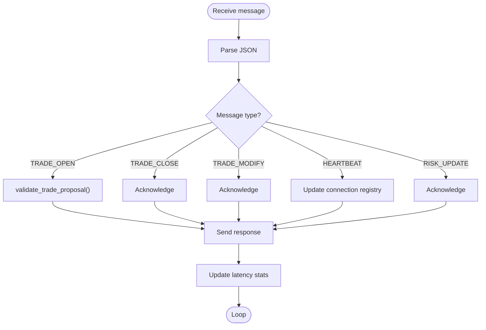
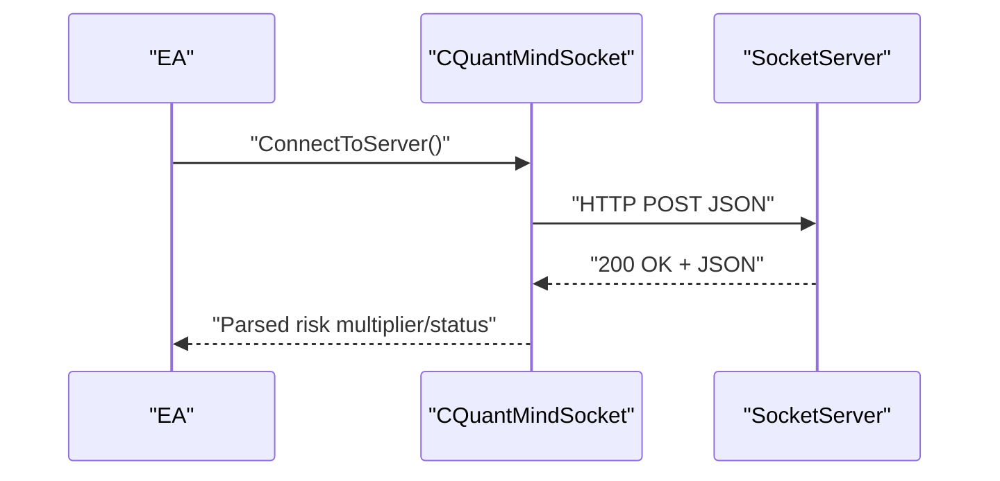
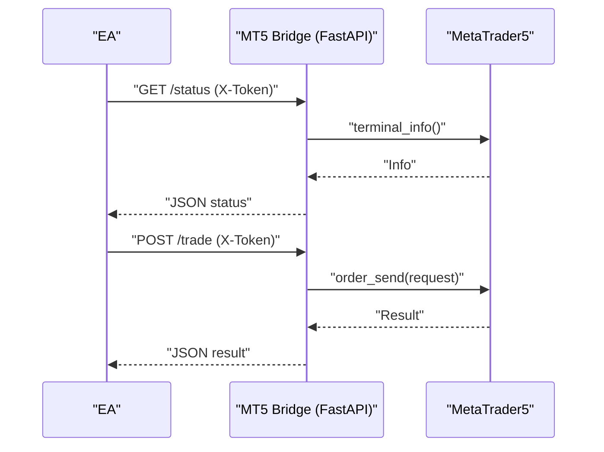
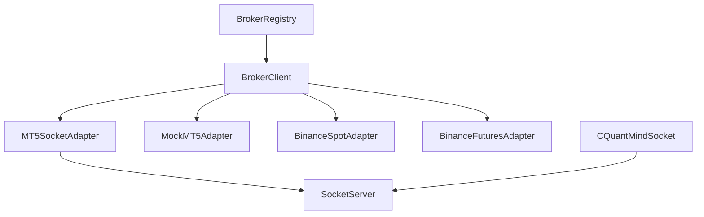

# Execution Interface

<cite>
**Referenced Files in This Document**
- [registry.py](file://src/data/brokers/registry.py)
- [broker_client.py](file://src/integrations/crypto/broker_client.py)
- [mt5_socket_adapter.py](file://src/data/brokers/mt5_socket_adapter.py)
- [mock_mt5_adapter.py](file://src/data/brokers/mock_mt5_adapter.py)
- [binance_adapter.py](file://src/data/brokers/binance_adapter.py)
- [brokers.yaml](file://config/brokers.yaml)
- [socket_server.py](file://src/router/socket_server.py)
- [Sockets.mqh](file://src/mql5/Include/QuantMind/Utils/Sockets.mqh)
- [server.py](file://mt5-bridge/server.py)
- [test_socket_vs_rest_latency.py](file://tests/benchmarks/test_socket_vs_rest_latency.py)
- [test_socket_load.py](file://tests/load/test_socket_load.py)
</cite>

## Table of Contents
1. [Introduction](#introduction)
2. [Project Structure](#project-structure)
3. [Core Components](#core-components)
4. [Architecture Overview](#architecture-overview)
5. [Detailed Component Analysis](#detailed-component-analysis)
6. [Dependency Analysis](#dependency-analysis)
7. [Performance Considerations](#performance-considerations)
8. [Troubleshooting Guide](#troubleshooting-guide)
9. [Conclusion](#conclusion)
10. [Appendices](#appendices)

## Introduction
This document describes the Execution Interface system responsible for unified broker connectivity and sub-5ms execution with MetaTrader 5 terminals. It covers:
- The ZeroMQ-based socket bridge enabling ultra-low-latency communication between Python backend and MT5 on a Windows VPS
- The broker registry that supports MT5 adapters (mock and socket) and crypto exchanges (Binance Spot/Futures)
- Socket communication protocols, message serialization, and real-time event streaming
- Latency optimization techniques, connection management, and error handling
- Integration patterns with the broader trading infrastructure and performance monitoring

## Project Structure
The Execution Interface spans several modules:
- Broker abstraction and registry for unified adapter management
- MT5 socket adapter for VPS-based execution
- Mock MT5 adapter for development/testing
- Binance adapters for crypto trading
- Socket server for HFT event-driven messaging
- MQL5 socket client for MT5 terminal integration
- MT5 bridge service for REST-to-ZMQ interoperability

**Diagram sources**
- [registry.py](file://src/data/brokers/registry.py#L22-L356)
- [broker_client.py](file://src/integrations/crypto/broker_client.py#L14-L248)
- [mt5_socket_adapter.py](file://src/data/brokers/mt5_socket_adapter.py#L29-L397)
- [mock_mt5_adapter.py](file://src/data/brokers/mock_mt5_adapter.py#L21-L354)
- [binance_adapter.py](file://src/data/brokers/binance_adapter.py#L20-L236)
- [socket_server.py](file://src/router/socket_server.py#L37-L435)
- [Sockets.mqh](file://src/mql5/Include/QuantMind/Utils/Sockets.mqh#L427-L619)
- [server.py](file://mt5-bridge/server.py#L1-L96)

**Section sources**
- [registry.py](file://src/data/brokers/registry.py#L1-L356)
- [broker_client.py](file://src/integrations/crypto/broker_client.py#L1-L248)
- [mt5_socket_adapter.py](file://src/data/brokers/mt5_socket_adapter.py#L1-L397)
- [mock_mt5_adapter.py](file://src/data/brokers/mock_mt5_adapter.py#L1-L354)
- [binance_adapter.py](file://src/data/brokers/binance_adapter.py#L1-L236)
- [socket_server.py](file://src/router/socket_server.py#L1-L435)
- [Sockets.mqh](file://src/mql5/Include/QuantMind/Utils/Sockets.mqh#L420-L619)
- [server.py](file://mt5-bridge/server.py#L1-L96)

## Core Components
- BrokerClient: Abstract interface defining the unified adapter contract for balances, orders, positions, order books, and connection validation.
- BrokerRegistry: Factory and orchestrator for broker adapters, YAML configuration loading, dynamic adapter registration, connection pooling, and status caching.
- MT5SocketAdapter: Asynchronous ZMQ REQ/REP client communicating with a socket server on the MT5 VPS for sub-5ms execution.
- MockMT5Adapter: Development/testing adapter simulating MT5 behavior without external dependencies.
- BinanceAdapters: Spot and Futures adapters wrapping a shared connector to implement BrokerClient.
- SocketServer: ZMQ REP server handling HFT events (trade open/close/modify, heartbeat, risk update) with persistent connections and latency metrics.
- CQuantMindSocket (MQL5): MT5-side client that builds and posts JSON messages to the socket server.
- MT5 Bridge (FastAPI): REST service for MT5 terminal integration (used in some deployment variants).

**Section sources**
- [broker_client.py](file://src/integrations/crypto/broker_client.py#L14-L248)
- [registry.py](file://src/data/brokers/registry.py#L22-L356)
- [mt5_socket_adapter.py](file://src/data/brokers/mt5_socket_adapter.py#L29-L397)
- [mock_mt5_adapter.py](file://src/data/brokers/mock_mt5_adapter.py#L21-L354)
- [binance_adapter.py](file://src/data/brokers/binance_adapter.py#L20-L236)
- [socket_server.py](file://src/router/socket_server.py#L37-L435)
- [Sockets.mqh](file://src/mql5/Include/QuantMind/Utils/Sockets.mqh#L427-L619)
- [server.py](file://mt5-bridge/server.py#L1-L96)

## Architecture Overview
The Execution Interface integrates three primary paths:
- Python backend to MT5 via ZMQ socket bridge (sub-5ms)
- Python backend to MT5 via REST bridge (FastAPI)
- Python backend to crypto exchanges via Binance adapters

**Diagram sources**
- [Sockets.mqh](file://src/mql5/Include/QuantMind/Utils/Sockets.mqh#L509-L619)
- [socket_server.py](file://src/router/socket_server.py#L150-L185)
- [mt5_socket_adapter.py](file://src/data/brokers/mt5_socket_adapter.py#L103-L147)

## Detailed Component Analysis

### Broker Registry and Adapter Management
The registry manages multiple broker adapters behind a single interface. It:
- Loads YAML configuration with environment variable substitution
- Registers adapters dynamically (MockMT5, MT5Socket, Binance Spot/Futures)
- Provides lazy-loading and connection pooling
- Validates connections and caches statuses

**Diagram sources**
- [broker_client.py](file://src/integrations/crypto/broker_client.py#L14-L248)
- [registry.py](file://src/data/brokers/registry.py#L22-L356)
- [mt5_socket_adapter.py](file://src/data/brokers/mt5_socket_adapter.py#L29-L397)
- [mock_mt5_adapter.py](file://src/data/brokers/mock_mt5_adapter.py#L21-L354)
- [binance_adapter.py](file://src/data/brokers/binance_adapter.py#L20-L236)

**Section sources**
- [registry.py](file://src/data/brokers/registry.py#L22-L356)
- [broker_client.py](file://src/integrations/crypto/broker_client.py#L14-L248)
- [brokers.yaml](file://config/brokers.yaml#L1-L116)

### MT5 Socket Adapter (ZeroMQ Bridge)
The MT5SocketAdapter implements BrokerClient and communicates with a ZMQ socket server on the MT5 VPS:
- Asynchronous REQ/REP pattern with JSON serialization
- Automatic connection management and reconnection
- Request/response lifecycle with timeouts and error propagation
- Unified API for balance, quotes, positions, order placement/cancellation/modification

**Diagram sources**
- [mt5_socket_adapter.py](file://src/data/brokers/mt5_socket_adapter.py#L73-L147)
- [socket_server.py](file://src/router/socket_server.py#L150-L185)

**Section sources**
- [mt5_socket_adapter.py](file://src/data/brokers/mt5_socket_adapter.py#L29-L397)
- [socket_server.py](file://src/router/socket_server.py#L66-L111)

### Socket Server (HFT Event-Driven Messaging)
The SocketServer provides sub-5ms latency for trade events:
- ZMQ REP socket with persistent connections
- Message types: trade_open, trade_close, trade_modify, heartbeat, risk_update
- Latency tracking and warnings for messages exceeding 5ms
- Asynchronous processing with non-blocking loops
- Connection registry keyed by EA name and magic number

**Diagram sources**
- [socket_server.py](file://src/router/socket_server.py#L150-L325)

**Section sources**
- [socket_server.py](file://src/router/socket_server.py#L37-L435)

### MQL5 Socket Client (MT5 Terminal Integration)
The MQL5 client encapsulates communication with the socket server:
- Persistent connection attempts with reconnect limits
- JSON message construction for trade events and heartbeats
- Response parsing for risk multiplier and status
- Integration with EA execution logic

**Diagram sources**
- [Sockets.mqh](file://src/mql5/Include/QuantMind/Utils/Sockets.mqh#L477-L619)

**Section sources**
- [Sockets.mqh](file://src/mql5/Include/QuantMind/Utils/Sockets.mqh#L427-L619)

### MT5 Bridge (REST Variant)
An alternative path uses a FastAPI bridge exposing REST endpoints for MT5 operations:
- Token-authenticated endpoints for status, account info, and trade execution
- Initialization and error handling for MT5 terminal
- Example deployment binding to all interfaces

**Diagram sources**
- [server.py](file://mt5-bridge/server.py#L29-L96)

**Section sources**
- [server.py](file://mt5-bridge/server.py#L1-L96)

### Broker Configuration and Deployment
The YAML configuration defines:
- Broker types: mt5_mock, mt5_socket, binance_spot, binance_futures
- Environment variable substitution for sensitive fields
- Enabled flag for controlled activation
- Migration path from mock to VPS-based socket adapter

**Section sources**
- [brokers.yaml](file://config/brokers.yaml#L1-L116)

## Dependency Analysis
The Execution Interface exhibits loose coupling around the BrokerClient abstraction:
- BrokerRegistry depends on BrokerClient implementations
- MT5SocketAdapter depends on ZMQ and BrokerClient
- Binance adapters depend on a shared connector and BrokerClient
- SocketServer depends on message types and internal validation logic
- MQL5 client depends on socket server endpoints

**Diagram sources**
- [broker_client.py](file://src/integrations/crypto/broker_client.py#L14-L248)
- [registry.py](file://src/data/brokers/registry.py#L63-L91)
- [mt5_socket_adapter.py](file://src/data/brokers/mt5_socket_adapter.py#L29-L66)
- [binance_adapter.py](file://src/data/brokers/binance_adapter.py#L13-L17)
- [socket_server.py](file://src/router/socket_server.py#L37-L64)
- [Sockets.mqh](file://src/mql5/Include/QuantMind/Utils/Sockets.mqh#L427-L450)

**Section sources**
- [registry.py](file://src/data/brokers/registry.py#L63-L91)
- [broker_client.py](file://src/integrations/crypto/broker_client.py#L14-L248)

## Performance Considerations
- Sub-5ms latency targets validated by benchmarks:
  - Socket latency benchmark confirms median <5ms and P95 <10ms across message types
  - Comparison against V7 REST baseline (~45ms) demonstrates >9x improvement
  - Load tests sustain high throughput with minimal latency under concurrent connections
- Optimizations:
  - ZMQ REQ/REP with persistent connections and non-blocking loops
  - Minimal JSON serialization/deserialization overhead
  - Asynchronous processing with asyncio and non-blocking waits
  - Connection pooling at the registry level for multi-broker deployments
- Monitoring:
  - SocketServer tracks average latency and warns on high-latency messages
  - Statistics endpoint exposes message counts and connection registry

**Section sources**
- [test_socket_vs_rest_latency.py](file://tests/benchmarks/test_socket_vs_rest_latency.py#L40-L339)
- [test_socket_load.py](file://tests/load/test_socket_load.py#L18-L379)
- [socket_server.py](file://src/router/socket_server.py#L89-L121)

## Troubleshooting Guide
Common issues and remedies:
- Connection failures:
  - MT5SocketAdapter raises ConnectionError on socket timeouts or communication errors; verify VPS reachability and port configuration
  - SocketServer logs fatal errors and stops gracefully; check bind address and firewall rules
- Message processing errors:
  - Unknown or malformed message types return error responses; ensure message.type matches supported enums
  - Missing fields cause validation failures; confirm JSON payload completeness
- Adapter validation:
  - BrokerRegistry caches connection status; use validate_all_connections to refresh and diagnose
  - MockMT5Adapter always validates; real adapters propagate underlying errors
- Performance degradation:
  - Monitor high-latency warnings in SocketServer logs; investigate bottlenecks in message handling or external dependencies

**Section sources**
- [mt5_socket_adapter.py](file://src/data/brokers/mt5_socket_adapter.py#L138-L147)
- [socket_server.py](file://src/router/socket_server.py#L105-L109)
- [registry.py](file://src/data/brokers/registry.py#L274-L298)

## Conclusion
The Execution Interface delivers a flexible, high-performance foundation for trading execution:
- Unified broker abstraction via BrokerClient and BrokerRegistry
- Sub-5ms ZMQ-based socket bridge for MT5 VPS execution
- Robust adapter ecosystem supporting MT5 (mock/socket) and Binance (spot/futures)
- Comprehensive performance monitoring and load-tested scalability
- Clear migration path from development to production environments

## Appendices

### Socket Communication Patterns and Message Formats
- Message types handled by SocketServer:
  - trade_open: approval and risk multiplier
  - trade_close: acknowledgment
  - trade_modify: acknowledgment
  - heartbeat: connection registry update and risk multiplier retrieval
  - risk_update: acknowledgment
- MT5SocketAdapter requests:
  - GET_BALANCE, GET_QUOTES, GET_POSITIONS, TRADE_OPEN, CANCEL_ORDER, TRADE_MODIFY, GET_ORDER_STATUS
- MQL5 client messages:
  - trade_open, trade_close, trade_modify, heartbeat

**Section sources**
- [socket_server.py](file://src/router/socket_server.py#L28-L35)
- [mt5_socket_adapter.py](file://src/data/brokers/mt5_socket_adapter.py#L148-L321)
- [Sockets.mqh](file://src/mql5/Include/QuantMind/Utils/Sockets.mqh#L509-L619)