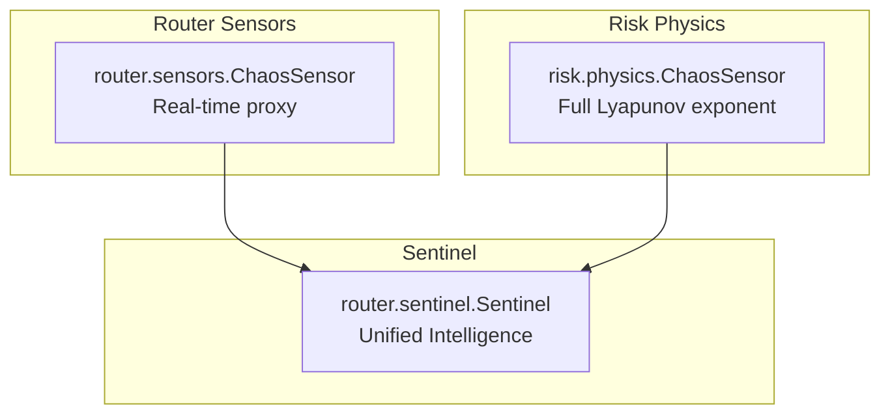
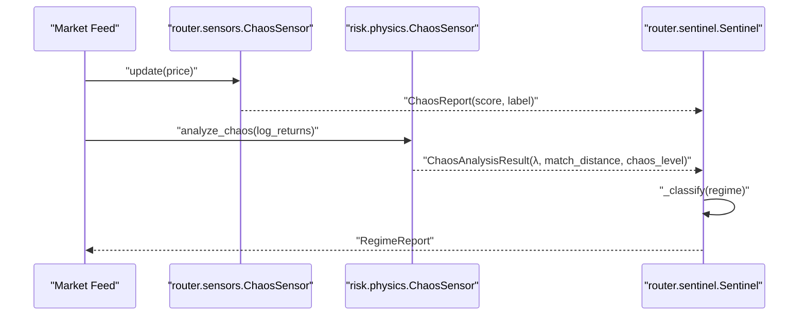
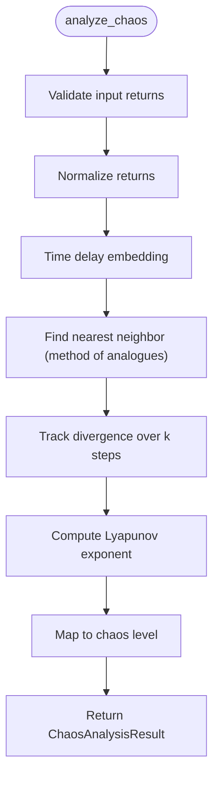
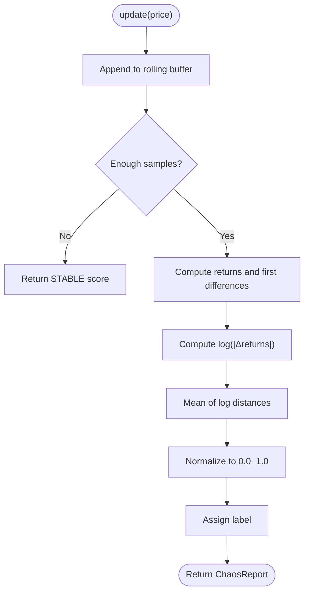
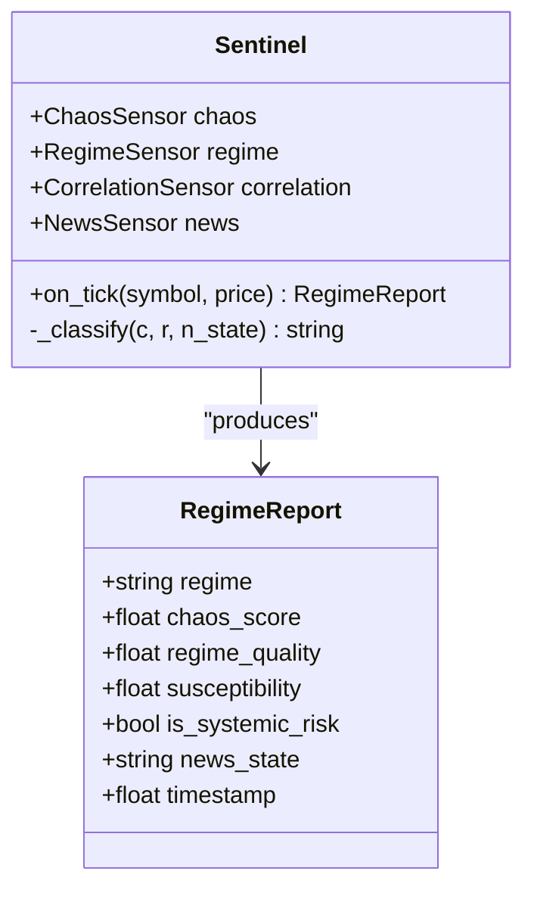
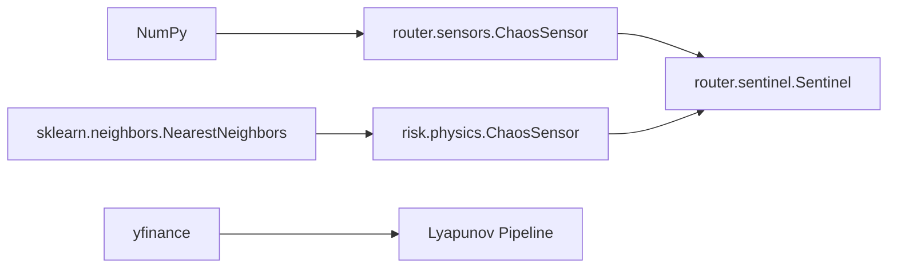

# Chaos Sensor

<cite>
**Referenced Files in This Document**
- [chaos_sensor.py](file://src/risk/physics/chaos_sensor.py)
- [chaos.py](file://src/router/sensors/chaos.py)
- [sentinel.py](file://src/router/sentinel.py)
- [test_chaos_sensor.py](file://tests/risk/physics/test_chaos_sensor.py)
- [Lyapunov Pipeline.py](file://quant-traderr-lab/Lyapunov Exponent/Lyapunov Pipeline.py)
- [chaos_theory_in_trading__part_1___introduction__application_in_financial_markets_and_lyapunov_expone.md](file://data/scraped_articles/trading_systems/chaos_theory_in_trading__part_1___introduction__application_in_financial_markets_and_lyapunov_expone.md)
- [chaos_theory_in_trading__part_2___diving_deeper.md](file://data/scraped_articles/trading_systems/chaos_theory_in_trading__part_2___diving_deeper.md)
</cite>

## Table of Contents
1. [Introduction](#introduction)
2. [Project Structure](#project-structure)
3. [Core Components](#core-components)
4. [Architecture Overview](#architecture-overview)
5. [Detailed Component Analysis](#detailed-component-analysis)
6. [Dependency Analysis](#dependency-analysis)
7. [Performance Considerations](#performance-considerations)
8. [Troubleshooting Guide](#troubleshooting-guide)
9. [Conclusion](#conclusion)
10. [Appendices](#appendices)

## Introduction
This document describes the Chaos Sensor that detects market instability using chaos theory principles. It explains the Lyapunov exponent calculation methodology for measuring sensitive dependence on initial conditions, documents phase space reconstruction algorithms, and details the scoring mechanism that converts chaos measurements into a 0.0–1.0 chaos_score. The document also covers the mathematical foundations of chaos theory in financial markets, embedding dimension and time delay estimation, and provides implementation examples for price series analysis, chaos score computation, and threshold-based regime classification. Finally, it addresses performance optimization for real-time processing and integration with the broader Sentinel system.

## Project Structure
The Chaos Sensor exists in two complementary forms:
- A research-grade implementation in the physics package that computes a full Lyapunov exponent using phase space reconstruction and the method of analogues.
- A lightweight, real-time proxy in the router sensors that estimates chaos using a simplified proxy score derived from local divergence in price differences.

Both implementations feed into the Sentinel intelligence layer, which aggregates sensor outputs into a unified regime classification.

**Diagram sources**
- [chaos.py](file://src/router/sensors/chaos.py#L1-L57)
- [chaos_sensor.py](file://src/risk/physics/chaos_sensor.py#L1-L253)
- [sentinel.py](file://src/router/sentinel.py#L1-L85)

**Section sources**
- [chaos_sensor.py](file://src/risk/physics/chaos_sensor.py#L1-L253)
- [chaos.py](file://src/router/sensors/chaos.py#L1-L57)
- [sentinel.py](file://src/router/sentinel.py#L1-L85)

## Core Components
- Research-grade ChaosSensor (Lyapunov exponent)
  - Implements phase space reconstruction via time delay embedding.
  - Applies the method of analogues to locate nearest neighbors in the embedded space.
  - Tracks divergence over k steps to compute the Lyapunov exponent.
  - Provides a structured analysis result with chaos level classification.
- Lightweight Real-time ChaosSensor (proxy score)
  - Maintains a rolling window of prices.
  - Computes a proxy Lyapunov-like score from local divergence in returns.
  - Normalizes the proxy score to a 0.0–1.0 chaos_score and assigns a label.

Integration with Sentinel
- The Sentinel consumes both sensors and produces a unified RegimeReport with chaos_score and regime_quality.

**Section sources**
- [chaos_sensor.py](file://src/risk/physics/chaos_sensor.py#L31-L253)
- [chaos.py](file://src/router/sensors/chaos.py#L14-L57)
- [sentinel.py](file://src/router/sentinel.py#L17-L85)

## Architecture Overview
The Chaos Sensor participates in a multi-sensor intelligence pipeline. The router-level proxy provides low-latency updates per tick, while the physics-level sensor delivers a more precise Lyapunov-based assessment for batch or periodic analysis.

**Diagram sources**
- [chaos.py](file://src/router/sensors/chaos.py#L19-L57)
- [chaos_sensor.py](file://src/risk/physics/chaos_sensor.py#L195-L241)
- [sentinel.py](file://src/router/sentinel.py#L40-L85)

## Detailed Component Analysis

### Research-Grade ChaosSensor (Lyapunov Exponent)
- Phase space reconstruction
  - Time delay embedding builds m-dimensional vectors from normalized returns using a specified embedding dimension and time delay.
  - The implementation validates that the series length supports the chosen parameters.
- Method of analogues
  - Defines a “subject” trajectory from recent data and a “library” of historical vectors, excluding a safety buffer to avoid trivial matches.
  - Uses a nearest neighbor search to find the closest historical trajectory (analogue).
- Lyapunov exponent calculation
  - Tracks the logarithmic divergence between current and matched trajectories over k steps.
  - Averages the log-divergence across steps to estimate the largest Lyapunov exponent.
- Chaos level classification
  - Maps the Lyapunov exponent to qualitative levels (stable/moderate/chaotic) based on thresholds.

**Diagram sources**
- [chaos_sensor.py](file://src/risk/physics/chaos_sensor.py#L67-L176)
- [chaos_sensor.py](file://src/risk/physics/chaos_sensor.py#L195-L241)

**Section sources**
- [chaos_sensor.py](file://src/risk/physics/chaos_sensor.py#L31-L253)
- [test_chaos_sensor.py](file://tests/risk/physics/test_chaos_sensor.py#L16-L140)

### Lightweight Real-Time ChaosSensor (Proxy Score)
- Rolling window
  - Maintains a bounded buffer of recent prices.
- Proxy Lyapunov exponent
  - Computes returns and their first differences to estimate local divergence.
  - Uses the mean of log(|Δreturns|) as a proxy for the largest Lyapunov exponent.
- Scoring and labeling
  - Normalizes the proxy exponent to a 0.0–1.0 chaos_score using an empirical mapping.
  - Assigns labels (STABLE, NOISY, CHAOTIC) based on thresholds.

**Diagram sources**
- [chaos.py](file://src/router/sensors/chaos.py#L19-L57)

**Section sources**
- [chaos.py](file://src/router/sensors/chaos.py#L14-L57)

### Integration with Sentinel
- The Sentinel composes multiple sensors and derives a unified regime classification.
- The chaos_score from the router-level sensor is used directly, while the physics-level sensor’s result informs deeper analysis.
- Regime quality is computed as the complement of the chaos score.

**Diagram sources**
- [sentinel.py](file://src/router/sentinel.py#L17-L85)

**Section sources**
- [sentinel.py](file://src/router/sentinel.py#L27-L85)

## Dependency Analysis
- Internal dependencies
  - The router-level ChaosSensor depends on NumPy for numerical operations.
  - The physics-level ChaosSensor depends on NumPy and scikit-learn’s NearestNeighbors for efficient nearest neighbor search.
- External dependencies
  - The research pipeline example imports yfinance for market data acquisition.
- Coupling and cohesion
  - Both sensor implementations are cohesive around their respective chaos measurement goals.
  - The Sentinel integrates sensors with minimal coupling, passing simple reports.

**Diagram sources**
- [chaos.py](file://src/router/sensors/chaos.py#L6-L7)
- [chaos_sensor.py](file://src/risk/physics/chaos_sensor.py#L14-L16)
- [Lyapunov Pipeline.py](file://quant-traderr-lab/Lyapunov Exponent/Lyapunov Pipeline.py#L37-L39)

**Section sources**
- [chaos.py](file://src/router/sensors/chaos.py#L6-L7)
- [chaos_sensor.py](file://src/risk/physics/chaos_sensor.py#L14-L16)
- [Lyapunov Pipeline.py](file://quant-traderr-lab/Lyapunov Exponent/Lyapunov Pipeline.py#L23-L24)

## Performance Considerations
- Real-time proxy
  - The lightweight sensor operates on a rolling window and uses vectorized NumPy operations to compute differences and logs, enabling per-tick updates.
  - Threshold checks and normalization are constant-time operations.
- Physics-level sensor
  - Nearest neighbor search uses a KD-tree for efficiency; ensure the embedding dimension and time delay are tuned to reduce search space.
  - The test suite enforces a performance target for analysis completion under a specified time budget.
- Recommendations
  - Tune embedding_dimension and time_delay to balance sensitivity and computational cost.
  - Consider downsampling or caching normalized series when processing high-frequency feeds.
  - Use incremental updates and avoid recomputing entire windows when possible.

**Section sources**
- [test_chaos_sensor.py](file://tests/risk/physics/test_chaos_sensor.py#L118-L128)
- [chaos_sensor.py](file://src/risk/physics/chaos_sensor.py#L98-L141)

## Troubleshooting Guide
- Input validation errors
  - Ensure the input is a 1D NumPy array with sufficient length for the chosen parameters.
  - The physics-level sensor raises explicit errors when the series is too short for embedding or when insufficient historical data is available for analogues.
- Parameter tuning
  - If the embedding dimension or time delay is too large relative to the series length, embedding will fail.
  - If the lookback window or safety buffer exceeds available history, analogues cannot be found.
- Proxy score saturation
  - The proxy score is clipped to [0.0, 1.0]; extreme negative values are mapped to near-zero scores.
  - Adjust normalization bounds if observing unexpected saturation for specific instruments.

**Section sources**
- [chaos_sensor.py](file://src/risk/physics/chaos_sensor.py#L83-L88)
- [chaos_sensor.py](file://src/risk/physics/chaos_sensor.py#L112-L128)
- [chaos.py](file://src/router/sensors/chaos.py#L47-L50)

## Conclusion
The Chaos Sensor provides dual pathways for measuring market instability:
- A computationally efficient proxy for real-time operation, producing a 0.0–1.0 chaos_score suitable for immediate regime classification.
- A rigorous Lyapunov exponent implementation grounded in chaos theory, enabling deeper analysis of sensitive dependence and phase space structure.

Integrated into the Sentinel, the Chaos Sensor contributes to a unified view of market regimes, combining chaos detection with other risk signals for robust decision-making.

## Appendices

### Mathematical Foundations and Practical Methods
- Chaos theory in financial markets
  - Chaotic systems exhibit non-linearity, sensitivity to initial conditions, self-organization, fractal structure, limited predictability, strange attractors, and regime transitions.
- Lyapunov exponent interpretation
  - Positive exponent indicates chaos and rapid divergence; negative exponent indicates stability.
- Phase space reconstruction
  - Takens’ theorem supports reconstruction from a single observable using time-delay coordinates.
- Parameter estimation
  - Time delay estimation methods include autocorrelation and mutual information.
  - Embedding dimension estimation commonly uses the false nearest neighbors algorithm.

**Section sources**
- [chaos_theory_in_trading__part_1___introduction__application_in_financial_markets_and_lyapunov_expone.md](file://data/scraped_articles/trading_systems/chaos_theory_in_trading__part_1___introduction__application_in_financial_markets_and_lyapunov_expone.md#L14-L86)
- [chaos_theory_in_trading__part_2___diving_deeper.md](file://data/scraped_articles/trading_systems/chaos_theory_in_trading__part_2___diving_deeper.md#L351-L650)

### Implementation Examples and Usage Patterns
- Price series analysis
  - Prepare normalized returns for the physics-level sensor; ensure sufficient length for embedding and analogues.
  - For the proxy sensor, append new prices and rely on the rolling window to maintain steady-state analysis.
- Chaos score computation
  - The proxy sensor normalizes the proxy Lyapunov-like score to 0.0–1.0 and applies simple thresholds for labels.
  - The physics-level sensor returns a structured result including the Lyapunov exponent and chaos level.
- Threshold-based regime classification
  - The Sentinel maps chaos_score and other signals to regime categories such as HIGH_CHAOS, TREND_STABLE, RANGE_STABLE, BREAKOUT_PRIME, NEWS_EVENT, and UNCERTAIN.

**Section sources**
- [chaos_sensor.py](file://src/risk/physics/chaos_sensor.py#L195-L241)
- [chaos.py](file://src/router/sensors/chaos.py#L26-L57)
- [sentinel.py](file://src/router/sentinel.py#L65-L85)

### Reference: Research Pipeline Example
- The research pipeline demonstrates end-to-end phase space reconstruction, nearest neighbor search, and reporting of analogous historical periods.
- It includes data fetching, normalization, embedding, and console-based reporting.

**Section sources**
- [Lyapunov Pipeline.py](file://quant-traderr-lab/Lyapunov Exponent/Lyapunov Pipeline.py#L67-L237)