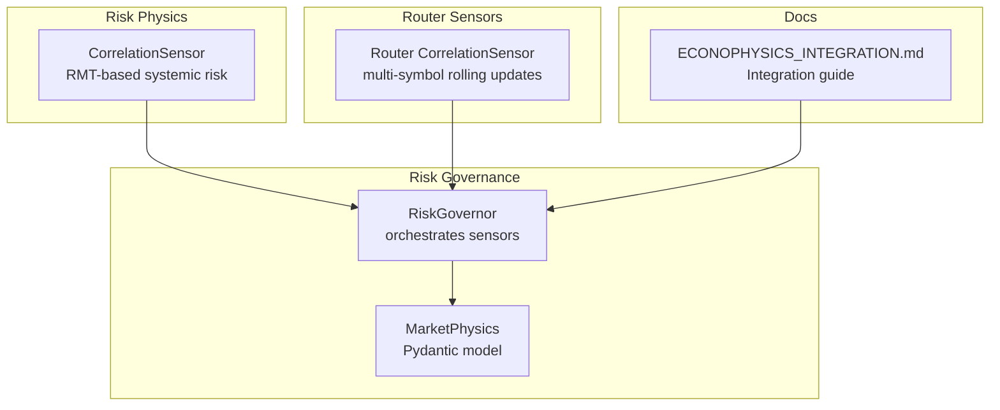
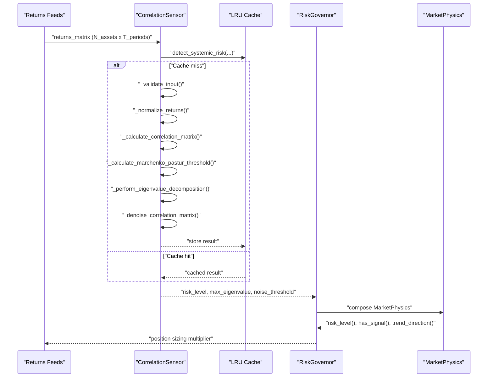
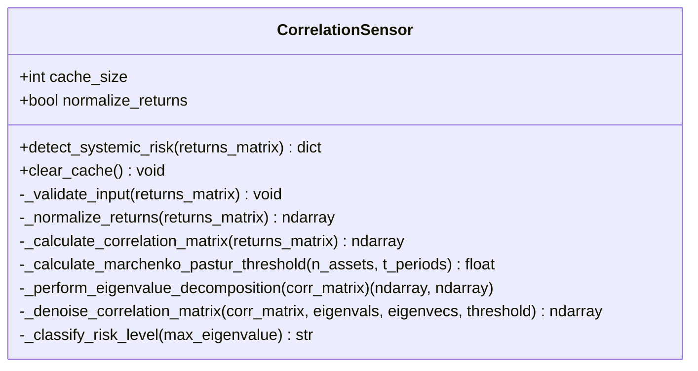
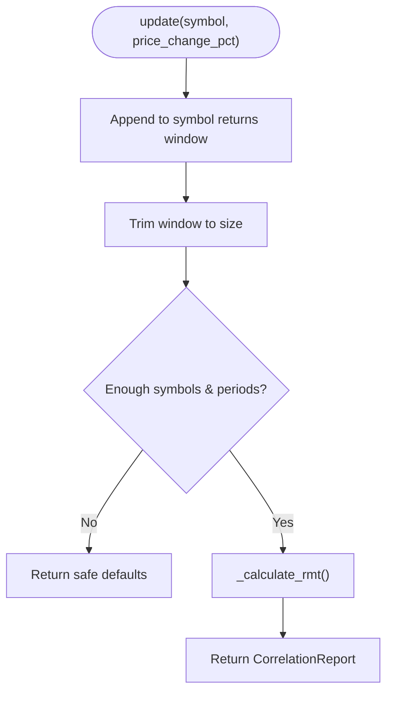
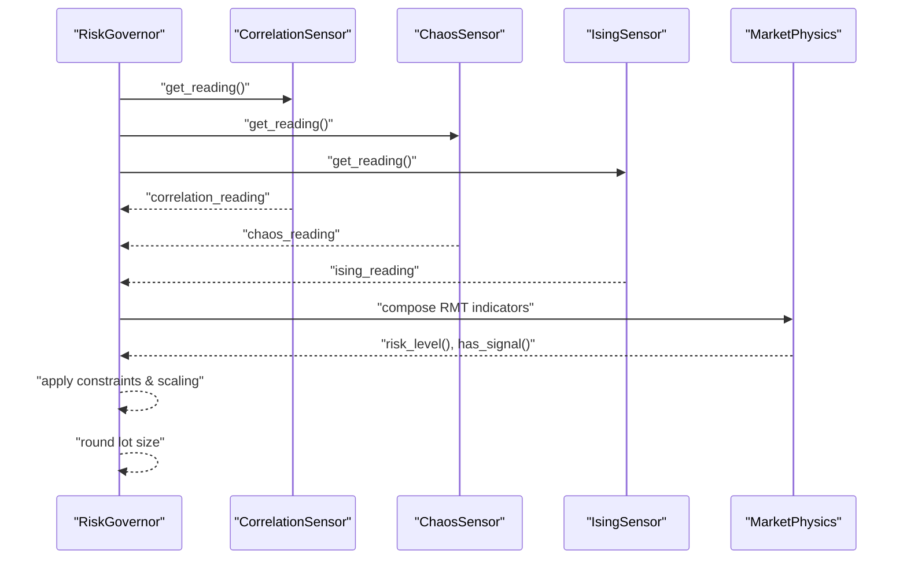
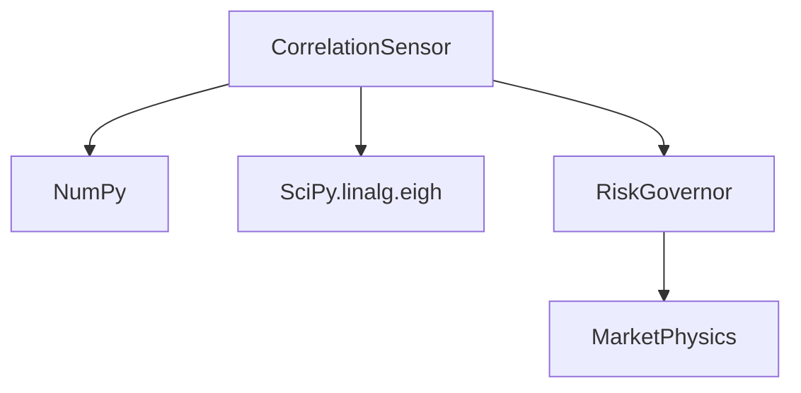

# Correlation Sensor

<cite>
**Referenced Files in This Document**
- [correlation_sensor.py](file://src/risk/physics/correlation_sensor.py)
- [test_correlation_sensor.py](file://tests/risk/physics/test_correlation_sensor.py)
- [test_physics_sensors.py](file://tests/risk/physics/test_physics_sensors.py)
- [market_physics.py](file://src/risk/models/market_physics.py)
- [governor.py](file://src/risk/governor.py)
- [correlation.py](file://src/router/sensors/correlation.py)
- [ECONOPHYSICS_INTEGRATION.md](file://docs/ECONOPHYSICS_INTEGRATION.md)
</cite>

## Table of Contents
1. [Introduction](#introduction)
2. [Project Structure](#project-structure)
3. [Core Components](#core-components)
4. [Architecture Overview](#architecture-overview)
5. [Detailed Component Analysis](#detailed-component-analysis)
6. [Dependency Analysis](#dependency-analysis)
7. [Performance Considerations](#performance-considerations)
8. [Troubleshooting Guide](#troubleshooting-guide)
9. [Conclusion](#conclusion)
10. [Appendices](#appendices)

## Introduction
This document describes the Correlation Sensor that performs multi-symbol market analysis and systemic risk detection using Random Matrix Theory (RMT). It explains cross-correlation analysis, correlation matrix construction, dynamic correlation coefficient calculations, pairwise correlation analysis across multiple symbols, and the systemic risk assessment methodology that identifies when market correlations break down during crisis events. It also covers the mathematical foundations of correlation analysis, covariance calculations, and correlation coefficient interpretation in trading contexts, and provides implementation examples and optimization strategies for real-time monitoring.

## Project Structure
The Correlation Sensor is implemented in the risk/physics package and integrates with the broader risk governance system. The primary implementation resides in the physics sensor module, while a simpler router sensor exists for lightweight multi-symbol updates. Tests validate the end-to-end pipeline and edge cases.

**Diagram sources**
- [correlation_sensor.py](file://src/risk/physics/correlation_sensor.py#L22-L285)
- [governor.py](file://src/risk/governor.py#L42-L447)
- [market_physics.py](file://src/risk/models/market_physics.py#L27-L247)
- [correlation.py](file://src/router/sensors/correlation.py#L15-L45)
- [ECONOPHYSICS_INTEGRATION.md](file://docs/ECONOPHYSICS_INTEGRATION.md#L176-L221)

**Section sources**
- [correlation_sensor.py](file://src/risk/physics/correlation_sensor.py#L1-L285)
- [correlation.py](file://src/router/sensors/correlation.py#L1-L45)
- [governor.py](file://src/risk/governor.py#L42-L447)
- [market_physics.py](file://src/risk/models/market_physics.py#L1-L247)
- [ECONOPHYSICS_INTEGRATION.md](file://docs/ECONOPHYSICS_INTEGRATION.md#L176-L221)

## Core Components
- CorrelationSensor (RMT-based): Computes correlation matrices, applies Marchenko–Pastur noise thresholding, eigenvalue decomposition, optional denoising, and systemic risk classification.
- Router CorrelationSensor: Lightweight rolling window aggregator for multi-symbol price changes, producing a placeholder report until full RMT pipeline is wired.
- RiskGovernor: Orchestrates physics sensors and integrates RMT-derived signals into position sizing.
- MarketPhysics: Pydantic model capturing RMT indicators and deriving risk levels and regime descriptions.

Key capabilities:
- Multi-symbol correlation matrix construction from returns arrays
- Dynamic correlation coefficient calculations with NaN handling
- Pairwise correlation analysis across N symbols
- Systemic risk scoring via maximum eigenvalue and noise threshold
- Optional denoising to stabilize correlation matrices
- Caching for performance optimization

**Section sources**
- [correlation_sensor.py](file://src/risk/physics/correlation_sensor.py#L22-L285)
- [correlation.py](file://src/router/sensors/correlation.py#L15-L45)
- [governor.py](file://src/risk/governor.py#L262-L297)
- [market_physics.py](file://src/risk/models/market_physics.py#L27-L178)

## Architecture Overview
The Correlation Sensor participates in a layered risk architecture:
- Data ingestion feeds returns matrices (raw or normalized) to the sensor.
- The sensor validates dimensions, normalizes returns, constructs the correlation matrix, computes the noise threshold, decomposes eigenvalues, optionally denoises, and classifies risk.
- The RiskGovernor consumes the sensor’s output to adjust position sizing multipliers.
- MarketPhysics consolidates RMT indicators alongside chaos and Ising metrics for holistic risk assessment.

**Diagram sources**
- [correlation_sensor.py](file://src/risk/physics/correlation_sensor.py#L229-L281)
- [governor.py](file://src/risk/governor.py#L262-L297)
- [market_physics.py](file://src/risk/models/market_physics.py#L131-L193)

## Detailed Component Analysis

### CorrelationSensor (RMT-based)
Implements the full RMT pipeline for systemic risk detection:
- Input validation enforces minimum assets and periods.
- Optional returns normalization to zero mean and unit variance.
- Correlation matrix construction with NaN imputation and numerical clipping.
- Marchenko–Pastur noise threshold computation based on T/N ratio.
- Eigenvalue decomposition with descending sort.
- Optional denoising by replacing noise eigenvalues with their average and reconstructing a valid correlation matrix.
- Risk classification based on maximum eigenvalue thresholds.

**Diagram sources**
- [correlation_sensor.py](file://src/risk/physics/correlation_sensor.py#L22-L285)

**Section sources**
- [correlation_sensor.py](file://src/risk/physics/correlation_sensor.py#L57-L79)
- [correlation_sensor.py](file://src/risk/physics/correlation_sensor.py#L81-L101)
- [correlation_sensor.py](file://src/risk/physics/correlation_sensor.py#L103-L135)
- [correlation_sensor.py](file://src/risk/physics/correlation_sensor.py#L137-L154)
- [correlation_sensor.py](file://src/risk/physics/correlation_sensor.py#L156-L174)
- [correlation_sensor.py](file://src/risk/physics/correlation_sensor.py#L176-L210)
- [correlation_sensor.py](file://src/risk/physics/correlation_sensor.py#L212-L228)
- [correlation_sensor.py](file://src/risk/physics/correlation_sensor.py#L229-L281)

### Router CorrelationSensor (Multi-symbol)
Provides lightweight multi-symbol rolling updates:
- Maintains a dictionary of symbol returns windows.
- Requires a minimum number of symbols and periods before computing a placeholder report.
- Placeholder logic currently returns conservative defaults; production wiring would call the RMT pipeline.

**Diagram sources**
- [correlation.py](file://src/router/sensors/correlation.py#L21-L44)

**Section sources**
- [correlation.py](file://src/router/sensors/correlation.py#L15-L45)

### RiskGovernor Integration
The RiskGovernor coordinates physics sensors and integrates RMT signals into position sizing:
- Calls sensors and aggregates readings into a composite risk multiplier.
- Applies prop firm constraints and portfolio scaling.
- Rounds lot sizes to broker steps.

**Diagram sources**
- [governor.py](file://src/risk/governor.py#L262-L297)
- [governor.py](file://src/risk/governor.py#L334-L347)
- [market_physics.py](file://src/risk/models/market_physics.py#L131-L193)

**Section sources**
- [governor.py](file://src/risk/governor.py#L262-L297)
- [governor.py](file://src/risk/governor.py#L334-L347)
- [market_physics.py](file://src/risk/models/market_physics.py#L131-L193)

### Mathematical Foundations and Trading Interpretation
- Covariance and correlation: The sensor constructs a covariance matrix and normalizes to a correlation matrix, ensuring diagonal entries are 1 and off-diagonals lie in [-1, 1].
- Eigenvalue spectrum: The maximum eigenvalue indicates the dominance of common factors; deviations above the Marchenko–Pastur threshold suggest signal vs. noise.
- Risk classification: Thresholds define LOW/MODERATE/HIGH risk based on λ_max.
- Practical interpretation: High λ_max suggests systemic coherence and potential breakdown risks; denoising stabilizes correlation estimates for robust decisions.

**Section sources**
- [correlation_sensor.py](file://src/risk/physics/correlation_sensor.py#L103-L135)
- [correlation_sensor.py](file://src/risk/physics/correlation_sensor.py#L137-L154)
- [correlation_sensor.py](file://src/risk/physics/correlation_sensor.py#L156-L174)
- [correlation_sensor.py](file://src/risk/physics/correlation_sensor.py#L212-L228)

### Implementation Examples
- Multi-symbol data processing: Feed returns matrices with shape (N_assets, T_periods) to the CorrelationSensor; it validates dimensions, normalizes, constructs the correlation matrix, and returns risk metrics.
- Correlation matrix updates: Call detect_systemic_risk repeatedly; the LRU cache avoids recomputation for identical inputs.
- Systemic risk scoring: Use the returned max_eigenvalue and noise_threshold to classify risk and decide position sizing adjustments.

**Section sources**
- [test_correlation_sensor.py](file://tests/risk/physics/test_correlation_sensor.py#L169-L201)
- [test_correlation_sensor.py](file://tests/risk/physics/test_correlation_sensor.py#L202-L218)
- [correlation_sensor.py](file://src/risk/physics/correlation_sensor.py#L229-L281)

## Dependency Analysis
The CorrelationSensor depends on NumPy and SciPy for numerical operations and eigenvalue decomposition. It integrates with the RiskGovernor and MarketPhysics models to provide a unified risk view.

**Diagram sources**
- [correlation_sensor.py](file://src/risk/physics/correlation_sensor.py#L16-L18)
- [governor.py](file://src/risk/governor.py#L24-L26)
- [market_physics.py](file://src/risk/models/market_physics.py#L12-L16)

**Section sources**
- [correlation_sensor.py](file://src/risk/physics/correlation_sensor.py#L16-L18)
- [governor.py](file://src/risk/governor.py#L24-L26)
- [market_physics.py](file://src/risk/models/market_physics.py#L12-L16)

## Performance Considerations
- Complexity: Building the correlation matrix is O(N^2 T) for N assets and T periods; eigenvalue decomposition is O(N^3). For large N, consider block-wise processing or incremental updates.
- Caching: The LRU cache stores previous results keyed by inputs to avoid recomputation.
- Numerical stability: NaN imputation, clipping, and regularization prevent ill-conditioned matrices.
- Real-time monitoring: Keep T/N ratios balanced; use windowed updates and batch processing to meet latency targets.

**Section sources**
- [correlation_sensor.py](file://src/risk/physics/correlation_sensor.py#L55-L55)
- [correlation_sensor.py](file://src/risk/physics/correlation_sensor.py#L103-L135)
- [test_correlation_sensor.py](file://tests/risk/physics/test_correlation_sensor.py#L236-L249)

## Troubleshooting Guide
Common issues and resolutions:
- Input validation failures: Ensure at least 2 assets and 20 periods; check array dimensions and dtype.
- Singular or near-singular correlation matrices: The sensor clips and regularizes; consider denoising to stabilize.
- Edge cases with NaN values: The sensor imputes NaNs with column means; monitor for excessive missing data.
- Performance bottlenecks: Verify cache usage, reduce N where feasible, and batch updates.

**Section sources**
- [correlation_sensor.py](file://src/risk/physics/correlation_sensor.py#L57-L79)
- [correlation_sensor.py](file://src/risk/physics/correlation_sensor.py#L113-L135)
- [test_correlation_sensor.py](file://tests/risk/physics/test_correlation_sensor.py#L258-L284)

## Conclusion
The Correlation Sensor provides a robust RMT-based approach to multi-symbol correlation analysis and systemic risk detection. By combining correlation matrix construction, noise thresholding, eigenvalue decomposition, and optional denoising, it enables accurate risk classification suitable for dynamic position sizing. Integration with the RiskGovernor and MarketPhysics models yields a comprehensive risk-aware trading framework.

## Appendices

### API and Data Model References
- CorrelationSensor.detect_systemic_risk returns a dictionary with keys: max_eigenvalue, noise_threshold, denoised_matrix, risk_level, eigenvalues, eigenvectors.
- MarketPhysics includes rmt_max_eigenvalue and rmt_noise_threshold for downstream risk modeling.
- Router CorrelationSensor.update returns a CorrelationReport with max_eigenvalue, score, and is_systemic.

**Section sources**
- [correlation_sensor.py](file://src/risk/physics/correlation_sensor.py#L229-L281)
- [market_physics.py](file://src/risk/models/market_physics.py#L66-L80)
- [correlation.py](file://src/router/sensors/correlation.py#L9-L14)

### Integration Notes
- The integration guide documents RMT’s role in strategy routing and position sizing, aligning with the RiskGovernor’s orchestration.

**Section sources**
- [ECONOPHYSICS_INTEGRATION.md](file://docs/ECONOPHYSICS_INTEGRATION.md#L186-L221)