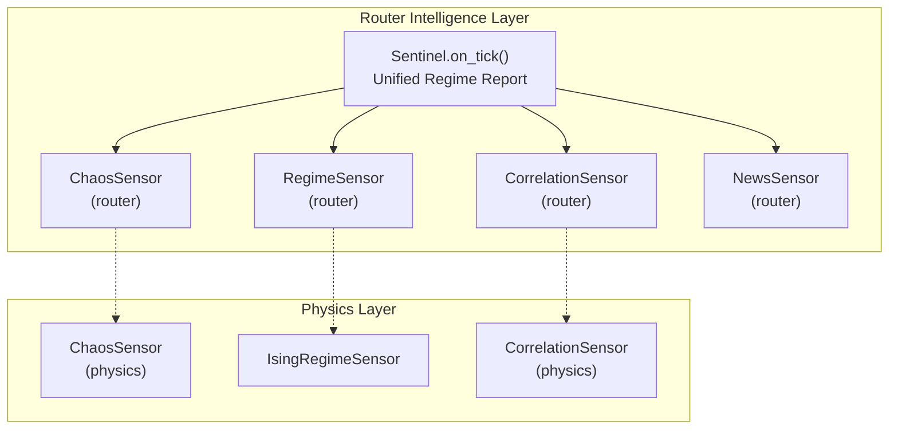
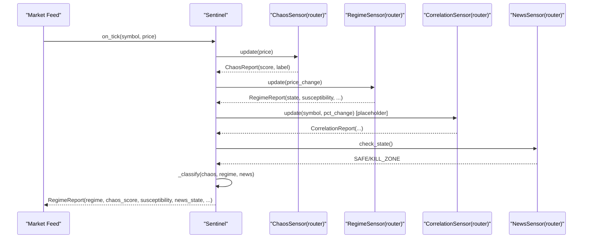
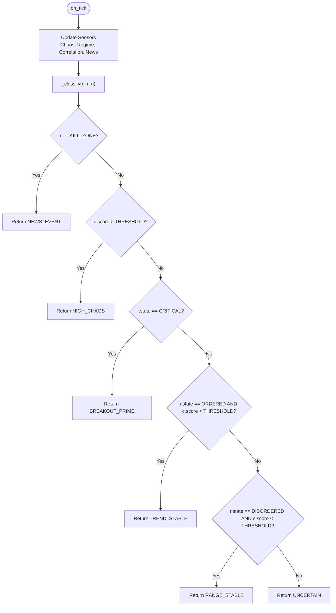
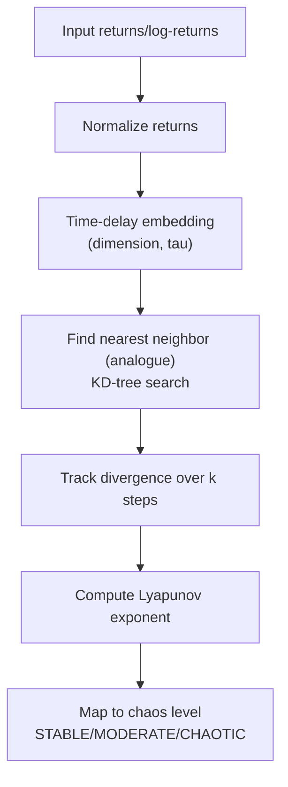
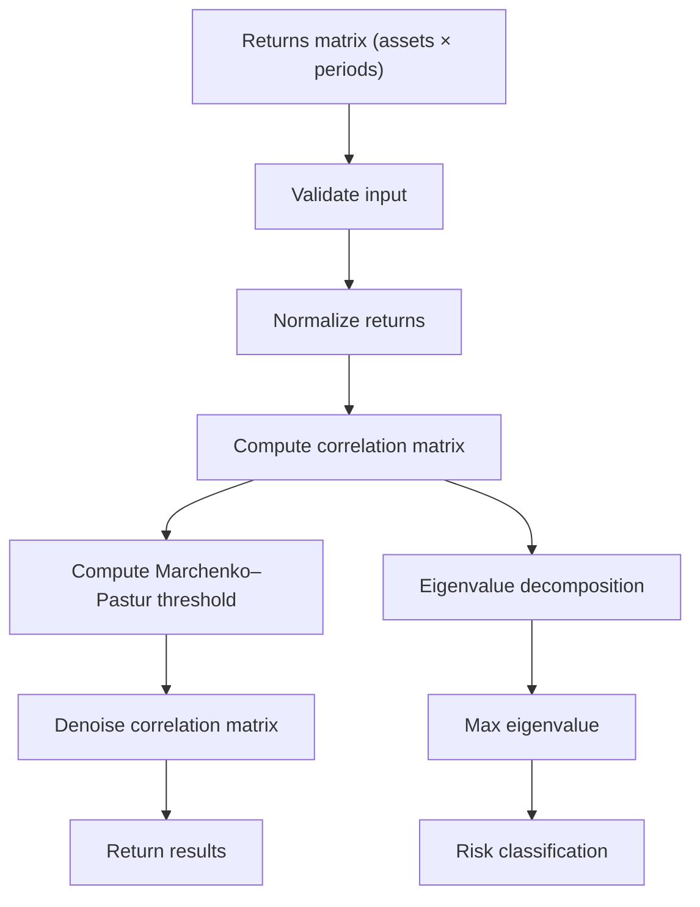
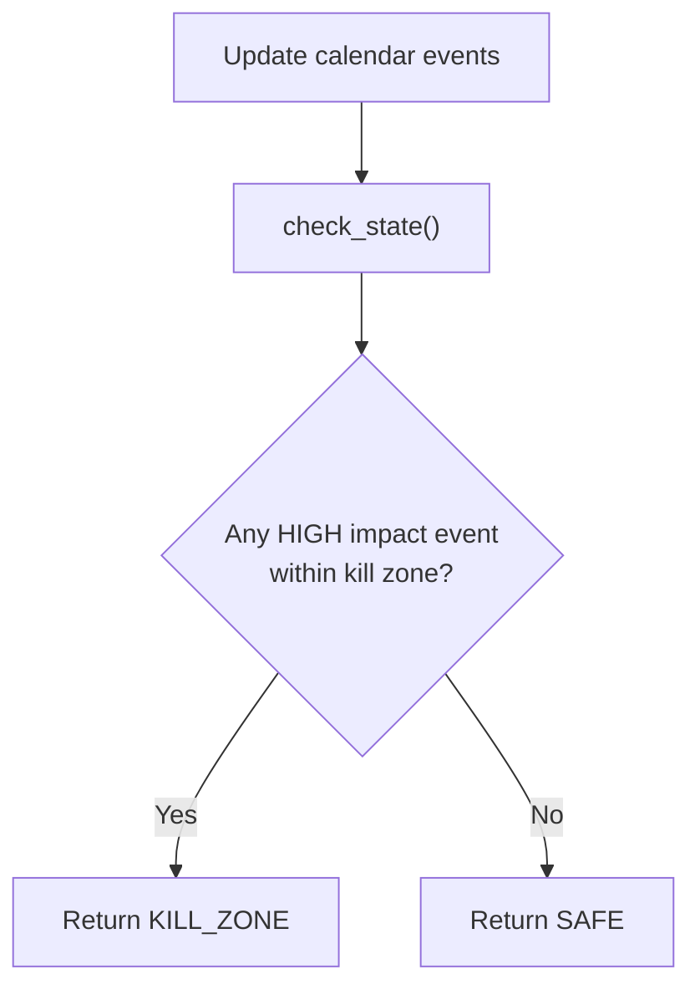
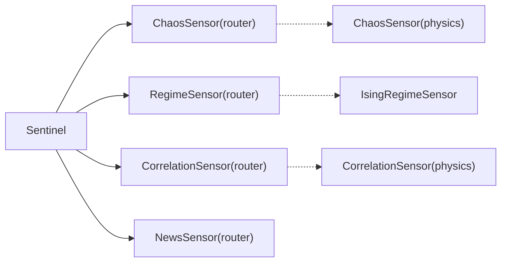

# Market Regime Classification

<cite>
**Referenced Files in This Document**
- [sentinel.py](file://src/router/sentinel.py)
- [chaos.py](file://src/router/sensors/chaos.py)
- [regime.py](file://src/router/sensors/regime.py)
- [correlation.py](file://src/router/sensors/correlation.py)
- [news.py](file://src/router/sensors/news.py)
- [chaos_sensor.py](file://src/risk/physics/chaos_sensor.py)
- [ising_sensor.py](file://src/risk/physics/ising_sensor.py)
- [correlation_sensor.py](file://src/risk/physics/correlation_sensor.py)
- [test_physics_sensors.py](file://tests/risk/physics/test_physics_sensors.py)
- [test_ising_sensor.py](file://tests/risk/physics/test_ising_sensor.py)
</cite>

## Table of Contents
1. [Introduction](#introduction)
2. [Project Structure](#project-structure)
3. [Core Components](#core-components)
4. [Architecture Overview](#architecture-overview)
5. [Detailed Component Analysis](#detailed-component-analysis)
6. [Dependency Analysis](#dependency-analysis)
7. [Performance Considerations](#performance-considerations)
8. [Troubleshooting Guide](#troubleshooting-guide)
9. [Conclusion](#conclusion)
10. [Appendices](#appendices)

## Introduction
This document describes the Market Regime Classification system implemented in the repository. It focuses on the Sentinel intelligence layer that aggregates sensor data into unified Regime Reports, and details the chaos detection algorithms using Lyapunov exponents and phase space reconstruction for identifying HIGH_CHAOS regimes. It also documents the regime state analysis covering TREND_STABLE, RANGE_STABLE, BREAKOUT_PRIME, NEWS_EVENT, and UNCERTAIN classifications, and explains the correlation sensor for multi-symbol systemic risk detection and the news sensor for macroeconomic event detection. Finally, it outlines the mathematical foundations of chaos theory integration, sensor fusion algorithms, and the real-time regime classification logic, with implementation examples and decision tree guidance.

## Project Structure
The Market Regime Classification system is organized around a Sentinel intelligence layer that orchestrates multiple specialized sensors:
- Router-level sensors: chaos, regime (Ising), correlation, and news sensors
- Physics-level sensors: advanced chaos, Ising, and correlation sensors with rigorous mathematical foundations
- Tests validating chaos detection, Ising regime classification, and RMT-based correlation analysis



**Diagram sources**
- [sentinel.py](file://src/router/sentinel.py#L27-L84)
- [chaos.py](file://src/router/sensors/chaos.py#L14-L57)
- [regime.py](file://src/router/sensors/regime.py#L16-L55)
- [correlation.py](file://src/router/sensors/correlation.py#L15-L45)
- [news.py](file://src/router/sensors/news.py#L16-L44)
- [chaos_sensor.py](file://src/risk/physics/chaos_sensor.py#L31-L253)
- [ising_sensor.py](file://src/risk/physics/ising_sensor.py#L105-L246)
- [correlation_sensor.py](file://src/risk/physics/correlation_sensor.py#L22-L285)

**Section sources**
- [sentinel.py](file://src/router/sentinel.py#L1-L84)
- [chaos.py](file://src/router/sensors/chaos.py#L1-L57)
- [regime.py](file://src/router/sensors/regime.py#L1-L55)
- [correlation.py](file://src/router/sensors/correlation.py#L1-L45)
- [news.py](file://src/router/sensors/news.py#L1-L44)
- [chaos_sensor.py](file://src/risk/physics/chaos_sensor.py#L1-L253)
- [ising_sensor.py](file://src/risk/physics/ising_sensor.py#L1-L246)
- [correlation_sensor.py](file://src/risk/physics/correlation_sensor.py#L1-L285)

## Core Components
- Sentinel: Orchestrates sensor updates and produces a unified RegimeReport with fields for regime classification, chaos score, regime quality, susceptibility, systemic risk flag, news state, and timestamp.
- ChaosSensor (router): Lightweight proxy using log-divergence of returns to estimate chaos and label regimes as STABLE, NOISY, CHAOTIC with a 0.0–1.0 score.
- RegimeSensor (router): Binary spin Ising-like model computing magnetization, susceptibility, and energy to classify ORDERED, CRITICAL, DISORDERED states.
- CorrelationSensor (router): Multi-symbol correlation tracker with placeholder RMT logic; returns max eigenvalue, score, and systemic risk flag.
- NewsSensor (router): Tracks high-impact macro events and defines kill zones around scheduled announcements.
- Physics-level sensors: Full-featured implementations with rigorous mathematics for chaos (Lyapunov exponent via phase space reconstruction), Ising model simulations, and RMT-based correlation analysis.

**Section sources**
- [sentinel.py](file://src/router/sentinel.py#L17-L84)
- [chaos.py](file://src/router/sensors/chaos.py#L14-L57)
- [regime.py](file://src/router/sensors/regime.py#L16-L55)
- [correlation.py](file://src/router/sensors/correlation.py#L15-L45)
- [news.py](file://src/router/sensors/news.py#L16-L44)
- [chaos_sensor.py](file://src/risk/physics/chaos_sensor.py#L31-L253)
- [ising_sensor.py](file://src/risk/physics/ising_sensor.py#L105-L246)
- [correlation_sensor.py](file://src/risk/physics/correlation_sensor.py#L22-L285)

## Architecture Overview
The Sentinel integrates four sensor subsystems:
- Chaos: estimates predictability via Lyapunov-like proxies and labels
- Regime: infers market phase via magnetization and susceptibility
- Correlation: monitors systemic risk across multiple symbols
- News: enforces safe operating zones around macro events



**Diagram sources**
- [sentinel.py](file://src/router/sentinel.py#L40-L84)
- [chaos.py](file://src/router/sensors/chaos.py#L19-L57)
- [regime.py](file://src/router/sensors/regime.py#L21-L55)
- [correlation.py](file://src/router/sensors/correlation.py#L21-L45)
- [news.py](file://src/router/sensors/news.py#L27-L44)

## Detailed Component Analysis

### Sentinel Intelligence Layer
The Sentinel aggregates sensor outputs and produces a unified RegimeReport. It applies a prioritized classification scheme:
- NEWS_EVENT: if news state is KILL_ZONE
- HIGH_CHAOS: if chaos score > threshold
- BREAKOUT_PRIME: if regime state is CRITICAL
- TREND_STABLE: if regime ORDERED and chaos score below threshold
- RANGE_STABLE: if regime DISORDERED and chaos score below threshold
- UNCERTAIN: fallback



**Diagram sources**
- [sentinel.py](file://src/router/sentinel.py#L65-L84)

**Section sources**
- [sentinel.py](file://src/router/sentinel.py#L27-L84)

### Chaos Detection: Lyapunov Exponents and Phase Space Reconstruction
Two implementations exist:
- Router-level ChaosSensor: computes a log-divergence proxy from price returns and normalizes to a 0.0–1.0 score with labels.
- Physics-level ChaosSensor: performs rigorous phase space reconstruction using time-delay embedding, finds analogues via nearest neighbors, and computes Lyapunov exponent with divergence tracking.

Mathematical foundations:
- Phase space reconstruction: embed time series using delayed coordinates to unfold attractor geometry.
- Method of analogues: locate nearest neighbors in the reconstructed space to track divergence.
- Lyapunov exponent estimation: average logarithmic rate of divergence over k steps.



**Diagram sources**
- [chaos_sensor.py](file://src/risk/physics/chaos_sensor.py#L67-L176)
- [chaos.py](file://src/router/sensors/chaos.py#L26-L57)

**Section sources**
- [chaos_sensor.py](file://src/risk/physics/chaos_sensor.py#L31-L253)
- [chaos.py](file://src/router/sensors/chaos.py#L14-L57)
- [test_physics_sensors.py](file://tests/risk/physics/test_physics_sensors.py#L102-L157)

### Regime State Analysis: TREND_STABLE, RANGE_STABLE, BREAKOUT_PRIME, NEWS_EVENT, UNCERTAIN
The router-level RegimeSensor uses a binary spin model:
- Magnetization: average spin indicates trend strength and direction.
- Susceptibility: variance of spins measures sensitivity near criticality.
- Energy: pairwise spin interactions approximate frustration.
- States: ORDERED (strong trend), CRITICAL (phase transition), DISORDERED (range-bound).

Classification thresholds:
- ORDERED: |magnetization| > threshold
- CRITICAL: susceptibility > threshold
- DISORDERED: default when neither ORDERED nor CRITICAL

```mermaid
flowchart TD
RS["RegimeSensor.update(delta)"] --> Mag["Compute magnetization"]
RS --> Chi["Compute susceptibility"]
RS --> Eng["Compute energy"]
Mag --> State{"Classify"}
Chi --> State
State --> |abs(M)>TH_ORDERED| ORD["ORDERED"]
State --> |susceptibility>TH_CRITICAL| CRT["CRITICAL"]
State --> |else| DIS["DISORDERED"]
```

**Diagram sources**
- [regime.py](file://src/router/sensors/regime.py#L29-L55)

**Section sources**
- [regime.py](file://src/router/sensors/regime.py#L16-L55)
- [test_ising_sensor.py](file://tests/risk/physics/test_ising_sensor.py#L60-L74)

### Correlation Sensor: Multi-Symbol Systemic Risk Detection
The router-level CorrelationSensor maintains returns per symbol and provides a placeholder RMT calculation returning a max eigenvalue, risk score, and systemic risk flag. The physics-level CorrelationSensor implements:
- Input validation and normalization
- Correlation matrix construction and eigenvalue decomposition
- Marchenko–Pastur noise threshold computation
- Denoising of correlation matrices
- Risk classification by maximum eigenvalue



**Diagram sources**
- [correlation_sensor.py](file://src/risk/physics/correlation_sensor.py#L229-L281)
- [correlation.py](file://src/router/sensors/correlation.py#L35-L45)

**Section sources**
- [correlation.py](file://src/router/sensors/correlation.py#L15-L45)
- [correlation_sensor.py](file://src/risk/physics/correlation_sensor.py#L22-L285)
- [test_physics_sensors.py](file://tests/risk/physics/test_physics_sensors.py#L201-L266)

### News Sensor: Macroeconomic Event Detection and Kill Zones
The NewsSensor tracks upcoming high-impact events and defines kill zones around scheduled announcements. The current implementation returns a simplified state string. Integration requires populating events from a calendar source.



**Diagram sources**
- [news.py](file://src/router/sensors/news.py#L27-L44)

**Section sources**
- [news.py](file://src/router/sensors/news.py#L16-L44)

### Implementation Examples and Decision Trees

- Sensor data processing:
  - Chaos proxy: compute returns, log-divergence of differences, and normalize to score.
  - Regime proxy: convert price change to spin (+1/-1), maintain window, compute magnetization and susceptibility.
  - Correlation placeholder: collect multi-symbol returns and return mock report until full RMT pipeline is wired.
  - News: maintain event list and compute time deltas to determine kill zone state.

- Regime calculation thresholds:
  - HIGH_CHAOS: chaos score > threshold
  - TREND_STABLE: ORDERED state AND chaos score < threshold
  - RANGE_STABLE: DISORDERED state AND chaos score < threshold
  - BREAKOUT_PRIME: CRITICAL state
  - NEWS_EVENT: KILL_ZONE news state
  - UNCERTAIN: fallback

- Classification decision tree:
  - Prioritize news kill zones, then chaos, then breakout conditions, then trend/range stability.

[No sources needed since this subsection synthesizes previously cited logic without quoting specific code]

## Dependency Analysis
The router-level Sentinel depends on four sensors. The physics-level sensors provide deeper mathematical capabilities and can be integrated behind the router abstractions.



**Diagram sources**
- [sentinel.py](file://src/router/sentinel.py#L32-L36)
- [chaos_sensor.py](file://src/risk/physics/chaos_sensor.py#L31-L66)
- [ising_sensor.py](file://src/risk/physics/ising_sensor.py#L105-L112)
- [correlation_sensor.py](file://src/risk/physics/correlation_sensor.py#L22-L56)

**Section sources**
- [sentinel.py](file://src/router/sentinel.py#L10-L36)
- [chaos_sensor.py](file://src/risk/physics/chaos_sensor.py#L1-L253)
- [ising_sensor.py](file://src/risk/physics/ising_sensor.py#L1-L246)
- [correlation_sensor.py](file://src/risk/physics/correlation_sensor.py#L1-L285)

## Performance Considerations
- Window sizes: ensure adequate lookback windows for chaos and regime sensors to avoid noisy estimates.
- Computational complexity:
  - Router chaos proxy: O(n) per update for differencing and log-deviation aggregation.
  - Physics chaos: KD-tree nearest neighbor search scales with dataset size; tune embedding dimension and time delay.
  - RMT correlation: eigenvalue decomposition is O(n^3) for n×n correlation matrix; consider chunking or caching.
- Caching: leverage LRU caches for repeated computations (e.g., Ising simulations, RMT results).
- Multi-symbol correlation: maintain bounded buffers per symbol and gate calculations until sufficient assets are available.

[No sources needed since this section provides general guidance]

## Troubleshooting Guide
- Chaos sensor returns unexpected labels:
  - Verify input length and normalization; ensure sufficient data points for phase space reconstruction.
  - Adjust embedding parameters and lookback windows.
- Regime sensor stuck in DISORDERED:
  - Check susceptibility threshold and window size; confirm price changes are being converted to spins correctly.
- Correlation sensor placeholder:
  - Wire multi-symbol returns and enable full RMT pipeline; validate input shapes and data quality.
- News sensor always SAFE:
  - Populate events via update_calendar and confirm timezone handling and kill-zone boundaries.

**Section sources**
- [chaos_sensor.py](file://src/risk/physics/chaos_sensor.py#L208-L221)
- [correlation_sensor.py](file://src/risk/physics/correlation_sensor.py#L57-L80)
- [news.py](file://src/router/sensors/news.py#L22-L25)

## Conclusion
The Market Regime Classification system combines lightweight router sensors with rigorous physics-based algorithms to deliver robust, real-time regime insights. The Sentinel integrates chaos, regime, correlation, and news signals into a unified report, enabling automated trading logic across TREND_STABLE, RANGE_STABLE, BREAKOUT_PRIME, NEWS_EVENT, and UNCERTAIN regimes. With proper tuning of thresholds and integration of the physics-level sensors, the system supports advanced chaos detection, systemic risk monitoring, and macro event-aware trading.

## Appendices

### Mathematical Foundations Summary
- Chaos theory: Lyapunov exponent measures exponential divergence of nearby trajectories; positive values indicate chaos.
- Phase space reconstruction: time-delay embedding restores dynamics from scalar observations.
- Ising model: spin dynamics simulate market sentiment; magnetization and susceptibility reveal ordered/disordered/critical phases.
- Random Matrix Theory: separates signal from noise via Marchenko–Pastur threshold; systemic risk inferred from maximum eigenvalue.

[No sources needed since this subsection summarizes without quoting specific code]