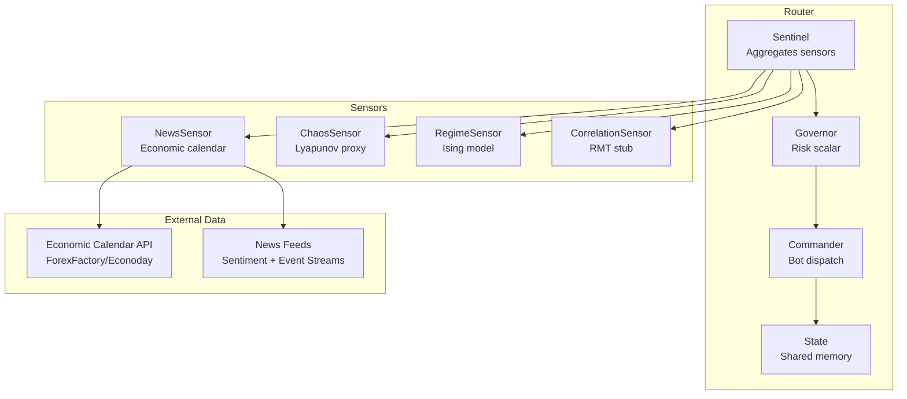
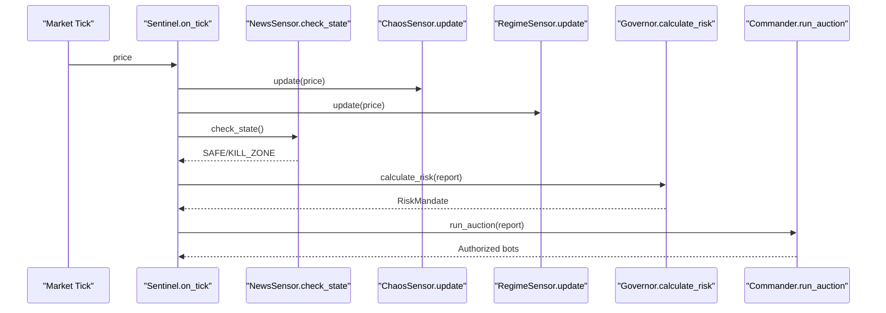
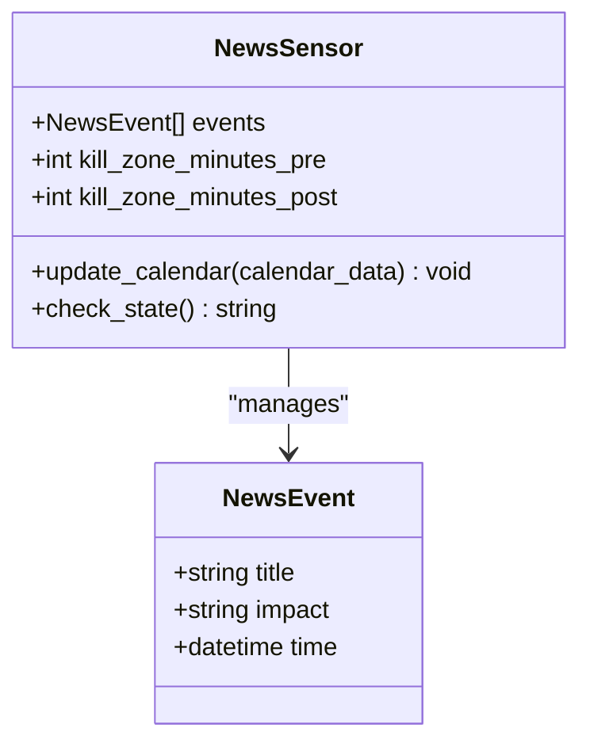
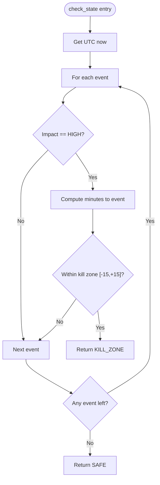
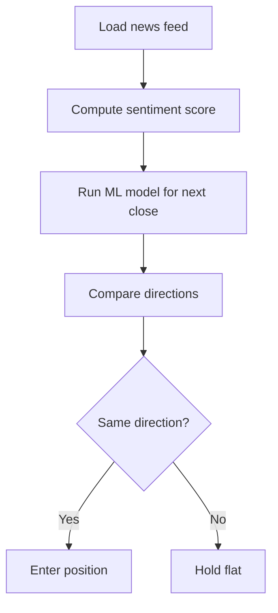
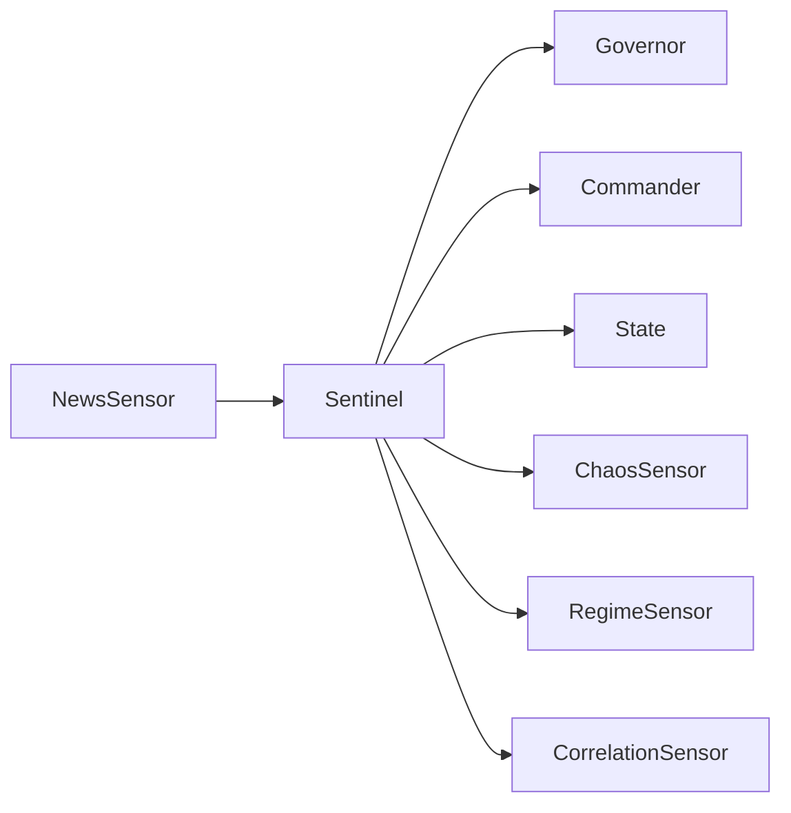

# News Sensor

<cite>
**Referenced Files in This Document**
- [news.py](file://src/router/sensors/news.py)
- [sentinel.py](file://src/router/sentinel.py)
- [strategy_router_v1.md](file://docs/trds/strategy_router_v1.md)
- [state.py](file://src/router/state.py)
- [governor.py](file://src/router/governor.py)
- [commander.py](file://src/router/commander.py)
- [regime.py](file://src/router/sensors/regime.py)
- [chaos.py](file://src/router/sensors/chaos.py)
- [correlation.py](file://src/router/sensors/correlation.py)
- [news_trading_made_easy__part_3___performing_trades.md](file://data/scraped_articles/trading/news_trading_made_easy__part_3___performing_trades.md)
- [trading_with_the_mql5_economic_calendar__part_7___preparing_for_strategy_testing_with_resource-based.md](file://data/scraped_articles/trading/trading_with_the_mql5_economic_calendar__part_7___preparing_for_strategy_testing_with_resource-based.md)
- [sentiment_analysis_and_deep_learning_for_trading_with_ea_and_backtesting_with_python.md](file://data/scraped_articles/trading_systems/sentiment_analysis_and_deep_learning_for_trading_with_ea_and_backtesting_with_python.md)
- [example_of_causality_network_analysis__cna__and_vector_auto-regression_model_for_market_event_predic.md](file://data/scraped_articles/trading_systems/example_of_causality_network_analysis__cna__and_vector_auto-regression_model_for_market_event_predic.md)
</cite>

## Table of Contents
1. [Introduction](#introduction)
2. [Project Structure](#project-structure)
3. [Core Components](#core-components)
4. [Architecture Overview](#architecture-overview)
5. [Detailed Component Analysis](#detailed-component-analysis)
6. [Dependency Analysis](#dependency-analysis)
7. [Performance Considerations](#performance-considerations)
8. [Troubleshooting Guide](#troubleshooting-guide)
9. [Conclusion](#conclusion)
10. [Appendices](#appendices)

## Introduction
This document explains the News Sensor that monitors macroeconomic events and their impact on market regimes. It covers the detection algorithms for economic calendar events, the SAFE and KILL_ZONE classification system indicating market vulnerability to external shocks, and the integration with economic calendars, central bank announcements, and major geopolitical events. It also outlines the methodology for news sentiment analysis, event timing analysis, and market reaction prediction models, along with implementation examples for news feed processing, event detection workflows, and impact scoring algorithms. Finally, it addresses real-time processing requirements for breaking news and integration with the broader regime classification system.

## Project Structure
The News Sensor resides in the router’s sensor subsystem and integrates with the Sentinel intelligence layer, which aggregates multiple sensors (chaos, regime, correlation, and news) into a unified regime classification used by the Governor and Commander layers.

**Diagram sources**
- [sentinel.py](file://src/router/sentinel.py#L27-L63)
- [news.py](file://src/router/sensors/news.py#L16-L43)
- [chaos.py](file://src/router/sensors/chaos.py#L14-L56)
- [regime.py](file://src/router/sensors/regime.py#L16-L54)
- [correlation.py](file://src/router/sensors/correlation.py#L15-L44)
- [governor.py](file://src/router/governor.py#L16-L54)
- [commander.py](file://src/router/commander.py#L11-L38)
- [state.py](file://src/router/state.py#L8-L33)

**Section sources**
- [sentinel.py](file://src/router/sentinel.py#L1-L85)
- [strategy_router_v1.md](file://docs/trds/strategy_router_v1.md#L58-L65)

## Core Components
- NewsSensor: Tracks high-impact economic events and classifies market state as SAFE or KILL_ZONE around scheduled releases.
- Sentinel: Integrates sensor outputs into a RegimeReport and maps them to regime categories.
- Regime/Chaos/Correlation Sensors: Provide complementary signals for trend direction, turbulence, and systemic risk.
- Governor/Commander/State: Apply risk governance and dispatch strategies based on the regime classification.

Key responsibilities:
- Economic calendar ingestion and event parsing
- Kill zone enforcement windows (pre/post event)
- Integration with broader regime classification
- Placeholder for sentiment and market reaction modeling

**Section sources**
- [news.py](file://src/router/sensors/news.py#L16-L43)
- [sentinel.py](file://src/router/sentinel.py#L27-L84)
- [strategy_router_v1.md](file://docs/trds/strategy_router_v1.md#L58-L65)

## Architecture Overview
The News Sensor participates in the “Sentient Loop”:
1. Observe: Sentinel updates all sensors on each tick.
2. Govern: Governor computes risk scalars based on chaos, systemic risk, and regime.
3. Command: Commander selects bots aligned with the regime.
4. Execute: Interface sends commands to MT5.

**Diagram sources**
- [sentinel.py](file://src/router/sentinel.py#L40-L63)
- [news.py](file://src/router/sensors/news.py#L27-L43)
- [governor.py](file://src/router/governor.py#L24-L54)
- [commander.py](file://src/router/commander.py#L19-L38)

## Detailed Component Analysis

### NewsSensor: Economic Calendar and Kill Zone Enforcement
The NewsSensor maintains a list of parsed NewsEvent items and classifies the current market state based on proximity to high-impact events.

- update_calendar: Parses calendar_data (placeholder) into NewsEvent entries.
- check_state: Scans upcoming events and returns SAFE or KILL_ZONE depending on time proximity.

**Diagram sources**
- [news.py](file://src/router/sensors/news.py#L27-L43)

**Section sources**
- [news.py](file://src/router/sensors/news.py#L16-L43)

### SAFE and KILL_ZONE Classification System
- SAFE: No high-impact event within ±15 minutes; market may proceed with normal trading.
- KILL_ZONE: Enforced during ±15 minutes around high-impact event releases; hard stop for new entries; post-event resumption depends on chaos threshold.

Integration with regime classification:
- If NewsSensor reports KILL_ZONE, Sentinel maps to NEWS_EVENT regardless of other sensor values.
- Post-event, resume only if chaos is low.

**Section sources**
- [strategy_router_v1.md](file://docs/trds/strategy_router_v1.md#L58-L65)
- [sentinel.py](file://src/router/sentinel.py#L65-L84)

### Economic Calendar Integration
- Data sources: Economic Calendar API (ForexFactory/Econoday) and MQL5 Economic Calendar.
- Fields of interest: event name, time, country, currency, importance, frequency, impact, actual/forecast/previous values.
- Integration patterns:
  - Load events from resource/database for backtesting.
  - Build views and tables to normalize time across DST regions.
  - Filter by currency, impact, and time windows for trade preparation.

Practical references:
- Calendar data schema and columns.
- Database creation and update logic for MQL5 calendar tables and views.
- Trade-before logic using offsets relative to event time.

**Section sources**
- [trading_with_the_mql5_economic_calendar__part_7___preparing_for_strategy_testing_with_resource-based.md](file://data/scraped_articles/trading/trading_with_the_mql5_economic_calendar__part_7___preparing_for_strategy_testing_with_resource-based.md#L47-L51)
- [trading_with_the_mql5_economic_calendar__part_7___preparing_for_strategy_testing_with_resource-based.md](file://data/scraped_articles/trading/trading_with_the_mql5_economic_calendar__part_7___preparing_for_strategy_testing_with_resource-based.md#L650-L663)
- [news_trading_made_easy__part_3___performing_trades.md](file://data/scraped_articles/trading/news_trading_made_easy__part_3___performing_trades.md#L2612-L2614)

### Central Bank Announcements and Geopolitical Events
- Central bank decisions and geopolitical events are modeled as high-impact calendar events.
- The Kill Zone enforces pre/post windows to avoid volatility spikes and enable controlled post-event reactions.
- Filtering by currency and impact ensures relevance to the monitored instruments.

[No sources needed since this section synthesizes concepts without quoting specific code]

### News Sentiment Analysis Methodology
- Feed: News-API or similar for historical and real-time feeds.
- Approach: Compare sentiment direction with model-predicted price direction to align positions.
- Strategy: Align sentiment and prediction directions to enter trades; otherwise hold neutral.

**Diagram sources**
- [sentiment_analysis_and_deep_learning_for_trading_with_ea_and_backtesting_with_python.md](file://data/scraped_articles/trading_systems/sentiment_analysis_and_deep_learning_for_trading_with_ea_and_backtesting_with_python.md#L90-L101)

**Section sources**
- [sentiment_analysis_and_deep_learning_for_trading_with_ea_and_backtesting_with_python.md](file://data/scraped_articles/trading_systems/sentiment_analysis_and_deep_learning_for_trading_with_ea_and_backtesting_with_python.md#L90-L101)

### Event Timing Analysis and Market Reaction Prediction
- Timing: Use offsets relative to event time to trade before or around releases.
- Reaction modeling: Combine sentiment and ML predictions to anticipate price moves.
- Causality networks: Explore cause-effect relationships among market variables to improve prediction robustness.

**Section sources**
- [example_of_causality_network_analysis__cna__and_vector_auto-regression_model_for_market_event_predic.md](file://data/scraped_articles/trading_systems/example_of_causality_network_analysis__cna__and_vector_auto-regression_model_for_market_event_predic.md#L28-L38)

### Implementation Examples

#### News Feed Processing
- Load calendar data from resource/database for backtesting.
- Normalize timestamps across DST regions.
- Persist calendar tables and views for downstream use.

**Section sources**
- [trading_with_the_mql5_economic_calendar__part_7___preparing_for_strategy_testing_with_resource-based.md](file://data/scraped_articles/trading/trading_with_the_mql5_economic_calendar__part_7___preparing_for_strategy_testing_with_resource-based.md#L650-L663)
- [trading_with_the_mql5_economic_calendar__part_7___preparing_for_strategy_testing_with_resource-based.md](file://data/scraped_articles/trading/trading_with_the_mql5_economic_calendar__part_7___preparing_for_strategy_testing_with_resource-based.md#L2844-L2901)

#### Event Detection Workflow
- Parse calendar_data into NewsEvent objects.
- Compute time differences and enforce kill zone windows.
- Emit SAFE or KILL_ZONE for the Sentinel.

**Section sources**
- [news.py](file://src/router/sensors/news.py#L22-L43)

#### Impact Scoring Algorithms
- Event impact derived from calendar fields (e.g., CALENDAR_IMPACT_*).
- Currency-specific impact influences directional expectations for pairs involving that currency.

**Section sources**
- [news_trading_made_easy__part_3___performing_trades.md](file://data/scraped_articles/trading/news_trading_made_easy__part_3___performing_trades.md#L2753)

### Real-Time Processing Requirements
- NewsSensor must evaluate event proximity on every tick.
- Kill Zone enforcement requires precise timing around event release.
- Integration with the broader regime system demands low-latency classification and immediate risk throttling.

**Section sources**
- [sentinel.py](file://src/router/sentinel.py#L40-L63)
- [strategy_router_v1.md](file://docs/trds/strategy_router_v1.md#L58-L65)

## Dependency Analysis
The News Sensor interacts with the Sentinel and is part of the integrated regime classification pipeline.

**Diagram sources**
- [news.py](file://src/router/sensors/news.py#L16-L43)
- [sentinel.py](file://src/router/sentinel.py#L32-L63)
- [governor.py](file://src/router/governor.py#L16-L54)
- [commander.py](file://src/router/commander.py#L11-L38)
- [state.py](file://src/router/state.py#L8-L33)

**Section sources**
- [sentinel.py](file://src/router/sentinel.py#L10-L13)
- [strategy_router_v1.md](file://docs/trds/strategy_router_v1.md#L58-L65)

## Performance Considerations
- NewsSensor check_state iterates over upcoming events; keep the event list pruned to near-term high-impact items.
- Use efficient datetime comparisons and avoid repeated parsing.
- Integrate with real-time calendar feeds to minimize latency between event release and kill zone activation.

[No sources needed since this section provides general guidance]

## Troubleshooting Guide
- If KILL_ZONE is not triggering, verify event impact filtering and time window boundaries.
- If SAFE persists unexpectedly, confirm calendar parsing and timezone normalization.
- If regime classification conflicts with news state, review the Sentinel’s precedence logic for KILL_ZONE.

**Section sources**
- [news.py](file://src/router/sensors/news.py#L27-L43)
- [sentinel.py](file://src/router/sentinel.py#L65-L84)

## Conclusion
The News Sensor provides a critical guardrail around high-impact macroeconomic events by enforcing kill zones and integrating with the broader regime classification system. While the current implementation focuses on calendar-driven detection, future enhancements can incorporate sentiment analysis and market reaction models to further refine event impact scoring and timing decisions.

[No sources needed since this section summarizes without analyzing specific files]

## Appendices

### Integration with Broader Regime Classification
- Sentinel maps sensor outputs to regimes; KILL_ZONE overrides other states.
- Governor applies risk scalars based on chaos and systemic risk; Commander selects bots accordingly.

**Section sources**
- [sentinel.py](file://src/router/sentinel.py#L65-L84)
- [governor.py](file://src/router/governor.py#L24-L54)
- [commander.py](file://src/router/commander.py#L19-L49)
- [state.py](file://src/router/state.py#L22-L33)