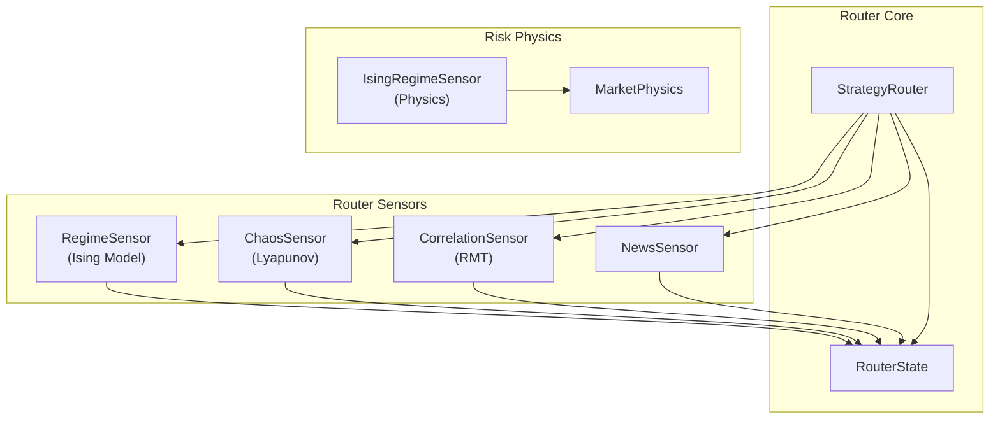
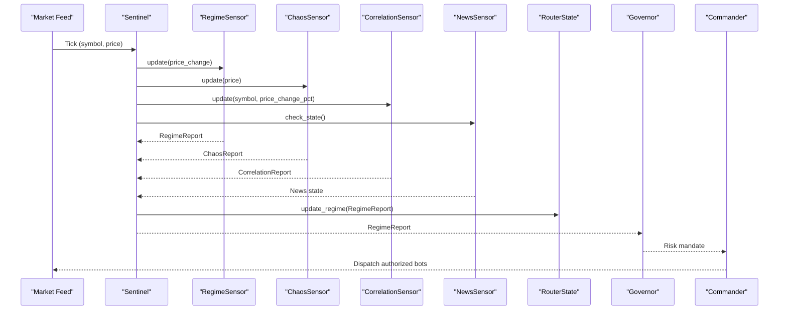
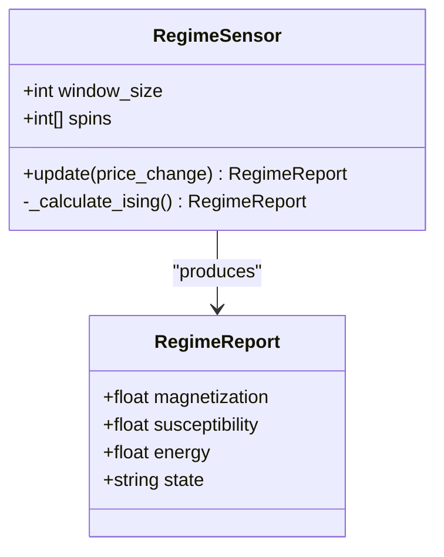
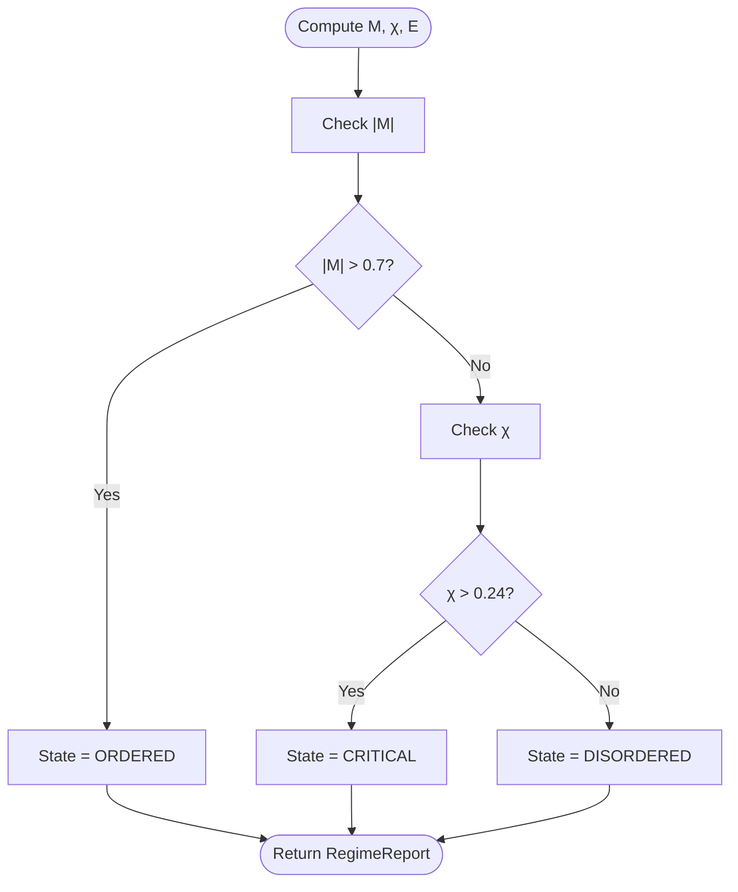
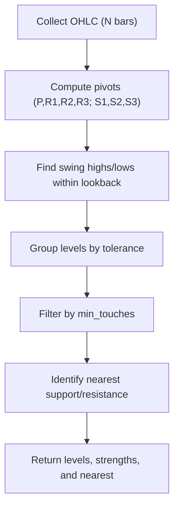
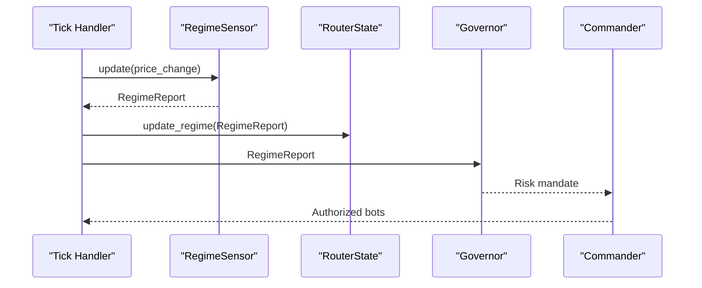
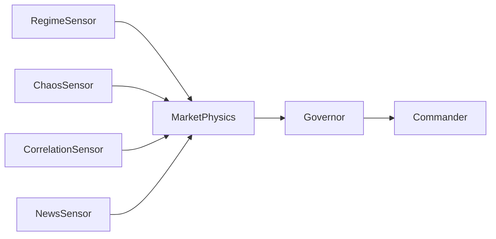
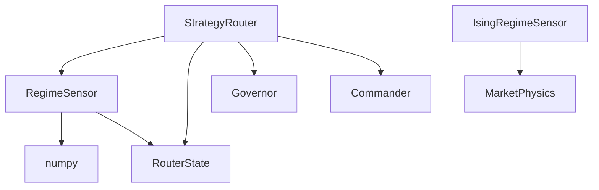

# Regime Sensor

<cite>
**Referenced Files in This Document**
- [regime.py](file://src/router/sensors/regime.py)
- [chaos.py](file://src/router/sensors/chaos.py)
- [correlation.py](file://src/router/sensors/correlation.py)
- [news.py](file://src/router/sensors/news.py)
- [state.py](file://src/router/state.py)
- [engine.py](file://src/router/engine.py)
- [ising_sensor.py](file://src/risk/physics/ising_sensor.py)
- [market_physics.py](file://src/risk/models/market_physics.py)
- [test_kelly_engine.py](file://tests/risk/sizing/test_kelly_engine.py)
- [test_risk_models.py](file://tests/test_risk_models.py)
- [detect_support_resistance.md](file://docs/skills/trading_skills/detect_support_resistance.md)
- [trading_insights_through_volume__trend_confirmation.md](file://data/scraped_articles/trading_systems/trading_insights_through_volume__trend_confirmation.md)
- [several_ways_of_finding_a_trend_in_mql5.md](file://data/scraped_articles/trading_systems/several_ways_of_finding_a_trend_in_mql5.md)
- [building_a_custom_market_regime_detection_system_in_mql5__part_1___indicator.md](file://data/scraped_articles/trading/building_a_custom_market_regime_detection_system_in_mql5__part_1___indicator.md)
</cite>

## Table of Contents
1. [Introduction](#introduction)
2. [Project Structure](#project-structure)
3. [Core Components](#core-components)
4. [Architecture Overview](#architecture-overview)
5. [Detailed Component Analysis](#detailed-component-analysis)
6. [Dependency Analysis](#dependency-analysis)
7. [Performance Considerations](#performance-considerations)
8. [Troubleshooting Guide](#troubleshooting-guide)
9. [Conclusion](#conclusion)
10. [Appendices](#appendices)

## Introduction
This document describes the Regime Sensor subsystem responsible for analyzing market trend stability and structural changes. It explains the trend detection algorithms (including moving average-based trend detection), trend strength indicators, and momentum analysis. It documents the state classification system with ORDERED, DISORDERED, and CRITICAL states that reflect different market conditions. It details the susceptibility calculation that measures market responsiveness to external shocks and regime transitions. It also outlines the mathematical models for trend identification, support/resistance detection, and breakout confirmation algorithms. Implementation examples show price analysis workflows, state transitions, and susceptibility scoring. Finally, it addresses integration with other sensors and how regime states influence overall market classification decisions.

## Project Structure
The Regime Sensor is part of the router’s sensor suite and integrates with other sensors (Chaos, Correlation, News) and the central Router State. The Strategy Router orchestrates observation, governance, and command phases, feeding regime reports into shared state and downstream decision-making.

**Diagram sources**
- [regime.py](file://src/router/sensors/regime.py#L16-L55)
- [chaos.py](file://src/router/sensors/chaos.py#L14-L57)
- [correlation.py](file://src/router/sensors/correlation.py#L15-L45)
- [news.py](file://src/router/sensors/news.py#L16-L44)
- [state.py](file://src/router/state.py#L8-L34)
- [engine.py](file://src/router/engine.py#L16-L68)
- [ising_sensor.py](file://src/risk/physics/ising_sensor.py#L1-L40)
- [market_physics.py](file://src/risk/models/market_physics.py#L36-L72)

**Section sources**
- [regime.py](file://src/router/sensors/regime.py#L1-L55)
- [state.py](file://src/router/state.py#L1-L34)
- [engine.py](file://src/router/engine.py#L1-L68)

## Core Components
- RegimeSensor (Ising Model): Computes magnetization (trend strength/direction), susceptibility (variability/criticality), and frustration-like energy from discrete price-driven spins. Classifies states ORDERED, DISORDERED, or CRITICAL based on thresholds.
- ChaosSensor (Lyapunov proxy): Estimates predictability/turbulence from return divergences and maps to STABLE, NOISY, CHAOTIC labels.
- CorrelationSensor (RMT proxy): Tracks recent returns across assets and returns a placeholder report; production would compute max eigenvalue for systemic risk.
- NewsSensor: Enforces kill zones around high-impact events and reports SAFE, PRE_NEWS, KILL_ZONE, POST_NEWS states.
- RouterState: Shared in-memory state holding the current regime and operational context.
- StrategyRouter: Coordinates sensor updates, governance mandates, and dispatch of bots.

**Section sources**
- [regime.py](file://src/router/sensors/regime.py#L9-L55)
- [chaos.py](file://src/router/sensors/chaos.py#L9-L57)
- [correlation.py](file://src/router/sensors/correlation.py#L9-L45)
- [news.py](file://src/router/sensors/news.py#L10-L44)
- [state.py](file://src/router/state.py#L8-L34)
- [engine.py](file://src/router/engine.py#L29-L60)

## Architecture Overview
The Regime Sensor participates in the “Sentinel” observation phase of the Strategy Router loop. It ingests price changes, computes Ising observables, and emits a RegimeReport. The RouterState stores the latest regime for downstream components. Governance then derives risk mandates from the regime report, and the Commander auctions authorized bots accordingly.

**Diagram sources**
- [engine.py](file://src/router/engine.py#L29-L60)
- [state.py](file://src/router/state.py#L22-L26)
- [regime.py](file://src/router/sensors/regime.py#L21-L27)
- [chaos.py](file://src/router/sensors/chaos.py#L19-L24)
- [correlation.py](file://src/router/sensors/correlation.py#L21-L33)
- [news.py](file://src/router/sensors/news.py#L27-L43)

## Detailed Component Analysis

### RegimeSensor (Ising Model)
The RegimeSensor transforms signed price changes into discrete spins (+1/-1), maintains a sliding window, and computes:
- Magnetization (M): mean of spins; measures trend strength and direction.
- Susceptibility (χ): variance of spins; measures sensitivity to perturbations and proximity to critical transitions.
- Energy (E): pairwise interaction sum (frustration-like); proxies persistence vs. flip-flopping.
- State classification: ORDERED (strong trend), CRITICAL (high variability), DISORDERED (no consensus).

**Diagram sources**
- [regime.py](file://src/router/sensors/regime.py#L9-L55)

Implementation highlights:
- Sliding window enforces finite memory for regime estimation.
- Thresholds: ORDERED if |M| > 0.7; CRITICAL if χ > 0.24 (variance upper bound for binary spins).
- Energy normalization ensures comparable scales across windows.

Mathematical models:
- Magnetization: M = mean(spins)
- Susceptibility: χ = var(spins)
- Energy: E = (−Σ s_i · s_{i+1}) / N
- State: depends on M and χ thresholds

State transitions:
- High positive M → ORDERED (trending up)
- High negative M → ORDERED (trending down)
- Low |M| with high χ → CRITICAL (flip-flopping)
- Low χ and low |M| → DISORDERED (range-bound)

Susceptibility scoring:
- χ measures volatility clustering and phase-transition proximity.
- Higher χ correlates with increased sensitivity to shocks and regime shifts.

Integration with other sensors:
- RegimeSensor complements ChaosSensor (predictability), CorrelationSensor (systemic risk), and NewsSensor (event-driven volatility).

**Section sources**
- [regime.py](file://src/router/sensors/regime.py#L16-L55)

### Trend Detection Algorithms and Momentum Analysis
- Moving Average-based trend detection: compares multiple moving averages to infer uptrend or downtrend when averages are in correct rising/falling order.
- MACD-like momentum: although not explicitly implemented here, the repository includes references to MACD divergence usage in trading systems.
- Momentum analysis: price-driven spins capture directional momentum; combined with variance, they quantify momentum persistence and reversals.

References to trend detection and momentum:
- Moving average fan interpretation and trend rules.
- MACD divergence usage in expert advisors.

**Section sources**
- [several_ways_of_finding_a_trend_in_mql5.md](file://data/scraped_articles/trading_systems/several_ways_of_finding_a_trend_in_mql5.md#L103-L122)
- [building_a_custom_market_regime_detection_system_in_mql5__part_1___indicator.md](file://data/scraped_articles/trading/building_a_custom_market_regime_detection_system_in_mql5__part_1___indicator.md#L342-L348)

### State Classification System
States:
- ORDERED: Strong trend indicated by high |magnetization|; persistent direction.
- CRITICAL: High susceptibility; system is flickering near criticality.
- DISORDERED: Weak magnetization and low susceptibility; range-bound or neutral.

Thresholds:
- |M| > 0.7 → ORDERED
- χ > 0.24 → CRITICAL
- Otherwise → DISORDERED

**Diagram sources**
- [regime.py](file://src/router/sensors/regime.py#L29-L54)

**Section sources**
- [regime.py](file://src/router/sensors/regime.py#L29-L54)

### Susceptibility Calculation and Market Responsiveness
Susceptibility (χ) quantifies market responsiveness to external shocks:
- High χ indicates high variability and sensitivity; markets are more likely to shift regimes.
- Low χ indicates stability; shocks are less likely to cause transitions.

Validation and usage:
- Tests demonstrate susceptibility thresholds affecting position sizing multipliers.
- MarketPhysics integrates susceptibility into broader risk modeling.

**Section sources**
- [regime.py](file://src/router/sensors/regime.py#L36-L38)
- [test_kelly_engine.py](file://tests/risk/sizing/test_kelly_engine.py#L168-L187)
- [market_physics.py](file://src/risk/models/market_physics.py#L52-L64)

### Mathematical Models for Trend Identification, Support/Resistance, and Breakout Confirmation
- Trend identification: moving average fan rules and divergence-based signals.
- Support/resistance detection: pivot points and grouped swing extremes with tolerance and minimum touches.
- Breakout confirmation: price breaking beyond recent highs/lows with confirmation logic.

**Diagram sources**
- [detect_support_resistance.md](file://docs/skills/trading_skills/detect_support_resistance.md#L166-L343)

Breakout confirmation:
- Detect price break above resistance or below support with prior close comparison.
- Combine with volume or volatility filters for confirmation.

**Section sources**
- [trading_insights_through_volume__trend_confirmation.md](file://data/scraped_articles/trading_systems/trading_insights_through_volume__trend_confirmation.md#L62-L104)

### Implementation Examples: Price Analysis Workflows, State Transitions, and Susceptibility Scoring
Example workflow outline:
- On each tick, compute price_change and update RegimeSensor to obtain RegimeReport.
- Store report in RouterState for global access.
- Use state to inform risk mandates and bot dispatch.
- Combine with ChaosSensor and CorrelationSensor for richer context.

**Diagram sources**
- [regime.py](file://src/router/sensors/regime.py#L21-L27)
- [state.py](file://src/router/state.py#L22-L26)
- [engine.py](file://src/router/engine.py#L29-L60)

Susceptibility scoring example:
- Compute χ from recent spins; compare against thresholds to adjust position sizing or risk mode.

**Section sources**
- [regime.py](file://src/router/sensors/regime.py#L36-L38)
- [test_kelly_engine.py](file://tests/risk/sizing/test_kelly_engine.py#L168-L187)

### Integration with Other Sensors and Influence on Market Classification Decisions
- RegimeSensor contributes magnetization and susceptibility to overall market classification.
- ChaosSensor adds predictability dimension; high Lyapunov scores increase risk.
- CorrelationSensor (RMT) detects systemic risk via max eigenvalue; informs mandate severity.
- NewsSensor enforces kill zones around high-impact events, reducing regime reliability during volatile windows.
- RouterState centralizes current_regime for downstream components.
- StrategyRouter coordinates governance and dispatch based on the composite regime report.

**Diagram sources**
- [regime.py](file://src/router/sensors/regime.py#L29-L54)
- [chaos.py](file://src/router/sensors/chaos.py#L26-L56)
- [correlation.py](file://src/router/sensors/correlation.py#L35-L44)
- [news.py](file://src/router/sensors/news.py#L27-L43)
- [market_physics.py](file://src/risk/models/market_physics.py#L36-L72)
- [engine.py](file://src/router/engine.py#L29-L60)

**Section sources**
- [state.py](file://src/router/state.py#L22-L26)
- [engine.py](file://src/router/engine.py#L29-L60)

## Dependency Analysis
- RegimeSensor depends on numpy for numerical computations and uses a sliding window of spins.
- RouterState provides a centralized store for the current regime and operational context.
- StrategyRouter composes sensors and state to produce mandates and dispatch bots.
- Risk Physics (IsingRegimeSensor and MarketPhysics) complement the router’s regime sensor with deeper thermodynamic modeling.

**Diagram sources**
- [regime.py](file://src/router/sensors/regime.py#L6-L7)
- [state.py](file://src/router/state.py#L8-L34)
- [engine.py](file://src/router/engine.py#L16-L68)
- [ising_sensor.py](file://src/risk/physics/ising_sensor.py#L20-L26)
- [market_physics.py](file://src/risk/models/market_physics.py#L36-L72)

**Section sources**
- [regime.py](file://src/router/sensors/regime.py#L6-L7)
- [state.py](file://src/router/state.py#L8-L34)
- [engine.py](file://src/router/engine.py#L16-L68)

## Performance Considerations
- RegimeSensor uses O(window_size) memory and O(window_size) computation per update; keep window_size tuned for responsiveness vs. noise.
- ChaosSensor requires sufficient price history; short windows yield conservative estimates.
- CorrelationSensor placeholder returns early if asset diversity is low; production RMT adds computational overhead.
- RouterState is in-memory; consider persistence for resilience in future versions.

## Troubleshooting Guide
Common issues and remedies:
- Insufficient data for ChaosSensor: ensure window_size and return length constraints are met before computing Lyapunov proxy.
- Noisy regime classification: adjust window_size and thresholds; validate with tests.
- Inconsistent susceptibility scoring: confirm variance normalization and threshold comparisons.
- Validation failures in MarketPhysics: ensure magnetization in [-1, 1] and susceptibility ≥ 0.

**Section sources**
- [chaos.py](file://src/router/sensors/chaos.py#L26-L56)
- [regime.py](file://src/router/sensors/regime.py#L29-L54)
- [test_risk_models.py](file://tests/test_risk_models.py#L248-L273)

## Conclusion
The Regime Sensor provides a concise yet powerful regime detection mechanism grounded in statistical physics. By combining magnetization, susceptibility, and energy-like interactions, it classifies ORDERED, CRITICAL, and DISORDERED states. These outputs integrate with Chaos, Correlation, and News sensors to inform risk mandates and bot dispatch. The documented mathematical models and implementation examples enable practitioners to adapt and extend the system for robust, adaptive trading frameworks.

## Appendices

### Appendix A: Trend Detection and Momentum References
- Moving average fan rules and trend direction inference.
- MACD divergence usage in expert advisors.

**Section sources**
- [several_ways_of_finding_a_trend_in_mql5.md](file://data/scraped_articles/trading_systems/several_ways_of_finding_a_trend_in_mql5.md#L103-L122)
- [building_a_custom_market_regime_detection_system_in_mql5__part_1___indicator.md](file://data/scraped_articles/trading/building_a_custom_market_regime_detection_system_in_mql5__part_1___indicator.md#L342-L348)